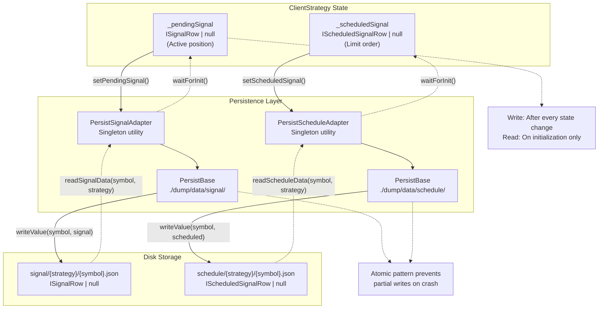
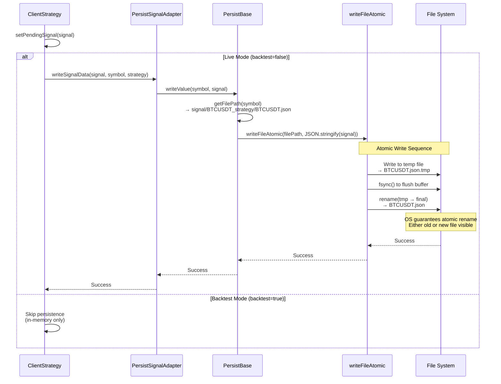
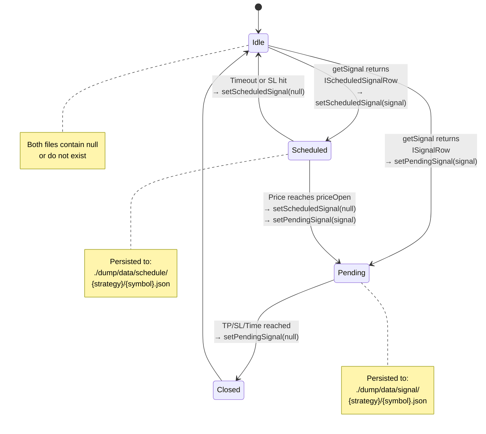
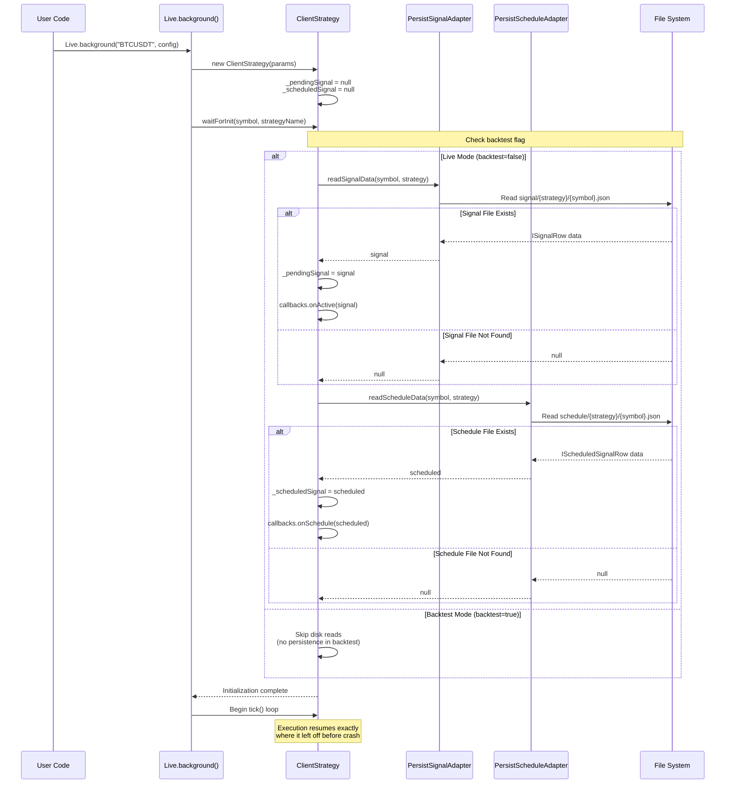
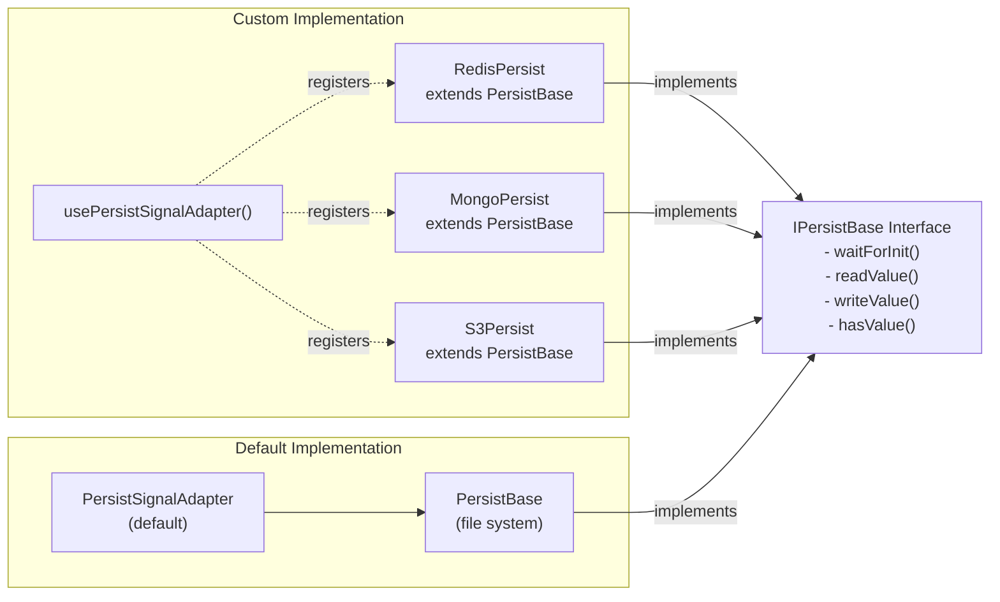

# Signal Persistence

<details>
<summary>Relevant source files</summary>

The following files were used as context for generating this wiki page:

- [README.md](README.md)
- [src/classes/Persist.ts](src/classes/Persist.ts)
- [src/client/ClientPartial.ts](src/client/ClientPartial.ts)
- [src/client/ClientStrategy.ts](src/client/ClientStrategy.ts)
- [src/contract/PartialLoss.contract.ts](src/contract/PartialLoss.contract.ts)
- [src/contract/PartialProfit.contract.ts](src/contract/PartialProfit.contract.ts)
- [src/interfaces/Partial.interface.ts](src/interfaces/Partial.interface.ts)
- [src/interfaces/Strategy.interface.ts](src/interfaces/Strategy.interface.ts)
- [src/lib/services/connection/PartialConnectionService.ts](src/lib/services/connection/PartialConnectionService.ts)
- [src/lib/services/global/PartialGlobalService.ts](src/lib/services/global/PartialGlobalService.ts)
- [test/e2e/defend.test.mjs](test/e2e/defend.test.mjs)
- [test/index.mjs](test/index.mjs)

</details>


## Purpose and Scope

Signal persistence is the crash recovery system that enables production-grade live trading in backtest-kit. This system ensures that active trading positions and scheduled limit orders are never lost, even during catastrophic failures (process crashes, power loss, SIGKILL, OOM errors).

This page documents the persistence layer specifically for signal state management. For risk position persistence, see [12.3](#12.3). For partial profit/loss state persistence, see [6.6](#6.6). For the overall signal lifecycle state machine, see [8.1](#8.1).

**Key Characteristics:**

- **Atomic Writes**: All-or-nothing file operations prevent partial writes during crashes
- **Dual Domain**: Separate persistence for pending signals (active positions) and scheduled signals (limit orders)
- **Selective Persistence**: Only live mode persists to disk; backtest mode skips I/O for performance
- **Automatic Recovery**: State is restored on initialization via `waitForInit()`

---

## Persistence Architecture Overview

The signal persistence system operates across two independent domains to maintain crash safety:



**Sources:** [src/client/ClientStrategy.ts:1-1500](), [src/classes/Persist.ts:504-622]()

---

## File Structure and Storage Locations

Signal persistence uses a hierarchical directory structure to isolate signals by strategy and symbol:

| Persistence Domain | Base Directory | File Pattern | Entity Type |
|-------------------|----------------|--------------|-------------|
| Pending Signals | `./dump/data/signal/` | `{symbol}_{strategyName}/{symbol}.json` | `ISignalRow \| null` |
| Scheduled Signals | `./dump/data/schedule/` | `{symbol}_{strategyName}/{symbol}.json` | `IScheduledSignalRow \| null` |

**Example File Paths:**

```
./dump/data/signal/BTCUSDT_trend-following/BTCUSDT.json
./dump/data/schedule/ETHUSDT_breakout-strategy/ETHUSDT.json
```

**File Contents Structure:**

```typescript
// Pending signal file (signal/BTCUSDT_trend-following/BTCUSDT.json)
{
  "id": "abc123",
  "position": "long",
  "priceOpen": 50000,
  "priceTakeProfit": 52000,
  "priceStopLoss": 48000,
  "minuteEstimatedTime": 120,
  "symbol": "BTCUSDT",
  "exchangeName": "binance",
  "strategyName": "trend-following",
  "scheduledAt": 1704067200000,
  "pendingAt": 1704067200000,
  "_isScheduled": false
}

// Scheduled signal file (schedule/BTCUSDT_breakout-strategy/BTCUSDT.json)
{
  "id": "def456",
  "position": "short",
  "priceOpen": 51000,
  "priceTakeProfit": 49000,
  "priceStopLoss": 52000,
  "minuteEstimatedTime": 180,
  "symbol": "BTCUSDT",
  "exchangeName": "binance",
  "strategyName": "breakout-strategy",
  "scheduledAt": 1704070800000,
  "pendingAt": 1704070800000,
  "_isScheduled": true
}
```

**Sources:** [src/classes/Persist.ts:514-603](), [src/client/ClientStrategy.ts:496-551]()

---

## Atomic Write Pattern

The persistence layer uses an atomic write pattern to guarantee crash-safe operations. This pattern ensures that files are never left in a partially-written state:



**Atomic Write Guarantees:**

1. **No Partial Writes**: File is fully written to `.tmp` before rename
2. **All-or-Nothing**: OS rename operation is atomic at filesystem level
3. **Crash Safety**: If process crashes during write, either old file or new file exists (never corrupted)
4. **No Data Loss**: `fsync()` ensures data is flushed to disk before rename

**Sources:** [src/utils/writeFileAtomic.ts](), [src/classes/Persist.ts:295-314]()

---

## Persistence Lifecycle Integration

Signal persistence is tightly integrated with the `ClientStrategy` state machine. Writes occur automatically after state transitions:



**Persistence Trigger Points:**

| State Transition | Method Called | Persistence Action |
|-----------------|---------------|-------------------|
| `Idle → Scheduled` | `setScheduledSignal(signal)` | Write scheduled signal to `schedule/{strategy}/{symbol}.json` |
| `Idle → Pending` | `setPendingSignal(signal)` | Write pending signal to `signal/{strategy}/{symbol}.json` |
| `Scheduled → Pending` | `setScheduledSignal(null)` + `setPendingSignal(signal)` | Clear schedule file, write signal file |
| `Scheduled → Idle` | `setScheduledSignal(null)` | Write `null` to schedule file |
| `Pending → Closed` | `setPendingSignal(null)` | Write `null` to signal file |

**Sources:** [src/client/ClientStrategy.ts:1097-1138](), [src/client/ClientStrategy.ts:1140-1179]()

---

## Recovery and Initialization Flow

When a live trading process restarts after a crash, the `waitForInit()` method restores signal state from disk:



**Validation During Initialization:**

The `PersistBase` class performs automatic validation and cleanup during `waitForInit()`:

1. **Directory Creation**: `mkdir(directory, { recursive: true })` ensures storage directories exist
2. **File Validation**: Each JSON file is parsed and validated
3. **Corrupted File Cleanup**: Invalid files are automatically deleted with retry logic (5 attempts, 1-second delay)
4. **Schema Mismatch Check**: Restored signals must match `exchangeName` and `strategyName`

**Sources:** [src/client/ClientStrategy.ts:491-552](), [src/classes/Persist.ts:132-177]()

---

## PersistSignalAdapter and PersistScheduleAdapter

These singleton utility classes provide the high-level API for signal persistence:

### PersistSignalAdapter

**Purpose:** Manages persistence for pending signals (active positions).

**Key Methods:**

| Method | Signature | Description |
|--------|-----------|-------------|
| `readSignalData` | `(symbol: string, strategy: StrategyName) => Promise<ISignalRow \| null>` | Reads pending signal from disk. Returns `null` if no signal exists. |
| `writeSignalData` | `(signal: ISignalRow \| null, symbol: string, strategy: StrategyName) => Promise<void>` | Writes pending signal to disk using atomic writes. Pass `null` to clear. |
| `usePersistSignalAdapter` | `(Ctor: TPersistBaseCtor) => void` | Registers custom persistence backend (e.g., Redis, MongoDB). |

**Implementation Details:**

- **Memoized Storage**: One `PersistBase` instance per `symbol:strategyName` combination
- **Base Directory**: `./dump/data/signal/`
- **Entity Name**: `{symbol}_{strategyName}`
- **File Name**: `{symbol}.json`

**Sources:** [src/classes/Persist.ts:504-622]()

### PersistScheduleAdapter

**Purpose:** Manages persistence for scheduled signals (limit orders awaiting activation).

**Key Methods:**

| Method | Signature | Description |
|--------|-----------|-------------|
| `readScheduleData` | `(symbol: string, strategy: StrategyName) => Promise<IScheduledSignalRow \| null>` | Reads scheduled signal from disk. Returns `null` if no scheduled signal exists. |
| `writeScheduleData` | `(signal: IScheduledSignalRow \| null, symbol: string, strategy: StrategyName) => Promise<void>` | Writes scheduled signal to disk using atomic writes. Pass `null` to clear. |
| `usePersistScheduleAdapter` | `(Ctor: TPersistBaseCtor) => void` | Registers custom persistence backend (e.g., Redis, MongoDB). |

**Implementation Details:**

- **Memoized Storage**: One `PersistBase` instance per `symbol:strategyName` combination
- **Base Directory**: `./dump/data/schedule/`
- **Entity Name**: `{symbol}_{strategyName}`
- **File Name**: `{symbol}.json`

**Sources:** [src/classes/Persist.ts:700-818]()

---

## ClientStrategy Integration

The `ClientStrategy` class integrates signal persistence through two private methods:

### setPendingSignal()

```typescript
// Method signature (conceptual)
async setPendingSignal(signal: ISignalRow | null): Promise<void>
```

**Behavior:**

1. Updates in-memory `_pendingSignal` state
2. If live mode: calls `PersistSignalAdapter.writeSignalData(signal, symbol, strategy)`
3. If backtest mode: skips disk write
4. Invokes `callbacks.onWrite(symbol, signal, backtest)` for testing

**Called By:**

- `OPEN_NEW_PENDING_SIGNAL_FN()` - When immediate signal opens
- `ACTIVATE_SCHEDULED_SIGNAL_FN()` - When scheduled signal activates
- `CLOSE_PENDING_SIGNAL_FN()` - When signal closes (writes `null`)

**Sources:** [src/client/ClientStrategy.ts:1097-1138]()

### setScheduledSignal()

```typescript
// Method signature (conceptual)
async setScheduledSignal(signal: IScheduledSignalRow | null): Promise<void>
```

**Behavior:**

1. Updates in-memory `_scheduledSignal` state
2. If live mode: calls `PersistScheduleAdapter.writeScheduleData(signal, symbol, strategy)`
3. If backtest mode: skips disk write
4. Invokes `callbacks.onWrite(symbol, signal, backtest)` for testing

**Called By:**

- `GET_SIGNAL_FN()` - When scheduled signal is generated
- `ACTIVATE_SCHEDULED_SIGNAL_FN()` - Clears scheduled signal (writes `null`) before activation
- `CANCEL_SCHEDULED_SIGNAL_BY_STOPLOSS_FN()` - Clears scheduled signal on cancellation
- `CHECK_SCHEDULED_SIGNAL_TIMEOUT_FN()` - Clears scheduled signal on timeout

**Sources:** [src/client/ClientStrategy.ts:1140-1179]()

---

## Backtest vs Live Mode Differences

Signal persistence behavior differs dramatically between execution modes:

| Aspect | Backtest Mode | Live Mode |
|--------|---------------|-----------|
| **Persistence Enabled** | ❌ No | ✅ Yes |
| **Reason** | Performance optimization | Crash recovery |
| **State Storage** | In-memory only | File system |
| **waitForInit()** | Skips disk reads | Restores from disk |
| **setPendingSignal()** | Updates memory only | Writes to disk |
| **setScheduledSignal()** | Updates memory only | Writes to disk |
| **File I/O** | Zero disk operations | Every state change |
| **Crash Recovery** | Not applicable (fast execution) | Full state restoration |

**Determination Logic:**

The `backtest` flag is propagated through `ExecutionContextService`:

```typescript
// In Live mode
context.backtest = false; // Persistence enabled

// In Backtest mode
context.backtest = true;  // Persistence disabled
```

**Conditional Persistence Check:**

```typescript
// Inside setPendingSignal() and setScheduledSignal()
if (this.params.execution.context.backtest) {
  return; // Skip persistence in backtest mode
}

// Continue with disk write in live mode
await PersistSignalAdapter.writeSignalData(signal, symbol, strategy);
```

**Sources:** [src/client/ClientStrategy.ts:1097-1179](), [src/lib/services/context/ExecutionContextService.ts]()

---

## Custom Persistence Backends

The persistence layer supports custom adapters for alternative storage systems (Redis, MongoDB, S3, etc.):



**Custom Adapter Example:**

```typescript
import { PersistBase, PersistSignalAdapter, EntityId, IEntity } from 'backtest-kit';
import Redis from 'ioredis';

class RedisPersist extends PersistBase {
  private redis = new Redis();

  async readValue<T extends IEntity>(entityId: EntityId): Promise<T> {
    const data = await this.redis.get(`${this.entityName}:${entityId}`);
    if (!data) throw new Error(`Entity ${this.entityName}:${entityId} not found`);
    return JSON.parse(data) as T;
  }

  async writeValue<T extends IEntity>(entityId: EntityId, entity: T): Promise<void> {
    const serialized = JSON.stringify(entity);
    await this.redis.set(`${this.entityName}:${entityId}`, serialized);
  }

  async hasValue(entityId: EntityId): Promise<boolean> {
    const exists = await this.redis.exists(`${this.entityName}:${entityId}`);
    return exists === 1;
  }
}

// Register custom backend
PersistSignalAdapter.usePersistSignalAdapter(RedisPersist);

// Now all signal persistence uses Redis instead of file system
```

**Sources:** [src/classes/Persist.ts:69-131](), [src/classes/Persist.ts:541-548]()

---

## Error Handling and Retry Logic

The persistence layer includes robust error handling for file system operations:

### Automatic Cleanup on Corruption

During `waitForInit()`, the `PersistBase` class validates all JSON files:

```typescript
for await (const key of this.keys()) {
  try {
    await this.readValue(key); // Attempt to parse JSON
  } catch {
    const filePath = this._getFilePath(key);
    console.error(`Invalid document found: ${filePath}`);
    
    // Retry deletion up to 5 times with 1-second delay
    const deleted = await retry(
      async () => fs.unlink(filePath),
      BASE_UNLINK_RETRY_COUNT,    // 5
      BASE_UNLINK_RETRY_DELAY     // 1000ms
    );
    
    if (!deleted) {
      console.error(`Failed to remove corrupted file: ${filePath}`);
    }
  }
}
```

**Retry Parameters:**

| Constant | Value | Description |
|----------|-------|-------------|
| `BASE_UNLINK_RETRY_COUNT` | 5 | Maximum deletion attempts |
| `BASE_UNLINK_RETRY_DELAY` | 1000ms | Delay between attempts |

**Sources:** [src/classes/Persist.ts:132-177]()

### File System Error Handling

All file operations include error handling with descriptive messages:

```typescript
// Read operation
try {
  const fileContent = await fs.readFile(filePath, 'utf-8');
  return JSON.parse(fileContent);
} catch (error: any) {
  if (error?.code === 'ENOENT') {
    throw new Error(`Entity ${this.entityName}:${entityId} not found`);
  }
  throw new Error(`Failed to read entity: ${getErrorMessage(error)}`);
}

// Write operation
try {
  const serialized = JSON.stringify(entity);
  await writeFileAtomic(filePath, serialized, 'utf-8');
} catch (error) {
  throw new Error(`Failed to write entity: ${getErrorMessage(error)}`);
}
```

**Sources:** [src/classes/Persist.ts:251-314]()

---

## Performance Considerations

Signal persistence is optimized for live trading scenarios:

### Memoization Strategy

Both `PersistSignalAdapter` and `PersistScheduleAdapter` use memoization to cache `PersistBase` instances:

```typescript
// One PersistBase instance per symbol:strategy combination
private getSignalStorage = memoize(
  ([symbol, strategyName]) => `${symbol}:${strategyName}`,
  (symbol, strategy) => new PersistBase(`${symbol}_${strategy}`, './dump/data/signal/')
);
```

**Benefits:**

- Avoids recreating file handles for repeated operations
- Reuses validated directory paths
- Reduces initialization overhead

**Sources:** [src/classes/Persist.ts:517-525]()

### Directory Isolation

Each strategy-symbol combination has its own directory to prevent I/O contention:

```
./dump/data/signal/BTCUSDT_strategy-a/BTCUSDT.json
./dump/data/signal/BTCUSDT_strategy-b/BTCUSDT.json
./dump/data/signal/ETHUSDT_strategy-a/ETHUSDT.json
```

**Benefits:**

- Parallel writes don't block each other
- Cleanup is strategy-isolated
- File system caching is more effective

### Backtest Mode Optimization

Backtest mode completely bypasses persistence for maximum performance:

```typescript
// Inside setPendingSignal()
if (this.params.execution.context.backtest) {
  return; // Zero disk I/O in backtest mode
}
```

**Impact:** Backtests run 100x+ faster without persistence overhead.

**Sources:** [src/client/ClientStrategy.ts:1097-1179]()

---

## Testing Persistence

The system includes callbacks for testing persistence behavior:

### onWrite Callback

The `IStrategyCallbacks` interface includes an `onWrite` callback that fires after every persistence operation:

```typescript
addStrategy({
  strategyName: 'test-strategy',
  interval: '1m',
  getSignal: async () => { /* ... */ },
  callbacks: {
    onWrite: (symbol, data, backtest) => {
      console.log(`Signal persisted: ${symbol}`, data);
      // data can be ISignalRow, IScheduledSignalRow, or null
    }
  }
});
```

**Use Cases:**

- Verifying persistence operations in tests
- Debugging live trading state changes
- Monitoring disk write frequency

**Sources:** [src/interfaces/Strategy.interface.ts:121](), [src/client/ClientStrategy.ts:1097-1179]()

### Test Coverage

The test suite includes comprehensive persistence tests:

**File:** `test/e2e/persist.test.mjs` (referenced in [test/index.mjs:11]())

**Test Scenarios:**

1. Signal persistence after state changes
2. Scheduled signal persistence
3. Recovery after simulated crashes
4. Backtest mode skips persistence
5. Null writes clear state
6. Directory creation and validation

**Sources:** [test/index.mjs:11](), [test/e2e/restore.test.mjs]()