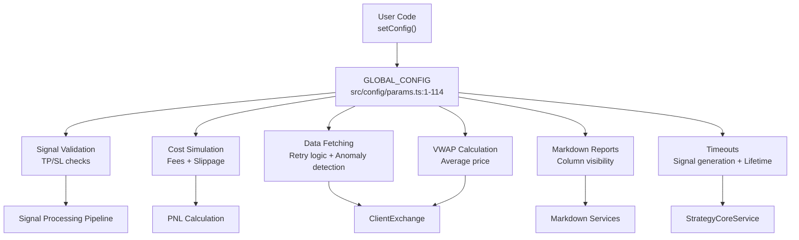
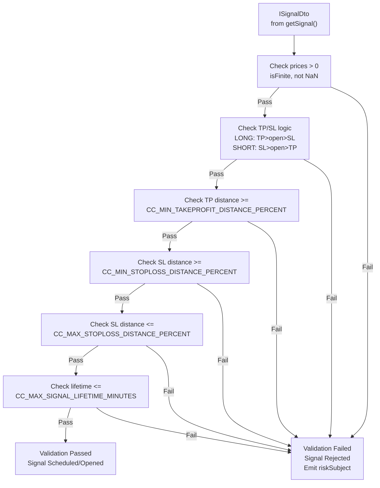
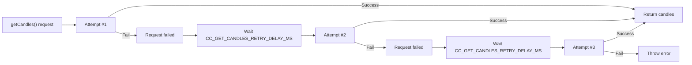
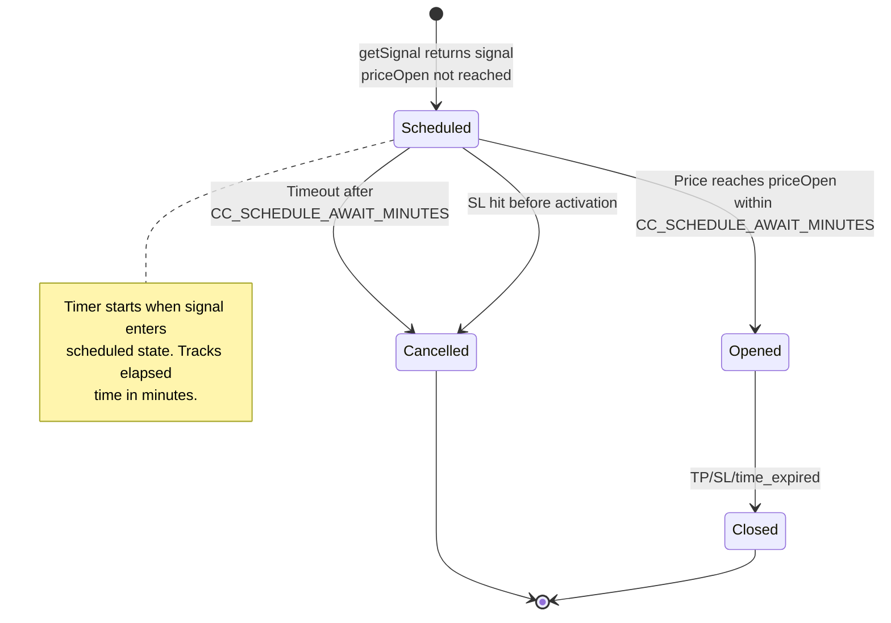
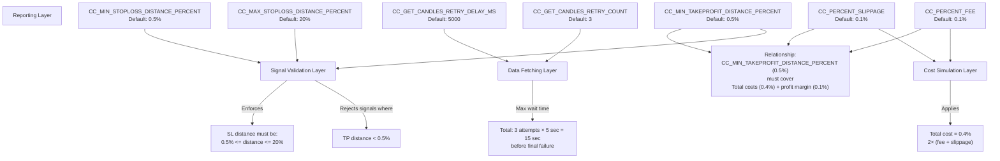

# Configuration Reference

This page documents the global configuration system in Backtest Kit, including all `GLOBAL_CONFIG` parameters, their purposes, default values, and how they affect system behavior. Configuration controls signal validation, cost simulation, data fetching, and reporting across all execution modes.

For defining custom trading strategies, see [Strategy Development](./25_strategy-development.md). For risk validation rules, see [Risk Management](./31_risk-management.md). For logger setup, see [Logger Configuration](./52_configuration-reference.md).

---

## Configuration System Overview

Backtest Kit uses a global configuration object (`GLOBAL_CONFIG`) that controls system-wide behavior. All parameters use the `CC_` prefix convention for clarity. Configuration is set via the `setConfig()` function and affects all execution modes (Backtest, Live, Walker).

**Configuration Flow Diagram:**



Sources: [src/config/params.ts:1-122](), [README.md:46-63]()

---

## Setting Configuration

Configuration is set using the `setConfig()` function with a partial configuration object. Only specified parameters are updated; unspecified parameters retain their default values.

```typescript
import { setConfig } from 'backtest-kit';

setConfig({
  CC_PERCENT_SLIPPAGE: 0.15,      // Override slippage to 0.15%
  CC_PERCENT_FEE: 0.08,            // Override fee to 0.08%
  CC_MIN_TAKEPROFIT_DISTANCE_PERCENT: 0.6,
});
```

**Test mode override** (second parameter forces reset to defaults first):

```typescript
setConfig({
  CC_MAX_STOPLOSS_DISTANCE_PERCENT: 100,  // Allow any SL distance
}, true);  // Reset to defaults first, then apply overrides
```

Sources: [README.md:46-63](), [test/config/setup.mjs:89-102]()

---

## Configuration Parameters by Category

### Cost Simulation Parameters

These parameters simulate real-world trading costs applied to all signals.

| Parameter | Default | Description |
|-----------|---------|-------------|
| `CC_PERCENT_SLIPPAGE` | `0.1` | Slippage percentage per transaction (applied 2×: entry + exit). Simulates market impact and order book depth. |
| `CC_PERCENT_FEE` | `0.1` | Fee percentage per transaction (applied 2×: entry + exit). Total effective cost = 0.4% (0.2% fees + 0.2% slippage). |

**Cost Calculation Example:**

```
Entry:  -0.1% fee - 0.1% slippage = -0.2%
Exit:   -0.1% fee - 0.1% slippage = -0.2%
Total:  -0.4% cost per round trip
```

To achieve profitable trades, `priceTakeProfit` must provide at least 0.5% distance from `priceOpen` to cover these costs plus minimum profit margin.

Sources: [src/config/params.ts:13-24]()

---

### Signal Validation Parameters

These parameters enforce safety constraints on signal geometry, preventing dangerous configurations.

| Parameter | Default | Description |
|-----------|---------|-------------|
| `CC_MIN_TAKEPROFIT_DISTANCE_PERCENT` | `0.5` | Minimum TP distance from `priceOpen`. Ensures profit covers fees (0.2%) + slippage (0.2%) + minimum margin (0.1%). |
| `CC_MIN_STOPLOSS_DISTANCE_PERCENT` | `0.5` | Minimum SL distance from `priceOpen`. Prevents instant stop-out due to normal price volatility. |
| `CC_MAX_STOPLOSS_DISTANCE_PERCENT` | `20` | Maximum SL distance from `priceOpen`. Prevents catastrophic losses (one signal cannot lose >20% of position). |
| `CC_MAX_SIGNAL_LIFETIME_MINUTES` | `1440` | Maximum signal lifetime in minutes (default: 1 day). Prevents "eternal" signals that block risk limits indefinitely. |

**Validation Logic Diagram:**



**Example: Signal rejected by TP distance validation**

```typescript
// This signal will be REJECTED
getSignal: async () => ({
  position: 'long',
  priceOpen: 42000,
  priceTakeProfit: 42010,  // Only 0.024% profit - below 0.5% minimum
  priceStopLoss: 41000,
  minuteEstimatedTime: 60,
})
// Result: Validation error, signal not executed
// Reason: TP distance (0.024%) < CC_MIN_TAKEPROFIT_DISTANCE_PERCENT (0.5%)
```

Sources: [src/config/params.ts:25-56](), [test/e2e/sanitize.test.mjs:27-122]()

---

### Data Fetching & Retry Parameters

These parameters control how candle data is fetched from exchanges and how anomalies are detected.

| Parameter | Default | Description |
|-----------|---------|-------------|
| `CC_GET_CANDLES_RETRY_COUNT` | `3` | Number of retry attempts for `getCandles()` function when exchange requests fail. |
| `CC_GET_CANDLES_RETRY_DELAY_MS` | `5000` | Delay in milliseconds between retry attempts (5 seconds). |
| `CC_GET_CANDLES_PRICE_ANOMALY_THRESHOLD_FACTOR` | `1000` | Maximum allowed deviation factor for price anomaly detection. Price should not be more than this factor lower than reference price. Catches incomplete candles with prices near $0. |
| `CC_GET_CANDLES_MIN_CANDLES_FOR_MEDIAN` | `5` | Minimum number of candles required for reliable median calculation. Below this threshold, simple average is used instead of median. |

**Anomaly Detection Rationale:**

Incomplete candles from exchange APIs (e.g., Binance) typically have prices near $0 (e.g., $0.01-1) while normal BTC prices range $20,000-100,000. Factor 1000 catches prices below $20-100 when median is $20,000-100,000.

```
Example: BTC median = $50,000
Threshold = $50,000 / 1000 = $50
Anomaly detected: Price $0.01 < $50 → Reject candle
```

**Retry Logic Flow:**



Sources: [src/config/params.ts:66-104]()

---

### VWAP Calculation Parameters

These parameters control Volume Weighted Average Price calculation used for realistic entry/exit pricing.

| Parameter | Default | Description |
|-----------|---------|-------------|
| `CC_AVG_PRICE_CANDLES_COUNT` | `5` | Number of candles to use for VWAP calculation. Default uses last 5 1-minute candles when interval is `1m`. |

**VWAP Calculation Formula:**

```
VWAP = Σ(price × volume) / Σ(volume)

Where:
- price = (high + low + close) / 3 (typical price)
- Summation over last CC_AVG_PRICE_CANDLES_COUNT candles
- Fallback to simple average if total volume = 0
```

**Usage in Signal Lifecycle:**

1. **Scheduled Signal Activation**: When `priceOpen` is reached, VWAP is used as actual entry price
2. **Signal Closure**: TP/SL prices are compared against VWAP (not raw candle close)
3. **PNL Calculation**: Entry and exit prices use VWAP for realistic execution simulation

Sources: [src/config/params.ts:6-11]()

---

### Timing & Timeout Parameters

These parameters control time-based constraints and limits.

| Parameter | Default | Description |
|-----------|---------|-------------|
| `CC_SCHEDULE_AWAIT_MINUTES` | `120` | Time to wait for scheduled signal to activate (in minutes). If signal does not activate within this time, it will be cancelled. Default: 2 hours. |
| `CC_MAX_SIGNAL_GENERATION_SECONDS` | `180` | Maximum time allowed for signal generation (in seconds). Prevents long-running or stuck `getSignal()` routines from blocking execution. Default: 3 minutes. |

**Scheduled Signal Timeout Diagram:**



Sources: [src/config/params.ts:3-6](), [src/config/params.ts:57-64]()

---

### Reporting Configuration Parameters

These parameters control markdown report generation and visibility.

| Parameter | Default | Description |
|-----------|---------|-------------|
| `CC_REPORT_SHOW_SIGNAL_NOTE` | `false` | Controls visibility of signal notes in markdown report tables. When enabled, "Note" column is displayed in all reports (backtest, live, schedule, risk, etc.). Default: hidden to reduce table width. |

**Report Column Impact:**

When `CC_REPORT_SHOW_SIGNAL_NOTE = true`:

```markdown
| Symbol   | Position | Open    | TP      | SL      | Note              | Status |
|----------|----------|---------|---------|---------|-------------------|--------|
| BTCUSDT  | long     | 42000   | 43000   | 41000   | Test signal #1    | closed |
| ETHUSDT  | short    | 3000    | 2800    | 3200    | Momentum reversal | opened |
```

When `CC_REPORT_SHOW_SIGNAL_NOTE = false` (default):

```markdown
| Symbol   | Position | Open    | TP      | SL      | Status |
|----------|----------|---------|---------|---------|--------|
| BTCUSDT  | long     | 42000   | 43000   | 41000   | closed |
| ETHUSDT  | short    | 3000    | 2800    | 3200    | opened |
```

Sources: [src/config/params.ts:106-114]()

---

## Parameter Relationships & Dependencies

**Configuration Impact Map:**



Sources: [src/config/params.ts:25-56]()

---

## Default Configuration Object

The complete default configuration is defined in `DEFAULT_CONFIG` constant:

```typescript
export const DEFAULT_CONFIG = Object.freeze({
  CC_SCHEDULE_AWAIT_MINUTES: 120,
  CC_AVG_PRICE_CANDLES_COUNT: 5,
  CC_PERCENT_SLIPPAGE: 0.1,
  CC_PERCENT_FEE: 0.1,
  CC_MIN_TAKEPROFIT_DISTANCE_PERCENT: 0.5,
  CC_MIN_STOPLOSS_DISTANCE_PERCENT: 0.5,
  CC_MAX_STOPLOSS_DISTANCE_PERCENT: 20,
  CC_MAX_SIGNAL_LIFETIME_MINUTES: 1440,
  CC_MAX_SIGNAL_GENERATION_SECONDS: 180,
  CC_GET_CANDLES_RETRY_COUNT: 3,
  CC_GET_CANDLES_RETRY_DELAY_MS: 5000,
  CC_GET_CANDLES_PRICE_ANOMALY_THRESHOLD_FACTOR: 1000,
  CC_GET_CANDLES_MIN_CANDLES_FOR_MEDIAN: 5,
  CC_REPORT_SHOW_SIGNAL_NOTE: false,
});
```

This object is frozen to prevent accidental mutations. Use `setConfig()` to apply changes.

Sources: [src/config/params.ts:116-122]()

---

## Configuration in Test Environment

Test environments often require different configuration to speed up execution or disable validation:

```typescript
setConfig({
  CC_MIN_TAKEPROFIT_DISTANCE_PERCENT: 0,      // Disable TP validation
  CC_MIN_STOPLOSS_DISTANCE_PERCENT: 0,        // Disable SL validation
  CC_MAX_STOPLOSS_DISTANCE_PERCENT: 100,      // Allow any SL distance
  CC_MAX_SIGNAL_LIFETIME_MINUTES: 999999,     // Allow any lifetime
  CC_GET_CANDLES_RETRY_COUNT: 1,              // Disable retries for speed
  CC_GET_CANDLES_RETRY_DELAY_MS: 100,         // Minimal retry delay
}, true);  // Reset to defaults first
```

This allows testing extreme edge cases without validation interference.

Sources: [test/config/setup.mjs:89-102]()

---

## Configuration Best Practices

### Production Configuration

For live trading, use conservative validation:

```typescript
setConfig({
  CC_PERCENT_SLIPPAGE: 0.15,                     // Higher slippage for safety
  CC_PERCENT_FEE: 0.1,                           // Actual exchange fee
  CC_MIN_TAKEPROFIT_DISTANCE_PERCENT: 0.8,       // Higher minimum for profitability
  CC_MAX_STOPLOSS_DISTANCE_PERCENT: 10,          // Lower max for capital protection
  CC_SCHEDULE_AWAIT_MINUTES: 60,                 // Shorter timeout for faster cancellation
});
```

### Backtesting Configuration

For historical simulation with realistic costs:

```typescript
setConfig({
  CC_PERCENT_SLIPPAGE: 0.1,                      // Standard slippage
  CC_PERCENT_FEE: 0.1,                           // Standard fee
  CC_MIN_TAKEPROFIT_DISTANCE_PERCENT: 0.5,       // Default validation
  // Keep other parameters at defaults
});
```

### High-Frequency Strategy Configuration

For strategies generating frequent signals:

```typescript
setConfig({
  CC_MAX_SIGNAL_LIFETIME_MINUTES: 60,            // Max 1 hour per signal
  CC_SCHEDULE_AWAIT_MINUTES: 10,                 // Fast cancellation
  CC_MIN_TAKEPROFIT_DISTANCE_PERCENT: 0.3,       // Allow smaller profits
  CC_AVG_PRICE_CANDLES_COUNT: 3,                 // Faster VWAP response
});
```

Sources: [README.md:56-63]()

---

## Configuration Type Definition

```typescript
export type GlobalConfig = {
  CC_SCHEDULE_AWAIT_MINUTES: number;
  CC_AVG_PRICE_CANDLES_COUNT: number;
  CC_PERCENT_SLIPPAGE: number;
  CC_PERCENT_FEE: number;
  CC_MIN_TAKEPROFIT_DISTANCE_PERCENT: number;
  CC_MIN_STOPLOSS_DISTANCE_PERCENT: number;
  CC_MAX_STOPLOSS_DISTANCE_PERCENT: number;
  CC_MAX_SIGNAL_LIFETIME_MINUTES: number;
  CC_MAX_SIGNAL_GENERATION_SECONDS: number;
  CC_GET_CANDLES_RETRY_COUNT: number;
  CC_GET_CANDLES_RETRY_DELAY_MS: number;
  CC_GET_CANDLES_PRICE_ANOMALY_THRESHOLD_FACTOR: number;
  CC_GET_CANDLES_MIN_CANDLES_FOR_MEDIAN: number;
  CC_REPORT_SHOW_SIGNAL_NOTE: boolean;
};
```

All configuration parameters are strongly typed. TypeScript will enforce correct parameter names and types when calling `setConfig()`.

Sources: [src/config/params.ts:118-122]()