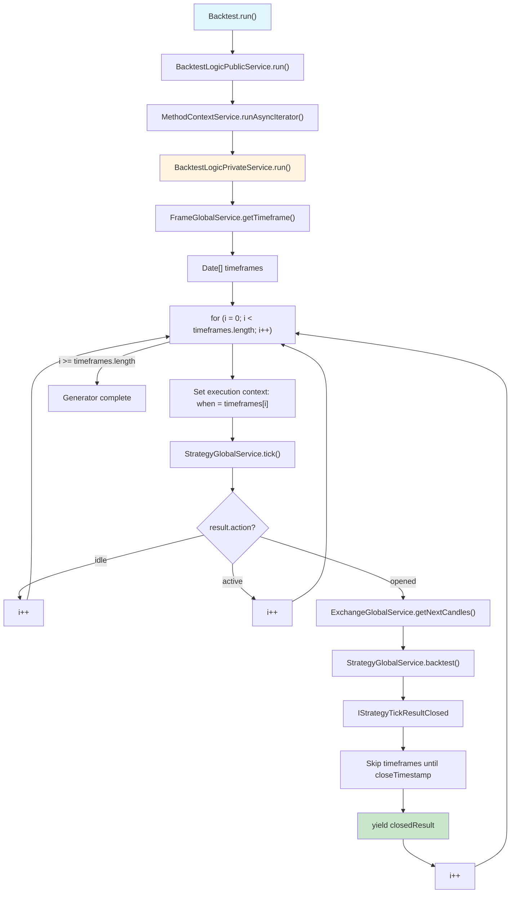
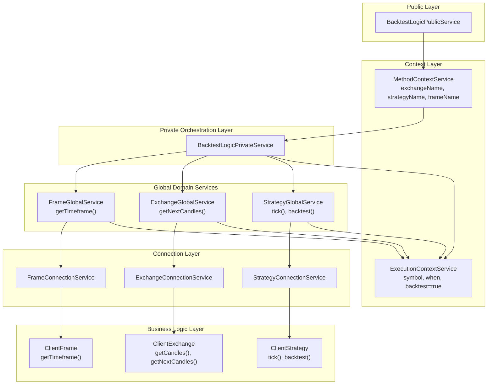
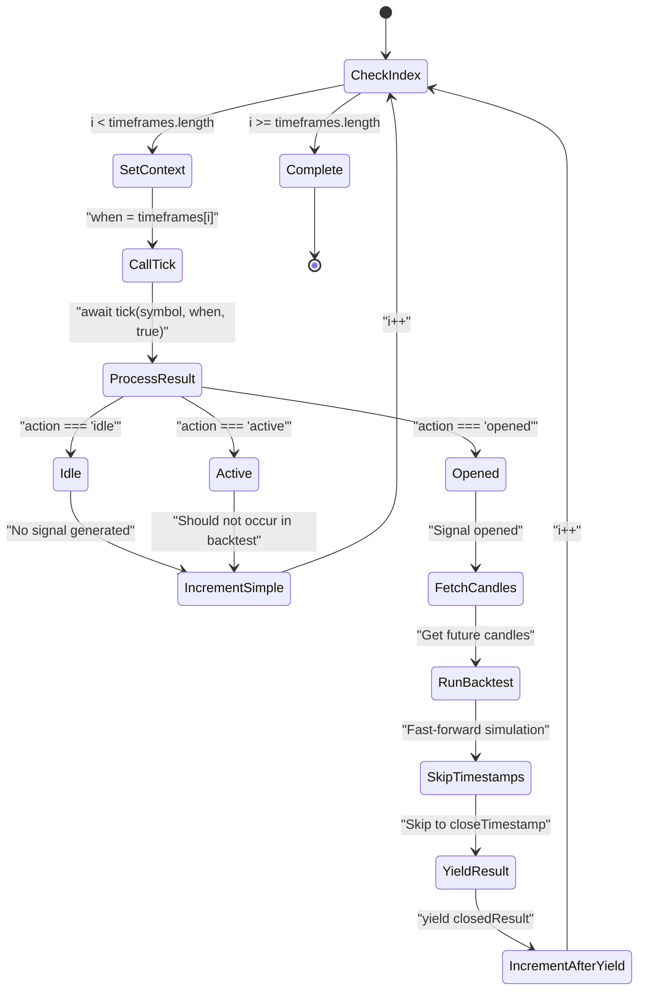
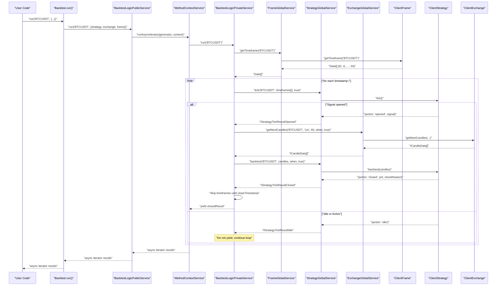

# Backtest Execution Flow

<details>
<summary>Relevant source files</summary>

The following files were used as context for generating this wiki page:

- [src/client/ClientExchange.ts](src/client/ClientExchange.ts)
- [src/lib/services/logic/private/BacktestLogicPrivateService.ts](src/lib/services/logic/private/BacktestLogicPrivateService.ts)
- [src/lib/services/logic/private/LiveLogicPrivateService.ts](src/lib/services/logic/private/LiveLogicPrivateService.ts)
- [src/lib/services/logic/private/WalkerLogicPrivateService.ts](src/lib/services/logic/private/WalkerLogicPrivateService.ts)

</details>


## Purpose and Scope

This document explains the step-by-step orchestration of backtesting execution through historical timeframes, focusing on the `BacktestLogicPrivateService` and its coordination with frame generation, signal processing, and candle data retrieval. The backtest execution uses an async generator pattern for memory-efficient streaming of results.

For information about configuring backtests and the Public API, see [Backtest API](#3.2). For details on timeframe generation itself, see [Timeframe Generation](#7.2). For the fast-forward simulation algorithm that processes opened signals, see [Fast-Forward Simulation](#7.3).

---

## Execution Flow Overview

The backtest execution follows a pipeline where `BacktestLogicPrivateService` orchestrates the flow through three major service domains: Frame (timeframe generation), Strategy (signal lifecycle), and Exchange (historical data). The process streams results as an async generator, allowing early termination and preventing memory overflow on large backtests.

**High-Level Execution Sequence**



**Sources:** [src/lib/services/logic/private/BacktestLogicPrivateService.ts:1-123](), [src/lib/services/logic/public/BacktestLogicPublicService.ts:1-70]()

---

## Service Layer Architecture

The backtest execution involves multiple service layers with clear separation of concerns. The Public service handles context injection, the Private service orchestrates the execution loop, and Global services provide domain-specific operations.

**Service Layer Interaction Diagram**



**Sources:** [src/lib/services/logic/public/BacktestLogicPublicService.ts:1-70](), [src/lib/services/logic/private/BacktestLogicPrivateService.ts:1-123](), [src/lib/services/context/MethodContextService.ts:1-56]()

---

## Execution Steps in Detail

### Step 1: Context Initialization

The `BacktestLogicPublicService.run()` method wraps the private service with `MethodContextService.runAsyncIterator()` to propagate context through all operations.

**Context Propagation**

| Context Type | Service | Purpose |
|--------------|---------|---------|
| Method Context | `MethodContextService` | Routes to correct strategy/exchange/frame schemas |
| Execution Context | `ExecutionContextService` | Provides symbol, current timestamp (when), backtest flag |

**Sources:** [src/lib/services/logic/public/BacktestLogicPublicService.ts:46-67](), [src/lib/services/context/MethodContextService.ts:1-56]()

### Step 2: Timeframe Array Generation

The private service begins by fetching the complete timeframe array from `FrameGlobalService.getTimeframe()`. This array contains all timestamps to iterate through, spaced according to the configured interval.

```typescript
// From BacktestLogicPrivateService.run()
const timeframes = await this.frameGlobalService.getTimeframe(symbol);
```

The timeframe generation is configured via `addFrame()` and handled by `ClientFrame`. For a 24-hour backtest with 1-minute intervals, this produces 1,440 timestamps.

**Sources:** [src/lib/services/logic/private/BacktestLogicPrivateService.ts:48-58](), [src/interfaces/Frame.interface.ts:1-108]()

### Step 3: Timestamp Iteration Loop

The service iterates through the timeframe array using a while loop with manual index management. This allows skipping timestamps when signals close.



**Sources:** [src/lib/services/logic/private/BacktestLogicPrivateService.ts:48-119]()

### Step 4: Tick Execution

For each timestamp, the service calls `StrategyGlobalService.tick()` with `backtest=true`. This executes the strategy's signal generation and validation logic.

**Tick Results by Action**

| Action | Description | Next Step |
|--------|-------------|-----------|
| `idle` | No signal generated, throttling interval not elapsed | Increment `i++` and continue |
| `active` | Should not occur in backtest mode (signals open and immediately backtest) | Increment `i++` and continue |
| `opened` | New signal generated and validated | Proceed to fast-forward simulation |

**Sources:** [src/lib/services/logic/private/BacktestLogicPrivateService.ts:60-115](), [src/client/ClientStrategy.ts:258-464]()

---

## Signal Opening and Fast-Forward Simulation

When a signal opens (`result.action === "opened"`), the backtest flow transitions to fast-forward simulation mode rather than iterating through every timestamp manually.

**Fast-Forward Execution Flow**

```mermaid
sequenceDiagram
    participant Loop as "BacktestLogicPrivateService<br/>Iteration Loop"
    participant StratGlobal as "StrategyGlobalService"
    participant ExchGlobal as "ExchangeGlobalService"
    participant ClientStrat as "ClientStrategy"
    
    Loop->>StratGlobal: tick(symbol, when, true)
    StratGlobal->>ClientStrat: tick()
    ClientStrat-->>StratGlobal: {action: "opened", signal}
    StratGlobal-->>Loop: IStrategyTickResultOpened
    
    Note over Loop: Signal detected!<br/>minuteEstimatedTime = 60
    
    Loop->>ExchGlobal: getNextCandles(symbol, "1m", 60, when, true)
    ExchGlobal-->>Loop: ICandleData[] (60 candles)
    
    Note over Loop: Pass candles to backtest()
    
    Loop->>StratGlobal: backtest(symbol, candles, when, true)
    StratGlobal->>ClientStrat: backtest(candles)
    
    Note over ClientStrat: Iterate through candles<br/>Check VWAP vs TP/SL<br/>Calculate PnL
    
    ClientStrat-->>StratGlobal: {action: "closed", closeTimestamp, pnl}
    StratGlobal-->>Loop: IStrategyTickResultClosed
    
    Note over Loop: Skip timeframes until closeTimestamp
    Loop->>Loop: "while (timeframes[i] < closeTimestamp) i++"
    
    Loop->>Loop: yield closedResult
```

**Sources:** [src/lib/services/logic/private/BacktestLogicPrivateService.ts:62-114](), [src/client/ClientStrategy.ts:485-656]()

### Candle Fetching

The service fetches future candles using `ExchangeGlobalService.getNextCandles()` with the signal's `minuteEstimatedTime` parameter. This retrieves exactly the number of candles needed to simulate the signal's lifecycle.

```typescript
// From BacktestLogicPrivateService at line 73-79
const candles = await this.exchangeGlobalService.getNextCandles(
  symbol,
  "1m",
  signal.minuteEstimatedTime,
  when,
  true
);
```

If no candles are returned (end of historical data), the generator terminates early.

**Sources:** [src/lib/services/logic/private/BacktestLogicPrivateService.ts:72-83]()

### Backtest Method Execution

The `ClientStrategy.backtest()` method receives the candle array and iterates through it, calculating VWAP from rolling 5-candle windows and checking for TP/SL hits. The method always returns a closed result.

**Backtest Algorithm Summary**

1. Start iteration at index 4 (need 5 candles for VWAP)
2. For each candle, calculate VWAP from `candles[i-4:i+1]`
3. Check if VWAP hits take profit or stop loss
4. If hit: return closed result with that timestamp and PnL
5. If no hit by end: return closed result with `closeReason="time_expired"`

**Sources:** [src/client/ClientStrategy.ts:485-656]()

---

## Timestamp Skipping Logic

After receiving a closed result from `backtest()`, the iteration loop skips all timestamps between the current position and the signal's `closeTimestamp`. This prevents re-opening signals during periods when a signal was already active.

**Skip Loop Implementation**

```typescript
// From BacktestLogicPrivateService at line 107-112
while (
  i < timeframes.length &&
  timeframes[i].getTime() < backtestResult.closeTimestamp
) {
  i++;
}
```

**Skipping Example Visualization**

```mermaid
graph LR
    T0["timeframes[0]<br/>10:00:00"] --> T1["timeframes[1]<br/>10:01:00"]
    T1 --> T2["timeframes[2]<br/>10:02:00"]
    T2 -.->|"Signal opened<br/>minuteEstimatedTime=60"| T3["timeframes[3]<br/>10:03:00"]
    T3 -.-> T4["..."]
    T4 -.-> T61["timeframes[62]<br/>11:02:00"]
    T61 -.->|"closeTimestamp=11:02:00<br/>Skip to here"| T62["timeframes[63]<br/>11:03:00"]
    T62 --> T63["timeframes[64]<br/>11:04:00"]
    
    style T2 fill:#c8e6c9
    style T3 fill:#e0e0e0
    style T4 fill:#e0e0e0
    style T61 fill:#e0e0e0
    style T62 fill:#c8e6c9
```



This skipping ensures:
1. No duplicate signals during an active signal's lifetime
2. Correct temporal progression of the backtest
3. Memory efficiency (no need to store signal state between timestamps)

**Sources:** [src/lib/services/logic/private/BacktestLogicPrivateService.ts:106-112]()

---

## Memory Efficiency Patterns

The backtest execution is designed for memory efficiency, enabling backtests over millions of timestamps without exhausting memory.

**Memory Efficiency Techniques**

| Pattern | Implementation | Benefit |
|---------|---------------|---------|
| **Async Generator** | `async *run()` yields results one at a time | Results streamed to consumer, not accumulated in array |
| **Early Termination** | Consumer can `break` out of for-await loop | Allows stopping backtest early on criteria (e.g., max drawdown) |
| **Single Result Yield** | Only yields `closed` results, not `idle`/`active` | Reduces memory footprint and consumer processing |
| **Timestamp Skipping** | Jumps to `closeTimestamp` after signal closes | Avoids iterating through thousands of timestamps unnecessarily |
| **No Signal State Storage** | Signal state cleared after close in backtest mode | No memory accumulation across signal lifecycle |

**Sources:** [src/lib/services/logic/private/BacktestLogicPrivateService.ts:48-119]()

### Async Generator Pattern

The `run()` method is declared as an async generator function using `async *` syntax. This enables the function to `yield` results as they're produced rather than accumulating them in memory.

```typescript
// From BacktestLogicPrivateService at line 48
public async *run(symbol: string) {
  // ... execution logic
  yield backtestResult;  // Stream result to consumer
}
```

Consumer code can iterate with `for await...of` and break early:

```typescript
for await (const result of backtestLogic.run("BTCUSDT")) {
  console.log(result.pnl.pnlPercentage);
  if (result.pnl.pnlPercentage < -10) break;  // Stop on 10% loss
}
```

**Sources:** [src/lib/services/logic/private/BacktestLogicPrivateService.ts:48-119]()

---

## Complete Execution Trace

The following diagram traces a complete execution from the Public API through all service layers to the business logic and back.

**End-to-End Execution Trace**



**Sources:** [src/lib/services/logic/public/BacktestLogicPublicService.ts:46-67](), [src/lib/services/logic/private/BacktestLogicPrivateService.ts:48-119](), [src/client/ClientStrategy.ts:258-464](), [src/client/ClientStrategy.ts:485-656]()

---

## Error Handling and Edge Cases

The backtest execution includes several error handling mechanisms and edge case considerations.

**Error Handling Scenarios**

| Scenario | Detection | Handling |
|----------|-----------|----------|
| **No Candles Available** | `candles.length === 0` after fetch | Generator returns early at line 82 |
| **Invalid Signal** | Validation in `ClientStrategy.tick()` | Throws error with detailed validation message |
| **Insufficient Candles for VWAP** | `candles.length < 5` in backtest | Warning logged, uses available candles |
| **Timeframe Empty** | `timeframes.length === 0` | Loop never executes, generator completes |

**Sources:** [src/lib/services/logic/private/BacktestLogicPrivateService.ts:81-83](), [src/client/ClientStrategy.ts:28-88](), [src/client/ClientStrategy.ts:504-508]()

---

## Integration with Reporting

While the execution flow itself doesn't directly interact with reporting services, the yielded `IStrategyTickResultClosed` results are consumed by `BacktestMarkdownService` to accumulate statistics and generate performance reports.

The reporting integration happens at the consumer level, where the Public API's `Backtest.run()` or `Backtest.background()` methods pass results to the markdown service for accumulation.

For details on report generation, see [Markdown Report Generation](#9.1).

**Sources:** [src/lib/services/logic/private/BacktestLogicPrivateService.ts:114]()

---

## Summary

The backtest execution flow orchestrates historical simulation through a multi-layer architecture:

1. **Public Layer**: `BacktestLogicPublicService` wraps execution with context propagation
2. **Private Layer**: `BacktestLogicPrivateService` manages the iteration loop and coordinates services
3. **Domain Services**: Frame, Strategy, and Exchange services provide specialized operations
4. **Business Logic**: Client classes implement pure signal processing and data fetching logic

The async generator pattern enables memory-efficient streaming, early termination, and processing of arbitrarily large historical datasets. The fast-forward simulation via `backtest()` method accelerates execution by avoiding tick-by-tick iteration for opened signals.

**Key Characteristics:**
- Memory-efficient streaming via async generators
- Fast-forward simulation for opened signals
- Automatic timestamp skipping to prevent overlap
- Clean separation between orchestration and business logic
- Context propagation through dependency injection

**Sources:** [src/lib/services/logic/private/BacktestLogicPrivateService.ts:1-123](), [src/lib/services/logic/public/BacktestLogicPublicService.ts:1-70](), [src/client/ClientStrategy.ts:1-660]()