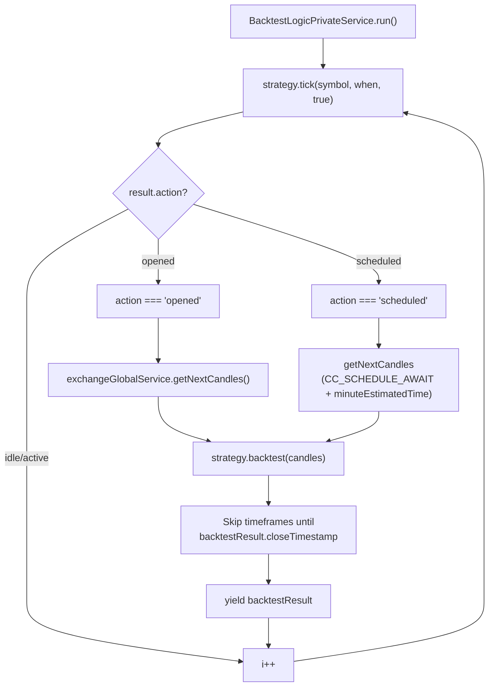
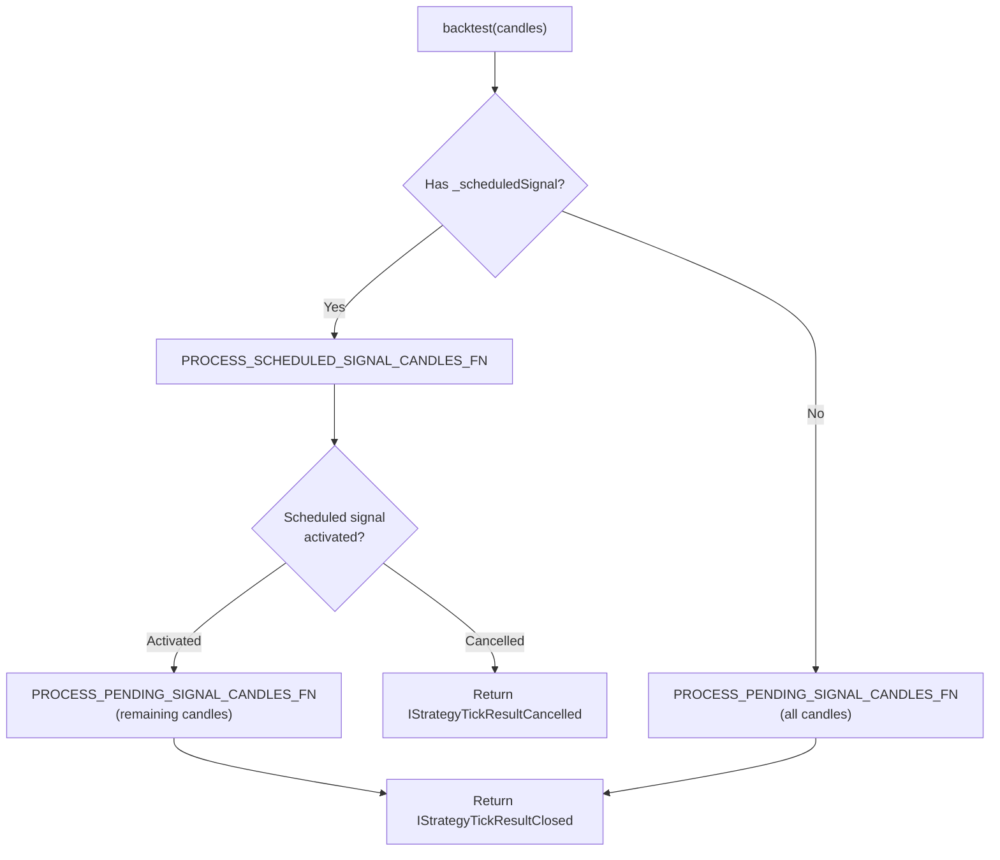
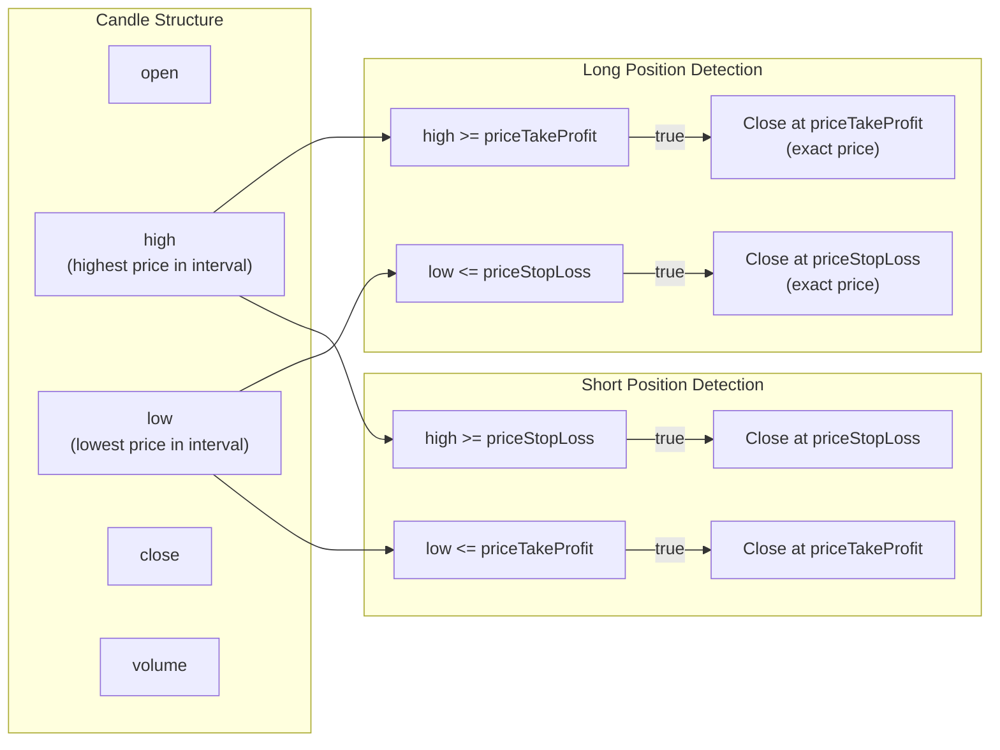
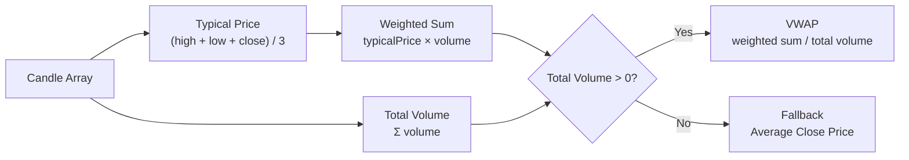
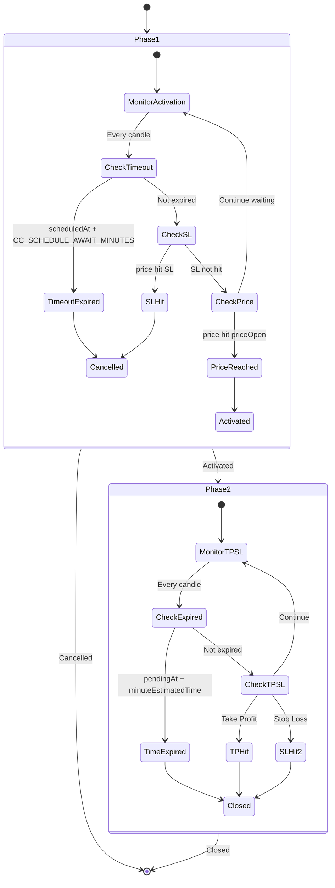
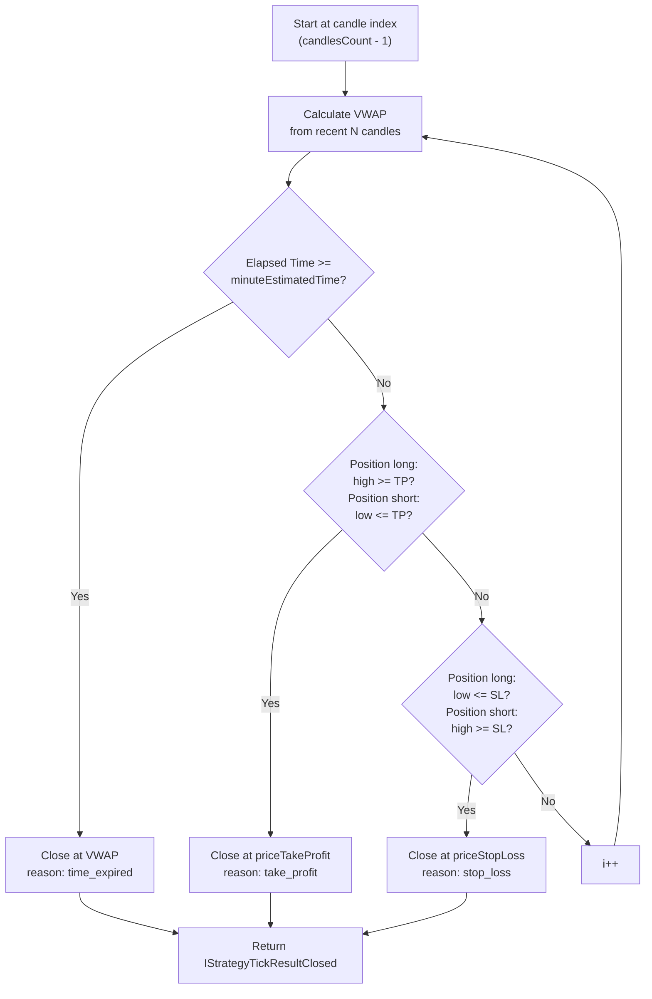
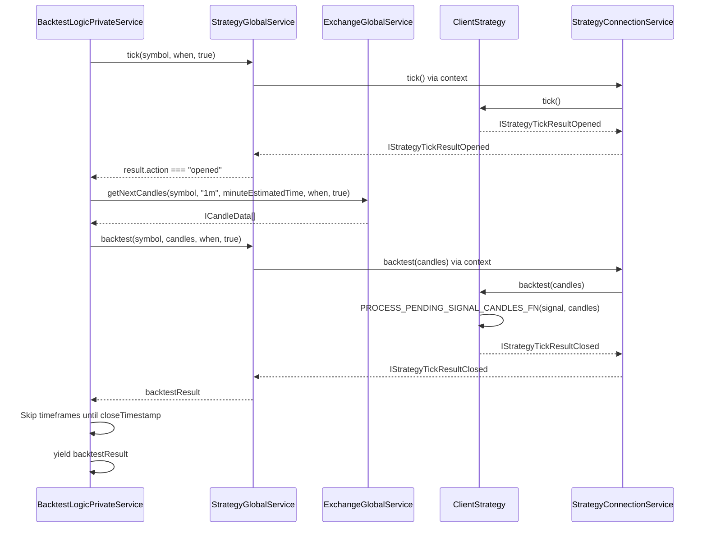

# Fast-Forward Simulation

<details>
<summary>Relevant source files</summary>

The following files were used as context for generating this wiki page:

- [src/client/ClientStrategy.ts](src/client/ClientStrategy.ts)
- [src/interfaces/Strategy.interface.ts](src/interfaces/Strategy.interface.ts)
- [src/lib/services/connection/StrategyConnectionService.ts](src/lib/services/connection/StrategyConnectionService.ts)
- [src/lib/services/logic/private/BacktestLogicPrivateService.ts](src/lib/services/logic/private/BacktestLogicPrivateService.ts)
- [src/lib/services/logic/private/LiveLogicPrivateService.ts](src/lib/services/logic/private/LiveLogicPrivateService.ts)
- [src/lib/services/logic/public/BacktestLogicPublicService.ts](src/lib/services/logic/public/BacktestLogicPublicService.ts)
- [src/lib/services/logic/public/LiveLogicPublicService.ts](src/lib/services/logic/public/LiveLogicPublicService.ts)
- [test/e2e/timing.test.mjs](test/e2e/timing.test.mjs)

</details>


## Purpose and Scope

Fast-forward simulation is an optimization technique used during backtesting to efficiently process historical data without iterating tick-by-tick through every timestamp in the timeframe. Instead of calling `strategy.tick()` repeatedly, the framework invokes `strategy.backtest()` once per signal, passing an array of candle data covering the signal's entire lifetime.

This page documents the fast-forward mechanism implemented in `ClientStrategy.backtest()` and its integration with the backtest execution flow. For the overall backtest orchestration, see [Backtest Execution Flow](#9.1). For timeframe generation, see [Timeframe Generation](#9.2).

**Key Benefits:**
- **Performance**: Processes signals 100-1000x faster than tick-by-tick simulation
- **Determinism**: Uses candle `high`/`low` for precise TP/SL detection
- **Memory Efficiency**: Streams results without accumulating intermediate states
- **Accuracy**: Accounts for intra-candle price movements via VWAP

Sources: [src/client/ClientStrategy.ts:1188-1318](), [src/lib/services/logic/private/BacktestLogicPrivateService.ts:186-253]()

---

## Fast-Forward vs. Tick-by-Tick Execution

The framework supports two execution modes for strategy evaluation:

| Mode | Method | Use Case | Time Progression | Result Type |
|------|--------|----------|------------------|-------------|
| **Tick** | `strategy.tick()` | Live trading | Real-time (`Date.now()`) | `IStrategyTickResult` (idle/opened/active/closed) |
| **Backtest** | `strategy.backtest(candles)` | Historical simulation | Fast-forward via candle array | `IStrategyBacktestResult` (closed/cancelled) |

**Execution Flow Diagram:**



**Sources:** [src/lib/services/logic/private/BacktestLogicPrivateService.ts:75-253](), [src/interfaces/Strategy.interface.ts:309-321]()

---

## Core Backtest Method

The `ClientStrategy.backtest()` method implements the fast-forward simulation logic. It receives a candle array and returns a closed or cancelled result.

**Method Signature:**

```typescript
backtest: (candles: ICandleData[]) => Promise<IStrategyBacktestResult>
```

**Return Types:**
- `IStrategyTickResultClosed`: Signal completed via TP, SL, or time expiration
- `IStrategyTickResultCancelled`: Scheduled signal never activated

**Processing Logic:**



**Sources:** [src/client/ClientStrategy.ts:1188-1318](), [src/interfaces/Strategy.interface.ts:294-295]()

---

## Candle-Based TP/SL Detection

Fast-forward simulation achieves accuracy by checking Take Profit and Stop Loss conditions against **candle high/low prices** rather than just close prices. This captures intra-candle price movements.

**Detection Logic for Long Positions:**

```typescript
// PROCESS_PENDING_SIGNAL_CANDLES_FN logic
if (signal.position === "long") {
  if (currentCandle.high >= signal.priceTakeProfit) {
    closeReason = "take_profit";
    // Use exact TP price, not candle high
  } else if (currentCandle.low <= signal.priceStopLoss) {
    closeReason = "stop_loss";
    // Use exact SL price, not candle low
  }
}
```

**Detection Logic for Short Positions:**

```typescript
if (signal.position === "short") {
  if (currentCandle.low <= signal.priceTakeProfit) {
    closeReason = "take_profit";
  } else if (currentCandle.high >= signal.priceStopLoss) {
    closeReason = "stop_loss";
  }
}
```

**Price Resolution Diagram:**



**Key Implementation Details:**

1. **Exact Price Usage**: When TP/SL is hit, the result uses the exact `priceTakeProfit` or `priceStopLoss` value, not the candle's high/low. This ensures consistent PNL calculations.

2. **Priority Order**: Time expiration is checked first, then TP/SL. If `minuteEstimatedTime` expires, the signal closes at current VWAP price regardless of TP/SL proximity.

3. **VWAP Calculation**: Average price is calculated using volume-weighted average of recent candles (controlled by `CC_AVG_PRICE_CANDLES_COUNT`).

**Sources:** [src/client/ClientStrategy.ts:1164-1186](), [src/client/ClientStrategy.ts:1143-1183]()

---

## VWAP-Based Average Price Calculation

The framework calculates Volume-Weighted Average Price (VWAP) for each candle to determine current market conditions. This provides more accurate pricing than simple close price.

**VWAP Formula:**

```typescript
const GET_AVG_PRICE_FN = (candles: ICandleData[]): number => {
  const sumPriceVolume = candles.reduce((acc, c) => {
    const typicalPrice = (c.high + c.low + c.close) / 3;
    return acc + typicalPrice * c.volume;
  }, 0);

  const totalVolume = candles.reduce((acc, c) => acc + c.volume, 0);

  return totalVolume === 0
    ? candles.reduce((acc, c) => acc + c.close, 0) / candles.length
    : sumPriceVolume / totalVolume;
};
```

**VWAP Calculation Process:**



**Window Size Configuration:**

The number of recent candles used for VWAP calculation is controlled by `GLOBAL_CONFIG.CC_AVG_PRICE_CANDLES_COUNT` (default: 3).

```typescript
const candlesCount = GLOBAL_CONFIG.CC_AVG_PRICE_CANDLES_COUNT;
for (let i = candlesCount - 1; i < candles.length; i++) {
  const recentCandles = candles.slice(i - (candlesCount - 1), i + 1);
  const averagePrice = GET_AVG_PRICE_FN(recentCandles);
  // Check TP/SL against averagePrice
}
```

**Sources:** [src/client/ClientStrategy.ts:285-296](), [src/client/ClientStrategy.ts:1144-1145]()

---

## Scheduled Signal Processing

Scheduled signals require a two-phase fast-forward simulation: first monitoring for price activation (or cancellation), then monitoring TP/SL if activated.

**Two-Phase Process Diagram:**



**Phase 1: Activation Monitoring (`PROCESS_SCHEDULED_SIGNAL_CANDLES_FN`)**

This function iterates through candles looking for:
1. **Timeout**: `candle.timestamp - scheduled.scheduledAt >= CC_SCHEDULE_AWAIT_MINUTES`
2. **Stop Loss Hit**: Price moves against position before activation
3. **Price Activation**: Price reaches `priceOpen`

**Priority Logic:**

```typescript
// Timeout checked FIRST
const elapsedTime = candle.timestamp - scheduled.scheduledAt;
if (elapsedTime >= maxTimeToWait) {
  return { cancelled: true, result: CancelledResult };
}

// Then check SL (cancel prioritized over activation)
if (scheduled.position === "long") {
  if (candle.low <= scheduled.priceStopLoss) {
    shouldCancel = true;
  } else if (candle.low <= scheduled.priceOpen) {
    shouldActivate = true;
  }
}
```

**Phase 2: TP/SL Monitoring**

If the scheduled signal activates, the function:
1. Updates `pendingAt` to activation timestamp
2. Adds signal to risk tracker
3. Continues processing remaining candles for TP/SL detection

**Candle Fetch Strategy:**

For scheduled signals, `BacktestLogicPrivateService` fetches extra candles to account for activation delay:

```typescript
// CC_SCHEDULE_AWAIT_MINUTES for activation monitoring
// + minuteEstimatedTime for TP/SL monitoring after activation
// +1 because first candle is inclusive
const candlesNeeded = 
  GLOBAL_CONFIG.CC_SCHEDULE_AWAIT_MINUTES + 
  signal.minuteEstimatedTime + 
  1;
```

**Sources:** [src/client/ClientStrategy.ts:1048-1134](), [src/lib/services/logic/private/BacktestLogicPrivateService.ts:94-143]()

---

## Pending Signal Processing

For immediate signals (no `priceOpen` specified) or after scheduled signal activation, the framework processes the pending signal by monitoring TP/SL conditions.

**Processing Flow (`PROCESS_PENDING_SIGNAL_CANDLES_FN`):**



**Critical Timing Detail:**

The `minuteEstimatedTime` countdown starts from `signal.pendingAt`, **not** `signal.scheduledAt`. This distinction is critical for scheduled signals where activation occurs after creation:

```typescript
// Time expiration check uses pendingAt
const signalTime = signal.pendingAt; // NOT scheduledAt!
const maxTimeToWait = signal.minuteEstimatedTime * 60 * 1000;
const elapsedTime = currentCandleTimestamp - signalTime;

if (elapsedTime >= maxTimeToWait) {
  shouldClose = true;
  closeReason = "time_expired";
}
```

**Why This Matters:**

For a scheduled signal:
- `scheduledAt`: Timestamp when signal was created
- `pendingAt`: Timestamp when price reached `priceOpen` and position activated

If `minuteEstimatedTime` counted from `scheduledAt`, the signal would close prematurely, incurring trading fees without adequate time to reach TP.

**Sources:** [src/client/ClientStrategy.ts:1136-1186](), [test/e2e/timing.test.mjs:34-153]()

---

## Integration with Backtest Execution

The fast-forward mechanism integrates tightly with `BacktestLogicPrivateService`, which orchestrates the backtest loop.

**Execution Context Flow:**



**Timeframe Skipping Optimization:**

After `backtest()` returns a closed result, the service skips all timeframes until `backtestResult.closeTimestamp`:

```typescript
// Skip timeframes until closeTimestamp
while (
  i < timeframes.length &&
  timeframes[i].getTime() < backtestResult.closeTimestamp
) {
  i++;
}

yield backtestResult;
```

This prevents redundant `tick()` calls during periods where a signal is already open and being processed.

**Sources:** [src/lib/services/logic/private/BacktestLogicPrivateService.ts:186-253](), [src/lib/services/connection/StrategyConnectionService.ts:132-150]()

---

## Performance Characteristics

Fast-forward simulation provides significant performance advantages over tick-by-tick iteration:

**Performance Comparison:**

| Aspect | Tick-by-Tick | Fast-Forward | Improvement |
|--------|--------------|--------------|-------------|
| **Function Calls** | O(timeframes) = 1440 calls/day | O(signals) ≈ 10-100 calls/day | 10-100x reduction |
| **Candle Fetches** | None (uses frame timestamps) | 1 per signal | Batch fetch efficiency |
| **State Management** | Persist every tick (live) | No persistence (backtest) | No I/O overhead |
| **Memory Usage** | 1 timestamp at a time | N candles (typically 30-1440) | Minimal impact |

**Timing Metrics:**

The framework emits performance events via `performanceEmitter` to track execution times:

```typescript
// Tracked metric types
"backtest_total"      // Total backtest duration
"backtest_timeframe"  // Single timeframe processing
"backtest_signal"     // Single signal backtest() call
"live_tick"           // Single tick() call in live mode
```

**Example Measurements:**

For a 30-day backtest with 15-minute signals:
- **Tick-by-tick**: ~43,200 tick calls (30 days × 24 hours × 60 minutes)
- **Fast-forward**: ~100 backtest calls (assuming ~3 signals/day)
- **Speedup**: ~430x fewer function calls

**Sources:** [src/lib/services/logic/private/BacktestLogicPrivateService.ts:64-298](), [src/config/emitters.ts]()

---

## Determinism and Reproducibility

Fast-forward simulation produces deterministic results because:

1. **Fixed Candle Data**: Backtests use historical data from `Frame.getTimeframe()`, which returns a static array
2. **Timestamp Progression**: Time advances in discrete intervals (frame timestamps), not real-time
3. **No External State**: All state is encapsulated in `ClientStrategy` instance
4. **Exact Price Matching**: TP/SL detection uses exact prices, not approximations

**Reproducibility Guarantee:**

Running the same backtest with identical parameters produces identical results:

```typescript
// Same inputs
const config = {
  strategyName: "my-strategy",
  exchangeName: "my-exchange",
  frameName: "2024-backtest",
};

// Run 1
const results1 = await Backtest.run("BTCUSDT", config);

// Run 2
const results2 = await Backtest.run("BTCUSDT", config);

// results1 === results2 (deep equality)
// - Same signals generated
// - Same TP/SL/time_expired outcomes
// - Same PNL percentages
// - Same closeTimestamps
```

This determinism is critical for:
- **Strategy Development**: Iterative testing without environmental noise
- **Walker Optimization**: Fair comparison between strategy variants
- **Regression Testing**: Verify framework changes don't alter outcomes

**Sources:** [src/lib/services/logic/private/BacktestLogicPrivateService.ts:59-300](), [src/client/ClientStrategy.ts:1188-1318]()

---

## Code Entity Reference

**Primary Classes and Functions:**

| Entity | Location | Role |
|--------|----------|------|
| `ClientStrategy.backtest()` | [src/client/ClientStrategy.ts:1188-1318]() | Main fast-forward entry point |
| `PROCESS_SCHEDULED_SIGNAL_CANDLES_FN` | [src/client/ClientStrategy.ts:1048-1134]() | Phase 1: Activation monitoring |
| `PROCESS_PENDING_SIGNAL_CANDLES_FN` | [src/client/ClientStrategy.ts:1136-1186]() | Phase 2: TP/SL monitoring |
| `GET_AVG_PRICE_FN` | [src/client/ClientStrategy.ts:285-296]() | VWAP calculation |
| `BacktestLogicPrivateService.run()` | [src/lib/services/logic/private/BacktestLogicPrivateService.ts:59-300]() | Orchestration loop |
| `StrategyConnectionService.backtest()` | [src/lib/services/connection/StrategyConnectionService.ts:132-150]() | DI routing layer |

**Configuration Parameters:**

| Parameter | Default | Purpose |
|-----------|---------|---------|
| `CC_AVG_PRICE_CANDLES_COUNT` | 3 | VWAP window size |
| `CC_SCHEDULE_AWAIT_MINUTES` | 120 | Scheduled signal timeout |
| `CC_MAX_SIGNAL_LIFETIME_MINUTES` | 10080 | Maximum signal duration (7 days) |

**Sources:** [src/client/ClientStrategy.ts:1-1318](), [src/config/params.ts]()