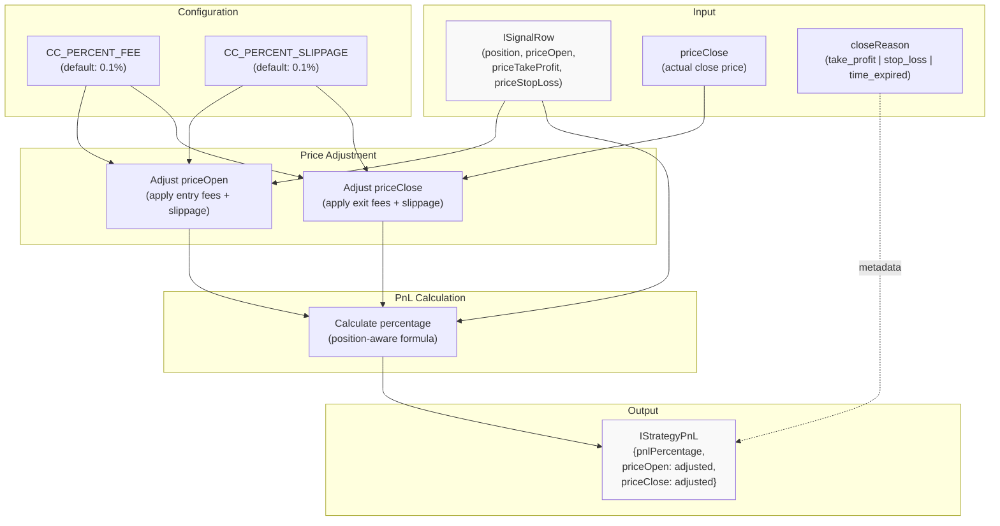
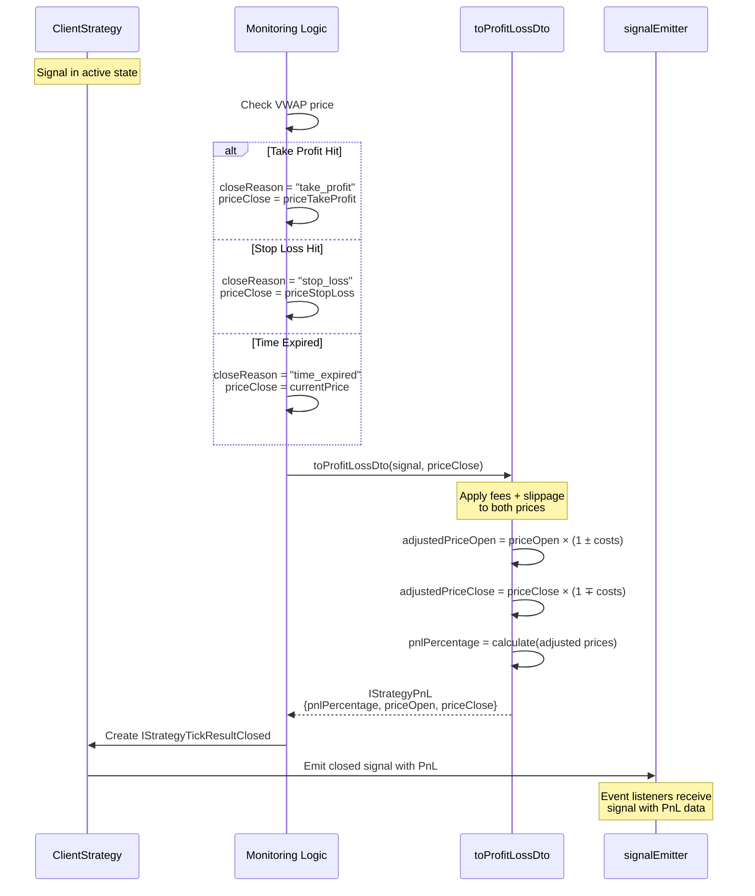
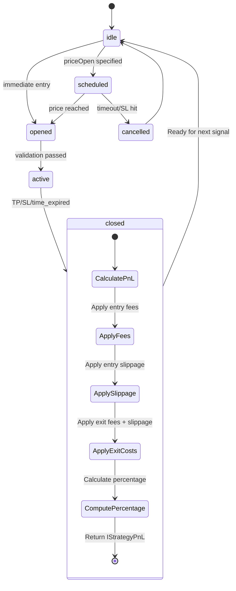

# PnL Calculation

<details>
<summary>Relevant source files</summary>

The following files were used as context for generating this wiki page:

- [README.md](README.md)
- [src/client/ClientStrategy.ts](src/client/ClientStrategy.ts)
- [src/config/emitters.ts](src/config/emitters.ts)
- [src/function/event.ts](src/function/event.ts)
- [src/index.ts](src/index.ts)
- [src/interfaces/Strategy.interface.ts](src/interfaces/Strategy.interface.ts)
- [test/e2e/defend.test.mjs](test/e2e/defend.test.mjs)
- [test/index.mjs](test/index.mjs)
- [types.d.ts](types.d.ts)

</details>


This page explains how profit and loss (PnL) are calculated when signals close in the backtest-kit framework. It covers fee application, slippage simulation, price adjustments, and the final percentage calculation returned in closed signal events.

For information about signal lifecycle states and when signals close, see [Signal States](#8.1). For validation rules that prevent unprofitable signals, see [Signal Generation and Validation](#8.2).

---

## Overview

PnL calculation occurs when a signal transitions to the `closed` state (action: `"closed"`). The framework applies realistic trading costs to both entry and exit prices before computing the profit or loss percentage. This ensures backtests and live trading reflect real-world execution conditions.

**Key Features:**
- **Dual fee application**: Fees charged on both entry (open) and exit (close)
- **Dual slippage application**: Slippage simulated on both entry and exit
- **Realistic cost modeling**: Total ~0.4% transaction cost (configurable)
- **Position-aware logic**: Different calculations for long vs short positions
- **Type-safe results**: Returns `IStrategyPnL` with adjusted prices

Sources: [types.d.ts:17-40](), [types.d.ts:161-168]()

---

## Fee and Slippage Model

The framework applies two types of transaction costs to simulate real market conditions:

### Fee Structure

**Configuration**: `CC_PERCENT_FEE` (default: 0.1%)

Fees are charged **twice**:
1. **Entry fee**: Applied when position opens at `priceOpen`
2. **Exit fee**: Applied when position closes at `priceClose`

**Total fee impact**: 0.2% (0.1% × 2 transactions)

### Slippage Structure

**Configuration**: `CC_PERCENT_SLIPPAGE` (default: 0.1%)

Slippage simulates market impact and order book depth. Applied **twice**:
1. **Entry slippage**: Price moves against position when opening
2. **Exit slippage**: Price moves against position when closing

**Total slippage impact**: ~0.2% (0.1% × 2 transactions)

### Combined Transaction Cost

**Total cost per round-trip trade**: ~0.4% (0.2% fees + 0.2% slippage)

This cost structure explains why `CC_MIN_TAKEPROFIT_DISTANCE_PERCENT` defaults to 0.5% - positions must move at least 0.5% favorably to cover costs and generate minimum profit.

Sources: [types.d.ts:17-40](), [types.d.ts:41-52]()

---

## Price Adjustment Formula

Price adjustments differ for long and short positions to reflect directional cost impact:

### Long Position Adjustments

For long positions (buy low, sell high):

```typescript
// Entry: Buy at higher price (unfavorable)
adjustedPriceOpen = priceOpen × (1 + CC_PERCENT_SLIPPAGE/100 + CC_PERCENT_FEE/100)

// Exit: Sell at lower price (unfavorable)
adjustedPriceClose = priceClose × (1 - CC_PERCENT_SLIPPAGE/100 - CC_PERCENT_FEE/100)
```

**Example** (default 0.1% fees, 0.1% slippage):
- Original priceOpen: $50,000
- Adjusted priceOpen: $50,000 × 1.002 = $50,100
- Original priceClose: $51,000
- Adjusted priceClose: $51,000 × 0.998 = $50,898

### Short Position Adjustments

For short positions (sell high, buy low):

```typescript
// Entry: Sell at lower price (unfavorable)
adjustedPriceOpen = priceOpen × (1 - CC_PERCENT_SLIPPAGE/100 - CC_PERCENT_FEE/100)

// Exit: Buy at higher price (unfavorable)
adjustedPriceClose = priceClose × (1 + CC_PERCENT_SLIPPAGE/100 + CC_PERCENT_FEE/100)
```

**Example** (default 0.1% fees, 0.1% slippage):
- Original priceOpen: $50,000
- Adjusted priceOpen: $50,000 × 0.998 = $49,900
- Original priceClose: $49,000
- Adjusted priceClose: $49,000 × 1.002 = $49,098

Sources: [src/helpers/toProfitLossDto.ts](), [types.d.ts:17-28]()

---

## PnL Calculation Process



Sources: [src/helpers/toProfitLossDto.ts](), [src/client/ClientStrategy.ts:26]()

### Long Position PnL

```typescript
pnlPercentage = ((adjustedPriceClose - adjustedPriceOpen) / adjustedPriceOpen) × 100
```

**Example** (continuing from earlier):
- Adjusted priceOpen: $50,100
- Adjusted priceClose: $50,898
- PnL: ((50,898 - 50,100) / 50,100) × 100 = 1.59%

**Raw profit before fees/slippage**: ((51,000 - 50,000) / 50,000) × 100 = 2.0%  
**Net profit after fees/slippage**: 1.59%  
**Cost impact**: 0.41% (roughly 0.4% as expected)

### Short Position PnL

```typescript
pnlPercentage = ((adjustedPriceOpen - adjustedPriceClose) / adjustedPriceOpen) × 100
```

Note the reversed order: short positions profit when price falls (priceOpen > priceClose).

**Example** (continuing from earlier):
- Adjusted priceOpen: $49,900
- Adjusted priceClose: $49,098
- PnL: ((49,900 - 49,098) / 49,900) × 100 = 1.61%

**Raw profit before fees/slippage**: ((50,000 - 49,000) / 50,000) × 100 = 2.0%  
**Net profit after fees/slippage**: 1.61%  
**Cost impact**: 0.39% (roughly 0.4% as expected)

Sources: [src/helpers/toProfitLossDto.ts]()

---

## IStrategyPnL Interface

The calculated PnL is returned as part of `IStrategyTickResultClosed` in the `pnl` field:

```typescript
interface IStrategyPnL {
  /** Profit/loss as percentage (e.g., 1.5 for +1.5%, -2.3 for -2.3%) */
  pnlPercentage: number;
  
  /** Entry price adjusted with slippage and fees */
  priceOpen: number;
  
  /** Exit price adjusted with slippage and fees */
  priceClose: number;
}
```

### Usage in Closed Result

```typescript
interface IStrategyTickResultClosed {
  action: "closed";
  signal: ISignalRow;
  currentPrice: number;
  closeReason: "time_expired" | "take_profit" | "stop_loss";
  closeTimestamp: number;
  pnl: IStrategyPnL;  // ← PnL calculation result
  strategyName: StrategyName;
  exchangeName: ExchangeName;
  symbol: string;
}
```

**Access Pattern**:
```typescript
listenSignal((result) => {
  if (result.action === "closed") {
    console.log("PnL:", result.pnl.pnlPercentage.toFixed(2) + "%");
    console.log("Adjusted entry:", result.pnl.priceOpen);
    console.log("Adjusted exit:", result.pnl.priceClose);
  }
});
```

Sources: [types.d.ts:161-168](), [types.d.ts:253-272]()

---

## Configuration Parameters

### CC_PERCENT_FEE

**Default**: `0.1` (0.1%)

Fee percentage charged per transaction. Applied twice (entry and exit) for total 0.2% fee cost.

**Configuration**:
```typescript
import { setConfig } from "backtest-kit";

setConfig({
  CC_PERCENT_FEE: 0.075  // 0.075% per transaction (0.15% total)
});
```

### CC_PERCENT_SLIPPAGE

**Default**: `0.1` (0.1%)

Slippage percentage simulating market impact and order book depth. Applied twice (entry and exit) for total ~0.2% slippage cost.

**Configuration**:
```typescript
import { setConfig } from "backtest-kit";

setConfig({
  CC_PERCENT_SLIPPAGE: 0.05  // 0.05% per transaction (0.1% total)
});
```

### Combined Configuration Example

```typescript
setConfig({
  CC_PERCENT_FEE: 0.05,      // 0.05% per transaction
  CC_PERCENT_SLIPPAGE: 0.05, // 0.05% per transaction
  // Total cost: ~0.2% (0.1% fees + 0.1% slippage)
});
```

**Impact on minimum profit requirements**: When reducing fees/slippage, you can also reduce `CC_MIN_TAKEPROFIT_DISTANCE_PERCENT` proportionally.

Sources: [types.d.ts:17-28](), [src/config/params.ts]()

---

## Minimum Profit Requirements

### CC_MIN_TAKEPROFIT_DISTANCE_PERCENT

**Default**: `0.5` (0.5%)

Minimum distance between `priceTakeProfit` and `priceOpen` to ensure profitable trades after fees and slippage.

**Rationale** (from configuration comments):
```
Calculation:
- Slippage effect: ~0.2% (0.1% × 2 transactions)
- Fees: 0.2% (0.1% × 2 transactions)
- Minimum profit buffer: 0.1%
- Total: 0.5%
```

### Validation Logic

The framework validates take profit distance during signal creation:

**Long Position**:
```typescript
const tpDistancePercent = ((priceTakeProfit - priceOpen) / priceOpen) × 100;
if (tpDistancePercent < CC_MIN_TAKEPROFIT_DISTANCE_PERCENT) {
  throw new Error("TakeProfit too close to priceOpen");
}
```

**Short Position**:
```typescript
const tpDistancePercent = ((priceOpen - priceTakeProfit) / priceOpen) × 100;
if (tpDistancePercent < CC_MIN_TAKEPROFIT_DISTANCE_PERCENT) {
  throw new Error("TakeProfit too close to priceOpen");
}
```

This validation prevents strategies from generating signals that would be unprofitable even if take profit is hit.

Sources: [types.d.ts:30-52](), [src/client/ClientStrategy.ts:163-173](), [src/client/ClientStrategy.ts:254-263]()

---

## PnL Calculation Flow



Sources: [src/client/ClientStrategy.ts](), [src/helpers/toProfitLossDto.ts]()

---

## Integration with Signal Lifecycle

PnL calculation occurs at the final stage of the signal lifecycle:



**Close Reasons and PnL**:

| Close Reason | `priceClose` Value | PnL Sign (typical) |
|--------------|-------------------|-------------------|
| `take_profit` | `signal.priceTakeProfit` | Positive |
| `stop_loss` | `signal.priceStopLoss` | Negative |
| `time_expired` | Current VWAP price | Variable |

**Note**: Even take profit hits can result in negative PnL if the distance to TP was too small to cover fees/slippage. This is why `CC_MIN_TAKEPROFIT_DISTANCE_PERCENT` validation exists.

Sources: [src/client/ClientStrategy.ts](), [types.d.ts:155-168]()

---

## PnL Reporting

### Backtest Reports

PnL data is aggregated in backtest markdown reports:

```markdown
| Signal ID | Position | PnL % | Entry Price | Exit Price | Close Reason |
|-----------|----------|-------|-------------|------------|--------------|
| abc123    | long     | +1.59 | $50,100     | $50,898    | take_profit  |
| def456    | short    | -2.15 | $49,900     | $51,000    | stop_loss    |
```

**Statistics calculated**:
- Total PnL: Sum of all closed signals
- Win rate: % of positive PnL signals
- Average win: Average PnL of winning trades
- Average loss: Average PnL of losing trades
- Sharpe ratio: Risk-adjusted return metric

Sources: [src/lib/services/markdown/BacktestMarkdownService.ts]()

### Live Trading Reports

Live reports include both closed and active signals:

```markdown
| Signal ID | State  | PnL %   | Entry Price | Current Price |
|-----------|--------|---------|-------------|---------------|
| ghi789    | active | +0.85   | $50,100     | $50,525       |
| jkl012    | closed | +1.59   | $50,100     | $50,898       |
```

**Real-time monitoring**: Active signals show unrealized PnL based on current price and estimated costs.

Sources: [src/lib/services/markdown/LiveMarkdownService.ts]()

---

## Event Emission

Closed signals with PnL data are emitted through multiple event channels:

```typescript
import { listenSignal, listenSignalBacktest, listenSignalLive } from "backtest-kit";

// Listen to all closed signals (backtest + live)
listenSignal((result) => {
  if (result.action === "closed") {
    const pnl = result.pnl;
    console.log(`PnL: ${pnl.pnlPercentage.toFixed(2)}%`);
    console.log(`Close reason: ${result.closeReason}`);
    console.log(`Adjusted entry: $${pnl.priceOpen.toFixed(2)}`);
    console.log(`Adjusted exit: $${pnl.priceClose.toFixed(2)}`);
  }
});

// Listen only to backtest closed signals
listenSignalBacktest((result) => {
  if (result.action === "closed") {
    // Process backtest PnL data
  }
});

// Listen only to live trading closed signals
listenSignalLive((result) => {
  if (result.action === "closed") {
    // Process live trading PnL data
  }
});
```

**Event Channels**:
- `signalEmitter`: All signals (backtest + live)
- `signalBacktestEmitter`: Backtest-only signals
- `signalLiveEmitter`: Live-only signals

Sources: [src/config/emitters.ts:19-31](), [src/function/event.ts:70-221]()

---

## Cost Calculation Tables

### Long Position Cost Breakdown

| Price Point | Original | Fee Impact | Slippage Impact | Adjusted | Net Change |
|-------------|----------|------------|-----------------|----------|------------|
| Entry (Open) | $50,000 | +$50 (0.1%) | +$50 (0.1%) | $50,100 | +$100 (+0.2%) |
| Exit (Close) | $51,000 | -$51 (0.1%) | -$51 (0.1%) | $50,898 | -$102 (-0.2%) |

**Gross profit**: $1,000 (2.0%)  
**Transaction costs**: ~$202 (0.4%)  
**Net profit**: $798 (1.59%)

### Short Position Cost Breakdown

| Price Point | Original | Fee Impact | Slippage Impact | Adjusted | Net Change |
|-------------|----------|------------|-----------------|----------|------------|
| Entry (Open) | $50,000 | -$50 (0.1%) | -$50 (0.1%) | $49,900 | -$100 (-0.2%) |
| Exit (Close) | $49,000 | +$49 (0.1%) | +$49 (0.1%) | $49,098 | +$98 (+0.2%) |

**Gross profit**: $1,000 (2.0%)  
**Transaction costs**: ~$198 (0.4%)  
**Net profit**: $802 (1.61%)

Sources: [types.d.ts:17-40]()

---

## Summary

The PnL calculation system in backtest-kit provides realistic profit/loss simulation by:

1. **Applying fees twice**: Entry and exit (default 0.2% total)
2. **Applying slippage twice**: Entry and exit (default ~0.2% total)
3. **Position-aware adjustments**: Different formulas for long vs short
4. **Validation enforcement**: Minimum profit distance requirements
5. **Type-safe results**: Structured `IStrategyPnL` interface
6. **Comprehensive reporting**: Aggregated statistics and real-time monitoring

**Key formulas**:
- Long PnL: `((adjustedClose - adjustedOpen) / adjustedOpen) × 100`
- Short PnL: `((adjustedOpen - adjustedClose) / adjustedOpen) × 100`
- Default cost: ~0.4% per round-trip trade
- Minimum profit buffer: 0.5% (configurable)

This realistic cost modeling ensures backtest results closely match live trading performance, accounting for exchange fees, market impact, and order execution slippage.

Sources: [types.d.ts:17-52](), [types.d.ts:161-168](), [src/client/ClientStrategy.ts:26](), [src/helpers/toProfitLossDto.ts]()