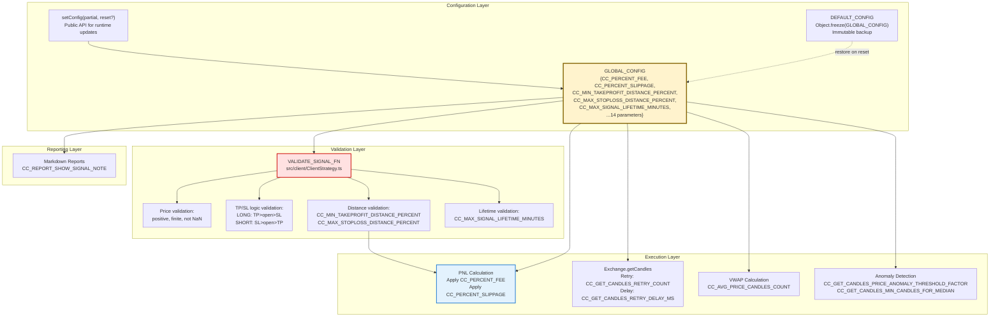
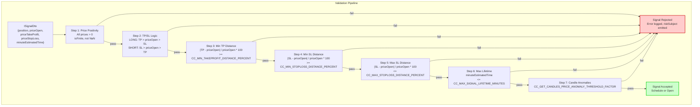

# GLOBAL_CONFIG Parameters

## Purpose and Scope

This page documents all configuration parameters in the `GLOBAL_CONFIG` object, which controls system-wide behavior including trading execution, signal validation, data fetching, anomaly detection, and reporting. These parameters provide critical safeguards to prevent unprofitable trades, data corruption, and system instability.

For information about customizing report columns, see [Column Configuration](./52_configuration-reference.md). For logger configuration, see [Logger Configuration](./52_configuration-reference.md). For strategy-level configuration, see [Strategy Schema Definition](./25_strategy-development.md).

**Sources:** [src/config/params.ts:1-122]()

---

## Configuration Architecture



**Configuration Flow Overview**

The `GLOBAL_CONFIG` object serves as the single source of truth for system-wide parameters. Parameters are enforced at multiple layers: signal validation (before execution), execution (during trading), and data fetching (during candle retrieval). The `setConfig()` function allows runtime modification, with optional reset to `DEFAULT_CONFIG`.

**Sources:** [src/config/params.ts:1-122](), [test/config/setup.mjs:89-102]()

---

## Accessing and Modifying Configuration

### Reading Configuration

```typescript
import { GLOBAL_CONFIG } from 'backtest-kit';

// Read current values
const feePercent = GLOBAL_CONFIG.CC_PERCENT_FEE;
const minTPDistance = GLOBAL_CONFIG.CC_MIN_TAKEPROFIT_DISTANCE_PERCENT;
```

### Modifying Configuration

```typescript
import { setConfig } from 'backtest-kit';

// Partial update (merge with existing)
setConfig({
  CC_PERCENT_FEE: 0.15,  // Increase fees
  CC_PERCENT_SLIPPAGE: 0.2,  // Increase slippage
});

// Full reset to defaults, then apply
setConfig({
  CC_MIN_TAKEPROFIT_DISTANCE_PERCENT: 1.0,
}, true);  // true = reset to defaults first
```

**Important:** Configuration changes affect all subsequent signal validations and executions. Changes do not affect already-opened signals.

**Sources:** [src/config/params.ts:1-122](), [test/config/setup.mjs:89-102](), [test/e2e/sanitize.test.mjs:30-32]()

---

## Parameter Categories

### Trading Execution Parameters

| Parameter | Default | Description | Applied When |
|-----------|---------|-------------|--------------|
| `CC_PERCENT_FEE` | `0.1` | Fee percentage per transaction (0.1% = 10 basis points). Applied twice: entry and exit, total 0.2%. | PNL calculation on signal close |
| `CC_PERCENT_SLIPPAGE` | `0.1` | Slippage percentage per transaction (0.1% = 10 basis points). Simulates market impact and order book depth. Applied twice: entry and exit, total ~0.2%. | PNL calculation on signal close |

**Cost Calculation Formula:**

```
LONG PNL = ((priceClose / priceOpen) - 1) * 100
         - (CC_PERCENT_FEE * 2)
         - (CC_PERCENT_SLIPPAGE * 2)

SHORT PNL = ((priceOpen / priceClose) - 1) * 100
          - (CC_PERCENT_FEE * 2)
          - (CC_PERCENT_SLIPPAGE * 2)
```

**Example:** LONG entry at $42,000, exit at $43,000:
- Gross profit: +2.38%
- Fees (2 × 0.1%): -0.2%
- Slippage (2 × 0.1%): -0.2%
- **Net profit: ~1.98%**

**Sources:** [src/config/params.ts:13-24](), [test/config/setup.mjs:92-93]()

---

### Signal Validation Parameters

These parameters enforce minimum quality standards for signals, preventing unprofitable or catastrophic trades.



**7-Stage Signal Validation Pipeline**

Every signal passes through seven validation stages before execution. Any failure results in immediate rejection with error logging and risk event emission.

**Sources:** [src/config/params.ts:26-55](), [test/e2e/sanitize.test.mjs:27-122]()

---

#### CC_MIN_TAKEPROFIT_DISTANCE_PERCENT

**Default:** `0.5`  
**Unit:** Percentage (0.5 = 0.5%)  
**Purpose:** Ensures TakeProfit is far enough from `priceOpen` to cover transaction costs and provide minimum profit margin.

**Calculation:**
```
LONG:   distance = ((priceTakeProfit - priceOpen) / priceOpen) * 100
SHORT:  distance = ((priceOpen - priceTakeProfit) / priceOpen) * 100

Must be >= CC_MIN_TAKEPROFIT_DISTANCE_PERCENT
```

**Rationale:**
- Slippage effect: ~0.2% (0.1% × 2 transactions)
- Fees: 0.2% (0.1% × 2 transactions)
- Minimum profit buffer: 0.1%
- **Total: 0.5%**

**Example Validation:**
```typescript
// REJECTED: TP too close
{
  position: "long",
  priceOpen: 42000,
  priceTakeProfit: 42010,  // Only 0.024% distance - fails validation
  priceStopLoss: 41000,
}

// ACCEPTED: TP covers costs
{
  position: "long",
  priceOpen: 42000,
  priceTakeProfit: 42210,  // 0.5% distance - passes validation
  priceStopLoss: 41000,
}
```

**Test Coverage:** [test/e2e/sanitize.test.mjs:27-122]() demonstrates rejection of micro-profit signals (0.024% TP distance).

**Sources:** [src/config/params.ts:26-37](), [test/e2e/sanitize.test.mjs:27-122]()

---

#### CC_MIN_STOPLOSS_DISTANCE_PERCENT

**Default:** `0.5`  
**Unit:** Percentage (0.5 = 0.5%)  
**Purpose:** Prevents signals from being immediately stopped out due to normal price volatility.

**Calculation:**
```
LONG:   distance = ((priceOpen - priceStopLoss) / priceOpen) * 100
SHORT:  distance = ((priceStopLoss - priceOpen) / priceOpen) * 100

Must be >= CC_MIN_STOPLOSS_DISTANCE_PERCENT
```

**Rationale:** Normal market fluctuations can move price ±0.3% without trend change. A 0.5% minimum prevents "instant stop-out" scenarios where price briefly touches SL on noise.

**Sources:** [src/config/params.ts:39-43]()

---

#### CC_MAX_STOPLOSS_DISTANCE_PERCENT

**Default:** `20`  
**Unit:** Percentage (20 = 20%)  
**Purpose:** Prevents catastrophic losses from extreme StopLoss values that could destroy portfolio.

**Calculation:**
```
LONG:   distance = ((priceOpen - priceStopLoss) / priceOpen) * 100
SHORT:  distance = ((priceStopLoss - priceOpen) / priceOpen) * 100

Must be <= CC_MAX_STOPLOSS_DISTANCE_PERCENT
```

**Example Validation:**
```typescript
// REJECTED: SL too far
{
  position: "long",
  priceOpen: 42000,
  priceTakeProfit: 43000,
  priceStopLoss: 20000,  // -52% risk - CATASTROPHIC!
}

// ACCEPTED: Reasonable SL
{
  position: "long",
  priceOpen: 42000,
  priceTakeProfit: 43000,
  priceStopLoss: 34000,  // -19% risk - within 20% limit
}
```

**Test Coverage:** [test/e2e/sanitize.test.mjs:134-229]() demonstrates rejection of extreme StopLoss (-52% risk).

**Sources:** [src/config/params.ts:44-49](), [test/e2e/sanitize.test.mjs:134-229]()

---

#### CC_MAX_SIGNAL_LIFETIME_MINUTES

**Default:** `1440`  
**Unit:** Minutes (1440 = 1 day)  
**Purpose:** Prevents "eternal signals" that block risk limits for extended periods, causing strategy deadlock.

**Validation:**
```
minuteEstimatedTime <= CC_MAX_SIGNAL_LIFETIME_MINUTES
```

**Problem Scenario:**
- Signal with `minuteEstimatedTime: 50000` (34+ days)
- Blocks risk limit for entire month
- No new signals can open while this one is active
- Strategy effectively dead for 30+ days

**Example Validation:**
```typescript
// REJECTED: Excessive lifetime
{
  position: "long",
  priceOpen: 42000,
  priceTakeProfit: 43000,
  priceStopLoss: 41000,
  minuteEstimatedTime: 50000,  // 34+ days - REJECTED
}

// ACCEPTED: Reasonable lifetime
{
  position: "long",
  priceOpen: 42000,
  priceTakeProfit: 43000,
  priceStopLoss: 41000,
  minuteEstimatedTime: 1440,  // 1 day - ACCEPTED
}
```

**Test Coverage:** [test/e2e/sanitize.test.mjs:241-339]() demonstrates rejection of excessive lifetime (50,000 minutes).

**Sources:** [src/config/params.ts:51-55](), [test/e2e/sanitize.test.mjs:241-339]()

---

#### CC_SCHEDULE_AWAIT_MINUTES

**Default:** `120`  
**Unit:** Minutes (120 = 2 hours)  
**Purpose:** Maximum time a scheduled signal waits for `priceOpen` activation before automatic cancellation.

**Behavior:**
```
When signal becomes scheduled:
  scheduledAt = timestamp of scheduling
  
On each tick:
  if (currentTime - scheduledAt > CC_SCHEDULE_AWAIT_MINUTES * 60000):
    Cancel signal with reason: "time_expired"
```

**Use Case:** Prevents scheduled signals from waiting indefinitely if market moves away from `priceOpen` entry level.

**Sources:** [src/config/params.ts:3-6]()

---

#### CC_MAX_SIGNAL_GENERATION_SECONDS

**Default:** `180`  
**Unit:** Seconds (180 = 3 minutes)  
**Purpose:** Maximum execution time for `getSignal` function. Prevents long-running or stuck signal generation routines from blocking system.

**Note:** This timeout is documented but enforcement depends on execution environment. Used primarily for monitoring and alerting.

**Sources:** [src/config/params.ts:57-64]()

---

### Data Fetching Parameters

Parameters controlling `Exchange.getCandles()` retry logic and VWAP calculation.

```mermaid
graph TB
    subgraph "Candle Fetching Flow"
        REQUEST["getCandles Request<br/>symbol, interval, since, limit"]
        
        ATTEMPT_1["Attempt 1<br/>Call Exchange.getCandles()"]
        CHECK_1{Success?}
        
        WAIT_1["Wait CC_GET_CANDLES_RETRY_DELAY_MS<br/>Default: 5000ms"]
        
        ATTEMPT_2["Attempt 2<br/>Call Exchange.getCandles()"]
        CHECK_2{Success?}
        
        WAIT_2["Wait CC_GET_CANDLES_RETRY_DELAY_MS<br/>Default: 5000ms"]
        
        ATTEMPT_3["Attempt 3<br/>Call Exchange.getCandles()"]
        CHECK_3{Success?}
        
        VALIDATE["Validate Candles<br/>Price Anomaly Detection"]
        VWAP["Calculate VWAP<br/>Last CC_AVG_PRICE_CANDLES_COUNT"]
        
        SUCCESS["Return Candles"]
        FAIL["Throw Error<br/>Log + Exit"]
    end
    
    REQUEST --> ATTEMPT_1
    ATTEMPT_1 --> CHECK_1
    CHECK_1 -->|yes| VALIDATE
    CHECK_1 -->|no| WAIT_1
    
    WAIT_1 --> ATTEMPT_2
    ATTEMPT_2 --> CHECK_2
    CHECK_2 -->|yes| VALIDATE
    CHECK_2 -->|no| WAIT_2
    
    WAIT_2 --> ATTEMPT_3
    ATTEMPT_3 --> CHECK_3
    CHECK_3 -->|yes| VALIDATE
    CHECK_3 -->|no| FAIL
    
    VALIDATE --> VWAP
    VWAP --> SUCCESS
    
    style SUCCESS fill:#ccffcc,stroke:#00cc00,stroke-width:2px
    style FAIL fill:#ffcccc,stroke:#cc0000,stroke-width:2px
```



**Retry Logic Flow**

Candle fetching uses exponential backoff with configurable retry count and delay. Maximum 3 attempts by default before failure.

**Sources:** [src/config/params.ts:66-74]()

---

#### CC_GET_CANDLES_RETRY_COUNT

**Default:** `3`  
**Unit:** Count (integer)  
**Purpose:** Number of retry attempts for `Exchange.getCandles()` before failing.

**Behavior:**
```typescript
let attempts = 0;
while (attempts < CC_GET_CANDLES_RETRY_COUNT) {
  try {
    return await exchange.getCandles(...);
  } catch (error) {
    attempts++;
    if (attempts >= CC_GET_CANDLES_RETRY_COUNT) throw error;
    await sleep(CC_GET_CANDLES_RETRY_DELAY_MS);
  }
}
```

**Use Case:** Handles transient network errors, API rate limits, and temporary exchange downtime.

**Test Configuration:** [test/config/setup.mjs:98]() sets this to `1` in tests for speed.

**Sources:** [src/config/params.ts:66-69](), [test/config/setup.mjs:98]()

---

#### CC_GET_CANDLES_RETRY_DELAY_MS

**Default:** `5000`  
**Unit:** Milliseconds (5000 = 5 seconds)  
**Purpose:** Delay between retry attempts for `Exchange.getCandles()`.

**Rationale:** 5-second delay allows exchange APIs to recover from rate limiting or temporary errors without hammering the endpoint.

**Test Configuration:** [test/config/setup.mjs:99]() sets this to `100` (100ms) in tests for speed.

**Sources:** [src/config/params.ts:70-74](), [test/config/setup.mjs:99]()

---

#### CC_AVG_PRICE_CANDLES_COUNT

**Default:** `5`  
**Unit:** Count (integer, candles)  
**Purpose:** Number of 1-minute candles used for VWAP (Volume Weighted Average Price) calculation.

**VWAP Calculation:**
```typescript
// Fetch last 5 1-minute candles
const candles = await exchange.getCandles(symbol, "1m", since, 5);

// Calculate VWAP
let totalVolume = 0;
let weightedSum = 0;

for (const candle of candles) {
  const midPrice = (candle.high + candle.low) / 2;
  weightedSum += midPrice * candle.volume;
  totalVolume += candle.volume;
}

const vwap = totalVolume > 0 
  ? weightedSum / totalVolume 
  : candles.map(c => c.close).reduce((a,b) => a+b) / candles.length;
```

**Fallback:** If `totalVolume === 0`, uses simple average of close prices.

**Test Coverage:** [test/e2e/edge.test.mjs:148-283]() tests VWAP calculation with zero volume.

**Sources:** [src/config/params.ts:8-11](), [test/e2e/edge.test.mjs:148-283]()

---

### Anomaly Detection Parameters

Parameters for detecting and rejecting incomplete or corrupted candle data from exchanges.

#### CC_GET_CANDLES_PRICE_ANOMALY_THRESHOLD_FACTOR

**Default:** `1000`  
**Unit:** Factor (multiplier)  
**Purpose:** Maximum allowed deviation factor for price anomaly detection. Rejects candles with prices more than `1/factor` below the reference price.

**Algorithm:**
```typescript
// Calculate reference price (median or average)
const prices = candles.flatMap(c => [c.open, c.high, c.low, c.close]);
const referencePrice = candles.length >= CC_GET_CANDLES_MIN_CANDLES_FOR_MEDIAN
  ? median(prices)
  : average(prices);

// Calculate threshold
const threshold = referencePrice / CC_GET_CANDLES_PRICE_ANOMALY_THRESHOLD_FACTOR;

// Validate each candle
for (const candle of candles) {
  if (candle.open < threshold || candle.high < threshold || 
      candle.low < threshold || candle.close < threshold) {
    throw new Error(`Anomalously low price detected`);
  }
}
```

**Reasoning:**
- Incomplete candles from Binance API typically have prices near $0.01-$1
- Normal BTC price ranges: $20,000-$100,000
- Factor 1000 catches prices below $20-$100 when median is $20,000-$100,000
- Factor 100 would be too permissive (allows $200 when median is $20,000)
- Factor 10,000 might be too strict for low-cap altcoins

**Example:**
```typescript
// Normal candles: BTC at $50,000
// referencePrice = $50,000
// threshold = $50,000 / 1000 = $50
// Any price < $50 is rejected

// Incomplete candle: open=$0.10, high=$0.12, low=$0.08, close=$0.10
// All prices < $50 → REJECTED
```

**Test Coverage:** [test/e2e/sanitize.test.mjs:666-784]() tests rejection of incomplete Binance candles with anomalous prices ($0.1 vs $42,000 median).

**Sources:** [src/config/params.ts:76-89](), [test/e2e/sanitize.test.mjs:666-784]()

---

#### CC_GET_CANDLES_MIN_CANDLES_FOR_MEDIAN

**Default:** `5`  
**Unit:** Count (integer, candles)  
**Purpose:** Minimum number of candles required for reliable median calculation. Below this threshold, uses simple average instead.

**Statistical Reasoning:**
- Each candle provides 4 price points (OHLC)
- 5 candles = 20 price points, sufficient for robust median calculation
- Below 5 candles, single anomaly can heavily skew median
- Statistical rule of thumb: minimum 7-10 data points for median stability
- Average is more stable than median for small datasets (n < 20)

**Example:**
```typescript
if (candles.length >= 5) {
  // Use median (more robust to outliers)
  const prices = candles.flatMap(c => [c.open, c.high, c.low, c.close]);
  referencePrice = median(prices);
} else {
  // Use average (more stable for small datasets)
  const prices = candles.flatMap(c => [c.open, c.high, c.low, c.close]);
  referencePrice = average(prices);
}
```

**Sources:** [src/config/params.ts:91-104]()

---

### Reporting Parameters

Parameters controlling markdown report generation and output formatting.

#### CC_REPORT_SHOW_SIGNAL_NOTE

**Default:** `false`  
**Type:** Boolean  
**Purpose:** Controls visibility of the "Note" column in markdown report tables.

**Behavior:**
```typescript
// When CC_REPORT_SHOW_SIGNAL_NOTE = false (default)
// Report columns: Symbol | Position | Entry | Exit | PNL | ...

// When CC_REPORT_SHOW_SIGNAL_NOTE = true
// Report columns: Symbol | Position | Entry | Exit | PNL | Note | ...
```

**Rationale:** Signal notes can be verbose and clutter reports. Default to hidden for cleaner output. Enable when debugging specific signals.

**Use Case:**
```typescript
// Enable notes for debugging
setConfig({ CC_REPORT_SHOW_SIGNAL_NOTE: true });

// Signal with detailed note
const signal = {
  position: "long",
  priceOpen: 42000,
  priceTakeProfit: 43000,
  priceStopLoss: 41000,
  note: "RSI oversold + MACD crossover at 2024-01-01 08:30:00",
};
```

**Sources:** [src/config/params.ts:106-113]()

---

## Configuration Reference Table

| Parameter | Default | Type | Category | Validation Impact |
|-----------|---------|------|----------|-------------------|
| `CC_PERCENT_FEE` | `0.1` | number | Trading | PNL calculation |
| `CC_PERCENT_SLIPPAGE` | `0.1` | number | Trading | PNL calculation |
| `CC_MIN_TAKEPROFIT_DISTANCE_PERCENT` | `0.5` | number | Validation | Signal rejection if TP too close |
| `CC_MIN_STOPLOSS_DISTANCE_PERCENT` | `0.5` | number | Validation | Signal rejection if SL too close |
| `CC_MAX_STOPLOSS_DISTANCE_PERCENT` | `20` | number | Validation | Signal rejection if SL too far |
| `CC_MAX_SIGNAL_LIFETIME_MINUTES` | `1440` | number | Validation | Signal rejection if lifetime excessive |
| `CC_SCHEDULE_AWAIT_MINUTES` | `120` | number | Validation | Scheduled signal auto-cancel timeout |
| `CC_MAX_SIGNAL_GENERATION_SECONDS` | `180` | number | Validation | getSignal timeout (monitoring) |
| `CC_GET_CANDLES_RETRY_COUNT` | `3` | number | Data Fetching | Number of retry attempts |
| `CC_GET_CANDLES_RETRY_DELAY_MS` | `5000` | number | Data Fetching | Delay between retries |
| `CC_AVG_PRICE_CANDLES_COUNT` | `5` | number | Data Fetching | VWAP calculation window |
| `CC_GET_CANDLES_PRICE_ANOMALY_THRESHOLD_FACTOR` | `1000` | number | Anomaly Detection | Price anomaly rejection threshold |
| `CC_GET_CANDLES_MIN_CANDLES_FOR_MEDIAN` | `5` | number | Anomaly Detection | Median vs average calculation cutoff |
| `CC_REPORT_SHOW_SIGNAL_NOTE` | `false` | boolean | Reporting | Note column visibility |

**Sources:** [src/config/params.ts:1-114]()

---

## Common Configuration Patterns

### Production-Ready Configuration

```typescript
import { setConfig } from 'backtest-kit';

// Conservative production settings
setConfig({
  // Higher fees for real exchange conditions
  CC_PERCENT_FEE: 0.15,
  CC_PERCENT_SLIPPAGE: 0.2,
  
  // Stricter profit requirements
  CC_MIN_TAKEPROFIT_DISTANCE_PERCENT: 1.0,
  
  // Tighter risk controls
  CC_MAX_STOPLOSS_DISTANCE_PERCENT: 10,
  
  // Shorter signal lifetimes
  CC_MAX_SIGNAL_LIFETIME_MINUTES: 720,  // 12 hours
  
  // More aggressive retry logic
  CC_GET_CANDLES_RETRY_COUNT: 5,
  CC_GET_CANDLES_RETRY_DELAY_MS: 10000,  // 10 seconds
});
```

**Sources:** [src/config/params.ts:1-114]()

---

### Aggressive Backtesting Configuration

```typescript
// Optimistic backtesting (find theoretical max performance)
setConfig({
  CC_PERCENT_FEE: 0.05,  // Lower fees
  CC_PERCENT_SLIPPAGE: 0.05,  // Lower slippage
  CC_MIN_TAKEPROFIT_DISTANCE_PERCENT: 0.3,  // Allow smaller profits
  CC_MAX_STOPLOSS_DISTANCE_PERCENT: 30,  // Allow larger stops
  CC_MAX_SIGNAL_LIFETIME_MINUTES: 10080,  // 7 days
});
```

**Warning:** Aggressive settings may produce unrealistic results. Always validate strategies with production settings before live trading.

**Sources:** [src/config/params.ts:1-114]()

---

### Testing Configuration (Fast Execution)

```typescript
// Disable validations and speed up retries for tests
setConfig({
  CC_MIN_TAKEPROFIT_DISTANCE_PERCENT: 0,
  CC_MIN_STOPLOSS_DISTANCE_PERCENT: 0,
  CC_MAX_STOPLOSS_DISTANCE_PERCENT: 100,
  CC_MAX_SIGNAL_LIFETIME_MINUTES: 999999,
  CC_GET_CANDLES_RETRY_COUNT: 1,  // No retries
  CC_GET_CANDLES_RETRY_DELAY_MS: 100,  // Fast retry
}, true);  // Reset to defaults first
```

**Sources:** [test/config/setup.mjs:89-102]()

---

## DEFAULT_CONFIG Constant

The `DEFAULT_CONFIG` object is a frozen (immutable) copy of `GLOBAL_CONFIG` created at initialization. Used for resetting configuration to original values.

```typescript
export const DEFAULT_CONFIG = Object.freeze({...GLOBAL_CONFIG});
```

**Usage:**
```typescript
// Reset to defaults
import { GLOBAL_CONFIG, DEFAULT_CONFIG } from 'backtest-kit';

Object.keys(DEFAULT_CONFIG).forEach(key => {
  GLOBAL_CONFIG[key] = DEFAULT_CONFIG[key];
});

// Or use setConfig with reset flag
setConfig({}, true);  // Empty config + reset = full default restoration
```

**Sources:** [src/config/params.ts:116-122]()

---

## Validation Enforcement Points

```mermaid
graph LR
    subgraph "Signal Generation"
        GET_SIGNAL["getSignal()<br/>User strategy code"]
        RETURN_SIGNAL["Return ISignalDto"]
    end
    
    subgraph "Validation Layer (ClientStrategy)"
        VALIDATE_SCHEMA["Validate schema<br/>required fields present"]
        VALIDATE_PRICES["Validate prices<br/>positive, finite"]
        VALIDATE_TP_SL_LOGIC["Validate TP/SL logic<br/>LONG: TP>open>SL<br/>SHORT: SL>open>TP"]
        VALIDATE_DISTANCES["Validate distances<br/>CC_MIN/MAX checks"]
        VALIDATE_LIFETIME["Validate lifetime<br/>CC_MAX_SIGNAL_LIFETIME"]
        VALIDATE_CANDLES["Validate candles<br/>CC_GET_CANDLES_PRICE_ANOMALY"]
    end
    
    subgraph "Execution Layer"
        SCHEDULE_OR_OPEN["Schedule or Open signal"]
        CALC_PNL["Calculate PNL<br/>Apply CC_PERCENT_FEE<br/>Apply CC_PERCENT_SLIPPAGE"]
        CLOSE["Close signal"]
    end
    
    subgraph "Reporting Layer"
        EMIT_EVENTS["Emit events<br/>signalEmitter, riskSubject"]
        GENERATE_REPORT["Generate markdown<br/>Use CC_REPORT_SHOW_SIGNAL_NOTE"]
    end
    
    GET_SIGNAL --> RETURN_SIGNAL
    RETURN_SIGNAL --> VALIDATE_SCHEMA
    VALIDATE_SCHEMA --> VALIDATE_PRICES
    VALIDATE_PRICES --> VALIDATE_TP_SL_LOGIC
    VALIDATE_TP_SL_LOGIC --> VALIDATE_DISTANCES
    VALIDATE_DISTANCES --> VALIDATE_LIFETIME
    VALIDATE_LIFETIME --> VALIDATE_CANDLES
    VALIDATE_CANDLES --> SCHEDULE_OR_OPEN
    
    SCHEDULE_OR_OPEN --> CALC_PNL
    CALC_PNL --> CLOSE
    
    CLOSE --> EMIT_EVENTS
    EMIT_EVENTS --> GENERATE_REPORT
```



**Configuration Enforcement Flow**

Configuration parameters are enforced at three primary points: (1) validation layer during signal creation, (2) execution layer during PNL calculation, (3) data fetching layer during candle retrieval. Each layer reads directly from `GLOBAL_CONFIG` at execution time.

**Sources:** [src/config/params.ts:1-122]()

---

## Related Configuration

For additional configuration options, see:
- **Column Configuration**: [Column Configuration](./52_configuration-reference.md) - Customize report column visibility and formatting
- **Logger Configuration**: [Logger Configuration](./52_configuration-reference.md) - Configure logging output and levels
- **Strategy Configuration**: [Strategy Schema Definition](./25_strategy-development.md) - Per-strategy settings (interval, callbacks, risk profiles)
- **Risk Configuration**: [Risk Profiles & Validation](./31_risk-management.md) - Custom validation rules and portfolio limits

**Sources:** [src/config/params.ts:1-122]()