# Backtesting

## Purpose and Scope

This document provides a comprehensive guide to backtesting mode in the backtest-kit framework. Backtesting executes trading strategies against historical market data to evaluate their performance before deploying them in live trading. This page covers the execution flow, timeframe iteration, fast-forward optimization, and the public API for running backtests.

For information about live trading execution, see [Live Trading](./58_Live_Trading.md). For comparing multiple strategies simultaneously, see [Walker Mode](./63_Walker_Mode.md). For the internal strategy logic that processes signals, see [ClientStrategy](./33_ClientStrategy.md).

## Overview

Backtesting mode processes historical candle data to simulate how a trading strategy would have performed. It differs from live trading in several key characteristics:

| Characteristic | Backtest Mode | Live Mode |
|---|---|---|
| **Data Source** | Historical candles from frame | Real-time `new Date()` |
| **Execution** | Iterates predetermined timeframes | Infinite loop with sleep intervals |
| **Persistence** | In-memory only, no state saved | Crash-safe persistence to disk |
| **Signal States** | Only `closed` and `cancelled` yielded | All states (`idle`, `opened`, `active`, `scheduled`, `closed`, `cancelled`) |
| **Performance** | Fast-forward skips timeframes during active signals | Monitors every tick continuously |
| **Determinism** | Deterministic results for same inputs | Non-deterministic (market conditions vary) |

Backtesting is designed for speed and reproducibility. It processes historical data as quickly as possible without waiting for real-time clock progression.

**Sources:** [src/classes/Backtest.ts:1-587](), [src/lib/services/logic/private/BacktestLogicPrivateService.ts:1-481]()

## System Architecture

The backtest system is organized into distinct layers that separate API concerns from execution logic:



The `BacktestUtils` singleton provides the main entry point, with memoized `BacktestInstance` objects managing isolated execution per symbol-strategy pair. The logic layer orchestrates timeframe iteration and signal processing, delegating to core services for strategy execution, candle fetching, and timeframe generation.

**Sources:** [src/classes/Backtest.ts:354-586](), [src/lib/services/logic/private/BacktestLogicPrivateService.ts:33-481]()

## Execution Flow

The backtest execution follows a multi-stage flow that processes historical timeframes sequentially:



The flow consists of several key phases:

### 1. Initialization Phase

Before iteration begins, the system validates all registered components and clears any previous state:

- **Validation**: Ensures `strategyName`, `exchangeName`, `frameName`, and optional `riskName` are registered
- **State Clearing**: Resets markdown services and strategy core service for clean run
- **Timeframe Generation**: Calls `FrameCoreService.getTimeframe()` to get complete array of historical timestamps

**Sources:** [src/classes/Backtest.ts:148-176](), [src/lib/services/logic/private/BacktestLogicPrivateService.ts:62-73]()

### 2. Iteration Loop

The main loop iterates through timeframes with index `i`, processing each timestamp:

```typescript
while (i < timeframes.length) {
  const when = timeframes[i];
  // Process timeframe...
  i++;
}
```

For each timeframe, the system:
1. Emits progress event via `progressBacktestEmitter`
2. Checks if user called `stop()` before processing
3. Calls `tick()` to check signal status
4. Processes result based on action type

**Sources:** [src/lib/services/logic/private/BacktestLogicPrivateService.ts:78-449]()

### 3. Signal Processing

The `tick()` method returns different action types:

| Action | Meaning | Processing |
|---|---|---|
| `idle` | No active signal | Check stop flag, increment timeframe |
| `opened` | Signal just opened (market order) | Fetch candles, run `backtest()`, skip to close |
| `scheduled` | Signal awaiting activation (limit order) | Fetch candles with await window, run `backtest()`, skip to close |

**Sources:** [src/lib/services/logic/private/BacktestLogicPrivateService.ts:113-431]()

### 4. Candle Fetching Strategy

When a signal opens or is scheduled, the system fetches 1-minute candles for detailed simulation:

For **opened** signals:
```
bufferMinutes = CC_AVG_PRICE_CANDLES_COUNT - 1
bufferStartTime = when - bufferMinutes * 60s
totalCandles = signal.minuteEstimatedTime + bufferMinutes
```

For **scheduled** signals:
```
bufferMinutes = CC_AVG_PRICE_CANDLES_COUNT - 1
bufferStartTime = when - bufferMinutes * 60s
candlesNeeded = bufferMinutes + CC_SCHEDULE_AWAIT_MINUTES + signal.minuteEstimatedTime + 1
```

The buffer provides historical candles for VWAP calculation. The scheduled signal needs extra candles to monitor activation timeout.

**Sources:** [src/lib/services/logic/private/BacktestLogicPrivateService.ts:174-202](), [src/lib/services/logic/private/BacktestLogicPrivateService.ts:314-329]()

### 5. Fast-Forward Optimization

After `backtest()` returns with `closeTimestamp`, the system skips all timeframes until that timestamp:

```typescript
while (
  i < timeframes.length &&
  timeframes[i].getTime() < backtestResult.closeTimestamp
) {
  i++;
}
```

This optimization dramatically improves performance by avoiding unnecessary `tick()` calls during active signal monitoring. The `backtest()` method internally simulates all candles to determine when the signal closes.

**Sources:** [src/lib/services/logic/private/BacktestLogicPrivateService.ts:274-279](), [src/lib/services/logic/private/BacktestLogicPrivateService.ts:403-409]()

### 6. Result Yielding

Only closed and cancelled signals are yielded to the consumer:

```typescript
yield backtestResult; // IStrategyBacktestResult
```

The result contains:
- `action`: Either `"closed"` or `"cancelled"`
- `signal`: Full signal object with prices, timestamps, id
- `closeTimestamp`: When signal closed (milliseconds)
- `closeReason`: `"take_profit"`, `"stop_loss"`, or `"time_expired"` (if closed)
- `pnl`: Profit/loss calculation including fees

**Sources:** [src/lib/services/logic/private/BacktestLogicPrivateService.ts:281-281](), [src/lib/services/logic/private/BacktestLogicPrivateService.ts:411-411]()

### 7. Stop Handling

The system checks for stop requests at multiple safe points:

1. **Before tick**: Prevents starting new timeframe processing
2. **When idle**: Allows clean exit with no active signal
3. **After signal closes**: Allows stopping between signals

This ensures graceful shutdown without interrupting active signal processing.

**Sources:** [src/lib/services/logic/private/BacktestLogicPrivateService.ts:95-110](), [src/lib/services/logic/private/BacktestLogicPrivateService.ts:132-151](), [src/lib/services/logic/private/BacktestLogicPrivateService.ts:284-300](), [src/lib/services/logic/private/BacktestLogicPrivateService.ts:413-430]()

## Public API Usage

The `Backtest` class provides a clean API for running backtests:

### Basic Usage with run()

The `run()` method returns an async generator that yields closed signals:

```typescript
import { Backtest } from "backtest-kit";

for await (const result of Backtest.run("BTCUSDT", {
  strategyName: "my-strategy",
  exchangeName: "binance",
  frameName: "2024-backtest"
})) {
  console.log(`Signal ${result.signal.id} closed`);
  console.log(`PNL: ${result.pnl.pnlPercentage}%`);
  console.log(`Reason: ${result.closeReason}`);
}
```

The generator pattern allows early termination:

```typescript
for await (const result of Backtest.run("BTCUSDT", context)) {
  if (result.pnl.pnlPercentage < -20) {
    console.log("Max drawdown exceeded, stopping");
    break; // Generator stops iteration
  }
}
```

**Sources:** [src/classes/Backtest.ts:373-394]()

### Background Execution

The `background()` method runs the backtest without yielding results, consuming them internally:

```typescript
const cancel = Backtest.background("BTCUSDT", {
  strategyName: "my-strategy",
  exchangeName: "binance",
  frameName: "2024-backtest"
});

// Stop at any time
cancel();
```

This is useful when you only care about side effects (callbacks, markdown reports) and don't need to process results in code.

**Sources:** [src/classes/Backtest.ts:417-436]()

### Instance Isolation

Each symbol-strategy pair gets an isolated `BacktestInstance` via memoization:

```typescript
// These run independently with separate state
Backtest.background("BTCUSDT", { strategyName: "strategy-a", ... });
Backtest.background("BTCUSDT", { strategyName: "strategy-b", ... });
Backtest.background("ETHUSDT", { strategyName: "strategy-a", ... });
```

The memoization key is `${symbol}:${strategyName}`, ensuring isolation and efficient reuse.

**Sources:** [src/classes/Backtest.ts:359-364]()

### Stopping Execution

The `stop()` method sets an internal flag to prevent new signals:

```typescript
await Backtest.stop("BTCUSDT", "my-strategy");
```

The current active signal (if any) completes normally. The backtest stops at the next safe point:
- Before processing next timeframe
- When strategy is idle (no signal)
- After current signal closes

**Sources:** [src/classes/Backtest.ts:455-465]()

### Retrieving Results

After backtest completes, retrieve statistics and reports:

```typescript
// Get structured statistics
const stats = await Backtest.getData("BTCUSDT", "my-strategy");
console.log(stats.sharpeRatio, stats.winRate, stats.maxDrawdown);

// Get markdown formatted report
const markdown = await Backtest.getReport("BTCUSDT", "my-strategy");
console.log(markdown);

// Save report to disk
await Backtest.dump("BTCUSDT", "my-strategy", "./custom/path");
```

The statistics are aggregated by `BacktestMarkdownService` from all closed signals.

**Sources:** [src/classes/Backtest.ts:480-547]()

### Listing Active Backtests

Monitor all running backtest instances:

```typescript
const statusList = await Backtest.list();
statusList.forEach(status => {
  console.log(`${status.symbol} - ${status.strategyName}: ${status.status}`);
  // status.status can be "idle", "running", or "done"
});
```

**Sources:** [src/classes/Backtest.ts:562-565]()

## Timeframe Generation

Timeframes are generated by `FrameCoreService` based on the registered frame schema. The service produces an array of `Date` objects representing historical timestamps at the specified interval.

For a frame with:
- `interval: "1d"` (daily)
- `startDate: new Date("2024-01-01")`
- `endDate: new Date("2024-12-31")`

The output is:
```typescript
[
  Date("2024-01-01T00:00:00Z"),
  Date("2024-01-02T00:00:00Z"),
  Date("2024-01-03T00:00:00Z"),
  // ... one entry per day
  Date("2024-12-31T00:00:00Z")
]
```

The complete array is generated upfront before iteration begins, enabling progress calculation:

```typescript
const totalFrames = timeframes.length;
const progress = processedFrames / totalFrames;
```

**Sources:** [src/lib/services/logic/private/BacktestLogicPrivateService.ts:69-73](), [src/lib/services/logic/private/BacktestLogicPrivateService.ts:84-92]()

## Fast-Forward Simulation

Fast-forward optimization is the key performance feature that distinguishes backtesting from live trading. When a signal opens, the system:

1. **Fetches all candles** needed for the signal's lifetime in one request
2. **Calls `backtest()`** which simulates the entire signal lifecycle using those candles
3. **Receives `closeTimestamp`** indicating when the signal closed
4. **Skips timeframes** by advancing the index `i` until reaching or passing `closeTimestamp`

### Performance Impact

Without fast-forward:
```
Process 365 daily timeframes
  → Signal opens on day 10
  → Signal closes on day 50 (40 days active)
  → Call tick() 365 times total
```

With fast-forward:
```
Process 365 daily timeframes
  → Signal opens on day 10
  → Call backtest() once with 40 days of 1m candles
  → Skip to day 50
  → Call tick() only ~325 times
```

The `backtest()` method internally processes 1-minute candles to accurately simulate TP/SL/time monitoring, but this happens in a tight loop without the overhead of the outer timeframe iteration.

**Sources:** [src/lib/services/logic/private/BacktestLogicPrivateService.ts:274-279](), [src/lib/services/logic/private/BacktestLogicPrivateService.ts:403-409]()

### Close Timestamp Calculation

The `closeTimestamp` is determined by `ClientStrategy.backtest()` by scanning through 1-minute candles:

- For **take profit**: First candle where high >= priceTakeProfit
- For **stop loss**: First candle where low <= priceStopLoss  
- For **time expiration**: Candle at minuteEstimatedTime offset
- For **scheduled activation**: First candle where priceOpen is reached, then continue monitoring

The timestamp is returned as milliseconds since epoch, allowing precise comparison with timeframe dates.

**Sources:** [src/lib/services/logic/private/BacktestLogicPrivateService.ts:248-256](), [src/lib/services/logic/private/BacktestLogicPrivateService.ts:382-386]()

## Performance Tracking

The backtest system emits performance metrics to identify bottlenecks:

| Metric Type | Measured Duration | Trigger |
|---|---|---|
| `backtest_timeframe` | Single timeframe processing | After each timeframe |
| `backtest_signal` | Signal backtest execution | After `backtest()` completes |
| `backtest_total` | Entire backtest run | After all timeframes processed |

These metrics are emitted via `performanceEmitter` and aggregated by `PerformanceMarkdownService` for analysis. Each metric includes:

```typescript
{
  timestamp: Date.now(),
  previousTimestamp: number | null,
  metricType: "backtest_timeframe" | "backtest_signal" | "backtest_total",
  duration: number, // milliseconds
  strategyName: string,
  exchangeName: string,
  symbol: string,
  backtest: true
}
```

**Sources:** [src/lib/services/logic/private/BacktestLogicPrivateService.ts:67-67](), [src/lib/services/logic/private/BacktestLogicPrivateService.ts:260-271](), [src/lib/services/logic/private/BacktestLogicPrivateService.ts:388-401](), [src/lib/services/logic/private/BacktestLogicPrivateService.ts:434-447](), [src/lib/services/logic/private/BacktestLogicPrivateService.ts:463-476]()

## Error Handling

Errors during backtest execution are handled with recovery strategies:

### Tick Failures

If `tick()` throws an error:
1. Log warning with error details
2. Emit error via `errorEmitter`
3. Skip to next timeframe
4. Continue iteration

```typescript
try {
  result = await this.strategyCoreService.tick(symbol, when, true);
} catch (error) {
  console.warn(`tick failed when=${when.toISOString()}`);
  await errorEmitter.next(error);
  i++; // Skip this timeframe
  continue;
}
```

**Sources:** [src/lib/services/logic/private/BacktestLogicPrivateService.ts:114-129]()

### Candle Fetch Failures

If `getNextCandles()` fails:
1. Log warning with requested candle count
2. Emit error via `errorEmitter`
3. Skip to next timeframe
4. Continue iteration

This prevents a single data fetch error from terminating the entire backtest.

**Sources:** [src/lib/services/logic/private/BacktestLogicPrivateService.ts:179-207](), [src/lib/services/logic/private/BacktestLogicPrivateService.ts:321-350]()

### Backtest Failures

If `backtest()` throws an error:
1. Log warning with signal details
2. Emit error via `errorEmitter`
3. Skip to next timeframe
4. Continue iteration

The signal is effectively abandoned, and processing continues with remaining timeframes.

**Sources:** [src/lib/services/logic/private/BacktestLogicPrivateService.ts:222-242](), [src/lib/services/logic/private/BacktestLogicPrivateService.ts:359-380]()

## Validation Requirements

Before a backtest runs, all components must be registered and validated:


If any validation fails, an error is thrown immediately before execution begins. This fail-fast approach ensures configuration errors are caught early.

**Sources:** [src/classes/Backtest.ts:382-390]()

## Progress Reporting

The backtest engine emits progress events as it processes timeframes:

```typescript
await progressBacktestEmitter.next({
  exchangeName: string,
  strategyName: string,
  symbol: string,
  totalFrames: number,
  processedFrames: number,
  progress: number // 0.0 to 1.0
});
```

Progress events are emitted:
- At the start of each timeframe iteration
- At 100% when all timeframes are processed

Consumers can subscribe to these events for UI updates or monitoring:

```typescript
import { listenProgressBacktest } from "backtest-kit";

listenProgressBacktest((event) => {
  console.log(`${event.symbol}: ${(event.progress * 100).toFixed(1)}%`);
});
```

**Sources:** [src/lib/services/logic/private/BacktestLogicPrivateService.ts:84-92](), [src/lib/services/logic/private/BacktestLogicPrivateService.ts:452-461]()

## Results and Statistics

Backtest results are aggregated by `BacktestMarkdownService` and include comprehensive statistics:

| Statistic | Description |
|---|---|
| `totalSignals` | Total closed and cancelled signals |
| `closedSignals` | Signals that hit TP/SL/time |
| `cancelledSignals` | Scheduled signals that cancelled |
| `winRate` | Percentage of profitable closed signals |
| `avgPnl` | Average PNL across all closed signals |
| `maxDrawdown` | Maximum consecutive loss |
| `sharpeRatio` | Risk-adjusted return metric |
| `totalPnl` | Sum of all signal PNLs |
| `totalFees` | Sum of all fees paid |

These statistics are calculated from the stream of closed signals and are accessible via:

```typescript
const stats = await Backtest.getData("BTCUSDT", "my-strategy");
```

Markdown reports provide formatted tables with signal details, timing, PNL breakdown, and summary statistics.

**Sources:** [src/classes/Backtest.ts:274-280](), [src/classes/Backtest.ts:296-302]()

## Memory Efficiency

The backtest engine is designed for memory efficiency through streaming:

1. **Generator Pattern**: Results are yielded one at a time, not accumulated in arrays
2. **No Persistence**: State is not written to disk, reducing I/O overhead
3. **Candle Deallocation**: Fetched candles are used once in `backtest()` then released
4. **Timeframe Reuse**: The timeframe array is allocated once and reused via index

For long backtests with thousands of timeframes, this approach prevents memory growth and enables processing of arbitrarily large historical periods.

**Sources:** [src/lib/services/logic/private/BacktestLogicPrivateService.ts:62-477]()

## Comparison with Live Trading

Key differences in implementation:

| Aspect | Backtest | Live |
|---|---|---|
| **Time progression** | `timeframes[i++]` | `new Date()` |
| **Loop condition** | `while (i < timeframes.length)` | `while (true)` |
| **Signal processing** | `backtest()` fast-forward | `tick()` continuous monitoring |
| **Results yielded** | `closed`, `cancelled` only | `opened`, `closed` |
| **Persistence** | None | `PersistSignalAdapter` |
| **Delay between iterations** | None | `sleep(TICK_TTL)` |
| **Performance** | CPU-bound, fast | I/O-bound, slow |

Both modes share the same `ClientStrategy` core logic, ensuring consistent signal validation and PNL calculation.

**Sources:** [src/classes/Backtest.ts:1-587](), [src/classes/Live.ts:1-599](), [src/lib/services/logic/private/BacktestLogicPrivateService.ts:1-481](), [src/lib/services/logic/private/LiveLogicPrivateService.ts:1-179]()