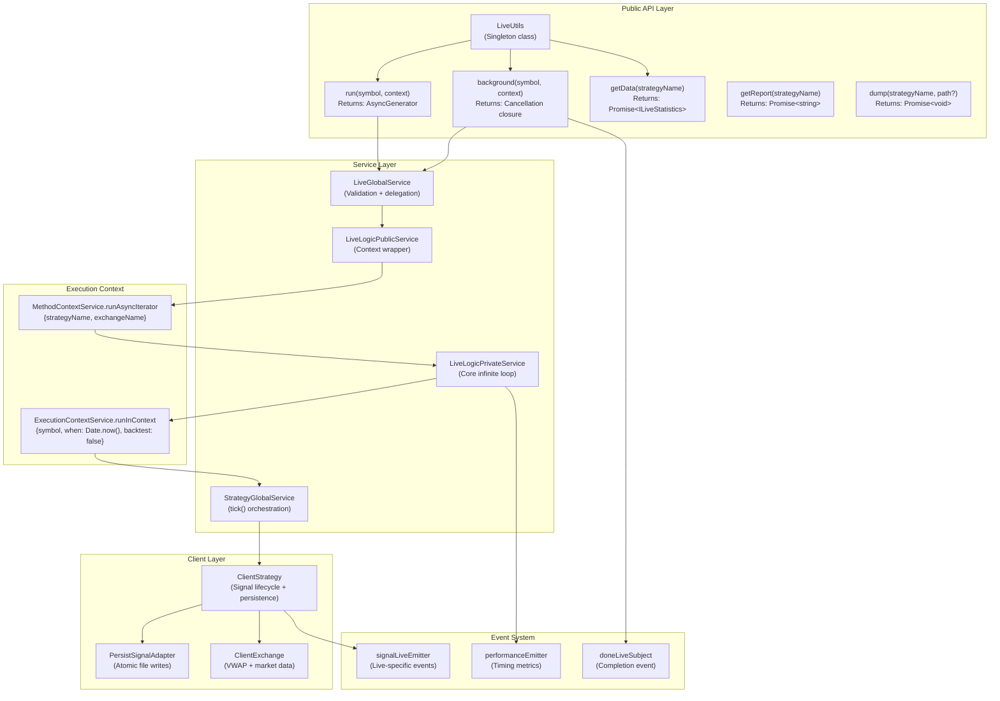
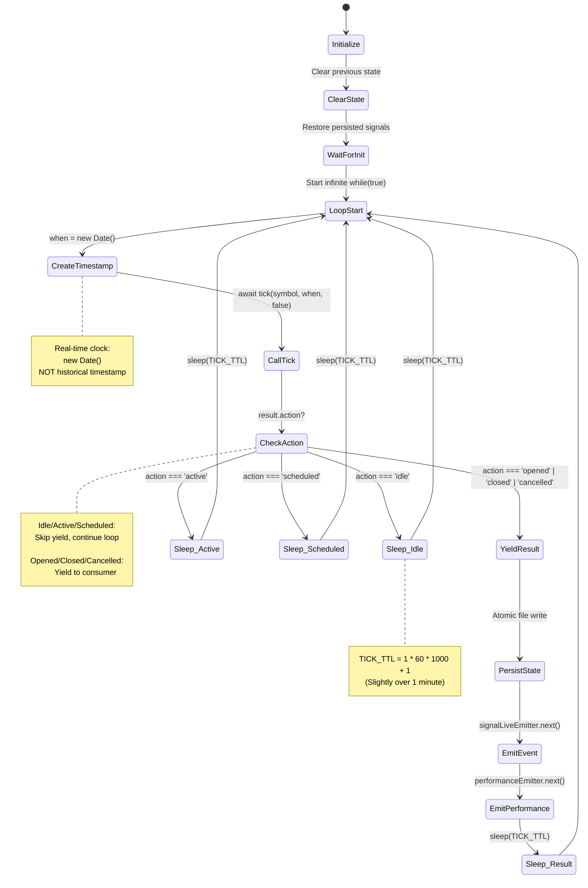
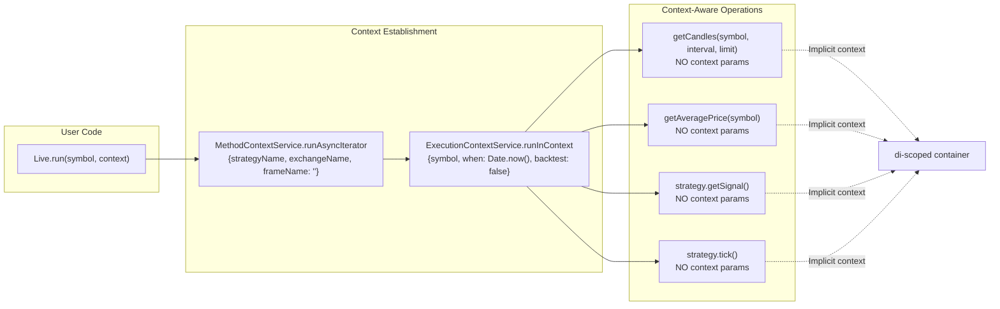

# Live Trading

<details>
<summary>Relevant source files</summary>

The following files were used as context for generating this wiki page:

- [src/classes/Backtest.ts](src/classes/Backtest.ts)
- [src/classes/Live.ts](src/classes/Live.ts)
- [src/classes/Walker.ts](src/classes/Walker.ts)
- [src/config/emitters.ts](src/config/emitters.ts)
- [src/function/event.ts](src/function/event.ts)
- [src/lib/services/logic/private/BacktestLogicPrivateService.ts](src/lib/services/logic/private/BacktestLogicPrivateService.ts)
- [src/lib/services/logic/private/LiveLogicPrivateService.ts](src/lib/services/logic/private/LiveLogicPrivateService.ts)
- [src/lib/services/logic/public/BacktestLogicPublicService.ts](src/lib/services/logic/public/BacktestLogicPublicService.ts)
- [src/lib/services/logic/public/LiveLogicPublicService.ts](src/lib/services/logic/public/LiveLogicPublicService.ts)
- [test/e2e/timing.test.mjs](test/e2e/timing.test.mjs)

</details>


This page describes the live trading execution mode, which runs trading strategies in real-time against live market data. Live trading operates as an infinite async generator that continuously monitors positions and generates signals based on the current market state.

**Scope**: This page covers the core execution flow, API, and architectural patterns for live trading. For crash recovery mechanisms, see [Crash Recovery](#10.2). For real-time price monitoring with VWAP, see [Real-time Monitoring](#10.3). For signal validation and lifecycle management, see [Signal Lifecycle](#8). For backtesting execution, see [Backtesting](#9).

## Overview

Live trading differs fundamentally from backtesting in its execution model:

| Aspect | Backtest Mode | Live Mode |
|--------|--------------|-----------|
| Time progression | Iterates predefined timeframe array | Infinite loop with `Date.now()` |
| Execution duration | Finite (completes when timeframe ends) | Infinite (runs until stopped) |
| Data source | Historical candles from Frame | Real-time market data from Exchange |
| State persistence | None (ephemeral) | Crash-safe atomic writes to disk |
| Price monitoring | Fast-forward via candle high/low | VWAP calculation using recent candles |
| Recovery | Not applicable | Automatic on restart via `waitForInit()` |

Sources: [src/classes/Live.ts:1-220](), [src/lib/services/logic/private/LiveLogicPrivateService.ts:1-117]()

## Architecture



**Live Trading Architecture**

The live trading system uses a three-layer architecture:
1. **Public API Layer** (`Live` singleton) - User-facing methods with logging and cleanup
2. **Service Layer** - Context management and infinite loop orchestration
3. **Client Layer** - Business logic for signal lifecycle and market data

Sources: [src/classes/Live.ts:44-219](), [src/lib/services/logic/public/LiveLogicPublicService.ts:38-75](), [src/lib/services/logic/private/LiveLogicPrivateService.ts:29-114]()

## Infinite Loop Execution



**Infinite Loop State Machine**

The `LiveLogicPrivateService.run()` method implements an infinite `while(true)` loop that never terminates. Each iteration performs a tick check and sleeps for `TICK_TTL` (61 seconds).

Sources: [src/lib/services/logic/private/LiveLogicPrivateService.ts:60-113]()

### Tick Execution Flow

```mermaid
sequenceDiagram
    participant Loop as "LiveLogicPrivateService.run()"
    participant Timestamp as "new Date()"
    participant Strategy as "StrategyGlobalService.tick()"
    participant Client as "ClientStrategy"
    participant Exchange as "ClientExchange"
    participant Persist as "PersistSignalAdapter"
    participant Emitter as "signalLiveEmitter"
    
    Loop->>Timestamp: Create real-time timestamp
    Timestamp-->>Loop: when = Date.now()
    
    Loop->>Strategy: tick(symbol, when, backtest=false)
    Strategy->>Client: Check signal state
    
    alt Signal needs VWAP check
        Client->>Exchange: getAveragePrice(symbol)
        Exchange-->>Client: VWAP price
        Client->>Client: Check TP/SL vs VWAP
    end
    
    alt State changed (opened/closed)
        Client->>Persist: writeValue() - atomic write
        Persist-->>Client: State persisted
        Client->>Emitter: emit signal event
        Emitter-->>Loop: Event queued
    end
    
    Strategy-->>Loop: IStrategyTickResult
    
    alt action === 'idle' | 'active' | 'scheduled'
        Loop->>Loop: sleep(TICK_TTL)<br/>Continue loop
    else action === 'opened' | 'closed' | 'cancelled'
        Loop-->>Consumer: yield result
        Consumer-->>Loop: (resume iteration)
        Loop->>Loop: sleep(TICK_TTL)<br/>Continue loop
    end
```

**Live Tick Execution Sequence**

Each tick iteration creates a fresh `Date` object representing the current time. Unlike backtesting, there is no timeframe array - the loop simply continues forever with real-time progression.

Sources: [src/lib/services/logic/private/LiveLogicPrivateService.ts:60-113]()

## Public API

### Live.run()

```typescript
public run = (
  symbol: string,
  context: {
    strategyName: string;
    exchangeName: string;
  }
) => AsyncGenerator<IStrategyTickResultOpened | IStrategyTickResultClosed>
```

Starts live trading as an infinite async generator. Yields opened and closed signals. Does not yield idle, active, or scheduled states (they are filtered out internally).

**State Cleanup**: Before starting, `Live.run()` clears:
- `liveMarkdownService` accumulated events for the strategy
- `scheduleMarkdownService` scheduled signal tracking
- `strategyGlobalService` cached client instance
- `riskGlobalService` position tracking (if risk profile exists)

This ensures each run starts with clean state.

**Example:**

```typescript
import { Live } from "backtest-kit";

for await (const result of Live.run("BTCUSDT", {
  strategyName: "my-strategy",
  exchangeName: "binance"
})) {
  if (result.action === "opened") {
    console.log("Position opened:", result.signal.id);
  } else if (result.action === "closed") {
    console.log("Position closed. PNL:", result.pnl.pnlPercentage);
  }
  // Loop continues infinitely
}
```

Sources: [src/classes/Live.ts:55-82]()

### Live.background()

```typescript
public background = (
  symbol: string,
  context: {
    strategyName: string;
    exchangeName: string;
  }
) => () => void
```

Runs live trading in the background without yielding results to the caller. Internally consumes all results from `Live.run()` and only executes callbacks. Returns a cancellation function.

**Cancellation**: The returned function sets an internal `isStopped` flag and calls `strategyGlobalService.stop()`. The loop breaks after the next closed signal.

**Completion Event**: Emits to `doneLiveSubject` when the loop terminates (either via cancellation or error).

**Error Handling**: Catches errors and emits to `errorEmitter`.

**Example:**

```typescript
import { Live, listenSignalLive, listenDoneLive } from "backtest-kit";

// Set up listeners first
listenSignalLive((result) => {
  console.log("Background signal:", result.action);
});

listenDoneLive((event) => {
  console.log("Live trading completed:", event.strategyName);
});

// Start background execution
const cancel = Live.background("BTCUSDT", {
  strategyName: "my-strategy",
  exchangeName: "binance"
});

// Later: cancel execution
setTimeout(() => {
  cancel();
}, 60000); // Cancel after 60 seconds
```

Sources: [src/classes/Live.ts:105-137]()

### Live.getData()

```typescript
public getData = async (strategyName: StrategyName) => Promise<ILiveStatistics>
```

Retrieves accumulated statistics for a strategy from `LiveMarkdownService`. Returns PNL aggregation, win rate, average duration, Sharpe ratio, drawdown, and other performance metrics.

Sources: [src/classes/Live.ts:151-156]()

### Live.getReport()

```typescript
public getReport = async (strategyName: StrategyName) => Promise<string>
```

Generates a markdown-formatted report for a strategy. Includes all signal events, statistics tables, and performance summary.

Sources: [src/classes/Live.ts:170-175]()

### Live.dump()

```typescript
public dump = async (
  strategyName: StrategyName,
  path?: string
) => Promise<void>
```

Writes the markdown report to disk. Default path is `./logs/live/{strategyName}.md`.

Sources: [src/classes/Live.ts:192-201]()

## Context Propagation



**Context Propagation in Live Trading**

The `LiveLogicPublicService` wraps the infinite loop with `MethodContextService.runAsyncIterator()`, which establishes a DI scope containing `{strategyName, exchangeName, frameName: ""}`. Note that `frameName` is always empty string for live trading.

Inside each tick iteration, `ExecutionContextService.runInContext()` creates a nested scope with `{symbol, when: Date.now(), backtest: false}`. The `backtest: false` flag signals that VWAP-based price monitoring should be used instead of fast-forward simulation.

Sources: [src/lib/services/logic/public/LiveLogicPublicService.ts:55-74](), [src/lib/services/logic/private/LiveLogicPrivateService.ts:60-113]()

## Signal Yielding Behavior

The infinite loop filters signals before yielding:

| Signal State | Yielded? | Rationale |
|--------------|----------|-----------|
| `idle` | No | No position exists, nothing to report |
| `scheduled` | No | Waiting for price activation, not actionable yet |
| `active` | No | Position being monitored, no state change |
| `opened` | **Yes** | New position created, consumer should know |
| `closed` | **Yes** | Position closed with PNL, consumer should know |
| `cancelled` | **Yes** | Scheduled signal timed out, consumer should know |

This filtering is implemented in [src/lib/services/logic/private/LiveLogicPrivateService.ts:93-109]():

```typescript
if (result.action === "active") {
  await sleep(TICK_TTL);
  continue;
}

if (result.action === "idle") {
  await sleep(TICK_TTL);
  continue;
}

if (result.action === "scheduled") {
  await sleep(TICK_TTL);
  continue;
}

// Yield opened, closed, cancelled results
yield result;
```

Sources: [src/lib/services/logic/private/LiveLogicPrivateService.ts:93-111]()

## Performance Metrics

Each tick iteration emits timing metrics via `performanceEmitter`:

```typescript
await performanceEmitter.next({
  timestamp: currentTimestamp,
  previousTimestamp: previousEventTimestamp,
  metricType: "live_tick",
  duration: tickEndTime - tickStartTime,
  strategyName: this.methodContextService.context.strategyName,
  exchangeName: this.methodContextService.context.exchangeName,
  symbol,
  backtest: false,
});
```

The `metricType: "live_tick"` identifies this as a live trading metric. The `duration` field measures how long the tick operation took, useful for detecting slow exchange API calls or expensive strategy logic.

Sources: [src/lib/services/logic/private/LiveLogicPrivateService.ts:78-91]()

## Event Emitters

Live trading emits to multiple event streams:

| Emitter | Event Type | When Emitted |
|---------|-----------|--------------|
| `signalEmitter` | `IStrategyTickResult` | All signal events (live + backtest) |
| `signalLiveEmitter` | `IStrategyTickResult` | Only live trading signals |
| `performanceEmitter` | `PerformanceContract` | Each tick iteration |
| `doneLiveSubject` | `DoneContract` | `Live.background()` completes |
| `errorEmitter` | `Error` | `Live.background()` error |

Users can subscribe to these emitters using event listeners:

```typescript
import { 
  listenSignalLive, 
  listenPerformance, 
  listenDoneLive, 
  listenError 
} from "backtest-kit";

// Listen to live signals only
listenSignalLive((result) => {
  console.log("Live signal:", result.action);
});

// Monitor performance
listenPerformance((metric) => {
  if (metric.metricType === "live_tick") {
    console.log(`Tick took ${metric.duration}ms`);
  }
});

// Listen to completion
listenDoneLive((event) => {
  console.log("Live trading stopped:", event.strategyName);
});

// Listen to errors
listenError((error) => {
  console.error("Background error:", error.message);
});
```

Sources: [src/config/emitters.ts:1-81](), [src/function/event.ts:121-235]()

## Comparison with Backtest Execution

```mermaid
graph TB
    subgraph "Backtest Execution"
        BT_Frame["Frame.getTimeframe()<br/>Returns: Date[]"]
        BT_Loop["for (i = 0; i < timeframes.length; i++)"]
        BT_When["when = timeframes[i]<br/>(Historical timestamp)"]
        BT_Tick["tick(symbol, when, backtest=true)"]
        BT_Fast["strategy.backtest(candles)<br/>(Fast-forward simulation)"]
        BT_Yield["yield closed signal"]
        BT_Done["Loop completes when i >= length"]
        
        BT_Frame --> BT_Loop
        BT_Loop --> BT_When
        BT_When --> BT_Tick
        BT_Tick --> BT_Fast
        BT_Fast --> BT_Yield
        BT_Yield --> BT_Loop
        BT_Loop --> BT_Done
    end
    
    subgraph "Live Execution"
        LV_Loop["while (true)"]
        LV_When["when = new Date()<br/>(Real-time timestamp)"]
        LV_Tick["tick(symbol, when, backtest=false)"]
        LV_VWAP["exchange.getAveragePrice()<br/>(VWAP calculation)"]
        LV_Filter["Filter idle/active/scheduled"]
        LV_Yield["yield opened/closed/cancelled"]
        LV_Sleep["sleep(TICK_TTL)"]
        LV_Never["Never completes<br/>(Infinite loop)"]
        
        LV_Loop --> LV_When
        LV_When --> LV_Tick
        LV_Tick --> LV_VWAP
        LV_VWAP --> LV_Filter
        LV_Filter --> LV_Yield
        LV_Yield --> LV_Sleep
        LV_Sleep --> LV_Loop
        LV_Loop --> LV_Never
    end
```



**Backtest vs Live Execution Comparison**

Key differences:
- **Time Source**: Backtest uses predefined `Date[]` array, Live uses `new Date()`
- **Loop Termination**: Backtest completes when array exhausted, Live never completes
- **Signal Processing**: Backtest calls `strategy.backtest()` for fast-forward, Live uses VWAP monitoring
- **State Persistence**: Backtest has none, Live persists after each state change
- **Crash Recovery**: Backtest not applicable, Live recovers via `waitForInit()`

Sources: [src/lib/services/logic/private/BacktestLogicPrivateService.ts:59-300](), [src/lib/services/logic/private/LiveLogicPrivateService.ts:60-113]()

## Integration with ClientStrategy

The `ClientStrategy` class handles the actual signal lifecycle. In live mode, it behaves differently:

| Operation | Backtest Mode | Live Mode |
|-----------|---------------|-----------|
| Price monitoring | Fast-forward via candle array | VWAP via `getAveragePrice()` |
| State persistence | None | Atomic writes via `PersistSignalAdapter` |
| Time checks | Compare `candle.timestamp` | Compare `Date.now()` |
| Signal activation | Scan candle high/low for `priceOpen` | Wait for VWAP to reach `priceOpen` |
| TP/SL detection | Scan candle high/low | Compare VWAP |

When `backtest: false` is passed to `tick()`, the `ClientStrategy` knows to:
1. Use `getAveragePrice()` for current market price instead of candle data
2. Persist state changes to disk via `PersistSignalAdapter`
3. Check real-time clock (`Date.now()`) for timeouts instead of simulated time
4. Monitor scheduled signal activation using VWAP instead of candle high/low

For details on these behaviors, see [Signal Lifecycle](#8) and [Real-time Monitoring](#10.3).

Sources: [src/lib/services/logic/private/LiveLogicPrivateService.ts:71]()