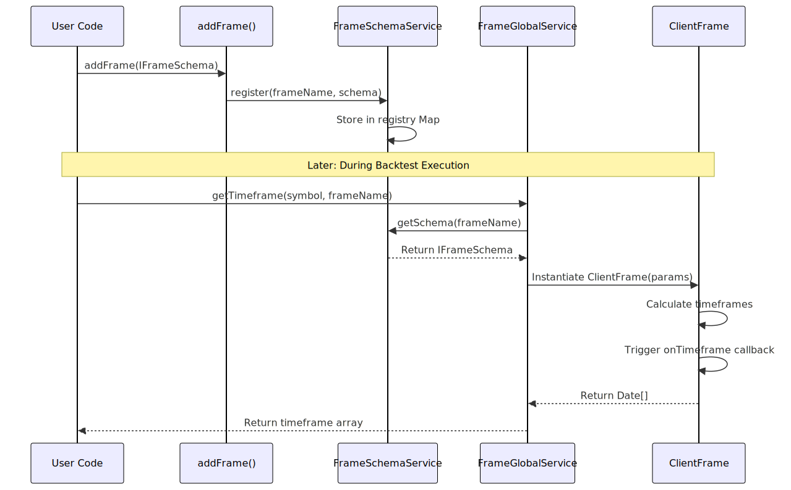

# Timeframe Generation

## Purpose and Scope

This page documents the timeframe generation system in backtest-kit, which converts date ranges and intervals into arrays of discrete timestamps for historical backtesting. Timeframe generation is the foundation of **Backtest Mode**, providing the chronological sequence of timestamps that drive strategy evaluation.

This page covers:
- Frame schema configuration via `addFrame()`
- `FrameInterval` types and their semantics
- The `IFrame.getTimeframe()` method that produces timestamp arrays
- Integration with `BacktestLogicPrivateService` for iterative execution

For information about the actual backtest execution flow that consumes these timeframes, see [Backtest Execution Flow](./53_Backtest_Execution_Flow.md). For details on fast-forward simulation using candle data, see [Fast-Forward Simulation](./55_Fast-Forward_Simulation.md).


---

## Frame Intervals

Timeframe generation supports 13 distinct intervals spanning minutes, hours, and days. Each interval defines the temporal granularity of timestamp generation.

```typescript
type FrameInterval = 
  | "1m" | "3m" | "5m" | "15m" | "30m"           // Minutes
  | "1h" | "2h" | "4h" | "6h" | "8h" | "12h"     // Hours  
  | "1d" | "3d";                                  // Days
```

### Interval Semantics

| Interval | Milliseconds | Use Case |
|----------|-------------|----------|
| `1m` | 60,000 | High-frequency strategies, minute-level precision |
| `5m` | 300,000 | Short-term strategies, reduced data volume |
| `15m` | 900,000 | Medium-term strategies, balanced granularity |
| `1h` | 3,600,000 | Hourly strategies, long-term trend analysis |
| `4h` | 14,400,000 | Multi-hour strategies, swing trading |
| `1d` | 86,400,000 | Daily strategies, position trading |

The interval directly controls:
- **Timestamp density**: 1-minute intervals generate 1,440 timestamps per day, while 1-day intervals generate 1 timestamp per day
- **Backtest speed**: Coarser intervals reduce iteration count and improve performance
- **Strategy execution frequency**: `ClientStrategy.tick()` is called once per timestamp


---

## Frame Schema Configuration

Frame schemas are registered via `addFrame()` and define the date range and interval for timeframe generation.

### IFrameSchema Structure




### Configuration Fields

| Field | Type | Required | Description |
|-------|------|----------|-------------|
| `frameName` | `string` | Yes | Unique identifier for frame retrieval |
| `interval` | `FrameInterval` | Yes | Timestamp spacing (1m, 5m, 1h, etc.) |
| `startDate` | `Date` | Yes | Start of backtest period (inclusive) |
| `endDate` | `Date` | Yes | End of backtest period (inclusive) |
| `note` | `string` | No | Developer documentation |
| `callbacks` | `Partial<IFrameCallbacks>` | No | Lifecycle event hooks |

### Example Frame Configuration

```typescript
addFrame({
  frameName: "2024-Q1-test",
  interval: "5m",
  startDate: new Date("2024-01-01T00:00:00Z"),
  endDate: new Date("2024-03-31T23:59:59Z"),
  callbacks: {
    onTimeframe: (timeframe, startDate, endDate, interval) => {
      console.log(`Generated ${timeframe.length} timestamps`);
      console.log(`First: ${timeframe[0]}`);
      console.log(`Last: ${timeframe[timeframe.length - 1]}`);
    }
  }
});
```


---

## Timeframe Generation Algorithm

The `IFrame.getTimeframe()` method transforms a date range and interval into a chronologically ordered array of `Date` objects.

### Algorithm Flow Diagram




### Interval Millisecond Conversion

The interval string is converted to milliseconds using standard time unit definitions:

| Unit | Conversion | Example |
|------|-----------|---------|
| Minutes | `interval * 60 * 1000` | "5m" → 300,000 ms |
| Hours | `interval * 60 * 60 * 1000` | "4h" → 14,400,000 ms |
| Days | `interval * 24 * 60 * 60 * 1000` | "1d" → 86,400,000 ms |

**Example Calculation:**
```
startDate: 2024-01-01 00:00:00 (1704067200000 ms)
endDate:   2024-01-01 01:00:00 (1704070800000 ms)
interval:  "15m" (900000 ms)

Timestamps generated:
1. 1704067200000 → 2024-01-01 00:00:00
2. 1704068100000 → 2024-01-01 00:15:00
3. 1704069000000 → 2024-01-01 00:30:00
4. 1704069900000 → 2024-01-01 00:45:00
5. 1704070800000 → 2024-01-01 01:00:00

Total: 5 timestamps (61-minute range ÷ 15-minute interval = 5)
```


---

## Frame Schema Service Integration

Frame schemas are managed by `FrameSchemaService`, which provides name-based lookup for frame configurations. This service is part of the Schema Services layer in the dependency injection system.

### Schema Registration and Retrieval Flow




### FrameGlobalService Responsibilities

`FrameGlobalService` orchestrates frame operations with execution context injection:

1. **Schema Retrieval**: Looks up `IFrameSchema` by `frameName` from `FrameSchemaService`
2. **Context Injection**: Provides `ExecutionContextService` (symbol, when, backtest flag) to `ClientFrame`
3. **Instance Management**: Creates `ClientFrame` instances with merged parameters
4. **Timeframe Generation**: Delegates to `ClientFrame.getTimeframe()` method


---

## Integration with Backtest Execution

Timeframe generation is the first step in backtest execution. `BacktestLogicPrivateService` consumes the generated timeframes to drive iterative strategy evaluation.

### Backtest Execution with Timeframes




### Key Integration Points

| Component | Role | Timeframe Usage |
|-----------|------|-----------------|
| `BacktestLogicPrivateService` | Orchestrates backtest execution | Calls `FrameGlobalService.getTimeframe()` once at start |
| `ExecutionContextService` | Provides implicit context | Sets `context.when` to current timeframe timestamp |
| `ClientStrategy` | Executes strategy logic | Uses `execution.context.when` from `ExecutionContextService` |
| `ClientExchange` | Fetches historical data | Uses `execution.context.when` as reference point for `getCandles()` |

**Critical Detail:** The timeframe timestamp is set in `ExecutionContextService.context.when` before each `tick()` call. This allows `ClientStrategy.getSignal()` and `ClientExchange.getCandles()` to operate on the correct historical timestamp without explicit parameter passing.


---

## Chronological Ordering Guarantees

Timeframe generation produces timestamps in strict chronological ascending order. This ordering is critical for:

1. **Causality**: Past data influences present decisions, never future data
2. **Signal Lifecycle**: Signals are opened, monitored, and closed in temporal sequence
3. **Lookahead Bias Prevention**: `ClientExchange.getCandles()` fetches data **before** the current timestamp

### Ordering Verification

The generation algorithm guarantees chronological ordering by:
- Starting at `startDate.getTime()` (earliest timestamp)
- Incrementing by positive `intervalMs` on each iteration
- Terminating when `currentTime > endDate.getTime()`

**Example:**
```
startDate: 2024-01-01 00:00:00 UTC
endDate:   2024-01-01 00:05:00 UTC
interval:  "1m"

Generated timeframe (ascending):
[
  2024-01-01T00:00:00.000Z,  // Index 0 (earliest)
  2024-01-01T00:01:00.000Z,  // Index 1
  2024-01-01T00:02:00.000Z,  // Index 2
  2024-01-01T00:03:00.000Z,  // Index 3
  2024-01-01T00:04:00.000Z,  // Index 4
  2024-01-01T00:05:00.000Z   // Index 5 (latest)
]
```


---

## Timeframe Density and Performance

Timeframe density directly impacts backtest execution time. Denser timeframes (smaller intervals) increase iteration count but provide finer granularity.

### Density Comparison

| Date Range | Interval | Timestamp Count | Execution Time (Relative) |
|------------|----------|----------------|---------------------------|
| 1 day | 1m | 1,440 | 1× |
| 1 day | 5m | 288 | 0.2× |
| 1 day | 15m | 96 | 0.067× |
| 1 day | 1h | 24 | 0.017× |
| 1 day | 1d | 1 | 0.0007× |
| 1 month | 1m | 43,200 | 30× |
| 1 year | 1h | 8,760 | 6.08× |

### Performance Optimization Strategies

1. **Interval Selection**: Use coarsest interval that satisfies strategy requirements
   - Day trading strategies: 1m or 5m
   - Swing trading strategies: 15m or 1h
   - Position trading strategies: 4h or 1d

2. **Skip-Ahead Optimization**: `BacktestLogicPrivateService` skips timeframes when signals are active, avoiding redundant `tick()` calls. The signal is processed via `ClientStrategy.backtest()` with candle arrays instead.

3. **Multi-Frame Testing**: Use separate frames for different test periods:
   ```typescript
   // Training period: Fine granularity
   addFrame({ frameName: "train", interval: "1m", startDate: ..., endDate: ... });
   
   // Testing period: Coarser granularity
   addFrame({ frameName: "test", interval: "5m", startDate: ..., endDate: ... });
   ```


---

## Callbacks and Observability

The `IFrameCallbacks.onTimeframe` callback provides visibility into timeframe generation for debugging and validation.

### Callback Signature

```typescript
interface IFrameCallbacks {
  onTimeframe: (
    timeframe: Date[],      // Generated timestamp array
    startDate: Date,        // Original start date
    endDate: Date,          // Original end date
    interval: FrameInterval // Interval used
  ) => void;
}
```

### Example Usage

```typescript
addFrame({
  frameName: "debug-frame",
  interval: "5m",
  startDate: new Date("2024-01-01T00:00:00Z"),
  endDate: new Date("2024-01-01T01:00:00Z"),
  callbacks: {
    onTimeframe: (timeframe, startDate, endDate, interval) => {
      console.log(`Frame: ${interval} interval`);
      console.log(`Range: ${startDate.toISOString()} to ${endDate.toISOString()}`);
      console.log(`Generated: ${timeframe.length} timestamps`);
      
      // Validate chronological ordering
      for (let i = 1; i < timeframe.length; i++) {
        if (timeframe[i].getTime() <= timeframe[i-1].getTime()) {
          throw new Error(`Ordering violation at index ${i}`);
        }
      }
      
      // Validate bounds
      if (timeframe[0].getTime() < startDate.getTime()) {
        throw new Error("First timestamp before startDate");
      }
      if (timeframe[timeframe.length - 1].getTime() > endDate.getTime()) {
        throw new Error("Last timestamp after endDate");
      }
    }
  }
});
```


---

## Frame Name Resolution

Frames are retrieved by `frameName` string identifier. This name is used in:
- `BacktestLogicPublicService.run()` parameters
- `WalkerSchemaService` for strategy comparison
- `MethodContextService.context.frameName` for routing

### Name-Based Retrieval Flow


---

## Summary

Timeframe generation is the foundation of backtest execution, transforming date ranges into discrete timestamps for iterative strategy evaluation. The system provides:

- **13 interval types** spanning minutes to days
- **Chronological ordering guarantees** for causality
- **Schema-based configuration** via `addFrame()`
- **Integration with ExecutionContextService** for implicit context passing
- **Performance optimization** through interval selection and skip-ahead

The generated timeframe array drives the backtest loop in `BacktestLogicPrivateService`, with each timestamp becoming the `when` parameter in `ExecutionContextService.context` for that iteration.

