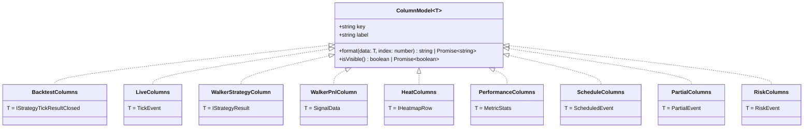

# Column Configuration

Column configuration in Backtest Kit provides a flexible system for customizing the markdown table output in all reporting services. This system uses a generic `ColumnModel` interface to define how data is extracted, formatted, and displayed in markdown reports across different execution modes (backtest, live, walker) and report types (performance, heatmap, risk, etc.).

For information about the markdown reporting services themselves, see [Markdown Reports](./40_reporting-monitoring.md). For details on the statistics models that columns format, see [Statistics Models](./40_reporting-monitoring.md).

## Purpose and Scope

Column configuration serves three primary purposes:

1. **Customization**: Users can define custom columns to display only relevant data
2. **Formatting**: Each column specifies how to transform raw data into display strings
3. **Visibility Control**: Columns can be conditionally shown/hidden based on runtime logic

This page covers the `ColumnModel` interface, column type specializations, default configurations, and integration with markdown services.

---

## ColumnModel Interface

The `ColumnModel<T>` interface is a generic abstraction for defining table columns in markdown reports. The type parameter `T` represents the data type being formatted (e.g., closed signals, heatmap rows, performance metrics).

### Interface Structure



**Sources:** [src/model/Column.model.ts:1-39]()

### Property Descriptions

| Property | Type | Description |
|----------|------|-------------|
| `key` | `string` | Unique identifier for the column, used for tracking and debugging |
| `label` | `string` | Display text shown in the markdown table header |
| `format` | `(data: T, index: number) => string \| Promise<string>` | Function to transform data into display string. Receives the data object and its index in the list |
| `isVisible` | `() => boolean \| Promise<boolean>` | Function to determine if column should be displayed. Enables conditional column visibility |

---

## Column Type Specializations

Each markdown service defines its own column type alias as a specialization of `ColumnModel<T>` with a specific data type.

### Backtest Columns

```typescript
export type Columns = ColumnModel<IStrategyTickResultClosed>;
```

Formats closed signal data with PNL information, close reason, timestamps, and trade details.

**Sources:** [src/lib/services/markdown/BacktestMarkdownService.ts:17-48]()

### Live Trading Columns

```typescript
export type Columns = ColumnModel<TickEvent>;
```

Formats live trading events including idle, opened, active, and closed states with real-time pricing.

**Sources:** [src/lib/services/markdown/LiveMarkdownService.ts:19-50]()

### Walker Columns

Walker mode uses two distinct column types:

```typescript
export type StrategyColumn = ColumnModel<IStrategyResult>;
export type PnlColumn = ColumnModel<SignalData>;
```

- `StrategyColumn`: Formats strategy comparison metrics (win rate, Sharpe ratio, trade counts)
- `PnlColumn`: Formats individual signal PNL data across all strategies

**Sources:** [src/lib/services/markdown/WalkerMarkdownService.ts:24-88]()

### Heatmap Columns

```typescript
export type Columns = ColumnModel<IHeatmapRow>;
```

Formats per-symbol portfolio statistics (total PNL, Sharpe ratio, max drawdown, trade counts).

**Sources:** [src/lib/services/markdown/HeatMarkdownService.ts:18-49]()

### Performance Columns

```typescript
export type Columns = ColumnModel<MetricStats>;
```

Formats performance metric statistics (average duration, min/max, percentiles, wait times).

**Sources:** [src/lib/services/markdown/PerformanceMarkdownService.ts:16-47]()

### Schedule Columns

```typescript
export type Columns = ColumnModel<ScheduledEvent>;
```

Formats scheduled and cancelled signal events with timing and activation data.

**Sources:** [src/lib/services/markdown/ScheduleMarkdownService.ts:19-50]()

### Partial Columns

```typescript
export type Columns = ColumnModel<PartialEvent>;
```

Formats partial profit/loss exit events with level information and symbol details.

**Sources:** [src/lib/services/markdown/PartialMarkdownService.ts:20-51]()

### Risk Columns

```typescript
export type Columns = ColumnModel<RiskEvent>;
```

Formats risk rejection events with rejection reasons and context.

**Sources:** [src/lib/services/markdown/RiskMarkdownService.ts:12-43]()

---

## Default Column Configuration

All markdown services reference default columns from `COLUMN_CONFIG`:

```typescript
import { COLUMN_CONFIG } from "../../../config/columns";

// Usage examples:
columns: Columns[] = COLUMN_CONFIG.backtest_columns
columns: Columns[] = COLUMN_CONFIG.live_columns
columns: StrategyColumn[] = COLUMN_CONFIG.walker_strategy_columns
columns: PnlColumn[] = COLUMN_CONFIG.walker_pnl_columns
columns: Columns[] = COLUMN_CONFIG.heat_columns
columns: Columns[] = COLUMN_CONFIG.performance_columns
columns: Columns[] = COLUMN_CONFIG.schedule_columns
columns: Columns[] = COLUMN_CONFIG.partial_columns
columns: Columns[] = COLUMN_CONFIG.risk_columns
```

### COLUMN_CONFIG Structure


**Sources:** [src/lib/services/markdown/BacktestMarkdownService.ts:15](), [src/lib/services/markdown/LiveMarkdownService.ts:17](), [src/lib/services/markdown/WalkerMarkdownService.ts:22](), [src/lib/services/markdown/HeatMarkdownService.ts:16](), [src/lib/services/markdown/PerformanceMarkdownService.ts:14](), [src/lib/services/markdown/ScheduleMarkdownService.ts:17](), [src/lib/services/markdown/PartialMarkdownService.ts:18](), [src/lib/services/markdown/RiskMarkdownService.ts:10]()

---

## Using Custom Columns

All reporting methods accept an optional `columns` parameter to override defaults:

### Backtest.getReport / Backtest.dump

```javascript
const customColumns = [
  {
    key: "signalId",
    label: "ID",
    format: (data) => data.signal.id,
    isVisible: () => true,
  },
  {
    key: "position",
    label: "Position",
    format: (data) => data.signal.position.toUpperCase(),
    isVisible: () => true,
  },
  {
    key: "pnl",
    label: "PNL",
    format: (data) => `${data.pnl.pnlPercentage.toFixed(2)}%`,
    isVisible: () => true,
  },
];

const markdown = await Backtest.getReport("BTCUSDT", "my-strategy", customColumns);
await Backtest.dump("BTCUSDT", "my-strategy", "./reports", customColumns);
```

**Sources:** [test/spec/columns.test.mjs:69-95](), [test/spec/columns.test.mjs:168-190]()

### Live.getReport / Live.dump

```javascript
const liveColumns = [
  {
    key: "timestamp",
    label: "Time",
    format: (event) => new Date(event.timestamp).toISOString(),
    isVisible: () => true
  },
  {
    key: "action",
    label: "Action",
    format: (event) => event.action.toUpperCase(),
    isVisible: () => true
  }
];

const markdown = await Live.getReport("BTCUSDT", "my-strategy", liveColumns);
```

**Sources:** [src/classes/Live.ts:306-312](), [src/classes/Live.ts:531-542]()

### Walker.getReport / Walker.dump

Walker accepts two column arrays - one for strategy comparison, one for PNL table:

```javascript
const strategyColumns = [
  {
    key: "strategyName",
    label: "Strategy",
    format: (result) => result.strategyName,
    isVisible: () => true
  }
];

const pnlColumns = [
  {
    key: "pnl",
    label: "PNL %",
    format: (signal) => signal.pnl.toFixed(2) + '%',
    isVisible: () => true
  }
];

const markdown = await Walker.getReport(
  "BTCUSDT",
  "my-walker",
  strategyColumns,
  pnlColumns
);
```

**Sources:** [src/classes/Walker.ts:273-282]()

### Other Reporting Classes

Performance, Heat, Schedule, Partial, and Risk classes follow the same pattern:

```javascript
// Performance
await Performance.dump("BTCUSDT", "my-strategy", "./reports", customColumns);

// Heat (strategy-wide)
await Heat.dump("my-strategy", "./reports", customColumns);

// Schedule
await Schedule.dump("BTCUSDT", "my-strategy", "./reports", customColumns);

// Partial
await Partial.dump("BTCUSDT", "my-strategy", "./reports", customColumns);

// Risk
await Risk.dump("BTCUSDT", "my-strategy", "./reports", customColumns);
```

**Sources:** [src/classes/Performance.ts:108-118](), [src/classes/Heat.ts:97-108](), [src/classes/Schedule.ts:79-94](), [src/classes/Partial.ts:121-133](), [src/classes/Risk.ts:168-180]()

---

## Column Visibility Control

The `isVisible()` function enables conditional column display:

### Implementation in Markdown Services


**Sources:** [src/lib/services/markdown/BacktestMarkdownService.ts:191-206]()

### Example: Conditional Visibility

```javascript
const columns = [
  {
    key: "pnl",
    label: "PNL %",
    format: (data) => `${data.pnl.pnlPercentage.toFixed(2)}%`,
    isVisible: () => true  // Always visible
  },
  {
    key: "debug",
    label: "Debug Info",
    format: (data) => JSON.stringify(data.signal),
    isVisible: () => process.env.DEBUG === "true"  // Conditional
  },
  {
    key: "hidden",
    label: "Internal",
    format: (data) => data.internalState,
    isVisible: () => false  // Never visible
  }
];
```

The visibility filtering happens in the `getReport` methods:

```typescript
const visibleColumns = [];
for (const col of columns) {
  if (await col.isVisible()) {
    visibleColumns.push(col);
  }
}
```

**Sources:** [src/lib/services/markdown/BacktestMarkdownService.ts:191-196](), [src/lib/services/markdown/LiveMarkdownService.ts:329-334]()

---

## Formatting Data

The `format` function transforms raw data objects into display strings for markdown tables.

### Format Function Signature

```typescript
format: (data: T, index: number) => string | Promise<string>
```

Parameters:
- `data`: The data object being formatted (type varies by service)
- `index`: Zero-based position in the data list

### Synchronous Formatting

Most formatting is synchronous:

```javascript
{
  key: "position",
  label: "Position",
  format: (data) => data.signal.position.toUpperCase(),
  isVisible: () => true
}
```

**Sources:** [test/spec/columns.test.mjs:78-82]()

### Asynchronous Formatting

Format functions can be async for complex operations:

```javascript
{
  key: "priceFormatted",
  label: "Price",
  format: async (data) => {
    const exchange = await getExchange(data.signal.exchangeName);
    return await exchange.formatPrice(data.symbol, data.currentPrice);
  },
  isVisible: () => true
}
```

### Format Execution in Services

All markdown services handle async formatting with `Promise.all`:

```typescript
const rows = await Promise.all(
  dataList.map(async (data, index) =>
    Promise.all(visibleColumns.map((col) => col.format(data, index)))
  )
);
```

This pattern ensures:
1. All format functions (sync or async) execute correctly
2. Row-level parallelism (all rows formatted simultaneously)
3. Column-level parallelism (all columns in a row formatted simultaneously)

**Sources:** [src/lib/services/markdown/BacktestMarkdownService.ts:199-203](), [src/lib/services/markdown/LiveMarkdownService.ts:337-341]()

---

## Integration with Markdown Services

### Column Flow Architecture


**Sources:** [src/classes/Backtest.ts:299-305](), [src/classes/Live.ts:306-312](), [src/classes/Walker.ts:273-282]()

### Default Column Resolution

Each public API method uses default columns if not provided:

```typescript
// Backtest
public getReport = async (
  symbol: string,
  strategyName: StrategyName,
  columns: Columns[] = COLUMN_CONFIG.backtest_columns
): Promise<string> => {
  // ...
  return await backtest.backtestMarkdownService.getReport(symbol, strategyName, columns);
};
```

```typescript
// Live
public getReport = async (
  symbol: string,
  strategyName: StrategyName,
  columns?: Columns[]
): Promise<string> => {
  // ...
  return await backtest.liveMarkdownService.getReport(symbol, strategyName, columns);
};
```

Note: Some methods use default parameters, others pass `undefined` to let the service apply defaults.

**Sources:** [src/classes/Backtest.ts:299-305](), [src/classes/Live.ts:306-312]()

### Service-Level Column Processing

All markdown services follow this pattern:

```typescript
public async getReport(
  strategyName: StrategyName,
  columns: Columns[] = COLUMN_CONFIG.backtest_columns
): Promise<string> {
  const stats = await this.getData();
  
  if (stats.totalSignals === 0) {
    return "No data available";
  }
  
  // Filter visible columns
  const visibleColumns = [];
  for (const col of columns) {
    if (await col.isVisible()) {
      visibleColumns.push(col);
    }
  }
  
  // Build header
  const header = visibleColumns.map((col) => col.label);
  const separator = visibleColumns.map(() => "---");
  
  // Format rows
  const rows = await Promise.all(
    dataList.map(async (data, index) =>
      Promise.all(visibleColumns.map((col) => col.format(data, index)))
    )
  );
  
  // Build table
  const tableData = [header, separator, ...rows];
  const table = tableData.map(row => `| ${row.join(" | ")} |`).join("\n");
  
  return table;
}
```

**Sources:** [src/lib/services/markdown/BacktestMarkdownService.ts:177-224](), [src/lib/services/markdown/LiveMarkdownService.ts:315-362]()

---

## Complete Example

### Custom Backtest Report with Conditional Columns

```javascript
import { addExchange, addStrategy, addFrame, Backtest } from "backtest-kit";

// Define custom columns
const customColumns = [
  {
    key: "index",
    label: "#",
    format: (data, index) => (index + 1).toString(),
    isVisible: () => true
  },
  {
    key: "signalId",
    label: "ID",
    format: (data) => data.signal.id.substring(0, 8),
    isVisible: () => true
  },
  {
    key: "position",
    label: "Pos",
    format: (data) => data.signal.position === "long" ? "📈" : "📉",
    isVisible: () => true
  },
  {
    key: "pnl",
    label: "PNL",
    format: (data) => {
      const pnl = data.pnl.pnlPercentage;
      const sign = pnl >= 0 ? "+" : "";
      return `${sign}${pnl.toFixed(2)}%`;
    },
    isVisible: () => true
  },
  {
    key: "closeReason",
    label: "Close",
    format: (data) => data.closeReason,
    isVisible: () => true
  },
  {
    key: "duration",
    label: "Time",
    format: (data) => {
      const ms = data.closeTimestamp - data.signal.pendingAt;
      const minutes = Math.round(ms / 60000);
      return `${minutes}m`;
    },
    isVisible: () => true
  },
  {
    key: "debug",
    label: "Note",
    format: (data) => data.signal.note || "-",
    isVisible: () => process.env.SHOW_NOTES === "true"
  }
];

// Run backtest and generate custom report
Backtest.background("BTCUSDT", {
  strategyName: "my-strategy",
  exchangeName: "binance",
  frameName: "1d-backtest"
});

// Wait for completion...
const markdown = await Backtest.getReport("BTCUSDT", "my-strategy", customColumns);
console.log(markdown);

// Output:
// # Backtest Report: my-strategy
//
// | # | ID | Pos | PNL | Close | Time |
// | --- | --- | --- | --- | --- | --- |
// | 1 | a1b2c3d4 | 📈 | +2.15% | take_profit | 125m |
// | 2 | e5f6g7h8 | 📉 | -0.95% | stop_loss | 87m |
// ...
```

**Sources:** [test/spec/columns.test.mjs:15-112]()

---

## Summary Table

| Aspect | Details |
|--------|---------|
| **Core Interface** | `ColumnModel<T>` in [src/model/Column.model.ts:26-38]() |
| **Default Config** | `COLUMN_CONFIG` from `src/config/columns` |
| **Type Specializations** | 9 column types across markdown services |
| **Visibility Control** | `isVisible()` with async support |
| **Formatting** | `format(data, index)` with async support |
| **Public API** | All reporting methods accept optional `columns` parameter |
| **Processing Flow** | Filter visible → Format cells → Build markdown table |

**Sources:** [src/model/Column.model.ts:1-39](), [src/lib/services/markdown/BacktestMarkdownService.ts:17-48](), [src/lib/services/markdown/LiveMarkdownService.ts:19-50](), [src/lib/services/markdown/WalkerMarkdownService.ts:24-88](), [src/lib/services/markdown/HeatMarkdownService.ts:18-49](), [src/lib/services/markdown/PerformanceMarkdownService.ts:16-47](), [src/lib/services/markdown/ScheduleMarkdownService.ts:19-50](), [src/lib/services/markdown/PartialMarkdownService.ts:20-51](), [src/lib/services/markdown/RiskMarkdownService.ts:12-43]()