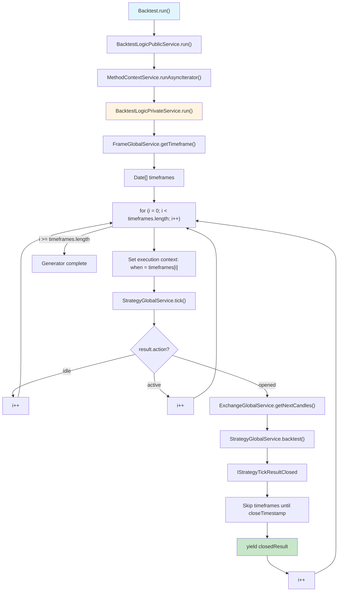
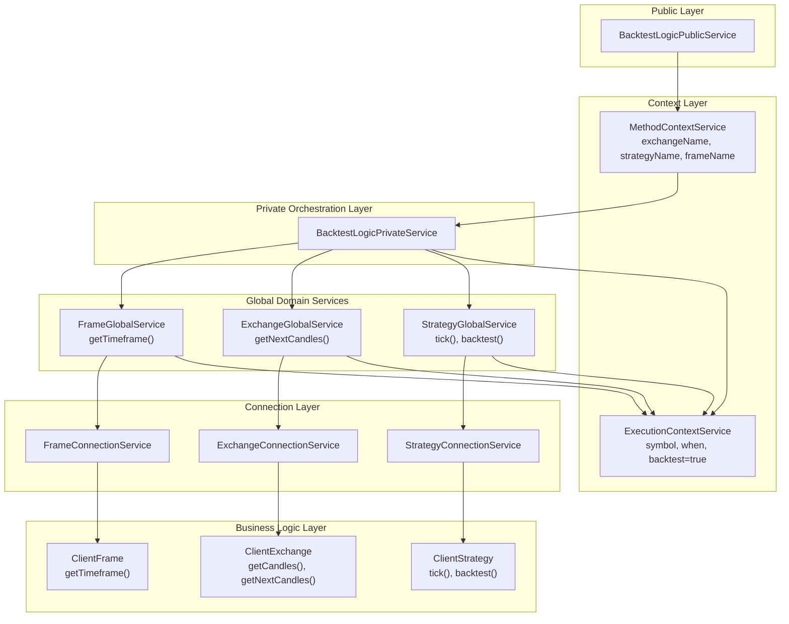
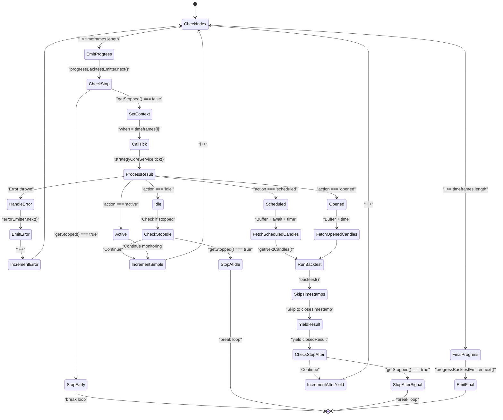
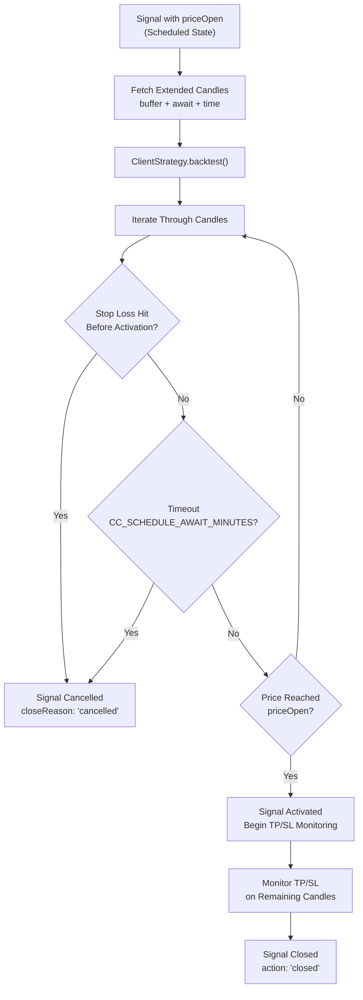
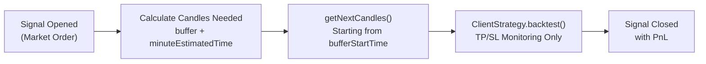
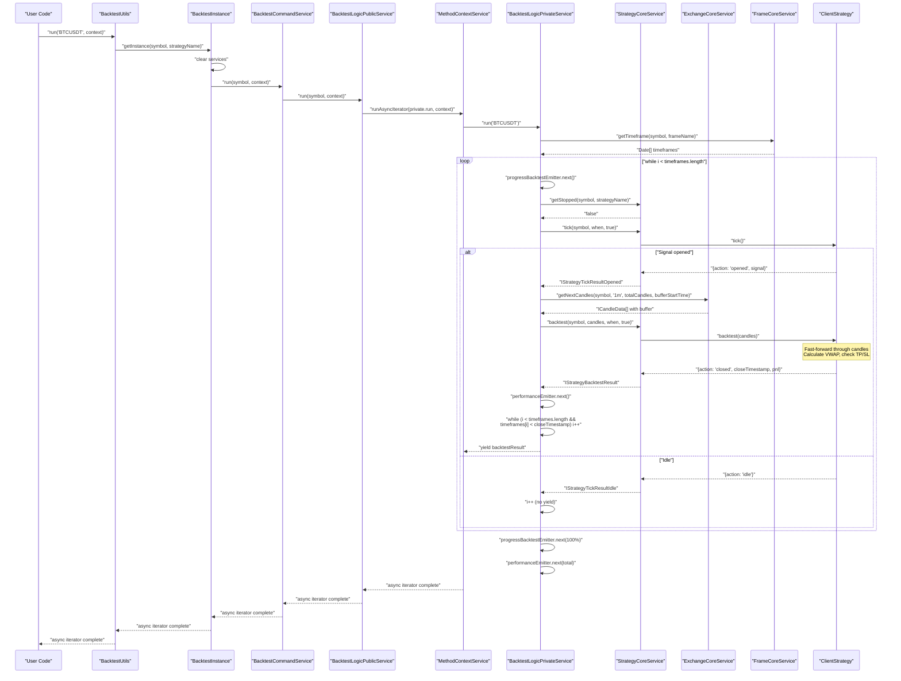
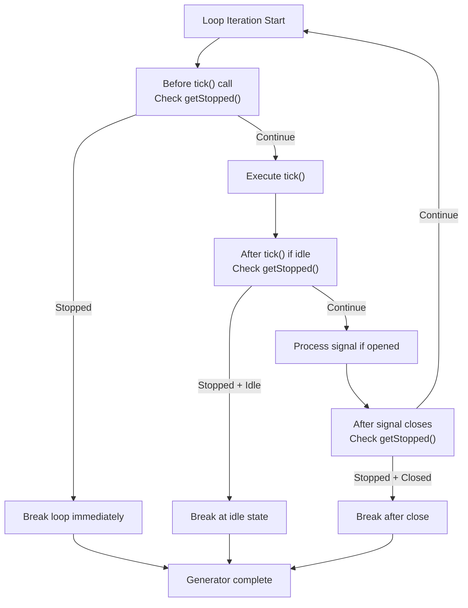
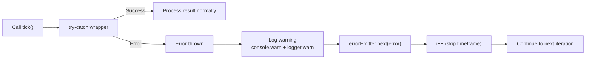

# Backtest Execution Flow

<details>
<summary>Relevant source files</summary>

The following files were used as context for generating this wiki page:

- [src/classes/Backtest.ts](src/classes/Backtest.ts)
- [src/classes/Live.ts](src/classes/Live.ts)
- [src/classes/Walker.ts](src/classes/Walker.ts)
- [src/lib/services/connection/StrategyConnectionService.ts](src/lib/services/connection/StrategyConnectionService.ts)
- [src/lib/services/core/StrategyCoreService.ts](src/lib/services/core/StrategyCoreService.ts)
- [src/lib/services/logic/private/BacktestLogicPrivateService.ts](src/lib/services/logic/private/BacktestLogicPrivateService.ts)
- [src/lib/services/logic/private/LiveLogicPrivateService.ts](src/lib/services/logic/private/LiveLogicPrivateService.ts)
- [src/lib/services/logic/private/WalkerLogicPrivateService.ts](src/lib/services/logic/private/WalkerLogicPrivateService.ts)

</details>


## Purpose and Scope

This document explains the step-by-step orchestration of backtesting execution through historical timeframes, focusing on the `BacktestLogicPrivateService` and its coordination with frame generation, signal processing, and candle data retrieval. The backtest execution uses an async generator pattern for memory-efficient streaming of results.

For information about configuring backtests and the Public API, see [Backtest API](#3.2). For details on timeframe generation itself, see [Timeframe Generation](#7.2). For the fast-forward simulation algorithm that processes opened signals, see [Fast-Forward Simulation](#7.3).

---

## Execution Flow Overview

The backtest execution follows a pipeline where `BacktestLogicPrivateService` orchestrates the flow through three major service domains: Frame (timeframe generation), Strategy (signal lifecycle), and Exchange (historical data). The process streams results as an async generator, allowing early termination and preventing memory overflow on large backtests.

**High-Level Execution Sequence**



**Sources:** [src/lib/services/logic/private/BacktestLogicPrivateService.ts:1-123](), [src/lib/services/logic/public/BacktestLogicPublicService.ts:1-70]()

---

## Service Layer Architecture

The backtest execution involves multiple service layers with clear separation of concerns. The Public service handles context injection, the Private service orchestrates the execution loop, and Global services provide domain-specific operations.

**Service Layer Interaction Diagram**



**Sources:** [src/lib/services/logic/public/BacktestLogicPublicService.ts:1-70](), [src/lib/services/logic/private/BacktestLogicPrivateService.ts:1-123](), [src/lib/services/context/MethodContextService.ts:1-56]()

---

## Execution Steps in Detail

### Step 1: Context Initialization

The `BacktestLogicPublicService.run()` method wraps the private service with `MethodContextService.runAsyncIterator()` to propagate context through all operations.

**Context Propagation**

| Context Type | Service | Purpose |
|--------------|---------|---------|
| Method Context | `MethodContextService` | Routes to correct strategy/exchange/frame schemas |
| Execution Context | `ExecutionContextService` | Provides symbol, current timestamp (when), backtest flag |

The backtest instance is also cleared of any previous state via `strategyCoreService.clear()`, `backtestMarkdownService.clear()`, and `riskGlobalService.clear()` before execution begins.

**Sources:** [src/classes/Backtest.ts:161-175](), [src/lib/services/logic/private/BacktestLogicPrivateService.ts:1-50]()

### Step 2: Timeframe Array Generation

The private service begins by fetching the complete timeframe array from `frameCoreService.getTimeframe()`. This array contains all timestamps to iterate through, spaced according to the configured interval.

```typescript
// From BacktestLogicPrivateService.run() at line 69-72
const timeframes = await this.frameCoreService.getTimeframe(
  symbol,
  this.methodContextService.context.frameName
);
```

The timeframe generation is configured via `addFrame()` and handled by `ClientFrame`. For a 24-hour backtest with 1-minute intervals, this produces 1,440 timestamps.

**Sources:** [src/lib/services/logic/private/BacktestLogicPrivateService.ts:69-73]()
</thinking>

<old_str>
### Step 4: Tick Execution and Action Processing

For each timestamp, the service calls `strategyCoreService.tick()` with `backtest=true`. This executes the strategy's signal generation and validation logic. The result action determines the next execution path.

**Tick Results by Action**

| Action | Description | Candles Needed | Next Step |
|--------|-------------|----------------|-----------|
| `idle` | No signal generated, throttling interval not elapsed | None | Increment `i++`, check stop |
| `active` | Should not occur in backtest (signals immediately process) | None | Increment `i++` |
| `scheduled` | Limit order signal awaiting price activation | `bufferMinutes + CC_SCHEDULE_AWAIT_MINUTES + minuteEstimatedTime + 1` | Fetch candles, call `backtest()` |
| `opened` | Market order signal opened immediately | `bufferMinutes + minuteEstimatedTime` | Fetch candles, call `backtest()` |

The `bufferMinutes` value is `GLOBAL_CONFIG.CC_AVG_PRICE_CANDLES_COUNT - 1`, which provides historical candles needed for VWAP calculation.

**Sources:** [src/lib/services/logic/private/BacktestLogicPrivateService.ts:114-130](), [src/lib/services/logic/private/BacktestLogicPrivateService.ts:154-242](), [src/lib/services/logic/private/BacktestLogicPrivateService.ts:304-380]()
</old_str>

<new_str>
### Step 3: Timestamp Iteration Loop

The service iterates through the timeframe array using a while loop with manual index management. This allows skipping timestamps when signals close. Progress is tracked via `progressBacktestEmitter` and stop requests are checked via `strategyCoreService.getStopped()`.

**Iteration Loop with Progress and Stop Checking**



**Sources:** [src/lib/services/logic/private/BacktestLogicPrivateService.ts:78-453]()

---

## Scheduled Signal Handling

When a strategy returns a signal with `priceOpen` set (limit order), the backtest must monitor for price activation, potential stop-loss hits before activation, and timeout conditions.

**Scheduled Signal Lifecycle in Backtest**



**Candle Count Calculation for Scheduled Signals**

The total candles needed for scheduled signal processing is:

```
candlesNeeded = (CC_AVG_PRICE_CANDLES_COUNT - 1) + CC_SCHEDULE_AWAIT_MINUTES + minuteEstimatedTime + 1
```

Where:
- `(CC_AVG_PRICE_CANDLES_COUNT - 1)`: Buffer candles before `when` for VWAP calculation
- `CC_SCHEDULE_AWAIT_MINUTES`: Maximum time to wait for price activation (default: 60 minutes)
- `minuteEstimatedTime`: Expected signal lifetime after activation
- `+1`: Include the `when` timestamp as the first candle

**Sources:** [src/lib/services/logic/private/BacktestLogicPrivateService.ts:156-244](), [src/lib/services/logic/private/BacktestLogicPrivateService.ts:176-178]()

---

## Opened Signal Handling (Market Orders)

When a strategy returns a signal without `priceOpen` (market order), the signal opens immediately at the current timestamp and proceeds directly to TP/SL monitoring.

**Opened Signal Candle Fetching**



The buffer start time is calculated as:

```typescript
// From line 318-319
const bufferMinutes = GLOBAL_CONFIG.CC_AVG_PRICE_CANDLES_COUNT - 1;
const bufferStartTime = new Date(when.getTime() - bufferMinutes * 60 * 1000);
```

This ensures VWAP can be calculated from the first candle onwards by including historical context.

**Sources:** [src/lib/services/logic/private/BacktestLogicPrivateService.ts:306-383](), [src/lib/services/logic/private/BacktestLogicPrivateService.ts:320-332]()

---

## Fast-Forward Simulation via backtest() Method

When a signal opens or activates, the backtest flow transitions to fast-forward simulation mode via `ClientStrategy.backtest()` rather than iterating through every timestamp manually. This dramatically improves performance.

**Fast-Forward Execution Flow**

```mermaid
sequenceDiagram
    participant Loop as "BacktestLogicPrivateService"
    participant StratCore as "StrategyCoreService"
    participant ExchCore as "ExchangeCoreService"
    participant ClientStrat as "ClientStrategy"
    
    Loop->>StratCore: "tick(symbol, when, true)"
    StratCore->>ClientStrat: "tick()"
    ClientStrat-->>StratCore: "{action: 'opened', signal}"
    StratCore-->>Loop: "IStrategyTickResultOpened"
    
    Note over Loop: Signal detected<br/>minuteEstimatedTime = 60
    
    Loop->>ExchCore: "getNextCandles(symbol, '1m', bufferMinutes+60, bufferStartTime)"
    ExchCore-->>Loop: "ICandleData[] (65 candles with buffer)"
    
    Note over Loop: Pass candles to backtest
    
    Loop->>StratCore: "backtest(symbol, candles, when, true)"
    StratCore->>ClientStrat: "backtest(candles)"
    
    Note over ClientStrat: Iterate through candles<br/>Calculate VWAP<br/>Check TP/SL hits
    
    ClientStrat-->>StratCore: "{action: 'closed', closeTimestamp, pnl}"
    StratCore-->>Loop: "IStrategyBacktestResult"
    
    Note over Loop: Skip timeframes<br/>until closeTimestamp
    Loop->>Loop: "while (timeframes[i] < closeTimestamp) i++"
    
    Loop->>Loop: "yield backtestResult"
```

**Sources:** [src/lib/services/logic/private/BacktestLogicPrivateService.ts:306-414]()

### Candle Fetching with VWAP Buffer

The service fetches candles using `exchangeCoreService.getNextCandles()` with a buffer to support VWAP calculation. The buffer extends backwards from the signal open time.

```typescript
// Calculate buffer and total candles needed
const bufferMinutes = GLOBAL_CONFIG.CC_AVG_PRICE_CANDLES_COUNT - 1;
const bufferStartTime = new Date(when.getTime() - bufferMinutes * 60 * 1000);
const totalCandles = signal.minuteEstimatedTime + bufferMinutes;

// Fetch candles starting from buffer
const candles = await this.exchangeCoreService.getNextCandles(
  symbol,
  "1m",
  totalCandles,
  bufferStartTime,
  true
);
```

If no candles are returned (end of historical data), the iteration continues to the next timeframe without yielding a result.

**Sources:** [src/lib/services/logic/private/BacktestLogicPrivateService.ts:320-348]()

### Backtest Method Execution

The `ClientStrategy.backtest()` method receives the candle array and iterates through it, calculating VWAP from rolling windows and checking for TP/SL hits. The method always returns a closed or cancelled result.

**Backtest Algorithm Flow**

1. If signal is scheduled: monitor for activation, cancellation, or timeout
2. Once activated or already opened: calculate VWAP from rolling 5-candle windows
3. Check if VWAP hits `priceTakeProfit` or `priceStopLoss`
4. If hit: return closed result with that timestamp, PnL, and close reason
5. If no hit by end: return closed result with `closeReason="time_expired"`

For details on the backtest algorithm, see page 9.3 (Fast-Forward Simulation).

**Sources:** [src/lib/services/logic/private/BacktestLogicPrivateService.ts:362-370](), [src/lib/services/logic/private/BacktestLogicPrivateService.ts:223-230]()

---

## Timestamp Skipping Logic

After receiving a closed result from `backtest()`, the iteration loop skips all timestamps between the current position and the signal's `closeTimestamp`. This prevents re-opening signals during periods when a signal was already active.

**Skip Loop Implementation**

```typescript
// From BacktestLogicPrivateService at line 276-281
while (
  i < timeframes.length &&
  timeframes[i].getTime() < backtestResult.closeTimestamp
) {
  i++;
}
```

**Skipping Example Visualization**

```mermaid
graph LR
    T0["timeframes[0]<br/>10:00:00"] --> T1["timeframes[1]<br/>10:01:00"]
    T1 --> T2["timeframes[2]<br/>10:02:00"]
    T2 -.->|"Signal opened<br/>minuteEstimatedTime=60"| T3["timeframes[3]<br/>10:03:00"]
    T3 -.-> T4["..."]
    T4 -.-> T61["timeframes[62]<br/>11:02:00"]
    T61 -.->|"closeTimestamp=11:02:00<br/>Skip to here"| T62["timeframes[63]<br/>11:03:00"]
    T62 --> T63["timeframes[64]<br/>11:04:00"]
    
    style T2 fill:#c8e6c9
    style T3 fill:#e0e0e0
    style T4 fill:#e0e0e0
    style T61 fill:#e0e0e0
    style T62 fill:#c8e6c9
```



This skipping ensures:
1. No duplicate signals during an active signal's lifetime
2. Correct temporal progression of the backtest
3. Memory efficiency (no need to store signal state between timestamps)

**Sources:** [src/lib/services/logic/private/BacktestLogicPrivateService.ts:276-281](), [src/lib/services/logic/private/BacktestLogicPrivateService.ts:406-411]()

---

## Memory Efficiency Patterns

The backtest execution is designed for memory efficiency, enabling backtests over millions of timestamps without exhausting memory.

**Memory Efficiency Techniques**

| Pattern | Implementation | Benefit |
|---------|---------------|---------|
| **Async Generator** | `async *run()` yields results one at a time | Results streamed to consumer, not accumulated in array |
| **Early Termination** | Consumer can `break` out of for-await loop | Allows stopping backtest early on criteria (e.g., max drawdown) |
| **Single Result Yield** | Only yields `closed` results, not `idle`/`active` | Reduces memory footprint and consumer processing |
| **Timestamp Skipping** | Jumps to `closeTimestamp` after signal closes | Avoids iterating through thousands of timestamps unnecessarily |
| **No Signal State Storage** | Signal state cleared after close in backtest mode | No memory accumulation across signal lifecycle |

**Sources:** [src/lib/services/logic/private/BacktestLogicPrivateService.ts:62-481]()

### Async Generator Pattern

The `run()` method is declared as an async generator function using `async *` syntax. This enables the function to `yield` results as they're produced rather than accumulating them in memory.

```typescript
// From BacktestLogicPrivateService at line 48
public async *run(symbol: string) {
  // ... execution logic
  yield backtestResult;  // Stream result to consumer
}
```

Consumer code can iterate with `for await...of` and break early:

```typescript
for await (const result of backtestLogic.run("BTCUSDT")) {
  console.log(result.pnl.pnlPercentage);
  if (result.pnl.pnlPercentage < -10) break;  // Stop on 10% loss
}
```

**Sources:** [src/lib/services/logic/private/BacktestLogicPrivateService.ts:48-119]()

---

## Complete Execution Trace

The following diagram traces a complete execution from the Public API through all service layers to the business logic and back.

**End-to-End Execution Trace**



**Sources:** [src/classes/Backtest.ts:149-177](), [src/lib/services/logic/private/BacktestLogicPrivateService.ts:62-481]()

---

## Performance Tracking and Metrics

The backtest execution tracks performance metrics at multiple granularities using `performanceEmitter`. These metrics enable bottleneck detection and optimization analysis.

**Performance Metric Types**

| Metric Type | Granularity | Tracks |
|-------------|-------------|--------|
| `backtest_timeframe` | Per timestamp | Time spent processing each tick iteration |
| `backtest_signal` | Per signal | Time spent in fast-forward simulation (candle fetch + backtest) |
| `backtest_total` | Per execution | Total time for complete backtest run |

Each metric includes:
- `timestamp`: Current time when metric was recorded
- `previousTimestamp`: Previous metric timestamp for interval calculation
- `duration`: Performance duration in milliseconds
- `strategyName`, `exchangeName`, `symbol`: Context identifiers
- `backtest: true`: Execution mode flag

**Sources:** [src/lib/services/logic/private/BacktestLogicPrivateService.ts:438-450](), [src/lib/services/logic/private/BacktestLogicPrivateService.ts:391-404](), [src/lib/services/logic/private/BacktestLogicPrivateService.ts:468-480]()

---

## Stop Signal Handling

The backtest execution checks for stop signals at multiple safe points to allow graceful termination. Stop signals are set via `Backtest.stop()` and checked via `strategyCoreService.getStopped()`.

**Stop Check Points**



Stop checking ensures:
1. Active signals complete their lifecycle (not interrupted mid-execution)
2. Backtest stops at safe state boundaries (idle or closed)
3. No new signals are opened after stop request
4. Graceful cleanup and final progress emission

**Sources:** [src/lib/services/logic/private/BacktestLogicPrivateService.ts:95-112](), [src/lib/services/logic/private/BacktestLogicPrivateService.ts:134-153](), [src/lib/services/logic/private/BacktestLogicPrivateService.ts:416-433]()

---

## Error Handling and Recovery

The backtest execution includes error handling at the tick level to prevent single failures from aborting the entire backtest.

**Error Handling Flow**



**Error Scenarios and Handling**

| Scenario | Detection | Handling | Result |
|----------|-----------|----------|--------|
| **Tick failure** | Exception in `tick()` call | Log, emit error, skip timeframe | Continue backtest |
| **getNextCandles failure** | Exception in candle fetch | Log, emit error, skip signal | Continue backtest |
| **backtest() failure** | Exception in signal processing | Log, emit error, skip signal | Continue backtest |
| **No candles available** | `candles.length === 0` | Skip signal, continue | Continue backtest |
| **Empty timeframe array** | `timeframes.length === 0` | Loop never executes | Generator completes |

The `errorEmitter` allows external listeners to collect all errors via `listenError()` for logging and monitoring without interrupting execution.

**Sources:** [src/lib/services/logic/private/BacktestLogicPrivateService.ts:114-130](), [src/lib/services/logic/private/BacktestLogicPrivateService.ts:181-204](), [src/lib/services/logic/private/BacktestLogicPrivateService.ts:325-348]()

---

## Integration with Reporting

While the execution flow itself doesn't directly interact with reporting services, the yielded `IStrategyTickResultClosed` results are consumed by `BacktestMarkdownService` to accumulate statistics and generate performance reports.

The reporting integration happens at the consumer level, where the Public API's `Backtest.run()` or `Backtest.background()` methods pass results to the markdown service for accumulation.

For details on report generation, see [Markdown Report Generation](#9.1).

**Sources:** [src/lib/services/logic/private/BacktestLogicPrivateService.ts:283](), [src/lib/services/logic/private/BacktestLogicPrivateService.ts:414]()

---

## Summary

The backtest execution flow orchestrates historical simulation through a multi-layer architecture:

1. **Public Layer**: `BacktestLogicPublicService` wraps execution with context propagation
2. **Private Layer**: `BacktestLogicPrivateService` manages the iteration loop and coordinates services
3. **Domain Services**: Frame, Strategy, and Exchange services provide specialized operations
4. **Business Logic**: Client classes implement pure signal processing and data fetching logic

The async generator pattern enables memory-efficient streaming, early termination, and processing of arbitrarily large historical datasets. The fast-forward simulation via `backtest()` method accelerates execution by avoiding tick-by-tick iteration for opened signals.

**Key Characteristics:**
- Memory-efficient streaming via async generators
- Fast-forward simulation for opened signals
- Automatic timestamp skipping to prevent overlap
- Clean separation between orchestration and business logic
- Context propagation through dependency injection

**Sources:** [src/lib/services/logic/private/BacktestLogicPrivateService.ts:1-123](), [src/lib/services/logic/public/BacktestLogicPublicService.ts:1-70](), [src/client/ClientStrategy.ts:1-660]()