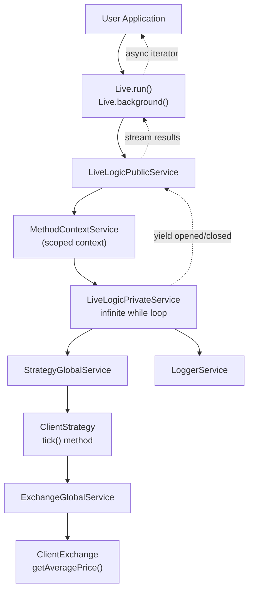
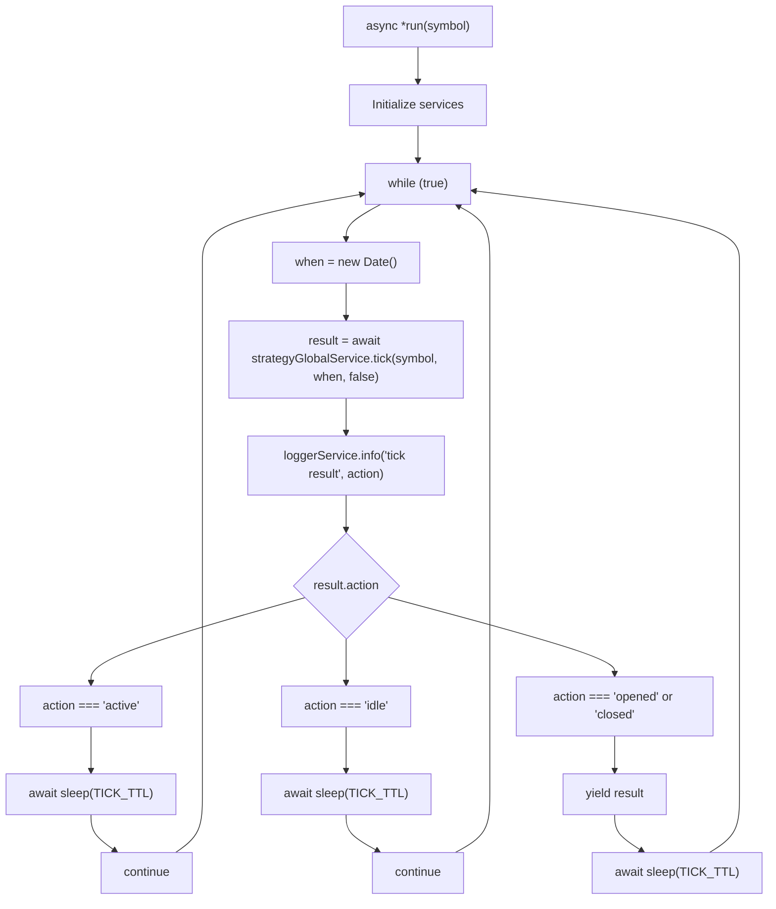
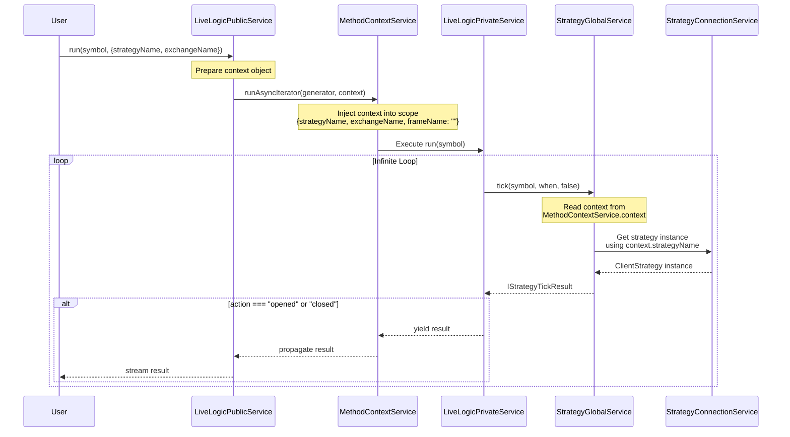
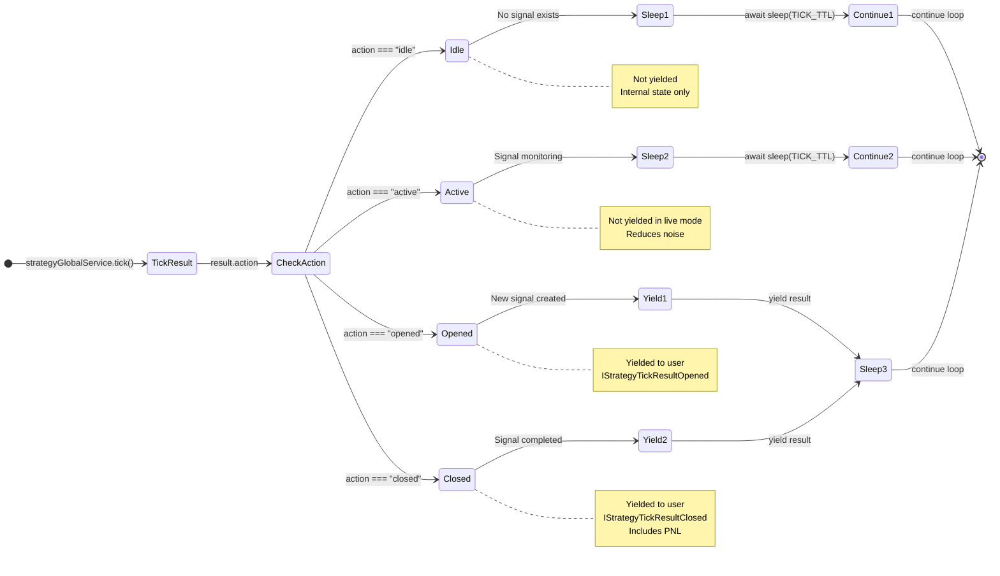
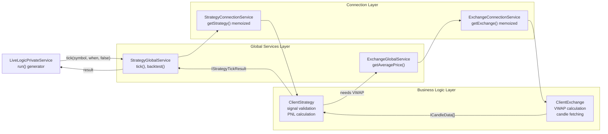
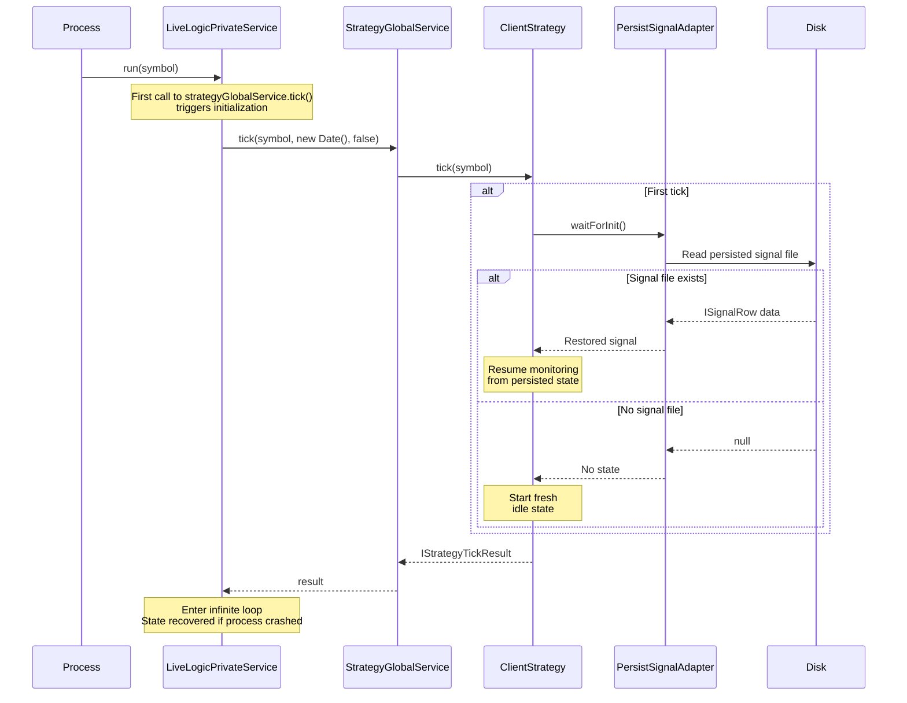

# Live Execution Flow

<details>
<summary>Relevant source files</summary>

The following files were used as context for generating this wiki page:

- [assets/uml.svg](assets/uml.svg)
- [docs/internals.md](docs/internals.md)
- [docs/uml.puml](docs/uml.puml)
- [scripts/_convert-md-mermaid-to-svg.cjs](scripts/_convert-md-mermaid-to-svg.cjs)
- [scripts/gpt-docs.mjs](scripts/gpt-docs.mjs)
- [scripts/uml.mjs](scripts/uml.mjs)
- [src/lib/services/logic/private/BacktestLogicPrivateService.ts](src/lib/services/logic/private/BacktestLogicPrivateService.ts)
- [src/lib/services/logic/private/LiveLogicPrivateService.ts](src/lib/services/logic/private/LiveLogicPrivateService.ts)
- [src/lib/services/logic/public/BacktestLogicPublicService.ts](src/lib/services/logic/public/BacktestLogicPublicService.ts)
- [src/lib/services/logic/public/LiveLogicPublicService.ts](src/lib/services/logic/public/LiveLogicPublicService.ts)
- [test/e2e/timing.test.mjs](test/e2e/timing.test.mjs)

</details>


## Purpose and Scope

This document explains the live trading execution flow orchestrated by `LiveLogicPrivateService` and `LiveLogicPublicService`. It covers the infinite loop mechanics, real-time signal streaming, context propagation, and timing intervals used for continuous market monitoring.

For crash recovery mechanisms and state persistence, see [Crash Recovery](#8.2). For signal monitoring logic (take profit, stop loss, time expiration), see [Real-time Monitoring](#8.3). For the overall live trading system overview, see [Live Trading](#8).

---

## Overview

Live execution in backtest-kit operates as an infinite async generator that continuously monitors trading signals at 1-minute intervals. Unlike backtesting which iterates through historical timeframes, live mode progresses in real-time using `new Date()` at each iteration.

The execution model consists of two layers:
- **LiveLogicPrivateService**: Core orchestration with the infinite loop
- **LiveLogicPublicService**: Public API wrapper with context management

Results stream to consumers as they occur, yielding only `opened` and `closed` signal events while filtering out `idle` and `active` states to reduce noise.

**Sources**: [src/lib/services/logic/private/LiveLogicPrivateService.ts:1-86](), [types.d.ts:707-749]()

---

## Execution Architecture

The following diagram shows how live execution flows through the service layers:

**Live Execution Service Architecture**



**Sources**: [src/lib/services/logic/private/LiveLogicPrivateService.ts:1-86](), [src/lib/services/logic/public/LiveLogicPublicService.ts:1-78]()

---

## Infinite Loop Mechanics

The core of live execution is implemented in `LiveLogicPrivateService.run()` as an infinite async generator:

**Live Loop Structure**



The implementation uses these key constructs:

| Component | Purpose | Location |
|-----------|---------|----------|
| `while (true)` | Infinite loop for continuous monitoring | [src/lib/services/logic/private/LiveLogicPrivateService.ts:58]() |
| `new Date()` | Real-time progression (not historical) | [src/lib/services/logic/private/LiveLogicPrivateService.ts:59]() |
| `strategyGlobalService.tick()` | Check signal state at current time | [src/lib/services/logic/private/LiveLogicPrivateService.ts:61]() |
| `sleep(TICK_TTL)` | Wait 1 minute + 1ms between iterations | [src/lib/services/logic/private/LiveLogicPrivateService.ts:69-80]() |
| `yield result` | Stream opened/closed events to consumer | [src/lib/services/logic/private/LiveLogicPrivateService.ts:78]() |

**Sources**: [src/lib/services/logic/private/LiveLogicPrivateService.ts:53-82]()

---

## Context Propagation

Live execution uses `MethodContextService` to propagate schema names (`strategyName`, `exchangeName`) through the execution chain without explicit parameters:

**Context Propagation Flow**



The context object contains:

```typescript
interface IMethodContext {
  exchangeName: ExchangeName;  // Which exchange to use
  strategyName: StrategyName;  // Which strategy to execute
  frameName: FrameName;        // Empty string for live mode
}
```

This context is read by `StrategyConnectionService` and `ExchangeConnectionService` to route requests to the correct registered schema instances. The scoped context eliminates the need to pass these names as parameters through every function call.

**Sources**: [src/lib/services/logic/public/LiveLogicPublicService.ts:55-74](), [src/lib/services/context/MethodContextService.ts:1-56](), [types.d.ts:315-351]()

---

## Signal Event Streaming

Live execution filters and streams results based on their action type:

**Result Filtering Logic**



The filtering logic prevents overwhelming the consumer with status updates:

| Action Type | Yielded? | Reason | Interface |
|-------------|----------|--------|-----------|
| `idle` | ❌ No | No active signal, nothing to report | `IStrategyTickResultIdle` |
| `active` | ❌ No | Signal being monitored, no change | `IStrategyTickResultActive` |
| `opened` | ✅ Yes | New signal created, user should know | `IStrategyTickResultOpened` |
| `closed` | ✅ Yes | Signal completed with PNL, critical event | `IStrategyTickResultClosed` |

**Sources**: [src/lib/services/logic/private/LiveLogicPrivateService.ts:61-81](), [types.d.ts:441-513]()

---

## Timing and Intervals

Live execution uses precise timing to ensure consistent 1-minute monitoring:

**Timing Constants**

| Constant | Value | Purpose | Location |
|----------|-------|---------|----------|
| `TICK_TTL` | `1 * 60 * 1_000 + 1` | 60,001ms (1 minute + 1ms) | [src/lib/services/logic/private/LiveLogicPrivateService.ts:7]() |

The extra 1ms ensures operations complete before the next tick begins, preventing timing edge cases.

**Timing Diagram**

```mermaid
gantt
    title Live Execution Timing (60-second intervals)
    dateFormat ss
    axisFormat %S
    
    section Tick 1
    Create Date :milestone, t1_date, 00, 0s
    Execute tick() :t1_tick, after t1_date, 5s
    Process result :t1_process, after t1_tick, 2s
    Yield (if needed) :milestone, t1_yield, after t1_process, 0s
    Sleep 60s :t1_sleep, after t1_yield, 53s
    
    section Tick 2
    Create Date :milestone, t2_date, 60, 0s
    Execute tick() :t2_tick, after t2_date, 5s
    Process result :t2_process, after t2_tick, 2s
    Yield (if needed) :milestone, t2_yield, after t2_process, 0s
    Sleep 60s :t2_sleep, after t2_yield, 53s
    
    section Tick 3
    Create Date :milestone, t3_date, 120, 0s
```



Each iteration consists of:
1. **Date creation** (~0ms): Capture current timestamp with `new Date()`
2. **Tick execution** (~100-500ms): Call `strategyGlobalService.tick()` which involves VWAP calculation and signal checking
3. **Result processing** (~10ms): Log and check action type
4. **Yield (conditional)**: Stream result if `opened` or `closed`
5. **Sleep**: Wait for remainder of 60-second interval

**Sources**: [src/lib/services/logic/private/LiveLogicPrivateService.ts:7-82]()

---

## Integration with Global Services

`LiveLogicPrivateService` coordinates with global services to execute strategy logic:

**Service Interaction Diagram**



Key interactions:

1. **StrategyGlobalService.tick()**: Wraps `ClientStrategy.tick()` with execution context injection. Passes `symbol`, `when` (Date), and `backtest=false` flag. [src/lib/services/logic/private/LiveLogicPrivateService.ts:61]()

2. **ClientStrategy**: Executes signal generation logic, monitors active signals, and calculates PNL when signals close.

3. **ExchangeGlobalService**: Called by `ClientStrategy` to fetch real-time VWAP via `getAveragePrice()` for price monitoring.

4. **Context Injection**: `ExecutionContextService` provides `{symbol, when, backtest: false}` to all operations, enabling functions like `getCandles()` to work without explicit parameters.

**Sources**: [src/lib/services/logic/private/LiveLogicPrivateService.ts:1-86](), [types.d.ts:57-95]()

---

## Initialization and Recovery

Before entering the infinite loop, `LiveLogicPrivateService` relies on `ClientStrategy.waitForInit()` to recover persisted state:

**Initialization Sequence**



This initialization ensures:
- **Crash safety**: Process can restart without losing active signals
- **State recovery**: Active signals resume monitoring from persisted state
- **No duplication**: Recovered signals continue from their previous state, not re-opened
- **Lazy initialization**: Recovery happens on first tick, not during service construction

For detailed crash recovery mechanisms, see [Crash Recovery](#8.2).

**Sources**: [src/lib/services/logic/private/LiveLogicPrivateService.ts:53-82](), [types.d.ts:897-959]()

---

## Usage Example

The following example demonstrates live execution with result streaming:

```typescript
import { Live } from "backtest-kit";

// Infinite generator - runs until process terminates
for await (const result of Live.run("BTCUSDT", {
  strategyName: "my-strategy",
  exchangeName: "binance",
})) {
  if (result.action === "opened") {
    console.log(`[OPENED] Signal ID: ${result.signal.id}`);
    console.log(`  Position: ${result.signal.position}`);
    console.log(`  Entry: ${result.signal.priceOpen}`);
    console.log(`  TP: ${result.signal.priceTakeProfit}`);
    console.log(`  SL: ${result.signal.priceStopLoss}`);
  } else if (result.action === "closed") {
    console.log(`[CLOSED] Signal ID: ${result.signal.id}`);
    console.log(`  Reason: ${result.closeReason}`);
    console.log(`  PNL: ${result.pnl.pnlPercentage.toFixed(2)}%`);
    console.log(`  Entry: ${result.pnl.priceOpen}`);
    console.log(`  Exit: ${result.pnl.priceClose}`);
  }
  
  // Loop continues indefinitely
  // Use Ctrl+C or process.exit() to stop
}
```

Each iteration of the loop represents one 1-minute tick. Results stream immediately when signals open or close, enabling real-time event processing and logging.

**Sources**: [types.d.ts:707-749](), [src/lib/services/logic/private/LiveLogicPrivateService.ts:39-52]()