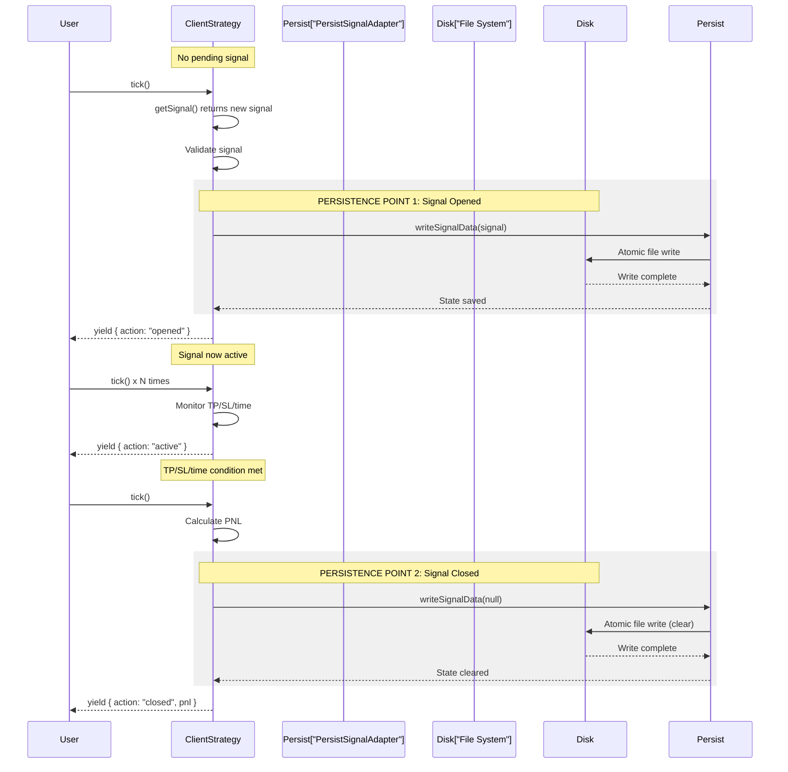
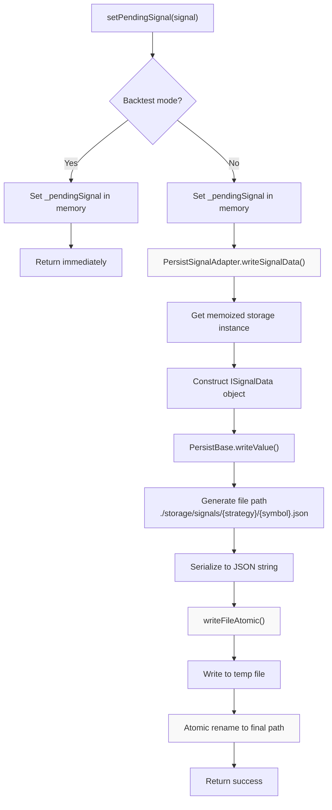
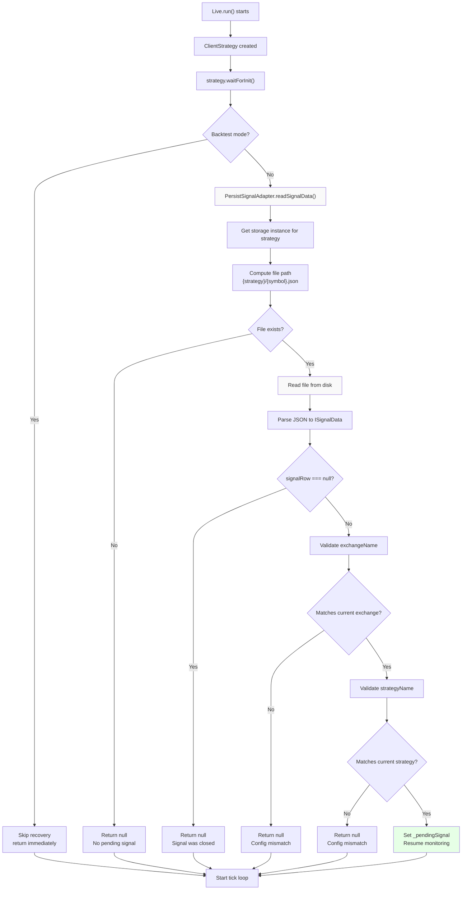
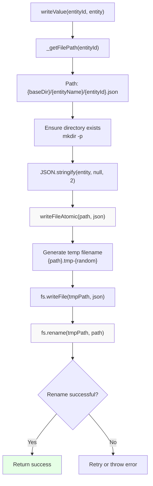
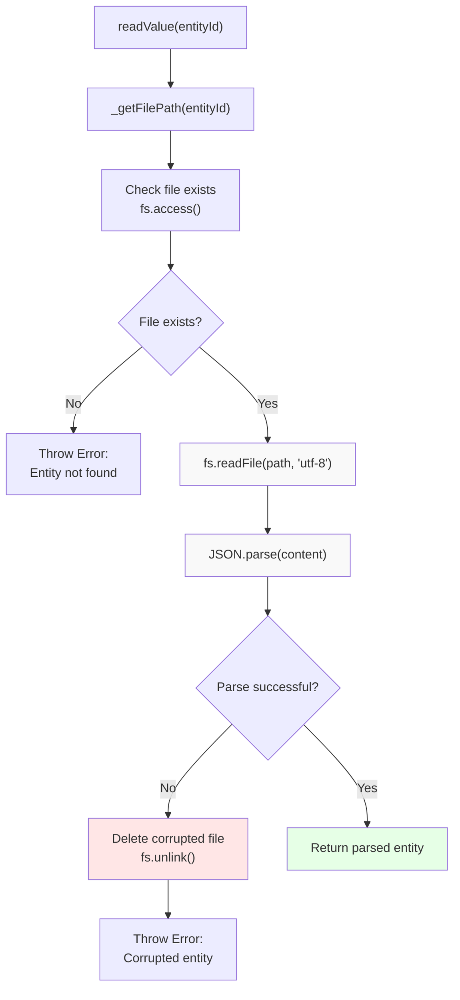
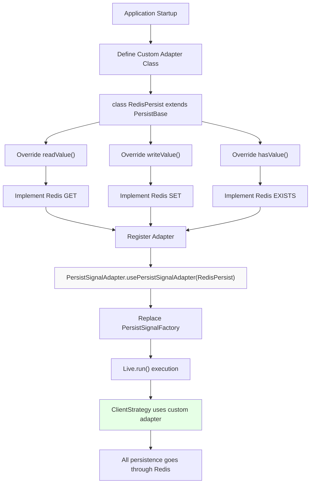
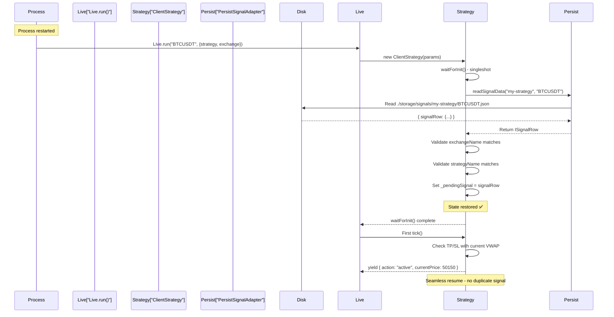
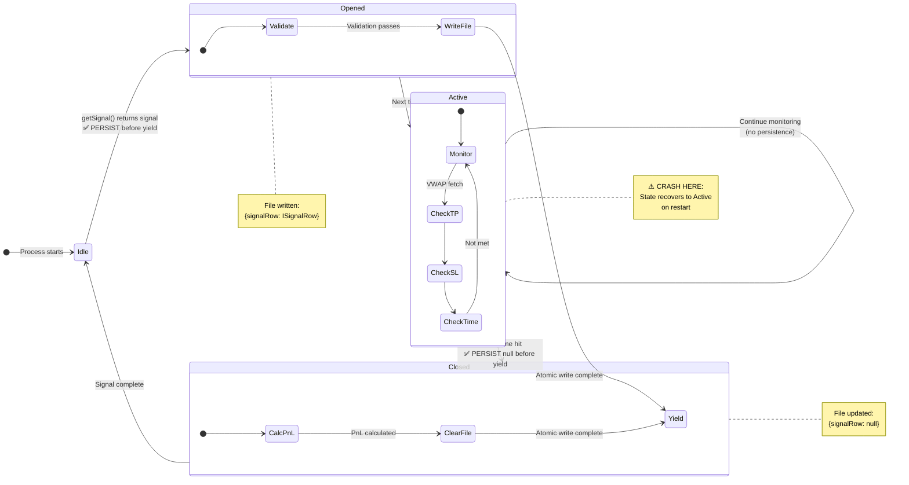

# Crash Recovery

<details>
<summary>Relevant source files</summary>

The following files were used as context for generating this wiki page:

- [README.md](README.md)
- [src/classes/Persist.ts](src/classes/Persist.ts)
- [src/classes/Schedule.ts](src/classes/Schedule.ts)
- [src/client/ClientStrategy.ts](src/client/ClientStrategy.ts)
- [src/config/params.ts](src/config/params.ts)
- [src/interfaces/Strategy.interface.ts](src/interfaces/Strategy.interface.ts)
- [src/lib/services/connection/StrategyConnectionService.ts](src/lib/services/connection/StrategyConnectionService.ts)
- [src/lib/services/global/WalkerGlobalService.ts](src/lib/services/global/WalkerGlobalService.ts)
- [src/lib/services/markdown/BacktestMarkdownService.ts](src/lib/services/markdown/BacktestMarkdownService.ts)
- [src/lib/services/markdown/LiveMarkdownService.ts](src/lib/services/markdown/LiveMarkdownService.ts)
- [src/lib/services/markdown/ScheduleMarkdownService.ts](src/lib/services/markdown/ScheduleMarkdownService.ts)
- [src/utils/writeFileAtomic.ts](src/utils/writeFileAtomic.ts)
- [test/config/setup.mjs](test/config/setup.mjs)
- [test/e2e/defend.test.mjs](test/e2e/defend.test.mjs)
- [test/e2e/sanitize.test.mjs](test/e2e/sanitize.test.mjs)
- [test/spec/scheduled.test.mjs](test/spec/scheduled.test.mjs)

</details>


## Purpose and Scope

This document explains the crash-safe persistence mechanism in the backtest-kit framework that ensures live trading strategies can recover gracefully from process crashes, restarts, or unexpected failures. The crash recovery system prevents duplicate signals and ensures no active trades are lost when the process terminates unexpectedly.

**Scope**: This page covers signal state persistence, atomic file writes, state recovery on restart, and custom persistence adapters. For information about signal lifecycle states, see [Signal States](#6.1). For live trading execution flow, see [Live Execution Flow](#8.1). For backtest mode (which does not use persistence), see [Backtest Execution Flow](#7.1).

**Note**: Crash recovery only applies to live trading mode. Backtest mode skips all persistence operations since historical data can be re-executed deterministically.

---

## Overview

The crash recovery system solves a critical problem in live trading: maintaining signal state across process restarts. Without persistence, a process crash would lose track of open positions, potentially creating duplicate signals or abandoning active trades.

The framework addresses this through:

1. **Atomic File Writes** - Signal state is written to disk atomically before yielding results, preventing partial writes or corruption
2. **Automatic State Recovery** - On restart, `waitForInit()` loads the last known state from disk
3. **Validation Guards** - Ensures loaded state matches current strategy/exchange configuration
4. **Single Source of Truth** - File system serves as the authoritative source for signal state

Sources: [src/client/ClientStrategy.ts:146-165](), [src/client/ClientStrategy.ts:220-233](), [README.md:170-194]()

---

## Persistence Points in Signal Lifecycle

Signal state is persisted at two critical moments to ensure crash safety:

**Diagram: When Persistence Occurs**



**Key Principle**: State is persisted **before** yielding the result to the user. This ensures the disk state is always consistent with what the user observes.

Sources: [src/client/ClientStrategy.ts:220-233](), [src/client/ClientStrategy.ts:258-323](), [src/client/ClientStrategy.ts:374-435]()

---

## Atomic Write Implementation

The `setPendingSignal()` method centralizes all state changes and ensures atomic persistence:

**Diagram: setPendingSignal Flow**



The atomic write prevents corruption even if the process crashes mid-write. The temp file + rename pattern ensures the final file is either complete or doesn't exist.

Sources: [src/client/ClientStrategy.ts:220-233](), [types.d.ts:1095-1108](), [types.d.ts:951-958]()

---

## State Recovery on Restart

When a live trading process restarts, `waitForInit()` restores the signal state before any tick execution:

**Diagram: State Recovery Flow**



**Validation Guards**: The recovery logic validates that the persisted signal matches the current configuration. This prevents resuming with the wrong exchange or strategy after configuration changes.

Sources: [src/client/ClientStrategy.ts:146-165](), [src/client/ClientStrategy.ts:209](), [types.d.ts:1084-1095]()

---

## File-Based Persistence Architecture

The default persistence implementation uses the file system with a structured directory layout:

**Directory Structure**:

```
./storage/signals/
├── strategy-name-1/
│   ├── BTCUSDT.json
│   ├── ETHUSDT.json
│   └── SOLUSDT.json
├── strategy-name-2/
│   ├── BTCUSDT.json
│   └── ETHUSDT.json
└── another-strategy/
    └── BTCUSDT.json
```

Each file contains an `ISignalData` object:

```typescript
// Example: ./storage/signals/my-strategy/BTCUSDT.json
{
  "signalRow": {
    "id": "abc-123-uuid",
    "position": "long",
    "note": "Breakout signal",
    "priceOpen": 50000,
    "priceTakeProfit": 51000,
    "priceStopLoss": 49000,
    "minuteEstimatedTime": 60,
    "timestamp": 1704067200000,
    "symbol": "BTCUSDT",
    "exchangeName": "binance",
    "strategyName": "my-strategy"
  }
}
```

When a signal closes, the file is updated with `signalRow: null`:

```typescript
// After signal closure
{
  "signalRow": null
}
```

**Key Classes**:

| Class | Role | Location |
|-------|------|----------|
| `PersistSignalAdapter` | Global singleton for signal persistence operations | [src/classes/Persist.ts]() |
| `PersistBase` | Base class for file-based CRUD with atomic writes | [src/classes/Persist.ts]() |
| `PersistSignalUtils` | Utility class with memoized storage instances | [types.d.ts:1067-1108]() |

Sources: [types.d.ts:899-903](), [types.d.ts:976-1055](), [types.d.ts:1067-1125]()

---

## PersistBase Internal Mechanism

The `PersistBase` class implements the low-level persistence operations:

**Diagram: PersistBase.writeValue() Internals**



The atomic rename operation (`fs.rename()`) is the critical step that ensures atomicity. On POSIX systems, rename is atomic at the filesystem level, meaning the file either appears complete or doesn't appear at all - no partial writes are visible.

**Diagram: PersistBase.readValue() Internals**



**Auto-Cleanup**: If a file becomes corrupted (invalid JSON), `PersistBase` automatically deletes it and throws an error. This prevents accumulating corrupted files and ensures clean restarts.

Sources: [types.d.ts:976-1055](), [types.d.ts:942-958]()

---

## Custom Persistence Adapters

The framework allows replacing the default file-based persistence with custom implementations (e.g., Redis, PostgreSQL, MongoDB):

**Diagram: Custom Adapter Integration**



**Example Implementation**:

```typescript
// Custom Redis-based persistence adapter
import { PersistBase, PersistSignalAdapter } from "backtest-kit";
import Redis from "ioredis";

const redis = new Redis();

class RedisPersist extends PersistBase {
  async readValue(entityId) {
    const data = await redis.get(`${this.entityName}:${entityId}`);
    if (!data) throw new Error("Entity not found");
    return JSON.parse(data);
  }

  async writeValue(entityId, entity) {
    await redis.set(
      `${this.entityName}:${entityId}`,
      JSON.stringify(entity)
    );
  }

  async hasValue(entityId) {
    return (await redis.exists(`${this.entityName}:${entityId}`)) === 1;
  }
}

// Register before starting live trading
PersistSignalAdapter.usePersistSignalAdapter(RedisPersist);
```

**Requirements**: Custom adapters must extend `PersistBase` and implement the `IPersistBase<ISignalData>` interface. The adapter must handle atomicity and error recovery according to the backing store's capabilities.

Sources: [README.md:676-690](), [types.d.ts:1067-1084](), [types.d.ts:922-959]()

---

## Crash Recovery Example Walkthrough

**Scenario**: A live trading bot crashes while monitoring an active signal. Here's how recovery works:

**Initial State (Before Crash)**:

```typescript
// Bot is running Live.run("BTCUSDT", {...})
// Signal opened at 12:00:00
// File written: ./storage/signals/my-strategy/BTCUSDT.json
{
  "signalRow": {
    "id": "xyz-789",
    "position": "long",
    "priceOpen": 50000,
    "priceTakeProfit": 51000,
    "priceStopLoss": 49000,
    "timestamp": 1704067200000,
    // ... other fields
  }
}

// Bot yields: { action: "opened", signal: {...} }
// Next tick: { action: "active", currentPrice: 50100 }
// ⚠️ PROCESS CRASHES HERE ⚠️
```

**Recovery Sequence (After Restart)**:



**Key Points**:
- No duplicate signal is created because `_pendingSignal` is already set
- The strategy immediately resumes monitoring TP/SL conditions
- If TP/SL was hit during downtime, it will be detected on the first tick
- The user sees `action: "active"` instead of `action: "opened"`, indicating recovery

Sources: [README.md:170-194](), [src/client/ClientStrategy.ts:146-165](), [src/client/ClientStrategy.ts:258-323]()

---

## Backtest Mode Skips Persistence

The crash recovery system is disabled in backtest mode for performance and correctness reasons:

**Comparison Table**:

| Aspect | Live Mode | Backtest Mode |
|--------|-----------|---------------|
| `setPendingSignal()` behavior | Writes to disk atomically | Memory-only update |
| `waitForInit()` behavior | Loads persisted state | Returns immediately (no-op) |
| Crash recovery | Fully enabled | Not applicable |
| Performance | Slower (disk I/O) | Faster (memory-only) |
| Determinism | State survives crashes | Re-run produces identical results |

**Why Skip Persistence in Backtest?**

1. **Performance**: Backtests iterate through thousands of timestamps. Disk I/O on every signal would be prohibitively slow
2. **Determinism**: Historical data can be re-executed. No need to preserve state
3. **Idempotency**: Running the same backtest twice should produce identical results. Persistence would create state pollution

**Code Implementation**:

```typescript
// src/client/ClientStrategy.ts:220-233

public async setPendingSignal(pendingSignal: ISignalRow | null) {
  this.params.logger.debug("ClientStrategy setPendingSignal", {
    pendingSignal,
  });
  this._pendingSignal = pendingSignal;
  
  // Skip persistence in backtest mode
  if (this.params.execution.context.backtest) {
    return;
  }
  
  // Only persist in live mode
  await PersistSignalAdaper.writeSignalData(
    this._pendingSignal,
    this.params.strategyName,
    this.params.execution.context.symbol
  );
}
```

Sources: [src/client/ClientStrategy.ts:220-233](), [src/client/ClientStrategy.ts:146-165]()

---

## Limitations and Edge Cases

### One Signal Per Strategy-Symbol Pair

The persistence system stores **one signal** per `(strategyName, symbol)` combination:

```
./storage/signals/
└── my-strategy/
    ├── BTCUSDT.json     ← One signal for BTCUSDT
    ├── ETHUSDT.json     ← One signal for ETHUSDT
    └── SOLUSDT.json     ← One signal for SOLUSDT
```

**Implication**: If your strategy generates multiple concurrent signals for the same symbol, only the most recent one will be persisted. The framework is designed for **one-signal-at-a-time** strategies.

### Configuration Changes Between Restarts

If you change the strategy or exchange configuration between restarts, the validation guards will reject the persisted state:

```typescript
// First run
Live.run("BTCUSDT", {
  strategyName: "strategy-v1",
  exchangeName: "binance"
});
// Signal persisted for strategy-v1 + binance

// After restart with different config
Live.run("BTCUSDT", {
  strategyName: "strategy-v1",
  exchangeName: "coinbase"  // ❌ Changed exchange
});
// Validation fails: exchangeName mismatch
// Returns null, starts fresh
```

**Rationale**: Prevents executing signals with the wrong exchange/strategy after configuration drift.

### File System Requirements

The default `PersistBase` implementation requires:
- **Write permissions** in the `./storage/signals/` directory
- **Atomic rename support** in the filesystem (POSIX-compliant)
- **Sufficient disk space** for JSON files (typically <1KB per signal)

**Non-POSIX systems**: Windows NTFS supports atomic renames via `MoveFileEx` with `MOVEFILE_REPLACE_EXISTING`. The Node.js `fs.rename()` abstraction handles this correctly.

### Concurrency and Race Conditions

**Single Process**: The framework is designed for single-process execution. Running multiple processes with the same strategy+symbol will cause race conditions on file writes.

**Multi-Symbol Safety**: Running the same strategy on different symbols is safe because each symbol has its own file:
```typescript
// Safe: Different symbols
await Promise.all([
  Live.run("BTCUSDT", { strategyName: "s1", exchangeName: "binance" }),
  Live.run("ETHUSDT", { strategyName: "s1", exchangeName: "binance" }),
]);
```

**Multi-Strategy Safety**: Running different strategies on the same symbol is safe because each strategy has its own directory:
```typescript
// Safe: Different strategies
await Promise.all([
  Live.run("BTCUSDT", { strategyName: "s1", exchangeName: "binance" }),
  Live.run("BTCUSDT", { strategyName: "s2", exchangeName: "binance" }),
]);
```

Sources: [src/client/ClientStrategy.ts:146-165](), [types.d.ts:1095-1108]()

---

## Integration with Signal Lifecycle

The crash recovery system integrates seamlessly with the signal lifecycle state machine:

**State Machine with Persistence Points**:



**Recovery Behavior by State**:

| Last Persisted State | Recovery Behavior | First Tick Result |
|---------------------|-------------------|-------------------|
| No file exists | Starts fresh | `action: "idle"` or `action: "opened"` |
| `signalRow: ISignalRow` | Resumes monitoring | `action: "active"` |
| `signalRow: null` | Starts fresh | `action: "idle"` or `action: "opened"` |

Sources: [src/client/ClientStrategy.ts:258-464](), [src/client/ClientStrategy.ts:220-233]()

---

## Monitoring and Debugging Persistence

The framework provides logging at key persistence points:

**Log Messages to Watch**:

```typescript
// On initialization
"ClientStrategy waitForInit"
// Indicates state recovery attempt

// On signal state change
"ClientStrategy setPendingSignal"
// Indicates persistence operation
// payload: { pendingSignal: ISignalRow | null }

// On tick
"ClientStrategy tick"
// Indicates tick execution start

// On signal closure
"ClientStrategy closing"
// payload: { symbol, signalId, reason, priceClose, closeTimestamp, pnlPercentage }
```

**Debugging Persistence Issues**:

```typescript
import { setLogger } from "backtest-kit";

// Custom logger for debugging
setLogger({
  log: (topic, ...args) => console.log(`[LOG] ${topic}`, args),
  debug: (topic, ...args) => console.debug(`[DEBUG] ${topic}`, args),
  info: (topic, ...args) => console.info(`[INFO] ${topic}`, args),
  warn: (topic, ...args) => console.warn(`[WARN] ${topic}`, args),
});

// Check persistence manually
import { PersistSignalAdapter } from "backtest-kit";

const signal = await PersistSignalAdapter.readSignalData(
  "my-strategy",
  "BTCUSDT"
);
console.log("Persisted signal:", signal);
```

**File System Inspection**:

```bash
# List all persisted signals
ls -lR ./storage/signals/

# View specific signal
cat ./storage/signals/my-strategy/BTCUSDT.json | jq

# Check for corrupted files
find ./storage/signals -name "*.json" -exec sh -c 'jq empty "$1" 2>/dev/null || echo "Corrupted: $1"' _ {} \;
```

Sources: [src/client/ClientStrategy.ts:221-223](), [src/client/ClientStrategy.ts:147](), [types.d.ts:48-49]()