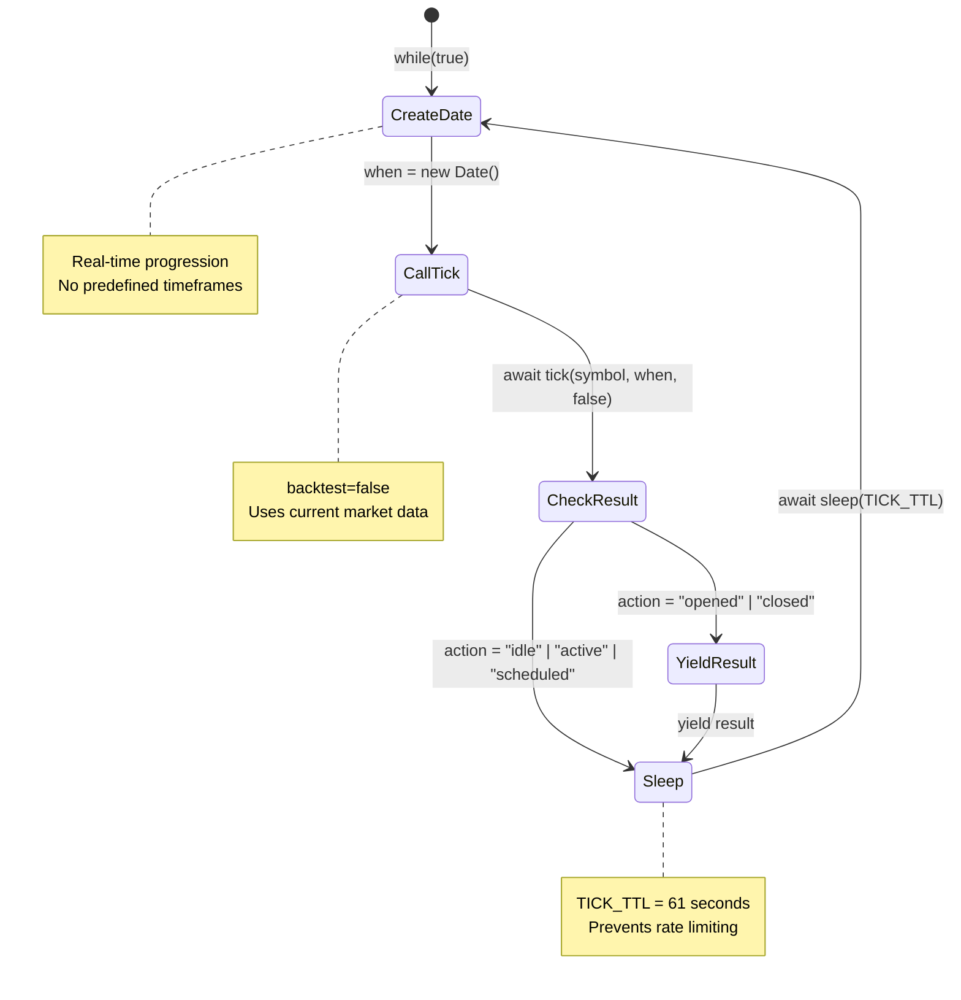
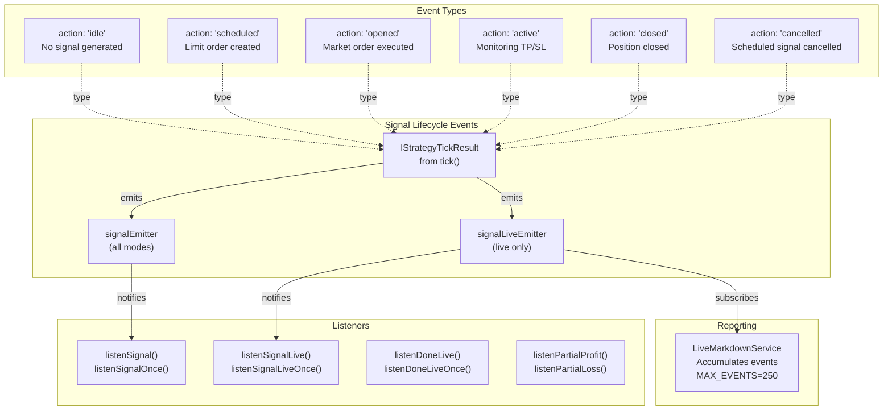

# Live Trading

<details>
<summary>Relevant source files</summary>

The following files were used as context for generating this wiki page:

- [README.md](README.md)
- [src/client/ClientExchange.ts](src/client/ClientExchange.ts)
- [src/lib/services/logic/private/BacktestLogicPrivateService.ts](src/lib/services/logic/private/BacktestLogicPrivateService.ts)
- [src/lib/services/logic/private/LiveLogicPrivateService.ts](src/lib/services/logic/private/LiveLogicPrivateService.ts)
- [src/lib/services/logic/private/WalkerLogicPrivateService.ts](src/lib/services/logic/private/WalkerLogicPrivateService.ts)
- [src/lib/services/markdown/BacktestMarkdownService.ts](src/lib/services/markdown/BacktestMarkdownService.ts)
- [src/lib/services/markdown/LiveMarkdownService.ts](src/lib/services/markdown/LiveMarkdownService.ts)
- [src/lib/services/markdown/ScheduleMarkdownService.ts](src/lib/services/markdown/ScheduleMarkdownService.ts)

</details>


## Purpose and Scope

This document describes the live trading execution mode in backtest-kit, which enables real-time strategy execution with crash recovery guarantees. Live mode runs strategies in an infinite loop against current market data, persisting state atomically to disk after each state transition. This ensures that the system can recover from crashes without losing signals or creating duplicates.

For historical simulation of strategies, see [Backtesting](#9). For strategy comparison, see [Walker Mode](#11). For persistence implementation details, see [Persistence Layer](#15.3).

## Live Trading Overview

Live trading mode differs from backtest mode in several fundamental ways:

| Aspect | Live Mode | Backtest Mode |
|--------|-----------|---------------|
| **Time Progression** | Real-time (`new Date()`) | Predefined timeframes |
| **Loop Type** | Infinite `while(true)` | Finite iteration through frames |
| **Completion** | Never ends (until stopped) | Ends when frames exhausted |
| **State Persistence** | Enabled (crash recovery) | Disabled |
| **Data Access** | Current market data only | Can fetch future candles |
| **Sleep Duration** | 61 seconds between ticks | No sleep (sequential) |
| **Result Streaming** | Yields `opened`, `closed` | Yields `closed` only |

Sources: [src/lib/services/logic/private/LiveLogicPrivateService.ts:1-134](), [src/lib/services/logic/private/BacktestLogicPrivateService.ts:1-388]()

## Live Execution Architecture

```mermaid
graph TB
    subgraph "User Space"
        API["Live.run() / Live.background()"]
        Listeners["listenSignalLive()<br/>listenDoneLive()<br/>listenPartialProfit/Loss()"]
    end
    
    subgraph "Public API Layer"
        LivePublic["LiveLogicPublicService"]
    end
    
    subgraph "Private Execution Layer"
        LivePrivate["LiveLogicPrivateService<br/>while(true) infinite loop"]
        MethodContext["MethodContextService<br/>strategyName, exchangeName"]
    end
    
    subgraph "Strategy Execution"
        StrategyGlobal["StrategyGlobalService"]
        Strategy["ClientStrategy<br/>tick(symbol, when, false)"]
        SignalState["Signal State Machine<br/>idle → scheduled → opened → active → closed"]
    end
    
    subgraph "Persistence Layer"
        PersistSignal["PersistSignalAdapter<br/>Signal state recovery"]
        PersistSchedule["PersistScheduleAdapter<br/>Scheduled signal recovery"]
        PersistRisk["PersistRiskAdapter<br/>Active position recovery"]
        FileSystem["./logs/data/*.json<br/>Atomic writes"]
    end
    
    subgraph "Event System"
        SignalLiveEmitter["signalLiveEmitter"]
        DoneLiveSubject["doneLiveSubject"]
        PerformanceEmitter["performanceEmitter"]
    end
    
    subgraph "Reporting"
        LiveMarkdown["LiveMarkdownService<br/>Accumulates all events<br/>MAX_EVENTS=250"]
        Report["Live.getData()<br/>Live.getReport()<br/>Live.dump()"]
    end
    
    API -->|calls| LivePublic
    LivePublic -->|delegates to| LivePrivate
    LivePrivate -->|creates real-time Date| LivePrivate
    LivePrivate -->|calls tick()| StrategyGlobal
    LivePrivate -->|sleeps TICK_TTL=61s| LivePrivate
    
    StrategyGlobal -->|executes| Strategy
    Strategy -->|transitions| SignalState
    Strategy -->|reads/writes| PersistSignal
    Strategy -->|reads/writes| PersistSchedule
    Strategy -->|reads/writes| PersistRisk
    
    PersistSignal -->|atomic writes| FileSystem
    PersistSchedule -->|atomic writes| FileSystem
    PersistRisk -->|atomic writes| FileSystem
    
    Strategy -->|emits events| SignalLiveEmitter
    LivePrivate -->|emits completion| DoneLiveSubject
    LivePrivate -->|emits timing| PerformanceEmitter
    
    SignalLiveEmitter -->|subscribes| LiveMarkdown
    SignalLiveEmitter -->|notifies| Listeners
    DoneLiveSubject -->|notifies| Listeners
    
    LiveMarkdown -->|provides| Report
```

**Architecture Diagram: Live Trading Execution Flow**

The live trading architecture consists of six layers. The **User Space** provides the entry point via `Live.run()` or `Live.background()` and event listeners. The **Public API Layer** contains `LiveLogicPublicService` which manages method context. The **Private Execution Layer** implements the infinite loop in `LiveLogicPrivateService`, creating real-time timestamps with `new Date()` and sleeping 61 seconds between iterations. The **Strategy Execution** layer contains `ClientStrategy` which manages the signal state machine. The **Persistence Layer** ensures crash recovery through three adapters that perform atomic writes to JSON files. The **Event System** broadcasts all state transitions to subscribers, and the **Reporting** layer accumulates events for analysis.

Sources: [src/lib/services/logic/private/LiveLogicPrivateService.ts:1-134](), [src/lib/services/markdown/LiveMarkdownService.ts:1-749]()

## Infinite Loop Execution

### LiveLogicPrivateService.run()

The core of live trading is an infinite async generator in `LiveLogicPrivateService`:



**State Machine: Live Trading Loop Iteration**

Sources: [src/lib/services/logic/private/LiveLogicPrivateService.ts:61-130]()

### Code Flow

The `run()` method in `LiveLogicPrivateService` implements the infinite loop:

| Step | Code Location | Description |
|------|---------------|-------------|
| 1. Infinite Loop | [line 68]() | `while (true)` - Never terminates naturally |
| 2. Create Timestamp | [line 70]() | `const when = new Date()` - Real-time progression |
| 3. Tick Execution | [line 74]() | `await strategyGlobalService.tick(symbol, when, false)` |
| 4. Error Handling | [lines 75-88]() | Catch tick failures, log, emit error, sleep and retry |
| 5. Performance Tracking | [lines 95-108]() | Emit timing metrics via `performanceEmitter` |
| 6. Filter Actions | [lines 110-123]() | Skip `idle`, `active`, `scheduled` actions |
| 7. Yield Results | [line 126]() | Yield `opened` or `closed` results |
| 8. Sleep | [line 128]() | `await sleep(TICK_TTL)` - 61 seconds |

Sources: [src/lib/services/logic/private/LiveLogicPrivateService.ts:61-130]()

### TICK_TTL Constant

The sleep duration between iterations is defined as:

```typescript
const TICK_TTL = 1 * 60 * 1_000 + 1; // 61 seconds
```

This value:
- **Prevents rate limiting** from exchanges (most have 1-minute rate limits)
- **Aligns with 1-minute candles** used for VWAP calculation
- **Provides time for signal processing** before next iteration
- **Avoids duplicate signal generation** via interval throttling

Sources: [src/lib/services/logic/private/LiveLogicPrivateService.ts:12]()

## Crash Recovery System

### Persistence Architecture

```mermaid
graph LR
    subgraph "ClientStrategy"
        Tick["tick()<br/>Check signal status"]
        WaitInit["waitForInit()<br/>Load persisted state"]
        Stop["stop()<br/>Save signal state"]
    end
    
    subgraph "Persistence Adapters"
        PersistSignal["PersistSignalAdapter<br/>Active signal storage"]
        PersistSchedule["PersistScheduleAdapter<br/>Scheduled signal storage"]
        PersistRisk["PersistRiskAdapter<br/>Active positions list"]
    end
    
    subgraph "File Storage"
        SignalFiles["./logs/data/signal/<br/>{strategyName}/<br/>{symbol}.json"]
        ScheduleFiles["./logs/data/schedule/<br/>{strategyName}/<br/>{symbol}.json"]
        RiskFiles["./logs/data/risk/<br/>{riskName}/<br/>positions.json"]
    end
    
    WaitInit -->|readValue()| PersistSignal
    WaitInit -->|readValue()| PersistSchedule
    Tick -->|writeValue()| PersistSignal
    Tick -->|writeValue()| PersistSchedule
    Stop -->|writeValue()| PersistSignal
    
    PersistSignal -->|atomic write| SignalFiles
    PersistSchedule -->|atomic write| ScheduleFiles
    PersistRisk -->|atomic write| RiskFiles
```

**Crash Recovery Architecture: Persistence Flow**

Sources: [src/lib/services/markdown/LiveMarkdownService.ts:1-749](), [README.md:755-766]()

### State Restoration Process

When live trading restarts after a crash:

1. **Initialization**: `ClientStrategy.waitForInit(false)` is called
2. **Signal Recovery**: `PersistSignalAdapter` reads `{symbol}.json` for active signals
3. **Schedule Recovery**: `PersistScheduleAdapter` reads scheduled signals
4. **Risk Recovery**: `PersistRiskAdapter` reads active positions list
5. **Resume Execution**: Strategy continues from last persisted state

The `waitForInit()` method ensures all persistence adapters are ready before execution begins. This prevents the system from generating new signals before recovering existing ones, which would create duplicates.

Sources: [README.md:19-20](), [README.md:409-410]()

### Atomic Writes

All persistence operations use atomic writes via a temporary file pattern:

1. Write data to `{filename}.tmp`
2. Call `fsync()` to ensure data is on disk
3. Rename `{filename}.tmp` to `{filename}` (atomic operation)

This ensures that:
- **No partial writes** occur during crashes
- **No corrupted state files** are created
- **Recovery always works** from last complete state

Sources: [README.md:19-20]()

## Real-time Monitoring

### Event Emission

Live mode emits events through multiple channels:



**Event Flow: Live Trading Monitoring**

Sources: [src/lib/services/markdown/LiveMarkdownService.ts:38-66](), [src/lib/services/markdown/LiveMarkdownService.ts:600-617]()

### LiveMarkdownService

The `LiveMarkdownService` accumulates all events for reporting:

| Method | Purpose | Return Type |
|--------|---------|-------------|
| `tick(data)` | Private method subscribed to `signalLiveEmitter` | `void` |
| `getData(symbol, strategyName)` | Returns statistical data | `Promise<LiveStatistics>` |
| `getReport(symbol, strategyName)` | Generates markdown report | `Promise<string>` |
| `dump(symbol, strategyName, path?)` | Saves report to disk | `Promise<void>` |
| `clear(ctx?)` | Clears accumulated data | `Promise<void>` |

Sources: [src/lib/services/markdown/LiveMarkdownService.ts:567-745]()

### LiveStatistics Interface

The `LiveStatistics` interface provides comprehensive metrics:

```typescript
interface LiveStatistics {
  eventList: TickEvent[];              // All events with full details
  totalEvents: number;                 // Includes idle, opened, active, closed
  totalClosed: number;                 // Closed signals only
  winCount: number;                    // PNL > 0
  lossCount: number;                   // PNL < 0
  winRate: number | null;              // Percentage (0-100)
  avgPnl: number | null;               // Average PNL per signal
  totalPnl: number | null;             // Cumulative PNL
  stdDev: number | null;               // Standard deviation
  sharpeRatio: number | null;          // Risk-adjusted return
  annualizedSharpeRatio: number | null; // Sharpe × √365
  certaintyRatio: number | null;       // avgWin / |avgLoss|
  expectedYearlyReturns: number | null; // Based on avg duration
}
```

All numeric metrics return `null` if calculation is unsafe (NaN, Infinity). This ensures safe math operations in all environments.

Sources: [src/lib/services/markdown/LiveMarkdownService.ts:91-130]()

### Event Storage Optimization

The `LiveMarkdownService` implements optimizations to prevent memory bloat:

1. **MAX_EVENTS Limit**: Only stores last 250 events (configurable via `MAX_EVENTS` constant)
2. **Idle Event Deduplication**: Replaces consecutive idle events if no opened/active events between them
3. **Signal Event Replacement**: Updates existing events with same `signalId` instead of creating duplicates

**Idle Event Logic**:
```
If last event is idle AND no opened/active events after it:
  Replace last idle event with new idle event
Else:
  Append new idle event and trim to MAX_EVENTS
```

Sources: [src/lib/services/markdown/LiveMarkdownService.ts:223-266]()

## Interval Throttling

### SignalInterval Configuration

Each strategy defines a minimum interval between signal generation:

```typescript
addStrategy({
  strategyName: "my-strategy",
  interval: "5m", // Minimum 5 minutes between signals
  getSignal: async (symbol) => {
    // Signal generation logic
  }
});
```

The `interval` field accepts:
- `"1m"` - 1 minute
- `"3m"` - 3 minutes
- `"5m"` - 5 minutes
- `"15m"` - 15 minutes
- `"30m"` - 30 minutes
- `"1h"` - 1 hour
- Other standard candle intervals

Sources: [README.md:130-143]()

### Throttling Implementation

```mermaid
sequenceDiagram
    participant Loop as LiveLogicPrivateService
    participant Strategy as ClientStrategy
    participant LastTime as _lastSignalTimestamp
    participant GetSignal as getSignal()
    
    Loop->>Strategy: tick(symbol, when, false)
    Strategy->>LastTime: Check last signal time
    
    alt Within interval
        LastTime-->>Strategy: Skip signal generation
        Strategy-->>Loop: action: "idle" | "active"
    else Interval expired
        LastTime->>GetSignal: Call getSignal()
        GetSignal-->>Strategy: Return signal
        Strategy->>LastTime: Update timestamp
        Strategy-->>Loop: action: "scheduled" | "opened"
    end
    
    Loop->>Loop: Sleep TICK_TTL (61s)
```

**Sequence: Interval Throttling Logic**

The throttling prevents:
- **Signal spam** during volatile markets
- **Over-trading** and excessive fees
- **Rate limit violations** from exchanges
- **Duplicate signals** on same price movement

Sources: [README.md:131](), [README.md:409-410]()

### Interaction with TICK_TTL

The relationship between `interval` and `TICK_TTL`:

| Configuration | Behavior | Example |
|---------------|----------|---------|
| `interval: "1m"`, `TICK_TTL: 61s` | Every tick can generate signal | Signal every 1 minute |
| `interval: "5m"`, `TICK_TTL: 61s` | Signal generation every ~5 minutes | Skips 4 ticks, generates on 5th |
| `interval: "1h"`, `TICK_TTL: 61s` | Signal generation every ~60 minutes | Skips 59 ticks, generates on 60th |

The `interval` provides strategy-level throttling, while `TICK_TTL` provides system-level rate limiting. Both work together to prevent over-trading.

Sources: [src/lib/services/logic/private/LiveLogicPrivateService.ts:12]()

## Public API Usage

### Live.run() - Async Generator

```typescript
import { Live } from "backtest-kit";

// Manual iteration with full control
for await (const result of Live.run("BTCUSDT", {
  strategyName: "my-strategy",
  exchangeName: "binance"
})) {
  if (result.action === "opened") {
    console.log("Position opened:", result.signal.id);
  }
  
  if (result.action === "closed") {
    console.log("Position closed:", {
      reason: result.closeReason,
      pnl: result.pnl.pnlPercentage
    });
    
    // Early termination based on conditions
    if (result.pnl.pnlPercentage < -10) {
      console.log("Stop loss threshold reached, exiting");
      break;
    }
  }
}
```

The `run()` method returns an async generator that:
- **Yields on opened signals** (new positions)
- **Yields on closed signals** (completed positions)
- **Skips idle/active states** (internal monitoring)
- **Runs forever** unless manually broken

Sources: [README.md:383-407]()

### Live.background() - Fire and Forget

```typescript
import { Live, listenSignalLive } from "backtest-kit";

// Background mode with event listeners
const stop = Live.background("BTCUSDT", {
  strategyName: "my-strategy",
  exchangeName: "binance"
});

// Listen to events
listenSignalLive((event) => {
  console.log("Event:", event.action);
  
  if (event.action === "closed") {
    console.log("PNL:", event.pnl.pnlPercentage);
  }
});

// Stop when needed
setTimeout(() => {
  stop();
  console.log("Live trading stopped");
}, 60 * 60 * 1000); // Stop after 1 hour
```

The `background()` method:
- **Starts execution immediately** without waiting
- **Returns stop function** for graceful shutdown
- **Requires event listeners** for monitoring
- **Runs in separate async context** (non-blocking)

Sources: [README.md:383-407]()

### Report Generation

```typescript
import { Live } from "backtest-kit";

// Get statistical data
const stats = await Live.getData("BTCUSDT", "my-strategy");
console.log("Win rate:", stats.winRate);
console.log("Sharpe ratio:", stats.sharpeRatio);
console.log("Total PNL:", stats.totalPnl);

// Generate markdown report
const markdown = await Live.getReport("BTCUSDT", "my-strategy");
console.log(markdown);

// Save report to disk
await Live.dump("BTCUSDT", "my-strategy");
// Saves to: ./dump/live/my-strategy.md
```

Sources: [README.md:383-407]()

## Comparison with Backtest Mode

### Execution Differences

```mermaid
graph TB
    subgraph "Backtest Mode"
        BT_Frame["FrameGlobalService<br/>Predefined timeframes"]
        BT_Loop["for (i = 0; i < timeframes.length; i++)"]
        BT_Tick["tick(symbol, timeframes[i], true)"]
        BT_Signal["If signal opened"]
        BT_Candles["getNextCandles(future)"]
        BT_Backtest["backtest(candles)"]
        BT_Skip["Skip to closeTimestamp"]
        BT_Yield["Yield closed result"]
        BT_Complete["[*] Complete"]
        
        BT_Frame --> BT_Loop
        BT_Loop --> BT_Tick
        BT_Tick --> BT_Signal
        BT_Signal --> BT_Candles
        BT_Candles --> BT_Backtest
        BT_Backtest --> BT_Skip
        BT_Skip --> BT_Loop
        BT_Backtest --> BT_Yield
        BT_Yield --> BT_Loop
        BT_Loop --> BT_Complete
    end
    
    subgraph "Live Mode"
        Live_Loop["while (true)"]
        Live_Date["when = new Date()"]
        Live_Tick["tick(symbol, when, false)"]
        Live_Action["Check action"]
        Live_Yield["Yield opened/closed"]
        Live_Sleep["sleep(TICK_TTL)"]
        Live_Continue["[*] Never ends"]
        
        Live_Loop --> Live_Date
        Live_Date --> Live_Tick
        Live_Tick --> Live_Action
        Live_Action --> Live_Yield
        Live_Action --> Live_Sleep
        Live_Yield --> Live_Sleep
        Live_Sleep --> Live_Loop
        Live_Loop --> Live_Continue
    end
```



**Comparison: Backtest vs Live Execution Flow**

Sources: [src/lib/services/logic/private/BacktestLogicPrivateService.ts:62-384](), [src/lib/services/logic/private/LiveLogicPrivateService.ts:61-130]()

### Key Differences Table

| Feature | Backtest Mode | Live Mode |
|---------|---------------|-----------|
| **Time Source** | `timeframes[i]` from `FrameGlobalService` | `new Date()` real-time |
| **Loop Type** | Finite `for` loop | Infinite `while(true)` |
| **Completion** | When `i >= timeframes.length` | Never (until stopped) |
| **Persistence** | Not used (backtest=true) | Required (backtest=false) |
| **Future Data** | Can call `getNextCandles()` | Cannot access future data |
| **Fast Forward** | Calls `backtest()` with candle array | Calls `tick()` only |
| **Skip Ahead** | Skips timeframes after signal opens | No skipping (real-time) |
| **Sleep** | No sleep (fast execution) | 61 seconds between ticks |
| **Events** | `signalBacktestEmitter` | `signalLiveEmitter` |
| **Report** | `BacktestMarkdownService` | `LiveMarkdownService` |

Sources: [src/lib/services/logic/private/BacktestLogicPrivateService.ts:1-388](), [src/lib/services/logic/private/LiveLogicPrivateService.ts:1-134]()

## Production Deployment Considerations

### Crash Recovery Testing

To verify crash recovery works correctly:

1. **Start live trading** with a strategy
2. **Wait for signal to open** (monitor via `listenSignalLive`)
3. **Kill the process** (Ctrl+C or `kill -9`)
4. **Restart the process** with same code
5. **Verify signal recovery** - should resume without duplicates

Example test:
```typescript
import { Live, listenSignalLive } from "backtest-kit";

Live.background("BTCUSDT", {
  strategyName: "my-strategy",
  exchangeName: "binance"
});

listenSignalLive((event) => {
  console.log(`[${event.action}]`, event.signal?.id);
});

// After crash and restart:
// Should see: [active] signal-id-123 (recovered from disk)
// Should NOT see: [opened] signal-id-123 (duplicate)
```

Sources: [README.md:409-410]()

### Graceful Shutdown

To stop live trading cleanly:

```typescript
const stop = Live.background("BTCUSDT", {
  strategyName: "my-strategy",
  exchangeName: "binance"
});

// Handle SIGINT (Ctrl+C)
process.on("SIGINT", async () => {
  console.log("Stopping live trading...");
  stop();
  
  // Wait for current tick to complete
  await new Promise(resolve => setTimeout(resolve, 2000));
  
  // Save final report
  await Live.dump("BTCUSDT", "my-strategy");
  
  process.exit(0);
});
```

The `stop()` function:
- **Sets internal flag** to stop iteration
- **Completes current tick** before stopping
- **Does NOT** immediately kill the process
- **Allows cleanup** via await after calling stop

Sources: [README.md:406]()

### Error Handling

Live mode implements automatic error recovery:

1. **Tick Failure**: Caught in `try/catch` at [lines 75-88]()
2. **Error Logging**: Via `loggerService.warn()`
3. **Error Event**: Emitted via `errorEmitter`
4. **Sleep and Retry**: Continues after `TICK_TTL` sleep
5. **No Crash**: Process continues running

This ensures temporary network issues or exchange API failures don't crash the system.

Sources: [src/lib/services/logic/private/LiveLogicPrivateService.ts:75-88]()

### Performance Monitoring

Live mode emits performance metrics via `performanceEmitter`:

```typescript
await performanceEmitter.next({
  timestamp: Date.now(),
  previousTimestamp: previousEventTimestamp,
  metricType: "live_tick",
  duration: tickEndTime - tickStartTime,
  strategyName: this.methodContextService.context.strategyName,
  exchangeName: this.methodContextService.context.exchangeName,
  symbol,
  backtest: false,
});
```

This enables monitoring of:
- **Tick execution time** - Duration of each tick
- **Time between ticks** - Gap analysis
- **Bottleneck detection** - Slow operations
- **System health** - Overall performance

Sources: [src/lib/services/logic/private/LiveLogicPrivateService.ts:95-108]()

### Resource Usage

Live mode is designed for long-running processes:

| Resource | Usage Pattern | Optimization |
|----------|---------------|--------------|
| **Memory** | `O(1)` per strategy | Memoized storage with MAX_EVENTS cap |
| **CPU** | Low (sleeps 61s) | Only active during ticks |
| **Disk I/O** | Atomic writes | Only on state transitions |
| **Network** | Minimal | Only fetches current candles |

The `MAX_EVENTS = 250` limit in `LiveMarkdownService` prevents unbounded memory growth:
- Stores last 250 events per symbol-strategy pair
- Oldest events are trimmed automatically
- FIFO queue with efficient shift operations

Sources: [src/lib/services/markdown/LiveMarkdownService.ts:223]()