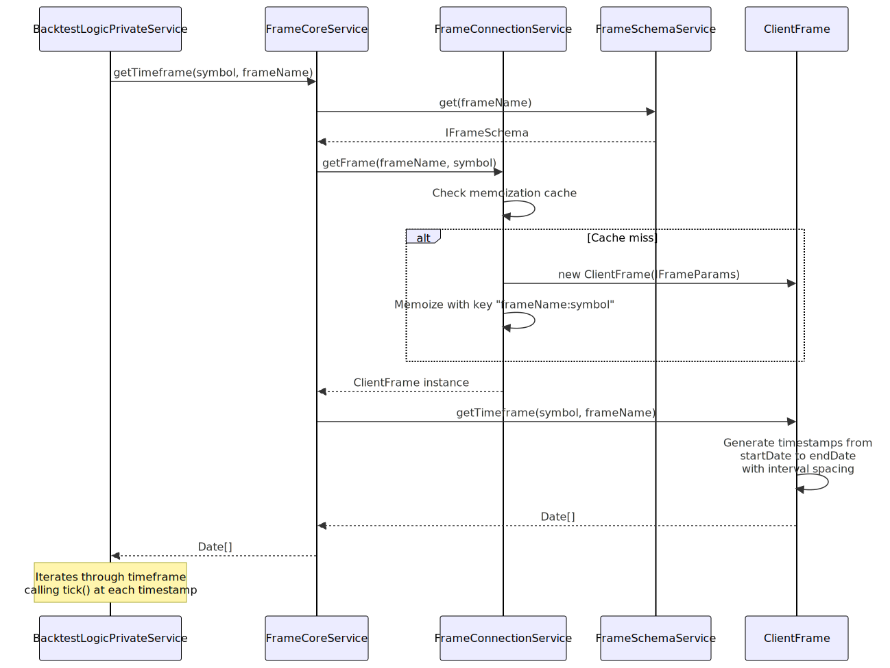

# Timeframe Generation

## Purpose and Scope

Timeframe generation is the process of creating a sequential array of timestamps that define when strategy evaluation occurs during backtesting. The `FrameCoreService` generates these timestamps based on a configured `IFrameSchema`, which specifies the start date, end date, and interval granularity. This timestamp array drives the backtest execution loop, determining at which points in historical time the strategy's `getSignal()` function is evaluated.

For information about how these generated timeframes are consumed during backtest execution, see [Backtest Execution Flow](./55_Backtest_Execution_Flow.md). For details on how signals are processed at each timeframe tick, see [Fast-Forward Simulation](./57_Fast-Forward_Simulation.md).

---

## Frame Schema Configuration

Frames are registered via the `addFrame()` function using the `IFrameSchema` interface, which defines the backtest period boundaries and tick granularity.

### Frame Schema Structure

```typescript
interface IFrameSchema {
  frameName: FrameName;           // Unique identifier for retrieval
  note?: string;                  // Optional documentation
  interval: FrameInterval;        // Tick spacing (1m, 5m, 1h, etc.)
  startDate: Date;                // Backtest period start (inclusive)
  endDate: Date;                  // Backtest period end (inclusive)
  callbacks?: Partial<IFrameCallbacks>;  // Optional lifecycle hooks
}
```

**Key Parameters:**

| Parameter | Type | Purpose | Example |
|-----------|------|---------|---------|
| `frameName` | `string` | Registry key for frame retrieval | `"1-month-test"` |
| `interval` | `FrameInterval` | Spacing between timestamps | `"1m"`, `"15m"`, `"1h"` |
| `startDate` | `Date` | First timestamp (inclusive) | `new Date("2024-01-01T00:00:00Z")` |
| `endDate` | `Date` | Last timestamp (inclusive) | `new Date("2024-01-31T23:59:59Z")` |

The generated timeframe array will contain timestamps starting at `startDate` and incrementing by `interval` until reaching or exceeding `endDate`.

**Sources:** [types.d.ts:262-275](), [src/index.ts:90]()

---

## Frame Intervals

The `FrameInterval` type defines supported tick granularities for timeframe generation. Each interval determines the temporal resolution of the backtest.



**Interval Duration Mapping:**

| FrameInterval | Milliseconds | Minutes | Typical Use Case |
|---------------|--------------|---------|------------------|
| `1m` | 60,000 | 1 | High-frequency scalping |
| `3m` | 180,000 | 3 | Scalping with reduced noise |
| `5m` | 300,000 | 5 | Short-term day trading |
| `15m` | 900,000 | 15 | Swing trading entry |
| `30m` | 1,800,000 | 30 | Intraday momentum |
| `1h` | 3,600,000 | 60 | Hourly trend analysis |
| `2h` | 7,200,000 | 120 | Multi-hour position holding |
| `4h` | 14,400,000 | 240 | Position trading |
| `6h` | 21,600,000 | 360 | Extended swing trades |
| `8h` | 28,800,000 | 480 | Daily session alignment |
| `12h` | 43,200,000 | 720 | Half-day intervals |
| `1d` | 86,400,000 | 1440 | Daily signals |
| `3d` | 259,200,000 | 4320 | Multi-day position strategies |

**Important:** The `SignalInterval` type (used for strategy throttling) supports only `"1m" | "3m" | "5m" | "15m" | "30m" | "1h"`, while `FrameInterval` includes additional hour and day intervals. This allows backtests to run at coarser granularity than signal generation.

**Sources:** [types.d.ts:219](), [types.d.ts:647]()

---

## Timeframe Generation Architecture

The frame system follows a layered architecture where schemas are registered, validated, and then used to instantiate `ClientFrame` instances that generate timestamp arrays.



**Sources:** [src/lib/services/logic/private/BacktestLogicPrivateService.ts:69-72]()

---

## FrameCoreService and Timeframe Retrieval

The `FrameCoreService` acts as the entry point for timeframe retrieval during backtest execution. It injects the `MethodContext` (containing `frameName`) and delegates to `FrameConnectionService` for instance creation.

### Timeframe Retrieval Flow



**Key Points:**

1. **Memoization:** `FrameConnectionService` caches `ClientFrame` instances using the composite key `"${frameName}:${symbol}"` to prevent duplicate instantiation
2. **Schema Retrieval:** The `IFrameSchema` is fetched from `FrameSchemaService` on each call, but the `ClientFrame` instance is reused
3. **Timestamp Array:** `ClientFrame.getTimeframe()` returns a complete `Date[]` array representing the entire backtest period
4. **Memory Efficiency:** While the full array is returned, the backtest loop consumes it sequentially, allowing early termination

**Sources:** [src/lib/services/logic/private/BacktestLogicPrivateService.ts:69-72](), [types.d.ts:280-289]()

---

## ClientFrame Implementation

The `ClientFrame` class implements the timestamp generation logic based on the configured `IFrameSchema` parameters.

### Timestamp Generation Algorithm



**Generation Process:**

1. **Initialization:** Start at `startDate` timestamp
2. **Iteration:** While `current <= endDate`:
   - Add `current` timestamp to array
   - Increment `current` by `interval` milliseconds
3. **Callback:** Invoke `onTimeframe()` if configured in schema
4. **Return:** Full timestamp array

**Example Generation:**

```typescript
// Frame Schema
{
  frameName: "hourly-test",
  interval: "1h",
  startDate: new Date("2024-01-01T00:00:00Z"),
  endDate: new Date("2024-01-01T03:00:00Z")
}

// Generated Timeframe Array
[
  new Date("2024-01-01T00:00:00Z"),  // 00:00
  new Date("2024-01-01T01:00:00Z"),  // 01:00
  new Date("2024-01-01T02:00:00Z"),  // 02:00
  new Date("2024-01-01T03:00:00Z"),  // 03:00
]
// Total: 4 timestamps
```

**Sources:** [types.d.ts:280-289](), [types.d.ts:262-275]()

---

## Integration with Backtest Execution

The generated timeframe array drives the backtest execution loop in `BacktestLogicPrivateService`. Each timestamp represents a moment when the strategy's `getSignal()` function is evaluated.

### Backtest Loop with Timeframe



**Execution Flow in BacktestLogicPrivateService:**

```typescript
// 1. Retrieve timeframes
const timeframes = await this.frameCoreService.getTimeframe(
  symbol,
  this.methodContextService.context.frameName
);
const totalFrames = timeframes.length;

// 2. Iterate through timeframes
let i = 0;
while (i < timeframes.length) {
  const when = timeframes[i];
  
  // 3. Evaluate strategy at this timestamp
  const result = await this.strategyCoreService.tick(symbol, when, true);
  
  // 4. Handle result (opened, active, idle, closed)
  if (result.action === "opened") {
    // Fetch candles and run backtest()
    // Skip timeframes until signal closes
  }
  
  i++;
}
```

**Timeframe Skipping:** When a signal opens, the backtest fetches future candles and fast-forwards through the signal's lifetime. The loop skips timeframes by incrementing `i` until reaching the signal's `closeTimestamp`, avoiding redundant `tick()` calls while a position is active.

**Sources:** [src/lib/services/logic/private/BacktestLogicPrivateService.ts:69-72](), [src/lib/services/logic/private/BacktestLogicPrivateService.ts:78-453]()

---

## Frame Lifecycle Callbacks

The `IFrameCallbacks` interface provides a hook for observing timeframe generation completion. This is primarily used for logging, validation, or custom analytics.

### onTimeframe Callback

```typescript
interface IFrameCallbacks {
  onTimeframe: (
    timeframe: Date[],        // Generated timestamp array
    startDate: Date,          // Frame start (from schema)
    endDate: Date,            // Frame end (from schema)
    interval: FrameInterval   // Interval used (from schema)
  ) => void;
}
```

**Usage Example:**

```typescript
addFrame({
  frameName: "1-week-backtest",
  interval: "1h",
  startDate: new Date("2024-01-01T00:00:00Z"),
  endDate: new Date("2024-01-07T23:59:59Z"),
  callbacks: {
    onTimeframe: (timeframe, startDate, endDate, interval) => {
      console.log(`Generated ${timeframe.length} timestamps`);
      console.log(`Period: ${startDate.toISOString()} to ${endDate.toISOString()}`);
      console.log(`Interval: ${interval}`);
      
      // Validate generation
      const expectedCount = Math.floor(
        (endDate.getTime() - startDate.getTime()) / (60 * 60 * 1000)
      ) + 1;
      if (timeframe.length !== expectedCount) {
        console.warn(`Expected ${expectedCount} timestamps, got ${timeframe.length}`);
      }
    }
  }
});
```

**Common Use Cases:**

| Use Case | Implementation |
|----------|----------------|
| **Logging** | Log timestamp count for audit trail |
| **Validation** | Verify generated array matches expected size |
| **Progress Tracking** | Update UI with timeframe generation completion |
| **Analytics** | Calculate estimated backtest duration based on frame size |
| **Testing** | Assert correct timestamp generation in unit tests |

**Sources:** [types.d.ts:231-242](), [types.d.ts:262-275]()

---

## Frame Validation

The `FrameValidationService` ensures that registered `IFrameSchema` objects meet system requirements before they are stored in `FrameSchemaService`.

### Validation Rules



**Key Validation Checks:**

1. **frameName:** Must be non-empty string
2. **interval:** Must be one of the valid `FrameInterval` values
3. **startDate:** Must be a `Date` object earlier than `endDate`
4. **endDate:** Must be a `Date` object later than `startDate`
5. **callbacks:** If provided, `onTimeframe` must be a function

**Sources:** [types.d.ts:262-275]()

---

## Performance Considerations

Timeframe generation has several performance implications for backtest execution:

### Memory Usage

| Frame Configuration | Timeframe Size | Memory Impact |
|---------------------|----------------|---------------|
| 1-day @ 1m interval | ~1,440 timestamps | ~12 KB |
| 1-week @ 1m interval | ~10,080 timestamps | ~80 KB |
| 1-month @ 1m interval | ~43,200 timestamps | ~345 KB |
| 1-year @ 1m interval | ~525,600 timestamps | ~4.2 MB |
| 1-year @ 1h interval | ~8,760 timestamps | ~70 KB |

**Recommendation:** For long-term backtests (> 6 months), use hourly or daily intervals to reduce memory footprint and iteration overhead.

### Iteration Overhead

Each timestamp in the timeframe array requires:
1. **Context setup:** `ExecutionContextService.runInContext()` invocation
2. **Strategy tick:** `ClientStrategy.tick()` call with signal state checks
3. **Exchange data:** Potential `getAveragePrice()` VWAP calculation
4. **Progress emission:** `progressBacktestEmitter.next()` event

**Optimization:** The backtest loop skips timeframes when signals are active, reducing unnecessary ticks. When a signal opens, the loop increments `i` to skip past the signal's lifetime.

**Sources:** [src/lib/services/logic/private/BacktestLogicPrivateService.ts:406-412](), [src/lib/services/logic/private/BacktestLogicPrivateService.ts:276-282]()

---

## Example: Multi-Timeframe Strategy Testing

A common pattern is to register multiple frames with different intervals to test how strategy performance varies with tick granularity:

```typescript
// High-frequency backtest (1-minute ticks)
addFrame({
  frameName: "scalping-frame",
  interval: "1m",
  startDate: new Date("2024-01-01T00:00:00Z"),
  endDate: new Date("2024-01-07T23:59:59Z")
});

// Medium-frequency backtest (15-minute ticks)
addFrame({
  frameName: "swing-frame",
  interval: "15m",
  startDate: new Date("2024-01-01T00:00:00Z"),
  endDate: new Date("2024-01-07T23:59:59Z")
});

// Low-frequency backtest (hourly ticks)
addFrame({
  frameName: "position-frame",
  interval: "1h",
  startDate: new Date("2024-01-01T00:00:00Z"),
  endDate: new Date("2024-01-07T23:59:59Z")
});

// Walker compares same strategy across different timeframes
addWalker({
  walkerName: "timeframe-comparison",
  exchangeName: "binance",
  frameName: "scalping-frame",  // Will be overridden per strategy
  strategies: ["my-strategy"],
  metric: "sharpeRatio"
});

// Run walker to find optimal tick interval
for (const frame of ["scalping-frame", "swing-frame", "position-frame"]) {
  const stats = await Backtest.run("BTCUSDT", {
    strategyName: "my-strategy",
    exchangeName: "binance",
    frameName: frame
  });
  console.log(`${frame}: Sharpe=${stats.sharpeRatio}`);
}
```

This approach allows empirical determination of the optimal evaluation frequency for a given strategy.

**Sources:** [types.d.ts:262-275](), [types.d.ts:956-971]()