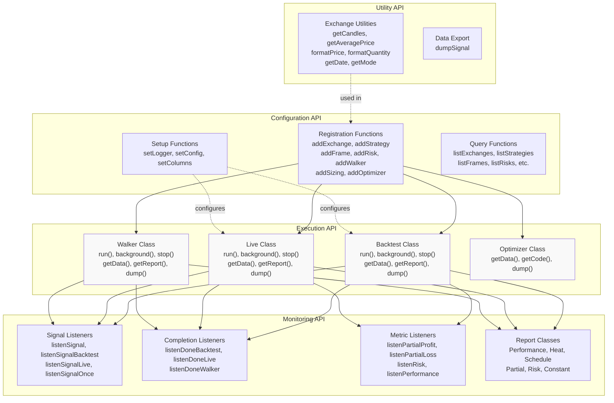
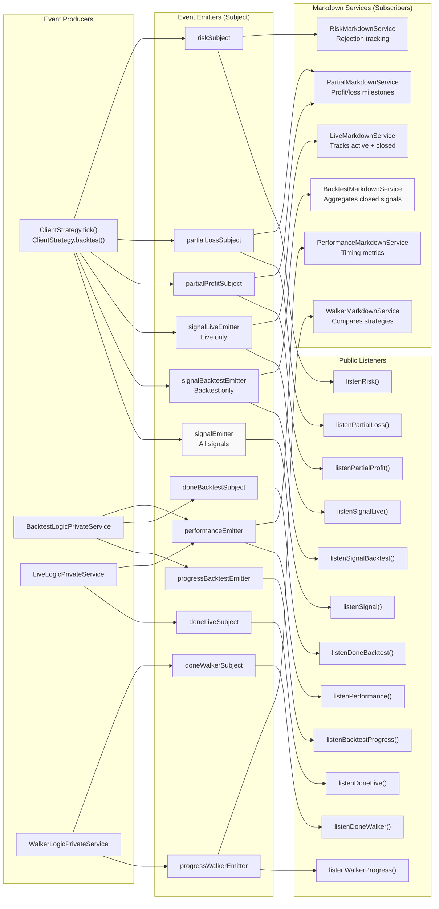
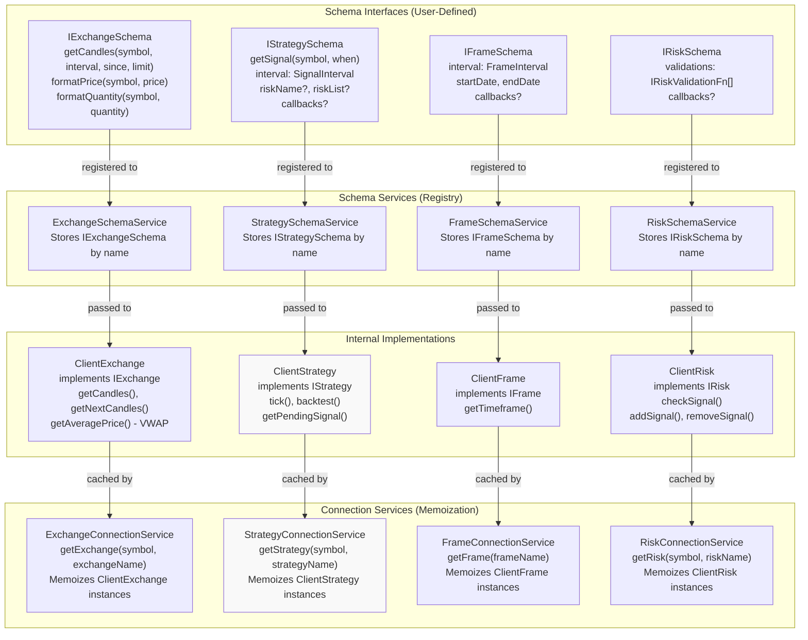

# API Reference

This document provides a comprehensive reference to all public APIs exposed by Backtest Kit. It organizes functions, classes, interfaces, and types by functional area to help you navigate the framework's capabilities.

For detailed documentation on specific API categories, see:
- **[Global Functions](./56_api-reference.md)** - Configuration and registration functions (`addExchange`, `addStrategy`, etc.)
- **[Execution Classes API](./56_api-reference.md)** - Classes for running backtests, live trading, and strategy comparison
- **[Reporting Classes API](./56_api-reference.md)** - Classes for generating reports and accessing statistics
- **[Core Interfaces](./56_api-reference.md)** - Schema interfaces for defining strategies, exchanges, and other components
- **[Signal & Result Types](./56_api-reference.md)** - Types for trading signals and execution results
- **[Statistics & Contract Types](./56_api-reference.md)** - Types for performance metrics and event payloads
- **[Service Layer Interfaces](./56_api-reference.md)** - Internal service interfaces for advanced usage

**Sources:** [src/index.ts:1-199](), [types.d.ts:1-1000](), [README.md:1-255]()

---

## API Organization

The Backtest Kit API is organized into three layers:

| Layer | Purpose | Main Exports |
|-------|---------|--------------|
| **Configuration Layer** | System setup and component registration | `setConfig()`, `setLogger()`, `addExchange()`, `addStrategy()`, `addFrame()`, `addRisk()`, `addWalker()`, `addSizing()`, `addOptimizer()` |
| **Execution Layer** | Running backtests and live trading | `Backtest`, `Live`, `Walker`, `Optimizer` classes with `run()` and `background()` methods |
| **Monitoring Layer** | Event listeners and report generation | `listenSignal*()`, `listenDone*()`, `listenPartialProfit()`, `listenRisk()`, report classes (`Performance`, `Heat`, `Schedule`, `Partial`, `Risk`) |

**Sources:** [src/index.ts:1-67](), [src/function/setup.ts:1-100](), [src/function/add.ts:1-200](), [src/function/event.ts:1-500]()

---

## Public API Surface

The following diagram maps the public API to the main functional areas:



**Sources:** [src/index.ts:1-199](), [src/classes/Backtest.ts:1-100](), [src/classes/Live.ts:1-100](), [src/classes/Walker.ts:1-100]()

---

## Type Hierarchy

The following diagram shows how core types relate to each other:

```mermaid
graph TB
    subgraph "Schema Types (Configuration)"
        IExchangeSchema["IExchangeSchema<br/>exchangeName: ExchangeName<br/>getCandles()<br/>formatPrice(), formatQuantity()"]
        IStrategySchema["IStrategySchema<br/>strategyName: StrategyName<br/>interval: SignalInterval<br/>getSignal()<br/>riskName?, riskList?"]
        IFrameSchema["IFrameSchema<br/>frameName: FrameName<br/>interval: FrameInterval<br/>startDate, endDate"]
        IRiskSchema["IRiskSchema<br/>riskName: RiskName<br/>validations: IRiskValidationFn[]"]
        ISizingSchema["ISizingSchema<br/>sizingName: SizingName<br/>calculate()"]
        IWalkerSchema["IWalkerSchema<br/>walkerName: WalkerName<br/>strategies: StrategyName[]<br/>metric: WalkerMetric"]
    end
    
    subgraph "Signal Types (Runtime)"
        ISignalDto["ISignalDto<br/>position: 'long' | 'short'<br/>priceOpen?, priceTakeProfit<br/>priceStopLoss, minuteEstimatedTime"]
        ISignalRow["ISignalRow extends ISignalDto<br/>id: string (UUID)<br/>strategyName, exchangeName<br/>scheduledAt, pendingAt, symbol"]
        IScheduledSignalRow["IScheduledSignalRow<br/>extends ISignalRow<br/>priceOpen: number (required)"]
    end
    
    subgraph "Result Types (Discriminated Union)"
        IStrategyTickResult["IStrategyTickResult (union)"]
        ResultIdle["IStrategyTickResultIdle<br/>action: 'idle'<br/>signal: null"]
        ResultScheduled["IStrategyTickResultScheduled<br/>action: 'scheduled'<br/>signal: IScheduledSignalRow"]
        ResultOpened["IStrategyTickResultOpened<br/>action: 'opened'<br/>signal: ISignalRow"]
        ResultActive["IStrategyTickResultActive<br/>action: 'active'<br/>signal: ISignalRow<br/>percentTp, percentSl"]
        ResultClosed["IStrategyTickResultClosed<br/>action: 'closed'<br/>signal: ISignalRow<br/>closeReason, pnl: IStrategyPnL"]
        ResultCancelled["IStrategyTickResultCancelled<br/>action: 'cancelled'<br/>signal: IScheduledSignalRow"]
    end
    
    subgraph "Statistics Types"
        BacktestStats["BacktestStatisticsModel<br/>signalList, totalSignals<br/>winRate, avgPnl, sharpeRatio"]
        LiveStats["LiveStatisticsModel<br/>extends BacktestStatisticsModel<br/>activeSignals, idleCount"]
        WalkerStats["WalkerStatisticsModel<br/>strategies: IWalkerStrategyResult[]<br/>bestStrategy, metric"]
    end
    
    IStrategySchema -->|generates| ISignalDto
    ISignalDto -->|validated to| ISignalRow
    ISignalRow -->|if priceOpen specified| IScheduledSignalRow
    
    IStrategyTickResult -->|discriminated union| ResultIdle
    IStrategyTickResult -->|discriminated union| ResultScheduled
    IStrategyTickResult -->|discriminated union| ResultOpened
    IStrategyTickResult -->|discriminated union| ResultActive
    IStrategyTickResult -->|discriminated union| ResultClosed
    IStrategyTickResult -->|discriminated union| ResultCancelled
    
    ResultScheduled -->|contains| IScheduledSignalRow
    ResultOpened -->|contains| ISignalRow
    ResultActive -->|contains| ISignalRow
    ResultClosed -->|contains| ISignalRow
    ResultCancelled -->|contains| IScheduledSignalRow
    
    ResultClosed -->|aggregated to| BacktestStats
    BacktestStats -->|extended by| LiveStats
    BacktestStats -->|used in| WalkerStats
    
    style ISignalRow fill:#f9f9f9
    style IStrategyTickResult fill:#f9f9f9
    style BacktestStats fill:#f9f9f9
```



**Sources:** [types.d.ts:80-896](), [src/interfaces/Strategy.interface.ts:1-300](), [src/model/BacktestStatistics.model.ts:1-100]()

---

## API Entry Points by Category

### Configuration & Setup

| Function | Purpose | Returns |
|----------|---------|---------|
| `setLogger(logger: ILogger)` | Configure custom logger implementation | `void` |
| `setConfig(config: Partial<GlobalConfig>)` | Set global configuration parameters | `void` |
| `getConfig()` | Retrieve current global configuration | `GlobalConfig` |
| `setColumns(columns: Partial<ColumnConfig>)` | Customize report column visibility | `void` |
| `getColumns()` | Retrieve current column configuration | `ColumnConfig` |

**Sources:** [src/function/setup.ts:1-200](), [src/config/params.ts:1-100](), [src/config/columns.ts:1-100]()

### Component Registration

| Function | Schema Type | Purpose |
|----------|-------------|---------|
| `addExchange(schema: IExchangeSchema)` | `IExchangeSchema` | Register data source for candles and pricing |
| `addStrategy(schema: IStrategySchema)` | `IStrategySchema` | Register trading strategy with signal generation logic |
| `addFrame(schema: IFrameSchema)` | `IFrameSchema` | Register timeframe for backtest period definition |
| `addRisk(schema: IRiskSchema)` | `IRiskSchema` | Register risk management validation rules |
| `addWalker(schema: IWalkerSchema)` | `IWalkerSchema` | Register strategy comparison configuration |
| `addSizing(schema: ISizingSchema)` | `ISizingSchema` | Register position sizing calculator |
| `addOptimizer(schema: IOptimizerSchema)` | `IOptimizerSchema` | Register LLM-powered strategy generator |

**Sources:** [src/function/add.ts:1-200](), [types.d.ts:120-970]()

### Execution Classes

| Class | Methods | Purpose |
|-------|---------|---------|
| `Backtest` | `run()`, `background()`, `stop()`, `getData()`, `getReport()`, `dump()` | Historical simulation on defined timeframe |
| `Live` | `run()`, `background()`, `stop()`, `getData()`, `getReport()`, `dump()` | Real-time trading with crash recovery |
| `Walker` | `run()`, `background()`, `stop()`, `getData()`, `getReport()`, `dump()` | Multi-strategy comparison and ranking |
| `Optimizer` | `getData()`, `getCode()`, `dump()` | LLM-powered strategy generation |

**Sources:** [src/classes/Backtest.ts:1-200](), [src/classes/Live.ts:1-200](), [src/classes/Walker.ts:1-200](), [src/classes/Optimizer.ts:1-200]()

### Event Listeners

| Function | Event Type | Purpose |
|----------|------------|---------|
| `listenSignal(fn)` | `IStrategyTickResult` | All signals (backtest + live) |
| `listenSignalBacktest(fn)` | `IStrategyTickResult` | Backtest signals only |
| `listenSignalLive(fn)` | `IStrategyTickResult` | Live trading signals only |
| `listenSignalOnce(filter, fn)` | `IStrategyTickResult` | Single filtered event |
| `listenDoneBacktest(fn)` | `DoneContract` | Backtest completion |
| `listenDoneLive(fn)` | `DoneContract` | Live trading completion |
| `listenDoneWalker(fn)` | `DoneContract` | Walker comparison completion |
| `listenBacktestProgress(fn)` | `ProgressBacktestContract` | Backtest progress percentage |
| `listenWalkerProgress(fn)` | `ProgressWalkerContract` | Walker strategy iteration progress |
| `listenPartialProfit(fn)` | `PartialProfitContract` | Profit milestone reached (10%, 20%, etc.) |
| `listenPartialLoss(fn)` | `PartialLossContract` | Loss milestone reached (-10%, -20%, etc.) |
| `listenRisk(fn)` | `RiskContract` | Signal rejected by risk validation |
| `listenPerformance(fn)` | `PerformanceContract` | Execution timing metrics |
| `listenError(fn)` | `Error` | Recoverable errors |
| `listenExit(fn)` | `Error` | Fatal errors |

**Sources:** [src/function/event.ts:1-500](), [src/config/emitters.ts:1-133]()

---

## Event System Architecture

The following diagram shows how events flow through the system:



**Sources:** [src/config/emitters.ts:1-133](), [src/function/event.ts:1-500](), [src/lib/services/markdown/BacktestMarkdownService.ts:1-100]()

---

## Core Interface Relationships

The following diagram shows how schema interfaces relate to their runtime implementations:



**Sources:** [src/lib/services/connection/StrategyConnectionService.ts:1-200](), [src/lib/services/schema/StrategySchemaService.ts:1-100](), [src/lib/client/ClientStrategy.ts:1-500]()

---

## Method Signatures Summary

### Backtest Class

```typescript
class Backtest {
  // Async iterator (pull-based)
  static run(
    symbol: string,
    params: {
      strategyName: StrategyName;
      exchangeName: ExchangeName;
      frameName: FrameName;
    }
  ): AsyncGenerator<IStrategyTickResult | ProgressBacktestContract>;

  // Background execution (push-based)
  static background(
    symbol: string,
    params: {
      strategyName: StrategyName;
      exchangeName: ExchangeName;
      frameName: FrameName;
    }
  ): void;

  // Stop backtest (if not yet complete)
  static stop(symbol: string, strategyName: StrategyName): Promise<void>;

  // Get statistics model
  static getData(
    symbol: string,
    strategyName: StrategyName
  ): Promise<BacktestStatisticsModel>;

  // Get formatted markdown report
  static getReport(
    symbol: string,
    strategyName: StrategyName
  ): Promise<string>;

  // Write report to file system
  static dump(symbol: string, strategyName: StrategyName): Promise<void>;
}
```

**Sources:** [src/classes/Backtest.ts:1-200](), [types.d.ts:1100-1200]()

### Live Class

```typescript
class Live {
  // Async iterator (infinite, until stopped)
  static run(
    symbol: string,
    params: {
      strategyName: StrategyName;
      exchangeName: ExchangeName;
    }
  ): AsyncGenerator<IStrategyTickResult>;

  // Background execution (infinite loop)
  static background(
    symbol: string,
    params: {
      strategyName: StrategyName;
      exchangeName: ExchangeName;
    }
  ): void;

  // Stop live trading gracefully
  static stop(symbol: string, strategyName: StrategyName): Promise<void>;

  // Get statistics model (includes active signals)
  static getData(
    symbol: string,
    strategyName: StrategyName
  ): Promise<LiveStatisticsModel>;

  // Get formatted markdown report
  static getReport(
    symbol: string,
    strategyName: StrategyName
  ): Promise<string>;

  // Write report to file system
  static dump(symbol: string, strategyName: StrategyName): Promise<void>;
}
```

**Sources:** [src/classes/Live.ts:1-200](), [types.d.ts:1200-1300]()

### Walker Class

```typescript
class Walker {
  // Async iterator (yields progress per strategy)
  static run(
    symbol: string,
    params: {
      walkerName: WalkerName;
    }
  ): AsyncGenerator<WalkerContract | ProgressWalkerContract>;

  // Background execution
  static background(
    symbol: string,
    params: {
      walkerName: WalkerName;
    }
  ): void;

  // Stop walker comparison
  static stop(symbol: string, walkerName: WalkerName): Promise<void>;

  // Get comparison results
  static getData(
    symbol: string,
    walkerName: WalkerName
  ): Promise<WalkerStatisticsModel>;

  // Get formatted markdown report
  static getReport(symbol: string, walkerName: WalkerName): Promise<string>;

  // Write report to file system
  static dump(symbol: string, walkerName: WalkerName): Promise<void>;
}
```

**Sources:** [src/classes/Walker.ts:1-200](), [types.d.ts:1300-1400]()

---

## Discriminated Union Pattern for Results

All strategy execution methods return `IStrategyTickResult`, a discriminated union with `action` as the discriminator:

```typescript
type IStrategyTickResult =
  | IStrategyTickResultIdle        // action: "idle"
  | IStrategyTickResultScheduled   // action: "scheduled"
  | IStrategyTickResultOpened      // action: "opened"
  | IStrategyTickResultActive      // action: "active"
  | IStrategyTickResultClosed      // action: "closed"
  | IStrategyTickResultCancelled;  // action: "cancelled"
```

### Type Guards Example

```typescript
listenSignal((event) => {
  if (event.action === "closed") {
    // TypeScript knows: event is IStrategyTickResultClosed
    console.log(event.pnl.pnlPercentage);
    console.log(event.closeReason); // "take_profit" | "stop_loss" | "time_expired"
  } else if (event.action === "active") {
    // TypeScript knows: event is IStrategyTickResultActive
    console.log(event.percentTp); // Progress towards TP
    console.log(event.percentSl); // Progress towards SL
  } else if (event.action === "scheduled") {
    // TypeScript knows: event is IStrategyTickResultScheduled
    console.log(event.signal.priceOpen); // Entry price waiting for activation
  }
});
```

**Sources:** [types.d.ts:768-893](), [src/interfaces/Strategy.interface.ts:1-300]()

---

## Statistics Models

Each execution mode provides a statistics model with performance metrics:

### BacktestStatisticsModel

```typescript
interface BacktestStatisticsModel {
  signalList: IStrategyTickResultClosed[];  // All closed signals
  totalSignals: number;
  winCount: number;
  lossCount: number;
  winRate: number | null;              // Percentage (0-100)
  avgPnl: number | null;               // Average PNL per signal
  totalPnl: number | null;             // Cumulative PNL
  stdDev: number | null;               // Standard deviation of returns
  sharpeRatio: number | null;          // avgPnl / stdDev
  annualizedSharpeRatio: number | null; // sharpeRatio × √365
  certaintyRatio: number | null;        // avgWin / |avgLoss|
  expectedYearlyReturns: number | null; // Extrapolated annual returns
}
```

**Sources:** [types.d.ts:918-943](), [src/model/BacktestStatistics.model.ts:1-100]()

### LiveStatisticsModel

Extends `BacktestStatisticsModel` with additional fields:

```typescript
interface LiveStatisticsModel extends BacktestStatisticsModel {
  activeSignals: ISignalRow[];        // Currently open positions
  idleCount: number;                  // Number of idle ticks
}
```

**Sources:** [types.d.ts:1400-1500](), [src/model/LiveStatistics.model.ts:1-100]()

### WalkerStatisticsModel

```typescript
interface WalkerStatisticsModel {
  strategies: IWalkerStrategyResult[];  // Results for each tested strategy
  bestStrategy: StrategyName;           // Highest metric value
  metric: WalkerMetric;                 // Comparison metric used
}

interface IWalkerStrategyResult {
  strategyName: StrategyName;
  statistics: BacktestStatisticsModel;
  metricValue: number | null;           // Value of comparison metric
}
```

**Sources:** [types.d.ts:1180-1250](), [src/model/WalkerStatistics.model.ts:1-100]()

---

## Context Services

Backtest Kit uses `di-scoped` for ambient context propagation. Two context services provide implicit parameters:

### ExecutionContextService

Propagates runtime execution state:

```typescript
interface IExecutionContext {
  symbol: string;        // Trading pair (e.g., "BTCUSDT")
  when: Date;           // Current timestamp
  backtest: boolean;    // true = backtest, false = live
}
```

Functions like `getCandles()` automatically access this context without explicit parameters.

**Sources:** [types.d.ts:6-49](), [src/lib/services/context/ExecutionContextService.ts:1-100]()

### MethodContextService

Propagates schema identifiers:

```typescript
interface IMethodContext {
  exchangeName: ExchangeName;
  strategyName: StrategyName;
  frameName: FrameName;
}
```

Connection services use this to route operations to correct schema instances.

**Sources:** [types.d.ts:297-336](), [src/lib/services/context/MethodContextService.ts:1-100]()

---

## Persistence Adapters

Backtest Kit provides crash-safe persistence through abstract base class `PersistBase`:

```typescript
abstract class PersistBase<T> {
  abstract waitForInit(entityId: EntityId): Promise<void>;
  abstract persist(entityId: EntityId, data: T | null): Promise<void>;
  abstract load(entityId: EntityId): Promise<T | null>;
}
```

### Concrete Implementations

| Adapter | Purpose | Storage Format |
|---------|---------|----------------|
| `PersistSignalAdapter` | Active signals | `Record<signalId, SignalData>` |
| `PersistRiskAdapter` | Risk tracking state | `Record<riskKey, RiskData>` |
| `PersistScheduleAdapter` | Scheduled signals | `Record<signalId, ScheduleData>` |
| `PersistPartialAdapter` | Profit/loss milestones | `Record<signalId, PartialData>` |

All adapters use atomic file writes to `./persist/{entityId}.json` by default.

**Sources:** [src/classes/Persist.ts:1-500](), [types.d.ts:1600-1800]()

---

## Custom Implementations

### Custom Logger

Implement `ILogger` interface:

```typescript
import { setLogger, ILogger } from 'backtest-kit';

const myLogger: ILogger = {
  log: (topic, ...args) => console.log(`[LOG] ${topic}`, ...args),
  debug: (topic, ...args) => console.debug(`[DEBUG] ${topic}`, ...args),
  info: (topic, ...args) => console.info(`[INFO] ${topic}`, ...args),
  warn: (topic, ...args) => console.warn(`[WARN] ${topic}`, ...args),
};

setLogger(myLogger);
```

**Sources:** [types.d.ts:52-77](), [src/function/setup.ts:1-50]()

### Custom Persistence

Extend `PersistBase` for custom storage backends:

```typescript
import { PersistBase, EntityId } from 'backtest-kit';

class RedisPersistAdapter<T> extends PersistBase<T> {
  async waitForInit(entityId: EntityId): Promise<void> {
    // Connect to Redis
  }

  async persist(entityId: EntityId, data: T | null): Promise<void> {
    // Write to Redis
  }

  async load(entityId: EntityId): Promise<T | null> {
    // Read from Redis
  }
}
```

**Sources:** [src/classes/Persist.ts:1-200](), [types.d.ts:1600-1700]()

---

## Global Configuration

Configure framework defaults via `setConfig()`:

```typescript
import { setConfig, GlobalConfig } from 'backtest-kit';

setConfig({
  // Trading fees and slippage
  CC_PERCENT_FEE: 0.1,              // 0.1% per trade
  CC_PERCENT_SLIPPAGE: 0.1,         // 0.1% price impact

  // Signal validation
  CC_MIN_TAKEPROFIT_DISTANCE_PERCENT: 0.3,  // TP must cover 2×fees + slippage
  CC_MAX_STOPLOSS_DISTANCE_PERCENT: 10.0,   // SL max 10% away
  CC_MAX_SIGNAL_LIFETIME_MINUTES: 1440,     // 24 hours max

  // VWAP calculation
  CC_AVG_PRICE_CANDLES_COUNT: 5,    // Last 5 1-minute candles

  // Scheduled signal timeout
  CC_SCHEDULE_AWAIT_MINUTES: 120,   // 2 hours to activate

  // Candle data validation
  CC_DETECT_ANOMALY_PERCENT: 10.0,  // 10% price jump = anomaly
  CC_CHECK_LAST_N_MEDIAN_ANOMALIES: 5, // Check last 5 candles

  // Retry logic
  CC_GET_CANDLES_RETRY_COUNT: 3,
  CC_GET_CANDLES_RETRY_DELAY_MS: 1000,

  // Live trading
  CC_TICK_TTL_MS: 60_001,           // 1 minute + 1ms sleep
});
```

**Sources:** [src/config/params.ts:1-200](), [types.d.ts:2000-2100]()

---

## Report Column Configuration

Customize markdown report columns:

```typescript
import { setColumns, ColumnConfig } from 'backtest-kit';

setColumns({
  backtest: {
    id: true,
    strategyName: true,
    symbol: true,
    position: true,
    priceOpen: true,
    priceTakeProfit: true,
    priceStopLoss: true,
    priceClose: true,
    closeReason: true,
    pnlPercentage: true,
    scheduledAt: false,      // Hide scheduled timestamp
    pendingAt: false,        // Hide pending timestamp
    closeTimestamp: true,
    minuteEstimatedTime: true,
  },
  // Similar configuration for live, walker, schedule, performance, etc.
});
```

**Sources:** [src/config/columns.ts:1-300](), [types.d.ts:2100-2200]()

---

## Advanced: Service Layer Access

For advanced use cases, the internal service layer is exposed via `lib` export:

```typescript
import { lib } from 'backtest-kit';

// Access service instances
lib.loggerService;
lib.strategyConnectionService;
lib.exchangeConnectionService;
lib.strategyCoreService;
lib.backtestLogicPrivateService;
// ... etc.
```

See **[Service Layer Interfaces](./56_api-reference.md)** for detailed service documentation.

**Sources:** [src/lib/index.ts:1-500](), [types.d.ts:2200-2500]()