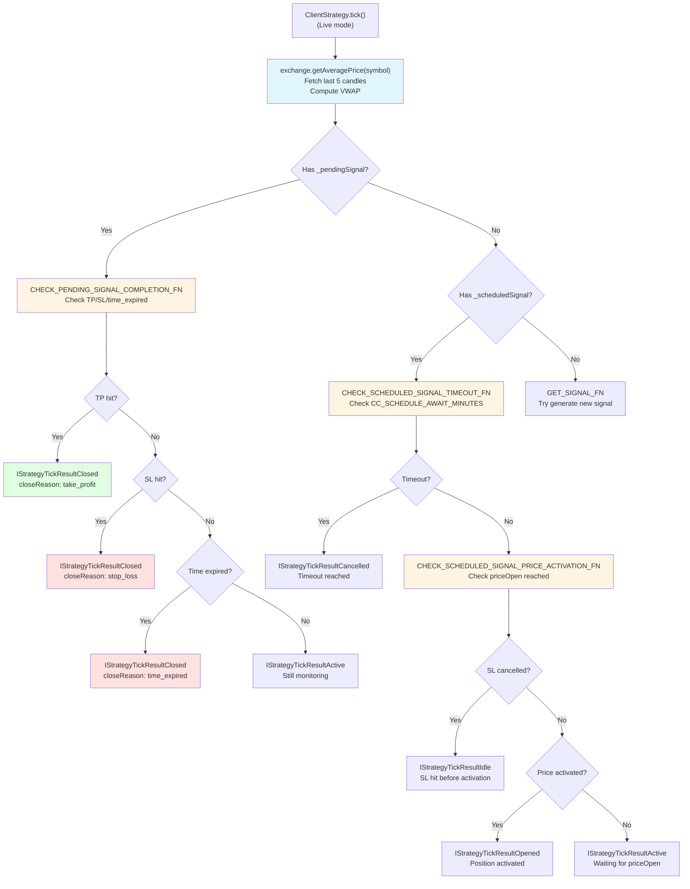
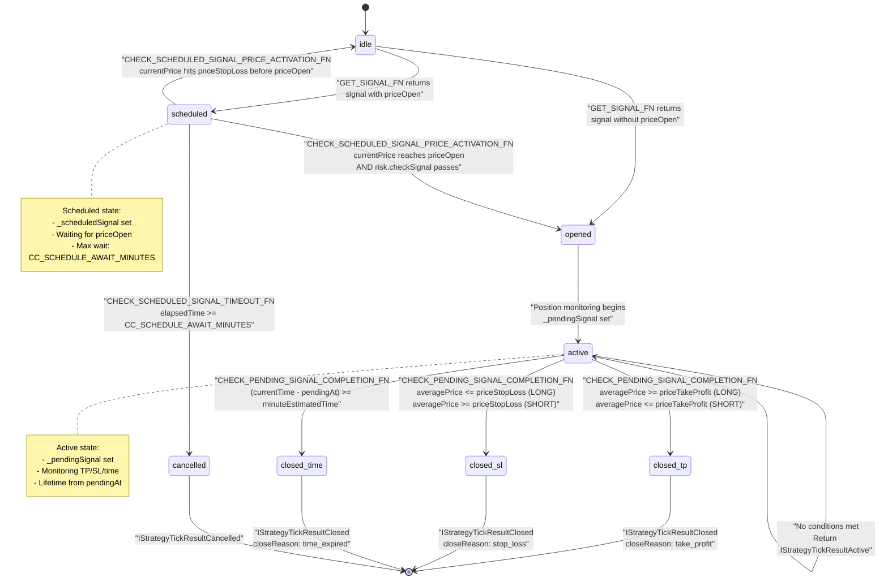

# Real-time Monitoring

<details>
<summary>Relevant source files</summary>

The following files were used as context for generating this wiki page:

- [src/classes/Persist.ts](src/classes/Persist.ts)
- [src/client/ClientStrategy.ts](src/client/ClientStrategy.ts)
- [src/config/params.ts](src/config/params.ts)
- [src/interfaces/Strategy.interface.ts](src/interfaces/Strategy.interface.ts)
- [src/lib/services/connection/StrategyConnectionService.ts](src/lib/services/connection/StrategyConnectionService.ts)
- [src/utils/writeFileAtomic.ts](src/utils/writeFileAtomic.ts)
- [test/config/setup.mjs](test/config/setup.mjs)
- [test/e2e/defend.test.mjs](test/e2e/defend.test.mjs)
- [test/e2e/sanitize.test.mjs](test/e2e/sanitize.test.mjs)

</details>


## Purpose and Scope

This page explains how the framework monitors active positions and scheduled signals in real-time during live trading. It covers VWAP (Volume Weighted Average Price) calculation using recent candles, Take Profit and Stop Loss detection logic, time-based expiration monitoring, and scheduled signal activation checks. For information about the overall live execution loop, see [10.1](#10.1). For crash recovery and state restoration, see [10.2](#10.2).

---

## VWAP-Based Price Calculation

### Overview

The framework uses **VWAP (Volume Weighted Average Price)** instead of simple close prices for all monitoring decisions. This reduces the impact of short-term price spikes and provides more accurate entry/exit pricing that reflects actual trading volume.

### GET_AVG_PRICE_FN Implementation

The VWAP calculation is performed by `GET_AVG_PRICE_FN` in [src/client/ClientStrategy.ts:285-296]():

```typescript
const GET_AVG_PRICE_FN = (candles: ICandleData[]): number => {
  const sumPriceVolume = candles.reduce((acc, c) => {
    const typicalPrice = (c.high + c.low + c.close) / 3;
    return acc + typicalPrice * c.volume;
  }, 0);

  const totalVolume = candles.reduce((acc, c) => acc + c.volume, 0);

  return totalVolume === 0
    ? candles.reduce((acc, c) => acc + c.close, 0) / candles.length
    : sumPriceVolume / totalVolume;
};
```

**Calculation steps:**
1. Compute **typical price** for each candle: `(high + low + close) / 3`
2. Multiply typical price by volume for each candle
3. Sum all price-volume products
4. Divide by total volume
5. If total volume is zero (rare edge case), fallback to simple average of close prices

### CC_AVG_PRICE_CANDLES_COUNT Configuration

The number of recent candles used for VWAP calculation is controlled by `GLOBAL_CONFIG.CC_AVG_PRICE_CANDLES_COUNT` [src/config/params.ts:11]():

| Parameter | Default | Description |
|-----------|---------|-------------|
| `CC_AVG_PRICE_CANDLES_COUNT` | `5` | Number of recent candles for VWAP (e.g., last 5 minutes with 1m interval) |

**Usage in live mode**: `ClientExchange.getAveragePrice()` fetches the last N candles and computes VWAP. See [4.7](#4.7) for the public API.

Sources: [src/client/ClientStrategy.ts:285-296](), [src/config/params.ts:11]()

---

## Monitoring Flow Diagram



**Key decision points:**
1. If `_pendingSignal` exists → monitor TP/SL/time
2. If `_scheduledSignal` exists → monitor timeout/activation/cancellation
3. If neither exists → attempt to generate new signal

Sources: [src/client/ClientStrategy.ts:675-846](), [src/client/ClientStrategy.ts:332-457]()

---

## Take Profit Monitoring

### Detection Logic

Take Profit monitoring is performed in `CHECK_PENDING_SIGNAL_COMPLETION_FN` [src/client/ClientStrategy.ts:695-712]():

**For LONG positions** [src/client/ClientStrategy.ts:696-703]():
```
if (signal.position === "long" && averagePrice >= signal.priceTakeProfit)
```
- TP triggered when current VWAP ≥ `priceTakeProfit`
- Position closed at **exact TP price** (not VWAP) for deterministic PnL

**For SHORT positions** [src/client/ClientStrategy.ts:705-712]():
```
if (signal.position === "short" && averagePrice <= signal.priceTakeProfit)
```
- TP triggered when current VWAP ≤ `priceTakeProfit`
- Position closed at **exact TP price**

### Closure Mechanics

When TP is hit, `CLOSE_PENDING_SIGNAL_FN` is called [src/client/ClientStrategy.ts:736-789]():
1. Calculate PnL using `toProfitLossDto(signal, signal.priceTakeProfit)` (exact TP price)
2. Call `callbacks.onClose()`
3. Remove signal from risk tracking via `risk.removeSignal()`
4. Clear `_pendingSignal` state
5. Persist null to disk (if live mode)
6. Return `IStrategyTickResultClosed` with `closeReason: "take_profit"`

### Why Exact Price?

Using exact TP price ensures:
- **Deterministic PnL**: Same signal in backtest and live produces identical profit
- **Conservative calculation**: Assumes you got filled exactly at TP, not at a better price
- **No slippage assumptions**: Framework applies fees and slippage in `toProfitLossDto`, not in monitoring logic

Sources: [src/client/ClientStrategy.ts:675-734](), [src/client/ClientStrategy.ts:695-712](), [src/client/ClientStrategy.ts:736-789]()

---

## Stop Loss Monitoring

### Detection Logic

Stop Loss monitoring follows the same pattern [src/client/ClientStrategy.ts:714-731]():

**For LONG positions** [src/client/ClientStrategy.ts:715-722]():
```
if (signal.position === "long" && averagePrice <= signal.priceStopLoss)
```
- SL triggered when current VWAP ≤ `priceStopLoss`
- Position closed at **exact SL price**

**For SHORT positions** [src/client/ClientStrategy.ts:724-731]():
```
if (signal.position === "short" && averagePrice >= signal.priceStopLoss)
```
- SL triggered when current VWAP ≥ `priceStopLoss`
- Position closed at **exact SL price**

### Priority Order

In `CHECK_PENDING_SIGNAL_COMPLETION_FN`, checks are performed in this order [src/client/ClientStrategy.ts:686-731]():

1. **Time expiration** (checked first)
2. **Take Profit** (checked second)
3. **Stop Loss** (checked third)

**Rationale**: Time expiration has highest priority because `minuteEstimatedTime` is a hard deadline. TP/SL are checked only if time hasn't expired.

### Protection Mechanisms

Stop Loss is validated at signal generation by `VALIDATE_SIGNAL_FN` [src/client/ClientStrategy.ts:40-185]():

**For LONG** [src/client/ClientStrategy.ts:80-84]():
```
if (signal.priceStopLoss >= signal.priceOpen) {
  errors.push(`Long: priceStopLoss must be < priceOpen`)
}
```

**For SHORT** [src/client/ClientStrategy.ts:120-124]():
```
if (signal.priceStopLoss <= signal.priceOpen) {
  errors.push(`Short: priceStopLoss must be > priceOpen`)
}
```

Additionally, `CC_MAX_STOPLOSS_DISTANCE_PERCENT` limits maximum loss [src/client/ClientStrategy.ts:100-110](), [src/config/params.ts:23]().

Sources: [src/client/ClientStrategy.ts:714-731](), [src/client/ClientStrategy.ts:40-185](), [src/config/params.ts:19-23]()

---

## Time Expiration Monitoring

### Lifetime Calculation

Time expiration is checked first in `CHECK_PENDING_SIGNAL_COMPLETION_FN` [src/client/ClientStrategy.ts:680-693]():

```typescript
const currentTime = self.params.execution.context.when.getTime();
const signalTime = signal.pendingAt; // CRITICAL: use pendingAt, not scheduledAt!
const maxTimeToWait = signal.minuteEstimatedTime * 60 * 1000;
const elapsedTime = currentTime - signalTime;

if (elapsedTime >= maxTimeToWait) {
  return await CLOSE_PENDING_SIGNAL_FN(self, signal, averagePrice, "time_expired");
}
```

**Key timestamp**: `signal.pendingAt` is used, **not** `signal.scheduledAt`. This ensures:
- For immediate signals: `pendingAt === scheduledAt` (both set to current time)
- For scheduled signals: `pendingAt` is set when signal **activates**, not when created
- Lifetime counts from position open, not from signal creation

### pendingAt vs scheduledAt

| Timestamp | Set When | Used For |
|-----------|----------|----------|
| `scheduledAt` | Signal first created (immediate or scheduled) | Tracking signal generation time, scheduled timeout |
| `pendingAt` | Position becomes active (opened) | Time expiration monitoring, PnL duration |

**Example scenario**:
1. Scheduled signal created at `t=0` → `scheduledAt=0`, `pendingAt=0` (temporary)
2. Price activates signal at `t=1000` → `pendingAt=1000` (updated)
3. Time expiration checks: `currentTime - pendingAt`, not `currentTime - scheduledAt`

This prevents premature timeout for signals that wait a long time for activation. See [src/client/ClientStrategy.ts:510-516]() for `pendingAt` update logic.

### Maximum Lifetime Protection

`CC_MAX_SIGNAL_LIFETIME_MINUTES` prevents eternal signals [src/config/params.ts:25-29]():

| Parameter | Default | Purpose |
|-----------|---------|---------|
| `CC_MAX_SIGNAL_LIFETIME_MINUTES` | `1440` (1 day) | Prevents signals from blocking risk limits for weeks/months |

Validated by `VALIDATE_SIGNAL_FN` [src/client/ClientStrategy.ts:161-171]():
```typescript
if (signal.minuteEstimatedTime > GLOBAL_CONFIG.CC_MAX_SIGNAL_LIFETIME_MINUTES) {
  errors.push(`minuteEstimatedTime too large (${signal.minuteEstimatedTime} minutes). 
               Eternal signals block risk limits and prevent new trades.`);
}
```

Sources: [src/client/ClientStrategy.ts:680-693](), [src/client/ClientStrategy.ts:510-516](), [src/config/params.ts:25-29]()

---

## Scheduled Signal Activation Monitoring

### Price Activation Logic

Scheduled signals wait for price to reach `priceOpen` before opening a position. Activation is checked by `CHECK_SCHEDULED_SIGNAL_PRICE_ACTIVATION_FN` [src/client/ClientStrategy.ts:388-422]():

**For LONG positions** [src/client/ClientStrategy.ts:395-406]():
```typescript
if (scheduled.position === "long") {
  // Check StopLoss FIRST (cancellation has priority)
  if (currentPrice <= scheduled.priceStopLoss) {
    shouldCancel = true;
  }
  // Activate if price drops to priceOpen AND SL not hit
  else if (currentPrice <= scheduled.priceOpen) {
    shouldActivate = true;
  }
}
```

**For SHORT positions** [src/client/ClientStrategy.ts:408-419]():
```typescript
if (scheduled.position === "short") {
  // Check StopLoss FIRST
  if (currentPrice >= scheduled.priceStopLoss) {
    shouldCancel = true;
  }
  // Activate if price rises to priceOpen AND SL not hit
  else if (currentPrice >= scheduled.priceOpen) {
    shouldActivate = true;
  }
}
```

**Critical ordering**: StopLoss check has **priority** over activation. If both conditions are met (price hit SL and priceOpen), signal is **cancelled**, not activated.

### Timeout Monitoring

Scheduled signals are also monitored for timeout by `CHECK_SCHEDULED_SIGNAL_TIMEOUT_FN` [src/client/ClientStrategy.ts:332-386]():

```typescript
const currentTime = self.params.execution.context.when.getTime();
const signalTime = scheduled.scheduledAt; // Timeout counts from scheduledAt
const maxTimeToWait = GLOBAL_CONFIG.CC_SCHEDULE_AWAIT_MINUTES * 60 * 1000;
const elapsedTime = currentTime - signalTime;

if (elapsedTime >= maxTimeToWait) {
  // Cancel scheduled signal - never activated
  return IStrategyTickResultCancelled;
}
```

**Key difference**: Scheduled timeout uses `scheduledAt`, not `pendingAt`, because the signal hasn't activated yet.

| Config Parameter | Default | Purpose |
|------------------|---------|---------|
| `CC_SCHEDULE_AWAIT_MINUTES` | `120` (2 hours) | Maximum time to wait for scheduled signal activation |

See [src/config/params.ts:6]().

### Activation Flow

When activation conditions are met, `ACTIVATE_SCHEDULED_SIGNAL_FN` is called [src/client/ClientStrategy.ts:459-551]():

1. **Check if strategy stopped** [src/client/ClientStrategy.ts:465-472]() → early return if stopped
2. **Run risk validation** [src/client/ClientStrategy.ts:489-506]() → check if position can be opened
3. **Update `pendingAt` timestamp** [src/client/ClientStrategy.ts:510-516]() → set to activation time
4. **Convert to active signal** [src/client/ClientStrategy.ts:511-516]() → `_isScheduled: false`
5. **Persist to disk** [src/client/ClientStrategy.ts:517]() → crash-safe state save
6. **Add to risk tracking** [src/client/ClientStrategy.ts:519-522]() → increment active positions
7. **Call `onOpen` callback** [src/client/ClientStrategy.ts:524-531]()
8. **Return `IStrategyTickResultOpened`** [src/client/ClientStrategy.ts:533-550]()

Sources: [src/client/ClientStrategy.ts:388-422](), [src/client/ClientStrategy.ts:332-386](), [src/client/ClientStrategy.ts:459-551](), [src/config/params.ts:6]()

---

## Live vs Backtest Monitoring Comparison

### Data Source Differences

| Aspect | Live Mode | Backtest Mode |
|--------|-----------|---------------|
| **Price calculation** | `exchange.getAveragePrice(symbol)` | `GET_AVG_PRICE_FN(candles)` |
| **Candles source** | Real-time API call (last N candles) | Pre-fetched historical array |
| **Monitoring frequency** | Every tick (interval-based) | Every candle in array |
| **State persistence** | Written to disk after each change | In-memory only |
| **Timestamp source** | `Date.now()` via `executionContext.when` | Candle timestamp from array |

### Live Mode VWAP Calculation

In live mode, `ClientExchange.getAveragePrice()` [src/lib/services/connection/ExchangeConnectionService.ts]() (not shown in provided files, but referenced) performs:

1. Call `exchange.getCandles(symbol, interval, since, CC_AVG_PRICE_CANDLES_COUNT)`
2. Pass candles to `GET_AVG_PRICE_FN(candles)`
3. Return VWAP

**Implications**:
- **Latency**: Each tick requires API call to fetch candles
- **Consistency**: VWAP based on most recent market data
- **Throttling**: Interval-based signal generation prevents excessive API calls (see [10.4](#10.4))

### Backtest Mode Candle Processing

In backtest mode, `ClientStrategy.backtest()` [src/client/ClientStrategy.ts:1191-1329]() processes entire candle array:

```typescript
for (let i = candlesCount - 1; i < candles.length; i++) {
  const recentCandles = candles.slice(i - (candlesCount - 1), i + 1);
  const averagePrice = GET_AVG_PRICE_FN(recentCandles);
  
  // Check TP/SL using high/low for accuracy
  if (signal.position === "long" && currentCandle.high >= signal.priceTakeProfit) {
    shouldClose = true;
    closeReason = "take_profit";
  }
}
```

**Key differences**:
- Uses `candle.high` and `candle.low` for **exact TP/SL detection**
- Processes all candles in single loop (no API calls)
- Deterministic results (same candles → same outcome)

### Monitoring Accuracy

| Check Type | Live Mode | Backtest Mode |
|------------|-----------|---------------|
| **TP/SL detection** | VWAP-based (may miss intra-minute spikes) | `high`/`low`-based (detects all spikes) |
| **Time resolution** | Depends on tick interval | 1 candle = 1 minute (or interval) |
| **Price volatility** | Smoothed by VWAP over 5 candles | Captured by candle high/low |

**Example**: If TP is briefly hit during a 1-minute candle but VWAP doesn't reach it:
- **Live mode**: May **miss** TP if VWAP over 5 minutes doesn't reach threshold
- **Backtest mode**: Will **detect** TP using `candle.high`

This discrepancy is intentional — live mode prioritizes realistic fills (VWAP) over perfect detection.

Sources: [src/client/ClientStrategy.ts:1136-1190](), [src/client/ClientStrategy.ts:285-296]()

---

## Monitoring State Transitions



**Key monitoring loops**:
1. **idle → scheduled → opened → active → closed**: Full lifecycle with scheduled entry
2. **idle → opened → active → closed**: Immediate entry lifecycle
3. **scheduled → cancelled**: Timeout or SL hit before activation
4. **scheduled → idle**: SL hit before activation (cancellation variant)

Sources: [src/client/ClientStrategy.ts:675-846](), [src/client/ClientStrategy.ts:332-551]()

---

## Monitoring Configuration Summary

| Parameter | File | Default | Purpose |
|-----------|------|---------|---------|
| `CC_AVG_PRICE_CANDLES_COUNT` | [src/config/params.ts:11]() | `5` | Number of candles for VWAP calculation |
| `CC_SCHEDULE_AWAIT_MINUTES` | [src/config/params.ts:6]() | `120` | Maximum time to wait for scheduled signal activation |
| `CC_MAX_SIGNAL_LIFETIME_MINUTES` | [src/config/params.ts:29]() | `1440` | Maximum signal lifetime (prevents eternal signals) |
| `CC_MIN_TAKEPROFIT_DISTANCE_PERCENT` | [src/config/params.ts:17]() | `0.1%` | Minimum TP distance to cover fees |
| `CC_MAX_STOPLOSS_DISTANCE_PERCENT` | [src/config/params.ts:23]() | `20%` | Maximum SL distance to protect capital |

All parameters can be modified via `setConfig()` [4.1](#4.1) before starting live trading.

Sources: [src/config/params.ts:1-36]()

---

## Monitoring Function Reference

| Function | File Location | Purpose |
|----------|---------------|---------|
| `GET_AVG_PRICE_FN` | [src/client/ClientStrategy.ts:285-296]() | Calculate VWAP from candles array |
| `CHECK_PENDING_SIGNAL_COMPLETION_FN` | [src/client/ClientStrategy.ts:675-734]() | Monitor active signal for TP/SL/time |
| `CHECK_SCHEDULED_SIGNAL_TIMEOUT_FN` | [src/client/ClientStrategy.ts:332-386]() | Check scheduled signal timeout |
| `CHECK_SCHEDULED_SIGNAL_PRICE_ACTIVATION_FN` | [src/client/ClientStrategy.ts:388-422]() | Check if scheduled signal should activate |
| `CLOSE_PENDING_SIGNAL_FN` | [src/client/ClientStrategy.ts:736-789]() | Close active signal with PnL calculation |
| `ACTIVATE_SCHEDULED_SIGNAL_FN` | [src/client/ClientStrategy.ts:459-551]() | Convert scheduled signal to active |
| `CANCEL_SCHEDULED_SIGNAL_BY_STOPLOSS_FN` | [src/client/ClientStrategy.ts:424-457]() | Cancel scheduled signal due to SL |

Sources: [src/client/ClientStrategy.ts:285-846]()