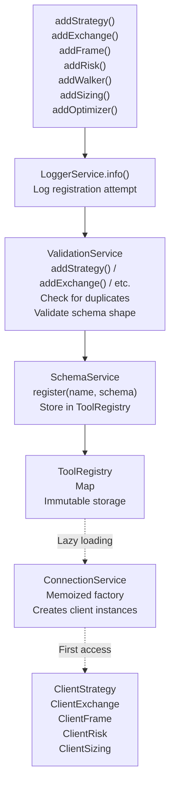
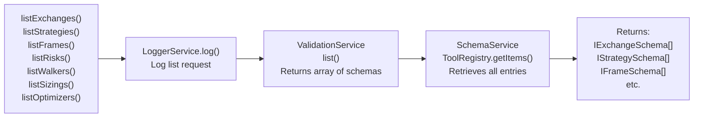
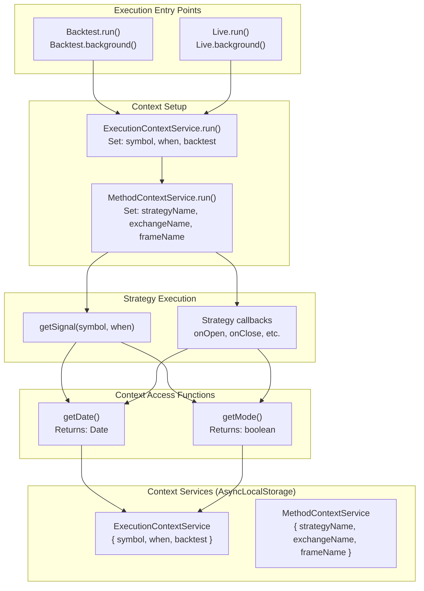
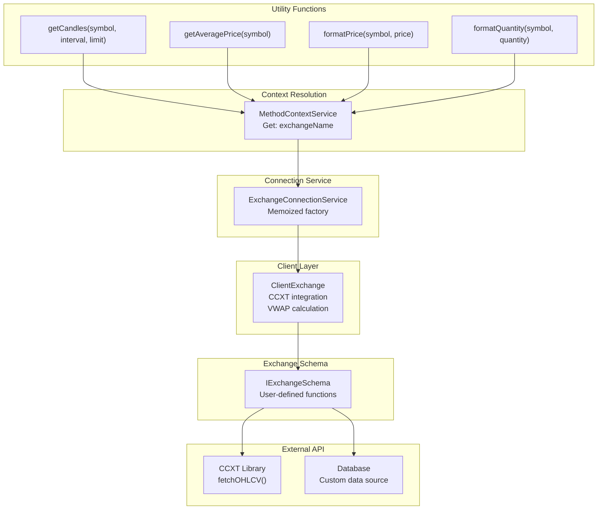

# Global Functions

Global functions are the primary user-facing API for configuring and interacting with Backtest Kit. These functions provide a declarative interface for registering components, configuring system behavior, subscribing to events, and accessing framework utilities. All global functions are exported from the main package entry point and operate on the singleton service layer.

For information about class-based execution APIs (Backtest, Live, Walker, Optimizer), see [Execution Classes API](./56_api-reference.md). For data structure definitions used in function parameters and return values, see [Core Interfaces](./56_api-reference.md) and [Signal & Result Types](./56_api-reference.md).

---

## Function Categories

Global functions are organized into six functional categories:

| Category | Functions | Purpose |
|----------|-----------|---------|
| **Configuration** | `setLogger`, `setConfig`, `getConfig`, `getDefaultConfig`, `setColumns`, `getColumns`, `getDefaultColumns` | System-wide settings and logging |
| **Registration** | `addExchange`, `addStrategy`, `addFrame`, `addRisk`, `addWalker`, `addSizing`, `addOptimizer` | Register trading components |
| **Query** | `listExchanges`, `listStrategies`, `listFrames`, `listRisks`, `listWalkers`, `listSizings`, `listOptimizers` | Retrieve registered components |
| **Event Subscription** | `listenSignal*`, `listenDone*`, `listenPartial*`, `listenRisk`, `listenPerformance`, `listenError`, `listenExit` | Subscribe to framework events |
| **Context Access** | `getDate`, `getMode` | Access execution context |
| **Exchange Utilities** | `getCandles`, `getAveragePrice`, `formatPrice`, `formatQuantity` | Data fetching and formatting |
| **Debugging** | `dumpSignal` | Logging and analysis |


---

## Architecture: Global Functions to Service Layer

```mermaid
graph TB
    subgraph "User Code"
        USER["User Application"]
    end
    
    subgraph "Global Functions (src/function/)"
        CONFIG_FN["setLogger()<br/>setConfig()<br/>setColumns()"]
        ADD_FN["addExchange()<br/>addStrategy()<br/>addFrame()<br/>addRisk()<br/>addWalker()<br/>addSizing()<br/>addOptimizer()"]
        LIST_FN["listExchanges()<br/>listStrategies()<br/>listFrames()<br/>etc."]
        LISTEN_FN["listenSignal*()<br/>listenDone*()<br/>listenPartial*()"]
        UTIL_FN["getCandles()<br/>getAveragePrice()<br/>formatPrice()"]
        CTX_FN["getDate()<br/>getMode()"]
    end
    
    subgraph "Service Layer Access (src/lib/index.ts)"
        BACKTEST_OBJ["backtest object<br/>Singleton service container"]
    end
    
    subgraph "Validation Services"
        VAL_EXCHANGE["ExchangeValidationService"]
        VAL_STRATEGY["StrategyValidationService"]
        VAL_FRAME["FrameValidationService"]
        VAL_RISK["RiskValidationService"]
        VAL_WALKER["WalkerValidationService"]
        VAL_SIZING["SizingValidationService"]
        VAL_OPTIMIZER["OptimizerValidationService"]
        VAL_CONFIG["ConfigValidationService"]
        VAL_COLUMN["ColumnValidationService"]
    end
    
    subgraph "Schema Services (ToolRegistry pattern)"
        SCHEMA_EXCHANGE["ExchangeSchemaService"]
        SCHEMA_STRATEGY["StrategySchemaService"]
        SCHEMA_FRAME["FrameSchemaService"]
        SCHEMA_RISK["RiskSchemaService"]
        SCHEMA_WALKER["WalkerSchemaService"]
        SCHEMA_SIZING["SizingSchemaService"]
        SCHEMA_OPTIMIZER["OptimizerSchemaService"]
    end
    
    subgraph "Context Services"
        CTX_EXEC["ExecutionContextService<br/>symbol, when, backtest flag"]
        CTX_METHOD["MethodContextService<br/>strategyName, exchangeName"]
    end
    
    subgraph "Connection Services"
        CONN_EXCHANGE["ExchangeConnectionService<br/>ClientExchange instances"]
    end
    
    subgraph "Event System"
        EMITTERS["signalEmitter<br/>doneBacktestSubject<br/>doneLiveSubject<br/>partialProfitSubject<br/>etc."]
    end
    
    USER --> CONFIG_FN
    USER --> ADD_FN
    USER --> LIST_FN
    USER --> LISTEN_FN
    USER --> UTIL_FN
    USER --> CTX_FN
    
    CONFIG_FN --> BACKTEST_OBJ
    ADD_FN --> BACKTEST_OBJ
    LIST_FN --> BACKTEST_OBJ
    LISTEN_FN --> EMITTERS
    UTIL_FN --> BACKTEST_OBJ
    CTX_FN --> BACKTEST_OBJ
    
    BACKTEST_OBJ --> VAL_EXCHANGE
    BACKTEST_OBJ --> VAL_STRATEGY
    BACKTEST_OBJ --> VAL_FRAME
    BACKTEST_OBJ --> VAL_RISK
    BACKTEST_OBJ --> VAL_WALKER
    BACKTEST_OBJ --> VAL_SIZING
    BACKTEST_OBJ --> VAL_OPTIMIZER
    BACKTEST_OBJ --> VAL_CONFIG
    BACKTEST_OBJ --> VAL_COLUMN
    BACKTEST_OBJ --> SCHEMA_EXCHANGE
    BACKTEST_OBJ --> SCHEMA_STRATEGY
    BACKTEST_OBJ --> SCHEMA_FRAME
    BACKTEST_OBJ --> SCHEMA_RISK
    BACKTEST_OBJ --> SCHEMA_WALKER
    BACKTEST_OBJ --> SCHEMA_SIZING
    BACKTEST_OBJ --> SCHEMA_OPTIMIZER
    BACKTEST_OBJ --> CTX_EXEC
    BACKTEST_OBJ --> CTX_METHOD
    BACKTEST_OBJ --> CONN_EXCHANGE
    
    ADD_FN --> VAL_EXCHANGE
    ADD_FN --> VAL_STRATEGY
    ADD_FN --> VAL_FRAME
    ADD_FN --> VAL_RISK
    ADD_FN --> VAL_WALKER
    ADD_FN --> VAL_SIZING
    ADD_FN --> VAL_OPTIMIZER
    
    VAL_EXCHANGE --> SCHEMA_EXCHANGE
    VAL_STRATEGY --> SCHEMA_STRATEGY
    VAL_FRAME --> SCHEMA_FRAME
    VAL_RISK --> SCHEMA_RISK
    VAL_WALKER --> SCHEMA_WALKER
    VAL_SIZING --> SCHEMA_SIZING
    VAL_OPTIMIZER --> SCHEMA_OPTIMIZER
    
    LIST_FN --> VAL_EXCHANGE
    LIST_FN --> VAL_STRATEGY
    LIST_FN --> VAL_FRAME
    LIST_FN --> VAL_RISK
    LIST_FN --> VAL_WALKER
    LIST_FN --> VAL_SIZING
    LIST_FN --> VAL_OPTIMIZER
    
    UTIL_FN --> CTX_EXEC
    UTIL_FN --> CTX_METHOD
    UTIL_FN --> CONN_EXCHANGE
```



**Architectural Flow:**

1. **User Code** calls global functions from the public API
2. **Global Functions** delegate to the `backtest` singleton object (dependency injection container)
3. **Validation Services** perform shallow validation and duplicate checks
4. **Schema Services** store validated configurations in `ToolRegistry` instances
5. **Context Services** propagate ambient execution state via `AsyncLocalStorage`
6. **Connection Services** create and cache client instances (memoized factories)
7. **Event System** broadcasts events to registered listeners via Subject pattern


---

## Configuration Functions

### setLogger

```typescript
setLogger(logger: ILogger): void
```

Registers a custom logger implementation for framework-wide logging. The logger receives contextual information about operations including method names and parameters.

**Parameters:**
- `logger: ILogger` - Logger implementation with `log`, `debug`, `info`, `warn` methods

**Logger Interface:**
```typescript
interface ILogger {
  log: (...args: any[]) => void;
  debug: (...args: any[]) => void;
  info: (...args: any[]) => void;
  warn: (...args: any[]) => void;
}
```

**Example:**
```typescript
import { setLogger } from 'backtest-kit';

setLogger({
  log: console.log,
  debug: console.debug,
  info: console.info,
  warn: console.warn,
});
```

**Internal Flow:**
The logger is stored in `LoggerService` (`src/services/base/LoggerService`), which is injected as a dependency throughout the service layer. All services access logging via `backtest.loggerService`.


---

### setConfig

```typescript
setConfig(config: Partial<GlobalConfig>): void
```

Updates global configuration parameters that control validation thresholds, fees, slippage, retry logic, and anomaly detection. Configuration is merged with existing values, allowing partial updates.

**Key Configuration Parameters:**

| Parameter | Default | Description |
|-----------|---------|-------------|
| `CC_PERCENT_FEE` | `0.1` | Fee percentage per trade (0.1 = 0.1%) |
| `CC_PERCENT_SLIPPAGE` | `0.1` | Slippage percentage per trade (0.1 = 0.1%) |
| `CC_MIN_TAKEPROFIT_DISTANCE_PERCENT` | `0.22` | Min TP distance to cover fees+slippage (0.1% + 0.1% + buffer) |
| `CC_MAX_STOPLOSS_DISTANCE_PERCENT` | `100` | Max SL distance as percentage |
| `CC_MAX_SIGNAL_LIFETIME_MINUTES` | `10080` | Max signal lifetime (default: 7 days) |
| `CC_SCHEDULE_AWAIT_MINUTES` | `120` | Timeout for scheduled signal activation |
| `CC_AVG_PRICE_CANDLES_COUNT` | `5` | Number of 1m candles for VWAP calculation |
| `CC_CANDLES_RETRY_COUNT` | `3` | Retry attempts for candle fetching |
| `CC_CANDLES_RETRY_DELAY_MS` | `1000` | Delay between retry attempts |
| `CC_MEDIAN_CANDLES_LOOKBACK` | `20` | Candles for median price calculation |
| `CC_PRICE_ANOMALY_THRESHOLD` | `0.5` | Threshold for price anomaly detection (50% deviation) |

**Example:**
```typescript
import { setConfig } from 'backtest-kit';

setConfig({
  CC_PERCENT_FEE: 0.1,
  CC_PERCENT_SLIPPAGE: 0.1,
  CC_MIN_TAKEPROFIT_DISTANCE_PERCENT: 0.3,
  CC_SCHEDULE_AWAIT_MINUTES: 120,
});
```

**Internal Validation:**
Configuration is validated by `ConfigValidationService` (`src/services/validation/ConfigValidationService`) which ensures:
- All percentages are finite positive numbers
- Retry counts are positive integers
- Lookback periods are positive integers
- Thresholds are within valid ranges


---

### getConfig

```typescript
getConfig(): GlobalConfig
```

Returns the current global configuration object with all parameters. Useful for debugging or displaying configuration in UIs.

**Returns:** Complete `GlobalConfig` object with all parameters


---

### getDefaultConfig

```typescript
getDefaultConfig(): GlobalConfig
```

Returns the default global configuration object. Useful for resetting configuration or comparing against defaults.

**Returns:** Default `GlobalConfig` object with framework defaults


---

### setColumns

```typescript
setColumns(columns: Partial<ColumnConfig>): void
```

Configures which columns are visible in markdown reports. Allows customization of report output format by showing/hiding specific columns.

**Column Categories:**

| Category | Columns | Description |
|----------|---------|-------------|
| **Signal Identification** | `id`, `symbol`, `strategyName`, `exchangeName` | Core identifiers |
| **Pricing** | `priceOpen`, `priceClose`, `priceTakeProfit`, `priceStopLoss`, `averageEntryPrice` | Entry/exit prices |
| **Position** | `position`, `quantity` | Trade direction and size |
| **Timing** | `timestamp`, `timestampOpen`, `timestampClose`, `minuteEstimatedTime` | Temporal data |
| **Performance** | `pnl`, `pnlPercentage`, `feePercentage`, `slippagePercentage` | Financial results |
| **Status** | `closeReason` | Trade closure reason |

**Example:**
```typescript
import { setColumns } from 'backtest-kit';

setColumns({
  id: false,                    // Hide signal IDs
  exchangeName: false,          // Hide exchange names
  quantity: true,               // Show quantities
  pnl: true,                    // Show PNL
  pnlPercentage: true,         // Show PNL %
});
```

**Internal Validation:**
Column configuration is validated by `ColumnValidationService` (`src/services/validation/ColumnValidationService`) which ensures all keys are valid column names.


---

### getColumns

```typescript
getColumns(): ColumnConfig
```

Returns the current column visibility configuration.

**Returns:** Complete `ColumnConfig` object


---

### getDefaultColumns

```typescript
getDefaultColumns(): ColumnConfig
```

Returns the default column visibility configuration.

**Returns:** Default `ColumnConfig` object


---

## Registration Functions

Registration functions validate and store component schemas in the service layer. Each function performs two operations:

1. **Validation** via dedicated ValidationService (shallow validation, duplicate checking)
2. **Storage** via dedicated SchemaService (ToolRegistry pattern for immutable storage)



**Registration Flow:**

1. User calls `add*()` function with schema object
2. `LoggerService` logs registration attempt with method name and schema
3. `ValidationService` validates schema and checks for duplicate names
4. `SchemaService` stores validated schema in `ToolRegistry` instance
5. Later, `ConnectionService` retrieves schema and creates client instances on-demand (memoized)


---

### addStrategy

```typescript
addStrategy(strategySchema: IStrategySchema): void
```

Registers a trading strategy with signal generation logic, lifecycle callbacks, and risk profile association.

**Schema Structure (IStrategySchema):**

| Field | Type | Required | Description |
|-------|------|----------|-------------|
| `strategyName` | `string` | ✓ | Unique strategy identifier |
| `interval` | `SignalInterval` | ✓ | Throttling interval: `"1m"` \| `"3m"` \| `"5m"` \| `"15m"` \| `"30m"` \| `"1h"` |
| `getSignal` | `(symbol: string, when: Date) => Promise<ISignalDto \| null>` | ✓ | Signal generation function |
| `callbacks` | `Partial<IStrategyCallbacks>` | | Lifecycle hooks: `onOpen`, `onClose`, `onSchedule`, `onCancel`, `onPartialProfit`, `onPartialLoss` |
| `riskName` | `string` | | Single risk profile name |
| `riskList` | `string[]` | | Multiple risk profile names (if multiple required) |
| `note` | `string` | | Developer documentation |

**Signal DTO (ISignalDto):**

| Field | Type | Required | Description |
|-------|------|----------|-------------|
| `position` | `"long"` \| `"short"` | ✓ | Trade direction |
| `priceOpen` | `number` | | Entry price (if omitted, opens immediately at current price) |
| `priceTakeProfit` | `number` | ✓ | Take profit price |
| `priceStopLoss` | `number` | ✓ | Stop loss price |
| `minuteEstimatedTime` | `number` | ✓ | Expected signal lifetime in minutes |
| `timestamp` | `number` | ✓ | Signal generation timestamp (Unix milliseconds) |
| `id` | `string` | | Optional unique signal identifier |
| `quantity` | `number` | | Optional position size override |

**Example:**
```typescript
import { addStrategy, getCandles } from 'backtest-kit';

addStrategy({
  strategyName: "sma-crossover",
  interval: "5m",
  riskName: "conservative",
  getSignal: async (symbol, when) => {
    const candles = await getCandles(symbol, "1h", 50);
    const sma20 = calculateSMA(candles, 20);
    const sma50 = calculateSMA(candles, 50);
    
    if (sma20 > sma50 && previousSma20 <= previousSma50) {
      return {
        position: "long",
        priceTakeProfit: currentPrice * 1.02,
        priceStopLoss: currentPrice * 0.99,
        minuteEstimatedTime: 60,
        timestamp: when.getTime(),
      };
    }
    
    return null;
  },
  callbacks: {
    onOpen: (symbol, signal, currentPrice, backtest) => {
      console.log(`[OPEN] ${symbol} at ${currentPrice}`);
    },
    onClose: (symbol, signal, priceClose, backtest) => {
      console.log(`[CLOSE] ${symbol} at ${priceClose} - PNL: ${signal.pnl}`);
    },
  },
});
```

**Validation:**
`StrategyValidationService` (`src/services/validation/StrategyValidationService`) validates:
- `strategyName` is unique and non-empty string
- `interval` is valid `SignalInterval` enum value
- `getSignal` is a function
- If `callbacks` provided, each callback is a function
- If `riskName` or `riskList` provided, references valid risk profiles (deferred check)

**Storage:**
`StrategySchemaService` (`src/services/schema/StrategySchemaService`) stores schema in `ToolRegistry` instance, enabling later retrieval by `StrategyConnectionService`.


---

### addExchange

```typescript
addExchange(exchangeSchema: IExchangeSchema): void
```

Registers an exchange data source with candle fetching, price formatting, and optional callbacks.

**Schema Structure (IExchangeSchema):**

| Field | Type | Required | Description |
|-------|------|----------|-------------|
| `exchangeName` | `string` | ✓ | Unique exchange identifier |
| `getCandles` | `(symbol, interval, since, limit) => Promise<ICandleData[]>` | ✓ | Candle data fetching function |
| `formatPrice` | `(symbol, price) => Promise<string>` | ✓ | Price formatting for exchange |
| `formatQuantity` | `(symbol, quantity) => Promise<string>` | ✓ | Quantity formatting for exchange |
| `getAveragePrice` | `(symbol) => Promise<number>` | | Optional VWAP override (default: last 5 1m candles) |
| `callbacks` | `Partial<IExchangeCallbacks>` | | Optional `onCandles` callback |
| `note` | `string` | | Developer documentation |

**Candle Data Structure (ICandleData):**

| Field | Type | Description |
|-------|------|-------------|
| `timestamp` | `number` | Unix milliseconds |
| `open` | `number` | Opening price |
| `high` | `number` | Highest price |
| `low` | `number` | Lowest price |
| `close` | `number` | Closing price |
| `volume` | `number` | Trading volume |

**Example:**
```typescript
import { addExchange } from 'backtest-kit';
import ccxt from 'ccxt';

addExchange({
  exchangeName: "binance",
  getCandles: async (symbol, interval, since, limit) => {
    const exchange = new ccxt.binance();
    const ohlcv = await exchange.fetchOHLCV(
      symbol,
      interval,
      since.getTime(),
      limit
    );
    return ohlcv.map(([timestamp, open, high, low, close, volume]) => ({
      timestamp,
      open,
      high,
      low,
      close,
      volume,
    }));
  },
  formatPrice: async (symbol, price) => price.toFixed(2),
  formatQuantity: async (symbol, quantity) => quantity.toFixed(8),
});
```

**Validation:**
`ExchangeValidationService` (`src/services/validation/ExchangeValidationService`) validates:
- `exchangeName` is unique and non-empty string
- `getCandles` is a function
- `formatPrice` is a function
- `formatQuantity` is a function

**Storage:**
`ExchangeSchemaService` (`src/services/schema/ExchangeSchemaService`) stores schema in `ToolRegistry` instance.


---

### addFrame

```typescript
addFrame(frameSchema: IFrameSchema): void
```

Registers a timeframe generator for backtesting with start/end dates and interval configuration.

**Schema Structure (IFrameSchema):**

| Field | Type | Required | Description |
|-------|------|----------|-------------|
| `frameName` | `string` | ✓ | Unique frame identifier |
| `interval` | `FrameInterval` | ✓ | Timeframe interval |
| `startDate` | `Date` | ✓ | Backtest start date |
| `endDate` | `Date` | ✓ | Backtest end date |
| `callbacks` | `Partial<IFrameCallbacks>` | | Optional `onTimeframe` callback |
| `note` | `string` | | Developer documentation |

**Frame Intervals:**
`"1m"` \| `"3m"` \| `"5m"` \| `"15m"` \| `"30m"` \| `"1h"` \| `"2h"` \| `"4h"` \| `"6h"` \| `"8h"` \| `"12h"` \| `"1d"` \| `"3d"`

**Example:**
```typescript
import { addFrame } from 'backtest-kit';

addFrame({
  frameName: "1d-test",
  interval: "1m",
  startDate: new Date("2024-01-01T00:00:00Z"),
  endDate: new Date("2024-01-02T00:00:00Z"),
  callbacks: {
    onTimeframe: (timeframe, startDate, endDate, interval) => {
      console.log(`Generated ${timeframe.length} timeframes`);
    },
  },
});
```

**Validation:**
`FrameValidationService` (`src/services/validation/FrameValidationService`) validates:
- `frameName` is unique and non-empty string
- `interval` is valid `FrameInterval` enum value
- `startDate` and `endDate` are valid Date objects
- `endDate` is after `startDate`

**Storage:**
`FrameSchemaService` (`src/services/schema/FrameSchemaService`) stores schema in `ToolRegistry` instance.


---

### addWalker

```typescript
addWalker(walkerSchema: IWalkerSchema): void
```

Registers a walker for multi-strategy comparison with metric-based ranking.

**Schema Structure (IWalkerSchema):**

| Field | Type | Required | Description |
|-------|------|----------|-------------|
| `walkerName` | `string` | ✓ | Unique walker identifier |
| `exchangeName` | `string` | ✓ | Exchange for all strategies |
| `frameName` | `string` | ✓ | Timeframe for all strategies |
| `strategies` | `string[]` | ✓ | Strategy names to compare |
| `metric` | `WalkerMetric` | | Ranking metric (default: `"sharpeRatio"`) |
| `context` | `any` | | User-defined context passed to callbacks |
| `callbacks` | `Partial<IWalkerCallbacks>` | | Optional lifecycle hooks |
| `note` | `string` | | Developer documentation |

**Walker Metrics:**
`"sharpeRatio"` \| `"winRate"` \| `"pnl"` \| `"totalTrades"` \| `"avgPnl"` \| `"maxDrawdown"`

**Example:**
```typescript
import { addWalker } from 'backtest-kit';

addWalker({
  walkerName: "llm-prompt-optimizer",
  exchangeName: "binance",
  frameName: "1d-test",
  strategies: ["strategy-v1", "strategy-v2", "strategy-v3"],
  metric: "sharpeRatio",
  callbacks: {
    onStrategyComplete: (strategyName, symbol, stats, metric) => {
      console.log(`${strategyName}: Sharpe=${stats.sharpeRatio}`);
    },
    onComplete: (results) => {
      console.log(`Best: ${results.bestStrategy}`);
    },
  },
});
```

**Validation:**
`WalkerValidationService` (`src/services/validation/WalkerValidationService`) validates:
- `walkerName` is unique and non-empty string
- `exchangeName` references valid exchange (deferred check)
- `frameName` references valid frame (deferred check)
- `strategies` is non-empty array of strings
- `metric` is valid `WalkerMetric` enum value

**Storage:**
`WalkerSchemaService` (`src/services/schema/WalkerSchemaService`) stores schema in `ToolRegistry` instance.


---

### addSizing

```typescript
addSizing(sizingSchema: ISizingSchema): void
```

Registers a position sizing configuration using one of three methods: fixed-percentage, Kelly criterion, or ATR-based.

**Schema Structure (ISizingSchema - Discriminated Union):**

**Fixed Percentage:**
```typescript
{
  sizingName: string;
  method: "fixed-percentage";
  riskPercentage: number;              // % of account to risk per trade
  maxPositionPercentage?: number;      // Max position size as % of account
  minPositionSize?: number;            // Min position size
  maxPositionSize?: number;            // Max position size
  callbacks?: Partial<ISizingCallbacks>;
  note?: string;
}
```

**Kelly Criterion:**
```typescript
{
  sizingName: string;
  method: "kelly-criterion";
  kellyMultiplier?: number;            // Multiplier for Kelly % (default: 0.25)
  maxPositionPercentage?: number;
  minPositionSize?: number;
  maxPositionSize?: number;
  callbacks?: Partial<ISizingCallbacks>;
  note?: string;
}
```

**ATR-Based:**
```typescript
{
  sizingName: string;
  method: "atr-based";
  riskPercentage: number;              // % of account to risk
  atrMultiplier?: number;              // ATR multiplier for stop distance (default: 2)
  maxPositionPercentage?: number;
  minPositionSize?: number;
  maxPositionSize?: number;
  callbacks?: Partial<ISizingCallbacks>;
  note?: string;
}
```

**Example:**
```typescript
import { addSizing } from 'backtest-kit';

// Fixed percentage
addSizing({
  sizingName: "conservative",
  method: "fixed-percentage",
  riskPercentage: 1,
  maxPositionPercentage: 10,
});

// Kelly criterion
addSizing({
  sizingName: "kelly",
  method: "kelly-criterion",
  kellyMultiplier: 0.25,
  maxPositionPercentage: 20,
});

// ATR-based
addSizing({
  sizingName: "atr-dynamic",
  method: "atr-based",
  riskPercentage: 2,
  atrMultiplier: 2,
});
```

**Validation:**
`SizingValidationService` (`src/services/validation/SizingValidationService`) validates:
- `sizingName` is unique and non-empty string
- `method` is valid sizing method
- Method-specific fields are present and valid
- Percentages are positive numbers

**Storage:**
`SizingSchemaService` (`src/services/schema/SizingSchemaService`) stores schema in `ToolRegistry` instance.


---

### addRisk

```typescript
addRisk(riskSchema: IRiskSchema): void
```

Registers a risk management profile with position limits and custom validations.

**Schema Structure (IRiskSchema):**

| Field | Type | Required | Description |
|-------|------|----------|-------------|
| `riskName` | `string` | ✓ | Unique risk profile identifier |
| `maxConcurrentPositions` | `number` | | Max open positions across all strategies |
| `validations` | `IRiskValidation[]` | | Custom validation functions |
| `callbacks` | `Partial<IRiskCallbacks>` | | Optional `onRejected`, `onAllowed` callbacks |
| `note` | `string` | | Developer documentation |

**Risk Validation Function:**
```typescript
type IRiskValidationFn = (args: {
  params: IRiskCheckArgs;
}) => void | Promise<void>;

interface IRiskCheckArgs {
  symbol: string;
  strategyName: string;
  exchangeName: string;
  signal: ISignalDto;
  currentPrice: number;
  timestamp: Date;
}
```

Validation functions throw errors to reject signals. Async validations are supported for external data fetching.

**Example:**
```typescript
import { addRisk } from 'backtest-kit';

addRisk({
  riskName: "advanced",
  maxConcurrentPositions: 10,
  validations: [
    {
      validate: async ({ params }) => {
        const portfolio = await getPortfolioState();
        if (portfolio.drawdown > 20) {
          throw new Error("Portfolio drawdown exceeds 20%");
        }
      },
      docDescription: "Prevents trading during high drawdown",
    },
    ({ params }) => {
      const riskRewardRatio = 
        Math.abs(params.signal.priceTakeProfit - params.currentPrice) /
        Math.abs(params.currentPrice - params.signal.priceStopLoss);
      
      if (riskRewardRatio < 2) {
        throw new Error("Risk/reward ratio below 2:1");
      }
    },
  ],
  callbacks: {
    onRejected: (symbol, reason) => {
      console.log(`[RISK] Signal rejected: ${reason}`);
    },
    onAllowed: (symbol) => {
      console.log(`[RISK] Signal allowed for ${symbol}`);
    },
  },
});
```

**Validation:**
`RiskValidationService` (`src/services/validation/RiskValidationService`) validates:
- `riskName` is unique and non-empty string
- `maxConcurrentPositions` (if provided) is positive integer
- Each validation in `validations` array has `validate` function

**Storage:**
`RiskSchemaService` (`src/services/schema/RiskSchemaService`) stores schema in `ToolRegistry` instance.


---

### addOptimizer

```typescript
addOptimizer(optimizerSchema: IOptimizerSchema): void
```

Registers an optimizer for LLM-powered strategy generation with data collection, prompt engineering, and code generation.

**Schema Structure (IOptimizerSchema):**

| Field | Type | Required | Description |
|-------|------|----------|-------------|
| `optimizerName` | `string` | ✓ | Unique optimizer identifier |
| `rangeTrain` | `IOptimizerRange[]` | ✓ | Training period date ranges |
| `rangeTest` | `IOptimizerRange` | ✓ | Testing period date range |
| `source` | `IOptimizerSource[]` | ✓ | Data sources for LLM context |
| `getPrompt` | `(symbol, messages) => Promise<string>` | ✓ | Prompt generation function |
| `template` | `IOptimizerTemplate` | | Custom code generation template |
| `callbacks` | `Partial<IOptimizerCallbacks>` | | Optional lifecycle hooks |
| `note` | `string` | | Developer documentation |

**Date Range Structure:**
```typescript
interface IOptimizerRange {
  startDate: Date;
  endDate: Date;
  note?: string;
}
```

**Data Source Structure:**
```typescript
interface IOptimizerSource {
  exchangeName: string;
  interval: CandleInterval;
  strategies: IOptimizerStrategy[];
}

interface IOptimizerStrategy {
  strategyName: string;
  frameName: string;
}
```

**Example:**
```typescript
import { addOptimizer } from 'backtest-kit';
import { Ollama } from 'ollama';

const ollama = new Ollama({ host: 'http://localhost:11434' });

addOptimizer({
  optimizerName: "llm-strategy-generator",
  rangeTrain: [
    {
      startDate: new Date("2024-01-01"),
      endDate: new Date("2024-01-31"),
      note: "Training period 1",
    },
  ],
  rangeTest: {
    startDate: new Date("2024-02-01"),
    endDate: new Date("2024-02-28"),
    note: "Testing period",
  },
  source: [
    {
      exchangeName: "binance",
      interval: "1h",
      strategies: [
        { strategyName: "baseline", frameName: "train-frame-1" },
      ],
    },
  ],
  getPrompt: async (symbol, messages) => {
    const response = await ollama.chat({
      model: "deepseek-v3.1:671b",
      messages,
    });
    return response.message.content;
  },
});
```

**Validation:**
`OptimizerValidationService` (`src/services/validation/OptimizerValidationService`) validates:
- `optimizerName` is unique and non-empty string
- `rangeTrain` is non-empty array
- `rangeTest` is valid date range
- `source` array structure is valid
- `getPrompt` is a function

**Storage:**
`OptimizerSchemaService` (`src/services/schema/OptimizerSchemaService`) stores schema in `ToolRegistry` instance.


---

## Query Functions

Query functions retrieve lists of registered schemas from validation services. All functions return arrays of schema objects.



All list functions share the same pattern:
1. Log the request via `LoggerService`
2. Delegate to appropriate `ValidationService.list()`
3. ValidationService retrieves schemas from SchemaService
4. Returns array of schema objects


---

### listExchanges

```typescript
listExchanges(): Promise<IExchangeSchema[]>
```

Returns array of all registered exchange schemas.

**Example:**
```typescript
const exchanges = await listExchanges();
console.log(exchanges.map(e => e.exchangeName));
// ["binance", "coinbase", ...]
```


---

### listStrategies

```typescript
listStrategies(): Promise<IStrategySchema[]>
```

Returns array of all registered strategy schemas.

**Example:**
```typescript
const strategies = await listStrategies();
console.log(strategies.map(s => s.strategyName));
// ["sma-crossover", "rsi-divergence", ...]
```


---

### listFrames

```typescript
listFrames(): Promise<IFrameSchema[]>
```

Returns array of all registered frame schemas.

**Example:**
```typescript
const frames = await listFrames();
console.log(frames.map(f => ({ 
  name: f.frameName, 
  interval: f.interval,
  start: f.startDate,
  end: f.endDate 
})));
```


---

### listWalkers

```typescript
listWalkers(): Promise<IWalkerSchema[]>
```

Returns array of all registered walker schemas.

**Example:**
```typescript
const walkers = await listWalkers();
console.log(walkers.map(w => ({ 
  name: w.walkerName,
  strategies: w.strategies,
  metric: w.metric 
})));
```


---

### listSizings

```typescript
listSizings(): Promise<ISizingSchema[]>
```

Returns array of all registered sizing schemas.

**Example:**
```typescript
const sizings = await listSizings();
console.log(sizings.map(s => ({ 
  name: s.sizingName,
  method: s.method 
})));
```


---

### listRisks

```typescript
listRisks(): Promise<IRiskSchema[]>
```

Returns array of all registered risk schemas.

**Example:**
```typescript
const risks = await listRisks();
console.log(risks.map(r => ({ 
  name: r.riskName,
  maxPositions: r.maxConcurrentPositions 
})));
```


---

### listOptimizers

```typescript
listOptimizers(): Promise<IOptimizerSchema[]>
```

Returns array of all registered optimizer schemas.

**Example:**
```typescript
const optimizers = await listOptimizers();
console.log(optimizers.map(o => o.optimizerName));
```


---

## Event Subscription Functions

Event subscription functions register callbacks for framework events. The framework uses a Subject pattern for event emission with support for both persistent and one-time listeners.

```mermaid
graph TB
    subgraph "Event Producers"
        STRAT["ClientStrategy<br/>Strategy execution"]
        BT["BacktestLogicPrivateService<br/>Backtest orchestration"]
        LIVE["LiveLogicPrivateService<br/>Live trading"]
        WALK["WalkerLogicPrivateService<br/>Walker comparison"]
        RISK["ClientRisk<br/>Risk validation"]
        PARTIAL["ClientPartial<br/>Partial monitoring"]
    end
    
    subgraph "Event Emitters (Subject Pattern)"
        SIG_EMIT["signalEmitter<br/>All signals"]
        SIG_BT["signalBacktestEmitter<br/>Backtest signals"]
        SIG_LIVE["signalLiveEmitter<br/>Live signals"]
        DONE_BT["doneBacktestSubject<br/>Backtest complete"]
        DONE_LIVE["doneLiveSubject<br/>Live complete"]
        DONE_WALK["doneWalkerSubject<br/>Walker complete"]
        PROG_BT["progressBacktestEmitter<br/>Frame progress"]
        PROG_WALK["walkerEmitter<br/>Strategy progress"]
        WALK_COMP["walkerCompleteSubject<br/>Final results"]
        RISK_EMIT["riskSubject<br/>Rejected signals"]
        PERF["performanceEmitter<br/>Timing metrics"]
        PP["partialProfitSubject<br/>Profit milestones"]
        PL["partialLossSubject<br/>Loss milestones"]
        ERR["errorEmitter<br/>Recoverable errors"]
        EXIT["exitEmitter<br/>Fatal errors"]
    end
    
    subgraph "Listen Functions"
        LISTEN["listenSignal()<br/>listenSignalBacktest()<br/>listenSignalLive()<br/>listenDone*()<br/>listenBacktestProgress()<br/>listenWalkerProgress()<br/>listenRisk()<br/>listenPerformance()<br/>listenPartialProfit()<br/>listenPartialLoss()<br/>listenError()<br/>listenExit()"]
        
        QUEUED["functools-kit queued()<br/>Sequential async execution<br/>Prevents concurrent callbacks"]
    end
    
    STRAT --> SIG_EMIT
    STRAT --> SIG_BT
    STRAT --> SIG_LIVE
    
    BT --> DONE_BT
    BT --> PROG_BT
    BT --> PERF
    
    LIVE --> DONE_LIVE
    LIVE --> PERF
    
    WALK --> DONE_WALK
    WALK --> PROG_WALK
    WALK --> WALK_COMP
    
    RISK --> RISK_EMIT
    PARTIAL --> PP
    PARTIAL --> PL
    
    STRAT --> ERR
    BT --> ERR
    LIVE --> ERR
    WALK --> EXIT
    
    SIG_EMIT --> LISTEN
    SIG_BT --> LISTEN
    SIG_LIVE --> LISTEN
    DONE_BT --> LISTEN
    DONE_LIVE --> LISTEN
    DONE_WALK --> LISTEN
    PROG_BT --> LISTEN
    PROG_WALK --> LISTEN
    WALK_COMP --> LISTEN
    RISK_EMIT --> LISTEN
    PERF --> LISTEN
    PP --> LISTEN
    PL --> LISTEN
    ERR --> LISTEN
    EXIT --> LISTEN
    
    LISTEN --> QUEUED
```



**Event Subscription Pattern:**

1. **Event Producers** emit events during execution (strategies, backtests, live trading, walkers)
2. **Event Emitters** broadcast events to registered listeners using Subject pattern
3. **Listen Functions** register callbacks with emitters
4. **Queued Wrapper** ensures sequential async callback execution (prevents race conditions)

All listener callbacks are wrapped with `functools-kit` `queued()` to ensure sequential execution even when multiple events fire rapidly.


---

### Signal Event Listeners

**listenSignal / listenSignalOnce:**
```typescript
listenSignal(callback: (signal: ISignalRow) => void | Promise<void>): void
listenSignalOnce(callback: (signal: ISignalRow) => void | Promise<void>): void
```

Listens to all signal events (backtest and live). `listenSignalOnce` unsubscribes after first event.

**listenSignalBacktest / listenSignalBacktestOnce:**
```typescript
listenSignalBacktest(callback: (signal: ISignalRow) => void | Promise<void>): void
listenSignalBacktestOnce(callback: (signal: ISignalRow) => void | Promise<void>): void
```

Listens to backtest signal events only.

**listenSignalLive / listenSignalLiveOnce:**
```typescript
listenSignalLive(callback: (signal: ISignalRow) => void | Promise<void>): void
listenSignalLiveOnce(callback: (signal: ISignalRow) => void | Promise<void>): void
```

Listens to live trading signal events only.

**Example:**
```typescript
import { listenSignal, listenSignalBacktest, Backtest } from 'backtest-kit';

listenSignal((signal) => {
  console.log(`[${signal.symbol}] ${signal.position} at ${signal.priceOpen}`);
});

listenSignalBacktest((signal) => {
  if (signal.closeReason === 'take_profit') {
    console.log(`TP hit: ${signal.pnl}`);
  }
});

Backtest.background('BTCUSDT', {
  strategyName: 'my-strategy',
  exchangeName: 'binance',
  frameName: '1d-test',
});
```


---

### Completion Event Listeners

**listenDoneBacktest / listenDoneBacktestOnce:**
```typescript
listenDoneBacktest(callback: (event: DoneContract) => void | Promise<void>): void
listenDoneBacktestOnce(callback: (event: DoneContract) => void | Promise<void>): void
```

Listens to backtest completion events.

**listenDoneLive / listenDoneLiveOnce:**
```typescript
listenDoneLive(callback: (event: DoneContract) => void | Promise<void>): void
listenDoneLiveOnce(callback: (event: DoneContract) => void | Promise<void>): void
```

Listens to live trading completion events (graceful shutdown).

**listenDoneWalker / listenDoneWalkerOnce:**
```typescript
listenDoneWalker(callback: (event: DoneContract) => void | Promise<void>): void
listenDoneWalkerOnce(callback: (event: DoneContract) => void | Promise<void>): void
```

Listens to walker completion events.

**DoneContract Structure:**
```typescript
interface DoneContract {
  symbol: string;
  strategyName: string;
  exchangeName?: string;
  frameName?: string;
  backtest: boolean;
}
```

**Example:**
```typescript
import { listenDoneBacktest, Backtest } from 'backtest-kit';

listenDoneBacktest(async (event) => {
  console.log(`Backtest complete: ${event.symbol} - ${event.strategyName}`);
  await Backtest.dump(event.symbol, event.strategyName);
});
```


---

### Progress Event Listeners

**listenBacktestProgress:**
```typescript
listenBacktestProgress(callback: (event: ProgressBacktestContract) => void | Promise<void>): void
```

Listens to backtest frame completion progress.

**ProgressBacktestContract:**
```typescript
interface ProgressBacktestContract {
  symbol: string;
  strategyName: string;
  exchangeName: string;
  frameName: string;
  currentFrame: number;
  totalFrames: number;
  percentage: number;
}
```

**listenWalkerProgress:**
```typescript
listenWalkerProgress(callback: (event: ProgressWalkerContract) => void | Promise<void>): void
```

Listens to walker strategy comparison progress.

**ProgressWalkerContract:**
```typescript
interface ProgressWalkerContract {
  walkerName: string;
  symbol: string;
  currentStrategy: string;
  currentStrategyIndex: number;
  totalStrategies: number;
  percentage: number;
}
```

**listenOptimizerProgress:**
```typescript
listenOptimizerProgress(callback: (event: ProgressOptimizerContract) => void | Promise<void>): void
```

Listens to optimizer data collection progress.

**Example:**
```typescript
import { listenBacktestProgress, Backtest } from 'backtest-kit';

listenBacktestProgress((event) => {
  console.log(`Progress: ${event.percentage.toFixed(2)}% (${event.currentFrame}/${event.totalFrames})`);
});
```


---

### Risk Event Listeners

**listenRisk / listenRiskOnce:**
```typescript
listenRisk(callback: (event: RiskContract) => void | Promise<void>): void
listenRiskOnce(callback: (event: RiskContract) => void | Promise<void>): void
```

Listens to risk validation rejection events.

**RiskContract:**
```typescript
interface RiskContract {
  symbol: string;
  strategyName: string;
  reason: string;
  timestamp: Date;
}
```

**Example:**
```typescript
import { listenRisk } from 'backtest-kit';

listenRisk((event) => {
  console.log(`[RISK] ${event.symbol}: ${event.reason}`);
});
```


---

### Partial Event Listeners

**listenPartialProfit / listenPartialProfitOnce:**
```typescript
listenPartialProfit(callback: (event: PartialProfitContract) => void | Promise<void>): void
listenPartialProfitOnce(callback: (event: PartialProfitContract) => void | Promise<void>): void
```

Listens to profit milestone events (10%, 20%, 30%, etc.).

**listenPartialLoss / listenPartialLossOnce:**
```typescript
listenPartialLoss(callback: (event: PartialLossContract) => void | Promise<void>): void
listenPartialLossOnce(callback: (event: PartialLossContract) => void | Promise<void>): void
```

Listens to loss milestone events (-10%, -20%, -30%, etc.).

**PartialProfitContract / PartialLossContract:**
```typescript
interface PartialProfitContract {
  symbol: string;
  strategyName: string;
  level: number;           // Milestone level (10, 20, 30, ...)
  currentPnlPercentage: number;
  signal: ISignalRow;
  timestamp: Date;
}
```

**Example:**
```typescript
import { listenPartialProfit, listenPartialLoss } from 'backtest-kit';

listenPartialProfit((event) => {
  console.log(`[PROFIT] ${event.symbol}: +${event.currentPnlPercentage.toFixed(2)}%`);
});

listenPartialLoss((event) => {
  console.log(`[LOSS] ${event.symbol}: ${event.currentPnlPercentage.toFixed(2)}%`);
});
```


---

### Performance Event Listeners

**listenPerformance:**
```typescript
listenPerformance(callback: (event: PerformanceContract) => void | Promise<void>): void
```

Listens to execution timing metrics for profiling.

**PerformanceContract:**
```typescript
interface PerformanceContract {
  metricType: PerformanceMetricType;
  symbol: string;
  strategyName: string;
  duration: number;
  timestamp: Date;
}

type PerformanceMetricType = 'tick' | 'backtest' | 'getSignal' | 'getCandles';
```

**Example:**
```typescript
import { listenPerformance } from 'backtest-kit';

listenPerformance((event) => {
  if (event.duration > 1000) {
    console.warn(`[PERF] Slow ${event.metricType}: ${event.duration}ms`);
  }
});
```


---

### Error Event Listeners

**listenError:**
```typescript
listenError(callback: (error: Error) => void | Promise<void>): void
```

Listens to recoverable errors (execution continues).

**listenExit:**
```typescript
listenExit(callback: (error: Error) => void | Promise<void>): void
```

Listens to fatal errors (execution terminates).

**Example:**
```typescript
import { listenError, listenExit } from 'backtest-kit';

listenError((error) => {
  console.error('[ERROR] Recoverable:', error.message);
});

listenExit((error) => {
  console.error('[FATAL] Terminating:', error.message);
  process.exit(1);
});
```


---

### Walker Event Listeners

**listenWalker / listenWalkerOnce:**
```typescript
listenWalker(callback: (event: WalkerContract) => void | Promise<void>): void
listenWalkerOnce(callback: (event: WalkerContract) => void | Promise<void>): void
```

Listens to walker strategy comparison events.

**listenWalkerComplete:**
```typescript
listenWalkerComplete(callback: (event: WalkerCompleteContract) => void | Promise<void>): void
```

Listens to walker final results with ranked strategies.

**WalkerCompleteContract:**
```typescript
interface WalkerCompleteContract {
  walkerName: string;
  symbol: string;
  bestStrategy: string;
  bestMetricValue: number;
  results: IWalkerResults[];
}
```

**Example:**
```typescript
import { listenWalkerComplete, Walker } from 'backtest-kit';

listenWalkerComplete((event) => {
  console.log(`Best strategy: ${event.bestStrategy}`);
  console.log(`Metric value: ${event.bestMetricValue}`);
  
  event.results.forEach((result, index) => {
    console.log(`${index + 1}. ${result.strategyName}: ${result.metricValue}`);
  });
});

Walker.background('BTCUSDT', { walkerName: 'llm-optimizer' });
```


---

## Context Access Functions

Context access functions retrieve ambient execution state propagated via `AsyncLocalStorage`. These functions work within strategy code and callbacks.



**Context Propagation:**

1. **Execution Entry** (Backtest/Live) initializes execution context
2. **Context Services** store ambient state in `AsyncLocalStorage`
3. **Strategy Code** accesses context via global functions
4. **No Parameters Required** - context is automatically available


---

### getDate

```typescript
getDate(): Date
```

Returns the current execution timestamp from `ExecutionContextService`. In backtest mode, this is the current frame timestamp. In live mode, this is `new Date()`.

**Example:**
```typescript
import { addStrategy, getDate } from 'backtest-kit';

addStrategy({
  strategyName: "time-aware",
  interval: "5m",
  getSignal: async (symbol) => {
    const when = getDate();
    const hour = when.getHours();
    
    if (hour < 8 || hour > 20) {
      return null;  // Don't trade outside market hours
    }
    
    // Generate signal...
  },
});
```

**Internal Access:**
`getDate()` retrieves `when` from `ExecutionContextService.context.when` (`src/services/context/ExecutionContextService`).


---

### getMode

```typescript
getMode(): boolean
```

Returns the execution mode flag from `ExecutionContextService`. Returns `true` for backtest mode, `false` for live mode.

**Example:**
```typescript
import { addStrategy, getMode } from 'backtest-kit';

addStrategy({
  strategyName: "mode-aware",
  interval: "5m",
  callbacks: {
    onOpen: (symbol, signal, currentPrice, backtest) => {
      const isBacktest = getMode();
      
      if (isBacktest) {
        console.log('[BACKTEST] Signal opened');
      } else {
        // Send notification to live trading system
        sendNotification(`[LIVE] ${symbol} opened at ${currentPrice}`);
      }
    },
  },
  getSignal: async (symbol) => {
    // Generate signal...
  },
});
```

**Internal Access:**
`getMode()` retrieves `backtest` from `ExecutionContextService.context.backtest` (`src/services/context/ExecutionContextService`).


---

## Exchange Utility Functions

Exchange utility functions provide access to candle data and formatting methods. These functions retrieve the exchange from context and delegate to `ClientExchange` methods.



**Utility Function Flow:**

1. **Utility Function** called from strategy code
2. **MethodContext** provides current `exchangeName`
3. **ExchangeConnectionService** retrieves cached `ClientExchange` instance
4. **ClientExchange** delegates to user-defined schema functions
5. **Schema Functions** fetch data from CCXT or custom sources


---

### getCandles

```typescript
getCandles(
  symbol: string,
  interval: CandleInterval,
  limit: number
): Promise<ICandleData[]>
```

Fetches historical candle data for the specified symbol and interval. In backtest mode, returns candles up to the current frame timestamp (prevents look-ahead bias). In live mode, returns the most recent candles.

**Parameters:**
- `symbol: string` - Trading pair symbol (e.g., "BTCUSDT")
- `interval: CandleInterval` - Candle interval (e.g., "1h", "15m")
- `limit: number` - Maximum number of candles to fetch

**CandleInterval:**
`"1m"` | `"3m"` | `"5m"` | `"15m"` | `"30m"` | `"1h"` | `"2h"` | `"4h"` | `"6h"` | `"8h"` | `"12h"` | `"1d"` | `"3d"`

**Returns:**
Array of `ICandleData` objects sorted by timestamp ascending.

**Example:**
```typescript
import { addStrategy, getCandles } from 'backtest-kit';

addStrategy({
  strategyName: "sma-crossover",
  interval: "5m",
  getSignal: async (symbol) => {
    const candles1h = await getCandles(symbol, "1h", 50);
    const candles15m = await getCandles(symbol, "15m", 100);
    
    const sma20 = calculateSMA(candles1h, 20);
    const sma50 = calculateSMA(candles1h, 50);
    
    if (sma20 > sma50) {
      return {
        position: "long",
        priceTakeProfit: candles1h[candles1h.length - 1].close * 1.02,
        priceStopLoss: candles1h[candles1h.length - 1].close * 0.99,
        minuteEstimatedTime: 60,
        timestamp: Date.now(),
      };
    }
    
    return null;
  },
});
```

**Temporal Context Guarantee:**
In backtest mode, `getCandles()` automatically enforces temporal context by only returning candles with `timestamp <= currentFrameTimestamp`. This architecturally prevents look-ahead bias - strategies cannot access future data.

**Internal Flow:**
1. Retrieves `exchangeName` from `MethodContextService`
2. Gets cached `ClientExchange` via `ExchangeConnectionService`
3. Calls `ClientExchange.getCandles()` which delegates to user-defined `IExchangeSchema.getCandles()`
4. Applies temporal filtering in backtest mode
5. Validates candle data (anomaly detection, completeness checks)
6. Returns filtered candles


---

### getAveragePrice

```typescript
getAveragePrice(symbol: string): Promise<number>
```

Returns the current VWAP (Volume Weighted Average Price) for the symbol. By default, calculates VWAP from the last 5 1-minute candles. Can be overridden via `IExchangeSchema.getAveragePrice()`.

**Parameters:**
- `symbol: string` - Trading pair symbol

**Returns:**
VWAP price as a number.

**VWAP Calculation:**
```
VWAP = Σ(price * volume) / Σ(volume)
where price = (high + low + close) / 3
```

**Example:**
```typescript
import { addStrategy, getAveragePrice } from 'backtest-kit';

addStrategy({
  strategyName: "vwap-entry",
  interval: "5m",
  getSignal: async (symbol) => {
    const vwap = await getAveragePrice(symbol);
    const lastPrice = await getLastPrice(symbol);
    
    if (lastPrice < vwap * 0.99) {
      return {
        position: "long",
        priceTakeProfit: vwap * 1.01,
        priceStopLoss: lastPrice * 0.98,
        minuteEstimatedTime: 30,
        timestamp: Date.now(),
      };
    }
    
    return null;
  },
});
```

**Internal Flow:**
1. Retrieves `exchangeName` from `MethodContextService`
2. Gets cached `ClientExchange` via `ExchangeConnectionService`
3. If `IExchangeSchema.getAveragePrice()` defined, calls it
4. Otherwise, fetches last 5 1m candles and calculates VWAP
5. Returns VWAP price


---

### formatPrice

```typescript
formatPrice(symbol: string, price: number): Promise<string>
```

Formats price according to exchange-specific precision rules.

**Parameters:**
- `symbol: string` - Trading pair symbol
- `price: number` - Price to format

**Returns:**
Formatted price string.

**Example:**
```typescript
import { addStrategy, formatPrice } from 'backtest-kit';

addStrategy({
  strategyName: "order-placer",
  interval: "5m",
  callbacks: {
    onOpen: async (symbol, signal, currentPrice) => {
      const formattedPrice = await formatPrice(symbol, currentPrice);
      console.log(`Order placed at ${formattedPrice}`);
    },
  },
  getSignal: async (symbol) => {
    // Generate signal...
  },
});
```

**Internal Flow:**
1. Retrieves `exchangeName` from `MethodContextService`
2. Gets cached `ClientExchange` via `ExchangeConnectionService`
3. Calls `ClientExchange.formatPrice()` which delegates to `IExchangeSchema.formatPrice()`
4. Returns formatted string


---

### formatQuantity

```typescript
formatQuantity(symbol: string, quantity: number): Promise<string>
```

Formats quantity according to exchange-specific precision rules.

**Parameters:**
- `symbol: string` - Trading pair symbol
- `quantity: number` - Quantity to format

**Returns:**
Formatted quantity string.

**Example:**
```typescript
import { addStrategy, formatQuantity } from 'backtest-kit';

addStrategy({
  strategyName: "order-placer",
  interval: "5m",
  callbacks: {
    onOpen: async (symbol, signal) => {
      const formattedQty = await formatQuantity(symbol, signal.quantity);
      console.log(`Quantity: ${formattedQty}`);
    },
  },
  getSignal: async (symbol) => {
    // Generate signal...
  },
});
```

**Internal Flow:**
1. Retrieves `exchangeName` from `MethodContextService`
2. Gets cached `ClientExchange` via `ExchangeConnectionService`
3. Calls `ClientExchange.formatQuantity()` which delegates to `IExchangeSchema.formatQuantity()`
4. Returns formatted string


---

## Debugging Functions

### dumpSignal

```typescript
dumpSignal(
  id: string,
  messages: any,
  signal: any
): Promise<void>
```

Logs LLM conversation history and generated signal to file system for analysis and debugging. Creates structured JSON files in `./dump/signals/` directory.

**Parameters:**
- `id: string` - Unique identifier for the dump file
- `messages: any` - LLM conversation messages (OpenAI format)
- `signal: any` - Generated signal object

**Output File Structure:**
```
./dump/signals/{id}.json
{
  "id": "uuid-v4",
  "timestamp": "2024-01-01T12:00:00.000Z",
  "messages": [...],
  "signal": {...}
}
```

**Example:**
```typescript
import { addStrategy, dumpSignal, getCandles } from 'backtest-kit';
import { v4 as uuid } from 'uuid';
import { Ollama } from 'ollama';

const ollama = new Ollama({ host: 'http://localhost:11434' });

addStrategy({
  strategyName: "llm-strategy",
  interval: "5m",
  getSignal: async (symbol) => {
    const candles = await getCandles(symbol, "1h", 24);
    
    const messages = [
      { role: 'system', content: 'You are a trading strategy generator.' },
      { role: 'user', content: JSON.stringify(candles) },
    ];
    
    const response = await ollama.chat({
      model: 'deepseek-v3.1:671b',
      messages,
    });
    
    const signal = JSON.parse(response.message.content);
    const resultId = uuid();
    
    await dumpSignal(resultId, messages, signal);
    
    return { ...signal, id: resultId };
  },
});
```

**Use Cases:**
- Debugging LLM-generated strategies
- Analyzing conversation context and outputs
- Auditing signal generation decisions
- Training data collection


---

## Summary Tables

### Function Categories Summary

| Category | Count | Primary Use Cases |
|----------|-------|-------------------|
| Configuration | 7 | System setup, logging, validation thresholds |
| Registration | 7 | Component definition and storage |
| Query | 7 | Listing registered components |
| Event Subscription | 20+ | Real-time monitoring, callbacks |
| Context Access | 2 | Ambient state retrieval |
| Exchange Utilities | 4 | Data fetching, formatting |
| Debugging | 1 | LLM conversation logging |

---

### Service Layer Mapping

| Global Function | Service Layer Access Path | Purpose |
|----------------|---------------------------|---------|
| `addStrategy()` | `backtest.strategyValidationService` → `backtest.strategySchemaService` | Validate and store strategy schema |
| `addExchange()` | `backtest.exchangeValidationService` → `backtest.exchangeSchemaService` | Validate and store exchange schema |
| `addFrame()` | `backtest.frameValidationService` → `backtest.frameSchemaService` | Validate and store frame schema |
| `addRisk()` | `backtest.riskValidationService` → `backtest.riskSchemaService` | Validate and store risk schema |
| `addWalker()` | `backtest.walkerValidationService` → `backtest.walkerSchemaService` | Validate and store walker schema |
| `addSizing()` | `backtest.sizingValidationService` → `backtest.sizingSchemaService` | Validate and store sizing schema |
| `addOptimizer()` | `backtest.optimizerValidationService` → `backtest.optimizerSchemaService` | Validate and store optimizer schema |
| `listExchanges()` | `backtest.exchangeValidationService.list()` | Query exchange schemas |
| `listStrategies()` | `backtest.strategyValidationService.list()` | Query strategy schemas |
| `getCandles()` | `backtest.methodContextService` → `backtest.exchangeConnectionService` → `ClientExchange` | Fetch candle data |
| `getDate()` | `backtest.executionContextService.context.when` | Retrieve execution timestamp |
| `getMode()` | `backtest.executionContextService.context.backtest` | Retrieve execution mode flag |

