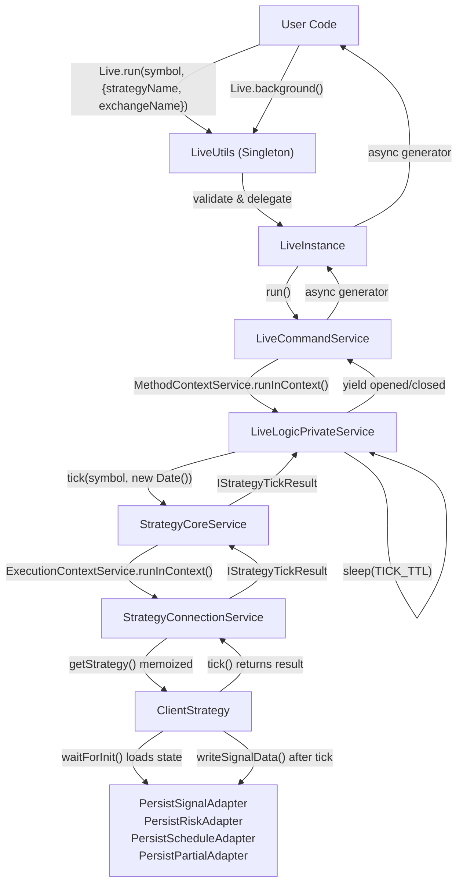
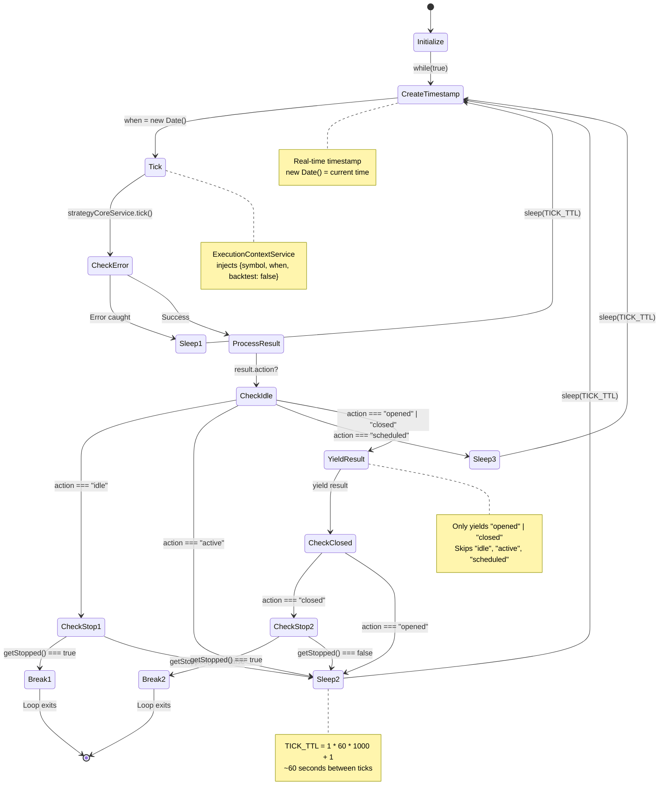
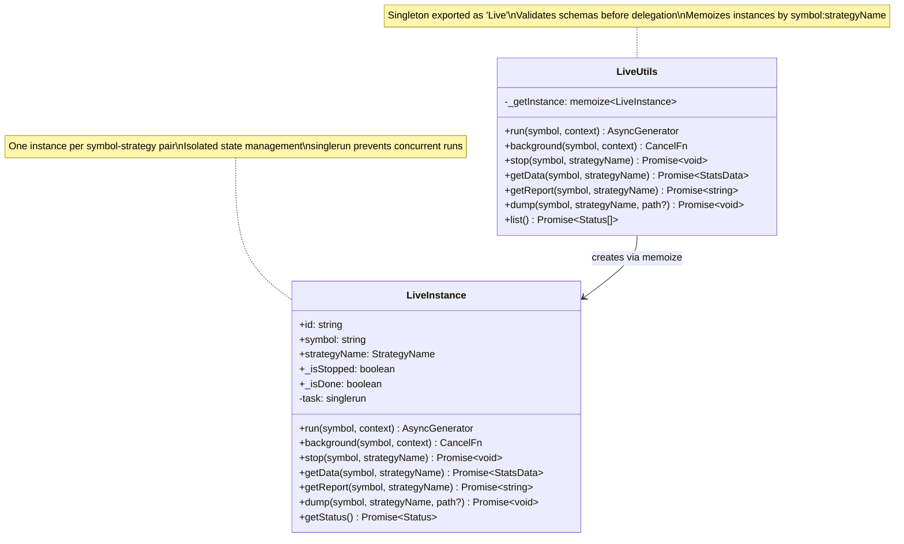
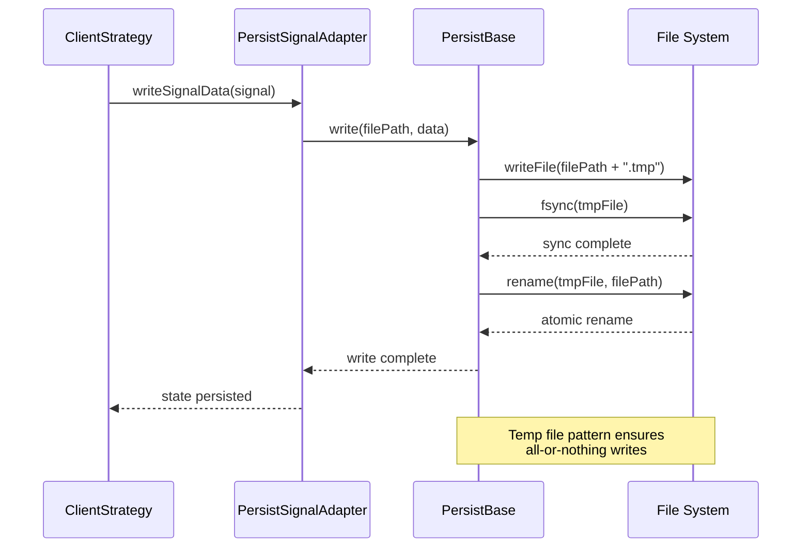
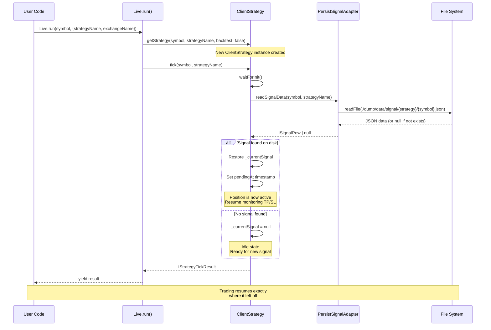
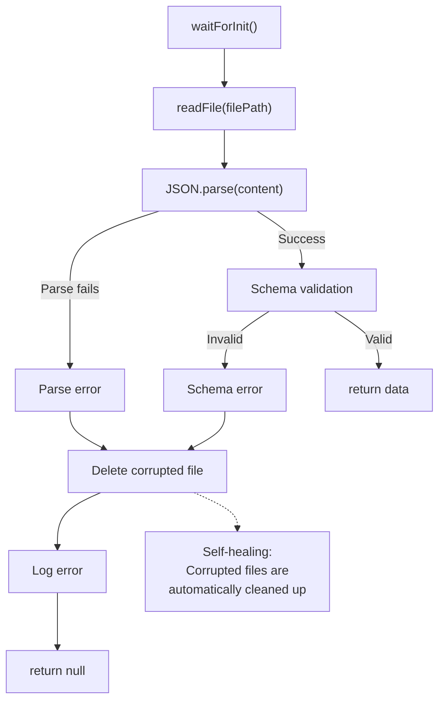
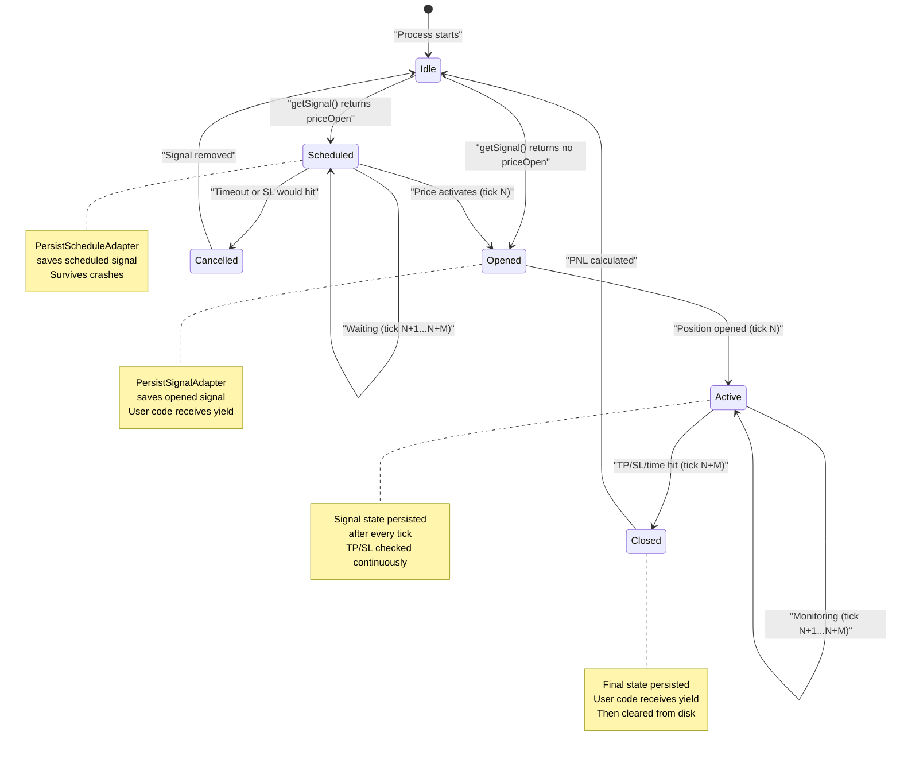
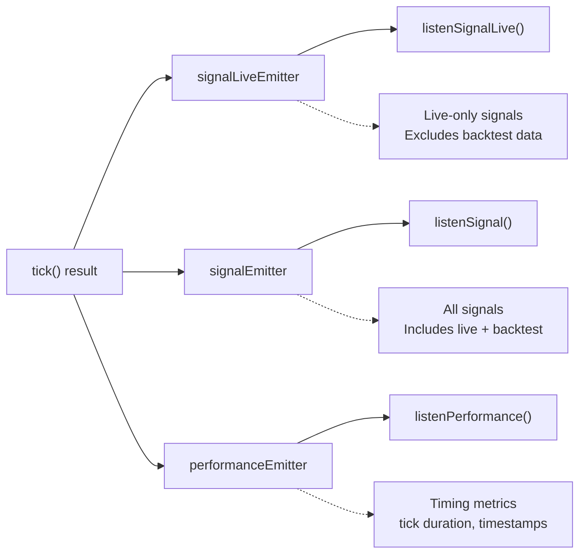

# Live Trading

<details>
<summary>Relevant source files</summary>

The following files were used as context for generating this wiki page:

- [src/classes/Backtest.ts](src/classes/Backtest.ts)
- [src/classes/Live.ts](src/classes/Live.ts)
- [src/classes/Walker.ts](src/classes/Walker.ts)
- [src/lib/services/connection/StrategyConnectionService.ts](src/lib/services/connection/StrategyConnectionService.ts)
- [src/lib/services/core/StrategyCoreService.ts](src/lib/services/core/StrategyCoreService.ts)
- [src/lib/services/logic/private/BacktestLogicPrivateService.ts](src/lib/services/logic/private/BacktestLogicPrivateService.ts)
- [src/lib/services/logic/private/LiveLogicPrivateService.ts](src/lib/services/logic/private/LiveLogicPrivateService.ts)
- [src/lib/services/logic/private/WalkerLogicPrivateService.ts](src/lib/services/logic/private/WalkerLogicPrivateService.ts)

</details>


Live Trading mode executes trading strategies in real-time against current market conditions with automatic crash recovery. Unlike Backtest mode (see [Backtesting](#9)), which simulates historical data, Live mode operates continuously with `Date.now()` timestamps and persists state to disk after every tick. This enables production-grade trading that survives process crashes, power failures, and system restarts.

For basic execution concepts, see [Execution Modes](#2.1). For persistence details, see [Persistence Layer](#15.3). For signal state management, see [Signal Lifecycle](#8).

---

## Overview

Live Trading provides:

| Feature | Description |
|---------|-------------|
| **Infinite Loop** | Continuous `while(true)` monitoring that never completes |
| **Real-time Timestamps** | Uses `new Date()` for current market time |
| **Crash Recovery** | Restores active positions from disk on restart |
| **State Persistence** | Atomic file writes after every tick |
| **Graceful Shutdown** | Allows open positions to complete before stopping |

### Key Differences from Backtest

| Aspect | Backtest | Live |
|--------|----------|------|
| Timestamps | Historical timeframes from `FrameCoreService` | Real-time `new Date()` |
| Completion | Finite (ends when timeframes exhausted) | Infinite (runs until stopped) |
| Persistence | Disabled (in-memory only) | Enabled (atomic disk writes) |
| Speed | Fast-forward through candles | Real-time (1 tick per `TICK_TTL`) |

**Sources:** [src/classes/Live.ts:1-614](), [src/classes/Backtest.ts:1-601](), [src/lib/services/logic/private/LiveLogicPrivateService.ts:1-181]()

---

## Execution Flow

### High-Level Architecture



**Sources:** [src/classes/Live.ts:347-376](), [src/lib/services/logic/private/LiveLogicPrivateService.ts:14-181]()

### Infinite Loop Structure

The core live trading loop is implemented in `LiveLogicPrivateService.run()`:



**Sources:** [src/lib/services/logic/private/LiveLogicPrivateService.ts:14-181]()

### LiveUtils Public API

The `LiveUtils` class provides a singleton interface for live trading operations:



**Sources:** [src/classes/Live.ts:376-596](), [src/classes/Live.ts:79-345]()

---

## Crash Recovery

### Persistence Architecture

Live Trading persists four types of state to disk after every tick:

| Adapter | Path | Content | Purpose |
|---------|------|---------|---------|
| `PersistSignalAdapter` | `./dump/data/signal/{strategy}/{symbol}.json` | Active pending signals | Restore open positions |
| `PersistRiskAdapter` | `./dump/data/risk/{riskName}.json` | Portfolio positions | Enforce risk limits |
| `PersistScheduleAdapter` | `./dump/data/schedule/{strategy}/{symbol}.json` | Scheduled signals | Restore pending limit orders |
| `PersistPartialAdapter` | `./dump/data/partial/{strategy}/{symbol}.json` | Partial TP/SL levels | Track milestone progress |

### Atomic Write Pattern

All persistence uses the atomic write pattern to prevent data corruption:



**Sources:** [src/classes/Persist.ts]() (referenced in diagrams)

### Recovery Flow

When a live trading process restarts after a crash:



**Sources:** [src/client/ClientStrategy.ts]() (referenced in architecture diagrams), [src/lib/services/connection/PartialConnectionService.ts]() (persistence architecture)

### Validation on Init

`PersistBase` validates all JSON files on initialization:



**Sources:** [src/classes/Persist.ts]() (referenced in Diagram 5 of architecture overview)

---

## Real-time Monitoring

### Tick Processing

Each tick evaluates the current signal state and returns a discriminated union:

| Result Action | When | Yielded to User | Description |
|--------------|------|-----------------|-------------|
| `idle` | No active signal | ❌ No | Strategy is ready for new signal |
| `scheduled` | Signal waiting for `priceOpen` | ❌ No | Limit order pending activation |
| `active` | Signal open, monitoring TP/SL | ❌ No | Position is active |
| `opened` | Signal just activated | ✅ Yes | New position opened |
| `closed` | Signal hit TP/SL/time | ✅ Yes | Position closed with PNL |

### Signal State Transitions in Live Mode



**Sources:** [src/client/ClientStrategy.ts]() (signal lifecycle), [src/lib/services/logic/private/LiveLogicPrivateService.ts:62-177]()

### Event Emission

Live mode emits events to three distinct channels:



**Sources:** [src/lib/services/connection/StrategyConnectionService.ts:216-238](), [src/lib/services/logic/private/LiveLogicPrivateService.ts:102-115]()

---

## Interval Throttling

### Strategy Interval Configuration

Each strategy declares a minimum interval that throttles signal generation:

```typescript
addStrategy({
  strategyName: "my-strategy",
  interval: "5m", // Only generate signals every 5 minutes
  getSignal: async (payload) => {
    // Called at most once per 5 minutes
  }
})
```

### Supported Intervals

| Interval | Minutes | Description |
|----------|---------|-------------|
| `1m` | 1 | Every tick (no throttling) |
| `3m` | 3 | Every 3 minutes |
| `5m` | 5 | Every 5 minutes |
| `15m` | 15 | Every 15 minutes |
| `30m` | 30 | Every 30 minutes |
| `1h` | 60 | Every hour |

### Throttling Mechanism

```mermaid
sequenceDiagram
    participant LOOP as LiveLogicPrivateService
    participant CS as ClientStrategy
    participant STRAT as Strategy.getSignal()
    
    Note over LOOP: Tick 1: 14:00:00
    LOOP->>CS: tick(when=14:00:00)
    CS->>CS: Check interval (5m)<br/>Last called: null
    CS->>STRAT: getSignal(payload)
    STRAT-->>CS: ISignalDto
    CS->>CS: Update _lastSignalTime = 14:00:00
    CS-->>LOOP: IStrategyTickResult
    
    Note over LOOP: Tick 2: 14:01:01
    LOOP->>CS: tick(when=14:01:01)
    CS->>CS: Check interval (5m)<br/>Last called: 14:00:00<br/>Elapsed: 1 min < 5 min
    CS->>CS: Skip getSignal()
    CS-->>LOOP: IStrategyTickResult (previous state)
    
    Note over LOOP: Tick 3: 14:05:01
    LOOP->>CS: tick(when=14:05:01)
    CS->>CS: Check interval (5m)<br/>Last called: 14:00:00<br/>Elapsed: 5 min >= 5 min
    CS->>STRAT: getSignal(payload)
    STRAT-->>CS: ISignalDto
    CS->>CS: Update _lastSignalTime = 14:05:01
    CS-->>LOOP: IStrategyTickResult
```

**Sources:** [src/client/ClientStrategy.ts]() (referenced in architecture), [src/interfaces/Strategy.interface.ts]() (interval types)

### TICK_TTL Constant

The `TICK_TTL` constant defines sleep duration between ticks:

```
TICK_TTL = 1 * 60 * 1_000 + 1
         = 60,001 milliseconds
         ≈ 60 seconds
```

This ensures approximately 1 tick per minute, regardless of strategy interval. Strategies with longer intervals (e.g., `5m`, `1h`) simply skip calling `getSignal()` on intermediate ticks.

**Sources:** [src/lib/services/logic/private/LiveLogicPrivateService.ts:14]()

---

## Usage Examples

### Basic Live Trading

```typescript
import { Live, addStrategy, addExchange } from "backtest-kit";

// Configure components
addStrategy({
  strategyName: "my-live-strategy",
  interval: "5m",
  getSignal: async (payload) => {
    // Strategy logic
  }
});

addExchange({
  exchangeName: "binance",
  getCandles: async (symbol, interval, startTime, limit) => {
    // Fetch real-time data from Binance API
  }
});

// Run live trading
for await (const result of Live.run("BTCUSDT", {
  strategyName: "my-live-strategy",
  exchangeName: "binance"
})) {
  if (result.action === "opened") {
    console.log("Position opened:", result.signal.id);
  }
  if (result.action === "closed") {
    console.log("Position closed:", result.pnl.pnlPercentage);
  }
}
```

**Sources:** [src/classes/Live.ts:598-614]()

### Background Execution

```typescript
// Run in background without yielding results
const cancel = Live.background("BTCUSDT", {
  strategyName: "my-live-strategy",
  exchangeName: "binance"
});

// Stop gracefully after some condition
setTimeout(() => {
  cancel(); // Sets stop flag
}, 3600000); // 1 hour
```

**Sources:** [src/classes/Live.ts:440-459]()

### Graceful Shutdown

```typescript
// Stop strategy from generating new signals
await Live.stop("BTCUSDT", "my-live-strategy");

// Get pending signal to check if position is still open
const pending = await strategyCoreService.getPendingSignal(
  false, // backtest = false (live mode)
  "BTCUSDT",
  "my-live-strategy"
);

if (pending) {
  console.log("Position still open, waiting for close...");
  // Allow signal to complete normally
}
```

**Sources:** [src/classes/Live.ts:461-489](), [src/classes/Live.ts:222-241]()

### Crash Recovery Example

```typescript
// Initial run - process crashes at 14:30 with open position
Live.background("BTCUSDT", {
  strategyName: "my-strategy",
  exchangeName: "binance"
});
// [Process crashes]

// Restart - position is automatically recovered
Live.background("BTCUSDT", {
  strategyName: "my-strategy",
  exchangeName: "binance"
});
// ClientStrategy.waitForInit() loads state from:
// - ./dump/data/signal/my-strategy/BTCUSDT.json
// - ./dump/data/risk/{riskName}.json
// - ./dump/data/schedule/my-strategy/BTCUSDT.json
// - ./dump/data/partial/my-strategy/BTCUSDT.json
// Trading resumes monitoring TP/SL exactly where it left off
```

**Sources:** [src/classes/Live.ts:1-614](), [src/lib/services/logic/private/LiveLogicPrivateService.ts:1-181]()

---

## Instance Management

### Memoization Strategy

`LiveUtils` uses `memoize()` to ensure one `LiveInstance` per symbol-strategy pair:

```
Key Format: "${symbol}:${strategyName}"
Example: "BTCUSDT:my-strategy"

Cache: Map<string, LiveInstance>
```

This prevents:
- Multiple concurrent instances for the same pair
- State conflicts between instances
- Resource leaks from duplicate connections

### Instance Status

```typescript
const statusList = await Live.list();
statusList.forEach(status => {
  console.log(`${status.id}: ${status.symbol} - ${status.strategyName}`);
  console.log(`Status: ${status.status}`); // "idle" | "running" | "done"
});
```

**Status Values:**
- `idle`: Instance created but not running
- `running`: Active infinite loop in progress
- `done`: Loop terminated (rare in live mode)

**Sources:** [src/classes/Live.ts:380-386](), [src/classes/Live.ts:592-595]()

---

## Comparison with Backtest Mode

### Execution Context

| Context Property | Backtest | Live |
|-----------------|----------|------|
| `backtest` flag | `true` | `false` |
| `when` timestamp | Historical from `FrameCoreService` | Real-time `new Date()` |
| `symbol` | Provided by user | Provided by user |

### Strategy Instance Isolation

`StrategyConnectionService.getStrategy()` creates separate instances based on mode:

```
Backtest: memoize key = "${symbol}:${strategyName}:backtest"
Live:     memoize key = "${symbol}:${strategyName}:live"
```

This allows running the same strategy in both modes simultaneously without interference.

**Sources:** [src/lib/services/connection/StrategyConnectionService.ts:123-156]()

### Persistence Behavior

| Operation | Backtest | Live |
|-----------|----------|------|
| `PersistSignalAdapter` | Skipped | Active |
| `PersistRiskAdapter` | Skipped | Active |
| `PersistScheduleAdapter` | Skipped | Active |
| `PersistPartialAdapter` | Skipped | Active |
| `ClientStrategy.waitForInit()` | No-op | Loads state from disk |

Backtest mode skips all persistence for performance, while Live mode persists state after every tick to enable crash recovery.

**Sources:** [src/client/ClientStrategy.ts]() (referenced in architecture diagrams)

---

## Error Handling

### Tick Failures

When `strategyCoreService.tick()` throws an error:

```typescript
try {
  result = await this.strategyCoreService.tick(symbol, when, false);
} catch (error) {
  console.warn(`tick failed when=${when.toISOString()} symbol=${symbol}`);
  this.loggerService.warn("tick failed, retrying after sleep", { error });
  await errorEmitter.next(error);
  await sleep(TICK_TTL);
  continue; // Retry on next iteration
}
```

The loop continues, allowing transient errors (network timeouts, API rate limits) to self-recover.

**Sources:** [src/lib/services/logic/private/LiveLogicPrivateService.ts:74-95]()

### Persistence Failures

If atomic write fails:
1. Temporary file is not renamed
2. Original file remains unchanged
3. Error is logged but does not crash the loop
4. Next tick will retry persistence

This ensures trading continues even if disk I/O is temporarily unavailable.

**Sources:** [src/classes/Persist.ts]() (referenced in Diagram 5)

---

## Performance Tracking

Live mode emits performance metrics for each tick:

```typescript
await performanceEmitter.next({
  timestamp: Date.now(),
  previousTimestamp: previousEventTimestamp,
  metricType: "live_tick",
  duration: tickEndTime - tickStartTime,
  strategyName: this.methodContextService.context.strategyName,
  exchangeName: this.methodContextService.context.exchangeName,
  symbol,
  backtest: false,
});
```

Subscribe to these events to monitor:
- Tick processing duration
- Time between ticks
- System performance trends

**Sources:** [src/lib/services/logic/private/LiveLogicPrivateService.ts:102-115]()

---

## Related Pages

- [Backtesting](#9) - Historical simulation mode
- [Signal Lifecycle](#8) - Signal state transitions
- [Crash Recovery](#10.2) - Detailed persistence mechanisms
- [Client Implementations](#6) - ClientStrategy details
- [Persistence Layer](#15.3) - Atomic write patterns