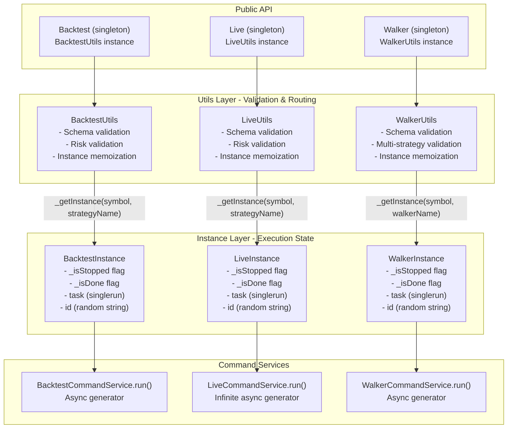
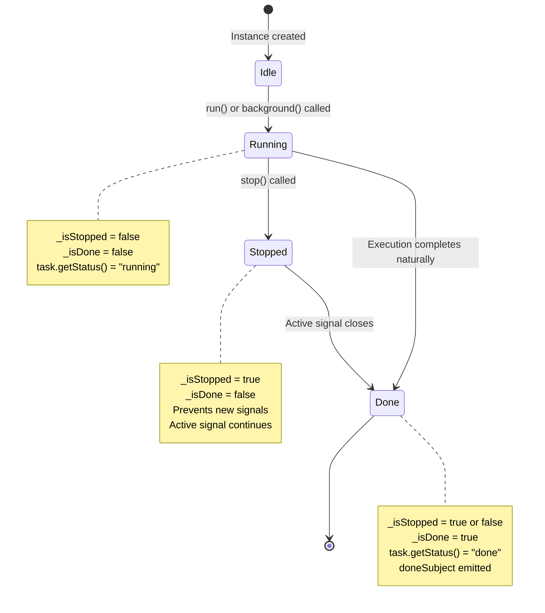
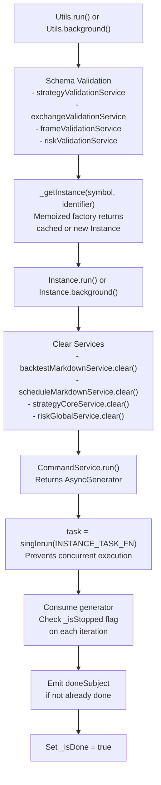
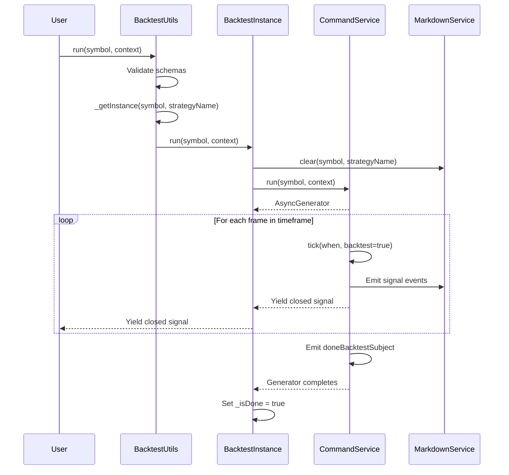
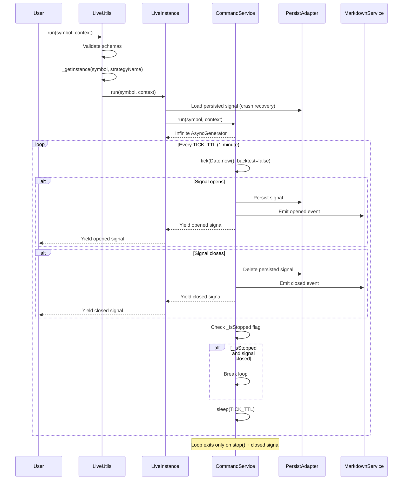
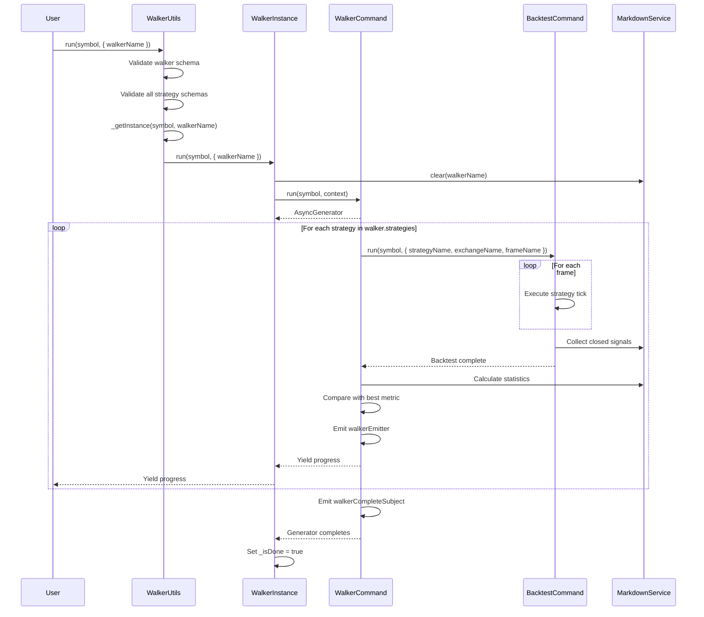
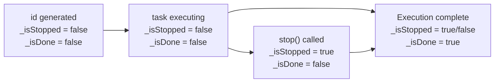
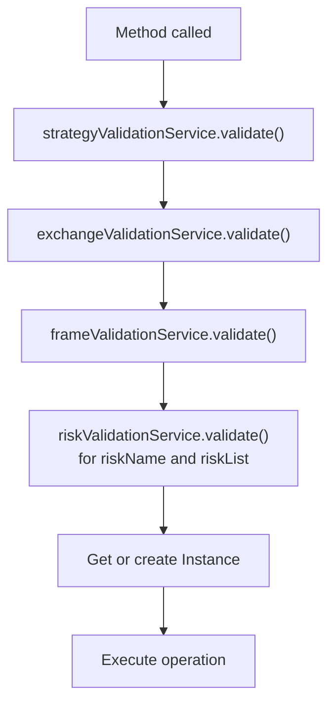
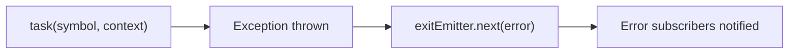

# Execution Classes API

This page documents the public execution classes that orchestrate backtest, live trading, and strategy comparison operations. These are the primary entry points for running trading strategies after configuration via global functions (see [Global Functions](./56_api-reference.md)).

For specialized reporting and monitoring classes (Performance, Heat, Risk, Schedule, Partial), see [Reporting Classes API](./56_api-reference.md).

---

## Architecture: Instance-Utils Pattern

The framework uses a dual-class pattern for each execution mode. Every execution class consists of:

1. **Instance class** (`BacktestInstance`, `LiveInstance`, `WalkerInstance`) - Manages execution for a specific symbol-strategy pair with isolated state
2. **Utils class** (`BacktestUtils`, `LiveUtils`, `WalkerUtils`) - Singleton wrapper providing validation, instance memoization, and convenient API surface
3. **Exported singleton** (`Backtest`, `Live`, `Walker`) - Single instance of Utils class for application-wide use



**Instance Memoization**

Each Utils class maintains a memoized factory that caches Instance objects by key:
- **Backtest/Live**: Key is `"${symbol}:${strategyName}"` (e.g., `"BTCUSDT:my-strategy"`)
- **Walker**: Key is `"${symbol}:${walkerName}"` (e.g., `"BTCUSDT:my-walker"`)

This ensures that multiple calls to `run()` or `background()` for the same symbol-strategy pair reuse the same Instance object, preserving execution state across calls.

Sources: [src/classes/Backtest.ts:359-399](), [src/classes/Live.ts:376-417](), [src/classes/Walker.ts:431-471]()

---

## Common Patterns

All execution classes share these common patterns:

### Method Signatures

| Method | Returns | Description |
|--------|---------|-------------|
| `run(symbol, context)` | `AsyncGenerator` | Executes and yields results incrementally |
| `background(symbol, context)` | `() => void` | Executes without yielding, returns cancellation function |
| `stop(symbol, identifier)` | `Promise<void>` | Stops strategy from opening new signals |
| `getData(symbol, identifier)` | `Promise<Statistics>` | Retrieves aggregated statistics |
| `getReport(symbol, identifier, columns?)` | `Promise<string>` | Generates markdown report |
| `dump(symbol, identifier, path?, columns?)` | `Promise<void>` | Saves report to disk |
| `list()` | `Promise<StatusObject[]>` | Lists all active instances |

**Context Variations:**
- **Backtest**: `{ strategyName, exchangeName, frameName }`
- **Live**: `{ strategyName, exchangeName }`
- **Walker**: `{ walkerName }` (exchange/frame pulled from walker schema)

### State Management



Each Instance maintains:
- `id`: Randomly generated string for tracking
- `_isStopped`: Manual stop flag preventing new signals
- `_isDone`: Completion flag indicating execution finished
- `task`: Singlerun-wrapped function ensuring single concurrent execution

Sources: [src/classes/Backtest.ts:74-93](), [src/classes/Live.ts:79-98](), [src/classes/Walker.ts:72-91]()

### Task Execution Flow



Sources: [src/classes/Backtest.ts:26-53](), [src/classes/Live.ts:31-57](), [src/classes/Walker.ts:27-53]()

---

## Backtest Class

The `Backtest` class provides historical simulation with deterministic time progression.

### Core Methods

#### run()

Executes backtest and yields closed signals as they occur.

```typescript
Backtest.run(
  symbol: string,
  context: {
    strategyName: string;
    exchangeName: string;
    frameName: string;
  }
): AsyncGenerator<IStrategyTickResultClosed>
```

**Usage:**
```typescript
for await (const result of Backtest.run("BTCUSDT", {
  strategyName: "my-strategy",
  exchangeName: "binance",
  frameName: "1d-backtest"
})) {
  console.log(`Signal closed: ${result.pnl.pnlPercentage}%`);
}
```

**Behavior:**
- Iterates through timeframes defined by `frameName`
- Yields only `IStrategyTickResultClosed` results (action: "closed")
- Uses fast-backtest optimization to skip frames while signal is active
- Stops when frame iteration completes or `stop()` is called

Sources: [src/classes/Backtest.ts:378-400](), [src/classes/Backtest.ts:149-178]()

#### background()

Runs backtest silently, consuming all results internally. Useful for side-effect-only execution (callbacks, logging).

```typescript
Backtest.background(
  symbol: string,
  context: {
    strategyName: string;
    exchangeName: string;
    frameName: string;
  }
): () => void  // Returns cancellation function
```

**Usage:**
```typescript
const cancel = Backtest.background("BTCUSDT", {
  strategyName: "my-strategy",
  exchangeName: "binance",
  frameName: "1d-backtest"
});

// Later: cancel execution gracefully
cancel();
```

**Behavior:**
- Spawns async task via `task(symbol, context)`
- Returns cancellation closure immediately
- Cancellation checks for pending signal before emitting done event
- Errors are caught and emitted to `exitEmitter`

Sources: [src/classes/Backtest.ts:423-443](), [src/classes/Backtest.ts:200-235]()

#### stop()

Prevents strategy from opening new signals. Active signal (if any) completes normally.

```typescript
Backtest.stop(
  symbol: string,
  strategyName: string
): Promise<void>
```

**Usage:**
```typescript
await Backtest.stop("BTCUSDT", "my-strategy");
```

**Behavior:**
- Calls `strategyCoreService.stop({ symbol, strategyName }, true)`
- Sets internal flag in `ClientStrategy` instance
- Does NOT force-close active signals
- Backtest loop checks `_isStopped` after each frame and exits at next idle state

Sources: [src/classes/Backtest.ts:462-473](), [src/classes/Backtest.ts:254-260]()

#### getData()

Retrieves aggregated statistics from all closed signals.

```typescript
Backtest.getData(
  symbol: string,
  strategyName: string
): Promise<BacktestStatisticsModel>
```

**Returns:**
- `sharpeRatio`: Risk-adjusted return metric
- `winRate`: Percentage of profitable trades
- `totalPnl`: Cumulative profit/loss percentage
- `maxDrawdown`: Largest peak-to-trough decline
- `totalTrades`: Number of closed signals
- Additional metrics (avg trade duration, profit factor, etc.)

Sources: [src/classes/Backtest.ts:488-499](), [src/classes/Backtest.ts:276-282]()

#### getReport()

Generates markdown report with signal table and statistics summary.

```typescript
Backtest.getReport(
  symbol: string,
  strategyName: string,
  columns?: Columns[]
): Promise<string>
```

**Columns Parameter:**
Optional array of `ColumnModel` objects to customize report columns. Each column specifies:
- `key`: Unique column identifier
- `label`: Column header text
- `format`: Function to format cell value from signal data
- `isVisible`: Function returning boolean for conditional visibility

**Default Columns:** Signal ID, Symbol, Position, Open Price, Take Profit, Stop Loss, Close Price, PNL %, Close Reason, Open Time, Close Time, Duration, Note

Sources: [src/classes/Backtest.ts:515-526](), [src/classes/Backtest.ts:299-305](), [test/spec/columns.test.mjs:15-112]()

#### dump()

Saves markdown report to file.

```typescript
Backtest.dump(
  symbol: string,
  strategyName: string,
  path?: string,
  columns?: Columns[]
): Promise<void>
```

**Default Path:** `./dump/backtest/{strategyName}.md`

Sources: [src/classes/Backtest.ts:545-561](), [src/classes/Backtest.ts:325-337]()

#### list()

Lists all active backtest instances with their status.

```typescript
Backtest.list(): Promise<Array<{
  id: string;
  symbol: string;
  strategyName: string;
  status: "idle" | "running" | "done";
}>>
```

**Usage:**
```typescript
const instances = await Backtest.list();
instances.forEach(inst => {
  console.log(`${inst.symbol}:${inst.strategyName} - ${inst.status}`);
});
```

Sources: [src/classes/Backtest.ts:576-579]()

### Backtest Execution Flow



Sources: [src/classes/Backtest.ts:149-178](), [src/classes/Backtest.ts:378-400]()

---

## Live Class

The `Live` class provides real-time trading execution with crash recovery support.

### Core Methods

#### run()

Executes live trading with infinite loop, yielding opened and closed signals.

```typescript
Live.run(
  symbol: string,
  context: {
    strategyName: string;
    exchangeName: string;
  }
): AsyncGenerator<IStrategyTickResultOpened | IStrategyTickResultClosed>
```

**Usage:**
```typescript
for await (const result of Live.run("BTCUSDT", {
  strategyName: "my-strategy",
  exchangeName: "binance"
})) {
  if (result.action === "opened") {
    console.log(`Signal opened: ${result.signal.position}`);
  } else if (result.action === "closed") {
    console.log(`Signal closed: PNL ${result.pnl.pnlPercentage}%`);
  }
}
```

**Behavior:**
- Infinite async generator (never completes naturally)
- Polls every `TICK_TTL` (1 minute + 1ms) with `Date.now()`
- Yields both opened and closed signals
- Persists opened signals to disk for crash recovery
- Restores persisted signal on startup

Sources: [src/classes/Live.ts:398-417](), [src/classes/Live.ts:156-186]()

#### background()

Runs live trading silently in background. Returns cancellation function.

```typescript
Live.background(
  symbol: string,
  context: {
    strategyName: string;
    exchangeName: string;
  }
): () => void
```

**Usage:**
```typescript
const cancel = Live.background("BTCUSDT", {
  strategyName: "my-strategy",
  exchangeName: "binance"
});

// Graceful shutdown after receiving SIGINT
process.on("SIGINT", () => {
  cancel();
});
```

**Behavior:**
- Returns cancellation closure immediately
- Live loop continues until `stop()` called or process crashes
- Cancellation waits for active signal to close before emitting done event
- Crash recovery: persisted signals restored on next startup

Sources: [src/classes/Live.ts:441-459](), [src/classes/Live.ts:208-242]()

#### stop()

Initiates graceful shutdown. Waits for active signal to close before completing.

```typescript
Live.stop(
  symbol: string,
  strategyName: string
): Promise<void>
```

**Usage:**
```typescript
await Live.stop("BTCUSDT", "my-strategy");
// Active signal will continue monitoring until TP/SL/time_expired
```

**Behavior:**
- Sets `_isStopped = true` flag
- Prevents new signals from opening
- Active signal continues monitoring until natural closure
- Loop exits after signal closes (checked in `INSTANCE_TASK_FN`)

Sources: [src/classes/Live.ts:478-489](), [src/classes/Live.ts:261-267]()

#### getData()

Retrieves live trading statistics including all event types (opened, closed, scheduled, cancelled).

```typescript
Live.getData(
  symbol: string,
  strategyName: string
): Promise<LiveStatisticsModel>
```

**Returns:**
Statistics covering all signal lifecycle events, not just closed signals like backtest.

Sources: [src/classes/Live.ts:504-515](), [src/classes/Live.ts:283-289]()

#### getReport()

Generates markdown report with all live trading events.

```typescript
Live.getReport(
  symbol: string,
  strategyName: string,
  columns?: Columns[]
): Promise<string>
```

**Report Differences from Backtest:**
- Includes "opened" events (signals currently active)
- Includes "scheduled" events (waiting for activation)
- Includes "cancelled" events (scheduled signals that never activated)
- Real-time data with current timestamps

Sources: [src/classes/Live.ts:531-542](), [src/classes/Live.ts:306-312]()

#### dump()

Saves live trading report to file.

```typescript
Live.dump(
  symbol: string,
  strategyName: string,
  path?: string,
  columns?: Columns[]
): Promise<void>
```

**Default Path:** `./dump/live/{strategyName}.md`

Sources: [src/classes/Live.ts:561-577](), [src/classes/Live.ts:332-344]()

### Live Execution Flow



Sources: [src/classes/Live.ts:156-186]()

---

## Walker Class

The `Walker` class orchestrates sequential backtests across multiple strategies for comparison.

### Core Methods

#### run()

Runs all strategies defined in walker schema and yields progress after each strategy completes.

```typescript
Walker.run(
  symbol: string,
  context: {
    walkerName: string;
  }
): AsyncGenerator<WalkerContract>
```

**WalkerContract Structure:**
```typescript
{
  strategiesTested: number;
  totalStrategies: number;
  currentStrategy: string;
  bestStrategy: string;
  bestMetric: number;
  metric: WalkerMetric;  // "sharpeRatio" | "winRate" | "totalPnl" | etc.
}
```

**Usage:**
```typescript
for await (const progress of Walker.run("BTCUSDT", {
  walkerName: "my-walker"
})) {
  console.log(`Testing ${progress.currentStrategy} (${progress.strategiesTested}/${progress.totalStrategies})`);
  console.log(`Best so far: ${progress.bestStrategy} with ${progress.metric}=${progress.bestMetric}`);
}
```

**Behavior:**
- Pulls `strategies`, `exchangeName`, `frameName`, `metric` from walker schema
- Validates all strategy schemas before starting
- Executes `Backtest.run()` for each strategy sequentially
- Collects statistics from `BacktestMarkdownService` after each strategy
- Compares strategies using specified metric (default: `sharpeRatio`)
- Yields progress event after each strategy completes

Sources: [src/classes/Walker.ts:450-472](), [src/classes/Walker.ts:145-194]()

#### background()

Runs walker comparison silently. Returns cancellation function.

```typescript
Walker.background(
  symbol: string,
  context: {
    walkerName: string;
  }
): () => void
```

**Usage:**
```typescript
const cancel = Walker.background("BTCUSDT", {
  walkerName: "my-walker"
});

// Cancel all strategies
cancel();
```

**Behavior:**
- Executes all strategy backtests in background
- Cancellation sends stop signal to all strategies via `walkerStopSubject`
- Prevents interference when multiple walkers run on same symbol simultaneously

Sources: [src/classes/Walker.ts:493-515](), [src/classes/Walker.ts:214-246]()

#### stop()

Stops all strategies in walker from generating new signals.

```typescript
Walker.stop(
  symbol: string,
  walkerName: string
): Promise<void>
```

**Behavior:**
- Iterates through all strategies in walker schema
- Sends stop signal via `walkerStopSubject` (interrupts current running strategy)
- Calls `strategyCoreService.stop()` for each strategy
- Supports multiple concurrent walkers on same symbol (filtered by `walkerName`)

Sources: [src/classes/Walker.ts:540-554](), [src/classes/Walker.ts:271-283]()

#### getData()

Retrieves walker comparison results with ranked strategies.

```typescript
Walker.getData(
  symbol: string,
  walkerName: string
): Promise<WalkerStatisticsModel>
```

**Returns:**
- `strategies`: Array of strategy results with metrics
- `bestStrategy`: Name of winning strategy
- `bestMetric`: Winning metric value
- `metric`: Metric used for comparison
- Per-strategy statistics (Sharpe ratio, win rate, total PNL, etc.)

Sources: [src/classes/Walker.ts:569-586](), [src/classes/Walker.ts:299-319]()

#### getReport()

Generates markdown report with strategy comparison table.

```typescript
Walker.getReport(
  symbol: string,
  walkerName: string,
  strategyColumns?: StrategyColumn[],
  pnlColumns?: PnlColumn[]
): Promise<string>
```

**Custom Columns:**
- `strategyColumns`: Customize strategy metadata columns
- `pnlColumns`: Customize PNL/metrics columns

**Default Report Structure:**
1. Walker metadata (symbol, metric, date range)
2. Strategy comparison table sorted by metric
3. Winner highlighted
4. Per-strategy PNL breakdown tables

Sources: [src/classes/Walker.ts:603-622](), [src/classes/Walker.ts:337-361]()

#### dump()

Saves walker comparison report to file.

```typescript
Walker.dump(
  symbol: string,
  walkerName: string,
  path?: string,
  strategyColumns?: StrategyColumn[],
  pnlColumns?: PnlColumn[]
): Promise<void>
```

**Default Path:** `./dump/walker/{walkerName}.md`

Sources: [src/classes/Walker.ts:642-662](), [src/classes/Walker.ts:382-409]()

### Walker Execution Flow



Sources: [src/classes/Walker.ts:145-194]()

---

## Method Signature Reference

### Backtest Class

| Method | Parameters | Return Type | Description |
|--------|-----------|-------------|-------------|
| `run` | `symbol: string`<br/>`context: { strategyName, exchangeName, frameName }` | `AsyncGenerator<IStrategyTickResultClosed>` | Execute backtest, yield closed signals |
| `background` | `symbol: string`<br/>`context: { strategyName, exchangeName, frameName }` | `() => void` | Execute backtest silently, return cancel function |
| `stop` | `symbol: string`<br/>`strategyName: string` | `Promise<void>` | Stop strategy from opening new signals |
| `getData` | `symbol: string`<br/>`strategyName: string` | `Promise<BacktestStatisticsModel>` | Get aggregated statistics |
| `getReport` | `symbol: string`<br/>`strategyName: string`<br/>`columns?: Columns[]` | `Promise<string>` | Generate markdown report |
| `dump` | `symbol: string`<br/>`strategyName: string`<br/>`path?: string`<br/>`columns?: Columns[]` | `Promise<void>` | Save report to disk |
| `list` | None | `Promise<Array<StatusObject>>` | List all backtest instances |

Sources: [src/classes/Backtest.ts:359-580]()

### Live Class

| Method | Parameters | Return Type | Description |
|--------|-----------|-------------|-------------|
| `run` | `symbol: string`<br/>`context: { strategyName, exchangeName }` | `AsyncGenerator<IStrategyTickResultOpened \| IStrategyTickResultClosed>` | Execute live trading, yield all signals |
| `background` | `symbol: string`<br/>`context: { strategyName, exchangeName }` | `() => void` | Execute live trading silently |
| `stop` | `symbol: string`<br/>`strategyName: string` | `Promise<void>` | Initiate graceful shutdown |
| `getData` | `symbol: string`<br/>`strategyName: string` | `Promise<LiveStatisticsModel>` | Get live trading statistics |
| `getReport` | `symbol: string`<br/>`strategyName: string`<br/>`columns?: Columns[]` | `Promise<string>` | Generate live trading report |
| `dump` | `symbol: string`<br/>`strategyName: string`<br/>`path?: string`<br/>`columns?: Columns[]` | `Promise<void>` | Save report to disk |
| `list` | None | `Promise<Array<StatusObject>>` | List all live instances |

Sources: [src/classes/Live.ts:376-595]()

### Walker Class

| Method | Parameters | Return Type | Description |
|--------|-----------|-------------|-------------|
| `run` | `symbol: string`<br/>`context: { walkerName }` | `AsyncGenerator<WalkerContract>` | Execute strategy comparison, yield progress |
| `background` | `symbol: string`<br/>`context: { walkerName }` | `() => void` | Execute comparison silently |
| `stop` | `symbol: string`<br/>`walkerName: string` | `Promise<void>` | Stop all walker strategies |
| `getData` | `symbol: string`<br/>`walkerName: string` | `Promise<WalkerStatisticsModel>` | Get comparison results |
| `getReport` | `symbol: string`<br/>`walkerName: string`<br/>`strategyColumns?: StrategyColumn[]`<br/>`pnlColumns?: PnlColumn[]` | `Promise<string>` | Generate comparison report |
| `dump` | `symbol: string`<br/>`walkerName: string`<br/>`path?: string`<br/>`strategyColumns?: StrategyColumn[]`<br/>`pnlColumns?: PnlColumn[]` | `Promise<void>` | Save report to disk |
| `list` | None | `Promise<Array<StatusObject>>` | List all walker instances |

Sources: [src/classes/Walker.ts:431-680]()

---

## Instance State Management

### State Flags

Each Instance class maintains three state indicators:

| Property | Type | Purpose |
|----------|------|---------|
| `id` | `string` | Randomly generated identifier for tracking |
| `_isStopped` | `boolean` | Manual stop flag preventing new signals |
| `_isDone` | `boolean` | Completion flag indicating execution finished |

**Lifecycle:**



Sources: [src/classes/Backtest.ts:74-82](), [src/classes/Live.ts:79-87](), [src/classes/Walker.ts:72-80]()

### Task Singlerun Wrapper

All Instance classes wrap their execution logic in `singlerun()` from `functools-kit`:

```typescript
private task = singlerun(async (symbol, context) => {
  // Execution logic
  return await INSTANCE_TASK_FN(symbol, context, this);
});
```

**Purpose:**
- Prevents concurrent execution of same instance
- Returns existing promise if task already running
- Provides status via `task.getStatus()`: `"idle" | "running" | "done"`

Sources: [src/classes/Backtest.ts:105-118](), [src/classes/Live.ts:110-122](), [src/classes/Walker.ts:103-114]()

### getStatus() Method

Returns current execution status for monitoring:

```typescript
const status = await instance.getStatus();
// {
//   id: "abc123",
//   symbol: "BTCUSDT",
//   strategyName: "my-strategy",
//   status: "running"
// }
```

**Status Values:**
- `"idle"`: Instance created but not started
- `"running"`: Execution in progress
- `"done"`: Execution completed

Sources: [src/classes/Backtest.ts:132-140](), [src/classes/Live.ts:136-144](), [src/classes/Walker.ts:128-136]()

---

## Validation & Error Handling

### Schema Validation

All execution methods validate required schemas before execution:



**Validation Failures:**
If any schema is not registered, validation throws error with helpful message indicating which schema is missing and which method was called.

Sources: [src/classes/Backtest.ts:387-396](), [src/classes/Live.ts:406-414](), [src/classes/Walker.ts:456-468]()

### Error Emission



**Error Handling Strategy:**
- Background tasks catch all errors and emit to `exitEmitter`
- `run()` method errors propagate to caller (no catch)
- Users can subscribe to errors via `listenError()` and `listenExit()`
- Distinguishes between recoverable errors (`errorEmitter`) and fatal errors (`exitEmitter`)

Sources: [src/classes/Backtest.ts:212-214](), [src/classes/Live.ts:219-221](), [src/classes/Walker.ts:227-229]()

---

## Integration with Service Layer

Execution classes coordinate multiple service layers:

```mermaid
graph TB
    subgraph "Execution Classes"
        Backtest["Backtest"]
        Live["Live"]
        Walker["Walker"]
    end
    
    subgraph "Validation Services"
        StrategyVal["strategyValidationService"]
        ExchangeVal["exchangeValidationService"]
        FrameVal["frameValidationService"]
        RiskVal["riskValidationService"]
    end
    
    subgraph "Schema Services"
        StrategySchema["strategySchemaService"]
        WalkerSchema["walkerSchemaService"]
    end
    
    subgraph "Command Services"
        BacktestCmd["backtestCommandService"]
        LiveCmd["liveCommandService"]
        WalkerCmd["walkerCommandService"]
    end
    
    subgraph "Markdown Services"
        BacktestMd["backtestMarkdownService"]
        LiveMd["liveMarkdownService"]
        WalkerMd["walkerMarkdownService"]
        ScheduleMd["scheduleMarkdownService"]
    end
    
    subgraph "Core Services"
        StrategyCore["strategyCoreService"]
        RiskGlobal["riskGlobalService"]
    end
    
    Backtest --> StrategyVal
    Backtest --> ExchangeVal
    Backtest --> FrameVal
    Backtest --> RiskVal
    Backtest --> StrategySchema
    Backtest --> BacktestCmd
    Backtest --> BacktestMd
    Backtest --> ScheduleMd
    Backtest --> StrategyCore
    Backtest --> RiskGlobal
    
    Live --> StrategyVal
    Live --> ExchangeVal
    Live --> RiskVal
    Live --> StrategySchema
    Live --> LiveCmd
    Live --> LiveMd
    Live --> ScheduleMd
    Live --> StrategyCore
    Live --> RiskGlobal
    
    Walker --> StrategyVal
    Walker --> ExchangeVal
    Walker --> FrameVal
    Walker --> RiskVal
    Walker --> WalkerSchema
    Walker --> WalkerCmd
    Walker --> WalkerMd
    Walker --> BacktestMd
    Walker --> StrategyCore
    Walker --> RiskGlobal
```



**Key Integration Points:**

1. **Validation**: All schemas validated before execution
2. **Schema Retrieval**: Pull configuration from schema services
3. **Command Execution**: Delegate to command services for async generator logic
4. **Reporting**: Markdown services collect events and generate reports
5. **State Management**: Core services manage strategy/risk state
6. **Cleanup**: Clear services before each new execution

Sources: [src/classes/Backtest.ts:163-176](), [src/classes/Live.ts:169-183](), [src/classes/Walker.ts:163-187]()