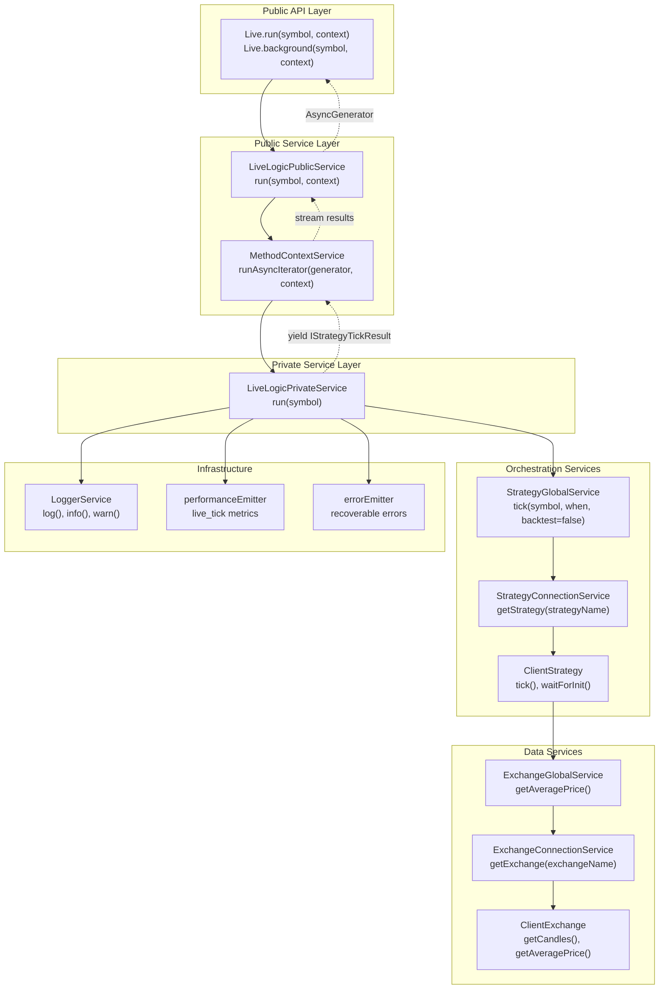
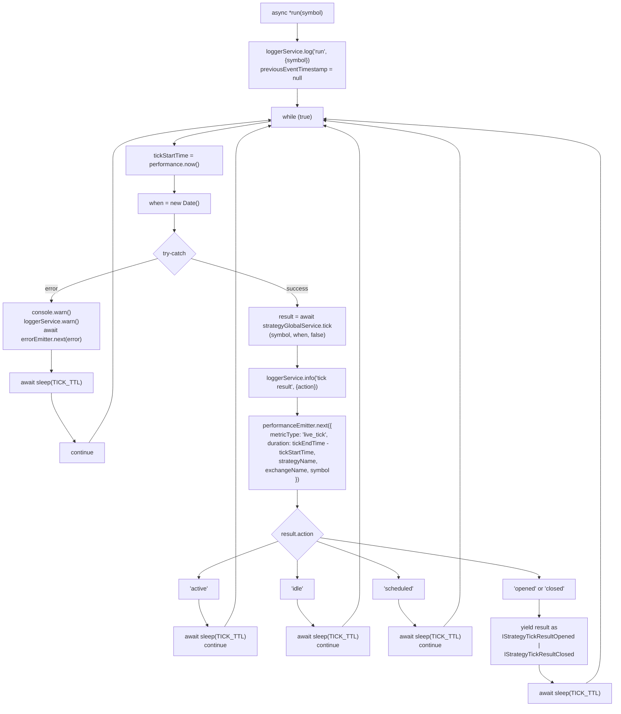
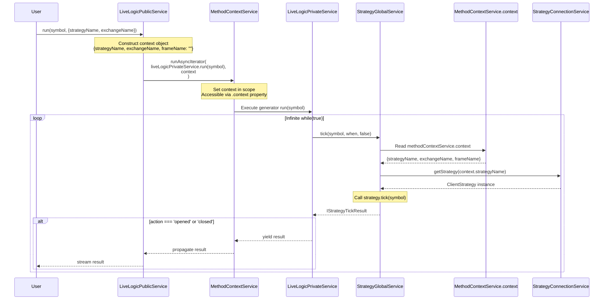
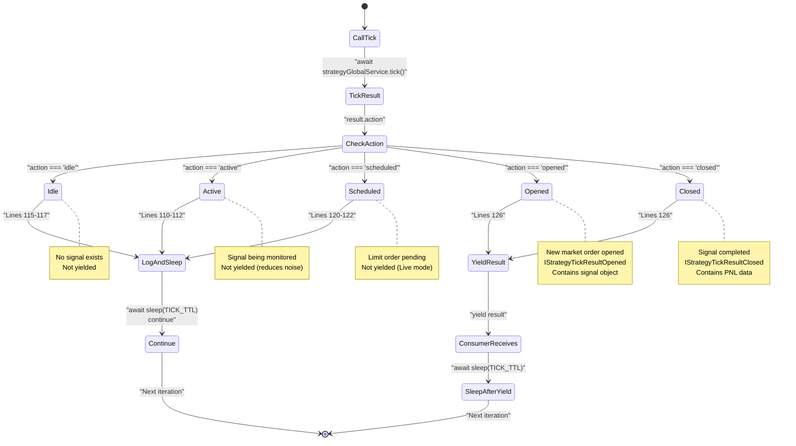
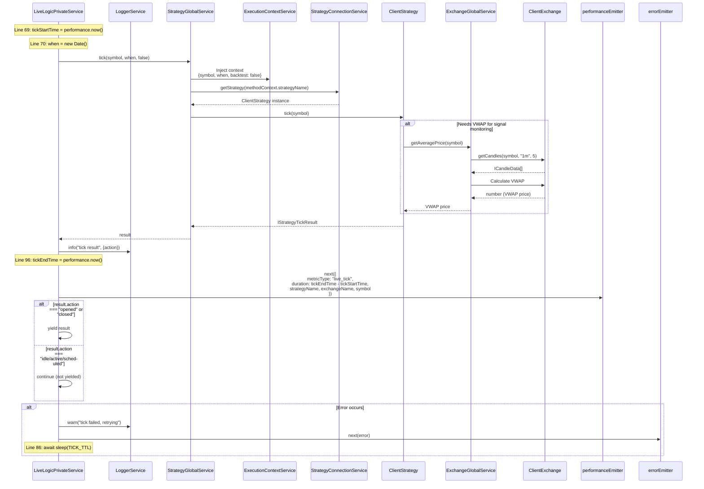
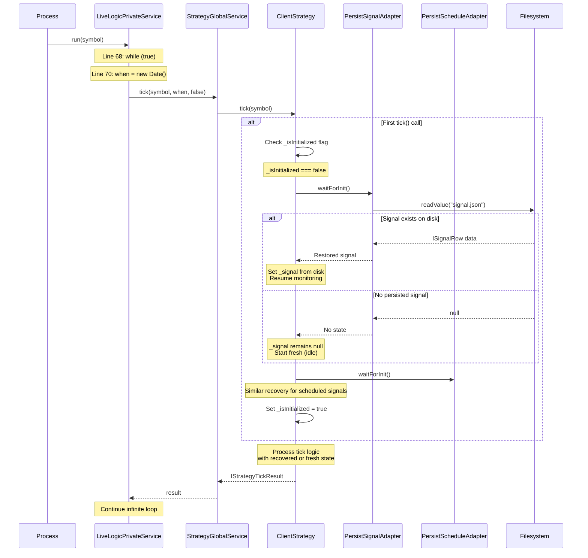

# Live Execution Flow

<details>
<summary>Relevant source files</summary>

The following files were used as context for generating this wiki page:

- [src/classes/Backtest.ts](src/classes/Backtest.ts)
- [src/classes/Live.ts](src/classes/Live.ts)
- [src/classes/Walker.ts](src/classes/Walker.ts)
- [src/lib/services/connection/StrategyConnectionService.ts](src/lib/services/connection/StrategyConnectionService.ts)
- [src/lib/services/core/StrategyCoreService.ts](src/lib/services/core/StrategyCoreService.ts)
- [src/lib/services/logic/private/BacktestLogicPrivateService.ts](src/lib/services/logic/private/BacktestLogicPrivateService.ts)
- [src/lib/services/logic/private/LiveLogicPrivateService.ts](src/lib/services/logic/private/LiveLogicPrivateService.ts)
- [src/lib/services/logic/private/WalkerLogicPrivateService.ts](src/lib/services/logic/private/WalkerLogicPrivateService.ts)

</details>


This page documents the live trading execution flow implemented by `LiveLogicPrivateService` and `LiveLogicPublicService`. The focus is on the infinite `while(true)` loop mechanics, real-time `Date()` progression, `TICK_TTL` sleep intervals, and async generator result streaming.

Related pages: [Crash Recovery (10.2)]() for persistence layer, [Real-time Monitoring (10.3)]() for signal lifecycle callbacks, [Backtest Execution Flow (9.1)]() for comparison with historical mode.

---

## Overview

Live execution operates as an infinite async generator that monitors trading signals at 61-second intervals (`TICK_TTL = 1 * 60 * 1_000 + 1`). Unlike backtest mode which iterates through pre-defined timeframes, live mode progresses in real-time using `new Date()` at each tick.

**Two-Layer Architecture:**

| Layer | Class | Responsibility |
|-------|-------|----------------|
| Private | `LiveLogicPrivateService` | Infinite loop, tick execution, result filtering |
| Public | `LiveLogicPublicService` | Context injection via `MethodContextService` |

The generator yields only `opened` and `closed` results to consumers, filtering out `idle`, `active`, and `scheduled` states internally.

**Sources**: [src/lib/services/logic/private/LiveLogicPrivateService.ts:12-134]()

---

## Service Layer Architecture

**Live Execution Service Stack**



**Sources**: [src/lib/services/logic/private/LiveLogicPrivateService.ts:30-131](), [src/lib/services/logic/public/LiveLogicPublicService.ts:1-78]()

---

## Infinite Loop Mechanics

`LiveLogicPrivateService.run()` implements an infinite async generator with precise timing control:

**Infinite Loop Implementation**



**Key Implementation Details:**

| Line | Construct | Purpose |
|------|-----------|---------|
| [12]() | `const TICK_TTL = 1 * 60 * 1_000 + 1` | 61-second interval (60s + 1ms margin) |
| [68]() | `while (true)` | Infinite loop - never completes |
| [70]() | `when = new Date()` | Real-time timestamp (not historical) |
| [74]() | `strategyGlobalService.tick(symbol, when, false)` | `backtest=false` flag enables live mode |
| [76-88]() | `try-catch` with `errorEmitter.next(error)` | Recoverable error handling - loop continues |
| [96-108]() | `performanceEmitter.next(...)` | Timing metrics for monitoring |
| [110-123]() | `if (action === 'active/idle/scheduled')` | Filter non-terminal states |
| [126]() | `yield result` | Stream opened/closed results to consumer |
| [86, 111, 116, 121, 128]() | `await sleep(TICK_TTL)` | Sleep between iterations |

**Sources**: [src/lib/services/logic/private/LiveLogicPrivateService.ts:12-131]()

---

## Context Injection via MethodContextService

`LiveLogicPublicService` wraps the private service with `MethodContextService.runAsyncIterator()` to inject context:

**Context Injection Flow**



**Context Schema:**

```typescript
interface IMethodContext {
  strategyName: StrategyName;   // Routes to registered strategy schema
  exchangeName: ExchangeName;   // Routes to registered exchange schema
  frameName: FrameName;         // Empty string for live mode (no frame iteration)
}
```

The `MethodContextService` uses `AsyncLocalStorage` to provide scoped context access throughout the call chain. Services read `this.methodContextService.context` to retrieve the current context without parameter passing.

**Sources**: [src/lib/services/logic/public/LiveLogicPublicService.ts:55-78](), [src/lib/services/context/MethodContextService.ts:1-120]()

---

## Result Filtering and Streaming

`LiveLogicPrivateService` filters tick results before yielding to consumers:

**Result Filtering State Machine**



**Filtering Logic:**

| Action | Yielded? | Lines | Return Type | Reason |
|--------|----------|-------|-------------|--------|
| `idle` | No | [115-117]() | - | No signal exists, nothing to report |
| `active` | No | [110-112]() | - | Monitoring in progress, no state change |
| `scheduled` | No | [120-122]() | - | Limit order pending activation |
| `opened` | Yes | [126]() | `IStrategyTickResultOpened` | New position opened |
| `closed` | Yes | [126]() | `IStrategyTickResultClosed` | Position closed with PNL |

The generator type signature enforces this filtering:

```typescript
public async *run(symbol: string): AsyncGenerator<
  IStrategyTickResultOpened | IStrategyTickResultClosed,
  void,
  unknown
>
```

**Sources**: [src/lib/services/logic/private/LiveLogicPrivateService.ts:61-131]()

---

## TICK_TTL Sleep Interval

Live execution uses `TICK_TTL` to control polling frequency:

**TICK_TTL Configuration:**

```typescript
const TICK_TTL = 1 * 60 * 1_000 + 1;  // 60,001 milliseconds
```

| Component | Value | Reason |
|-----------|-------|--------|
| Base interval | `1 * 60 * 1_000` (60,000ms) | 1-minute candle alignment |
| Safety margin | `+ 1` (1ms) | Prevents edge case timing issues |
| Total | `60,001ms` | 61 seconds |

The 1ms margin ensures that operations complete before the next minute boundary, preventing race conditions when fetching candles that span minute transitions.

**Sleep Locations:**

```typescript
// Line 86: After error recovery
await errorEmitter.next(error);
await sleep(TICK_TTL);
continue;

// Line 111: After active state check
if (result.action === "active") {
  await sleep(TICK_TTL);
  continue;
}

// Line 116: After idle state check
if (result.action === "idle") {
  await sleep(TICK_TTL);
  continue;
}

// Line 121: After scheduled state check
if (result.action === "scheduled") {
  await sleep(TICK_TTL);
  continue;
}

// Line 128: After yielding opened/closed result
yield result;
await sleep(TICK_TTL);
```

**Timing Sequence:**

```mermaid
sequenceDiagram
    participant Loop as "while(true)"
    participant Time as "System Clock"
    participant Tick as "tick()"
    participant Sleep as "sleep(TICK_TTL)"
    
    Note over Time: 00:00:00.000
    Loop->>Time: when = new Date()
    Loop->>Tick: strategyGlobalService.tick(symbol, when, false)
    Tick-->>Loop: IStrategyTickResult (action: "idle")
    
    Note over Loop: Check action type<br/>Result: idle (not yielded)
    
    Loop->>Sleep: await sleep(61000)
    Note over Sleep: Pause execution<br/>61 seconds
    Sleep-->>Loop: Resume
    
    Note over Time: 00:01:01.000
    Loop->>Time: when = new Date()
    Loop->>Tick: strategyGlobalService.tick(symbol, when, false)
    Tick-->>Loop: IStrategyTickResult (action: "opened")
    
    Note over Loop: Check action type<br/>Result: opened (yielded)
    
    Loop->>Loop: yield result
    Loop->>Sleep: await sleep(61000)
    Sleep-->>Loop: Resume
    
    Note over Time: 00:02:02.000
    Loop->>Time: when = new Date()
```

**Sources**: [src/lib/services/logic/private/LiveLogicPrivateService.ts:12](), [src/lib/services/logic/private/LiveLogicPrivateService.ts:86-128]()

---

## Service Integration

`LiveLogicPrivateService` orchestrates multiple services during each tick:

**Service Call Chain**



**Key Service Dependencies:**

| Service | Method | Purpose | Lines |
|---------|--------|---------|-------|
| `LoggerService` | `log()`, `info()`, `warn()` | Logging execution events | [62-63, 90-93, 77-84]() |
| `StrategyGlobalService` | `tick(symbol, when, backtest)` | Execute strategy logic with context | [74]() |
| `performanceEmitter` | `next({...})` | Emit timing metrics | [98-108]() |
| `errorEmitter` | `next(error)` | Emit recoverable errors | [85]() |

**backtest=false Parameter:**

The `backtest` flag passed to `tick()` controls mode-specific behavior:
- `false`: Live mode - uses persistence, real-time VWAP, enables crash recovery
- `true`: Backtest mode - fast-forward simulation, uses historical data

**Sources**: [src/lib/services/logic/private/LiveLogicPrivateService.ts:30-131]()

---

## Crash Recovery Integration

`LiveLogicPrivateService` does not handle initialization directly. Instead, `ClientStrategy.waitForInit()` is called internally on the first `tick()` invocation:

**Lazy Initialization Flow**



**Initialization Characteristics:**

| Aspect | Behavior |
|--------|----------|
| **Timing** | Lazy - on first `tick()` call, not during service construction |
| **Location** | Inside `ClientStrategy`, not in `LiveLogicPrivateService` |
| **State Sources** | `PersistSignalAdapter` and `PersistScheduleAdapter` |
| **Crash Safety** | Restored signals resume monitoring without re-opening |
| **Idempotency** | `_isInitialized` flag prevents multiple initialization attempts |

After initialization, subsequent ticks use the in-memory `_signal` and `_scheduledSignal` state, only persisting changes to disk atomically.

For detailed persistence mechanisms, see [Crash Recovery (10.2)]().

**Sources**: [src/lib/services/logic/private/LiveLogicPrivateService.ts:68-131](), [src/client/ClientStrategy.ts:100-200]()

---

## Usage Example

The following example demonstrates live execution with result streaming:

```typescript
import { Live } from "backtest-kit";

// Infinite generator - runs until process terminates
for await (const result of Live.run("BTCUSDT", {
  strategyName: "my-strategy",
  exchangeName: "binance",
})) {
  if (result.action === "opened") {
    console.log(`[OPENED] Signal ID: ${result.signal.id}`);
    console.log(`  Position: ${result.signal.position}`);
    console.log(`  Entry: ${result.signal.priceOpen}`);
    console.log(`  TP: ${result.signal.priceTakeProfit}`);
    console.log(`  SL: ${result.signal.priceStopLoss}`);
  } else if (result.action === "closed") {
    console.log(`[CLOSED] Signal ID: ${result.signal.id}`);
    console.log(`  Reason: ${result.closeReason}`);
    console.log(`  PNL: ${result.pnl.pnlPercentage.toFixed(2)}%`);
    console.log(`  Entry: ${result.pnl.priceOpen}`);
    console.log(`  Exit: ${result.pnl.priceClose}`);
  }
  
  // Loop continues indefinitely
  // Use Ctrl+C or process.exit() to stop
}
```

Each iteration of the loop represents one 1-minute tick. Results stream immediately when signals open or close, enabling real-time event processing and logging.

**Sources**: [types.d.ts:707-749](), [src/lib/services/logic/private/LiveLogicPrivateService.ts:39-52]()