# Real-time Monitoring

## Purpose and Scope

This page explains how to monitor live trading execution in real-time using event listeners, strategy callbacks, and reporting services. It covers `listenSignalLive()`, `listenDoneLive()`, lifecycle callbacks (`onOpen`, `onClose`, `onActive`, `onSchedule`, `onCancel`), `LiveMarkdownService` for report generation, and state tracking patterns. For the overall live execution loop, see [10.1](#10.1). For crash recovery and persistence, see [10.2](#10.2).
</thinking>

Real-time monitoring enables production-ready observability for live trading systems through event-driven architecture and comprehensive reporting.

---

## Event-Driven Monitoring Architecture

### Overview

The framework provides real-time monitoring through a pub-sub event system with 16 specialized emitters. For live trading, the primary monitoring channels are `signalLiveEmitter` and `doneLiveSubject`, which emit events as signals progress through their lifecycle.

### Live Trading Event Flow

**Key components:**
- **signalLiveEmitter** [src/config/emitters.ts:23]() - Emits all signal lifecycle events (idle, scheduled, opened, active, closed, cancelled)
- **doneLiveSubject** [src/config/emitters.ts:48]() - Emits when `Live.background()` completes
- **errorEmitter** [src/config/emitters.ts:35]() - Emits recoverable errors during execution

### Queued Event Processing

All event listeners use queued processing to ensure sequential execution [src/function/event.ts:69]():

```typescript
return signalLiveEmitter.subscribe(queued(async (event) => fn(event)));
```

**Benefits:**
- Events processed in order received, even if callback is async
- Prevents race conditions in async monitoring code
- No concurrent execution of the same callback

Sources: [src/config/emitters.ts:13-121](), [src/function/event.ts:1-892]()

---

## Signal Event Listeners

### listenSignalLive

Subscribes to all live trading signal events with queued async processing [src/function/event.ts:132-135]():

```typescript
export function listenSignalLive(fn: (event: IStrategyTickResult) => void) {
  return signalLiveEmitter.subscribe(queued(async (event) => fn(event)));
}
```

**Event types received:**
- `action: "idle"` - No active signal, waiting for next opportunity
- `action: "scheduled"` - Limit order created, waiting for `priceOpen`
- `action: "opened"` - Position opened (market or limit filled)
- `action: "active"` - Position monitoring update
- `action: "closed"` - Position closed (TP/SL/timeout)
- `action: "cancelled"` - Scheduled signal cancelled (timeout/SL before activation)

**Usage example:**

```typescript
import { listenSignalLive, Live } from "backtest-kit";

const unsubscribe = listenSignalLive((event) => {
  console.log(`[${event.action.toUpperCase()}] ${event.symbol}`);
  
  if (event.action === "opened") {
    console.log(`Position opened at ${event.signal.priceOpen}`);
  }
  
  if (event.action === "closed") {
    console.log(`Position closed: ${event.closeReason}`);
    console.log(`PNL: ${event.pnl.pnlPercentage.toFixed(2)}%`);
  }
});

Live.background("BTCUSDT", {
  strategyName: "my-strategy",
  exchangeName: "binance"
});

// Later: stop listening
unsubscribe();
```

### listenSignalLiveOnce

Subscribes to filtered live signal events with one-time execution [src/function/event.ts:158-164]():

```typescript
export function listenSignalLiveOnce(
  filterFn: (event: IStrategyTickResult) => boolean,
  fn: (event: IStrategyTickResult) => void
) {
  return signalLiveEmitter.filter(filterFn).once(fn);
}
```

**Usage example - Wait for first take profit:**

```typescript
import { listenSignalLiveOnce } from "backtest-kit";

listenSignalLiveOnce(
  (event) => event.action === "closed" && event.closeReason === "take_profit",
  (event) => {
    console.log("First take profit hit!");
    console.log(`PNL: ${event.pnl.pnlPercentage.toFixed(2)}%`);
    // Send notification, update dashboard, etc.
  }
);
```

### Event Filtering Patterns

Common filtering patterns for monitoring specific conditions:

```typescript
// Monitor only closed signals
listenSignalLive((event) => {
  if (event.action !== "closed") return;
  
  const { signal, pnl, closeReason } = event;
  logTrade(signal.symbol, pnl.pnlPercentage, closeReason);
});

// Monitor only profitable closes
listenSignalLive((event) => {
  if (event.action !== "closed") return;
  if (event.pnl.pnlPercentage <= 0) return;
  
  console.log(`Profit: +${event.pnl.pnlPercentage.toFixed(2)}%`);
});

// Monitor only specific symbol
listenSignalLive((event) => {
  if (event.symbol !== "BTCUSDT") return;
  
  console.log(`BTCUSDT: ${event.action}`);
});
```

Sources: [src/function/event.ts:132-164](), [README.md:392-407]()

---

## Completion Listeners

### listenDoneLive

Subscribes to live background execution completion events [src/function/event.ts:305-308]():

```typescript
export function listenDoneLive(fn: (event: DoneContract) => void) {
  return doneLiveSubject.subscribe(queued(async (event) => fn(event)));
}
```

**DoneContract interface:**

```typescript
interface DoneContract {
  symbol: string;          // Trading pair (e.g., "BTCUSDT")
  strategyName: string;    // Strategy identifier
  exchangeName: string;    // Exchange identifier
  frameName?: string;      // Not used in live mode
}
```

**Usage example:**

```typescript
import { listenDoneLive, Live } from "backtest-kit";

listenDoneLive((event) => {
  console.log(`Live trading completed for ${event.symbol}`);
  console.log(`Strategy: ${event.strategyName}`);
  
  // Generate final report
  Live.dump(event.strategyName);
  
  // Send completion notification
  sendAlert(`${event.symbol} live trading stopped`);
});

Live.background("BTCUSDT", {
  strategyName: "my-strategy",
  exchangeName: "binance"
});
```

### listenDoneLiveOnce

Subscribes with one-time execution for specific completion conditions [src/function/event.ts:336-342]():

```typescript
listenDoneLiveOnce(
  (event) => event.symbol === "BTCUSDT",
  (event) => {
    console.log("BTCUSDT live trading completed");
  }
);
```

### Use Cases

**1. Automatic report generation on completion:**

```typescript
listenDoneLive(async (event) => {
  await Live.dump(event.strategyName);
  console.log(`Report saved for ${event.strategyName}`);
});
```

**2. Restart on completion (infinite loop):**

```typescript
listenDoneLive((event) => {
  console.log("Live trading stopped, restarting...");
  
  Live.background(event.symbol, {
    strategyName: event.strategyName,
    exchangeName: event.exchangeName
  });
});
```

**3. Multi-strategy coordination:**

```typescript
const completedStrategies = new Set<string>();

listenDoneLive((event) => {
  completedStrategies.add(event.strategyName);
  
  if (completedStrategies.size === 3) {
    console.log("All strategies completed");
  }
});
```

Sources: [src/function/event.ts:305-342](), [README.md:405-407]()

---

## Strategy Lifecycle Callbacks

### Overview

Strategy schemas support lifecycle callbacks that execute synchronously during signal state transitions. These callbacks provide immediate notification of state changes, complementing the async event listener system.

### Callback Interface

```typescript
interface IStrategySchema {
  strategyName: string;
  interval: SignalInterval;
  getSignal: (symbol: string) => Promise<ISignalDto | null>;
  callbacks?: {
    onSchedule?: (symbol: string, signal: ISignalRow, currentPrice: number, backtest: boolean) => void;
    onOpen?: (symbol: string, signal: ISignalRow, currentPrice: number, backtest: boolean) => void;
    onActive?: (symbol: string, signal: ISignalRow, currentPrice: number, backtest: boolean) => void;
    onClose?: (symbol: string, signal: ISignalRow, priceClose: number, backtest: boolean) => void;
    onCancel?: (symbol: string, signal: ISignalRow, currentPrice: number, backtest: boolean) => void;
  };
}
```

### Callback Execution Order



### onSchedule Callback

Called when a scheduled signal (limit order) is created [README.md:144-146]():

```typescript
addStrategy({
  strategyName: "my-strategy",
  interval: "5m",
  getSignal: async (symbol) => ({
    position: "long",
    priceOpen: 50000,  // Limit order entry
    priceTakeProfit: 51000,
    priceStopLoss: 49000,
    minuteEstimatedTime: 60
  }),
  callbacks: {
    onSchedule: (symbol, signal, currentPrice, backtest) => {
      console.log(`[SCHEDULED] Limit order at ${signal.priceOpen}`);
      console.log(`Current price: ${currentPrice}`);
      console.log(`Waiting for price to reach entry...`);
    }
  }
});
```

**When invoked**: After signal validation passes and limit order is created.

### onOpen Callback

Called when a position opens (market order or limit filled) [README.md:147-149]():

```typescript
callbacks: {
  onOpen: (symbol, signal, currentPrice, backtest) => {
    console.log(`[OPENED] Position opened at ${signal.priceOpen}`);
    console.log(`TP: ${signal.priceTakeProfit}, SL: ${signal.priceStopLoss}`);
    
    // Send trade notification
    sendTelegramAlert(`Position opened: ${symbol} ${signal.position}`);
    
    // Update dashboard
    updateDashboard(signal);
  }
}
```

**When invoked**: 
- For market orders: Immediately after signal generation
- For limit orders: When `priceOpen` is reached and activated

### onActive Callback

Called every tick while position is open [README.md:150-152]():

```typescript
callbacks: {
  onActive: (symbol, signal, currentPrice, backtest) => {
    const unrealizedPnl = calculateUnrealizedPnl(signal, currentPrice);
    
    console.log(`[ACTIVE] ${symbol} unrealized PNL: ${unrealizedPnl.toFixed(2)}%`);
    
    // Update real-time dashboard
    updatePositionStatus(signal.id, currentPrice, unrealizedPnl);
    
    // Check for manual intervention
    if (unrealizedPnl < -5) {
      console.warn(`Large unrealized loss: ${unrealizedPnl.toFixed(2)}%`);
    }
  }
}
```

**When invoked**: Every tick during `ClientStrategy.tick()` while `_pendingSignal` exists.

**Frequency**: Controlled by `SignalInterval` (e.g., `"5m"` → max once per 5 minutes).

### onClose Callback

Called when position closes (TP/SL/timeout) [README.md:153-155]():

```typescript
callbacks: {
  onClose: (symbol, signal, priceClose, backtest) => {
    // Note: priceClose is exact TP/SL price, not current VWAP
    const pnl = calculatePnl(signal, priceClose);
    
    console.log(`[CLOSED] ${symbol} closed at ${priceClose}`);
    console.log(`PNL: ${pnl.toFixed(2)}%`);
    
    // Log trade to database
    logTrade({
      symbol,
      entry: signal.priceOpen,
      exit: priceClose,
      pnl,
      duration: Date.now() - signal.pendingAt
    });
    
    // Generate report
    if (!backtest) {
      Live.dump(signal.strategyName);
    }
  }
}
```

**Parameters:**
- `priceClose` - **Exact** TP/SL price (deterministic), not current VWAP
- `signal` - Final signal state before closure
- `backtest` - Always `false` in live mode

### onCancel Callback

Called when scheduled signal is cancelled (timeout or pre-activation SL) [README.md:156-158]():

```typescript
callbacks: {
  onCancel: (symbol, signal, currentPrice, backtest) => {
    console.log(`[CANCELLED] ${symbol} scheduled signal cancelled`);
    console.log(`Entry price ${signal.priceOpen} never reached`);
    
    // Track cancellation metrics
    logCancellation({
      symbol,
      entryPrice: signal.priceOpen,
      currentPrice,
      reason: "timeout or SL before activation"
    });
  }
}
```

**When invoked:**
- Scheduled timeout (default 120 minutes) - see [10.4](#10.4)
- Stop loss hit before `priceOpen` reached

### Callback vs Event Listener Comparison

| Feature | Callbacks | Event Listeners |
|---------|-----------|-----------------|
| **Execution** | Synchronous | Async (queued) |
| **Scope** | Single strategy | All strategies |
| **Registration** | In strategy schema | Global subscription |
| **Error handling** | Propagates to strategy | Isolated (logged) |
| **Use case** | Strategy-specific logic | Cross-strategy monitoring |

**Best practice**: Use callbacks for strategy-specific actions, event listeners for system-wide monitoring.

Sources: [README.md:144-158](), [src/function/event.ts:132-164]()

---

## LiveMarkdownService

### Overview

`LiveMarkdownService` automatically accumulates all live trading events and generates comprehensive reports with performance statistics. The service subscribes to `signalLiveEmitter` on initialization and maintains per-strategy event storage.

### Event Accumulation Architecture

**Key design decisions:**
- **Memoized storage** [src/lib/services/markdown/LiveMarkdownService.ts:575-578]() - Each `symbol:strategyName` pair gets isolated storage
- **MAX_EVENTS = 250** [src/lib/services/markdown/LiveMarkdownService.ts:223]() - FIFO queue prevents memory bloat
- **Idle event deduplication** [src/lib/services/markdown/LiveMarkdownService.ts:239-265]() - Replaces consecutive idle events
- **Active/Closed replacement** [src/lib/services/markdown/LiveMarkdownService.ts:299-373]() - Updates same signal by ID

### LiveStatistics Interface

```typescript
interface LiveStatistics {
  eventList: TickEvent[];           // All events (idle, opened, active, closed)
  totalEvents: number;              // Total event count
  totalClosed: number;              // Closed signals only
  winCount: number;                 // Closed with PNL > 0
  lossCount: number;                // Closed with PNL < 0
  winRate: number | null;           // Win % (null if unsafe)
  avgPnl: number | null;            // Average PNL % (null if unsafe)
  totalPnl: number | null;          // Cumulative PNL % (null if unsafe)
  stdDev: number | null;            // Standard deviation (null if unsafe)
  sharpeRatio: number | null;       // avgPnl / stdDev (null if unsafe)
  annualizedSharpeRatio: number | null;  // sharpeRatio × √365
  certaintyRatio: number | null;    // avgWin / |avgLoss| (null if unsafe)
  expectedYearlyReturns: number | null;  // Projected annual returns
}
```

**Safe math layer**: All statistics return `null` if calculation produces `NaN`, `Infinity`, or non-numeric values. Uses `isUnsafe()` check [src/lib/services/markdown/LiveMarkdownService.ts:22-33]().

### getData Method

Retrieve raw statistics for programmatic access [src/lib/services/markdown/LiveMarkdownService.ts:634-641]():

```typescript
import { Live } from "backtest-kit";

const stats = await Live.getData("BTCUSDT", "my-strategy");

console.log(`Total closed: ${stats.totalClosed}`);
console.log(`Win rate: ${stats.winRate}%`);
console.log(`Sharpe Ratio: ${stats.sharpeRatio}`);
console.log(`Total PNL: ${stats.totalPnl}%`);

// Access raw events
stats.eventList.forEach(event => {
  if (event.action === "closed") {
    console.log(`Closed: ${event.pnl}%`);
  }
});
```

### getReport Method

Generate markdown report with tables and statistics [src/lib/services/markdown/LiveMarkdownService.ts:658-665]():

```typescript
const markdown = await Live.getReport("BTCUSDT", "my-strategy");
console.log(markdown);
```

**Report structure** [src/lib/services/markdown/LiveMarkdownService.ts:472-508]():
1. **Header** - Strategy name
2. **Event table** - All events (idle, opened, active, closed) with timestamps, prices, PNL
3. **Statistics summary** - Total events, closed signals, win rate, avg PNL, Sharpe Ratio, etc.

**Example output:**

```markdown
# Live Trading Report: my-strategy

| Timestamp | Action | Symbol | Signal ID | Position | Note | Current Price | Open Price | Take Profit | Stop Loss | PNL (net) | Close Reason | Duration (min) |
|-----------|--------|--------|-----------|----------|------|---------------|------------|-------------|-----------|-----------|--------------|----------------|
| 2024-01-01T10:00:00Z | OPENED | BTCUSDT | sig-001 | LONG | Breakout | 50000.00000000 USD | 50000.00000000 USD | 51000.00000000 USD | 49000.00000000 USD | N/A | N/A | N/A |
| 2024-01-01T10:30:00Z | CLOSED | BTCUSDT | sig-001 | LONG | Breakout | 51000.00000000 USD | 50000.00000000 USD | 51000.00000000 USD | 49000.00000000 USD | +1.98% | take_profit | 30 |

**Total events:** 25
**Closed signals:** 10
**Win rate:** 70.00% (7W / 3L) (higher is better)
**Average PNL:** +0.45% (higher is better)
**Total PNL:** +4.50% (higher is better)
**Standard Deviation:** 1.23% (lower is better)
**Sharpe Ratio:** 0.366 (higher is better)
**Annualized Sharpe Ratio:** 6.995 (higher is better)
**Certainty Ratio:** 2.150 (higher is better)
**Expected Yearly Returns:** +54.75% (higher is better)
```

### dump Method

Save report to disk with automatic directory creation [src/lib/services/markdown/LiveMarkdownService.ts:687-699]():

```typescript
// Save to default path: ./dump/live/my-strategy.md
await Live.dump("BTCUSDT", "my-strategy");

// Save to custom path: ./custom/path/my-strategy.md
await Live.dump("BTCUSDT", "my-strategy", "./custom/path");
```

**Usage in completion listener:**

```typescript
listenDoneLive((event) => {
  Live.dump(event.symbol, event.strategyName);
  console.log(`Report saved for ${event.strategyName}`);
});
```

### Clear Method

Clear accumulated data for testing or reset [src/lib/services/markdown/LiveMarkdownService.ts:719-729]():

```typescript
// Clear specific symbol-strategy pair
await Live.clear({ symbol: "BTCUSDT", strategyName: "my-strategy" });

// Clear all data
await Live.clear();
```

Sources: [src/lib/services/markdown/LiveMarkdownService.ts:1-749](), [src/index.ts:169]()

---

## State Tracking Patterns

### Monitoring Active Positions

Track active positions using event listeners and statistics:

```typescript
import { listenSignalLive, Live } from "backtest-kit";

const activePositions = new Map<string, ISignalRow>();

listenSignalLive((event) => {
  if (event.action === "opened") {
    activePositions.set(event.signal.id, event.signal);
    console.log(`Active positions: ${activePositions.size}`);
  }
  
  if (event.action === "closed") {
    activePositions.delete(event.signal.id);
    console.log(`Position closed: ${event.signal.id}`);
    console.log(`Remaining: ${activePositions.size}`);
  }
});

// Periodic status check
setInterval(async () => {
  const stats = await Live.getData("BTCUSDT", "my-strategy");
  
  console.log(`Total closed: ${stats.totalClosed}`);
  console.log(`Win rate: ${stats.winRate}%`);
  console.log(`Current PNL: ${stats.totalPnl}%`);
}, 60000); // Every minute
```

### Multi-Symbol Monitoring Dashboard

Monitor multiple trading pairs simultaneously:

```typescript
const symbols = ["BTCUSDT", "ETHUSDT", "SOLUSDT"];
const dashboardData = new Map<string, LiveStatistics>();

// Update dashboard every 5 minutes
setInterval(async () => {
  for (const symbol of symbols) {
    const stats = await Live.getData(symbol, "my-strategy");
    dashboardData.set(symbol, stats);
  }
  
  // Display dashboard
  console.clear();
  console.log("=== Live Trading Dashboard ===");
  
  for (const [symbol, stats] of dashboardData) {
    console.log(`\n${symbol}:`);
    console.log(`  Closed: ${stats.totalClosed}`);
    console.log(`  Win rate: ${stats.winRate?.toFixed(2)}%`);
    console.log(`  Total PNL: ${stats.totalPnl?.toFixed(2)}%`);
    console.log(`  Sharpe: ${stats.sharpeRatio?.toFixed(3)}`);
  }
}, 300000); // Every 5 minutes
```

### Position-Level Unrealized PNL

Calculate unrealized PNL during `onActive` callback:

```typescript
addStrategy({
  strategyName: "my-strategy",
  interval: "5m",
  getSignal: async (symbol) => {
    // Signal generation logic
  },
  callbacks: {
    onActive: (symbol, signal, currentPrice, backtest) => {
      // Calculate unrealized PNL
      const isLong = signal.position === "long";
      const pnlGross = isLong
        ? ((currentPrice - signal.priceOpen) / signal.priceOpen) * 100
        : ((signal.priceOpen - currentPrice) / signal.priceOpen) * 100;
      
      // Apply fees (0.1% open + 0.1% close)
      const pnlNet = pnlGross - 0.2;
      
      console.log(`[${symbol}] Unrealized PNL: ${pnlNet.toFixed(2)}%`);
      
      // Alert on large unrealized loss
      if (pnlNet < -3) {
        console.warn(`Large unrealized loss: ${pnlNet.toFixed(2)}%`);
        sendAlert(`${symbol} down ${pnlNet.toFixed(2)}%`);
      }
    }
  }
});
```

### Risk Limit Monitoring

Monitor risk profile usage with active position tracking:

```typescript
import { listenSignalLive } from "backtest-kit";

const activePositionsByRisk = new Map<string, number>();

listenSignalLive((event) => {
  const riskName = event.strategyName; // Assume risk name matches strategy
  
  if (event.action === "opened") {
    const count = activePositionsByRisk.get(riskName) || 0;
    activePositionsByRisk.set(riskName, count + 1);
    
    console.log(`[${riskName}] Active positions: ${count + 1}`);
  }
  
  if (event.action === "closed" || event.action === "cancelled") {
    const count = activePositionsByRisk.get(riskName) || 0;
    activePositionsByRisk.set(riskName, Math.max(0, count - 1));
    
    console.log(`[${riskName}] Active positions: ${count - 1}`);
  }
});
```

Sources: [README.md:392-407](), [src/lib/services/markdown/LiveMarkdownService.ts:381-464]()

---

## Monitoring Examples

### Complete Monitoring Setup

Comprehensive monitoring with all available listeners and callbacks:

```typescript
import {
  addExchange,
  addStrategy,
  Live,
  listenSignalLive,
  listenDoneLive,
  listenError,
  listenPartialProfit,
  listenPartialLoss
} from "backtest-kit";

// 1. Configure exchange
addExchange({
  exchangeName: "binance",
  getCandles: async (symbol, interval, since, limit) => {
    // Fetch candles from CCXT or database
  },
  formatPrice: async (symbol, price) => price.toFixed(2),
  formatQuantity: async (symbol, quantity) => quantity.toFixed(8)
});

// 2. Configure strategy with callbacks
addStrategy({
  strategyName: "my-strategy",
  interval: "5m",
  getSignal: async (symbol) => {
    // Signal generation logic
  },
  callbacks: {
    onSchedule: (symbol, signal, currentPrice, backtest) => {
      console.log(`[SCHEDULED] ${symbol} limit order at ${signal.priceOpen}`);
      sendTelegramAlert(`Scheduled: ${symbol} @ ${signal.priceOpen}`);
    },
    
    onOpen: (symbol, signal, currentPrice, backtest) => {
      console.log(`[OPENED] ${symbol} position at ${signal.priceOpen}`);
      updateDashboard("opened", signal);
    },
    
    onActive: (symbol, signal, currentPrice, backtest) => {
      const unrealizedPnl = calculateUnrealizedPnl(signal, currentPrice);
      console.log(`[ACTIVE] ${symbol} unrealized: ${unrealizedPnl.toFixed(2)}%`);
      
      if (unrealizedPnl < -5) {
        console.warn(`Large unrealized loss: ${unrealizedPnl.toFixed(2)}%`);
      }
    },
    
    onClose: (symbol, signal, priceClose, backtest) => {
      console.log(`[CLOSED] ${symbol} at ${priceClose}`);
      logTrade(symbol, signal, priceClose);
      Live.dump(signal.strategyName);
    },
    
    onCancel: (symbol, signal, currentPrice, backtest) => {
      console.log(`[CANCELLED] ${symbol} scheduled signal cancelled`);
      logCancellation(symbol, signal);
    }
  }
});

// 3. Setup event listeners
listenSignalLive((event) => {
  // Log all events
  console.log(`[${event.action.toUpperCase()}] ${event.symbol}`);
  
  // Track closed signals
  if (event.action === "closed") {
    const { signal, pnl, closeReason } = event;
    console.log(`PNL: ${pnl.pnlPercentage.toFixed(2)}%`);
    console.log(`Reason: ${closeReason}`);
    
    // Update database
    saveTrade({
      symbol: signal.symbol,
      entry: signal.priceOpen,
      exit: event.currentPrice,
      pnl: pnl.pnlPercentage,
      reason: closeReason
    });
  }
});

listenDoneLive((event) => {
  console.log(`Live trading completed for ${event.symbol}`);
  
  // Generate final report
  Live.dump(event.strategyName);
  
  // Send completion notification
  sendAlert(`${event.symbol} live trading stopped`);
});

listenError((error) => {
  console.error("Recoverable error:", error.message);
  // Log to monitoring service
  logError(error);
});

listenPartialProfit((event) => {
  console.log(`${event.symbol} reached ${event.level}% profit`);
  sendAlert(`Profit milestone: ${event.level}%`);
});

listenPartialLoss((event) => {
  console.log(`${event.symbol} reached ${event.level}% loss`);
  sendAlert(`Loss milestone: ${event.level}%`);
});

// 4. Start live trading
Live.background("BTCUSDT", {
  strategyName: "my-strategy",
  exchangeName: "binance"
});

// 5. Periodic status checks
setInterval(async () => {
  const stats = await Live.getData("BTCUSDT", "my-strategy");
  
  console.log(`\n=== Status Update ===`);
  console.log(`Total events: ${stats.totalEvents}`);
  console.log(`Closed signals: ${stats.totalClosed}`);
  console.log(`Win rate: ${stats.winRate?.toFixed(2)}%`);
  console.log(`Total PNL: ${stats.totalPnl?.toFixed(2)}%`);
  console.log(`Sharpe Ratio: ${stats.sharpeRatio?.toFixed(3)}`);
}, 300000); // Every 5 minutes
```

### Alert System Integration

Integrate with external alert services:

```typescript
import { listenSignalLive } from "backtest-kit";
import TelegramBot from "node-telegram-bot-api";

const bot = new TelegramBot(process.env.TELEGRAM_TOKEN, { polling: false });
const chatId = process.env.TELEGRAM_CHAT_ID;

listenSignalLive((event) => {
  if (event.action === "opened") {
    bot.sendMessage(chatId, 
      `🔔 Position Opened\n` +
      `Symbol: ${event.symbol}\n` +
      `Position: ${event.signal.position.toUpperCase()}\n` +
      `Entry: ${event.signal.priceOpen}\n` +
      `TP: ${event.signal.priceTakeProfit}\n` +
      `SL: ${event.signal.priceStopLoss}`
    );
  }
  
  if (event.action === "closed") {
    const emoji = event.pnl.pnlPercentage > 0 ? "✅" : "❌";
    
    bot.sendMessage(chatId,
      `${emoji} Position Closed\n` +
      `Symbol: ${event.symbol}\n` +
      `PNL: ${event.pnl.pnlPercentage.toFixed(2)}%\n` +
      `Reason: ${event.closeReason}`
    );
  }
});
```

### Web Dashboard Integration

Expose monitoring data via REST API:

```typescript
import express from "express";
import { Live } from "backtest-kit";

const app = express();

app.get("/api/status/:symbol/:strategy", async (req, res) => {
  const { symbol, strategy } = req.params;
  
  const stats = await Live.getData(symbol, strategy);
  
  res.json({
    symbol,
    strategy,
    totalEvents: stats.totalEvents,
    closedSignals: stats.totalClosed,
    winRate: stats.winRate,
    totalPnl: stats.totalPnl,
    sharpeRatio: stats.sharpeRatio,
    recentEvents: stats.eventList.slice(-10) // Last 10 events
  });
});

app.get("/api/report/:symbol/:strategy", async (req, res) => {
  const { symbol, strategy } = req.params;
  
  const markdown = await Live.getReport(symbol, strategy);
  
  res.type("text/markdown").send(markdown);
});

app.listen(3000, () => {
  console.log("Monitoring API running on port 3000");
});
```

Sources: [README.md:100-189](), [src/function/event.ts:132-164](), [src/lib/services/markdown/LiveMarkdownService.ts:634-699]()

---

## Monitoring State Transitions

**Key monitoring loops**:
1. **idle → scheduled → opened → active → closed**: Full lifecycle with scheduled entry
2. **idle → opened → active → closed**: Immediate entry lifecycle
3. **scheduled → cancelled**: Timeout or SL hit before activation
4. **scheduled → idle**: SL hit before activation (cancellation variant)

Sources: [src/client/ClientStrategy.ts:675-846](), [src/client/ClientStrategy.ts:332-551]()

---

## Monitoring Configuration Summary

| Parameter | File | Default | Purpose |
|-----------|------|---------|---------|
| `CC_AVG_PRICE_CANDLES_COUNT` | [src/config/params.ts:11]() | `5` | Number of candles for VWAP calculation |
| `CC_SCHEDULE_AWAIT_MINUTES` | [src/config/params.ts:6]() | `120` | Maximum time to wait for scheduled signal activation |
| `CC_MAX_SIGNAL_LIFETIME_MINUTES` | [src/config/params.ts:29]() | `1440` | Maximum signal lifetime (prevents eternal signals) |
| `CC_MIN_TAKEPROFIT_DISTANCE_PERCENT` | [src/config/params.ts:17]() | `0.1%` | Minimum TP distance to cover fees |
| `CC_MAX_STOPLOSS_DISTANCE_PERCENT` | [src/config/params.ts:23]() | `20%` | Maximum SL distance to protect capital |

All parameters can be modified via `setConfig()` [4.1](#4.1) before starting live trading.

Sources: [src/config/params.ts:1-36]()

---

## Monitoring Function Reference

| Function | File Location | Purpose |
|----------|---------------|---------|
| `GET_AVG_PRICE_FN` | [src/client/ClientStrategy.ts:285-296]() | Calculate VWAP from candles array |
| `CHECK_PENDING_SIGNAL_COMPLETION_FN` | [src/client/ClientStrategy.ts:675-734]() | Monitor active signal for TP/SL/time |
| `CHECK_SCHEDULED_SIGNAL_TIMEOUT_FN` | [src/client/ClientStrategy.ts:332-386]() | Check scheduled signal timeout |
| `CHECK_SCHEDULED_SIGNAL_PRICE_ACTIVATION_FN` | [src/client/ClientStrategy.ts:388-422]() | Check if scheduled signal should activate |
| `CLOSE_PENDING_SIGNAL_FN` | [src/client/ClientStrategy.ts:736-789]() | Close active signal with PnL calculation |
| `ACTIVATE_SCHEDULED_SIGNAL_FN` | [src/client/ClientStrategy.ts:459-551]() | Convert scheduled signal to active |
| `CANCEL_SCHEDULED_SIGNAL_BY_STOPLOSS_FN` | [src/client/ClientStrategy.ts:424-457]() | Cancel scheduled signal due to SL |

Sources: [src/client/ClientStrategy.ts:285-846]()