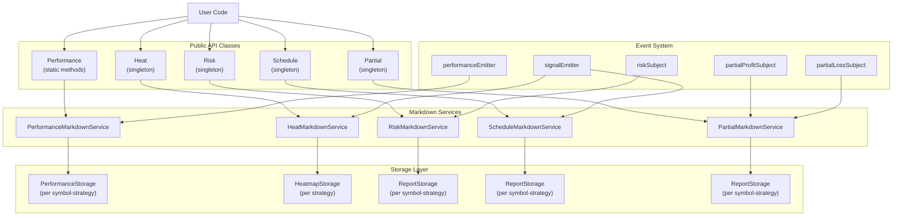

# Reporting Classes API

This page documents the specialized reporting classes that provide access to trading statistics and analysis reports. These classes are wrappers around markdown services and offer three primary methods: `getData()`, `getReport()`, and `dump()`.

For execution control classes like `Backtest`, `Live`, and `Walker`, see [Execution Classes API](./56_api-reference.md). For the complete list of global configuration functions, see [Global Functions](./56_api-reference.md).

## Overview

The framework provides five reporting classes for analyzing different aspects of trading activity:

| Class | Purpose | Data Source |
|-------|---------|-------------|
| `Performance` | Execution timing and bottleneck analysis | `PerformanceMarkdownService` |
| `Heat` | Portfolio-wide symbol aggregation (heatmap) | `HeatMarkdownService` |
| `Risk` | Risk rejection tracking | `RiskMarkdownService` |
| `Schedule` | Scheduled signal monitoring | `ScheduleMarkdownService` |
| `Partial` | Partial profit/loss milestone tracking | `PartialMarkdownService` |

Each class is a singleton utility that delegates to its corresponding markdown service, which automatically accumulates events via event emitter subscriptions.

**Sources:** [src/classes/Performance.ts:1-159](), [src/classes/Heat.ts:1-148](), [src/classes/Risk.ts:1-202](), [src/classes/Schedule.ts:1-149](), [src/classes/Partial.ts:1-186]()

## Common API Pattern

All reporting classes follow the same three-method API pattern:

```typescript
// Get statistical data object
const stats = await ReportingClass.getData(...args);

// Generate markdown report string
const markdown = await ReportingClass.getReport(...args, columns?);

// Save report to file system
await ReportingClass.dump(...args, path?, columns?);
```

Each method performs strategy validation before delegating to its markdown service. The `columns` parameter allows customization of report table structure.

**Sources:** [src/classes/Performance.ts:70-155](), [src/classes/Heat.ts:57-139]()

## Class Hierarchy and Data Flow



**Sources:** [src/classes/Performance.ts:40-156](), [src/lib/services/markdown/PerformanceMarkdownService.ts:312-459](), [src/lib/services/markdown/HeatMarkdownService.ts:434-587]()

## Performance Class

The `Performance` class provides static methods for analyzing execution timing metrics and identifying bottlenecks.

### Methods

#### `Performance.getData(symbol, strategyName): Promise<PerformanceStatisticsModel>`

Returns aggregated performance statistics grouped by metric type. Each metric includes:
- Count, total duration, average, min, max
- Standard deviation for volatility analysis
- Percentiles (median, P95, P99) for outlier detection
- Wait time statistics (time between consecutive events)

**Parameters:**
- `symbol: string` - Trading pair symbol
- `strategyName: string` - Strategy name

**Returns:** `PerformanceStatisticsModel` containing:
- `strategyName: string`
- `totalEvents: number`
- `totalDuration: number`
- `metricStats: Record<PerformanceMetricType, MetricStats>`
- `events: PerformanceContract[]`

**Sources:** [src/classes/Performance.ts:70-83]()

#### `Performance.getReport(symbol, strategyName, columns?): Promise<string>`

Generates markdown report with:
- Time distribution across operation types (percentage breakdown)
- Detailed metrics table sorted by total duration (bottlenecks first)
- Percentile analysis with P95/P99 values

**Parameters:**
- `symbol: string`
- `strategyName: string`
- `columns?: Columns[]` - Optional custom column configuration

**Returns:** Markdown formatted report string

**Sources:** [src/classes/Performance.ts:108-118]()

#### `Performance.dump(symbol, strategyName, path?, columns?): Promise<void>`

Saves performance report to disk. Default path: `./dump/performance/{strategyName}.md`

**Parameters:**
- `symbol: string`
- `strategyName: string`
- `path?: string` - Custom directory path
- `columns?: Columns[]` - Optional custom column configuration

**Sources:** [src/classes/Performance.ts:140-155]()

### Data Collection

Performance metrics are collected via `performanceEmitter` which broadcasts `PerformanceContract` events containing:
- `metricType: PerformanceMetricType` - Operation identifier
- `duration: number` - Execution time in milliseconds
- `timestamp: number` - Event timestamp
- `previousTimestamp: number | null` - Previous event timestamp for wait time calculation

Maximum 10,000 events stored per symbol-strategy pair.

**Sources:** [src/lib/services/markdown/PerformanceMarkdownService.ts:74-97](), [src/lib/services/markdown/PerformanceMarkdownService.ts:331-340]()

## Heat Class

The `Heat` class provides portfolio-wide symbol aggregation, generating heatmaps that show performance across all symbols for a given strategy.

### Methods

#### `Heat.getData(strategyName): Promise<HeatmapStatisticsModel>`

Returns per-symbol statistics and portfolio-wide aggregates:
- Per-symbol: Total PNL, Sharpe Ratio, Max Drawdown, trades, win rate, profit factor, etc.
- Portfolio: Total PNL, weighted Sharpe Ratio, total trades across all symbols

Symbols are sorted by Sharpe Ratio (best performers first).

**Parameters:**
- `strategyName: string` - Strategy name

**Returns:** `HeatmapStatisticsModel` containing:
- `symbols: IHeatmapRow[]` - Per-symbol statistics
- `totalSymbols: number`
- `portfolioTotalPnl: number | null`
- `portfolioSharpeRatio: number | null`
- `portfolioTotalTrades: number`

**Sources:** [src/classes/Heat.ts:57-69](), [src/lib/services/markdown/HeatMarkdownService.ts:278-330]()

#### `Heat.getReport(strategyName, columns?): Promise<string>`

Generates markdown heatmap table with portfolio summary header.

**Parameters:**
- `strategyName: string`
- `columns?: Columns[]` - Optional custom column configuration

**Returns:** Markdown formatted heatmap report

**Sources:** [src/classes/Heat.ts:97-109]()

#### `Heat.dump(strategyName, path?, columns?): Promise<void>`

Saves heatmap report to disk. Default path: `./dump/heatmap/{strategyName}.md`

**Parameters:**
- `strategyName: string`
- `path?: string` - Custom directory path
- `columns?: Columns[]` - Optional custom column configuration

**Sources:** [src/classes/Heat.ts:130-139]()

### Data Collection

Heat data is collected via `signalEmitter` which broadcasts all closed signals. The service automatically groups signals by symbol and calculates comprehensive statistics per symbol including Sharpe Ratio, Max Drawdown, Profit Factor, Win/Loss Streaks, and Expectancy.

Maximum 250 signals stored per symbol.

**Sources:** [src/lib/services/markdown/HeatMarkdownService.ts:455-466](), [src/lib/services/markdown/HeatMarkdownService.ts:82-105]()

## Risk Class

The `Risk` class provides access to risk rejection event tracking and includes the `MergeRisk` composite implementation.

### RiskUtils Methods

#### `Risk.getData(symbol, strategyName): Promise<RiskStatisticsModel>`

Returns risk rejection statistics with aggregations by symbol and by strategy.

**Parameters:**
- `symbol: string` - Trading pair symbol
- `strategyName: string` - Strategy name

**Returns:** `RiskStatisticsModel` containing:
- `eventList: RiskEvent[]` - All rejection events
- `totalRejections: number`
- `bySymbol: Record<string, number>` - Rejection count per symbol
- `byStrategy: Record<string, number>` - Rejection count per strategy

**Sources:** [src/classes/Risk.ts:156-171](), [src/lib/services/markdown/RiskMarkdownService.ts:75-99]()

#### `Risk.getReport(symbol, strategyName, columns?): Promise<string>`

Generates markdown report with rejection event table and summary statistics broken down by symbol and strategy.

**Parameters:**
- `symbol: string`
- `strategyName: string`
- `columns?: Columns[]` - Optional custom column configuration

**Returns:** Markdown formatted report string

**Sources:** [src/classes/Risk.ts:185-197]()

#### `Risk.dump(symbol, strategyName, path?, columns?): Promise<void>`

Saves risk rejection report to disk. Default filename: `{symbol}_{strategyName}.md`

**Parameters:**
- `symbol: string`
- `strategyName: string`
- `path?: string` - Custom directory path (default: `./dump/risk`)
- `columns?: Columns[]` - Optional custom column configuration

**Sources:** [src/classes/Risk.ts:211-223]()

### MergeRisk Class

The `MergeRisk` class implements the Composite pattern to combine multiple risk profiles. Used internally when a strategy specifies both `riskName` and `riskList`.

#### Constructor

```typescript
new MergeRisk(riskList: IRisk[])
```

Creates a merged risk profile from multiple `IRisk` instances.

**Sources:** [src/classes/Risk.ts:42-48]()

#### `checkSignal(params): Promise<boolean>`

Returns `true` only if ALL child risk profiles approve the signal (logical AND). Executes all checks in parallel.

**Parameters:**
- `params: IRiskCheckArgs` - Contains symbol, strategyName, position, exchangeName

**Returns:** `true` if all risks pass, `false` if any risk rejects

**Sources:** [src/classes/Risk.ts:59-67]()

#### `addSignal(symbol, context): Promise<void>`

Propagates signal registration to all child risk profiles in parallel.

**Sources:** [src/classes/Risk.ts:79-90]()

#### `removeSignal(symbol, context): Promise<void>`

Propagates signal removal to all child risk profiles in parallel.

**Sources:** [src/classes/Risk.ts:102-116]()

### Data Collection

Risk rejection events are collected via `riskSubject` which emits `RiskEvent` objects containing:
- `timestamp: number`
- `symbol: string`
- `strategyName: string`
- `position: PositionEnum`
- `exchangeName: string`
- `currentPrice: number`
- `activePositionCount: number`
- `comment: string` - Rejection reason

Maximum 250 events stored per symbol-strategy pair.

**Sources:** [src/lib/services/markdown/RiskMarkdownService.ts:52-68](), [src/lib/services/markdown/RiskMarkdownService.ts:233-240]()

## Schedule Class

The `Schedule` class tracks scheduled signals, their activation status, and cancellation metrics.

### Methods

#### `Schedule.getData(symbol, strategyName): Promise<ScheduleStatisticsModel>`

Returns scheduled signal statistics including cancellation rate and average wait times.

**Parameters:**
- `symbol: string` - Trading pair symbol
- `strategyName: string` - Strategy name

**Returns:** `ScheduleStatisticsModel` containing:
- `eventList: ScheduledEvent[]`
- `totalEvents: number`
- `totalScheduled: number`
- `totalOpened: number`
- `totalCancelled: number`
- `cancellationRate: number | null` - Percentage
- `activationRate: number | null` - Percentage
- `avgWaitTime: number | null` - Minutes until cancellation
- `avgActivationTime: number | null` - Minutes until activation

**Sources:** [src/classes/Schedule.ts:48-63](), [src/lib/services/markdown/ScheduleMarkdownService.ts:156-218]()

#### `Schedule.getReport(symbol, strategyName, columns?): Promise<string>`

Generates markdown report with scheduled event table and summary statistics showing cancellation/activation rates and timing metrics.

**Parameters:**
- `symbol: string`
- `strategyName: string`
- `columns?: Columns[]` - Optional custom column configuration

**Returns:** Markdown formatted report string

**Sources:** [src/classes/Schedule.ts:79-94]()

#### `Schedule.dump(symbol, strategyName, path?, columns?): Promise<void>`

Saves schedule report to disk. Default path: `./dump/schedule/{strategyName}.md`

**Parameters:**
- `symbol: string`
- `strategyName: string`
- `path?: string` - Custom directory path
- `columns?: Columns[]` - Optional custom column configuration

**Sources:** [src/classes/Schedule.ts:113-134]()

### Data Collection

Schedule data is collected via `signalEmitter` which broadcasts all signal events. The service tracks three event types:
1. **Scheduled** - Signal created but `priceOpen` not yet reached
2. **Opened** - Scheduled signal activated (only if `scheduledAt !== pendingAt`)
3. **Cancelled** - Scheduled signal cancelled before activation

Maximum 250 events stored per symbol-strategy pair.

**Sources:** [src/lib/services/markdown/ScheduleMarkdownService.ts:351-369](), [src/lib/services/markdown/ScheduleMarkdownService.ts:52-149]()

## Partial Class

The `Partial` class tracks partial profit/loss milestone events as positions move through predefined levels (±10%, ±20%, ±30%, etc.).

### Methods

#### `Partial.getData(symbol, strategyName): Promise<PartialStatisticsModel>`

Returns partial profit/loss event statistics.

**Parameters:**
- `symbol: string` - Trading pair symbol
- `strategyName: string` - Strategy name

**Returns:** `PartialStatisticsModel` containing:
- `eventList: PartialEvent[]`
- `totalEvents: number`
- `totalProfit: number` - Count of profit milestone events
- `totalLoss: number` - Count of loss milestone events

**Sources:** [src/classes/Partial.ts:68-80](), [src/lib/services/markdown/PartialMarkdownService.ts:135-154]()

#### `Partial.getReport(symbol, strategyName, columns?): Promise<string>`

Generates markdown report with partial event table showing:
- Action (PROFIT/LOSS)
- Symbol, Strategy, Signal ID, Position
- Level percentage (±10%, ±20%, etc.)
- Current price at milestone
- Timestamp and mode (Backtest/Live)

**Parameters:**
- `symbol: string`
- `strategyName: string`
- `columns?: Columns[]` - Optional custom column configuration

**Returns:** Markdown formatted report string

**Sources:** [src/classes/Partial.ts:121-133]()

#### `Partial.dump(symbol, strategyName, path?, columns?): Promise<void>`

Saves partial report to disk. Default filename: `{symbol}_{strategyName}.md`

**Parameters:**
- `symbol: string`
- `strategyName: string`
- `path?: string` - Custom directory path (default: `./dump/partial`)
- `columns?: Columns[]` - Optional custom column configuration

**Sources:** [src/classes/Partial.ts:148-159]()

### Data Collection

Partial data is collected via two subjects:
- `partialProfitSubject` - Emits when position reaches profit milestones (10%, 20%, 30%, etc.)
- `partialLossSubject` - Emits when position reaches loss milestones (-10%, -20%, -30%, etc.)

Each event contains:
- `timestamp: number`
- `action: "profit" | "loss"`
- `symbol: string`
- `strategyName: string`
- `signalId: string`
- `position: PositionEnum`
- `currentPrice: number`
- `level: PartialLevel` - Milestone percentage
- `backtest: boolean`

Maximum 250 events stored per symbol-strategy pair.

**Sources:** [src/lib/services/markdown/PartialMarkdownService.ts:284-338](), [src/lib/services/markdown/PartialMarkdownService.ts:60-128]()

## Column Configuration

All reporting classes support custom column configuration via the optional `columns` parameter in `getReport()` and `dump()` methods.

### ColumnModel Interface

```typescript
interface ColumnModel<T extends object = any> {
  key: string;              // Unique column identifier
  label: string;            // Display label for column header
  format: (data: T, index: number) => string | Promise<string>;
  isVisible: () => boolean | Promise<boolean>;
}
```

**Sources:** [src/model/Column.model.ts:26-38]()

### Column Type Aliases

Each markdown service defines a type alias for its column configuration:

| Service | Type Alias | Data Type |
|---------|------------|-----------|
| `BacktestMarkdownService` | `Columns` | `IStrategyTickResultClosed` |
| `LiveMarkdownService` | `Columns` | `TickEvent` |
| `WalkerMarkdownService` | `StrategyColumn` | `IStrategyResult` |
| `WalkerMarkdownService` | `PnlColumn` | `SignalData` |
| `PerformanceMarkdownService` | `Columns` | `MetricStats` |
| `HeatMarkdownService` | `Columns` | `IHeatmapRow` |
| `RiskMarkdownService` | `Columns` | `RiskEvent` |
| `ScheduleMarkdownService` | `Columns` | `ScheduledEvent` |
| `PartialMarkdownService` | `Columns` | `PartialEvent` |

**Sources:** [src/lib/services/markdown/BacktestMarkdownService.ts:48](), [src/lib/services/markdown/LiveMarkdownService.ts:50](), [src/lib/services/markdown/PerformanceMarkdownService.ts:47]()

### Default Column Configuration

Default columns are defined in `COLUMN_CONFIG` object:

```typescript
import { COLUMN_CONFIG } from "backtest-kit";

// Access default column configurations
const backtestColumns = COLUMN_CONFIG.backtest_columns;
const liveColumns = COLUMN_CONFIG.live_columns;
const performanceColumns = COLUMN_CONFIG.performance_columns;
const heatColumns = COLUMN_CONFIG.heat_columns;
const riskColumns = COLUMN_CONFIG.risk_columns;
const scheduleColumns = COLUMN_CONFIG.schedule_columns;
const partialColumns = COLUMN_CONFIG.partial_columns;
const walkerStrategyColumns = COLUMN_CONFIG.walker_strategy_columns;
const walkerPnlColumns = COLUMN_CONFIG.walker_pnl_columns;
```

**Sources:** [src/config/columns.ts]() (referenced in multiple markdown services)

### Custom Column Example

```typescript
import { Performance } from "backtest-kit";

// Define custom columns showing only metric type and average duration
const customColumns = [
  {
    key: "metric",
    label: "Operation",
    format: (stat) => stat.metricType,
    isVisible: () => true
  },
  {
    key: "avg",
    label: "Avg Time (ms)",
    format: (stat) => stat.avgDuration.toFixed(2),
    isVisible: () => true
  },
  {
    key: "p99",
    label: "P99 (ms)",
    format: (stat) => stat.p99.toFixed(2),
    isVisible: () => true
  }
];

// Use custom columns in report
const markdown = await Performance.getReport(
  "BTCUSDT",
  "my-strategy",
  customColumns
);
```

**Sources:** [test/spec/columns.test.mjs:69-112]()

## API Method Signature Patterns

All reporting classes follow consistent method signature patterns for easy memorization:

### Symbol-Strategy Scope

Classes that operate on symbol-strategy pairs (Performance, Risk, Schedule, Partial):

```typescript
// getData pattern
getData(symbol: string, strategyName: string): Promise<StatisticsModel>

// getReport pattern
getReport(
  symbol: string,
  strategyName: string,
  columns?: Columns[]
): Promise<string>

// dump pattern
dump(
  symbol: string,
  strategyName: string,
  path?: string,
  columns?: Columns[]
): Promise<void>
```

**Sources:** [src/classes/Performance.ts:70-155](), [src/classes/Risk.ts:156-223]()

### Strategy Scope

Classes that operate on strategy level only (Heat):

```typescript
// getData pattern
getData(strategyName: string): Promise<StatisticsModel>

// getReport pattern
getReport(
  strategyName: string,
  columns?: Columns[]
): Promise<string>

// dump pattern
dump(
  strategyName: string,
  path?: string,
  columns?: Columns[]
): Promise<void>
```

**Sources:** [src/classes/Heat.ts:57-139]()

## Statistics Models Reference

Each reporting class returns a specific statistics model from its `getData()` method:

### PerformanceStatisticsModel

```typescript
{
  strategyName: string;
  totalEvents: number;
  totalDuration: number;
  metricStats: Record<string, MetricStats>;
  events: PerformanceContract[];
}

// MetricStats structure
{
  metricType: PerformanceMetricType;
  count: number;
  totalDuration: number;
  avgDuration: number;
  minDuration: number;
  maxDuration: number;
  stdDev: number;
  median: number;
  p95: number;
  p99: number;
  avgWaitTime: number;
  minWaitTime: number;
  maxWaitTime: number;
}
```

**Sources:** [src/lib/services/markdown/PerformanceMarkdownService.ts:104-185]()

### HeatmapStatisticsModel

```typescript
{
  symbols: IHeatmapRow[];
  totalSymbols: number;
  portfolioTotalPnl: number | null;
  portfolioSharpeRatio: number | null;
  portfolioTotalTrades: number;
}

// IHeatmapRow structure
{
  symbol: string;
  totalPnl: number | null;
  sharpeRatio: number | null;
  maxDrawdown: number | null;
  totalTrades: number;
  winCount: number;
  lossCount: number;
  winRate: number | null;
  avgPnl: number | null;
  stdDev: number | null;
  profitFactor: number | null;
  avgWin: number | null;
  avgLoss: number | null;
  maxWinStreak: number;
  maxLossStreak: number;
  expectancy: number | null;
}
```

**Sources:** [src/lib/services/markdown/HeatMarkdownService.ts:278-330](), [src/lib/services/markdown/HeatMarkdownService.ts:108-271]()

### RiskStatisticsModel

```typescript
{
  eventList: RiskEvent[];
  totalRejections: number;
  bySymbol: Record<string, number>;
  byStrategy: Record<string, number>;
}

// RiskEvent structure
{
  timestamp: number;
  symbol: string;
  strategyName: string;
  position: PositionEnum;
  exchangeName: string;
  currentPrice: number;
  activePositionCount: number;
  comment: string;
}
```

**Sources:** [src/lib/services/markdown/RiskMarkdownService.ts:75-99]()

### ScheduleStatisticsModel

```typescript
{
  eventList: ScheduledEvent[];
  totalEvents: number;
  totalScheduled: number;
  totalOpened: number;
  totalCancelled: number;
  cancellationRate: number | null;
  activationRate: number | null;
  avgWaitTime: number | null;
  avgActivationTime: number | null;
}

// ScheduledEvent structure
{
  timestamp: number;
  action: "scheduled" | "opened" | "cancelled";
  symbol: string;
  signalId: string;
  position: PositionEnum;
  note: string;
  currentPrice: number;
  priceOpen: number;
  takeProfit: number;
  stopLoss: number;
  closeTimestamp?: number;
  duration?: number;
}
```

**Sources:** [src/lib/services/markdown/ScheduleMarkdownService.ts:156-218]()

### PartialStatisticsModel

```typescript
{
  eventList: PartialEvent[];
  totalEvents: number;
  totalProfit: number;
  totalLoss: number;
}

// PartialEvent structure
{
  timestamp: number;
  action: "profit" | "loss";
  symbol: string;
  strategyName: string;
  signalId: string;
  position: PositionEnum;
  currentPrice: number;
  level: PartialLevel;
  backtest: boolean;
}
```

**Sources:** [src/lib/services/markdown/PartialMarkdownService.ts:135-154]()

## Storage and Memory Management

All markdown services implement a consistent storage pattern with memory limits:

| Service | Storage Class | Max Events | Scope |
|---------|--------------|------------|-------|
| `PerformanceMarkdownService` | `PerformanceStorage` | 10,000 | Per symbol-strategy |
| `HeatMarkdownService` | `HeatmapStorage` | 250 per symbol | Per strategy |
| `RiskMarkdownService` | `ReportStorage` | 250 | Per symbol-strategy |
| `ScheduleMarkdownService` | `ReportStorage` | 250 | Per symbol-strategy |
| `PartialMarkdownService` | `ReportStorage` | 250 | Per symbol-strategy |

Storage instances are created and cached using `memoize` pattern from `functools-kit`. When the event limit is exceeded, the oldest events are removed (FIFO queue).

**Sources:** [src/lib/services/markdown/PerformanceMarkdownService.ts:75-97](), [src/lib/services/markdown/HeatMarkdownService.ts:76-105](), [src/lib/services/markdown/RiskMarkdownService.ts:46-68]()

## Complete Usage Example

```typescript
import {
  Performance,
  Heat,
  Risk,
  Schedule,
  Partial,
  Backtest,
  listenDoneBacktest
} from "backtest-kit";

// Run backtest
const cancel = Backtest.background("BTCUSDT", {
  strategyName: "my-strategy",
  exchangeName: "binance",
  frameName: "30d-backtest"
});

// Wait for completion
await new Promise(resolve => {
  const unsub = listenDoneBacktest((event) => {
    if (event.strategyName === "my-strategy") {
      unsub();
      resolve();
    }
  });
});

// Generate all reports
const perfStats = await Performance.getData("BTCUSDT", "my-strategy");
console.log(`Slowest operation: ${Object.values(perfStats.metricStats)
  .sort((a, b) => b.avgDuration - a.avgDuration)[0].metricType}`);

const heatStats = await Heat.getData("my-strategy");
console.log(`Portfolio PNL: ${heatStats.portfolioTotalPnl}%`);

const riskStats = await Risk.getData("BTCUSDT", "my-strategy");
console.log(`Total rejections: ${riskStats.totalRejections}`);

const schedStats = await Schedule.getData("BTCUSDT", "my-strategy");
console.log(`Cancellation rate: ${schedStats.cancellationRate}%`);

const partialStats = await Partial.getData("BTCUSDT", "my-strategy");
console.log(`Profit milestones: ${partialStats.totalProfit}`);

// Save all reports to disk
await Performance.dump("BTCUSDT", "my-strategy");
await Heat.dump("my-strategy");
await Risk.dump("BTCUSDT", "my-strategy");
await Schedule.dump("BTCUSDT", "my-strategy");
await Partial.dump("BTCUSDT", "my-strategy");
```

**Sources:** [src/classes/Performance.ts:18-38](), [src/classes/Heat.ts:18-31]()