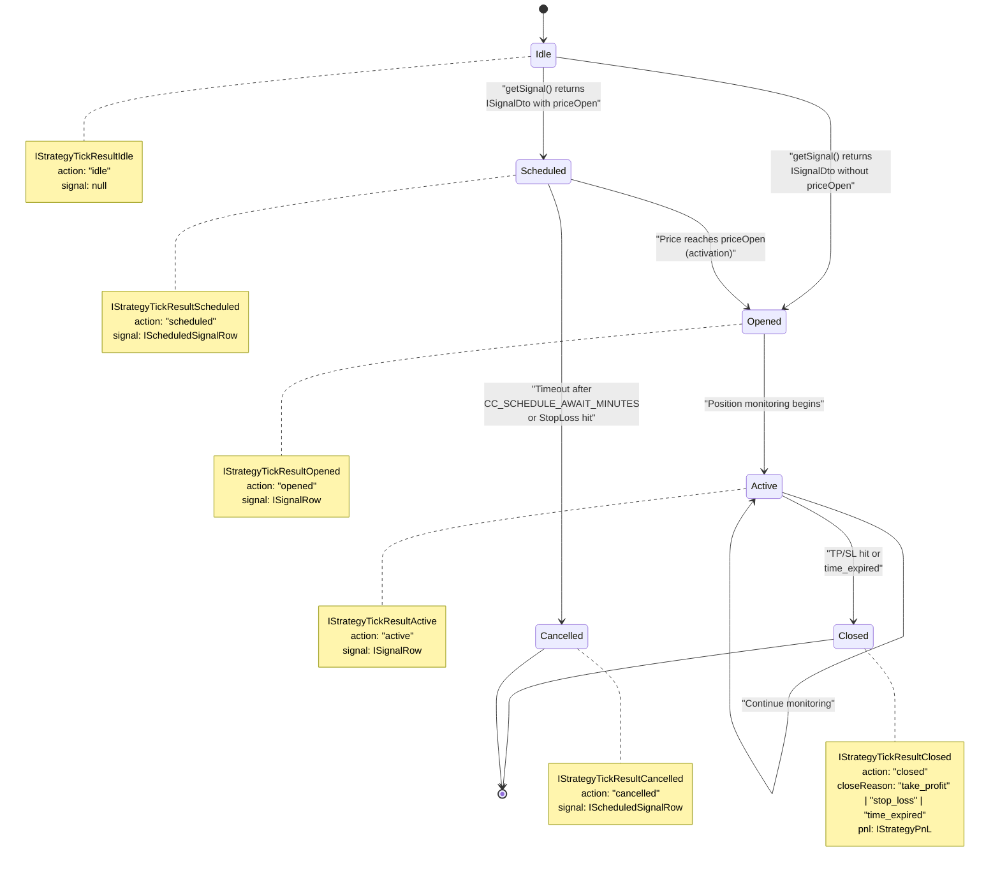
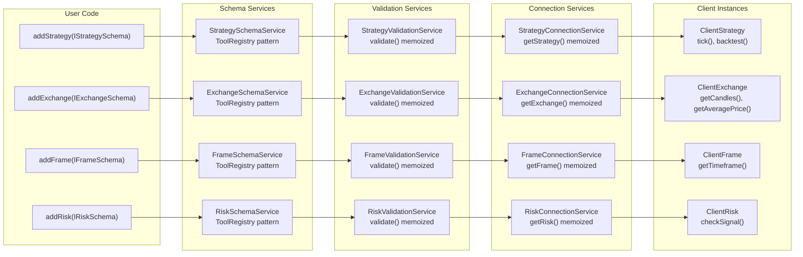
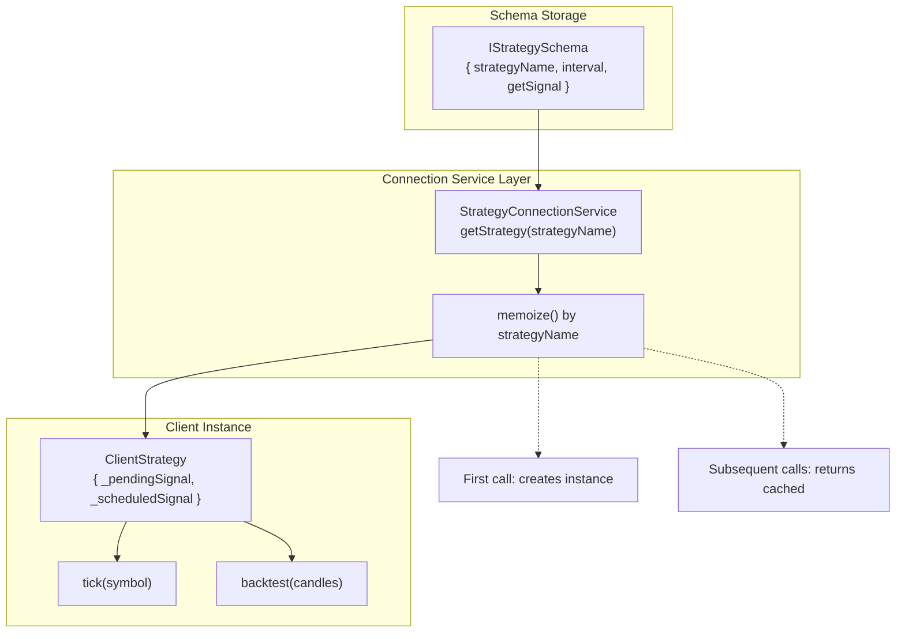
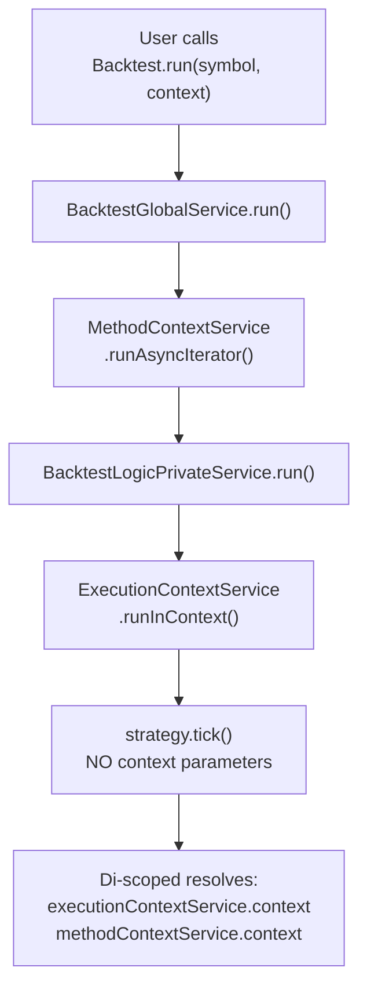

# Core Concepts

<details>
<summary>Relevant source files</summary>

The following files were used as context for generating this wiki page:

- [src/classes/Backtest.ts](src/classes/Backtest.ts)
- [src/classes/Live.ts](src/classes/Live.ts)
- [src/classes/Walker.ts](src/classes/Walker.ts)
- [src/client/ClientStrategy.ts](src/client/ClientStrategy.ts)
- [src/config/emitters.ts](src/config/emitters.ts)
- [src/function/event.ts](src/function/event.ts)
- [src/index.ts](src/index.ts)
- [src/interfaces/Strategy.interface.ts](src/interfaces/Strategy.interface.ts)
- [src/lib/services/connection/StrategyConnectionService.ts](src/lib/services/connection/StrategyConnectionService.ts)
- [test/index.mjs](test/index.mjs)
- [types.d.ts](types.d.ts)

</details>


This page introduces the fundamental architectural patterns and execution models of backtest-kit. It covers the three execution modes (Backtest, Live, Walker), the signal lifecycle state machine, and the component-based registration system. For detailed API documentation, see [Public API Reference](#4). For implementation details of specific components, see [Component Types](#5).

## Execution Modes

backtest-kit provides three execution modes that share the same strategy and exchange components but operate under different timing and data models:

### Mode Comparison

```mermaid
graph TB
    subgraph "Backtest Mode"
        B_Entry["Backtest.run()"]
        B_Time["Historical timestamps<br/>from Frame.getTimeframe()"]
        B_Loop["Finite iteration<br/>over timeframe array"]
        B_Fast["Fast-forward via<br/>strategy.backtest()"]
        B_Result["Yields closed signals"]
        
        B_Entry --> B_Time
        B_Time --> B_Loop
        B_Loop --> B_Fast
        B_Fast --> B_Result
    end
    
    subgraph "Live Mode"
        L_Entry["Live.run()"]
        L_Time["Real-time via<br/>Date.now()"]
        L_Loop["Infinite while loop"]
        L_Persist["Crash recovery via<br/>PersistSignalAdapter"]
        L_Result["Yields opened/closed"]
        
        L_Entry --> L_Time
        L_Time --> L_Loop
        L_Loop --> L_Persist
        L_Persist --> L_Result
        L_Result --> L_Loop
    end
    
    subgraph "Walker Mode"
        W_Entry["Walker.run()"]
        W_Schema["IWalkerSchema.strategies[]"]
        W_Loop["For each strategy"]
        W_Backtest["Backtest.run()<br/>per strategy"]
        W_Compare["Compare by metric<br/>(sharpeRatio, etc)"]
        W_Result["Yields best strategy"]
        
        W_Entry --> W_Schema
        W_Schema --> W_Loop
        W_Loop --> W_Backtest
        W_Backtest --> W_Compare
        W_Compare --> W_Result
    end
```



**Sources:** [src/classes/Backtest.ts:1-208](), [src/classes/Live.ts:1-220](), [src/classes/Walker.ts:1-274](), Diagram 3 from high-level architecture

| Mode | Time Progression | Data Source | Use Case | Completion |
|------|-----------------|-------------|----------|------------|
| **Backtest** | Historical timestamps from `IFrameSchema` | `Frame.getTimeframe()` array | Strategy validation on past data | Finite (when timeframe exhausted) |
| **Live** | Real-time via `Date.now()` | Live exchange API calls | Production trading | Infinite (until stopped) |
| **Walker** | Orchestrates multiple Backtests | Shared `IFrameSchema` across strategies | A/B testing and optimization | Finite (after all strategies tested) |

### Code Entry Points

The execution modes are accessed through singleton utility classes:

- **Backtest**: `Backtest.run(symbol, { strategyName, exchangeName, frameName })` - [src/classes/Backtest.ts:38-66]()
- **Live**: `Live.run(symbol, { strategyName, exchangeName })` - [src/classes/Live.ts:55-82]()
- **Walker**: `Walker.run(symbol, { walkerName })` - [src/classes/Walker.ts:39-87]()

Each mode implements a similar async generator pattern but with different orchestration logic. Backtest and Live both call `strategy.tick()` or `strategy.backtest()`, while Walker iterates through multiple strategies and compares their results by a configurable metric (`WalkerMetric`).

**Sources:** [src/classes/Backtest.ts:30-66](), [src/classes/Live.ts:44-82](), [src/classes/Walker.ts:31-87](), [types.d.ts:1014-1014]()

## Signal Lifecycle

Signals progress through a state machine implemented as a discriminated union of result types. The `action` field serves as the discriminator for type-safe state handling.

### State Machine Diagram



**Sources:** [src/interfaces/Strategy.interface.ts:159-296](), [src/client/ClientStrategy.ts:40-895](), Diagram 5 from high-level architecture

### Signal State Types

The framework uses TypeScript discriminated unions for type-safe signal state handling:

```typescript
type IStrategyTickResult = 
  | IStrategyTickResultIdle 
  | IStrategyTickResultScheduled
  | IStrategyTickResultOpened 
  | IStrategyTickResultActive 
  | IStrategyTickResultClosed
  | IStrategyTickResultCancelled;
```

Each state type has a unique `action` discriminator:

- **idle**: No active signal, strategy waiting for entry conditions - [src/interfaces/Strategy.interface.ts:162-175]()
- **scheduled**: Signal created with `priceOpen`, waiting for price to reach entry point - [src/interfaces/Strategy.interface.ts:181-194]()
- **opened**: Position just entered, initial signal creation - [src/interfaces/Strategy.interface.ts:200-213]()
- **active**: Position monitoring for TP/SL/time conditions - [src/interfaces/Strategy.interface.ts:219-232]()
- **closed**: Position exited with PNL calculation - [src/interfaces/Strategy.interface.ts:238-257]()
- **cancelled**: Scheduled signal never activated (timeout or pre-entry SL hit) - [src/interfaces/Strategy.interface.ts:263-278]()

### Key Lifecycle Timestamps

Signals track two critical timestamps for accurate duration calculation:

- **scheduledAt**: When signal was first created (either immediate or scheduled) - [src/interfaces/Strategy.interface.ts:54-54]()
- **pendingAt**: When position became active at `priceOpen` (updated on scheduled signal activation) - [src/interfaces/Strategy.interface.ts:56-56]()

The `minuteEstimatedTime` countdown uses `pendingAt`, not `scheduledAt`, ensuring scheduled signals don't count waiting time toward expiration - [src/client/ClientStrategy.ts:681-683]().

**Sources:** [src/interfaces/Strategy.interface.ts:284-295](), [src/client/ClientStrategy.ts:186-283](), [src/client/ClientStrategy.ts:681-683]()

## Component-Based Architecture

backtest-kit uses a registration-based architecture where components are defined as schemas and instantiated on-demand via dependency injection.

### Component Registration Flow



**Sources:** [src/index.ts:1-131](), [src/lib/services/connection/StrategyConnectionService.ts:76-94](), Diagram 2 from high-level architecture

### Component Types

The framework provides six registrable component types, each with a dedicated schema interface:

| Component | Schema Interface | Purpose | Registration Function |
|-----------|-----------------|---------|----------------------|
| **Strategy** | `IStrategySchema` | Signal generation logic via `getSignal()` | `addStrategy()` |
| **Exchange** | `IExchangeSchema` | Market data via `getCandles()`, price formatting | `addExchange()` |
| **Frame** | `IFrameSchema` | Backtest timeframe generation via `getTimeframe()` | `addFrame()` |
| **Risk** | `IRiskSchema` | Portfolio-level position limits and validations | `addRisk()` |
| **Sizing** | `ISizingSchema` | Position size calculation (fixed, Kelly, ATR) | `addSizing()` |
| **Walker** | `IWalkerSchema` | Multi-strategy comparison configuration | `addWalker()` |

Each schema is stored in a corresponding `*SchemaService` using the ToolRegistry pattern - [src/lib/services/schema/StrategySchemaService.ts](), [src/lib/services/schema/ExchangeSchemaService.ts](), etc.

### Schema to Client Instance Mapping

The framework uses memoized Connection Services to lazily instantiate Client classes:



**Sources:** [src/lib/services/connection/StrategyConnectionService.ts:76-94](), [src/client/ClientStrategy.ts:1-1092]()

This two-tier architecture (Schema Services + Connection Services) enables:

1. **Validation at registration time**: Schema structure is validated immediately via `*ValidationService.validate()` - [src/lib/services/validation/StrategyValidationService.ts]()
2. **Lazy instantiation**: Client instances are only created when first used, reducing memory overhead
3. **Instance reuse**: Memoization ensures one Client per schema name, preventing state duplication
4. **Crash recovery**: Live mode can restore persisted state via `waitForInit()` before first operation - [src/client/ClientStrategy.ts:298-330]()

**Sources:** [src/function/add.ts](), [src/lib/services/schema/StrategySchemaService.ts](), [src/lib/services/connection/StrategyConnectionService.ts:52-94](), [src/lib/services/validation/StrategyValidationService.ts]()

## Context Propagation

The framework uses `di-scoped` to propagate execution context without explicit parameter passing. Two context types flow through the system:

### Context Types

**ExecutionContext** (`IExecutionContext`):
- `symbol`: Trading pair (e.g., "BTCUSDT")
- `when`: Current timestamp (historical for backtest, `Date.now()` for live)
- `backtest`: Boolean flag indicating execution mode

**MethodContext** (`IMethodContext`):
- `strategyName`: Which strategy schema to use
- `exchangeName`: Which exchange schema to use
- `frameName`: Which frame schema to use (empty string for live mode)

**Sources:** [types.d.ts:100-138](), [types.d.ts:363-403]()

### Context Flow Example



**Sources:** [src/lib/services/context/ExecutionContextService.ts](), [src/lib/services/context/MethodContextService.ts](), Diagram 6 from high-level architecture

This pattern enables clean strategy code without framework boilerplate:

```typescript
// Strategy author writes:
const candles = await getCandles(symbol, interval, limit);

// Framework automatically injects:
// - executionContext.when (which timestamp to query)
// - methodContext.exchangeName (which exchange to use)
// - executionContext.backtest (historical vs real-time data)
```

For detailed context propagation mechanics, see [Context Propagation](#3.3).

**Sources:** [src/lib/services/context/ExecutionContextService.ts:1-50](), [src/lib/services/context/MethodContextService.ts:1-50](), [src/function/exchange.ts]()