# Crash Recovery

<details>
<summary>Relevant source files</summary>

The following files were used as context for generating this wiki page:

- [src/classes/Backtest.ts](src/classes/Backtest.ts)
- [src/classes/Live.ts](src/classes/Live.ts)
- [src/classes/Persist.ts](src/classes/Persist.ts)
- [src/classes/Walker.ts](src/classes/Walker.ts)
- [src/client/ClientPartial.ts](src/client/ClientPartial.ts)
- [src/contract/PartialLoss.contract.ts](src/contract/PartialLoss.contract.ts)
- [src/contract/PartialProfit.contract.ts](src/contract/PartialProfit.contract.ts)
- [src/interfaces/Partial.interface.ts](src/interfaces/Partial.interface.ts)
- [src/lib/services/connection/PartialConnectionService.ts](src/lib/services/connection/PartialConnectionService.ts)
- [src/lib/services/connection/StrategyConnectionService.ts](src/lib/services/connection/StrategyConnectionService.ts)
- [src/lib/services/global/PartialGlobalService.ts](src/lib/services/global/PartialGlobalService.ts)

</details>


## Purpose and Scope

This page explains the crash recovery system for Live Trading mode, which ensures that active trading positions survive process crashes and restarts. When a live trading bot crashes, all in-memory state is lost. Without crash recovery, open positions would be abandoned with no monitoring of take profit (TP) or stop loss (SL) conditions, leading to uncontrolled risk exposure and potential financial losses.

The crash recovery system persists signal state to disk and restores it on restart, preserving critical timing information (`pendingAt`, `scheduledAt`) to maintain correct signal lifetime calculations. For information about the overall Live Trading execution flow, see [Live Execution Flow](#10.1). For details on how restored signals are monitored, see [Real-time Monitoring](#10.3).

**Key Point**: Crash recovery is only active in **Live mode**. Backtest mode operates entirely in-memory with no persistence, as documented in [Backtest Execution Flow](#9.1).

---

## Why Crash Recovery Matters

Without crash recovery, a process crash during live trading causes:

| Problem | Impact | Financial Risk |
|---------|--------|----------------|
| **Lost Active Signals** | Open positions become unmonitored | No TP/SL enforcement, unlimited loss potential |
| **Blocked Risk Limits** | Risk counters never decremented | Cannot open new positions, strategy deadlock |
| **Fee Accumulation** | Entry fees paid, but no exit trade | Guaranteed loss from fees alone |
| **Timing Reset** | Signal lifetime recalculated from restart | Premature closure, wasted entry fees |

The crash recovery system prevents all these issues by:

1. **Persisting signal state atomically** before acknowledging position opens
2. **Restoring signals on restart** with original timing information intact
3. **Validating restored signals** to prevent stale data from wrong exchange/strategy
4. **Triggering lifecycle callbacks** to notify monitoring systems of restoration

**Sources**: [src/client/ClientStrategy.ts:491-552]()

---

## Persistence Architecture

The crash recovery system uses two specialized persistence adapters:


### Persistence Timing

| Event | Pending Signal Persistence | Scheduled Signal Persistence |
|-------|---------------------------|------------------------------|
| **Signal Creation** | No write (not yet opened) | Write immediately (`setScheduledSignal`) |
| **Signal Open** | Write immediately (`setPendingSignal`) | Delete schedule file, write pending file |
| **Signal Active** | No action (already persisted) | N/A |
| **Signal Close** | Delete file (`setPendingSignal(null)`) | N/A (already converted to pending) |
| **Signal Cancel** | N/A | Delete file (`setScheduledSignal(null)`) |

**Sources**: [src/client/ClientStrategy.ts:681-774](), [src/client/ClientStrategy.ts:803-846](), [src/client/ClientStrategy.ts:848-899](), [src/client/ClientStrategy.ts:962-1023]()

---

## Signal Restoration Process

When `ClientStrategy` initializes in Live mode, the `waitForInit()` function restores persisted signals before processing any ticks:


### Code Entity Mapping: Restoration Functions

| Function | Location | Purpose |
|----------|----------|---------|
| `WAIT_FOR_INIT_FN` | [src/client/ClientStrategy.ts:491-552]() | Main restoration logic, checks backtest mode |
| `PersistSignalAdapter.readSignalData` | [src/client/ClientStrategy.ts:497-509]() | Reads pending signal from disk |
| `PersistScheduleAdapter.readScheduleData` | [src/client/ClientStrategy.ts:525-537]() | Reads scheduled signal from disk |
| `callbacks.onActive` | [src/client/ClientStrategy.ts:512-522]() | Notifies monitoring of restored active position |
| `callbacks.onSchedule` | [src/client/ClientStrategy.ts:540-550]() | Notifies monitoring of restored scheduled signal |
| `strategy.waitForInit()` | [src/lib/services/connection/StrategyConnectionService.ts:154]() | Called before first tick |

### Validation Rules

The restoration process includes critical validation to prevent stale signal data:

```typescript
// Validation checks from ClientStrategy.ts:503-508
if (pendingSignal.exchangeName !== self.params.method.context.exchangeName) {
  return; // Discard signal - different exchange
}
if (pendingSignal.strategyName !== self.params.method.context.strategyName) {
  return; // Discard signal - different strategy
}
```

**Why this matters**: If you switch strategies or exchanges, old persisted signals must not be restored. The `exchangeName` and `strategyName` fields in persisted data act as ownership markers.

**Sources**: [src/client/ClientStrategy.ts:491-552](), [src/lib/services/connection/StrategyConnectionService.ts:148-166]()

---

## Timing Preservation: The Critical `pendingAt` Field

The most important aspect of crash recovery is preserving timing information. Every `ISignalRow` has two timestamps:

| Timestamp | When Set | Used For |
|-----------|----------|----------|
| `scheduledAt` | Signal first created | Tracking total signal lifecycle, scheduled timeout |
| `pendingAt` | Position activated at `priceOpen` | **Signal lifetime calculation (`minuteEstimatedTime`)** |

### The Bug That Crash Recovery Prevents

Without crash recovery, this timing bug occurs:


### Code: How Timing Is Preserved

**During Signal Activation** ([src/client/ClientStrategy.ts:681-774]()):
```typescript
// Line 734: Update pendingAt when scheduled signal activates
const activatedSignal: ISignalRow = {
  ...scheduled,
  pendingAt: activationTime, // NEW timestamp when position opens
  _isScheduled: false,
};

await self.setPendingSignal(activatedSignal); // PERSIST with correct pendingAt
```

**During Time Expiration Check** ([src/client/ClientStrategy.ts:901-920]()):
```typescript
// Line 907: CRITICAL - uses pendingAt, NOT scheduledAt
const signalTime = signal.pendingAt; // Start counting from activation time
const maxTimeToWait = signal.minuteEstimatedTime * 60 * 1000;
const elapsedTime = currentTime - signalTime;

if (elapsedTime >= maxTimeToWait) {
  // Close signal by time_expired
}
```

**During Restoration** ([src/client/ClientStrategy.ts:497-509]()):
```typescript
// Line 498: Read persisted signal with ORIGINAL pendingAt intact
const pendingSignal = await PersistSignalAdapter.readSignalData(
  self.params.execution.context.symbol,
  self.params.strategyName,
);
// pendingSignal.pendingAt is PRESERVED from before crash
```

**Test Validation** ([test/e2e/timing.test.mjs:416-505]()):
```typescript
// Line 424: Create signal that was activated 12 hours ago
const twelveHoursAgo = now - 12 * 60 * 60 * 1000;

// Line 442: Persist with pendingAt = twelveHoursAgo
pendingAt: twelveHoursAgo, // Activated 12 hours ago

// Line 478: After restoration, verify remaining time is correct
const remainingTime = expectedTime - elapsedTime;
// Should be ~12 hours remaining (not restarting from 24h)
```

**Sources**: [src/client/ClientStrategy.ts:681-774](), [src/client/ClientStrategy.ts:901-920](), [test/e2e/timing.test.mjs:416-505]()

---

## Backtest vs Live Behavior

Crash recovery is **disabled in Backtest mode** to maximize performance:


### Code Entity Mapping: Backtest Early Return

| Code Path | Location | Behavior |
|-----------|----------|----------|
| `waitForInit()` backtest check | [src/client/ClientStrategy.ts:493-495]() | `if (backtest) return;` |
| `setPendingSignal()` no-op | Referenced in `ClientStrategy` | Skips file write when `backtest=true` |
| Backtest signal handling | [Backtest Execution Flow](#9.1) | All signals processed in-memory |

**Why backtest skips persistence**:
- Backtests iterate through thousands of candles rapidly
- Historical data is deterministic (no crashes in historical replay)
- File I/O would slow down backtests by 100x+
- Results are reproducible without state persistence

**Sources**: [src/client/ClientStrategy.ts:491-495]()

---

## Atomic Write Guarantees

The persistence layer uses atomic file writes to prevent partial/corrupted data:

```mermaid
graph LR
    subgraph "Atomic Write Process"
        DATA["Signal Data<br/>JSON object"]
        TEMP["Write to temp file<br/>signal_BTCUSDT_temp.json"]
        RENAME["Atomic rename<br/>temp → signal_BTCUSDT.json"]
        FINAL["Final file<br/>signal_BTCUSDT.json"]
    end
    
    subgraph "Crash Safety"
        C1["Crash before rename:<br/>Old file intact"]
        C2["Crash after rename:<br/>New file complete"]
        C3["Never: Partial data"]
    end
    
    DATA --> TEMP
    TEMP --> RENAME
    RENAME --> FINAL
    
    TEMP -.->|"Crash"| C1
    FINAL -.->|"Crash"| C2
    RENAME -.->|"Never"| C3
    
    style C3 fill:#ffcccc
```



The atomic write pattern ensures:
- **No partial writes**: Either full new data or old data, never corrupted
- **No race conditions**: File rename is atomic at OS level
- **Safe concurrent reads**: Readers always see complete JSON

**Persistence Base Class**: `PersistBase` provides the atomic write implementation (referenced in [Persistence Layer](#15.3)).

**Sources**: [src/classes/Persist:28]() (referenced in ClientStrategy.ts)

---

## Testing Crash Recovery

The test suite validates crash recovery behavior using custom persistence adapters:

### Test: Restored Pending Signal Timing

```typescript
// test/e2e/timing.test.mjs:416-505
test("Restored pending signal preserves 24h timing from pendingAt", async ({ pass, fail }) => {
  const now = Date.now();
  const twelveHoursAgo = now - 12 * 60 * 60 * 1000;
  
  // Inject custom adapter that returns a pre-existing signal
  PersistSignalAdapter.usePersistSignalAdapter(class {
    async readValue() {
      return {
        id: "restored-signal",
        position: "long",
        minuteEstimatedTime: 1440, // 24 hours total
        pendingAt: twelveHoursAgo, // Activated 12 hours ago
        // ... other fields
      };
    }
  });
  
  // Start live trading - signal should restore with 12h remaining
  await Live.background("BTCUSDT", {
    strategyName: "test-strategy",
    exchangeName: "test-exchange",
  });
  
  // Verify: remaining time should be ~12h, not reset to 24h
});
```

### Test Coverage

| Test Case | File | Line Range | Validates |
|-----------|------|------------|-----------|
| Pending signal restoration | [test/e2e/timing.test.mjs]() | 416-505 | `pendingAt` preservation, 12h remaining |
| Scheduled signal restoration | [test/spec/scheduled.test.mjs]() | 211-362 | Scheduled signal lifecycle tracking |
| Timing calculations | [test/e2e/timing.test.mjs]() | 34-201 | `minuteEstimatedTime` from `pendingAt` |

**Sources**: [test/e2e/timing.test.mjs:416-505](), [test/spec/scheduled.test.mjs:211-362]()

---

## Configuration Parameters

Crash recovery behavior is controlled by global configuration:

| Parameter | Default | Purpose |
|-----------|---------|---------|
| `CC_SCHEDULE_AWAIT_MINUTES` | 120 | Max time scheduled signal waits for activation before cancellation |
| `CC_MAX_SIGNAL_LIFETIME_MINUTES` | 10080 (7 days) | Max `minuteEstimatedTime` to prevent eternal signals |
| `TICK_TTL` | 60000ms | Interval between tick processing (affects restore frequency) |

**Related**: See [Timing Parameters](#14.3) for detailed configuration reference.

**Sources**: [src/config/params.ts]() (referenced in ClientStrategy.ts)

---

## Summary

The crash recovery system is a critical safety mechanism for live trading:

1. **Persists signals atomically** when positions open ([src/client/ClientStrategy.ts:740]())
2. **Restores signals on startup** with validation ([src/client/ClientStrategy.ts:497-537]())
3. **Preserves timing information** to prevent premature closure ([src/client/ClientStrategy.ts:734-738]())
4. **Triggers lifecycle callbacks** for monitoring integration ([src/client/ClientStrategy.ts:512-522]())
5. **Disabled in backtest mode** for performance ([src/client/ClientStrategy.ts:493-495]())

Without crash recovery, process crashes would abandon open positions, leading to uncontrolled risk exposure and guaranteed losses from entry fees. The system ensures that live trading operations are resilient to infrastructure failures while maintaining correct position lifetime calculations.

**Sources**: [src/client/ClientStrategy.ts:491-552](), [src/client/ClientStrategy.ts:681-774](), [src/client/ClientStrategy.ts:901-920](), [test/e2e/timing.test.mjs:416-505]()