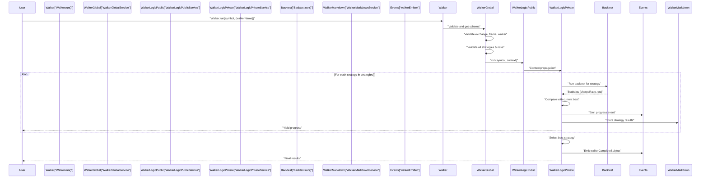
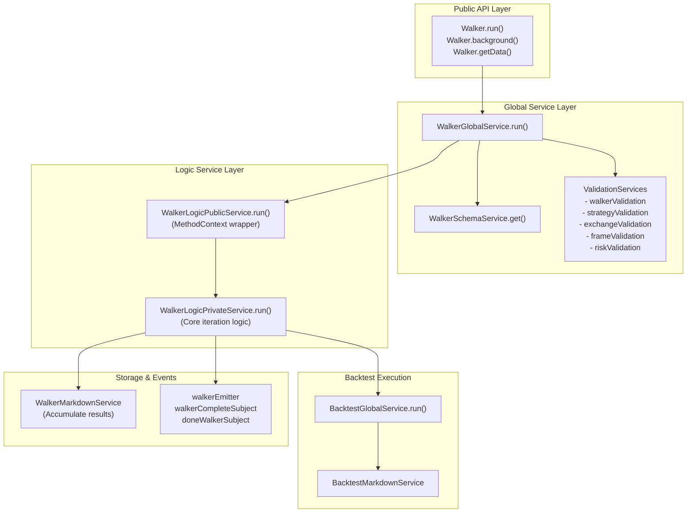
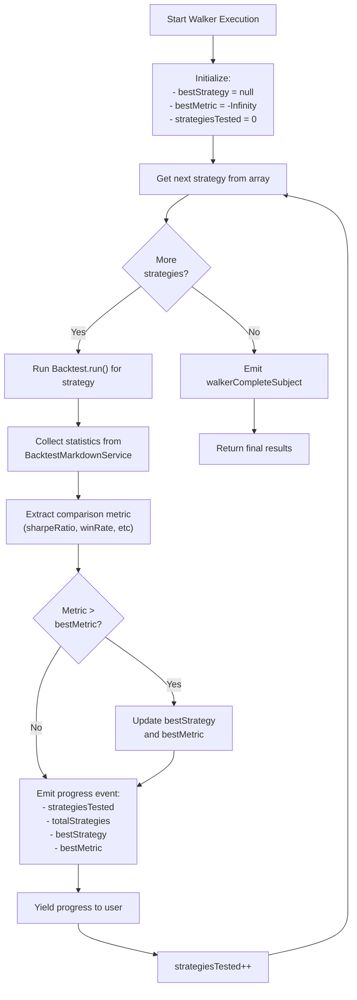
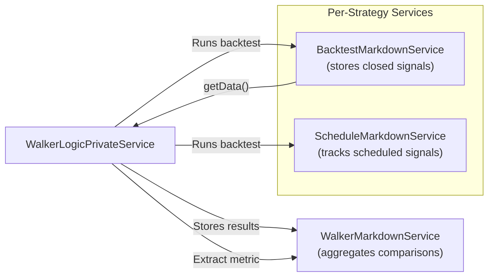

# Walker Execution Flow

<details>
<summary>Relevant source files</summary>

The following files were used as context for generating this wiki page:

- [README.md](README.md)
- [src/classes/Backtest.ts](src/classes/Backtest.ts)
- [src/classes/Live.ts](src/classes/Live.ts)
- [src/classes/Schedule.ts](src/classes/Schedule.ts)
- [src/classes/Walker.ts](src/classes/Walker.ts)
- [src/config/emitters.ts](src/config/emitters.ts)
- [src/function/event.ts](src/function/event.ts)
- [src/lib/services/global/WalkerGlobalService.ts](src/lib/services/global/WalkerGlobalService.ts)
- [src/lib/services/markdown/BacktestMarkdownService.ts](src/lib/services/markdown/BacktestMarkdownService.ts)
- [src/lib/services/markdown/LiveMarkdownService.ts](src/lib/services/markdown/LiveMarkdownService.ts)
- [src/lib/services/markdown/ScheduleMarkdownService.ts](src/lib/services/markdown/ScheduleMarkdownService.ts)
- [test/spec/scheduled.test.mjs](test/spec/scheduled.test.mjs)

</details>


## Purpose and Scope

This page documents the execution flow of Walker mode, which orchestrates multiple backtest runs to compare strategies and select the best performer. Walker iterates through a list of strategies, runs each through the same backtest configuration, collects performance metrics, and ranks results.

For information about individual backtest execution, see [Backtest Execution Flow](#9.1). For details on how strategies are compared and metrics calculated, see [Strategy Comparison](#11.2). For report generation, see [Walker Reports](#11.3).

---

## Overview

Walker mode provides multi-strategy comparison by:

1. **Sequential Execution** - Running each strategy in the walker's strategy list through a full backtest
2. **Progressive Results** - Emitting progress events after each strategy completes
3. **Metric-Based Ranking** - Comparing strategies using a configured metric (Sharpe ratio, win rate, total PNL, etc.)
4. **Best Selection** - Identifying the optimal strategy based on the comparison metric

Walker execution is deterministic and reproducible since it uses the same frame (timeframe) and exchange for all strategies.

**Sources:** [README.md:403-459](), [src/classes/Walker.ts:1-273]()

---

## Walker Schema Structure

A walker is defined using `IWalkerSchema` which specifies:

| Field | Type | Description |
|-------|------|-------------|
| `walkerName` | `string` | Unique identifier for this walker |
| `exchangeName` | `string` | Exchange to use for all strategies |
| `frameName` | `string` | Timeframe to use for all backtests |
| `strategies` | `string[]` | Array of strategy names to compare |
| `metric` | `string` (optional) | Comparison metric (default: `"sharpeRatio"`) |
| `callbacks` | `object` (optional) | Event handlers for lifecycle events |

### Available Comparison Metrics

- `sharpeRatio` - Risk-adjusted return (default)
- `winRate` - Win percentage
- `avgPnl` - Average PNL percentage per trade
- `totalPnl` - Cumulative PNL percentage
- `certaintyRatio` - Average win / |average loss|

**Sources:** [README.md:406-466](), [src/classes/Walker.ts:31-86]()

---

## High-Level Execution Flow



**Sources:** [src/classes/Walker.ts:31-86](), [src/lib/services/global/WalkerGlobalService.ts:46-86]()

---

## Service Layer Architecture

Walker execution flows through three service layers:



**Sources:** [src/classes/Walker.ts:31-144](), [src/lib/services/global/WalkerGlobalService.ts:1-90]()

---

## Validation and Preparation Phase

Before execution begins, Walker performs comprehensive validation:

### 1. Walker Validation

[src/classes/Walker.ts:50-59]() validates the walker schema exists and is well-formed.

### 2. Component Validation

[src/lib/services/global/WalkerGlobalService.ts:64-84]() validates:
- Exchange exists and is valid
- Frame exists and is valid
- Walker schema is valid
- All strategies exist and are valid
- All risk profiles (if specified) exist and are valid

### 3. Data Clearing

[src/classes/Walker.ts:61-79]() clears accumulated data for all strategies:

```typescript
// Clear walker markdown data
backtest.walkerMarkdownService.clear(walkerName);

// Clear each strategy's data
for (const strategyName of strategies) {
  backtest.backtestMarkdownService.clear(strategyName);
  backtest.scheduleMarkdownService.clear(strategyName);
  backtest.strategyGlobalService.clear(strategyName);
  
  // Clear risk profile if used
  const { riskName } = backtest.strategySchemaService.get(strategyName);
  riskName && backtest.riskGlobalService.clear(riskName);
}
```

This ensures clean state for consistent comparisons.

**Sources:** [src/classes/Walker.ts:50-79](), [src/lib/services/global/WalkerGlobalService.ts:64-84]()

---

## Strategy Iteration Loop

The core of Walker execution is a sequential iteration through the strategies array:



**Sources:** [src/classes/Walker.ts:31-86](), [README.md:406-459]()

---

## Context Propagation Pattern

Walker uses the same context management pattern as Backtest and Live modes:

### Method Context

The walker name, exchange name, and frame name are wrapped in a `MethodContext`:

```typescript
// From Walker.run()
return backtest.walkerGlobalService.run(symbol, {
  walkerName: context.walkerName,
  exchangeName: walkerSchema.exchangeName,
  frameName: walkerSchema.frameName,
});
```

This context flows through:
1. `WalkerGlobalService.run()` - Validates context
2. `WalkerLogicPublicService.run()` - Wraps with `MethodContextService.runAsyncIterator()`
3. `WalkerLogicPrivateService.run()` - Core iteration logic with context access

### Nested Backtest Context

For each strategy, Walker creates a nested backtest context:

```typescript
// For each strategy in walker.strategies
for await (const result of Backtest.run(symbol, {
  strategyName: currentStrategy,
  exchangeName: walkerSchema.exchangeName,
  frameName: walkerSchema.frameName
})) {
  // Backtest runs in its own context
}
```

This creates a "context sandwich":
- Outer: Walker method context
- Inner: Backtest method context for current strategy

**Sources:** [src/classes/Walker.ts:82-86](), [src/lib/services/global/WalkerGlobalService.ts:52-86]()

---

## Progress Event Structure

Walker emits two types of events during execution:

### 1. Progress Events (Per Strategy)

Emitted via `walkerEmitter` after each strategy completes:

| Field | Type | Description |
|-------|------|-------------|
| `walkerName` | `string` | Walker identifier |
| `symbol` | `string` | Trading pair |
| `strategyName` | `string` | Strategy just completed |
| `strategiesTested` | `number` | Count of strategies tested so far |
| `totalStrategies` | `number` | Total strategies in walker |
| `bestStrategy` | `string \| null` | Current best strategy name |
| `bestMetric` | `number` | Current best metric value |
| `metricValue` | `number` | Metric value for completed strategy |

### 2. Completion Event

Emitted via `walkerCompleteSubject` when all strategies finish:

```typescript
interface IWalkerResults {
  bestStrategy: string | null;
  bestMetric: number;
  strategies: Array<{
    strategyName: string;
    stats: BacktestStatistics;
    metric: number;
  }>;
}
```

**Sources:** [src/function/event.ts:506-535](), [src/config/emitters.ts:62-73]()

---

## Event Subscription Patterns

Users can subscribe to walker events using multiple approaches:

### Listen to Progress (During Execution)

```typescript
import { listenWalker } from "backtest-kit";

const unsubscribe = listenWalker((event) => {
  console.log(`Progress: ${event.strategiesTested}/${event.totalStrategies}`);
  console.log(`Best: ${event.bestStrategy} (${event.bestMetric})`);
  console.log(`Current: ${event.strategyName} (${event.metricValue})`);
});
```

### Listen to Completion (Final Results)

```typescript
import { listenWalkerComplete } from "backtest-kit";

listenWalkerComplete((results) => {
  console.log(`Best strategy: ${results.bestStrategy}`);
  console.log(`Best metric: ${results.bestMetric}`);
  
  results.strategies.forEach(s => {
    console.log(`${s.strategyName}: ${s.metric}`);
  });
});
```

### One-Time Listeners

```typescript
import { listenWalkerOnce } from "backtest-kit";

// Wait for specific condition
listenWalkerOnce(
  (event) => event.strategiesTested === 5,
  (event) => console.log("5 strategies tested!")
);
```

**Sources:** [src/function/event.ts:507-571](), [README.md:407-440]()

---

## Background Execution and Cancellation

Walker supports background execution with cancellation:

### Background Mode

```typescript
const stop = Walker.background("BTCUSDT", {
  walkerName: "my-walker"
});

// Later: stop execution
stop();
```

### Cancellation Mechanism

[src/classes/Walker.ts:108-143]() implements cancellation:

1. Sets `isStopped` flag to `true`
2. Calls `strategyGlobalService.stop()` for each strategy
3. Breaks iteration loop on next strategy completion
4. Emits `doneWalkerSubject` event

The cancellation is graceful - it allows the current strategy's backtest to complete before stopping.

**Sources:** [src/classes/Walker.ts:108-143](), [src/function/event.ts:397-433]()

---

## Integration with Markdown Services

Walker coordinates with multiple markdown services:



### Data Flow

1. **During Strategy Backtest**: `BacktestMarkdownService` accumulates closed signals automatically via event subscription
2. **After Strategy Completion**: Walker calls `BacktestMarkdownService.getData()` to get statistics
3. **Metric Extraction**: Walker extracts the comparison metric from statistics
4. **Storage**: `WalkerMarkdownService` stores the strategy result for final report generation

**Sources:** [src/lib/services/markdown/BacktestMarkdownService.ts:370-435](), [src/classes/Walker.ts:159-178]()

---

## Comparison Table

Walker execution differs from individual Backtest runs:

| Aspect | Backtest.run() | Walker.run() |
|--------|---------------|--------------|
| **Scope** | Single strategy | Multiple strategies |
| **Context** | `{strategyName, exchangeName, frameName}` | `{walkerName}` (pulls exchange/frame from walker schema) |
| **Iteration** | Through timeframe | Through strategies array |
| **Progress Events** | Per frame/timestamp | Per strategy completion |
| **Result** | Closed signals with PNL | Best strategy + rankings |
| **Duration** | Single timeframe | Multiple full backtests |
| **Event Emitter** | `signalBacktestEmitter` | `walkerEmitter` |
| **Completion Event** | `doneBacktestSubject` | `walkerCompleteSubject` |

**Sources:** [src/classes/Backtest.ts:30-66](), [src/classes/Walker.ts:31-86]()

---

## Error Handling

Walker execution handles errors at multiple levels:

### Validation Errors (Pre-Execution)

Thrown synchronously before iteration begins:
- Invalid walker name
- Invalid exchange/frame/strategy names
- Missing risk profiles

### Backtest Errors (During Execution)

Caught and propagated via `errorEmitter`:
- Strategy execution errors
- Exchange data fetch errors
- Signal validation errors

### Background Error Propagation

[src/classes/Walker.ts:135-137]() catches errors and emits via `errorEmitter`:

```typescript
task().catch((error) =>
  errorEmitter.next(new Error(getErrorMessage(error)))
);
```

Users subscribe to errors:

```typescript
import { listenError } from "backtest-kit";

listenError((error) => {
  console.error("Walker error:", error.message);
});
```

**Sources:** [src/classes/Walker.ts:135-137](), [src/function/event.ts:232-235]()

---

## Performance Considerations

Walker execution time is cumulative:

**Total Time = Sum of Individual Backtest Times**

For a walker with 10 strategies over a 1-month frame:
- If each backtest takes 5 seconds
- Total walker time: 10 × 5 = 50 seconds

### Optimization Strategies

1. **Parallel Execution**: Not currently supported (sequential by design for determinism)
2. **Frame Selection**: Use shorter timeframes for faster initial testing
3. **Strategy Pre-filtering**: Remove obviously poor strategies before walker
4. **Progress Monitoring**: Use `listenWalker()` to track execution progress

**Sources:** [README.md:406-459]()

---

## Summary

Walker execution orchestrates multi-strategy backtesting through:

1. **Schema Loading**: Pulls walker configuration with strategies array, exchange, and frame
2. **Validation**: Ensures all components exist and are valid
3. **Data Clearing**: Resets state for clean comparisons
4. **Sequential Iteration**: Runs each strategy through complete backtest
5. **Metric Extraction**: Collects comparison metric from backtest statistics
6. **Progressive Ranking**: Maintains best strategy as iteration proceeds
7. **Event Emission**: Provides progress updates and final results
8. **Report Generation**: Aggregates results into comparison table

The walker provides a systematic approach to strategy optimization by ensuring all strategies are tested under identical conditions.

**Sources:** [src/classes/Walker.ts:1-273](), [README.md:403-459](), [src/lib/services/global/WalkerGlobalService.ts:1-90]()