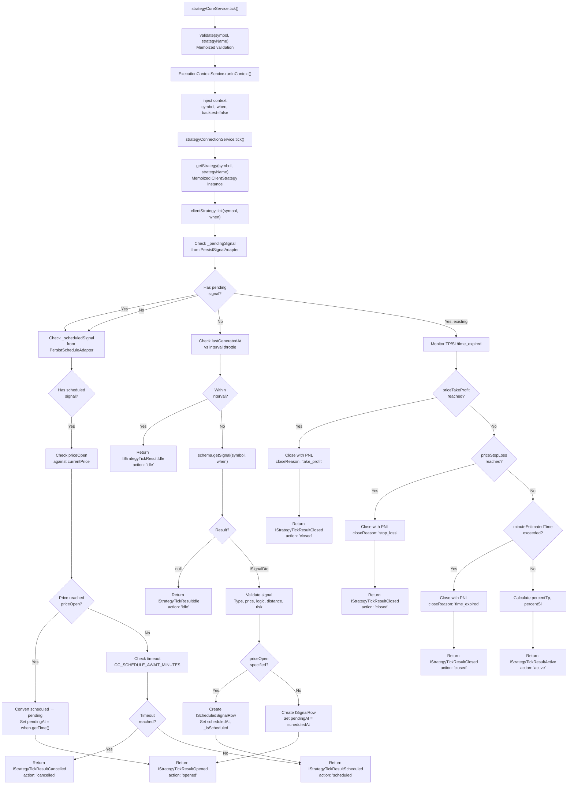
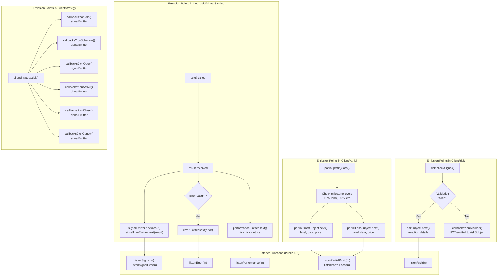
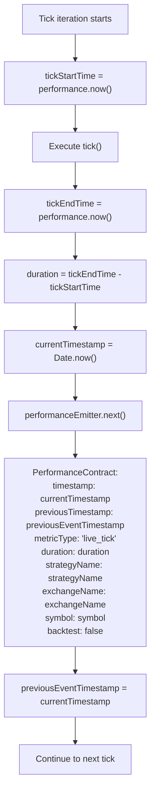
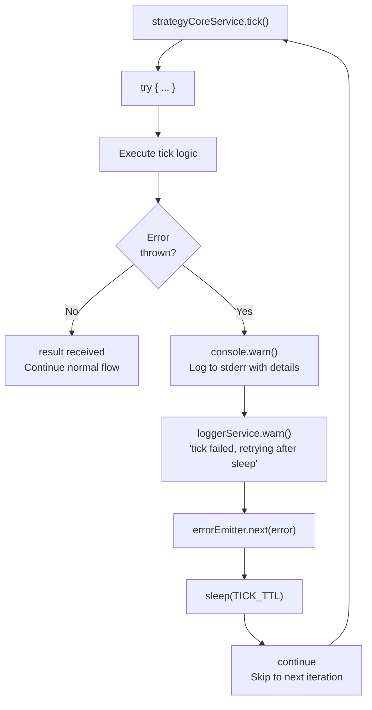
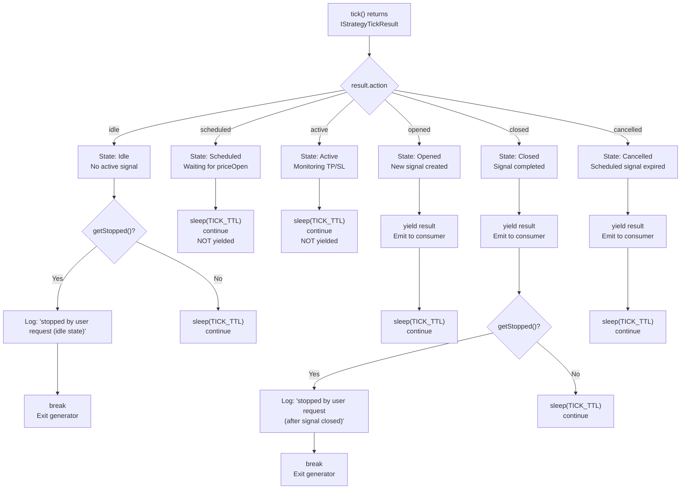

# Real-time Monitoring

<details>
<summary>Relevant source files</summary>

The following files were used as context for generating this wiki page:

- [src/config/emitters.ts](src/config/emitters.ts)
- [src/function/event.ts](src/function/event.ts)
- [src/index.ts](src/index.ts)
- [src/lib/services/core/StrategyCoreService.ts](src/lib/services/core/StrategyCoreService.ts)
- [src/lib/services/logic/private/BacktestLogicPrivateService.ts](src/lib/services/logic/private/BacktestLogicPrivateService.ts)
- [src/lib/services/logic/private/LiveLogicPrivateService.ts](src/lib/services/logic/private/LiveLogicPrivateService.ts)
- [src/lib/services/logic/private/WalkerLogicPrivateService.ts](src/lib/services/logic/private/WalkerLogicPrivateService.ts)
- [types.d.ts](types.d.ts)

</details>


Real-time monitoring is the continuous process of evaluating signal states during live trading execution. The system uses an infinite loop with periodic sleep intervals to check signal status, emit events, collect performance metrics, and handle errors without interrupting execution. This page covers the monitoring loop architecture, tick evaluation, event emission, and state-specific monitoring behavior.

For information about the overall live execution flow, see [10.1](#10.1). For crash recovery mechanisms, see [10.2](#10.2). For interval-based throttling to prevent signal spam, see [10.4](#10.4).

---

## Monitoring Loop Architecture

The monitoring loop is implemented in `LiveLogicPrivateService` as an infinite `while(true)` loop that continuously evaluates signal status. Each iteration creates a real-time timestamp with `new Date()`, calls `tick()` to evaluate signal state, emits events, and sleeps for `TICK_TTL` before the next iteration.

```mermaid
graph TB
    START["LiveLogicPrivateService.run()"] --> LOOP_START["while(true)"]
    
    LOOP_START --> CREATE_TIMESTAMP["when = new Date()<br/>Real-time timestamp"]
    CREATE_TIMESTAMP --> CALL_TICK["strategyCoreService.tick()<br/>symbol, when, backtest=false"]
    
    CALL_TICK --> CHECK_ERROR{"Error?"}
    CHECK_ERROR -->|Yes| LOG_ERROR["Log warning<br/>errorEmitter.next(error)"]
    LOG_ERROR --> SLEEP_ERROR["sleep(TICK_TTL)"]
    SLEEP_ERROR --> LOOP_START
    
    CHECK_ERROR -->|No| EMIT_PERF["performanceEmitter.next()<br/>metricType: 'live_tick'<br/>duration: tick time"]
    
    EMIT_PERF --> CHECK_ACTION{"result.action"}
    
    CHECK_ACTION -->|"idle"| CHECK_STOPPED_IDLE{"getStopped()?"}
    CHECK_STOPPED_IDLE -->|Yes| BREAK_IDLE["break<br/>Exit loop"]
    CHECK_STOPPED_IDLE -->|No| SLEEP_IDLE["sleep(TICK_TTL)"]
    SLEEP_IDLE --> LOOP_START
    
    CHECK_ACTION -->|"active"| SLEEP_ACTIVE["sleep(TICK_TTL)"]
    SLEEP_ACTIVE --> LOOP_START
    
    CHECK_ACTION -->|"scheduled"| SLEEP_SCHEDULED["sleep(TICK_TTL)"]
    SLEEP_SCHEDULED --> LOOP_START
    
    CHECK_ACTION -->|"opened"<br/>or<br/>"closed"| YIELD["yield result<br/>Emit to generator consumer"]
    
    YIELD --> CHECK_CLOSED{"action === 'closed'"}
    CHECK_CLOSED -->|Yes| CHECK_STOPPED_CLOSED{"getStopped()?"}
    CHECK_STOPPED_CLOSED -->|Yes| BREAK_CLOSED["break<br/>Exit loop"]
    CHECK_STOPPED_CLOSED -->|No| SLEEP_YIELD["sleep(TICK_TTL)"]
    CHECK_CLOSED -->|No| SLEEP_YIELD
    SLEEP_YIELD --> LOOP_START
    
    BREAK_IDLE --> END["Generator completes"]
    BREAK_CLOSED --> END
```

**Key Components:**

| Component | Type | Purpose |
|-----------|------|---------|
| `TICK_TTL` | `const number` | Sleep interval between ticks: `1 * 60 * 1_000 + 1` (just over 1 minute) |
| `when` | `Date` | Real-time timestamp created with `new Date()` for each iteration |
| `result` | `IStrategyTickResult` | Discriminated union returned by `tick()` method |
| `sleep()` | Function | Async delay from `functools-kit` to pause between iterations |

**Loop Behavior:**

1. **Continuous Execution**: Never exits except via `getStopped()` check when idle or after signal closes
2. **Real-time Timestamps**: Each iteration uses current time, not historical data
3. **Error Recovery**: Errors are logged and emitted but do not break the loop
4. **State-Aware Sleep**: All states sleep for `TICK_TTL` except when breaking

**Sources:** [src/lib/services/logic/private/LiveLogicPrivateService.ts:14-177]()

---

## Tick Evaluation Process

The `tick()` method evaluates the current signal state by checking for pending signals, validating scheduled signals, or generating new signals via `getSignal()`. The evaluation is wrapped in an execution context containing symbol, timestamp, and backtest flag.



**Validation Chain:**

The signal validation process runs multiple checks sequentially before allowing a signal to be created:

| Validation Type | Service | Checks |
|----------------|---------|---------|
| Schema Existence | `StrategyValidationService` | Strategy is registered via `addStrategy()` |
| Risk Existence | `RiskValidationService` | Risk profiles exist if specified |
| Signal Type | `ClientStrategy` | `position` is "long" or "short" |
| Price Logic | `ClientStrategy` | TP > priceOpen > SL for long, SL > priceOpen > TP for short |
| Price Distance | `ClientStrategy` | TP/SL meet minimum distance requirements |
| Time Validity | `ClientStrategy` | `minuteEstimatedTime` is positive |
| Risk Checks | `ClientRisk.checkSignal()` | Portfolio limits, custom validations |

**Sources:** [src/lib/services/core/StrategyCoreService.ts:135-160](), [src/lib/services/connection/StrategyConnectionService.ts](), [src/client/ClientStrategy.ts]()

---

## Event-Driven Monitoring

The monitoring system emits events through RxJS Subjects for external observers to track execution without coupling to internal logic. Events are emitted at multiple points during tick evaluation and are processed sequentially via `queued()` wrapper.



**Event Types and Payloads:**

| Emitter | Contract Type | Emitted When | Key Fields |
|---------|--------------|--------------|------------|
| `signalEmitter` | `IStrategyTickResult` | Every tick result | `action`, `signal`, `currentPrice`, `symbol` |
| `signalLiveEmitter` | `IStrategyTickResult` | Live mode only | Same as `signalEmitter` |
| `performanceEmitter` | `PerformanceContract` | Every tick | `metricType: "live_tick"`, `duration`, `timestamp` |
| `errorEmitter` | `Error` | Tick fails | `message`, `stack` |
| `partialProfitSubject` | `PartialProfitContract` | Profit milestone | `level`, `data`, `currentPrice`, `backtest` |
| `partialLossSubject` | `PartialLossContract` | Loss milestone | `level`, `data`, `currentPrice`, `backtest` |
| `riskSubject` | `RiskContract` | Signal rejected | `symbol`, `pendingSignal`, `activePositionCount`, `comment` |

**Listener Pattern:**

All listener functions use the `queued()` wrapper to ensure sequential processing:

```typescript
// From src/function/event.ts
export function listenSignalLive(fn: (event: IStrategyTickResult) => void) {
  return signalLiveEmitter.subscribe(queued(async (event) => fn(event)));
}
```

The `queued()` wrapper guarantees that:
- Events are processed in the order they are emitted
- The next event waits for the previous callback to complete
- No concurrent execution of the same callback
- Async callbacks are properly awaited

**Sources:** [src/lib/services/logic/private/LiveLogicPrivateService.ts:63-177](), [src/config/emitters.ts:1-133](), [src/function/event.ts:135-167]()

---

## Performance Metrics Collection

Each tick iteration emits performance metrics to track execution duration and detect bottlenecks. The metrics include operation type, duration, timestamp, and delta from the previous event.



**Performance Contract Fields:**

| Field | Type | Purpose |
|-------|------|---------|
| `timestamp` | `number` | Current event timestamp in milliseconds |
| `previousTimestamp` | `number \| null` | Previous event timestamp for delta calculation |
| `metricType` | `"live_tick"` | Operation type being measured |
| `duration` | `number` | Execution time in milliseconds (from `performance.now()`) |
| `strategyName` | `string` | Strategy being executed |
| `exchangeName` | `string` | Exchange being used |
| `symbol` | `string` | Trading pair symbol |
| `backtest` | `boolean` | Always `false` for live mode |

**Metric Types:**

For live trading, the primary metric is:
- `"live_tick"`: Time to complete one monitoring iteration including tick evaluation, event emission, and state checks

The `previousTimestamp` field enables calculating time between events for monitoring system throughput.

**Sources:** [src/lib/services/logic/private/LiveLogicPrivateService.ts:103-115](), [src/contract/Performance.contract.ts]()

---

## Error Handling During Monitoring

The monitoring loop implements graceful error handling to ensure that transient failures do not stop live trading execution. Errors are logged, emitted for external observers, and followed by a sleep before retry.



**Error Handling Strategy:**

| Step | Action | Purpose |
|------|--------|---------|
| Console Warning | `console.warn()` with context | Immediate visibility in logs |
| Logger Service | `loggerService.warn()` with `errorData()` | Structured logging with stack trace |
| Error Emission | `errorEmitter.next(error)` | External observers can react |
| Sleep | `sleep(TICK_TTL)` | Prevent tight error loops |
| Continue | `continue` keyword | Skip to next iteration without breaking loop |

**Error Context:**

The warning message includes full context for debugging:
```
backtestLogicPrivateService tick failed when=${when.toISOString()} 
symbol=${symbol} strategyName=${strategyName} exchangeName=${exchangeName}
```

**Retry Behavior:**

- No retry limit - loop continues indefinitely
- Errors do not accumulate - each is handled independently
- Sleep interval matches normal tick interval to maintain timing
- Next iteration starts fresh with new `Date()` timestamp

**Sources:** [src/lib/services/logic/private/LiveLogicPrivateService.ts:74-95]()

---

## State-Specific Monitoring Behavior

The monitoring loop handles each signal state differently, with varying sleep durations and yield behavior. Understanding state-specific behavior is critical for efficient monitoring.



**State Behavior Summary:**

| State | Yielded? | Sleep After? | Stop Check? | Purpose |
|-------|----------|--------------|-------------|---------|
| `idle` | No | Yes | Before sleep | No signal exists, safe to stop |
| `scheduled` | No | Yes | No | Waiting for price activation, keep monitoring |
| `active` | No | Yes | No | Position open, keep monitoring TP/SL |
| `opened` | Yes | Yes | No | Notify consumer of new position |
| `closed` | Yes | Yes | After yield | Notify consumer of PNL, allow graceful stop |
| `cancelled` | Yes | Yes | No | Notify consumer of cancelled scheduled signal |

**Yield Behavior:**

Only `opened`, `closed`, and `cancelled` results are yielded to the async generator consumer. This means:
- Consumer receives notification when positions open or close
- Consumer does not receive continuous updates during active monitoring
- For continuous monitoring, use event listeners instead of generator consumption

**Stop Check Timing:**

The `getStopped()` check occurs at strategic points:
- **Before idle sleep**: Safe to stop when no active position
- **After closed yield**: Graceful exit after position completes
- **Not during active/scheduled**: Prevents stopping mid-position

**Sources:** [src/lib/services/logic/private/LiveLogicPrivateService.ts:118-176](), [types.d.ts:769-890]()

---

## Continuous Monitoring vs. Backtest Monitoring

The monitoring behavior differs significantly between live and backtest modes. Live monitoring operates on real-time data with sleep intervals, while backtest monitoring fast-forwards through historical data without delays.

| Aspect | Live Monitoring | Backtest Monitoring |
|--------|----------------|---------------------|
| Loop Type | `while(true)` infinite loop | `while (i < timeframes.length)` finite loop |
| Timestamp Source | `new Date()` real-time | `timeframes[i]` historical array |
| Sleep Intervals | `sleep(TICK_TTL)` between ticks | No sleep, continuous iteration |
| Timeframe Skipping | No skipping, monitors every minute | Skips to `closeTimestamp` after signal opens |
| Signal Processing | `tick()` only, monitors one signal | `tick()` for idle, `backtest()` for opened |
| Persistence | Writes after every tick | No disk I/O during backtest |
| Performance Focus | Minimize latency for real-time response | Maximize throughput for historical analysis |
| Stop Behavior | Breaks loop when idle or closed | Breaks loop at any idle state |
| Event Emission | `signalLiveEmitter` | `signalBacktestEmitter` |

**Key Architectural Difference:**

Live monitoring prioritizes **reliability** and **real-time response**:
- Persistence after every tick for crash recovery
- Sleep intervals prevent API rate limiting
- Error recovery without stopping execution

Backtest monitoring prioritizes **speed** and **efficiency**:
- No persistence to avoid disk I/O overhead
- Timeframe skipping reduces redundant checks
- Fast-forward through signal duration with `backtest()` method

**Sources:** [src/lib/services/logic/private/LiveLogicPrivateService.ts:63-177](), [src/lib/services/logic/private/BacktestLogicPrivateService.ts:62-481]()