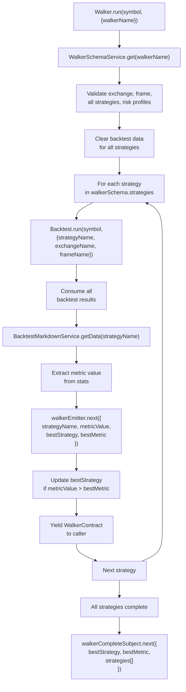
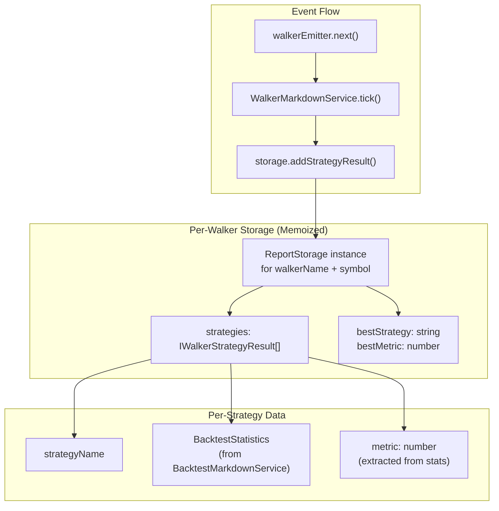
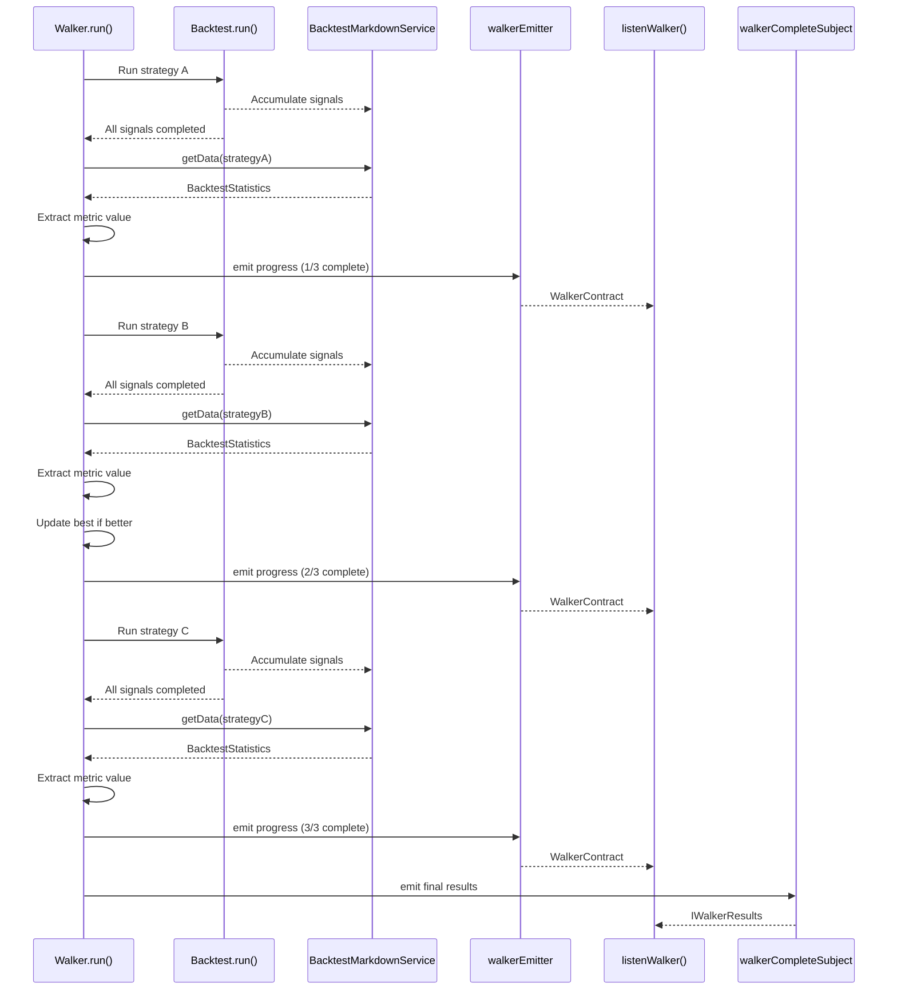

# Strategy Comparison

<details>
<summary>Relevant source files</summary>

The following files were used as context for generating this wiki page:

- [README.md](README.md)
- [src/classes/Backtest.ts](src/classes/Backtest.ts)
- [src/classes/Live.ts](src/classes/Live.ts)
- [src/classes/Schedule.ts](src/classes/Schedule.ts)
- [src/classes/Walker.ts](src/classes/Walker.ts)
- [src/config/emitters.ts](src/config/emitters.ts)
- [src/function/event.ts](src/function/event.ts)
- [src/lib/services/global/WalkerGlobalService.ts](src/lib/services/global/WalkerGlobalService.ts)
- [src/lib/services/markdown/BacktestMarkdownService.ts](src/lib/services/markdown/BacktestMarkdownService.ts)
- [src/lib/services/markdown/LiveMarkdownService.ts](src/lib/services/markdown/LiveMarkdownService.ts)
- [src/lib/services/markdown/ScheduleMarkdownService.ts](src/lib/services/markdown/ScheduleMarkdownService.ts)
- [test/spec/scheduled.test.mjs](test/spec/scheduled.test.mjs)

</details>


This page explains how Walker mode compares multiple trading strategies and selects the best performer based on configurable metrics. For information about running individual backtests, see [Backtest Execution Flow](#9.1). For details about the Walker API methods, see [Walker API](#4.5).

---

## Comparison Metrics

Walker mode ranks strategies using one of several performance metrics. The metric is specified in the `IWalkerSchema.metric` field and defaults to `sharpeRatio` if not provided.

### Available Metrics

| Metric | Description | Calculation | Interpretation |
|--------|-------------|-------------|----------------|
| `sharpeRatio` | Risk-adjusted return | `avgPnl / stdDev` | Higher is better. Measures return per unit of risk. |
| `annualizedSharpeRatio` | Annualized Sharpe Ratio | `sharpeRatio × √365` | Higher is better. Sharpe ratio scaled to yearly timeframe. |
| `winRate` | Win percentage | `(winCount / totalSignals) × 100` | Higher is better. Percentage of profitable trades. |
| `avgPnl` | Average PNL per trade | `sum(pnlPercentage) / totalSignals` | Higher is better. Mean profit/loss percentage. |
| `totalPnl` | Cumulative PNL | `sum(pnlPercentage)` | Higher is better. Total profit/loss across all trades. |
| `certaintyRatio` | Win/loss magnitude ratio | `avgWin / abs(avgLoss)` | Higher is better. Average winning size vs average losing size. |

Each metric is extracted from `BacktestStatistics` after running a complete backtest for the strategy. Metrics return `null` when calculations are unsafe (NaN, Infinity), and null values are excluded from comparison ranking.

**Sources:** [README.md:461-466]()

---

## Walker Execution Architecture

Walker orchestrates multiple sequential backtest runs and accumulates results for comparison.

### Execution Flow Diagram



**Sources:** [src/classes/Walker.ts:39-86](), [src/lib/services/global/WalkerGlobalService.ts:52-86]()

### Key Components

**Walker.run() Method:**
- Entry point for strategy comparison
- Validates all strategies, exchange, frame, and risk profiles upfront
- Clears accumulated backtest data before starting
- Located at [src/classes/Walker.ts:39-86]()

**WalkerGlobalService:**
- Performs validation orchestration for all walker dependencies
- Validates `exchangeName` and `frameName` from walker schema
- Iterates through `walkerSchema.strategies` array and validates each strategy
- Validates `riskName` if present in strategy schema
- Located at [src/lib/services/global/WalkerGlobalService.ts:52-86]()

**Sequential Backtest Execution:**
Walker does **not** run strategies in parallel. Each strategy completes its full backtest before the next begins. This ensures:
- Deterministic results (same order every time)
- Resource isolation (one backtest's memory footprint at a time)
- Progressive result availability (can monitor best strategy mid-execution)

**Sources:** [src/classes/Walker.ts:39-86](), [src/lib/services/global/WalkerGlobalService.ts:52-86]()

---

## Data Accumulation and Storage

Walker uses `WalkerMarkdownService` to accumulate strategy results during execution. The service subscribes to `walkerEmitter` and stores comparison data per walker instance.

### Storage Architecture



**Key Methods:**

**Walker.getData(symbol, walkerName):**
- Retrieves accumulated comparison results from `WalkerMarkdownService`
- Returns `IWalkerResults` containing all strategy statistics and ranking
- Located at [src/classes/Walker.ts:159-178]()

**Walker.getReport(symbol, walkerName):**
- Generates markdown report with comparison table
- Shows all strategies ranked by the selected metric
- Located at [src/classes/Walker.ts:194-213]()

**Walker.dump(symbol, walkerName, path?):**
- Saves markdown report to disk (default: `./logs/walker/`)
- Creates directory if it doesn't exist
- Filename format: `{walkerName}.md`
- Located at [src/classes/Walker.ts:232-254]()

**Sources:** [src/classes/Walker.ts:159-254]()

---

## Results Structure

### IWalkerResults Interface

The results returned by `Walker.getData()` follow this structure:

```typescript
interface IWalkerResults {
  /** Name of the best performing strategy based on selected metric */
  bestStrategy: string;
  
  /** Best metric value achieved by any strategy */
  bestMetric: number;
  
  /** Array of all strategy results, sorted by metric value (descending) */
  strategies: IWalkerStrategyResult[];
}

interface IWalkerStrategyResult {
  /** Strategy name */
  strategyName: string;
  
  /** Full backtest statistics for this strategy */
  stats: BacktestStatistics;
  
  /** Extracted metric value used for comparison */
  metric: number;
}
```

**Example usage:**

```typescript
const results = await Walker.getData("BTCUSDT", "my-walker");

console.log(`Best strategy: ${results.bestStrategy}`);
console.log(`Best Sharpe Ratio: ${results.bestMetric}`);

results.strategies.forEach((result, index) => {
  console.log(`Rank ${index + 1}: ${result.strategyName}`);
  console.log(`  Metric: ${result.metric}`);
  console.log(`  Win Rate: ${result.stats.winRate}%`);
  console.log(`  Total PNL: ${result.stats.totalPnl}%`);
});
```

**Sources:** [README.md:445-454]()

---

## Progress Tracking and Events

Walker emits two types of events for monitoring execution progress:

### Event Types

**walkerEmitter (Progress Updates):**

Emitted after each strategy completes its backtest. Provides incremental progress.

```typescript
interface WalkerContract {
  /** Current symbol being tested */
  symbol: string;
  
  /** Walker name */
  walkerName: string;
  
  /** Current strategy that just completed */
  strategyName: string;
  
  /** Metric value for current strategy */
  metricValue: number;
  
  /** Number of strategies tested so far */
  strategiesTested: number;
  
  /** Total strategies to test */
  totalStrategies: number;
  
  /** Current best strategy name */
  bestStrategy: string;
  
  /** Current best metric value */
  bestMetric: number;
}
```

**walkerCompleteSubject (Final Results):**

Emitted once when all strategies finish testing. Contains complete results.

```typescript
interface IWalkerResults {
  bestStrategy: string;
  bestMetric: number;
  strategies: IWalkerStrategyResult[];
}
```

### Event Listeners

```typescript
import { listenWalker, listenWalkerComplete } from "backtest-kit";

// Track progress during execution
listenWalker((event) => {
  const progress = (event.strategiesTested / event.totalStrategies) * 100;
  console.log(`Progress: ${progress.toFixed(1)}%`);
  console.log(`Tested: ${event.strategyName} - Metric: ${event.metricValue}`);
  console.log(`Best so far: ${event.bestStrategy} - ${event.bestMetric}`);
});

// Get final results when complete
listenWalkerComplete((results) => {
  console.log(`Comparison complete!`);
  console.log(`Winner: ${results.bestStrategy}`);
  console.log(`Best metric: ${results.bestMetric}`);
  
  // Access ranked list
  results.strategies.forEach((strategy, rank) => {
    console.log(`${rank + 1}. ${strategy.strategyName}: ${strategy.metric}`);
  });
});
```

**Sources:** [src/function/event.ts:507-567](), [src/config/emitters.ts:67-73]()

---

## Progress Tracking Flow



**Sources:** [src/classes/Walker.ts:39-86](), [src/function/event.ts:507-567]()

---

## Validation and Data Clearing

Before walker execution begins, extensive validation and data clearing occurs to ensure clean results.

### Validation Steps

1. **Walker Schema Validation** - Confirms `walkerName` is registered
2. **Exchange Validation** - Confirms `exchangeName` exists and is valid
3. **Frame Validation** - Confirms `frameName` exists and has valid timeframe
4. **Strategy Validation** - Each strategy in `walkerSchema.strategies` is validated
5. **Risk Validation** - If any strategy has `riskName`, that risk profile is validated

All validation occurs at [src/classes/Walker.ts:50-59]() and [src/lib/services/global/WalkerGlobalService.ts:64-84]()

### Data Clearing

Before walker starts, all accumulated data is cleared for each strategy:

```typescript
for (const strategyName of walkerSchema.strategies) {
  // Clear backtest results
  backtest.backtestMarkdownService.clear(strategyName);
  
  // Clear scheduled signal tracking
  backtest.scheduleMarkdownService.clear(strategyName);
  
  // Clear strategy internal state
  backtest.strategyGlobalService.clear(strategyName);
  
  // Clear risk profile active positions
  const { riskName } = backtest.strategySchemaService.get(strategyName);
  riskName && backtest.riskGlobalService.clear(riskName);
}
```

This ensures each strategy starts with clean state and no leftover data from previous runs.

**Sources:** [src/classes/Walker.ts:64-79]()

---

## Markdown Report Generation

Walker generates comprehensive comparison reports in markdown format.

### Report Structure

The generated report includes:

1. **Header** - Walker name, symbol, metric used
2. **Summary** - Best strategy and its metric value
3. **Comparison Table** - All strategies ranked by metric
4. **Strategy Details** - Full statistics for each strategy

### Example Report

```markdown
# Walker Comparison Report: my-walker

**Symbol:** BTCUSDT  
**Metric:** sharpeRatio  
**Best Strategy:** strategy-b (1.85)

## Strategy Comparison

| Rank | Strategy | Metric | Total PNL | Win Rate | Avg PNL | Std Dev | Trades |
|------|----------|--------|-----------|----------|---------|---------|--------|
| 1 | strategy-b | 1.85 | +15.5% | 72.3% | +0.45% | 0.24% | 45 |
| 2 | strategy-a | 1.23 | +12.1% | 68.5% | +0.35% | 0.28% | 38 |
| 3 | strategy-c | 0.98 | +8.3% | 65.2% | +0.28% | 0.29% | 25 |

## Detailed Statistics

### strategy-b
- **Total Signals:** 45
- **Win Rate:** 72.3% (32W / 13L)
- **Average PNL:** +0.45%
- **Total PNL:** +15.5%
- **Sharpe Ratio:** 1.85
- **Certainty Ratio:** 2.15
...
```

### Generating Reports

```typescript
// Get raw data
const results = await Walker.getData("BTCUSDT", "my-walker");

// Generate markdown string
const markdown = await Walker.getReport("BTCUSDT", "my-walker");

// Save to disk (default: ./logs/walker/my-walker.md)
await Walker.dump("BTCUSDT", "my-walker");

// Save to custom path
await Walker.dump("BTCUSDT", "my-walker", "./custom/reports");
```

**Sources:** [src/classes/Walker.ts:159-254](), [README.md:456-459]()

---

## Background Execution

Walker supports background execution mode for non-blocking operation.

### Background Mode

```typescript
const stop = Walker.background("BTCUSDT", {
  walkerName: "my-walker"
});

// Listen to progress without blocking
listenWalker((event) => {
  console.log(`Testing ${event.strategyName}...`);
});

// Listen to completion
listenDoneWalker((event) => {
  console.log("Walker completed!");
  Walker.dump(event.symbol, event.strategyName);
});

// Later: stop execution early if needed
stop();
```

**Background Execution Details:**

1. `Walker.background()` consumes the async generator internally
2. Returns a cancellation function that stops execution
3. Emits `doneWalkerSubject` event when complete
4. Errors are caught and emitted to `errorEmitter`

The cancellation function calls `strategyGlobalService.stop()` for each strategy to gracefully terminate any ongoing backtests.

**Sources:** [src/classes/Walker.ts:108-143]()

---

## Metric Selection Best Practices

### Choosing the Right Metric

| Use Case | Recommended Metric | Rationale |
|----------|-------------------|-----------|
| Risk-adjusted performance | `sharpeRatio` or `annualizedSharpeRatio` | Balances returns with volatility |
| Maximum profitability | `totalPnl` | Ignores risk, focuses on absolute returns |
| Consistency | `winRate` | Prioritizes trade success frequency |
| Average trade quality | `avgPnl` | Good for comparing per-trade efficiency |
| Win/loss ratio | `certaintyRatio` | Shows if wins outweigh losses in magnitude |

### Multi-Metric Analysis

While walker compares strategies using a single metric, you can perform multi-metric analysis manually:

```typescript
const results = await Walker.getData("BTCUSDT", "my-walker");

// Rank by different metrics
const bySharpe = [...results.strategies].sort((a, b) => 
  (b.stats.sharpeRatio || 0) - (a.stats.sharpeRatio || 0)
);

const byWinRate = [...results.strategies].sort((a, b) => 
  (b.stats.winRate || 0) - (a.stats.winRate || 0)
);

const byTotalPnl = [...results.strategies].sort((a, b) => 
  (b.stats.totalPnl || 0) - (a.stats.totalPnl || 0)
);

// Find consensus winner
const rankings = new Map();
[bySharpe, byWinRate, byTotalPnl].forEach((ranking, metricIndex) => {
  ranking.forEach((strategy, rank) => {
    const current = rankings.get(strategy.strategyName) || 0;
    rankings.set(strategy.strategyName, current + rank);
  });
});

const consensusWinner = Array.from(rankings.entries())
  .sort((a, b) => a[1] - b[1])[0][0];
```

**Sources:** [README.md:461-466]()

---

## Comparison with Manual Testing

### Walker vs Manual Backtest Loop

**Manual approach:**

```typescript
const strategies = ["strategy-a", "strategy-b", "strategy-c"];
const results = [];

for (const strategyName of strategies) {
  for await (const _ of Backtest.run("BTCUSDT", {
    strategyName,
    exchangeName: "binance",
    frameName: "1d-backtest"
  })) {}
  
  const stats = await Backtest.getData(strategyName);
  results.push({ strategyName, stats });
}

// Manually compare results
const best = results.reduce((best, current) => 
  current.stats.sharpeRatio > best.stats.sharpeRatio ? current : best
);
```

**Walker approach:**

```typescript
addWalker({
  walkerName: "my-walker",
  exchangeName: "binance",
  frameName: "1d-backtest",
  strategies: ["strategy-a", "strategy-b", "strategy-c"],
  metric: "sharpeRatio"
});

for await (const progress of Walker.run("BTCUSDT", {
  walkerName: "my-walker"
})) {
  console.log(`Best: ${progress.bestStrategy}`);
}

const results = await Walker.getData("BTCUSDT", "my-walker");
```

**Walker advantages:**

1. **Automatic metric extraction** - No manual calculation needed
2. **Progress tracking** - Built-in events for monitoring
3. **Report generation** - Automatic markdown reports
4. **Data isolation** - Automatic clearing between runs
5. **Validation** - Upfront validation of all dependencies

**Sources:** [README.md:407-459]()