# Walker Mode

Walker Mode is a strategy comparison and optimization system that executes multiple backtest runs sequentially and ranks strategies by a configurable performance metric. This mode enables automated strategy selection by comparing historical performance across different strategy implementations for the same market conditions. For information about individual backtest execution, see [Backtesting](./52_Backtesting.md). For live trading execution, see [Live Trading](./56_Live_Trading.md).

## Overview

Walker Mode orchestrates multiple [ClientStrategy](./47_Signal_States.md) instances through the same historical timeframe, collecting performance statistics for each strategy and identifying the best performer based on a selected metric. Unlike Backtest Mode which evaluates a single strategy, Walker Mode provides comparative analysis across strategy variants.

The walker system consists of three primary components:

| Component | Purpose | File Reference |
|-----------|---------|----------------|
| `WalkerLogicPrivateService` | Orchestrates sequential backtest execution and metric comparison | [src/lib/services/logic/private/WalkerLogicPrivateService.ts:1-255]() |
| `WalkerSchema` | Defines strategies to compare, metric selection, and callbacks | [src/interfaces/Walker.interface.ts]() |
| `WalkerMarkdownService` | Accumulates results and generates comparative reports | [src/lib/services/markdown/WalkerMarkdownService.ts]() |


## Execution Flow


**Diagram: Sequential Strategy Execution and Metric Comparison**

The walker execution follows a strict sequential pattern to ensure fair comparison:

1. **Initialization**: Retrieves the `IWalkerSchema` from `WalkerSchemaService` using the `walkerName` context parameter [src/lib/services/logic/private/WalkerLogicPrivateService.ts:88]()
2. **Strategy Iteration**: Loops through each strategy name in the `strategies` array [src/lib/services/logic/private/WalkerLogicPrivateService.ts:107-228]()
3. **Backtest Execution**: Invokes `BacktestLogicPublicService.run()` for each strategy with the same `exchangeName` and `frameName` [src/lib/services/logic/private/WalkerLogicPrivateService.ts:117-121]()
4. **Statistics Collection**: Retrieves performance metrics via `BacktestMarkdownService.getData()` [src/lib/services/logic/private/WalkerLogicPrivateService.ts:165]()
5. **Metric Comparison**: Extracts the configured metric value and updates `bestStrategy`/`bestMetric` if the current strategy outperforms [src/lib/services/logic/private/WalkerLogicPrivateService.ts:168-186]()
6. **Progress Emission**: Yields `WalkerContract` after each strategy completion for real-time monitoring [src/lib/services/logic/private/WalkerLogicPrivateService.ts:190-227]()


## Walker Schema Definition

Walker configuration is registered via `addWalker()` and must conform to the `IWalkerSchema` interface:

```typescript
interface IWalkerSchema {
  walkerName: WalkerName;
  strategies: StrategyName[];
  metric: WalkerMetric;
  exchangeName: ExchangeName;
  frameName: FrameName;
  callbacks?: IWalkerCallbacks;
}
```

**Key Schema Fields**:

| Field | Type | Description |
|-------|------|-------------|
| `walkerName` | `WalkerName` | Unique identifier for this walker configuration |
| `strategies` | `StrategyName[]` | Array of strategy names to compare (order preserved) |
| `metric` | `WalkerMetric` | Performance metric used for ranking |
| `exchangeName` | `ExchangeName` | Exchange to use for all strategy backtests |
| `frameName` | `FrameName` | Timeframe to use for all strategy backtests |
| `callbacks` | `IWalkerCallbacks` | Optional lifecycle hooks |

**IWalkerCallbacks Interface**:

| Callback | Signature | Invocation Point |
|----------|-----------|------------------|
| `onStrategyStart` | `(strategyName, symbol) => void` | Before each strategy backtest begins [src/lib/services/logic/private/WalkerLogicPrivateService.ts:109-111]() |
| `onStrategyComplete` | `(strategyName, symbol, stats, metricValue) => void` | After each strategy backtest completes [src/lib/services/logic/private/WalkerLogicPrivateService.ts:217-224]() |
| `onStrategyError` | `(strategyName, symbol, error) => void` | If a strategy backtest throws an exception [src/lib/services/logic/private/WalkerLogicPrivateService.ts:143-145]() |
| `onComplete` | `(finalResults) => void` | After all strategies complete with final best results [src/lib/services/logic/private/WalkerLogicPrivateService.ts:245-248]() |


## Metric Selection and Comparison

Walker Mode supports multiple performance metrics for strategy ranking. The metric value is extracted from `BacktestStatistics` returned by each backtest execution.

**Available Metrics** (`WalkerMetric` type):

| Metric | Description | Formula/Calculation |
|--------|-------------|---------------------|
| `sharpeRatio` | Risk-adjusted returns (default) | `(avgReturn - riskFreeRate) / stdDevReturns` |
| `sharpeRatioAnnualized` | Annualized Sharpe Ratio | `sharpeRatio * sqrt(tradingDaysPerYear)` |
| `winRate` | Percentage of profitable trades | `winCount / totalTrades * 100` |
| `avgPnl` | Average profit/loss per trade | `totalPnl / totalTrades` |
| `totalPnl` | Cumulative profit/loss | Sum of all trade PnL values |
| `certaintyRatio` | Win rate adjusted for trade frequency | Custom calculation in statistics layer |

**Metric Extraction and Validation**:

The walker extracts the metric value with safety checks for invalid numbers [src/lib/services/logic/private/WalkerLogicPrivateService.ts:168-176]():

```typescript
const value = stats[metric];
const metricValue =
  value !== null &&
  value !== undefined &&
  typeof value === "number" &&
  !isNaN(value) &&
  isFinite(value)
    ? value
    : null;
```

**Comparison Logic**:

Strategies are compared using a simple "greater is better" rule [src/lib/services/logic/private/WalkerLogicPrivateService.ts:179-186]():

```typescript
const isBetter =
  bestMetric === null ||
  (metricValue !== null && metricValue > bestMetric);

if (isBetter && metricValue !== null) {
  bestMetric = metricValue;
  bestStrategy = strategyName;
}
```

If a strategy produces an invalid metric (NaN, Infinity, null), it is excluded from comparison but does not halt execution.


## Walker Contract and Progress Tracking



**Diagram: WalkerContract Construction and Event Flow**

**WalkerContract Structure**:

Each iteration yields a `WalkerContract` object containing [src/lib/services/logic/private/WalkerLogicPrivateService.ts:190-203]():

| Field | Type | Description |
|-------|------|-------------|
| `walkerName` | `string` | Walker identifier from context |
| `exchangeName` | `string` | Exchange used for all backtests |
| `frameName` | `string` | Frame used for all backtests |
| `symbol` | `string` | Symbol being analyzed |
| `strategyName` | `string` | Current strategy that just completed |
| `stats` | `BacktestStatistics` | Full statistics for current strategy |
| `metricValue` | `number \| null` | Current strategy's metric value |
| `metric` | `WalkerMetric` | Metric being used for comparison |
| `bestMetric` | `number \| null` | Best metric value seen so far |
| `bestStrategy` | `string \| null` | Strategy name with best metric |
| `strategiesTested` | `number` | Number of strategies completed |
| `totalStrategies` | `number` | Total strategies in array |

**Event Emission**:

Two event channels emit progress updates:

1. **`progressWalkerEmitter`** [src/lib/services/logic/private/WalkerLogicPrivateService.ts:206-214](): Emits `ProgressWalkerContract` with progress percentage
   ```typescript
   await progressWalkerEmitter.next({
     walkerName: context.walkerName,
     exchangeName: context.exchangeName,
     frameName: context.frameName,
     symbol,
     totalStrategies: strategies.length,
     processedStrategies: strategiesTested,
     progress: strategiesTested / strategies.length
   });
   ```

2. **`walkerEmitter`** [src/lib/services/logic/private/WalkerLogicPrivateService.ts:226](): Emits full `WalkerContract` after each strategy

3. **`walkerCompleteSubject`** [src/lib/services/logic/private/WalkerLogicPrivateService.ts:250](): Emits final results with best strategy and statistics


## Walker API

The public API provides four methods for walker execution and reporting, mirroring the Backtest API pattern.

**Walker Utility Class Methods**:

| Method | Return Type | Purpose |
|--------|-------------|---------|
| `Walker.run()` | `AsyncGenerator<WalkerContract>` | Execute walker and yield progress after each strategy |
| `Walker.background()` | `() => void` | Execute walker without yielding results, return stop function |
| `Walker.getData()` | `Promise<WalkerStatistics>` | Retrieve aggregated statistics for all strategies |
| `Walker.getReport()` | `Promise<string>` | Generate markdown report with strategy comparison table |
| `Walker.dump()` | `Promise<void>` | Write report to filesystem |

**Walker.run() Usage**:

```typescript
for await (const progress of Walker.run("BTCUSDT", {
  walkerName: "strategy-comparison",
  exchangeName: "binance",
  frameName: "2024-backtest"
})) {
  console.log(`Testing ${progress.strategyName}: ${progress.metricValue}`);
  console.log(`Best so far: ${progress.bestStrategy} (${progress.bestMetric})`);
  console.log(`Progress: ${progress.strategiesTested}/${progress.totalStrategies}`);
}
```

The generator yields after each strategy completes, allowing real-time monitoring of the comparison process. The final yield contains the complete results with `bestStrategy` and `bestMetric` identified.

**Walker.background() Usage**:

```typescript
const stopWalker = Walker.background("BTCUSDT", {
  walkerName: "strategy-comparison",
  exchangeName: "binance",
  frameName: "2024-backtest"
});

// Walker runs in background consuming the generator
// Call stopWalker() to terminate early if needed
```

This method consumes the walker generator internally without exposing progress events. Useful when only callbacks or final results are needed.

**Walker.getData() Usage**:

```typescript
const stats = await Walker.getData("BTCUSDT", "strategy-comparison");

console.log("Strategies tested:", stats.strategiesCount);
console.log("Best strategy:", stats.bestStrategy);
console.log("Best metric value:", stats.bestMetric);
console.log("All results:", stats.results); // Array of all strategy results
```

Returns aggregated statistics including all strategy results ranked by metric value.

**Walker.getReport() Usage**:

```typescript
const markdown = await Walker.getReport("BTCUSDT", "strategy-comparison");
console.log(markdown);
```

Generates a markdown table comparing all strategies with their metrics, ranked from best to worst.


## Integration with Backtest System



**Diagram: Walker's Layered Integration with Backtest System**

Walker Mode achieves strategy comparison by orchestrating multiple backtest executions through shared services:

**Context Propagation**:

For each strategy iteration, walker updates the `MethodContextService` context [src/lib/services/logic/public/WalkerLogicPublicService.ts]():

```typescript
for await (const result of backtestLogicPublicService.run(symbol, {
  strategyName,      // Different for each iteration
  exchangeName,      // Same for all strategies
  frameName          // Same for all strategies
})) {
  // Process backtest results
}
```

This ensures:
- Each strategy gets a separate `ClientStrategy` instance via memoization keys
- All strategies use the same exchange and timeframe for fair comparison
- Event emissions are tagged with correct strategy name

**Statistics Aggregation**:

After each backtest completes, walker retrieves statistics from `BacktestMarkdownService` [src/lib/services/logic/private/WalkerLogicPrivateService.ts:165]():

```typescript
const stats = await this.backtestMarkdownService.getData(symbol, strategyName);
```

The `BacktestMarkdownService` accumulates all signal events emitted by `signalBacktestEmitter` during the backtest execution, maintaining separate statistics for each strategy name.

**Memoization and Isolation**:

The `StrategyConnectionService` uses a composite key `${symbol}-${strategyName}` to memoize `ClientStrategy` instances. This ensures:
- Each strategy gets its own isolated state
- Multiple walker runs for the same symbol don't interfere
- Strategy instances persist across multiple walker executions


## Cancellation and Error Handling

Walker execution can be interrupted via `walkerStopSubject` or handle strategy-level errors gracefully.

**Early Termination**:

Walker listens to the `walkerStopSubject` stream for cancellation signals [src/lib/services/logic/private/WalkerLogicPrivateService.ts:96-104]():

```typescript
const listenStop = walkerStopSubject
  .filter((data) => {
    let isOk = true;
    isOk = isOk && data.symbol === symbol;
    isOk = isOk && data.strategyName === pendingStrategy;
    return isOk;
  })
  .map(() => CANCEL_SYMBOL)
  .toPromise();
```

The walker races this promise against each backtest execution [src/lib/services/logic/private/WalkerLogicPrivateService.ts:127-130]():

```typescript
result = await Promise.race([
  await resolveDocuments(iterator),
  listenStop,
]);
```

If the stop signal fires, walker breaks out of the strategy loop immediately [src/lib/services/logic/private/WalkerLogicPrivateService.ts:149-157]().

**Strategy-Level Error Recovery**:

If a strategy backtest throws an exception, walker:

1. Logs the error via `LoggerService` [src/lib/services/logic/private/WalkerLogicPrivateService.ts:132-140]()
2. Emits the error to `errorEmitter` [src/lib/services/logic/private/WalkerLogicPrivateService.ts:141]()
3. Invokes `onStrategyError` callback if provided [src/lib/services/logic/private/WalkerLogicPrivateService.ts:143-145]()
4. Skips the failed strategy with `continue` statement [src/lib/services/logic/private/WalkerLogicPrivateService.ts:146]()
5. Proceeds to the next strategy in the array

This graceful degradation ensures that one failing strategy does not abort the entire walker comparison.


## Use Cases and Patterns

**1. Parameter Optimization**:

Register multiple strategies with different parameter values and compare performance:

```typescript
addStrategy({
  strategyName: "ema-cross-fast-10-20",
  interval: "1h",
  getSignal: (context) => emaStrategy(context, 10, 20)
});

addStrategy({
  strategyName: "ema-cross-medium-20-50",
  interval: "1h",
  getSignal: (context) => emaStrategy(context, 20, 50)
});

addStrategy({
  strategyName: "ema-cross-slow-50-200",
  interval: "1h",
  getSignal: (context) => emaStrategy(context, 50, 200)
});

addWalker({
  walkerName: "ema-optimization",
  strategies: ["ema-cross-fast-10-20", "ema-cross-medium-20-50", "ema-cross-slow-50-200"],
  metric: "sharpeRatio",
  exchangeName: "binance",
  frameName: "2024-backtest"
});
```

**2. Real-Time Monitoring**:

Track progress as each strategy completes:

```typescript
listenWalker((progress) => {
  console.log(`[${progress.strategiesTested}/${progress.totalStrategies}] ${progress.strategyName}`);
  console.log(`  Metric: ${progress.metricValue}`);
  console.log(`  Best: ${progress.bestStrategy} (${progress.bestMetric})`);
});

Walker.background("BTCUSDT", {
  walkerName: "ema-optimization",
  exchangeName: "binance",
  frameName: "2024-backtest"
});
```

**3. Multi-Metric Analysis**:

Run walker multiple times with different metrics to get comprehensive comparison:

```typescript
const metrics: WalkerMetric[] = ["sharpeRatio", "winRate", "totalPnl"];

for (const metric of metrics) {
  addWalker({
    walkerName: `analysis-${metric}`,
    strategies: strategyList,
    metric,
    exchangeName: "binance",
    frameName: "2024-backtest"
  });
  
  for await (const _ of Walker.run("BTCUSDT", {
    walkerName: `analysis-${metric}`,
    exchangeName: "binance",
    frameName: "2024-backtest"
  })) {}
  
  const stats = await Walker.getData("BTCUSDT", `analysis-${metric}`);
  console.log(`Best by ${metric}: ${stats.bestStrategy}`);
}
```

**4. AI-Driven Strategy Generation**:

Walker Mode integrates with the Optimizer system for LLM-generated strategy comparison. See [AI-Powered Strategy Optimization](./87_AI-Powered_Strategy_Optimization.md) for details on the complete pipeline. The optimizer generates multiple strategy variants and uses walker to identify the best performer on test data.

