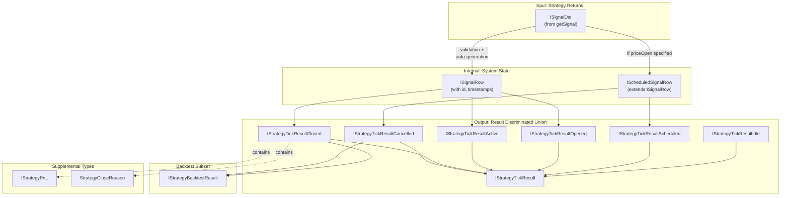
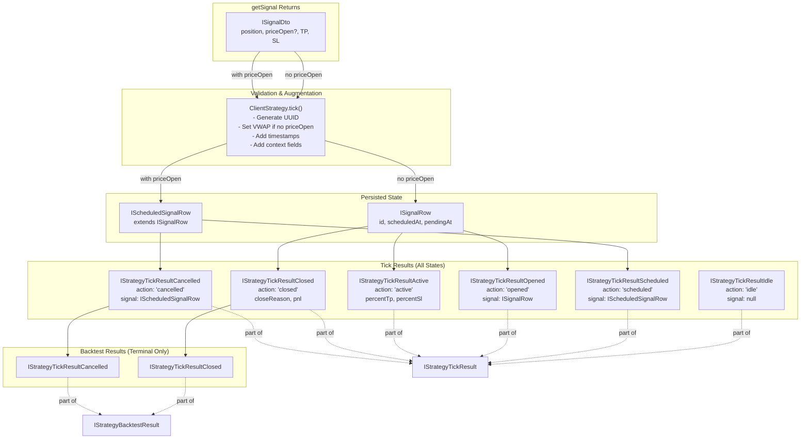
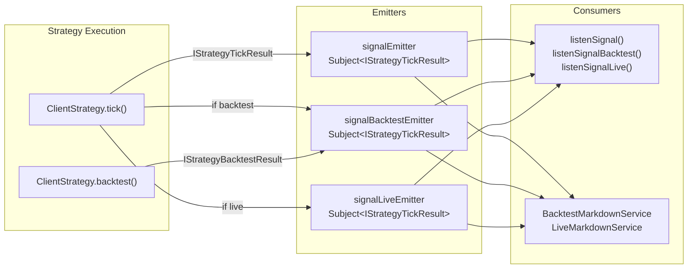

# Signal & Result Types

## Purpose

This page documents the core type definitions for signals and strategy execution results in Backtest Kit. These types define the data structures passed between strategy functions (`getSignal`), returned from execution methods (`tick`, `backtest`), and emitted through the event system.

For strategy development and the `getSignal` function contract, see [Strategy Development](./25_strategy-development.md). For signal lifecycle state transitions, see [Signals & Signal Lifecycle](./08_core-concepts.md). For schema interface definitions, see [Core Interfaces](./56_api-reference.md).

**Sources:** [types.d.ts:641-892](), [src/index.ts:74-88]()

---

## Type Hierarchy Overview

The signal and result types form a hierarchy from user input to system output:



**Sources:** [types.d.ts:641-892]()

---

## Signal Input Types

### ISignalDto

Data transfer object returned by `getSignal()` in strategy implementations. Contains user-specified signal parameters that will be validated and augmented by the system.

```typescript
interface ISignalDto {
    id?: string;                      // Optional: auto-generated if omitted
    position: "long" | "short";       // Trade direction
    note?: string;                    // Human-readable reason
    priceOpen?: number;               // Entry price (if omitted, opens at VWAP)
    priceTakeProfit: number;          // TP target (required)
    priceStopLoss: number;            // SL exit (required)
    minuteEstimatedTime: number;      // Time limit in minutes
}
```

| Field | Type | Required | Description |
|-------|------|----------|-------------|
| `id` | `string` | No | Signal identifier (auto-generated UUID v4 if not provided) |
| `position` | `"long" \| "short"` | Yes | Trade direction: "long" for buy, "short" for sell |
| `note` | `string` | No | Human-readable description of signal reason |
| `priceOpen` | `number` | No | Entry price. If specified, creates scheduled signal. If omitted, opens immediately at VWAP |
| `priceTakeProfit` | `number` | Yes | Take profit target. Must be > priceOpen for long, < priceOpen for short |
| `priceStopLoss` | `number` | Yes | Stop loss exit. Must be < priceOpen for long, > priceOpen for short |
| `minuteEstimatedTime` | `number` | Yes | Expected duration before `time_expired` closure |

**Key Behavior:**
- If `priceOpen` is **omitted**: Signal opens immediately at current VWAP price
- If `priceOpen` is **specified**: Signal becomes "scheduled", waiting for price to reach entry point

**Sources:** [types.d.ts:647-665]()

---

### ISignalRow

Complete signal structure used throughout the system after validation and augmentation. All internal operations work with `ISignalRow` rather than `ISignalDto`.

```typescript
interface ISignalRow extends ISignalDto {
    id: string;                       // UUID v4 (always present after validation)
    priceOpen: number;                // Entry price (always present, set to VWAP if was undefined)
    exchangeName: ExchangeName;       // Exchange identifier
    strategyName: StrategyName;       // Strategy identifier
    scheduledAt: number;              // Creation timestamp (ms)
    pendingAt: number;                // Activation timestamp (ms)
    symbol: string;                   // Trading pair (e.g., "BTCUSDT")
    _isScheduled: boolean;            // Internal flag for scheduled signals
}
```

**Field Details:**

| Field | Type | Description |
|-------|------|-------------|
| `id` | `string` | Unique UUID v4 identifier, auto-generated during validation |
| `priceOpen` | `number` | Entry price, always present (set to VWAP if undefined in DTO) |
| `exchangeName` | `ExchangeName` | Exchange name from method context |
| `strategyName` | `StrategyName` | Strategy name from method context |
| `scheduledAt` | `number` | Unix timestamp (ms) when signal was first created |
| `pendingAt` | `number` | Unix timestamp (ms) when signal became active/pending. For scheduled signals, equals `scheduledAt` until activation |
| `symbol` | `string` | Trading pair symbol |
| `_isScheduled` | `boolean` | Internal runtime marker indicating scheduled state |

**Sources:** [types.d.ts:667-687]()

---

### IScheduledSignalRow

Specialized signal type for delayed entry at specific price. Inherits all fields from `ISignalRow`. Used when `getSignal()` returns a DTO with `priceOpen` specified.

```typescript
interface IScheduledSignalRow extends ISignalRow {
    priceOpen: number;                // Entry price (always present for scheduled signals)
}
```

**Lifecycle:**
1. Created when `getSignal()` returns DTO with `priceOpen` specified
2. Monitors market price on each tick
3. Checks for **SL breach before activation** (critical safety: prevents "open-and-immediately-stop" scenarios)
4. If price reaches `priceOpen` without hitting SL → converts to regular `ISignalRow` (action: "opened")
5. If SL hit before activation or time expires → action: "cancelled"

**Sources:** [types.d.ts:689-697]()

---

## Result Types (Discriminated Union)

### IStrategyTickResult

Discriminated union representing all possible outcomes of a strategy tick. Use the `action` field for type-safe pattern matching.

```typescript
type IStrategyTickResult = 
    | IStrategyTickResultIdle
    | IStrategyTickResultScheduled
    | IStrategyTickResultOpened
    | IStrategyTickResultActive
    | IStrategyTickResultClosed
    | IStrategyTickResultCancelled;
```

**Type Guard Pattern:**

```typescript
function handleTickResult(result: IStrategyTickResult) {
    switch (result.action) {
        case "idle":
            // result is IStrategyTickResultIdle
            console.log(`Idle at price ${result.currentPrice}`);
            break;
        case "scheduled":
            // result is IStrategyTickResultScheduled
            console.log(`Scheduled: waiting for ${result.signal.priceOpen}`);
            break;
        case "opened":
            // result is IStrategyTickResultOpened
            console.log(`Opened signal ${result.signal.id}`);
            break;
        case "active":
            // result is IStrategyTickResultActive
            console.log(`Active: ${result.percentTp}% to TP`);
            break;
        case "closed":
            // result is IStrategyTickResultClosed
            console.log(`Closed: ${result.closeReason}, PNL: ${result.pnl.pnlPercentage}%`);
            break;
        case "cancelled":
            // result is IStrategyTickResultCancelled
            console.log(`Cancelled scheduled signal ${result.signal.id}`);
            break;
    }
}
```

**Sources:** [types.d.ts:888]()

---

### IStrategyTickResultIdle

No active signal exists. Strategy is idle and monitoring market conditions.

```typescript
interface IStrategyTickResultIdle {
    action: "idle";
    signal: null;
    strategyName: StrategyName;
    exchangeName: ExchangeName;
    symbol: string;
    currentPrice: number;
}
```

**When Emitted:**
- No active or scheduled signal exists
- `getSignal()` returned `null` or throttling prevents new signal generation

**Sources:** [types.d.ts:767-781]()

---

### IStrategyTickResultScheduled

Scheduled signal created, waiting for price to reach entry point.

```typescript
interface IStrategyTickResultScheduled {
    action: "scheduled";
    signal: IScheduledSignalRow;
    strategyName: StrategyName;
    exchangeName: ExchangeName;
    symbol: string;
    currentPrice: number;
}
```

**When Emitted:**
- `getSignal()` returned DTO with `priceOpen` specified
- Signal passed validation
- Price has not yet reached `priceOpen`

**Sources:** [types.d.ts:783-799]()

---

### IStrategyTickResultOpened

New signal just created and activated (persisted to storage).

```typescript
interface IStrategyTickResultOpened {
    action: "opened";
    signal: ISignalRow;
    strategyName: StrategyName;
    exchangeName: ExchangeName;
    symbol: string;
    currentPrice: number;
}
```

**When Emitted:**
- Immediate signal (no `priceOpen` specified) passed validation
- OR scheduled signal activated (price reached `priceOpen`)
- Signal persisted to crash-safe storage
- TP/SL monitoring begins

**Sources:** [types.d.ts:801-817]()

---

### IStrategyTickResultActive

Signal is being monitored for TP/SL conditions. Emitted on every tick while signal is active.

```typescript
interface IStrategyTickResultActive {
    action: "active";
    signal: ISignalRow;
    currentPrice: number;
    strategyName: StrategyName;
    exchangeName: ExchangeName;
    symbol: string;
    percentTp: number;              // 0-100%, progress toward TP
    percentSl: number;              // 0-100%, progress toward SL
}
```

**Progress Calculation:**

| Field | Formula | Description |
|-------|---------|-------------|
| `percentTp` | Progress from open to TP (0% at open, 100% at TP) | If price moves toward TP: increases. If price moves toward SL: 0% |
| `percentSl` | Progress from open to SL (0% at open, 100% at SL) | If price moves toward SL: increases. If price moves toward TP: 0% |

**When Emitted:**
- Signal is open and being monitored
- Neither TP nor SL has been reached
- Time limit not yet expired

**Sources:** [types.d.ts:819-839]()

---

### IStrategyTickResultClosed

Signal closed with final PNL calculation. Terminal state.

```typescript
interface IStrategyTickResultClosed {
    action: "closed";
    signal: ISignalRow;
    currentPrice: number;
    closeReason: StrategyCloseReason;
    closeTimestamp: number;
    pnl: IStrategyPnL;
    strategyName: StrategyName;
    exchangeName: ExchangeName;
    symbol: string;
}
```

**Field Details:**

| Field | Type | Description |
|-------|------|-------------|
| `closeReason` | `StrategyCloseReason` | Why signal closed: "take_profit", "stop_loss", or "time_expired" |
| `closeTimestamp` | `number` | Unix timestamp (ms) when signal closed |
| `pnl` | `IStrategyPnL` | Profit/loss calculation with fees and slippage |

**When Emitted:**
- TP reached: `closeReason === "take_profit"`
- SL reached: `closeReason === "stop_loss"`
- Time expired: `closeReason === "time_expired"`

**Sources:** [types.d.ts:841-863]()

---

### IStrategyTickResultCancelled

Scheduled signal cancelled without opening position. Terminal state for scheduled signals that never activated.

```typescript
interface IStrategyTickResultCancelled {
    action: "cancelled";
    signal: IScheduledSignalRow;
    currentPrice: number;
    closeTimestamp: number;
    strategyName: StrategyName;
    exchangeName: ExchangeName;
    symbol: string;
}
```

**When Emitted:**
- Scheduled signal hit SL before reaching `priceOpen`
- Time limit expired before activation
- Manual cancellation (future feature)

**Key Difference from Closed:**
- No PNL calculation (position never opened)
- Uses `IScheduledSignalRow` instead of `ISignalRow`

**Sources:** [types.d.ts:865-883]()

---

## IStrategyBacktestResult

Subset of `IStrategyTickResult` containing only terminal states returned by `backtest()` method.

```typescript
type IStrategyBacktestResult = 
    | IStrategyTickResultClosed
    | IStrategyTickResultCancelled;
```

**Usage Context:**

The `backtest()` method processes historical candles until signal reaches terminal state, then returns the final result. It never returns intermediate states like "idle", "scheduled", "opened", or "active".

```typescript
// backtest() signature
backtest(candles: ICandleData[]): Promise<IStrategyBacktestResult>

// Type-safe handling
const result = await strategy.backtest(candles);
if (result.action === "closed") {
    // Has PNL
    console.log(`PNL: ${result.pnl.pnlPercentage}%`);
} else {
    // result.action === "cancelled"
    console.log("Signal cancelled before activation");
}
```

**Sources:** [types.d.ts:890-892](), [docs/types/IStrategyBacktestResult.md:9-12]()

---

## Profit/Loss Types

### IStrategyPnL

Profit and loss calculation with adjusted prices (includes 0.1% fees + 0.1% slippage).

```typescript
interface IStrategyPnL {
    pnlPercentage: number;            // Profit/loss as percentage (+1.5 = +1.5%, -2.3 = -2.3%)
    priceOpen: number;                // Entry price adjusted with slippage and fees
    priceClose: number;               // Exit price adjusted with slippage and fees
}
```

**Calculation Logic:**

1. **Entry Adjustment (0.1% fee + 0.1% slippage):**
   - Long: `priceOpen × (1 + 0.001 + 0.001) = priceOpen × 1.002`
   - Short: `priceOpen × (1 - 0.001 - 0.001) = priceOpen × 0.998`

2. **Exit Adjustment:**
   - Long: `priceClose × (1 - 0.001 - 0.001) = priceClose × 0.998`
   - Short: `priceClose × (1 + 0.001 + 0.001) = priceClose × 1.002`

3. **PNL Calculation:**
   - Long: `((adjustedPriceClose - adjustedPriceOpen) / adjustedPriceOpen) × 100`
   - Short: `((adjustedPriceOpen - adjustedPriceClose) / adjustedPriceOpen) × 100`

**Configuration:**

Fee and slippage percentages are defined in `GLOBAL_CONFIG`:
- `CC_PERCENT_FEE`: Default 0.1%
- `CC_PERCENT_SLIPPAGE`: Default 0.1%

**Sources:** [types.d.ts:754-763]()

---

### StrategyCloseReason

Enumeration of possible signal closure reasons.

```typescript
type StrategyCloseReason = "time_expired" | "take_profit" | "stop_loss";
```

| Value | Description |
|-------|-------------|
| `"take_profit"` | Signal closed because price reached `priceTakeProfit` |
| `"stop_loss"` | Signal closed because price reached `priceStopLoss` |
| `"time_expired"` | Signal closed because `minuteEstimatedTime` elapsed |

**Usage in Closed Results:**

```typescript
if (result.action === "closed") {
    switch (result.closeReason) {
        case "take_profit":
            console.log("Winner! TP hit");
            break;
        case "stop_loss":
            console.log("Loser! SL hit");
            break;
        case "time_expired":
            console.log("Time expired");
            break;
    }
}
```

**Sources:** [types.d.ts:752]()

---

## Working with Discriminated Unions

### Type Guards and Pattern Matching

TypeScript narrows types based on the `action` discriminator:

```typescript
import { IStrategyTickResult } from "backtest-kit";

function analyzeResult(result: IStrategyTickResult) {
    // Type guard using action field
    if (result.action === "closed") {
        // TypeScript knows result is IStrategyTickResultClosed
        console.log(`Close reason: ${result.closeReason}`);
        console.log(`PNL: ${result.pnl.pnlPercentage}%`);
        // result.pnl is accessible (type-safe)
    }
    
    if (result.action === "active") {
        // TypeScript knows result is IStrategyTickResultActive
        console.log(`TP progress: ${result.percentTp}%`);
        console.log(`SL progress: ${result.percentSl}%`);
        // result.percentTp and result.percentSl are accessible
    }
}
```

**Sources:** [types.d.ts:888]()

---

### Filtering Event Streams

Use discriminated union with event listeners for type-safe filtering:

```typescript
import { listenSignal } from "backtest-kit";

// Listen only for closed signals
listenSignal((result) => {
    if (result.action === "closed") {
        // result is IStrategyTickResultClosed
        const { closeReason, pnl } = result;
        
        if (closeReason === "take_profit") {
            console.log(`TP Hit! Profit: ${pnl.pnlPercentage}%`);
        }
    }
});

// Listen only for active signals on specific symbol
listenSignal((result) => {
    if (result.action === "active" && result.symbol === "BTCUSDT") {
        // result is IStrategyTickResultActive
        console.log(`BTCUSDT: ${result.percentTp}% to TP`);
    }
});
```

**Sources:** [src/function/event.ts:70-73](), [types.d.ts:888]()

---

## Type Relationship Diagram



**Sources:** [types.d.ts:641-892]()

---

## Common Fields Across Result Types

All result types share these common fields:

| Field | Type | Description |
|-------|------|-------------|
| `action` | `string` | Discriminator: "idle", "scheduled", "opened", "active", "closed", "cancelled" |
| `strategyName` | `StrategyName` | Strategy identifier from method context |
| `exchangeName` | `ExchangeName` | Exchange identifier from method context |
| `symbol` | `string` | Trading pair symbol (e.g., "BTCUSDT") |
| `currentPrice` | `number` | Current VWAP price at time of result |

**Variation:**

- `IStrategyTickResultIdle`: `signal` is `null`
- `IStrategyTickResultScheduled`, `IStrategyTickResultCancelled`: `signal` is `IScheduledSignalRow`
- `IStrategyTickResultOpened`, `IStrategyTickResultActive`, `IStrategyTickResultClosed`: `signal` is `ISignalRow`

**Sources:** [types.d.ts:767-883]()

---

## Usage in Event System

Signal and result types flow through the event system via Subject emitters:



**Key Points:**

1. **All tick results** emit to `signalEmitter` (global)
2. **Backtest-specific** results also emit to `signalBacktestEmitter`
3. **Live-specific** results also emit to `signalLiveEmitter`
4. Markdown services subscribe and accumulate results for statistics
5. User listeners receive results through `listenSignal*()` functions with queued processing

**Sources:** [src/config/emitters.ts:15-31](), [src/function/event.ts:70-221]()