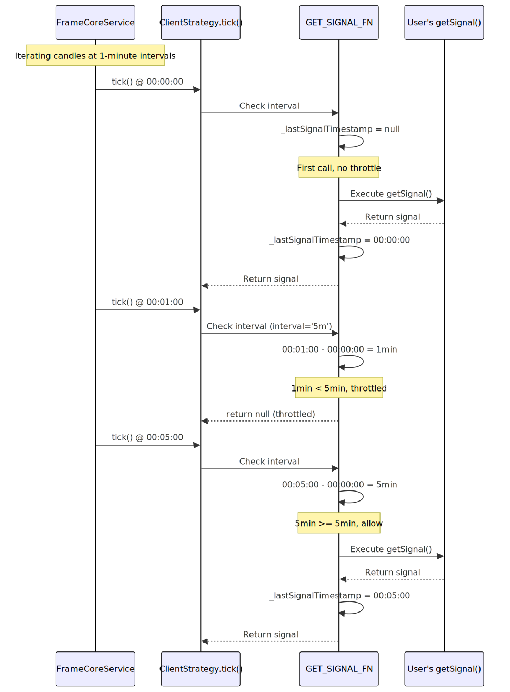

# Interval Throttling

## Purpose and Scope

This page documents the interval throttling system in backtest-kit, which prevents excessive `getSignal()` calls by enforcing minimum time delays between signal generation attempts. Interval throttling ensures strategies execute at defined timeframes (e.g., every 5 minutes) rather than on every tick, reducing computational overhead and aligning signal generation with strategy timeframes.

For information about the signal lifecycle after generation, see [Signal Lifecycle Overview](./07_Signal_Lifecycle_Overview.md). For details on real-time monitoring loops, see [Real-time Monitoring](./61_Real-time_Monitoring.md).

---

## Interval Types

backtest-kit supports six predefined throttling intervals, each enforcing a minimum time between `getSignal()` invocations:

| Interval Value | Duration (Minutes) | Duration (Milliseconds) | Typical Use Case |
|----------------|-------------------|------------------------|------------------|
| `"1m"` | 1 | 60,000 | High-frequency scalping, rapid signal updates |
| `"3m"` | 3 | 180,000 | Short-term momentum strategies |
| `"5m"` | 5 | 300,000 | Common intraday trading interval |
| `"15m"` | 15 | 900,000 | Medium-term intraday strategies |
| `"30m"` | 30 | 1,800,000 | Swing trading, position management |
| `"1h"` | 60 | 3,600,000 | Long-term position strategies |

**Sources:** [src/interfaces/Strategy.interface.ts:12-18](), [src/client/ClientStrategy.ts:34-41]()

---

## Throttling Mechanism

### Architecture Diagram



**Diagram: Interval Throttling Decision Flow**

**Sources:** [src/client/ClientStrategy.ts:332-476]()

---

## Implementation Details

### Throttle Check Logic

The throttling check occurs in `GET_SIGNAL_FN` before invoking the user-defined `getSignal()` function:

```typescript
// From ClientStrategy.ts:336-352
const currentTime = self.params.execution.context.when.getTime();
{
  const intervalMinutes = INTERVAL_MINUTES[self.params.interval];
  const intervalMs = intervalMinutes * 60 * 1000;

  // Check if enough time has passed since last getSignal
  if (
    self._lastSignalTimestamp !== null &&
    currentTime - self._lastSignalTimestamp < intervalMs
  ) {
    return null;
  }

  self._lastSignalTimestamp = currentTime;
}
```

**Key Implementation Points:**

1. **Time Source**: Uses `ExecutionContextService.context.when` for temporal consistency
2. **Null on First Call**: `_lastSignalTimestamp` starts as `null`, allowing immediate first execution
3. **Millisecond Precision**: Converts minutes to milliseconds for accurate comparison
4. **Early Return**: Returns `null` immediately if throttled, preventing unnecessary computation
5. **Timestamp Update**: Updates `_lastSignalTimestamp` only after throttle check passes

**Sources:** [src/client/ClientStrategy.ts:336-352]()

---

### Interval Lookup Table

The `INTERVAL_MINUTES` constant maps `SignalInterval` string values to numeric minute durations:

| Constant | File Location | Type |
|----------|--------------|------|
| `INTERVAL_MINUTES` | [src/client/ClientStrategy.ts:34-41]() | `Record<SignalInterval, number>` |

**Sources:** [src/client/ClientStrategy.ts:34-41]()

---

## Configuration in Strategy Schemas

### Schema Definition

Strategies specify their throttling interval via the `interval` field in `IStrategySchema`:

```typescript
// From interfaces/Strategy.interface.ts
export interface IStrategySchema {
  strategyName: StrategyName;
  interval: SignalInterval;  // Throttling interval
  getSignal: (symbol: string, when: Date) => Promise<ISignalDto | null>;
  // ... other fields
}
```

**Sources:** [src/interfaces/Strategy.interface.ts:132-151]()

---

### Registration Example

```typescript
// Example from README.md
addStrategy({
  strategyName: 'llm-strategy',
  interval: '5m',  // getSignal() called at most every 5 minutes
  getSignal: async (symbol) => {
    // Strategy logic here
  },
});
```

**Sources:** [README.md:118-143]()

---

## Behavior Across Execution Modes

### Backtest Mode

In backtest mode, `ClientStrategy.tick()` is called once per candle iteration. The throttle ensures `getSignal()` only executes when the time difference between candles exceeds the configured interval:



**Diagram: Interval Throttling in Backtest Mode**

**Sources:** [src/client/ClientStrategy.ts:1056-1187](), [src/lib/services/command/BacktestCommandService.ts]()

---

### Live Mode

In live mode, `ClientStrategy.tick()` is called continuously in a loop with `TICK_TTL` sleep intervals (typically 1 minute). The throttle prevents redundant `getSignal()` executions between meaningful time boundaries:



**Diagram: Interval Throttling in Live Mode Loop**

**Sources:** [src/lib/services/command/LiveCommandService.ts](), [src/client/ClientStrategy.ts:336-352]()

---

## Per-Instance State Isolation

Each `ClientStrategy` instance maintains its own `_lastSignalTimestamp`:

```typescript
// From ClientStrategy.ts class definition
export class ClientStrategy implements IStrategy {
  private _lastSignalTimestamp: number | null = null;
  private _isStopped = false;
  private _pendingSignal: ISignalRow | null = null;
  private _scheduledSignal: IScheduledSignalRow | null = null;
  // ...
}
```

**Instance Isolation Guarantees:**

1. **Symbol-Strategy Pairs**: Each symbol-strategy combination gets isolated throttle state
2. **Backtest vs Live**: Separate instances for backtest and live modes via memoization key `symbol:strategyName:backtest`
3. **No Cross-Contamination**: One strategy's throttle state never affects another

**Sources:** [src/client/ClientStrategy.ts](), [src/lib/services/connection/StrategyConnectionService.ts:123-156]()

---

## Relationship with Other Components

### Integration Points

| Component | Relationship | File Reference |
|-----------|-------------|----------------|
| `IStrategySchema` | Defines `interval` configuration | [src/interfaces/Strategy.interface.ts:132-151]() |
| `StrategyConnectionService` | Passes `interval` to `ClientStrategy` constructor | [src/lib/services/connection/StrategyConnectionService.ts:123-156]() |
| `ExecutionContextService` | Provides `context.when` for time source | [src/lib/services/context/ExecutionContextService.ts]() |
| `GET_SIGNAL_FN` | Implements throttle logic wrapper | [src/client/ClientStrategy.ts:332-476]() |

---

## Use Cases and Best Practices

### Interval Selection Guidelines

| Strategy Type | Recommended Interval | Rationale |
|--------------|---------------------|-----------|
| Scalping | `"1m"` | High-frequency entries, rapid market changes |
| Day Trading | `"5m"` or `"15m"` | Balance between responsiveness and noise reduction |
| Swing Trading | `"30m"` or `"1h"` | Longer-term positions, reduced false signals |
| Position Trading | `"1h"` | Weekly/monthly timeframes, minimal overhead |

### Computational Efficiency

Longer intervals reduce:
- **LLM API Calls**: Fewer `getSignal()` invocations mean fewer expensive LLM requests
- **Indicator Calculations**: Reduced technical indicator recomputation
- **Network Requests**: Fewer `getCandles()` fetches (when using live data sources)
- **CPU Usage**: Less frequent strategy evaluation

**Sources:** [README.md:118-143](), [src/client/ClientStrategy.ts:336-352]()

---

## Timing Precision

### Timestamp Sources

The throttle compares timestamps from two sources:

1. **Current Time**: `ExecutionContextService.context.when.getTime()`
   - **Backtest**: Candle timestamp from historical data
   - **Live**: `Date.now()` from system clock

2. **Last Signal Time**: `_lastSignalTimestamp` (stored in milliseconds)

### Boundary Behavior

The throttle uses **strict inequality** (`<`), meaning:

- **Exactly Equal**: If `currentTime - lastSignalTimestamp === intervalMs`, the throttle **allows** execution
- **Example**: With `interval='5m'` and `lastSignalTimestamp=00:00:00`, the signal at `00:05:00` will execute (not throttled)

**Sources:** [src/client/ClientStrategy.ts:339-350]()

---

## Testing Coverage

The throttle mechanism is validated by multiple test suites:

| Test Suite | Focus | File Reference |
|-----------|-------|----------------|
| `timing.test.mjs` | Interval timing accuracy | [test/e2e/timing.test.mjs]() |
| `defend.test.mjs` | Edge cases (boundary conditions, multiple signals) | [test/e2e/defend.test.mjs]() |
| `scheduled.test.mjs` | Throttle with scheduled signals | [test/e2e/scheduled.test.mjs]() |

**Sources:** [test/index.mjs:1-48]()

---

## Common Pitfalls

### Pitfall 1: Confusing Interval with Signal Lifetime

- **Interval**: Controls **how often** `getSignal()` is called (throttling)
- **minuteEstimatedTime**: Controls **how long** an active signal lives before time expiration

These are independent parameters. A strategy with `interval='5m'` can have `minuteEstimatedTime=120` (2 hours).

**Sources:** [src/interfaces/Strategy.interface.ts:38]()

---

### Pitfall 2: Expecting Sub-Interval Updates in Live Mode

In live mode with `interval='5m'`, even though `tick()` runs every minute, `getSignal()` only executes every 5 minutes. Price checks for active signals still occur every minute (TP/SL monitoring), but **new signal generation is throttled**.

**Sources:** [src/client/ClientStrategy.ts:1023-1054]()

---

## Summary

Interval throttling in backtest-kit enforces minimum time delays between `getSignal()` calls, preventing excessive strategy evaluations and aligning signal generation with meaningful timeframes. The system uses per-instance `_lastSignalTimestamp` tracking with temporal consistency via `ExecutionContextService`, ensuring identical behavior across backtest and live modes while maintaining symbol-strategy isolation.

**Sources:** [src/client/ClientStrategy.ts:34-476](), [src/interfaces/Strategy.interface.ts:12-18](), [src/lib/services/connection/StrategyConnectionService.ts:123-156]()