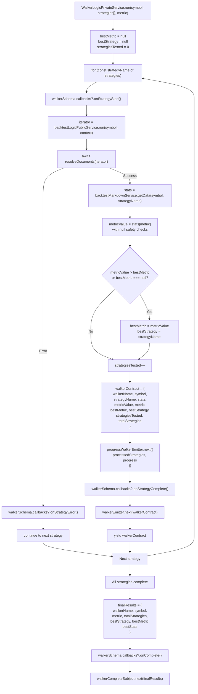
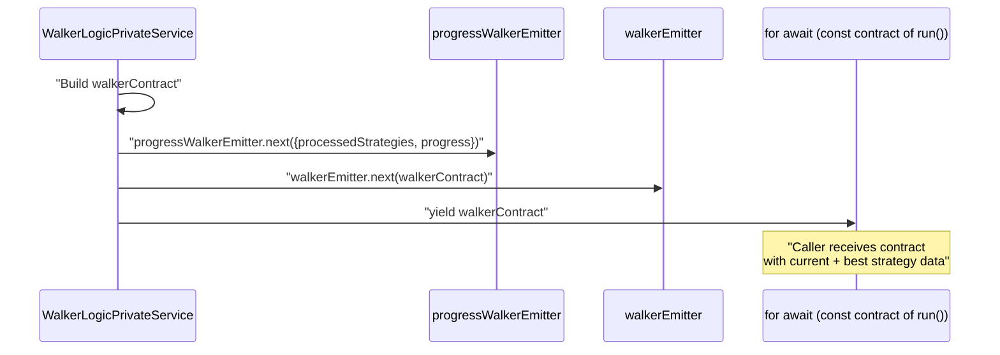
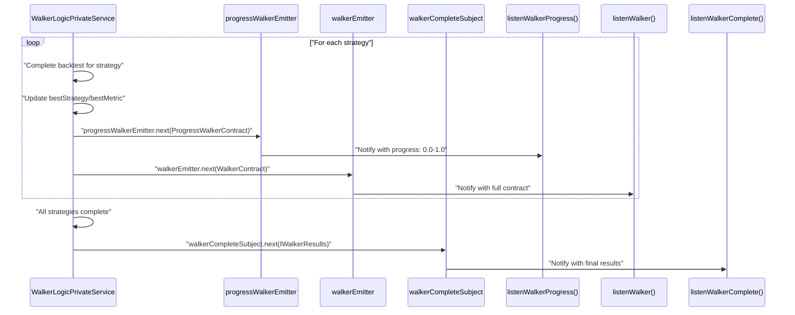
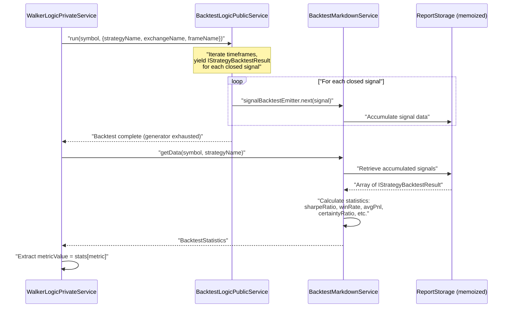

# Strategy Comparison

<details>
<summary>Relevant source files</summary>

The following files were used as context for generating this wiki page:

- [docs/classes/BacktestCommandService.md](docs/classes/BacktestCommandService.md)
- [docs/classes/BacktestUtils.md](docs/classes/BacktestUtils.md)
- [docs/classes/LiveCommandService.md](docs/classes/LiveCommandService.md)
- [docs/classes/LiveUtils.md](docs/classes/LiveUtils.md)
- [docs/index.md](docs/index.md)
- [src/client/ClientExchange.ts](src/client/ClientExchange.ts)
- [src/lib/services/logic/private/BacktestLogicPrivateService.ts](src/lib/services/logic/private/BacktestLogicPrivateService.ts)
- [src/lib/services/logic/private/LiveLogicPrivateService.ts](src/lib/services/logic/private/LiveLogicPrivateService.ts)
- [src/lib/services/logic/private/WalkerLogicPrivateService.ts](src/lib/services/logic/private/WalkerLogicPrivateService.ts)

</details>


This page details the technical implementation of strategy comparison in Walker mode, including metric extraction, sequential backtest orchestration, and best strategy selection. For Walker API reference, see page 4.5. For individual backtest mechanics, see page 9.1.

---

## Metric Selection and Extraction

Walker compares strategies using a single `WalkerMetric` specified in `IWalkerSchema.metric`. The metric value is extracted from `BacktestStatistics` after each strategy completes its backtest.

### WalkerMetric Type Definition

The `WalkerMetric` type defines six comparison criteria:

```typescript
type WalkerMetric =
  | "sharpeRatio"
  | "annualizedSharpeRatio"
  | "winRate"
  | "avgPnl"
  | "totalPnl"
  | "certaintyRatio";
```

### Metric Extraction Logic

Metric extraction occurs in `WalkerLogicPrivateService.run()` after calling `BacktestMarkdownService.getData()`:

```typescript
const stats = await this.backtestMarkdownService.getData(symbol, strategyName);

// Extract metric value with null safety
const value = stats[metric];
const metricValue =
  value !== null &&
  value !== undefined &&
  typeof value === "number" &&
  !isNaN(value) &&
  isFinite(value)
    ? value
    : null;
```

The extraction performs five safety checks to prevent invalid comparisons. If any check fails, `metricValue` is set to `null` and the strategy is excluded from best strategy consideration.

### Metric Calculation Reference

| Metric | BacktestStatistics Field | Calculation Method | Higher is Better |
|--------|--------------------------|-------------------|------------------|
| `sharpeRatio` | `stats.sharpeRatio` | `avgPnl / stdDev` | Yes |
| `annualizedSharpeRatio` | `stats.annualizedSharpeRatio` | `sharpeRatio × √365` | Yes |
| `winRate` | `stats.winRate` | `(winCount / totalSignals) × 100` | Yes |
| `avgPnl` | `stats.avgPnl` | `sum(pnlPercentage) / totalSignals` | Yes |
| `totalPnl` | `stats.totalPnl` | `sum(pnlPercentage)` | Yes |
| `certaintyRatio` | `stats.certaintyRatio` | `avgWin / abs(avgLoss)` | Yes |

All metrics assume higher values indicate better performance. No metrics use ascending comparison order.

**Sources:** [src/lib/services/logic/private/WalkerLogicPrivateService.ts:168-176]()

---

## Sequential Backtest Orchestration

`WalkerLogicPrivateService.run()` executes strategies sequentially using `BacktestLogicPublicService.run()` for each strategy. The method yields `WalkerContract` after each strategy completes.

### WalkerLogicPrivateService.run() Flow



### Key Implementation Details

**Sequential Execution:**
Strategies are not parallelized. Each strategy's backtest completes before the next begins. This occurs at [src/lib/services/logic/private/WalkerLogicPrivateService.ts:106-228]().

**resolveDocuments() Pattern:**
The `resolveDocuments(iterator)` utility consumes the async generator returned by `BacktestLogicPublicService.run()` and returns an array of all yielded results. This pattern allows walker to consume all backtest signals without manually iterating.

**Error Handling:**
If `resolveDocuments()` throws, the error is caught, logged, emitted to `errorEmitter`, and the strategy is skipped via `continue`. The walker proceeds to the next strategy without terminating.

**Callback Invocation:**
Four optional callbacks are invoked during execution:
1. `onStrategyStart(strategyName, symbol)` - Before backtest begins
2. `onStrategyError(strategyName, symbol, error)` - If backtest throws
3. `onStrategyComplete(strategyName, symbol, stats, metricValue)` - After backtest succeeds
4. `onComplete(finalResults)` - After all strategies finish

**Sources:** [src/lib/services/logic/private/WalkerLogicPrivateService.ts:70-252]()

## Best Strategy Selection Logic

The best strategy is determined by comparing `metricValue` against `bestMetric` after each strategy completes.

### Comparison Logic

```typescript
// Update best strategy if needed
const isBetter =
  bestMetric === null ||
  (metricValue !== null && metricValue > bestMetric);

if (isBetter && metricValue !== null) {
  bestMetric = metricValue;
  bestStrategy = strategyName;
}
```

### Selection Rules

1. **Initial Selection:** If `bestMetric === null` (first strategy or no valid metrics yet), any strategy with non-null `metricValue` becomes best
2. **Comparison:** If `metricValue > bestMetric`, the current strategy becomes best
3. **Null Handling:** Strategies with `null` metricValue are never selected as best
4. **Tie Behavior:** If two strategies have identical metric values, the first one encountered wins (iteration order determines ties)

### Ascending vs Descending Metrics

All supported metrics use **descending** comparison (higher is better). There are no metrics where lower values are preferable. This simplifies the comparison logic to a single `>` operator.

**Sources:** [src/lib/services/logic/private/WalkerLogicPrivateService.ts:179-186]()

---

## WalkerContract Data Structure

Each iteration of `WalkerLogicPrivateService.run()` yields a `WalkerContract` containing the current strategy's results and updated best strategy tracking.

### WalkerContract Interface

```typescript
interface WalkerContract {
  walkerName: string;
  exchangeName: string;
  frameName: string;
  symbol: string;
  strategyName: string;           // Current strategy just tested
  stats: BacktestStatistics;      // Full statistics for current strategy
  metricValue: number | null;     // Extracted metric for current strategy
  metric: WalkerMetric;           // Comparison metric being used
  bestMetric: number | null;      // Best metric seen so far
  bestStrategy: string | null;    // Strategy with best metric
  strategiesTested: number;       // Count of strategies completed
  totalStrategies: number;        // Total strategies to test
}
```

### Contract Building Code

```typescript
const walkerContract: WalkerContract = {
  walkerName: context.walkerName,
  exchangeName: context.exchangeName,
  frameName: context.frameName,
  symbol,
  strategyName,
  stats,
  metricValue,
  metric,
  bestMetric,
  bestStrategy,
  strategiesTested,
  totalStrategies: strategies.length,
};
```

The contract is constructed at [src/lib/services/logic/private/WalkerLogicPrivateService.ts:190-203]() after updating `bestMetric`/`bestStrategy` and before emitting progress events.

### Contract Emission Flow



Three emissions occur per strategy:
1. **progressWalkerEmitter** - Numeric progress (count, percentage)
2. **walkerEmitter** - Full contract for external listeners
3. **yield** - Contract to the async generator consumer

**Sources:** [src/lib/services/logic/private/WalkerLogicPrivateService.ts:190-227]()

---

## Final Results Structure

After all strategies complete, `WalkerLogicPrivateService.run()` emits final results to `walkerCompleteSubject`.

### Final Results Interface

```typescript
interface IWalkerResults {
  walkerName: string;
  symbol: string;
  exchangeName: string;
  frameName: string;
  metric: WalkerMetric;
  totalStrategies: number;
  bestStrategy: string | null;
  bestMetric: number | null;
  bestStats: BacktestStatistics | null;  // Statistics for best strategy
}
```

### Final Results Construction

```typescript
const finalResults = {
  walkerName: context.walkerName,
  symbol,
  exchangeName: context.exchangeName,
  frameName: context.frameName,
  metric,
  totalStrategies: strategies.length,
  bestStrategy,
  bestMetric,
  bestStats:
    bestStrategy !== null
      ? await this.backtestMarkdownService.getData(symbol, bestStrategy)
      : null,
};

// Call onComplete callback if provided with final best results
if (walkerSchema.callbacks?.onComplete) {
  walkerSchema.callbacks.onComplete(finalResults);
}

await walkerCompleteSubject.next(finalResults);
```

The final results are constructed at [src/lib/services/logic/private/WalkerLogicPrivateService.ts:230-250](). Unlike `WalkerContract`, the final results include `bestStats` which contains the full `BacktestStatistics` for the winning strategy.

**Sources:** [src/lib/services/logic/private/WalkerLogicPrivateService.ts:230-251]()

---

## Progress Tracking Events

Walker emits three distinct progress events during execution: numeric progress, walker contracts, and completion.

### Progress Event Types

**progressWalkerEmitter (Numeric Progress):**

Emitted after each strategy completes. Provides percentage and count information.

```typescript
interface ProgressWalkerContract {
  walkerName: string;
  exchangeName: string;
  frameName: string;
  symbol: string;
  totalStrategies: number;
  processedStrategies: number;
  progress: number;  // 0.0 to 1.0
}
```

**walkerEmitter (Strategy Results):**

Emitted after each strategy completes. Contains full `WalkerContract` with strategy statistics and best tracking.

```typescript
interface WalkerContract {
  walkerName: string;
  exchangeName: string;
  frameName: string;
  symbol: string;
  strategyName: string;
  stats: BacktestStatistics;
  metricValue: number | null;
  metric: WalkerMetric;
  bestMetric: number | null;
  bestStrategy: string | null;
  strategiesTested: number;
  totalStrategies: number;
}
```

**walkerCompleteSubject (Final Results):**

Emitted once after all strategies finish. Contains final best strategy determination.

```typescript
interface IWalkerResults {
  walkerName: string;
  symbol: string;
  exchangeName: string;
  frameName: string;
  metric: WalkerMetric;
  totalStrategies: number;
  bestStrategy: string | null;
  bestMetric: number | null;
  bestStats: BacktestStatistics | null;
}
```

### Event Emission Sequence



### Listener Functions

**listenWalkerProgress(callback):**
Subscribes to `progressWalkerEmitter`. Receives numeric progress after each strategy.

**listenWalker(callback):**
Subscribes to `walkerEmitter`. Receives full `WalkerContract` with statistics after each strategy.

**listenWalkerComplete(callback):**
Subscribes to `walkerCompleteSubject`. Receives `IWalkerResults` once at completion.

All three listeners support filtering by `symbol`, `walkerName`, `exchangeName`, or `frameName` properties.

**Sources:** [src/lib/services/logic/private/WalkerLogicPrivateService.ts:206-227](), [src/lib/services/logic/private/WalkerLogicPrivateService.ts:245-250]()

---

## Statistics Retrieval from BacktestMarkdownService

Walker retrieves statistics for each strategy by calling `BacktestMarkdownService.getData(symbol, strategyName)` after the backtest completes.

### Statistics Retrieval Flow



### BacktestStatistics Interface

The statistics object returned by `BacktestMarkdownService.getData()` contains:

```typescript
interface BacktestStatistics {
  totalSignals: number;
  winCount: number;
  lossCount: number;
  winRate: number | null;
  avgPnl: number | null;
  totalPnl: number | null;
  stdDev: number | null;
  sharpeRatio: number | null;
  annualizedSharpeRatio: number | null;
  certaintyRatio: number | null;
  avgWin: number | null;
  avgLoss: number | null;
  // ... additional fields
}
```

Each metric field may be `null` if calculation is unsafe (e.g., NaN, Infinity, insufficient data). Walker's metric extraction checks for null values before comparison.

**Sources:** [src/lib/services/logic/private/WalkerLogicPrivateService.ts:165](), [src/lib/services/markdown/BacktestMarkdownService.ts]()

---

## Validation and Data Clearing

Before walker execution begins, extensive validation and data clearing occurs to ensure clean results.

### Validation Steps

1. **Walker Schema Validation** - Confirms `walkerName` is registered
2. **Exchange Validation** - Confirms `exchangeName` exists and is valid
3. **Frame Validation** - Confirms `frameName` exists and has valid timeframe
4. **Strategy Validation** - Each strategy in `walkerSchema.strategies` is validated
5. **Risk Validation** - If any strategy has `riskName`, that risk profile is validated

All validation occurs at [src/classes/Walker.ts:50-59]() and [src/lib/services/global/WalkerGlobalService.ts:64-84]()

### Data Clearing

Before walker starts, all accumulated data is cleared for each strategy:

```typescript
for (const strategyName of walkerSchema.strategies) {
  // Clear backtest results
  backtest.backtestMarkdownService.clear(strategyName);
  
  // Clear scheduled signal tracking
  backtest.scheduleMarkdownService.clear(strategyName);
  
  // Clear strategy internal state
  backtest.strategyGlobalService.clear(strategyName);
  
  // Clear risk profile active positions
  const { riskName } = backtest.strategySchemaService.get(strategyName);
  riskName && backtest.riskGlobalService.clear(riskName);
}
```

This ensures each strategy starts with clean state and no leftover data from previous runs.

**Sources:** [src/classes/Walker.ts:64-79]()

---

## Markdown Report Generation

Walker generates comprehensive comparison reports in markdown format.

### Report Structure

The generated report includes:

1. **Header** - Walker name, symbol, metric used
2. **Summary** - Best strategy and its metric value
3. **Comparison Table** - All strategies ranked by metric
4. **Strategy Details** - Full statistics for each strategy

### Example Report

```markdown
# Walker Comparison Report: my-walker

**Symbol:** BTCUSDT  
**Metric:** sharpeRatio  
**Best Strategy:** strategy-b (1.85)

## Strategy Comparison

| Rank | Strategy | Metric | Total PNL | Win Rate | Avg PNL | Std Dev | Trades |
|------|----------|--------|-----------|----------|---------|---------|--------|
| 1 | strategy-b | 1.85 | +15.5% | 72.3% | +0.45% | 0.24% | 45 |
| 2 | strategy-a | 1.23 | +12.1% | 68.5% | +0.35% | 0.28% | 38 |
| 3 | strategy-c | 0.98 | +8.3% | 65.2% | +0.28% | 0.29% | 25 |

## Detailed Statistics

### strategy-b
- **Total Signals:** 45
- **Win Rate:** 72.3% (32W / 13L)
- **Average PNL:** +0.45%
- **Total PNL:** +15.5%
- **Sharpe Ratio:** 1.85
- **Certainty Ratio:** 2.15
...
```

### Generating Reports

```typescript
// Get raw data
const results = await Walker.getData("BTCUSDT", "my-walker");

// Generate markdown string
const markdown = await Walker.getReport("BTCUSDT", "my-walker");

// Save to disk (default: ./logs/walker/my-walker.md)
await Walker.dump("BTCUSDT", "my-walker");

// Save to custom path
await Walker.dump("BTCUSDT", "my-walker", "./custom/reports");
```

**Sources:** [src/classes/Walker.ts:159-254](), [README.md:456-459]()

---

## Background Execution

Walker supports background execution mode for non-blocking operation.

### Background Mode

```typescript
const stop = Walker.background("BTCUSDT", {
  walkerName: "my-walker"
});

// Listen to progress without blocking
listenWalker((event) => {
  console.log(`Testing ${event.strategyName}...`);
});

// Listen to completion
listenDoneWalker((event) => {
  console.log("Walker completed!");
  Walker.dump(event.symbol, event.strategyName);
});

// Later: stop execution early if needed
stop();
```

**Background Execution Details:**

1. `Walker.background()` consumes the async generator internally
2. Returns a cancellation function that stops execution
3. Emits `doneWalkerSubject` event when complete
4. Errors are caught and emitted to `errorEmitter`

The cancellation function calls `strategyGlobalService.stop()` for each strategy to gracefully terminate any ongoing backtests.

**Sources:** [src/classes/Walker.ts:108-143]()

---

## Metric Selection Best Practices

### Choosing the Right Metric

| Use Case | Recommended Metric | Rationale |
|----------|-------------------|-----------|
| Risk-adjusted performance | `sharpeRatio` or `annualizedSharpeRatio` | Balances returns with volatility |
| Maximum profitability | `totalPnl` | Ignores risk, focuses on absolute returns |
| Consistency | `winRate` | Prioritizes trade success frequency |
| Average trade quality | `avgPnl` | Good for comparing per-trade efficiency |
| Win/loss ratio | `certaintyRatio` | Shows if wins outweigh losses in magnitude |

### Multi-Metric Analysis

While walker compares strategies using a single metric, you can perform multi-metric analysis manually:

```typescript
const results = await Walker.getData("BTCUSDT", "my-walker");

// Rank by different metrics
const bySharpe = [...results.strategies].sort((a, b) => 
  (b.stats.sharpeRatio || 0) - (a.stats.sharpeRatio || 0)
);

const byWinRate = [...results.strategies].sort((a, b) => 
  (b.stats.winRate || 0) - (a.stats.winRate || 0)
);

const byTotalPnl = [...results.strategies].sort((a, b) => 
  (b.stats.totalPnl || 0) - (a.stats.totalPnl || 0)
);

// Find consensus winner
const rankings = new Map();
[bySharpe, byWinRate, byTotalPnl].forEach((ranking, metricIndex) => {
  ranking.forEach((strategy, rank) => {
    const current = rankings.get(strategy.strategyName) || 0;
    rankings.set(strategy.strategyName, current + rank);
  });
});

const consensusWinner = Array.from(rankings.entries())
  .sort((a, b) => a[1] - b[1])[0][0];
```

**Sources:** [README.md:461-466]()

---

## Comparison with Manual Testing

### Walker vs Manual Backtest Loop

**Manual approach:**

```typescript
const strategies = ["strategy-a", "strategy-b", "strategy-c"];
const results = [];

for (const strategyName of strategies) {
  for await (const _ of Backtest.run("BTCUSDT", {
    strategyName,
    exchangeName: "binance",
    frameName: "1d-backtest"
  })) {}
  
  const stats = await Backtest.getData(strategyName);
  results.push({ strategyName, stats });
}

// Manually compare results
const best = results.reduce((best, current) => 
  current.stats.sharpeRatio > best.stats.sharpeRatio ? current : best
);
```

**Walker approach:**

```typescript
addWalker({
  walkerName: "my-walker",
  exchangeName: "binance",
  frameName: "1d-backtest",
  strategies: ["strategy-a", "strategy-b", "strategy-c"],
  metric: "sharpeRatio"
});

for await (const progress of Walker.run("BTCUSDT", {
  walkerName: "my-walker"
})) {
  console.log(`Best: ${progress.bestStrategy}`);
}

const results = await Walker.getData("BTCUSDT", "my-walker");
```

**Walker advantages:**

1. **Automatic metric extraction** - No manual calculation needed
2. **Progress tracking** - Built-in events for monitoring
3. **Report generation** - Automatic markdown reports
4. **Data isolation** - Automatic clearing between runs
5. **Validation** - Upfront validation of all dependencies

**Sources:** [README.md:407-459]()