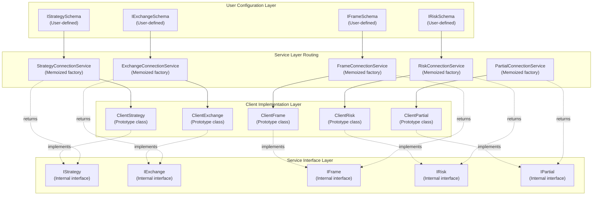
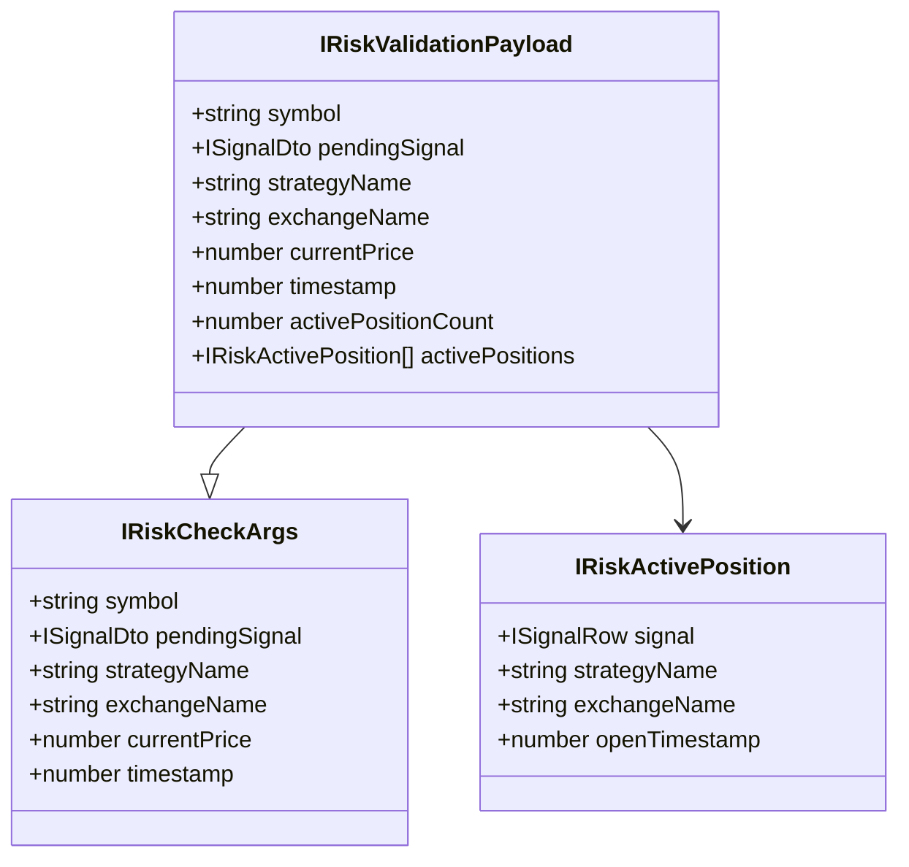
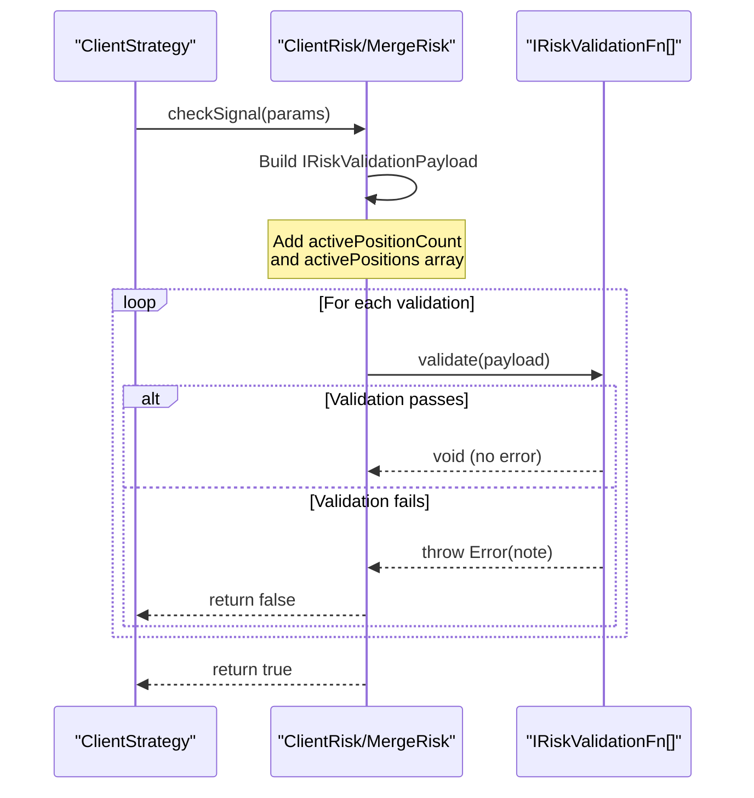
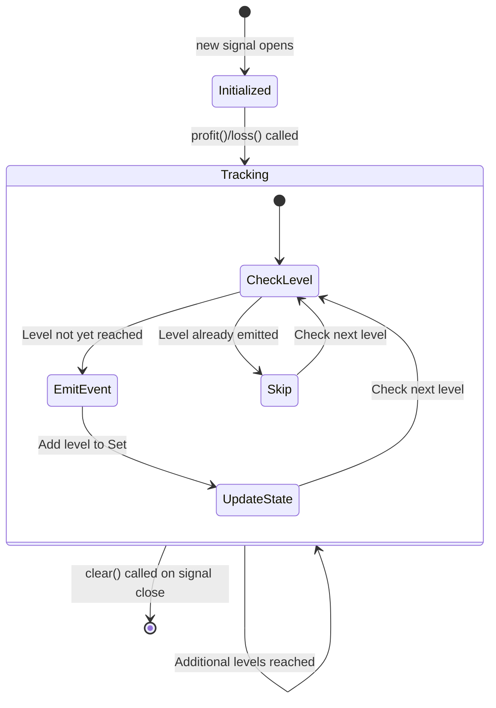
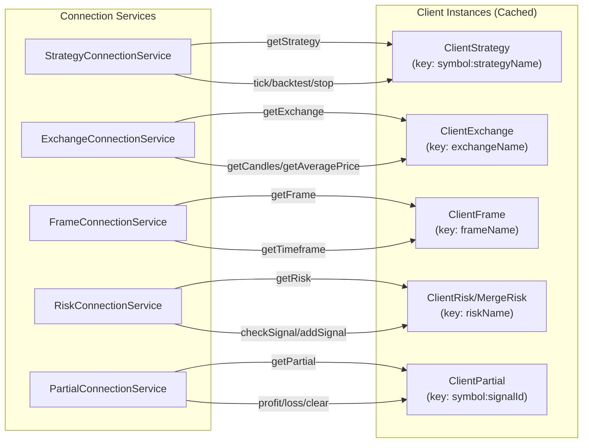
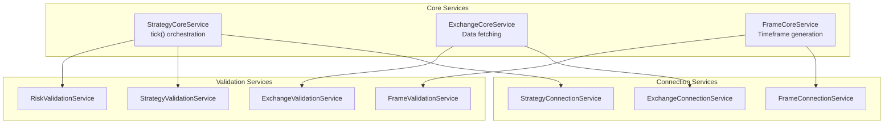
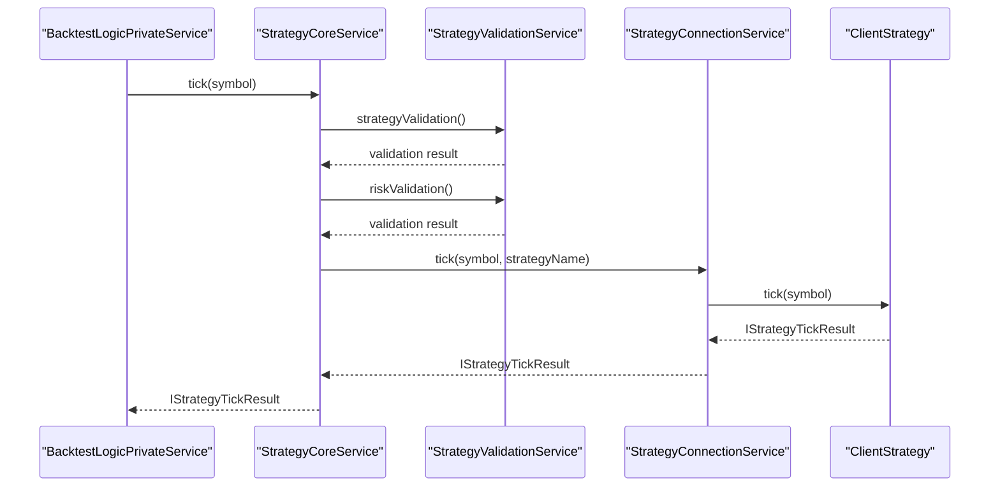
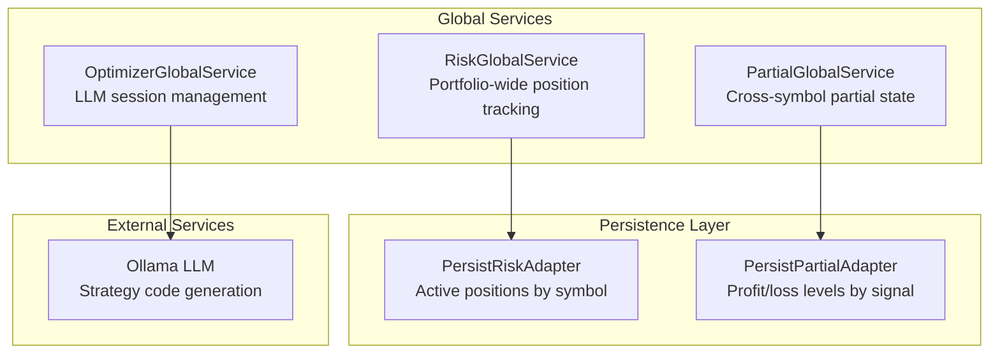
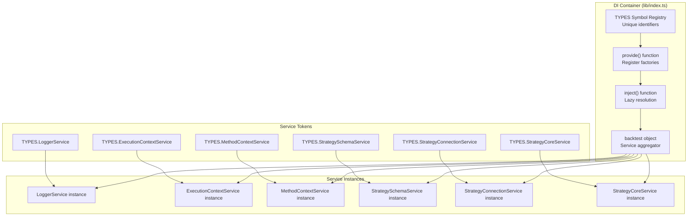
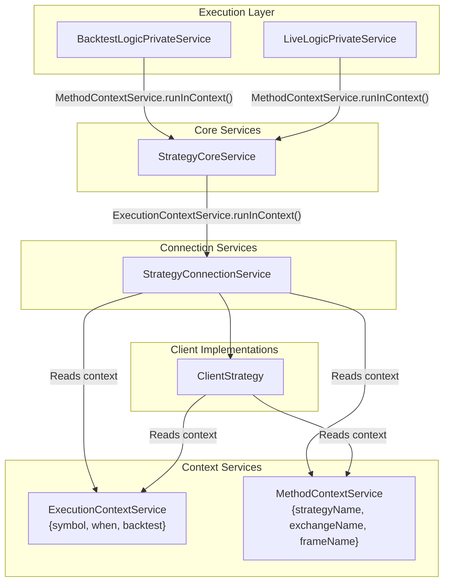

# Service Layer Interfaces

## Purpose and Scope

This page documents the internal service interfaces used by the backtest-kit service layer. These interfaces define the contract between service layer components (Connection Services, Core Services, Global Services) and the client layer implementations (ClientStrategy, ClientExchange, ClientFrame, ClientRisk, ClientPartial).

**Target Audience:** Advanced users who need to understand the internal architecture for debugging, extending the framework, or implementing custom components.

**Related Pages:**
- For user-facing schema interfaces (`IStrategySchema`, `IExchangeSchema`, etc.), see [Core Interfaces](./56_api-reference.md)
- For public API methods and classes, see [Execution Classes API](./56_api-reference.md)
- For service layer architecture overview, see [Service Layer & Dependency Injection](./14_architecture-deep-dive.md)

---

## Architecture Overview

The service layer acts as a bridge between user-defined schemas and runtime client implementations. Service interfaces define the operational contract that client classes must fulfill.



**Sources:** [types.d.ts:1-900](), [docs/internals.md:28-53]()

---

## Core Domain Interfaces

### IStrategy Interface

The `IStrategy` interface defines the execution contract for trading strategies. `ClientStrategy` implements this interface to provide signal generation and monitoring capabilities.

**Location:** Not explicitly exported, but documented in [docs/interfaces/IStrategy.md]()

**Methods:**

| Method | Signature | Purpose |
|--------|-----------|---------|
| `tick` | `(symbol: string) => Promise<IStrategyTickResult>` | Single tick of strategy execution with VWAP monitoring, throttled signal generation, and TP/SL checks |
| `getPendingSignal` | `(symbol: string) => Promise<ISignalRow>` | Retrieves currently active signal or null |
| `backtest` | `(candles: ICandleData[]) => Promise<IStrategyBacktestResult>` | Fast backtest using historical candles with VWAP calculation |
| `stop` | `(symbol: string) => Promise<void>` | Prevents new signal generation while allowing active signals to complete |

**Key Characteristics:**
- Discriminated union return types for type-safe state handling
- Async operations for data fetching and validation
- Stateful instance (maintains `_pendingSignal` and `_stopped` flags)
- Context-aware through `ExecutionContextService` and `MethodContextService`

**Usage Example:**
Connection services route calls to `IStrategy` methods:

```typescript
// StrategyConnectionService routes to ClientStrategy instance
const strategy: IStrategy = strategyConnectionService.getStrategy(symbol, strategyName);
const result = await strategy.tick(symbol);
```

**Sources:** [docs/interfaces/IStrategy.md:1-55](), [types.d.ts:6-20]()

---

### IExchange Interface

The `IExchange` interface defines data access and formatting operations for exchange data sources. `ClientExchange` implements this interface to provide candle data and VWAP calculations.

**Location:** [types.d.ts:160-205]()

**Methods:**

| Method | Signature | Purpose |
|--------|-----------|---------|
| `getCandles` | `(symbol: string, interval: CandleInterval, limit: number) => Promise<ICandleData[]>` | Fetches historical candles backwards from execution context time |
| `getNextCandles` | `(symbol: string, interval: CandleInterval, limit: number) => Promise<ICandleData[]>` | Fetches future candles forward from execution context time (backtest only) |
| `formatQuantity` | `(symbol: string, quantity: number) => Promise<string>` | Formats quantity according to exchange precision rules |
| `formatPrice` | `(symbol: string, price: number) => Promise<string>` | Formats price according to exchange precision rules |
| `getAveragePrice` | `(symbol: string) => Promise<number>` | Calculates VWAP from last 5 1-minute candles using formula: VWAP = Σ(Typical Price × Volume) / Σ(Volume) |

**Key Characteristics:**
- Read-only operations (no state modification)
- Context-aware through `ExecutionContextService` (uses `when` timestamp)
- All methods accept `symbol` parameter for multi-symbol support
- VWAP calculation uses candle data: `(High + Low + Close) / 3 × Volume`

**Implementation Details:**
`ClientExchange` wraps user-defined `IExchangeSchema.getCandles` function and adds:
- Candle buffer management (caches up to 500 candles)
- Anomaly detection (filters candles with zero/NaN/Infinity prices)
- Retry logic with exponential backoff
- VWAP calculation using last 5 1-minute candles

**Sources:** [types.d.ts:160-205](), [types.d.ts:87-155]()

---

### IFrame Interface

The `IFrame` interface defines timeframe generation for backtesting. `ClientFrame` implements this interface to provide timestamp arrays for iteration.

**Location:** [types.d.ts:280-289]()

**Methods:**

| Method | Signature | Purpose |
|--------|-----------|---------|
| `getTimeframe` | `(symbol: string, frameName: FrameName) => Promise<Date[]>` | Generates array of timestamps for backtest iteration, spaced according to configured interval |

**Key Characteristics:**
- Single method interface (simplest domain interface)
- Symbol parameter unused but included for API consistency
- Stateless operation (generates dates from schema configuration)
- Interval options: `1m, 3m, 5m, 15m, 30m, 1h, 2h, 4h, 6h, 8h, 12h, 1d, 3d`

**Implementation Details:**
`ClientFrame` uses [types.d.ts:262-275]() schema properties:
- `startDate`: Beginning of backtest period (inclusive)
- `endDate`: End of backtest period (inclusive)
- `interval`: Time spacing between timestamps
- `callbacks.onTimeframe`: Optional callback after generation

**Usage Pattern:**
```typescript
// FrameConnectionService routes to ClientFrame instance
const frame: IFrame = frameConnectionService.getFrame(frameName);
const timeframes = await frame.getTimeframe(symbol, frameName);
// Returns: [Date(2024-01-01 00:00), Date(2024-01-01 00:01), ...]
```

**Sources:** [types.d.ts:280-289](), [types.d.ts:262-275]()

---

### IRisk Interface

The `IRisk` interface defines risk management operations for signal validation. `ClientRisk` and `MergeRisk` implement this interface to provide portfolio-level controls.

**Location:** [types.d.ts:448-479]()

**Methods:**

| Method | Signature | Purpose |
|--------|-----------|---------|
| `checkSignal` | `(params: IRiskCheckArgs) => Promise<boolean>` | Validates signal against risk limits, returns true if allowed |
| `addSignal` | `(symbol: string, context: {strategyName, riskName}) => Promise<void>` | Registers new opened signal/position |
| `removeSignal` | `(symbol: string, context: {strategyName, riskName}) => Promise<void>` | Removes closed signal/position |

**Key Data Structures:**



**Key Characteristics:**
- Stateful tracking of active positions across strategies
- Validation functions throw errors to reject signals
- `addSignal`/`removeSignal` lifecycle matches signal open/close
- Multi-strategy awareness through `activePositions` array

**Implementation Variants:**

1. **ClientRisk** ([types.d.ts:417-426]()): Single risk profile with custom validations
2. **MergeRisk**: Combines multiple `ClientRisk` instances (used when `riskList` provided in strategy schema)

**Validation Flow:**


**Sources:** [types.d.ts:448-479](), [types.d.ts:339-426]()

---

### IPartial Interface

The `IPartial` interface defines profit/loss milestone tracking for active signals. `ClientPartial` implements this interface to emit events when signals reach 10%, 20%, 30% profit or loss thresholds.

**Location:** [types.d.ts:548-639]()

**Methods:**

| Method | Signature | Purpose |
|--------|-----------|---------|
| `profit` | `(symbol, data, currentPrice, revenuePercent, backtest, when) => Promise<void>` | Processes profit state and emits events for new profit levels reached |
| `loss` | `(symbol, data, currentPrice, lossPercent, backtest, when) => Promise<void>` | Processes loss state and emits events for new loss levels reached |
| `clear` | `(symbol, data, priceClose, backtest) => Promise<void>` | Clears partial profit/loss state when signal closes |

**Type Definition: PartialLevel**

```typescript
type PartialLevel = 10 | 20 | 30 | 40 | 50 | 60 | 70 | 80 | 90 | 100;
```

**State Management:**



**Key Characteristics:**
- Stateful tracking using `Map<signalId, IPartialState>` where state contains:
  - `profitLevels: Set<PartialLevel>` - Deduplication via Set
  - `lossLevels: Set<PartialLevel>` - Prevents duplicate events
- Persistent state via `PersistPartialAdapter` for crash recovery
- Only tracks levels >= 10% (no sub-10% granularity)
- Separate profit and loss tracking (signal can have both if price oscillates)

**Event Emission Logic:**

```mermaid
graph TD
    A["profit(revenuePercent)"] --> B{revenuePercent >= 10?}
    B -->|No| C[Return without event]
    B -->|Yes| D[Calculate levels reached]
    D --> E[levels = 10, 20, 30... up to floor(revenuePercent/10) * 10]
    E --> F{For each level}
    F --> G{Already in profitLevels Set?}
    G -->|Yes| H[Skip level]
    G -->|No| I[Add to profitLevels Set]
    I --> J[Emit partialProfitSubject]
    J --> K[Persist state to disk]
    H --> F
    K --> F
```

**Persistence Schema:**

```typescript
interface IPartialData {
    profitLevels: PartialLevel[];  // Array (serialized from Set)
    lossLevels: PartialLevel[];    // Array (serialized from Set)
}
```

Stored as: `Map<signalId, IPartialData>` in `PersistPartialAdapter`

**Sources:** [types.d.ts:548-639](), [types.d.ts:486-516]()

---

## Service Categories

### Connection Services (Memoized Factories)

Connection services act as memoized factories that create and cache client instances. They route operations based on context and implement the factory pattern with caching.



**Common Pattern:**

All connection services follow this pattern:
1. Inject schema service + context services
2. Implement memoized getter (e.g., `getStrategy`, `getExchange`)
3. Delegate method calls to cached client instances
4. Use context services for routing decisions

**Example: StrategyConnectionService**

Key properties from [docs/classes/StrategyConnectionService.md:21-68]():

| Property | Type | Purpose |
|----------|------|---------|
| `loggerService` | LoggerService | Centralized logging |
| `executionContextService` | TExecutionContextService | Symbol, when, backtest flag |
| `methodContextService` | MethodContextService | Strategy/exchange/frame names |
| `strategySchemaService` | StrategySchemaService | Schema registry |
| `riskConnectionService` | RiskConnectionService | Risk validation routing |
| `exchangeConnectionService` | ExchangeConnectionService | Exchange data routing |
| `partialConnectionService` | PartialConnectionService | Partial tracking routing |
| `getStrategy` | Memoized function | Returns cached `ClientStrategy` |

**Memoization Key Pattern:**

```typescript
// StrategyConnectionService
key = `${symbol}:${strategyName}`;  // "BTCUSDT:my-strategy"

// ExchangeConnectionService
key = exchangeName;  // "binance"

// FrameConnectionService
key = frameName;  // "1d-backtest"

// RiskConnectionService
key = riskName;  // "portfolio-limit"

// PartialConnectionService
key = `${symbol}:${signalId}`;  // "BTCUSDT:uuid-v4-here"
```

**Sources:** [docs/classes/StrategyConnectionService.md:1-145](), [types.d.ts:1-900]()

---

### Core Services (Orchestration)

Core services orchestrate business logic by coordinating connection services and validation services. They implement the service facade pattern.



**StrategyCoreService Responsibilities:**

1. Pre-execution validation (strategy exists, risk exists)
2. Context propagation via `MethodContextService`
3. Routing tick/backtest calls to `StrategyConnectionService`
4. No business logic (pure orchestration)

**Delegation Pattern:**



**Sources:** [docs/internals.md:28-53](), [types.d.ts:1-900]()

---

### Global Services (Shared State)

Global services manage cross-strategy state and provide singleton access to shared resources.



**RiskGlobalService:**

Tracks active positions across all strategies for portfolio-level risk management. Maintains in-memory map of active signals and persists to disk for crash recovery.

**Key Data:**
- `Map<symbol, Set<{strategyName, riskName}>>` - Active position tracking
- Updated via `IRisk.addSignal()` and `IRisk.removeSignal()`
- Queried by `IRiskValidationPayload.activePositionCount` and `activePositions`

**PartialGlobalService:**

Aggregates partial profit/loss events across symbols for portfolio-wide reporting. Provides global access to partial state without requiring symbol-specific routing.

**OptimizerGlobalService:**

Manages LLM connection pool and prompt history for strategy optimization. Implements conversation state management for iterative code generation.

**Sources:** [types.d.ts:339-479](), [types.d.ts:486-639]()

---

## Dependency Injection Flow

The service layer uses a custom dependency injection container built with Symbol-based tokens. The `backtest` object aggregates all services.



**Resolution Order:**

Services are resolved lazily when first accessed. Dependencies are injected via constructor parameters using `inject()` function.

**Example Service Registration:**

```typescript
// Conceptual representation of service registration
provide(TYPES.StrategyConnectionService, () => {
    return new StrategyConnectionService(
        inject(TYPES.LoggerService),
        inject(TYPES.ExecutionContextService),
        inject(TYPES.StrategySchemaService),
        inject(TYPES.RiskConnectionService),
        inject(TYPES.ExchangeConnectionService),
        inject(TYPES.MethodContextService),
        inject(TYPES.PartialConnectionService)
    );
});
```

**Access Pattern:**

All services are accessed through the `backtest` object:

```typescript
import { lib } from 'backtest-kit';

// Access services
const logger = lib.loggerService;
const strategyCore = lib.strategyCoreService;
const strategyConnection = lib.strategyConnectionService;
```

**Sources:** [docs/internals.md:41-53](), [src/index.ts:198]()

---

## Context Propagation

Service interfaces receive ambient context through two scoped services: `ExecutionContextService` and `MethodContextService`. This enables implicit parameter passing without polluting method signatures.



**ExecutionContextService:**

Provides runtime execution parameters. Accessible via `executionContextService.context`:

```typescript
interface IExecutionContext {
    symbol: string;        // "BTCUSDT"
    when: Date;            // Current timestamp
    backtest: boolean;     // true for backtest, false for live
}
```

**MethodContextService:**

Provides schema routing parameters. Accessible via `methodContextService.context`:

```typescript
interface IMethodContext {
    exchangeName: string;   // "binance"
    strategyName: string;   // "my-strategy"
    frameName: string;      // "1d-backtest" or "" for live
}
```

**Usage Pattern:**

```typescript
// In ClientExchange.getCandles()
const { when, backtest } = this.executionContextService.context;

if (backtest) {
    // Fetch backward from 'when'
    const since = new Date(when.getTime() - interval * limit);
    return this.getCandlesImpl(symbol, interval, since, limit);
} else {
    // Fetch most recent
    const since = new Date(Date.now() - interval * limit);
    return this.getCandlesImpl(symbol, interval, since, limit);
}
```

**Sources:** [types.d.ts:6-49](), [types.d.ts:297-336]()

---

## Method Signature Reference

### IStrategy Methods

#### tick(symbol: string): Promise<IStrategyTickResult>

Executes single strategy tick with throttled signal generation and TP/SL monitoring.

**Return Types (Discriminated Union):**

```typescript
type IStrategyTickResult = 
    | { action: "idle", signal: null, currentPrice, ... }
    | { action: "scheduled", signal: IScheduledSignalRow, ... }
    | { action: "opened", signal: ISignalRow, ... }
    | { action: "active", signal: ISignalRow, percentTp, percentSl, ... }
    | { action: "closed", signal: ISignalRow, closeReason, pnl, ... }
    | { action: "cancelled", signal: IScheduledSignalRow, ... }
```

**Flow:**
1. Check if strategy stopped → return idle
2. Check interval throttling → skip if too soon
3. Check pending signal exists → monitor TP/SL/time
4. Check scheduled signal exists → monitor activation/cancellation
5. Call `getSignal()` → validate → persist → return opened

**Sources:** [docs/interfaces/IStrategy.md:14-21](), [types.d.ts:767-888]()

#### backtest(candles: ICandleData[]): Promise<IStrategyBacktestResult>

Fast backtest using bulk candle processing with VWAP calculation per candle.

**Return Types:**

```typescript
type IStrategyBacktestResult = 
    | IStrategyTickResultClosed    // TP/SL/time_expired
    | IStrategyTickResultCancelled  // Scheduled never activated
```

**Flow:**
1. Check pending/scheduled signal exists → monitor per candle
2. For each candle: calculate VWAP, check TP/SL, emit partial events
3. Return closed/cancelled result when signal completes

**Sources:** [docs/interfaces/IStrategy.md:33-43](), [types.d.ts:892]()

---

### IExchange Methods

#### getCandles(symbol, interval, limit): Promise<ICandleData[]>

Fetches historical candles backward from execution context time.

**Parameters:**
- `symbol`: Trading pair (e.g., "BTCUSDT")
- `interval`: Candle time interval (`1m, 3m, 5m, 15m, 30m, 1h, 2h, 4h, 6h, 8h`)
- `limit`: Maximum candles to fetch

**Context-Aware Behavior:**
- Uses `executionContextService.context.when` as reference point
- Calculates `since = when - (interval * limit)`
- Caches candles in buffer (up to 500)

**Sources:** [types.d.ts:160-169]()

#### getAveragePrice(symbol): Promise<number>

Calculates VWAP from last 5 1-minute candles.

**Formula:**
```
Typical Price = (High + Low + Close) / 3
VWAP = Σ(Typical Price × Volume) / Σ(Volume)
```

**Sources:** [types.d.ts:196-204]()

---

### IRisk Methods

#### checkSignal(params: IRiskCheckArgs): Promise<boolean>

Validates signal against risk limits. Returns `true` if allowed, `false` if rejected.

**Validation Process:**
1. Build `IRiskValidationPayload` with active position data
2. Execute each validation function in `validations[]` array
3. If any validation throws error → return `false` (rejected)
4. If all validations pass → return `true` (allowed)

**Error Handling:**
Validation functions throw errors with `note` property for rejection reasons:

```typescript
const validation: IRiskValidationFn = (payload) => {
    if (payload.activePositionCount >= 3) {
        throw new Error("Max 3 concurrent positions");
    }
};
```

**Sources:** [types.d.ts:452-458]()

---

### IPartial Methods

#### profit(symbol, data, currentPrice, revenuePercent, backtest, when): Promise<void>

Processes profit state and emits events for newly reached profit levels.

**Parameters:**
- `revenuePercent`: Current profit as positive percentage (e.g., `15.5` for 15.5% profit)

**Deduplication:**
Uses `Set<PartialLevel>` to track emitted levels. Only emits event once per level per signal.

**Example:**
```typescript
// First call: revenuePercent = 12.3
await partial.profit(..., 12.3, ...);
// Emits: 10% profit event

// Second call: revenuePercent = 23.7
await partial.profit(..., 23.7, ...);
// Emits: 20% profit event (10% already emitted)
```

**Sources:** [types.d.ts:549-581]()

---

## Summary Table: Service Interfaces

| Interface | Implementing Class | Purpose | Key Methods |
|-----------|-------------------|---------|-------------|
| `IStrategy` | `ClientStrategy` | Strategy execution and monitoring | `tick`, `backtest`, `getPendingSignal`, `stop` |
| `IExchange` | `ClientExchange` | Exchange data access | `getCandles`, `getNextCandles`, `getAveragePrice`, `formatPrice`, `formatQuantity` |
| `IFrame` | `ClientFrame` | Timeframe generation | `getTimeframe` |
| `IRisk` | `ClientRisk`, `MergeRisk` | Risk validation and tracking | `checkSignal`, `addSignal`, `removeSignal` |
| `IPartial` | `ClientPartial` | Profit/loss milestone tracking | `profit`, `loss`, `clear` |

**Sources:** [types.d.ts:160-639](), [docs/interfaces/IStrategy.md:1-55]()