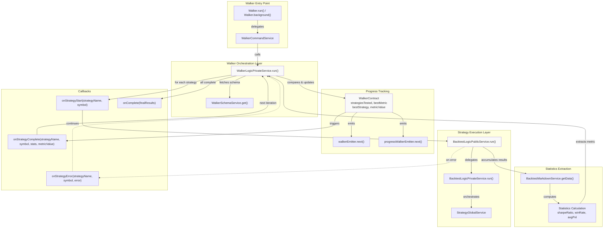
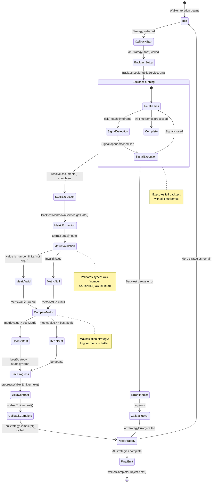
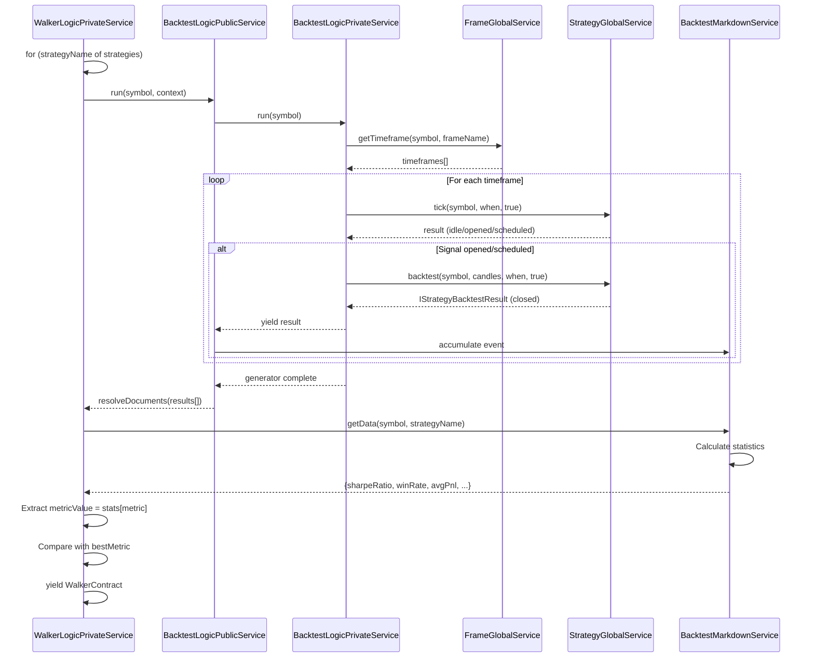
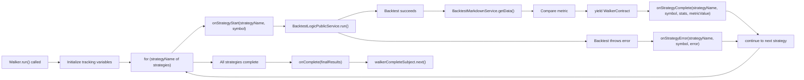

# Walker Execution Flow

<details>
<summary>Relevant source files</summary>

The following files were used as context for generating this wiki page:

- [src/classes/Backtest.ts](src/classes/Backtest.ts)
- [src/classes/Live.ts](src/classes/Live.ts)
- [src/classes/Walker.ts](src/classes/Walker.ts)
- [src/lib/services/connection/StrategyConnectionService.ts](src/lib/services/connection/StrategyConnectionService.ts)
- [src/lib/services/core/StrategyCoreService.ts](src/lib/services/core/StrategyCoreService.ts)
- [src/lib/services/logic/private/BacktestLogicPrivateService.ts](src/lib/services/logic/private/BacktestLogicPrivateService.ts)
- [src/lib/services/logic/private/LiveLogicPrivateService.ts](src/lib/services/logic/private/LiveLogicPrivateService.ts)
- [src/lib/services/logic/private/WalkerLogicPrivateService.ts](src/lib/services/logic/private/WalkerLogicPrivateService.ts)

</details>


## Purpose and Scope

This document describes the execution flow of Walker mode, which orchestrates sequential strategy comparison for metric-based optimization. It focuses on the `WalkerLogicPrivateService` implementation that iterates through strategies, extracts performance metrics, and tracks the best-performing strategy. For details on metric selection and comparison logic, see [Strategy Comparison](#11.2). For report generation and output formats, see [Walker Reports](#11.3). For the Walker API entry points, see [Walker API](#4.5).

## Overview

Walker mode executes a complete backtest for each registered strategy in sequence, comparing their performance using a configurable metric (e.g., `sharpeRatio`, `winRate`). The execution model uses an `AsyncGenerator` pattern to stream progress updates after each strategy completes, enabling real-time monitoring of long-running optimization tasks. The system maintains cumulative tracking of the best strategy across all iterations and emits detailed progress events through the event bus.

The walker execution is stateless between strategy runs, relying on `BacktestLogicPublicService` for individual strategy execution and `BacktestMarkdownService` for metric extraction. This separation allows walker to focus purely on orchestration and comparison logic.

Sources: [src/lib/services/logic/private/WalkerLogicPrivateService.ts:1-254]()

## Execution Architecture



**Diagram: Walker Execution Architecture** - Shows the layered architecture from API entry point through orchestration, strategy execution, statistics extraction, and callback lifecycle.

Sources: [src/lib/services/logic/private/WalkerLogicPrivateService.ts:31-254]()

## Sequential Strategy Iteration

The walker orchestration follows a sequential iteration pattern where each strategy completes its full backtest before the next strategy begins. This approach ensures deterministic execution order and simplifies resource management compared to parallel execution.

### Main Iteration Loop

The core iteration logic resides in `WalkerLogicPrivateService.run()` method, which implements an `AsyncGenerator` that yields after each strategy completes:

| Step | Operation | Code Reference |
|------|-----------|----------------|
| 1 | Initialize tracking variables | `strategiesTested = 0`, `bestMetric = null`, `bestStrategy = null` |
| 2 | Get walker schema | `walkerSchemaService.get(context.walkerName)` |
| 3 | Setup cancellation listener | `walkerStopSubject.filter(...).map(() => CANCEL_SYMBOL)` |
| 4 | Iterate strategies | `for (const strategyName of strategies) { ... }` |
| 5 | Execute strategy backtest | `backtestLogicPublicService.run(symbol, {...})` |
| 6 | Extract statistics | `backtestMarkdownService.getData(symbol, strategyName)` |
| 7 | Compare metric | `metricValue > bestMetric` |
| 8 | Yield progress | `yield walkerContract` |
| 9 | Emit final results | `walkerCompleteSubject.next(finalResults)` |

The iteration maintains strict ordering with no overlap between strategy executions. Each strategy receives the same execution context (`exchangeName`, `frameName`) to ensure fair comparison.

Sources: [src/lib/services/logic/private/WalkerLogicPrivateService.ts:70-252]()

### State Machine for Single Strategy Execution



**Diagram: State Machine for Single Strategy in Walker** - Shows the complete lifecycle of a single strategy execution within the walker loop, from callback invocation through metric extraction to progress emission.

Sources: [src/lib/services/logic/private/WalkerLogicPrivateService.ts:107-228]()

## Backtest Orchestration

Each strategy execution delegates to `BacktestLogicPublicService.run()`, which returns an `AsyncGenerator<IStrategyBacktestResult>`. The walker consumes this generator completely using `resolveDocuments()` to collect all closed signals before proceeding to metric extraction.

### Backtest Execution Context

The walker configures each backtest with a consistent execution context:

```typescript
{
  strategyName: string,      // Current strategy being tested
  exchangeName: string,      // From walker schema
  frameName: string          // From walker schema
}
```

This context is injected into `MethodContextService` and flows through the entire backtest execution pipeline via dependency injection. The symbol parameter is passed explicitly to the backtest runner.

### Integration with BacktestLogicPublicService

The orchestration follows this sequence:



**Diagram: Backtest Orchestration Sequence** - Shows the message flow from walker through backtest execution to statistics extraction.

Sources: [src/lib/services/logic/private/WalkerLogicPrivateService.ts:117-165](), [src/lib/services/logic/private/BacktestLogicPrivateService.ts:62-384]()

### Error Handling During Backtest

If a strategy backtest throws an error, the walker catches it, logs the error, emits to `errorEmitter`, invokes the `onStrategyError` callback if defined, and continues to the next strategy. This fail-fast-per-strategy approach ensures that one broken strategy does not terminate the entire walker run.

```typescript
try {
  result = await Promise.race([
    await resolveDocuments(iterator),
    listenStop,
  ]);
} catch (error) {
  console.warn(`walkerLogicPrivateService backtest failed symbol=${symbol} strategyName=${strategyName}`);
  this.loggerService.warn("walkerLogicPrivateService backtest failed for strategy, skipping", {...});
  await errorEmitter.next(error);
  if (walkerSchema.callbacks?.onStrategyError) {
    walkerSchema.callbacks.onStrategyError(strategyName, symbol, error);
  }
  continue; // Skip to next strategy
}
```

Sources: [src/lib/services/logic/private/WalkerLogicPrivateService.ts:126-147]()

## Metric Extraction and Comparison

After each backtest completes, the walker extracts performance statistics from `BacktestMarkdownService` and compares the configured metric against the current best value.

### Metric Validation Pipeline

The metric extraction implements a strict validation pipeline to handle edge cases:

| Validation | Check | Action on Failure |
|------------|-------|-------------------|
| Type check | `typeof value === 'number'` | Set `metricValue = null` |
| Not null/undefined | `value !== null && value !== undefined` | Set `metricValue = null` |
| NaN check | `!isNaN(value)` | Set `metricValue = null` |
| Finite check | `isFinite(value)` | Set `metricValue = null` |
| Pass all | All checks pass | Set `metricValue = value` |

```typescript
const value = stats[metric];
const metricValue =
  value !== null &&
  value !== undefined &&
  typeof value === "number" &&
  !isNaN(value) &&
  isFinite(value)
    ? value
    : null;
```

Invalid metrics result in `metricValue = null`, which is excluded from best strategy selection. This ensures that strategies producing invalid statistics (e.g., `NaN` Sharpe ratio due to zero volatility) do not win by default.

Sources: [src/lib/services/logic/private/WalkerLogicPrivateService.ts:165-177]()

### Best Strategy Update Logic

The comparison uses a simple maximization strategy where higher metric values are better:

```typescript
const isBetter =
  bestMetric === null ||
  (metricValue !== null && metricValue > bestMetric);

if (isBetter && metricValue !== null) {
  bestMetric = metricValue;
  bestStrategy = strategyName;
}
```

Key behaviors:
- **First valid strategy**: Always becomes best if `bestMetric === null` initially
- **Null metrics**: Strategies with `metricValue === null` never become best
- **Ties**: First strategy to achieve a tied metric wins (no tie-breaking logic)
- **Maximization only**: The system does not support minimization metrics (e.g., max drawdown)

For metric selection details and supported metrics, see [Strategy Comparison](#11.2).

Sources: [src/lib/services/logic/private/WalkerLogicPrivateService.ts:179-187]()

## Progress Tracking and Emission

The walker emits two types of progress updates: fine-grained progress events via `progressWalkerEmitter` and rich contract objects via `walkerEmitter`.

### WalkerContract Structure

Each iteration yields a `WalkerContract` object containing cumulative progress state:

```typescript
interface WalkerContract {
  walkerName: string;           // Walker identifier
  exchangeName: string;         // Exchange context
  frameName: string;            // Frame context
  symbol: string;               // Trading symbol
  strategyName: string;         // Current strategy just completed
  stats: object;                // Full statistics for current strategy
  metricValue: number | null;   // Extracted metric (null if invalid)
  metric: WalkerMetric;         // Metric name being compared
  bestMetric: number | null;    // Best metric value so far
  bestStrategy: StrategyName | null; // Best strategy so far
  strategiesTested: number;     // Cumulative count
  totalStrategies: number;      // Total strategies to test
}
```

The contract is yielded after each strategy completes, enabling consumers to track real-time progress:

```typescript
for await (const progress of walkerLogic.run(...)) {
  console.log(`${progress.strategiesTested}/${progress.totalStrategies}`);
  console.log(`Best so far: ${progress.bestStrategy} = ${progress.bestMetric}`);
}
```

Sources: [src/lib/services/logic/private/WalkerLogicPrivateService.ts:190-203](), [src/contract/Walker.contract.ts]()

### Progress Event Emission

The walker emits progress events through two channels:

1. **progressWalkerEmitter**: Emits after each strategy completes with simple progress percentage
2. **walkerEmitter**: Emits full `WalkerContract` object with all context

```typescript
// Progress event (simple)
await progressWalkerEmitter.next({
  walkerName: context.walkerName,
  exchangeName: context.exchangeName,
  frameName: context.frameName,
  symbol,
  totalStrategies: strategies.length,
  processedStrategies: strategiesTested,
  progress: strategies.length > 0 ? strategiesTested / strategies.length : 0,
});

// Walker event (rich contract)
await walkerEmitter.next(walkerContract);
```

Consumers can listen to either channel:
- Use `listenWalkerProgress()` for simple progress bars
- Use `listenWalker()` for detailed monitoring with metric values

Sources: [src/lib/services/logic/private/WalkerLogicPrivateService.ts:206-227](), [src/config/emitters.ts]()

### Final Results Emission

After all strategies complete, the walker emits a final summary via `walkerCompleteSubject`:

```typescript
const finalResults = {
  walkerName: context.walkerName,
  symbol,
  exchangeName: context.exchangeName,
  frameName: context.frameName,
  metric,
  totalStrategies: strategies.length,
  bestStrategy,
  bestMetric,
  bestStats: bestStrategy !== null
    ? await this.backtestMarkdownService.getData(symbol, bestStrategy)
    : null,
};

await walkerCompleteSubject.next(finalResults);
```

This final emission includes the full statistics object for the best strategy, enabling post-processing and report generation.

Sources: [src/lib/services/logic/private/WalkerLogicPrivateService.ts:230-250]()

## Callback Lifecycle

The walker schema supports four lifecycle callbacks that execute at specific points during orchestration:

### Callback Invocation Points



**Diagram: Walker Callback Invocation Points** - Shows the four callback types and when they execute during the walker lifecycle.

Sources: [src/lib/services/logic/private/WalkerLogicPrivateService.ts:109-248]()

### Callback Signatures

| Callback | Signature | When Invoked | Use Case |
|----------|-----------|--------------|----------|
| `onStrategyStart` | `(strategyName: string, symbol: string) => void` | Before backtest starts | Initialize strategy-specific state, log start |
| `onStrategyComplete` | `(strategyName: string, symbol: string, stats: object, metricValue: number \| null) => void` | After metrics extracted, before yield | Process results, update external state |
| `onStrategyError` | `(strategyName: string, symbol: string, error: Error) => void` | Backtest throws exception | Log errors, alert monitoring |
| `onComplete` | `(finalResults: object) => void` | After all strategies complete | Generate final report, persist best strategy |

Callbacks are optional and defined in the walker schema passed to `addWalker()`. All callbacks execute synchronously in the main execution flow.

Sources: [src/lib/services/logic/private/WalkerLogicPrivateService.ts:109-248](), [src/interfaces/Walker.interface.ts]()

### Example Callback Implementation

```typescript
addWalker({
  walkerName: "strategy-optimizer",
  strategies: ["strat-v1", "strat-v2", "strat-v3"],
  metric: "sharpeRatio",
  exchangeName: "binance",
  frameName: "2023-backtest",
  callbacks: {
    onStrategyStart: (strategyName, symbol) => {
      console.log(`[START] ${strategyName} on ${symbol}`);
    },
    onStrategyComplete: (strategyName, symbol, stats, metricValue) => {
      console.log(`[DONE] ${strategyName}: ${metricValue}`);
      // Store in database for historical tracking
      db.insertWalkerResult(strategyName, symbol, stats);
    },
    onStrategyError: (strategyName, symbol, error) => {
      console.error(`[ERROR] ${strategyName}: ${error.message}`);
      alerting.sendSlackMessage(`Strategy ${strategyName} failed`);
    },
    onComplete: (finalResults) => {
      console.log(`Winner: ${finalResults.bestStrategy} = ${finalResults.bestMetric}`);
      // Deploy best strategy to production
      deployment.deploy(finalResults.bestStrategy);
    }
  }
});
```

Sources: [src/lib/services/logic/private/WalkerLogicPrivateService.ts:109-248]()

## Cancellation Mechanism

The walker supports mid-execution cancellation via the `walkerStopSubject` event stream. This enables external systems to terminate long-running walker processes without waiting for all strategies to complete.

### Cancellation Implementation

The walker sets up a cancellation listener before the strategy loop begins:

```typescript
const CANCEL_SYMBOL = Symbol("CANCEL_SYMBOL");

let pendingStrategy: string;

const listenStop = walkerStopSubject
  .filter((data) => {
    let isOk = true;
    isOk = isOk && data.symbol === symbol;
    isOk = isOk && data.strategyName === pendingStrategy;
    return isOk;
  })
  .map(() => CANCEL_SYMBOL)
  .toPromise();
```

The listener filters stop events by matching `symbol` and `strategyName`, ensuring that only relevant stop signals trigger cancellation. The `CANCEL_SYMBOL` sentinel value distinguishes cancellation from normal backtest completion.

Sources: [src/lib/services/logic/private/WalkerLogicPrivateService.ts:19-104]()

### Race Condition Handling

Each strategy execution races between normal completion and cancellation:

```typescript
for (const strategyName of strategies) {
  pendingStrategy = strategyName; // Update filter context
  
  const iterator = this.backtestLogicPublicService.run(symbol, {...});
  
  let result = await Promise.race([
    await resolveDocuments(iterator), // Normal completion
    listenStop,                        // Cancellation signal
  ]);
  
  if (result === CANCEL_SYMBOL) {
    this.loggerService.info("walkerLogicPrivateService received stop signal, cancelling walker", {...});
    break; // Exit strategy loop
  }
  
  // Continue with metric extraction...
}
```

The race pattern ensures immediate response to cancellation without waiting for the current backtest to complete. The strategy loop breaks immediately upon receiving `CANCEL_SYMBOL`, skipping remaining strategies.

Sources: [src/lib/services/logic/private/WalkerLogicPrivateService.ts:126-157]()

### Triggering Cancellation

External code can trigger cancellation by emitting to `walkerStopSubject`:

```typescript
import { walkerStopSubject } from "./config/emitters";

// Cancel specific walker execution
walkerStopSubject.next({
  symbol: "BTCUSDT",
  strategyName: "current-strategy-name", // Must match pendingStrategy
});
```

The cancellation is non-destructive: already-completed strategies retain their results, and the walker emits a final `walkerCompleteSubject` event with partial results. However, `onComplete` callback still executes, receiving results from only the strategies that completed before cancellation.

Sources: [src/lib/services/logic/private/WalkerLogicPrivateService.ts:96-157]()

## AsyncGenerator Streaming Pattern

The walker uses an `AsyncGenerator` return type to enable streaming consumption of results without accumulating all data in memory. This pattern supports early termination and real-time progress monitoring.

### Generator Signature

```typescript
public async *run(
  symbol: string,
  strategies: StrategyName[],
  metric: WalkerMetric,
  context: {
    exchangeName: string;
    frameName: string;
    walkerName: string;
  }
): AsyncGenerator<WalkerContract>
```

The generator yields after each strategy completes, producing an unbounded stream for potentially large strategy sets.

Sources: [src/lib/services/logic/private/WalkerLogicPrivateService.ts:70-79]()

### Consumption Patterns

**Pattern 1: Complete consumption with resolveDocuments()**

```typescript
const results = await resolveDocuments(walkerLogic.run(symbol, strategies, metric, context));
// results: WalkerContract[] - all strategies completed
```

This pattern buffers all results in memory and waits for the walker to complete.

**Pattern 2: Streaming consumption with for-await-of**

```typescript
for await (const contract of walkerLogic.run(symbol, strategies, metric, context)) {
  console.log(`Progress: ${contract.strategiesTested}/${contract.totalStrategies}`);
  console.log(`Current: ${contract.strategyName} = ${contract.metricValue}`);
  console.log(`Best: ${contract.bestStrategy} = ${contract.bestMetric}`);
  
  // Early termination possible
  if (contract.bestMetric > 2.0) {
    console.log("Found excellent strategy, stopping search");
    break;
  }
}
```

This pattern processes results one at a time without accumulation, enabling memory-efficient monitoring.

**Pattern 3: Callback-based consumption via events**

```typescript
listenWalker((contract) => {
  updateDashboard(contract);
});

// Walker runs in background, callbacks fire as progress occurs
Walker.background(symbol);
```

This pattern decouples walker execution from result consumption via the event bus.

Sources: [src/lib/services/logic/private/WalkerLogicPrivateService.ts:70-252]()

### Memory Efficiency

The generator pattern provides constant memory overhead regardless of strategy count, as only one `WalkerContract` exists in memory at a time during streaming consumption. The backtest results from previous strategies are released as soon as their metrics are extracted, preventing accumulation of large signal datasets. The walker itself maintains only scalar tracking state (`bestMetric`, `bestStrategy`, `strategiesTested`).

For walker executions testing hundreds of strategies over years of data, this streaming architecture prevents out-of-memory errors that would occur with array accumulation patterns.

Sources: [src/lib/services/logic/private/WalkerLogicPrivateService.ts:1-254]()