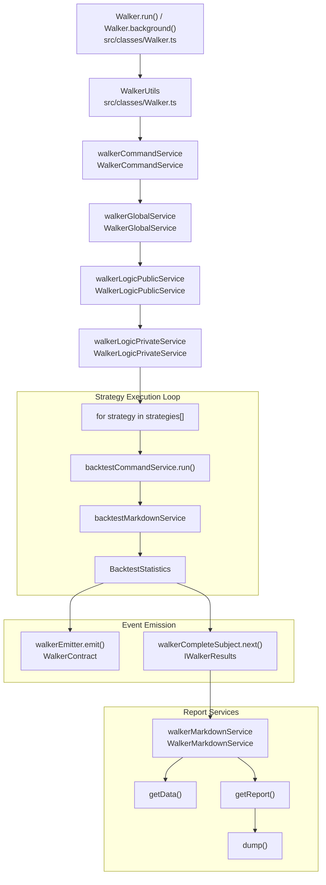
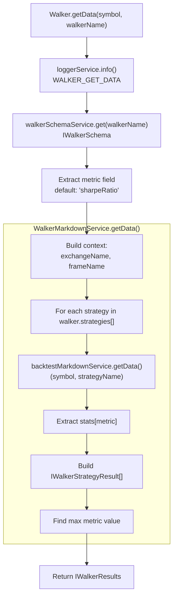
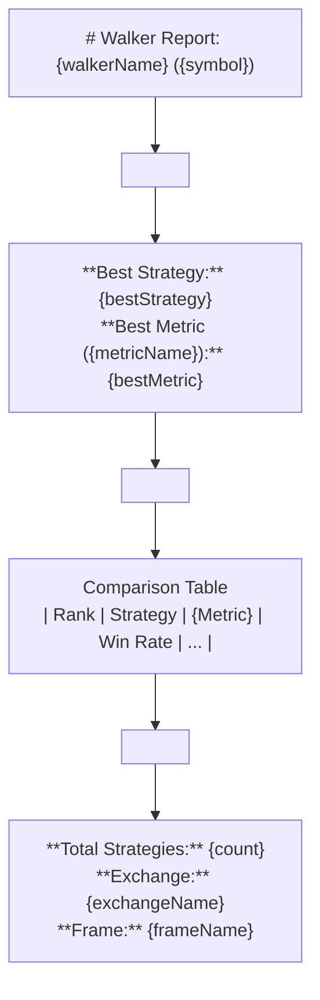
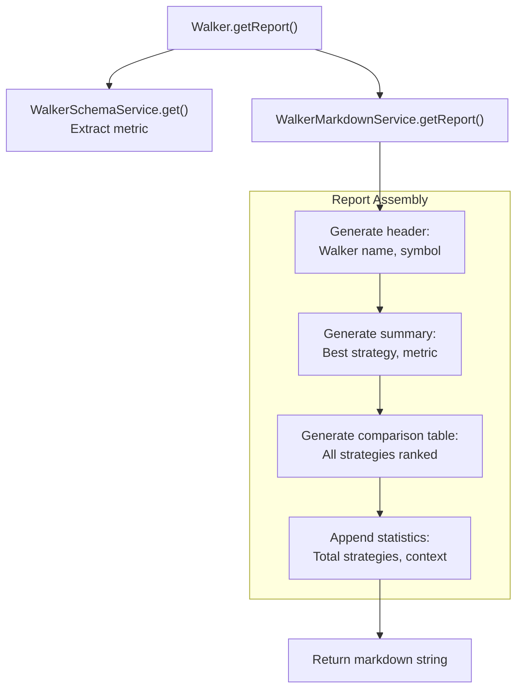
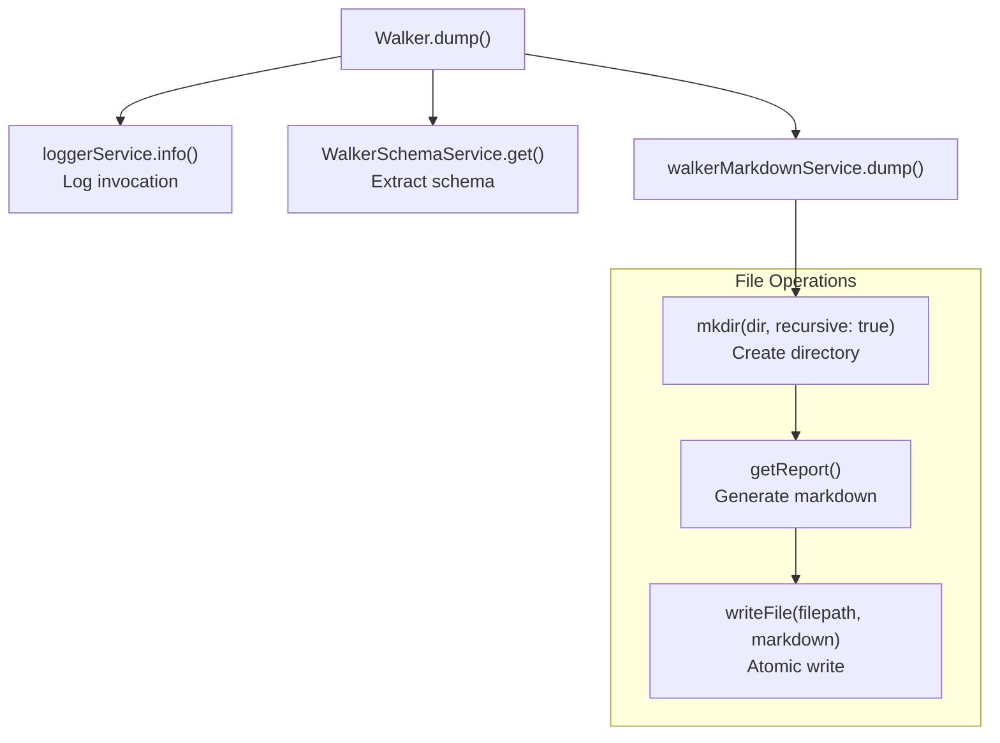
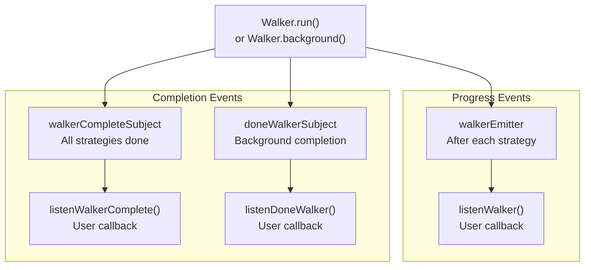
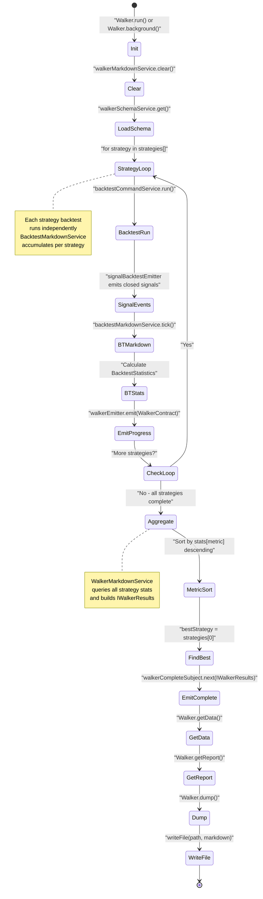
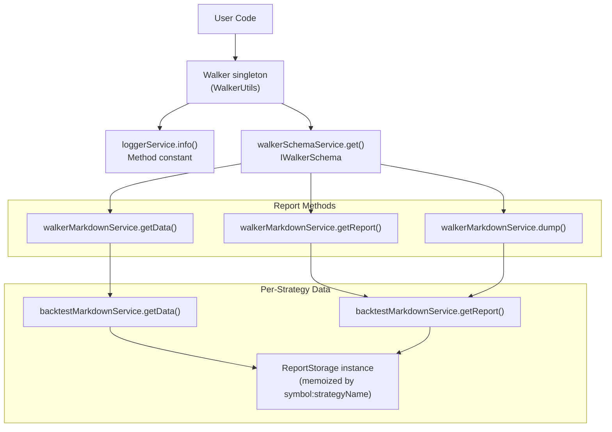

# Walker Reports

<details>
<summary>Relevant source files</summary>

The following files were used as context for generating this wiki page:

- [README.md](README.md)
- [docs/classes/BacktestCommandService.md](docs/classes/BacktestCommandService.md)
- [docs/classes/BacktestUtils.md](docs/classes/BacktestUtils.md)
- [docs/classes/LiveCommandService.md](docs/classes/LiveCommandService.md)
- [docs/classes/LiveUtils.md](docs/classes/LiveUtils.md)
- [docs/index.md](docs/index.md)
- [src/lib/services/markdown/BacktestMarkdownService.ts](src/lib/services/markdown/BacktestMarkdownService.ts)
- [src/lib/services/markdown/LiveMarkdownService.ts](src/lib/services/markdown/LiveMarkdownService.ts)
- [src/lib/services/markdown/ScheduleMarkdownService.ts](src/lib/services/markdown/ScheduleMarkdownService.ts)

</details>


This page documents the reporting and data retrieval functionality for Walker mode, which provides multi-strategy comparison results and performance rankings. Walker reports aggregate backtest statistics from multiple strategies and present them in a unified format for analysis.

For information about Walker execution flow and strategy iteration, see [Walker Execution Flow](#11.1). For details on how strategies are compared and ranked, see [Strategy Comparison](#11.2).

---

## Purpose and Scope

Walker reports provide structured access to multi-strategy comparison results through three primary APIs:

1. **`Walker.getData()`** - Returns raw comparison data as structured objects
2. **`Walker.getReport()`** - Generates formatted markdown reports with tables
3. **`Walker.dump()`** - Persists reports to disk

These APIs are thin wrappers around `WalkerMarkdownService`, which accumulates strategy results during walker execution and formats them for consumption.

Sources: [src/classes/Walker.ts:1-273]()

---

## Walker Report Data Flow

The following diagram shows how walker reports are generated from strategy execution through to final output, mapping user-facing APIs to internal service implementations:



Sources: [src/classes/Walker.ts:1-273](), [src/lib/services/global/WalkerGlobalService.ts:1-90](), [src/config/emitters.ts:62-73](), [docs/classes/WalkerUtils.md:1-54]()

---

## Walker.getData() - Structured Results

The `Walker.getData()` method returns raw comparison data as a structured object without formatting. This is useful for programmatic access to walker results.

### Method Signature

```typescript
Walker.getData(
  symbol: string,
  walkerName: WalkerName
): Promise<IWalkerResults>
```

### Parameters

| Parameter | Type | Description |
|-----------|------|-------------|
| `symbol` | `string` | Trading pair symbol (e.g., "BTCUSDT") |
| `walkerName` | `WalkerName` | Walker schema name registered via `addWalker()` |

### Return Type Structure

The method returns an `IWalkerResults` object (defined in [interfaces/Walker.interface.ts]()) containing:

| Field | Type | Description |
|-------|------|-------------|
| `bestStrategy` | `StrategyName` | Name of the strategy with the highest metric value |
| `bestMetric` | `number` | The highest metric value achieved across all strategies |
| `strategies` | `IWalkerStrategyResult[]` | Array of strategy comparison results, sorted by metric (descending) |

Each `IWalkerStrategyResult` in the `strategies` array contains:

| Field | Type | Description |
|-------|------|-------------|
| `strategyName` | `StrategyName` | Strategy identifier from walker schema |
| `stats` | `BacktestStatistics` | Full backtest statistics (totalSignals, winRate, avgPnl, sharpeRatio, etc.) |
| `metric` | `number` | Extracted metric value used for ranking (e.g., stats.sharpeRatio) |

### Implementation Details



The method performs the following steps:

1. Logs invocation with `loggerService.info()` using `WALKER_GET_DATA` constant
2. Retrieves walker schema via `walkerSchemaService.get(walkerName)` to access strategy list and metric
3. Extracts `metric` field from schema (defaults to `"sharpeRatio"` if not specified)
4. Delegates to `walkerMarkdownService.getData()` with symbol, walker name, metric, and context
5. For each strategy in walker schema:
   - Calls `backtestMarkdownService.getData(symbol, strategyName)` to get `BacktestStatistics`
   - Extracts the specific metric value from stats (e.g., `stats.sharpeRatio`)
   - Builds `IWalkerStrategyResult` object
6. Sorts strategies by metric value (descending)
7. Identifies best strategy and best metric value
8. Returns structured `IWalkerResults` object

Sources: [src/classes/Walker.ts:159-179](), [docs/classes/WalkerUtils.md:37-44]()

### Usage Example

From the README, the typical usage pattern:

```typescript
// Get raw comparison data
const results = await Walker.getData("BTCUSDT", "btc-walker");
console.log(results);
// Returns:
// {
//   bestStrategy: "strategy-b",
//   bestMetric: 1.85,
//   strategies: [
//     { strategyName: "strategy-a", stats: { sharpeRatio: 1.23, ... }, metric: 1.23 },
//     { strategyName: "strategy-b", stats: { sharpeRatio: 1.85, ... }, metric: 1.85 },
//     { strategyName: "strategy-c", stats: { sharpeRatio: 0.98, ... }, metric: 0.98 }
//   ]
// }
```

Sources: [README.md:441-454]()

---

## Walker.getReport() - Markdown Generation

The `Walker.getReport()` method generates a formatted markdown report with comparison tables and performance rankings.

### Method Signature

```typescript
Walker.getReport(
  symbol: string,
  walkerName: WalkerName
): Promise<string>
```

### Report Structure

The generated markdown report follows this structure:



Report sections:

1. **Header** - Markdown H1 with walker name and symbol
2. **Summary Section** - Best performing strategy and its metric value
3. **Comparison Table** - All strategies ranked by metric with key performance indicators
4. **Footer Statistics** - Total strategies tested, exchange name, frame name

### Report Generation Flow



### Implementation

The method follows this delegation chain:

1. `Walker.getReport()` validates inputs and logs invocation
2. Retrieves walker schema to extract `exchangeName`, `frameName`, and `metric`
3. Delegates to `walkerMarkdownService.getReport()` with full context
4. Returns formatted markdown string

Sources: [src/classes/Walker.ts:194-214]()

---

## Walker.dump() - Report Persistence

The `Walker.dump()` method saves the generated markdown report to disk with automatic directory creation.

### Method Signature

```typescript
Walker.dump(
  symbol: string,
  walkerName: WalkerName,
  path?: string
): Promise<void>
```

### Parameters

| Parameter | Type | Default | Description |
|-----------|------|---------|-------------|
| `symbol` | `string` | Required | Trading pair symbol |
| `walkerName` | `WalkerName` | Required | Walker schema name |
| `path` | `string` | `"./logs/walker"` | Directory path for report output |

### File Naming Convention

Reports are saved with the following pattern:

```
{path}/{walkerName}.md
```

For example:
- Default: `./logs/walker/btc-walker.md`
- Custom: `./custom/path/btc-walker.md`

### Implementation



The method performs atomic file writes to prevent corruption:

1. Creates target directory with `mkdir(dir, { recursive: true })`
2. Generates full report content via `getReport()`
3. Writes to disk with `writeFile()` in UTF-8 encoding
4. Logs success or error messages to console

Sources: [src/classes/Walker.ts:232-255]()

### Usage Example

```typescript
// Save to default path: ./logs/walker/my-walker.md
await Walker.dump("BTCUSDT", "my-walker");

// Save to custom path: ./custom/path/my-walker.md
await Walker.dump("BTCUSDT", "my-walker", "./custom/path");
```

Sources: [README.md:224-230]()

---

## Comparison Metrics

Walker reports support multiple metrics for strategy ranking. The metric is specified in the walker schema via the `metric` field.

### Available Metrics

| Metric Name | Type | Description | Calculation | Direction |
|-------------|------|-------------|-------------|-----------|
| `sharpeRatio` | `number` | Risk-adjusted return | `avgPnl / stdDev` | Higher is better |
| `annualizedSharpeRatio` | `number` | Annualized Sharpe | `sharpeRatio × √365` | Higher is better |
| `winRate` | `number` | Win percentage | `(winCount / totalSignals) × 100` | Higher is better |
| `avgPnl` | `number` | Average PNL percentage | `sum(pnl) / totalSignals` | Higher is better |
| `totalPnl` | `number` | Cumulative PNL percentage | `sum(pnl)` | Higher is better |
| `certaintyRatio` | `number` | Win/loss ratio | `avgWin / |avgLoss|` | Higher is better |
| `expectedYearlyReturns` | `number` | Projected annual returns | `avgPnl × (365 / avgDurationDays)` | Higher is better |

### Default Metric

If no metric is specified in the walker schema, `"sharpeRatio"` is used as the default:

```typescript
const metric = walkerSchema.metric || "sharpeRatio";
```

Sources: [README.md:461-466](), [src/classes/Walker.ts:173]()

### Metric Selection Example

Walker schema with custom metric:

```typescript
addWalker({
  walkerName: "btc-walker",
  exchangeName: "binance",
  frameName: "1d-backtest",
  strategies: ["strategy-a", "strategy-b", "strategy-c"],
  metric: "sharpeRatio", // Metric for strategy comparison
  callbacks: {
    onComplete: (results) => {
      console.log("Best strategy:", results.bestStrategy);
      console.log("Best metric:", results.bestMetric);
    },
  },
});
```

Sources: [README.md:411-429]()

---

## Report Format and Tables

Walker reports use markdown tables to present comparison data in a structured format.

### Comparison Table Structure

The comparison table uses markdown table syntax to rank strategies by the selected metric:

```
| Rank | Strategy | {Metric} | Win Rate | Avg PNL | Total PNL | Trades |
|------|----------|----------|----------|---------|-----------|--------|
| 1    | ...      | ...      | ...      | ...     | ...       | ...    |
| 2    | ...      | ...      | ...      | ...     | ...       | ...    |
```

Column definitions follow the same pattern as `BacktestMarkdownService`:

| Column | Source Field | Format | Description |
|--------|-------------|--------|-------------|
| **Rank** | Array index + 1 | `1`, `2`, `3`, ... | Position in sorted order |
| **Strategy** | `strategyName` | String | Strategy identifier |
| **{Metric}** | `metric` value | `1.85`, `1.23`, ... | Selected metric (e.g., "Sharpe Ratio") |
| **Win Rate** | `stats.winRate` | `68.5%` | Percentage of winning trades |
| **Avg PNL** | `stats.avgPnl` | `+1.45%` | Average profit/loss per trade |
| **Total PNL** | `stats.totalPnl` | `+12.30%` | Cumulative profit/loss |
| **Trades** | `stats.totalSignals` | `38` | Total number of closed signals |

Strategies are sorted by metric value in descending order (highest metric first). Null or unsafe metric values (NaN, Infinity) are displayed as "N/A".

### Example Report Output

From the README documentation:

```markdown
# Walker Report: btc-walker (BTCUSDT)

**Best Strategy:** strategy-b
**Best Metric (sharpeRatio):** 1.85

| Rank | Strategy | Sharpe Ratio | Win Rate | Avg PNL | Total PNL | Trades |
|------|----------|--------------|----------|---------|-----------|--------|
| 1    | strategy-b | 1.85 | 68.5% | +1.45% | +12.30% | 38 |
| 2    | strategy-a | 1.23 | 72.3% | +0.34% | +15.50% | 45 |
| 3    | strategy-c | 0.98 | 65.2% | +1.20% | +10.20% | 25 |

**Total Strategies:** 3
**Exchange:** binance
**Frame:** 1d-backtest
```

Sources: [README.md:407-459]()

---

## Integration with Event System

Walker reports integrate with the event system to provide real-time updates and completion notifications.

### Event Flow Diagram



### Event Types and Usage

| Event | Emitter | Purpose | Payload |
|-------|---------|---------|---------|
| Walker Progress | `walkerEmitter` | Emitted after each strategy completes | `WalkerContract` with progress |
| Walker Complete | `walkerCompleteSubject` | Emitted when all strategies finish | `IWalkerResults` with rankings |
| Background Done | `doneWalkerSubject` | Emitted when `Walker.background()` finishes | `DoneContract` with context |

Sources: [src/config/emitters.ts:62-73](), [src/function/event.ts:507-557]()

### Event Listener Example

```typescript
import { listenWalkerComplete, Walker } from "backtest-kit";

// Listen to walker completion
listenWalkerComplete((results) => {
  console.log("Walker completed:", results.bestStrategy);
  Walker.dump("BTCUSDT", results.walkerName); // Save report
});

// Run walker in background
Walker.background("BTCUSDT", {
  walkerName: "btc-walker"
});
```

Sources: [README.md:436-440](), [src/function/event.ts:528-557]()

---

## Report Data Lifecycle

The following state diagram illustrates the complete lifecycle of walker report data from execution through persistence:



**Key Persistence Points:**
- Backtest signals are accumulated in `backtestMarkdownService` per strategy-symbol pair
- Walker results are built on-demand by querying accumulated backtest statistics
- Final reports are written atomically to `{path}/{walkerName}.md` with `mkdir(recursive: true)`

Sources: [src/classes/Walker.ts:1-273](), [src/lib/services/markdown/BacktestMarkdownService.ts:370-542](), [docs/classes/WalkerUtils.md:1-54]()

---

## API Reference Summary

### Walker Class Public Methods

| Method | Return Type | Description | Default Path |
|--------|-------------|-------------|--------------|
| `Walker.getData(symbol, walkerName)` | `Promise<IWalkerResults>` | Returns structured comparison data | N/A |
| `Walker.getReport(symbol, walkerName)` | `Promise<string>` | Generates markdown report string | N/A |
| `Walker.dump(symbol, walkerName, path?)` | `Promise<void>` | Saves report to disk | `./logs/walker` |
| `Walker.run(symbol, context)` | `AsyncGenerator` | Runs walker with progress updates | N/A |
| `Walker.background(symbol, context)` | `Function` | Runs walker in background, returns cancel function | N/A |

### Method Call Chain



**Delegation Pattern:**

1. User calls `Walker.getData()`, `Walker.getReport()`, or `Walker.dump()`
2. `Walker` (singleton `WalkerUtils` instance) logs invocation with method constant
3. `Walker` retrieves walker schema via `walkerSchemaService.get(walkerName)`
4. `Walker` delegates to corresponding `walkerMarkdownService` method with context
5. `WalkerMarkdownService` iterates through strategies array from schema
6. For each strategy, queries `backtestMarkdownService.getData(symbol, strategyName)`
7. `BacktestMarkdownService` returns statistics from memoized `ReportStorage` instance
8. `WalkerMarkdownService` aggregates results, sorts by metric, and formats output
9. For `dump()`, writes markdown to disk with atomic `writeFile()` operation

Sources: [src/classes/Walker.ts:159-255](), [src/lib/services/markdown/BacktestMarkdownService.ts:370-495](), [docs/classes/WalkerUtils.md:1-54]()

---

## Clear Operation

Walker markdown service supports clearing accumulated data, similar to backtest and live services:

```typescript
// Clear data for specific walker
backtest.walkerMarkdownService.clear("my-walker");

// This is done automatically in Walker.run() before execution
```

The `Walker.run()` method automatically clears walker markdown data before execution to ensure fresh results:

```typescript
backtest.walkerMarkdownService.clear(context.walkerName);
```

Sources: [src/classes/Walker.ts:61]()