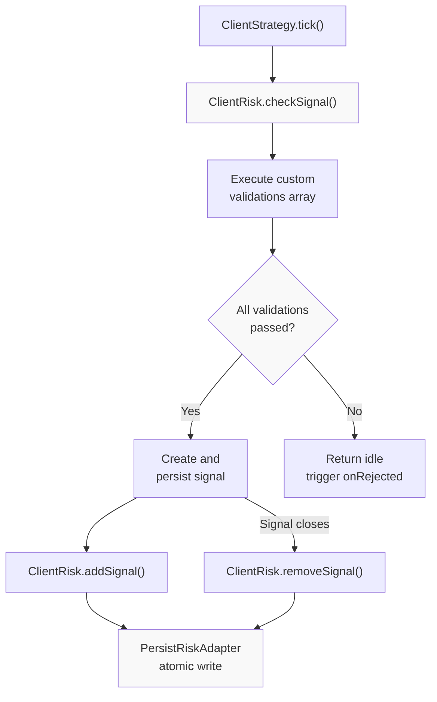
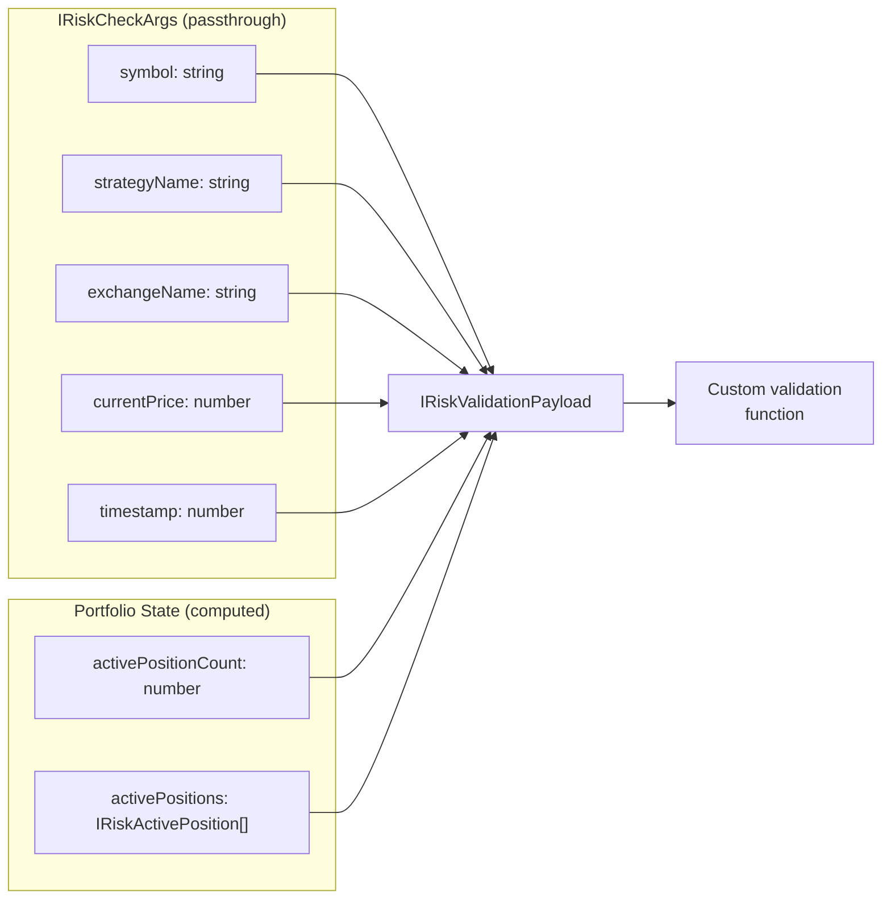
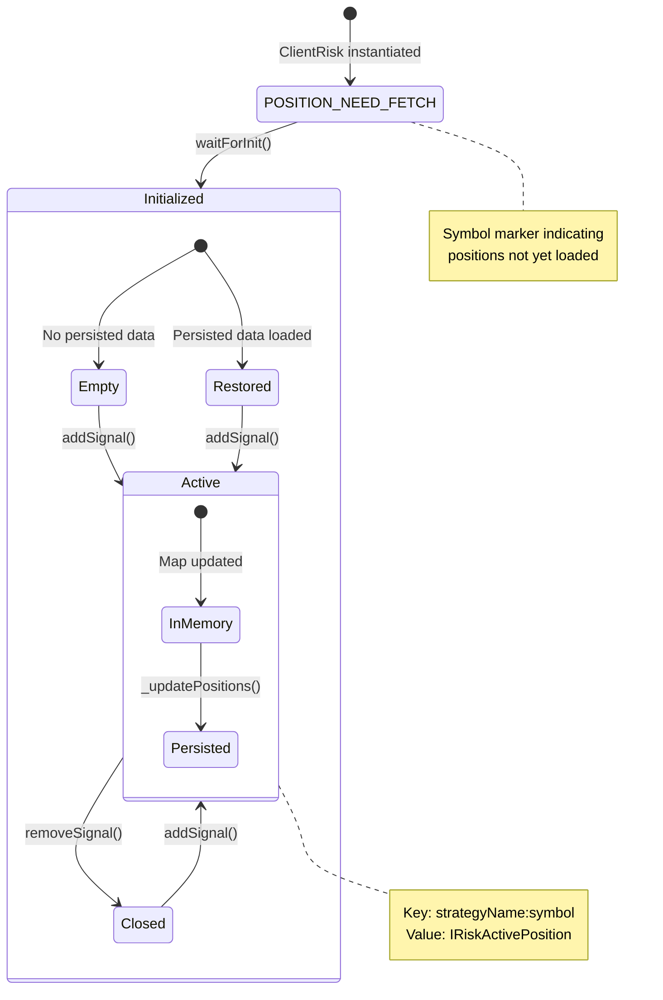
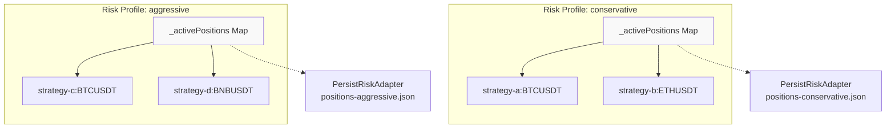
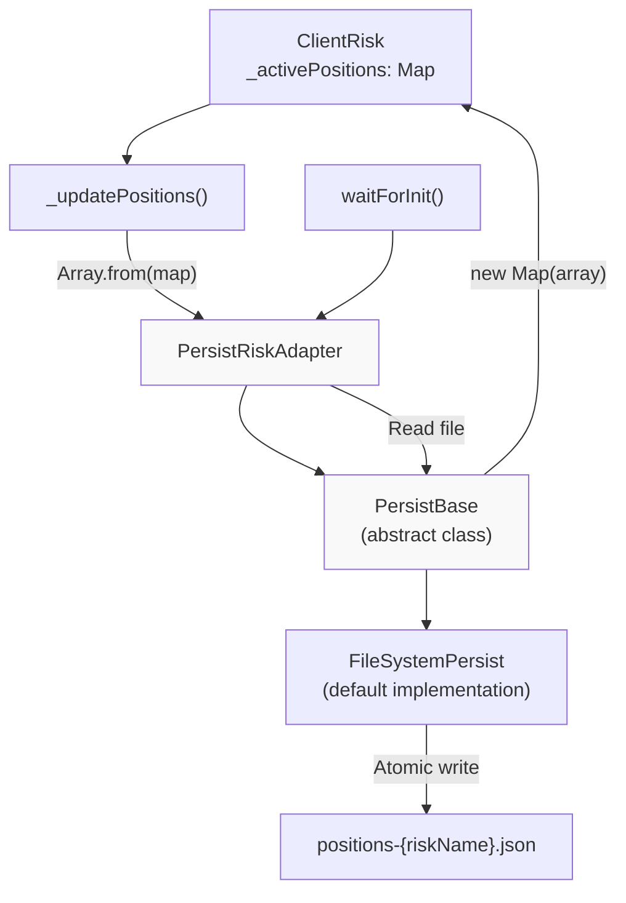
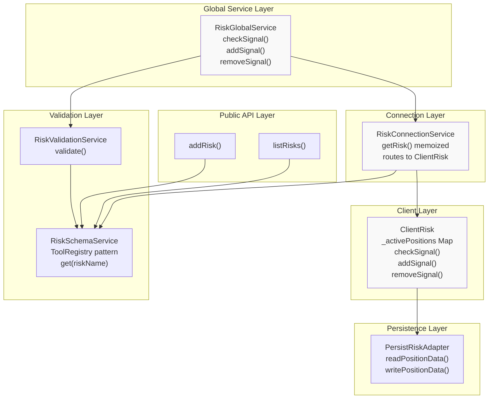

# Risk Management

This document covers the risk management system in backtest-kit, which provides portfolio-level controls to prevent signals that violate configured limits. The system tracks active positions across strategies, executes custom validation logic, and persists state for crash recovery.

For information about risk profiles in strategy schemas, see [Component Types](#5). For risk validation callback configuration, see [Strategy Schemas](#5.1).

---

## Overview

The risk management system prevents signal generation when portfolio conditions violate defined limits. Key capabilities:

- **Portfolio-level tracking**: Monitor positions across all strategies sharing a risk profile
- **Custom validations**: User-defined validation functions with full portfolio state access
- **Isolation by riskName**: Multiple risk profiles operate independently
- **Crash-safe persistence**: Active positions restored on restart in live mode
- **Pre-signal validation**: Risk checks occur before signal creation

**Architecture Flow**



Sources: [src/client/ClientRisk.ts:165-217](), [src/interfaces/Risk.interface.ts:1-145]()

---

## Risk Schema Registration

Risk profiles are registered via `addRisk()` and define validation logic through custom functions.

**IRiskSchema Structure**

| Field | Type | Description |
|-------|------|-------------|
| `riskName` | `RiskName` (string) | Unique identifier for the risk profile |
| `note` | `string` (optional) | Developer documentation |
| `validations` | `Array<IRiskValidation \| IRiskValidationFn>` | Custom validation functions array |
| `callbacks` | `Partial<IRiskCallbacks>` (optional) | Event callbacks (`onRejected`, `onAllowed`) |

**Registration Example**

```typescript
addRisk({
  riskName: "conservative",
  note: "Maximum 3 concurrent positions",
  validations: [
    {
      validate: ({ activePositionCount }) => {
        if (activePositionCount >= 3) {
          throw new Error("Max 3 positions exceeded");
        }
      },
      note: "Limit concurrent positions"
    }
  ],
  callbacks: {
    onRejected: (symbol, params) => {
      console.log(`Signal rejected for ${symbol}`);
    }
  }
});
```

**Validation Function Types**

Validations can be provided as:
1. **Function**: `(payload: IRiskValidationPayload) => void | Promise<void>`
2. **Object**: `{ validate: IRiskValidationFn, note?: string }`

Both throw errors to reject signals. The object form allows documentation via `note` field.

Sources: [src/interfaces/Risk.interface.ts:87-100](), [test/spec/risk.test.mjs:9-18]()

---

## Risk Validation Flow

Risk validation occurs before signal creation. The process executes all custom validations with full portfolio state access.

**Validation Payload Structure**



Sources: [src/interfaces/Risk.interface.ts:10-60]()

**Validation Execution Process**

The validation flow in [ClientRisk.checkSignal:165-217]() follows this sequence:

1. **Initialize positions**: Load persisted state if first call via `waitForInit()`
2. **Build payload**: Combine passthrough args with portfolio state
3. **Execute validations**: Run each validation function sequentially
4. **Short-circuit on error**: Stop immediately if any validation throws
5. **Trigger callbacks**: Call `onRejected` or `onAllowed` based on result
6. **Return boolean**: `true` if allowed, `false` if rejected

**Error Handling**

Validations wrapped by `DO_VALIDATION_FN` [src/client/ClientRisk.ts:31-46]():
- Catches thrown errors and returns `false`
- Logs error details via `LoggerService`
- Emits error to `validationSubject` for monitoring

Sources: [src/client/ClientRisk.ts:165-217](), [src/client/ClientRisk.ts:31-46]()

---

## Position Tracking

`ClientRisk` tracks active positions across all strategies sharing the same risk profile. Positions are identified by `${strategyName}:${symbol}` keys.

**Position Lifecycle**



Sources: [src/client/ClientRisk.ts:73-150]()

**Active Position Map**

The `_activePositions` field [src/client/ClientRisk.ts:79]() uses a discriminated type:
- Initial value: `POSITION_NEED_FETCH` symbol
- After initialization: `Map<string, IRiskActivePosition>`

Key generation via `GET_KEY_FN` [src/client/ClientRisk.ts:27-28]():
```typescript
const GET_KEY_FN = (strategyName: string, symbol: string) =>
  `${strategyName}:${symbol}`;
```

**Position Data Structure**

```typescript
interface IRiskActivePosition {
  signal: ISignalRow;       // Signal details (null in current implementation)
  strategyName: string;     // Strategy owning position
  exchangeName: string;     // Exchange name
  openTimestamp: number;    // Unix timestamp when opened
}
```

Sources: [src/interfaces/Risk.interface.ts:23-35](), [src/client/ClientRisk.ts:27-28]()

---

## Position Add/Remove Operations

**addSignal Flow**

[ClientRisk.addSignal:107-128]() registers a new position:

1. Wait for initialization if needed
2. Generate key: `${strategyName}:${symbol}`
3. Add entry to `_activePositions` Map
4. Persist to disk via `_updatePositions()`

**removeSignal Flow**

[ClientRisk.removeSignal:134-150]() removes a closed position:

1. Wait for initialization if needed
2. Generate key: `${strategyName}:${symbol}`
3. Delete entry from `_activePositions` Map
4. Persist to disk via `_updatePositions()`

**Isolation by Risk Profile**



Each `ClientRisk` instance has its own `_activePositions` Map. Multiple strategies can share a risk profile to enable cross-strategy position limits.

Sources: [src/client/ClientRisk.ts:107-150](), [test/spec/risk.test.mjs:374-437]()

---

## Persistence Layer

Risk positions are persisted via `PersistRiskAdapter` for crash recovery in live mode. Backtest mode skips persistence.

**PersistRiskAdapter Architecture**



Sources: [src/client/ClientRisk.ts:88-101](), [src/client/ClientRisk.ts:53-59]()

**Persistence Operations**

| Operation | Method | Description |
|-----------|--------|-------------|
| Write | `PersistRiskAdapter.writePositionData()` | Converts Map to Array, writes to disk |
| Read | `PersistRiskAdapter.readPositionData()` | Reads from disk, returns Array for Map conversion |
| Initialize | `WAIT_FOR_INIT_FN()` | Restores positions on first use via `singleshot` |

**Crash Recovery Pattern**

The initialization pattern [src/client/ClientRisk.ts:53-59]():

```typescript
export const WAIT_FOR_INIT_FN = async (self: ClientRisk): Promise<void> => {
  self.params.logger.debug("ClientRisk waitForInit");
  const persistedPositions = await PersistRiskAdapter.readPositionData(
    self.params.riskName
  );
  self._activePositions = new Map(persistedPositions);
};
```

Wrapped with `singleshot` [src/client/ClientRisk.ts:88]() to ensure initialization happens exactly once.

Sources: [src/client/ClientRisk.ts:53-59](), [src/client/ClientRisk.ts:88](), [src/client/ClientRisk.ts:93-101]()

---

## Service Layer Architecture

Risk management operates through a three-layer service architecture with explicit context propagation.

**Service Dependency Graph**



Sources: [src/lib/services/global/RiskGlobalService.ts:1-117](), [src/lib/services/connection/RiskConnectionService.ts:1-138](), [src/client/ClientRisk.ts:1-221]()

**Layer Responsibilities**

| Layer | Class | Responsibility |
|-------|-------|----------------|
| Global | `RiskGlobalService` | Validation orchestration, public API delegation |
| Connection | `RiskConnectionService` | Memoized `ClientRisk` instance management |
| Client | `ClientRisk` | Position tracking, validation execution |
| Schema | `RiskSchemaService` | Schema storage and retrieval |
| Validation | `RiskValidationService` | Schema validation checks |

**Memoization Pattern**

[RiskConnectionService.getRisk:56-65]() memoizes `ClientRisk` instances by `riskName`:

```typescript
public getRisk = memoize(
  ([riskName]) => `${riskName}`,
  (riskName: RiskName) => {
    const schema = this.riskSchemaService.get(riskName);
    return new ClientRisk({
      ...schema,
      logger: this.loggerService,
    });
  }
);
```

Ensures one `ClientRisk` instance per risk profile, enabling shared position tracking across strategies.

Sources: [src/lib/services/connection/RiskConnectionService.ts:56-65](), [src/lib/services/global/RiskGlobalService.ts:15-42]()

---

## Custom Validation Examples

**Maximum Concurrent Positions**

```typescript
addRisk({
  riskName: "max-positions",
  validations: [
    ({ activePositionCount }) => {
      if (activePositionCount >= 5) {
        throw new Error("Maximum 5 concurrent positions");
      }
    }
  ]
});
```

**Symbol Filtering**

```typescript
addRisk({
  riskName: "symbol-filter",
  validations: [
    ({ symbol }) => {
      if (symbol === "DOGEUSDT") {
        throw new Error("DOGE trading not allowed");
      }
    }
  ]
});
```

**Per-Strategy Position Limits**

```typescript
addRisk({
  riskName: "per-strategy-limit",
  validations: [
    ({ activePositions, strategyName }) => {
      const strategyPositions = activePositions.filter(
        pos => pos.strategyName === strategyName
      );
      if (strategyPositions.length >= 2) {
        throw new Error(`${strategyName}: max 2 positions`);
      }
    }
  ]
});
```

**Time-Based Restrictions**

```typescript
addRisk({
  riskName: "time-filter",
  validations: [
    ({ timestamp }) => {
      const hour = new Date(timestamp).getHours();
      if (hour < 9 || hour > 16) {
        throw new Error("Trading hours: 9:00-16:00");
      }
    }
  ]
});
```

Sources: [test/spec/risk.test.mjs:41-93](), [test/spec/risk.test.mjs:291-344]()

---

## Integration with Strategy Execution

Risk checks integrate into the signal generation flow via the `riskName` field in `IStrategySchema`.

**Strategy Registration with Risk**

```typescript
addStrategy({
  strategyName: "my-strategy",
  interval: "1m",
  riskName: "conservative",  // Links to risk profile
  getSignal: async (symbol) => {
    // Signal generation logic
    return {
      position: "long",
      priceTakeProfit: 51000,
      priceStopLoss: 49000,
      minuteEstimatedTime: 60
    };
  }
});
```

**Risk Check Invocation**

The strategy execution flow calls risk check before signal creation:

1. `ClientStrategy.tick()` calls `getSignal()`
2. If signal returned, call `riskGlobalService.checkSignal()`
3. If rejected, return idle result and trigger `onRejected` callback
4. If allowed, create signal and call `riskGlobalService.addSignal()`
5. On signal close, call `riskGlobalService.removeSignal()`

**Callback Integration**

```typescript
addRisk({
  riskName: "monitored",
  validations: [/* ... */],
  callbacks: {
    onRejected: (symbol, params) => {
      console.log(`Risk rejected: ${symbol} for ${params.strategyName}`);
      // Custom monitoring/alerting logic
    },
    onAllowed: (symbol, params) => {
      console.log(`Risk approved: ${symbol} for ${params.strategyName}`);
    }
  }
});
```

Sources: [src/interfaces/Risk.interface.ts:38-49](), [test/spec/risk.test.mjs:9-93]()

---

## Validation Payload Reference

The `IRiskValidationPayload` interface provides complete portfolio state to validation functions.

**Field Reference**

| Field | Type | Source | Description |
|-------|------|--------|-------------|
| `symbol` | `string` | IRiskCheckArgs | Trading pair symbol |
| `strategyName` | `StrategyName` | IRiskCheckArgs | Strategy requesting position |
| `exchangeName` | `ExchangeName` | IRiskCheckArgs | Exchange name |
| `currentPrice` | `number` | IRiskCheckArgs | Current VWAP price |
| `timestamp` | `number` | IRiskCheckArgs | Current timestamp |
| `activePositionCount` | `number` | Computed | Total active positions |
| `activePositions` | `IRiskActivePosition[]` | Computed | Array of all active positions |

**IRiskActivePosition Fields**

| Field | Type | Description |
|-------|------|-------------|
| `signal` | `ISignalRow` | Signal details (currently null) |
| `strategyName` | `string` | Strategy owning the position |
| `exchangeName` | `string` | Exchange name |
| `openTimestamp` | `number` | Unix timestamp when opened |

Sources: [src/interfaces/Risk.interface.ts:52-60](), [src/interfaces/Risk.interface.ts:23-35]()

---

## Testing and Verification

**Test Coverage Areas**

1. **Registration**: Duplicate risk name detection
2. **Validation**: Position limit enforcement
3. **Tracking**: `addSignal()` and `removeSignal()` accuracy
4. **Isolation**: Risk profile independence
5. **Persistence**: Crash recovery via `PersistRiskAdapter`
6. **Callbacks**: `onRejected` and `onAllowed` invocation

**Key Test Patterns**

From [test/spec/risk.test.mjs:41-93]():
- Register risk with validation
- Add positions to approach limit
- Verify rejection when limit exceeded
- Check callback invocation

From [test/spec/risk.test.mjs:374-437]():
- Register multiple risk profiles
- Add positions to different profiles
- Verify position counts are isolated

Sources: [test/spec/risk.test.mjs:1-842]()