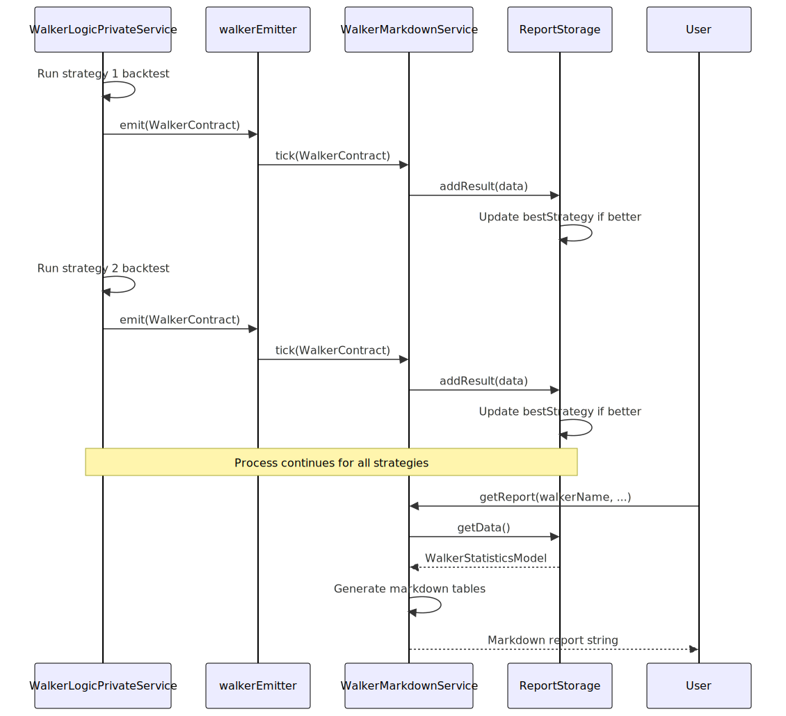

# Walker Reports

Walker reports provide comparative analysis of multiple trading strategies executed on the same symbol during the same timeframe. These reports aggregate performance metrics from individual backtests and rank strategies based on a configured optimization metric (e.g., Sharpe Ratio, total PNL, win rate).

For information about walker execution flow and strategy comparison mechanics, see [Walker Execution Flow](./64_Walker_Execution_Flow.md) and [Strategy Comparison](./65_Strategy_Comparison.md). For individual strategy backtest reports, see [Backtest API](./18_Backtest_API.md).

---

## Report Architecture

Walker reports are generated by `WalkerMarkdownService`, which subscribes to walker progress events and accumulates strategy results as each backtest completes.

### Data Flow




### Component Interaction




---

## Report Structure

Walker markdown reports consist of four main sections: metadata header, best strategy summary, strategy comparison table, and all-signals PNL table.

### Report Sections




### Example Report Output

```markdown
# Walker Comparison Report: my-walker

**Symbol:** BTCUSDT
**Exchange:** binance
**Frame:** 1d-backtest
**Optimization Metric:** sharpeRatio
**Strategies Tested:** 5

## Best Strategy: strategy-ma-cross

**Best sharpeRatio:** 1.45
**Total Signals:** 42

## Top Strategies Comparison

| Strategy | Sharpe Ratio | Total PNL | Win Rate | Total Trades |
| --- | --- | --- | --- | --- |
| strategy-ma-cross | 1.45 | +12.34% | 57.14% | 42 |
| strategy-rsi-divergence | 1.23 | +10.12% | 55.00% | 40 |
| strategy-macd-signal | 0.98 | +8.45% | 52.38% | 38 |
...

## All Signals (PNL Table)

| Strategy | Signal ID | Symbol | Position | PNL | Close Reason | Open Time | Close Time |
| --- | --- | --- | --- | --- | --- | --- | --- |
| strategy-ma-cross | abc123 | BTCUSDT | long | +2.45% | take_profit | 2024-01-01 | 2024-01-02 |
...
```


---

## Data Models

### WalkerStatisticsModel

The `WalkerStatisticsModel` interface aggregates all walker comparison data:

| Field | Type | Description |
|-------|------|-------------|
| `walkerName` | `WalkerName` | Unique identifier for this walker |
| `symbol` | `string` | Trading pair symbol |
| `exchangeName` | `string` | Exchange name from walker schema |
| `frameName` | `string` | Timeframe name from walker schema |
| `metric` | `WalkerMetric` | Optimization metric used for ranking |
| `totalStrategies` | `number` | Total number of strategies tested |
| `bestStrategy` | `StrategyName \| null` | Name of best performing strategy |
| `bestMetric` | `number \| null` | Best metric value achieved |
| `bestStats` | `BacktestStatisticsModel \| null` | Full statistics for best strategy |
| `strategyResults` | `IStrategyResult[]` | Results for all strategies tested |


### IStrategyResult

Per-strategy result data included in comparison table:

| Field | Type | Description |
|-------|------|-------------|
| `strategyName` | `StrategyName` | Strategy identifier |
| `stats` | `BacktestStatisticsModel` | Full backtest statistics |
| `metricValue` | `number \| null` | Value of optimization metric |


### SignalData

Individual signal data included in PNL table:

| Field | Type | Description |
|-------|------|-------------|
| `strategyName` | `StrategyName` | Strategy that generated signal |
| `signalId` | `string` | Unique signal identifier |
| `symbol` | `string` | Trading pair symbol |
| `position` | `"long" \| "short"` | Position direction |
| `pnl` | `number` | Profit/loss percentage |
| `closeReason` | `CloseReason` | Why signal closed |
| `openTime` | `number` | Position open timestamp |
| `closeTime` | `number` | Position close timestamp |


---

## Column Configuration System

Walker reports use a flexible column configuration system to customize which data appears in tables and how it's formatted.

### Column Types




### ColumnModel Interface

Each column configuration must implement four properties:

```typescript
interface ColumnModel<T extends object = any> {
  key: string;                                    // Unique identifier
  label: string;                                  // Table header text
  format: (data: T, index: number) => string;    // Value formatter
  isVisible: () => boolean;                       // Visibility toggle
}
```


### Default Column Configurations

The framework provides default column sets via `COLUMN_CONFIG`:

| Configuration Key | Type | Usage |
|-------------------|------|-------|
| `walker_strategy_columns` | `StrategyColumn[]` | Strategy comparison table columns |
| `walker_pnl_columns` | `PnlColumn[]` | All-signals PNL table columns |

Users can override these defaults by passing custom column arrays to report methods.


---

## API Methods

### WalkerMarkdownService Methods

The service provides four primary methods for interacting with walker reports:

#### getData()

Retrieves aggregated walker statistics without generating markdown:

```typescript
public getData = async (
  walkerName: WalkerName,
  symbol: string,
  metric: WalkerMetric,
  context: {
    exchangeName: string;
    frameName: string;
  }
): Promise<WalkerStatisticsModel>
```


#### getReport()

Generates markdown report string with customizable columns:

```typescript
public getReport = async (
  walkerName: WalkerName,
  symbol: string,
  metric: WalkerMetric,
  context: {
    exchangeName: string;
    frameName: string;
  },
  strategyColumns?: StrategyColumn[],
  pnlColumns?: PnlColumn[]
): Promise<string>
```


#### dump()

Saves markdown report to disk:

```typescript
public dump = async (
  walkerName: WalkerName,
  symbol: string,
  metric: WalkerMetric,
  context: {
    exchangeName: string;
    frameName: string;
  },
  path?: string,                    // default: "./dump/walker"
  strategyColumns?: StrategyColumn[],
  pnlColumns?: PnlColumn[]
): Promise<void>
```


#### clear()

Clears accumulated report data:

```typescript
public clear = async (walkerName?: WalkerName): Promise<void>
```

If `walkerName` is provided, clears only that walker's data. If omitted, clears all walkers.


### WalkerUtils / WalkerInstance Methods

The `Walker` utility class and `WalkerInstance` class provide simplified access to walker reports:




### Usage Examples

#### Generate Report to String

```typescript
import { Walker } from "backtest-kit";

const markdown = await Walker.getReport("BTCUSDT", {
  walkerName: "my-walker"
});

console.log(markdown);
```

#### Save Report to Disk

```typescript
import { Walker } from "backtest-kit";

// Save to default path: ./dump/walker/my-walker.md
await Walker.dump("BTCUSDT", {
  walkerName: "my-walker"
});

// Save to custom path
await Walker.dump("BTCUSDT", {
  walkerName: "my-walker"
}, "./custom/reports");
```

#### Access Raw Statistics

```typescript
import { Walker } from "backtest-kit";

const stats = await Walker.getData("BTCUSDT", {
  walkerName: "my-walker"
});

console.log("Best strategy:", stats.bestStrategy);
console.log("Best metric value:", stats.bestMetric);
console.log("Total strategies tested:", stats.totalStrategies);
```


---

## Report Generation Process

### Event-Driven Accumulation




### Strategy Ranking

Strategies are sorted by metric value in descending order (best first):

```typescript
// Inside ReportStorage.getComparisonTable()
const sortedResults = [...this._strategyResults].sort((a, b) => {
  const aValue = a.metricValue ?? -Infinity;
  const bValue = b.metricValue ?? -Infinity;
  return bValue - aValue;  // Descending order
});

const topStrategies = sortedResults.slice(0, topN);  // Top N strategies
```

Null metric values are treated as `-Infinity` and appear last in rankings.


### Best Strategy Tracking

The best strategy is determined by the walker execution logic and reported via `WalkerContract`:

```typescript
// Inside ReportStorage.addResult()
this._totalStrategies = data.totalStrategies;
this._bestMetric = data.bestMetric;
this._bestStrategy = data.bestStrategy;

// Store full statistics for best strategy
if (data.strategyName === data.bestStrategy) {
  this._bestStats = data.stats;
}
```


---

## Table Generation

### Strategy Comparison Table

The comparison table shows top N strategies (default: 10) sorted by optimization metric:




### PNL Table

The PNL table aggregates all closed signals from all strategies:

```typescript
// Collect all closed signals from all strategies
const allSignals: SignalData[] = [];

for (const result of this._strategyResults) {
  for (const signal of result.stats.signalList) {
    allSignals.push({
      strategyName: result.strategyName,
      signalId: signal.signal.id,
      symbol: signal.signal.symbol,
      position: signal.signal.position,
      pnl: signal.pnl.pnlPercentage,
      closeReason: signal.closeReason,
      openTime: signal.signal.pendingAt,
      closeTime: signal.closeTimestamp,
    });
  }
}
```


### Column Rendering

Both tables use the same column rendering logic:




---

## Storage Management

### Per-Walker Storage Isolation

Each walker gets its own `ReportStorage` instance via memoization:

```typescript
private getStorage = memoize<(walkerName: WalkerName) => ReportStorage>(
  ([walkerName]) => `${walkerName}`,
  (walkerName) => new ReportStorage(walkerName)
);
```

This ensures that multiple walkers can run simultaneously without interfering with each other's reports.


### Storage Lifecycle




### Memory Management

The service automatically subscribes to `walkerEmitter` on first use via the `init()` method wrapped in `singleshot()`:

```typescript
protected init = singleshot(async () => {
  this.loggerService.log("walkerMarkdownService init");
  walkerEmitter.subscribe(this.tick);
});
```

To release memory for a specific walker:

```typescript
await walkerMarkdownService.clear("my-walker");
```

To release all walker data:

```typescript
await walkerMarkdownService.clear();
```


---

## Integration with Walker Execution

Walker reports are automatically populated during walker execution. No manual intervention is required:




---

## Performance Considerations

### Bounded Storage

Report storage does not have a hard limit on the number of strategy results, as the total is bounded by the number of strategies configured in the walker schema. However, each strategy's `BacktestStatisticsModel` contains up to 250 signals (MAX_EVENTS) to prevent unbounded memory growth.


### Async Column Formatting

Column `format()` and `isVisible()` functions can be async, allowing for expensive formatting operations without blocking the event loop:

```typescript
const customColumn: StrategyColumn = {
  key: "custom",
  label: "Custom Metric",
  format: async (result) => {
    // Can perform async operations
    const value = await calculateExpensiveMetric(result);
    return value.toFixed(2);
  },
  isVisible: async () => {
    // Can check async configuration
    return await featureFlags.isEnabled("custom-column");
  }
};
```


### Report Generation Timing

Report generation is computationally cheap after data accumulation:
- Strategy sorting: O(n log n) where n = number of strategies
- Table rendering: O(s × c) where s = strategies/signals, c = columns
- Markdown assembly: O(rows)

Reports can be generated multiple times from the same accumulated data without re-running backtests.

