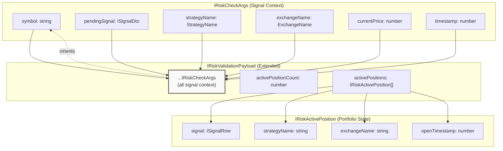
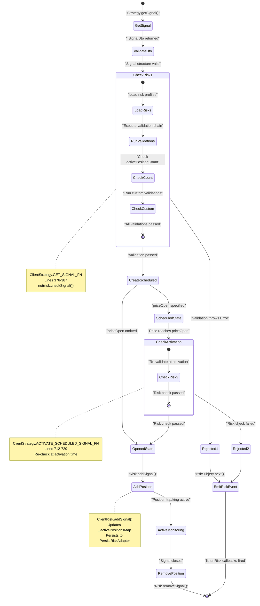
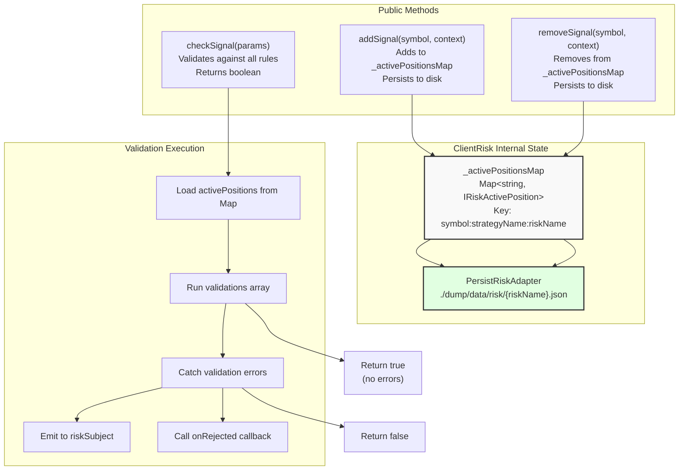
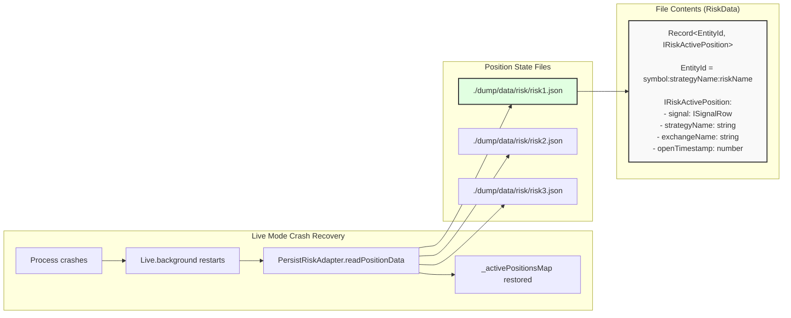
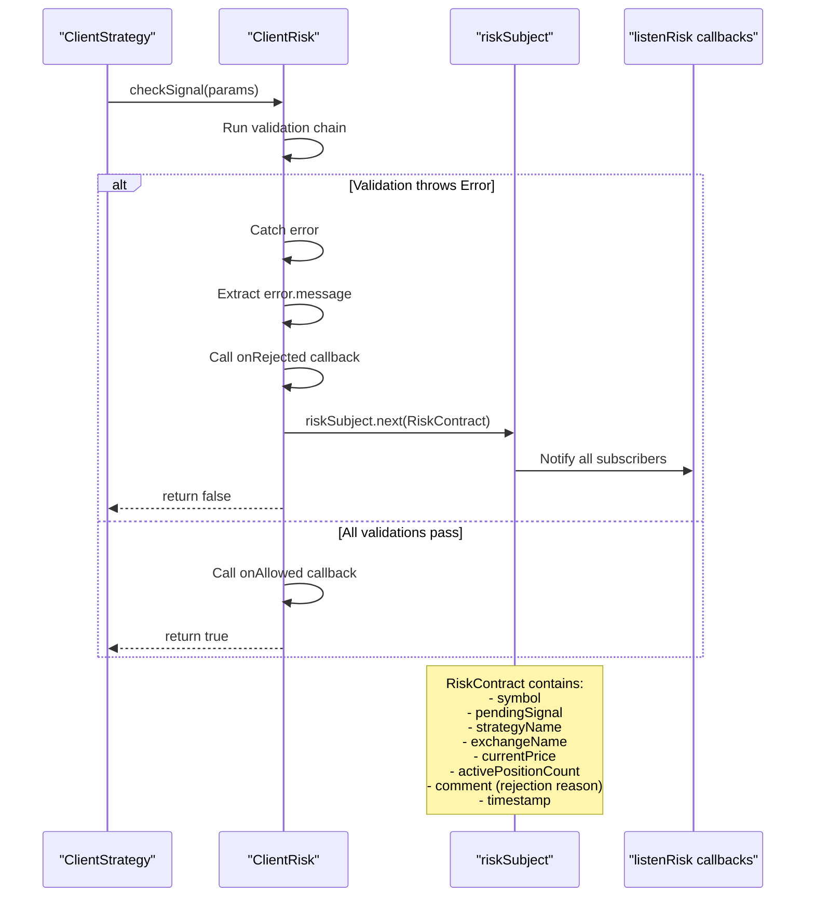
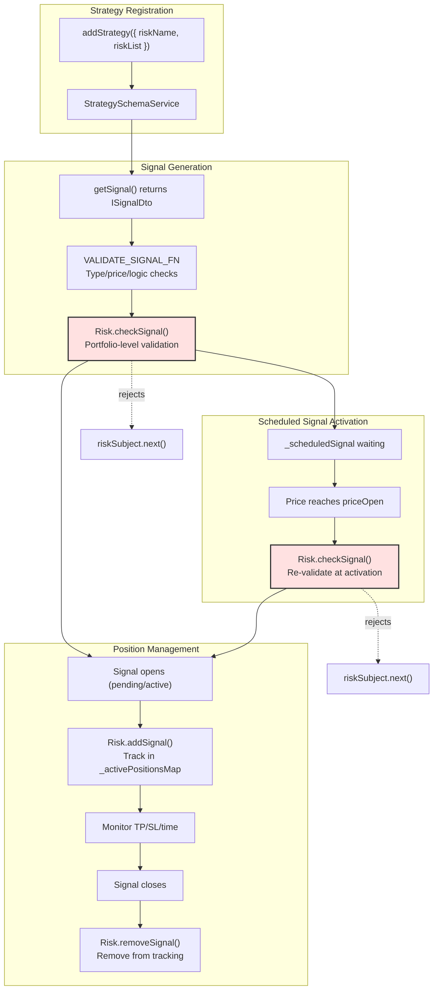
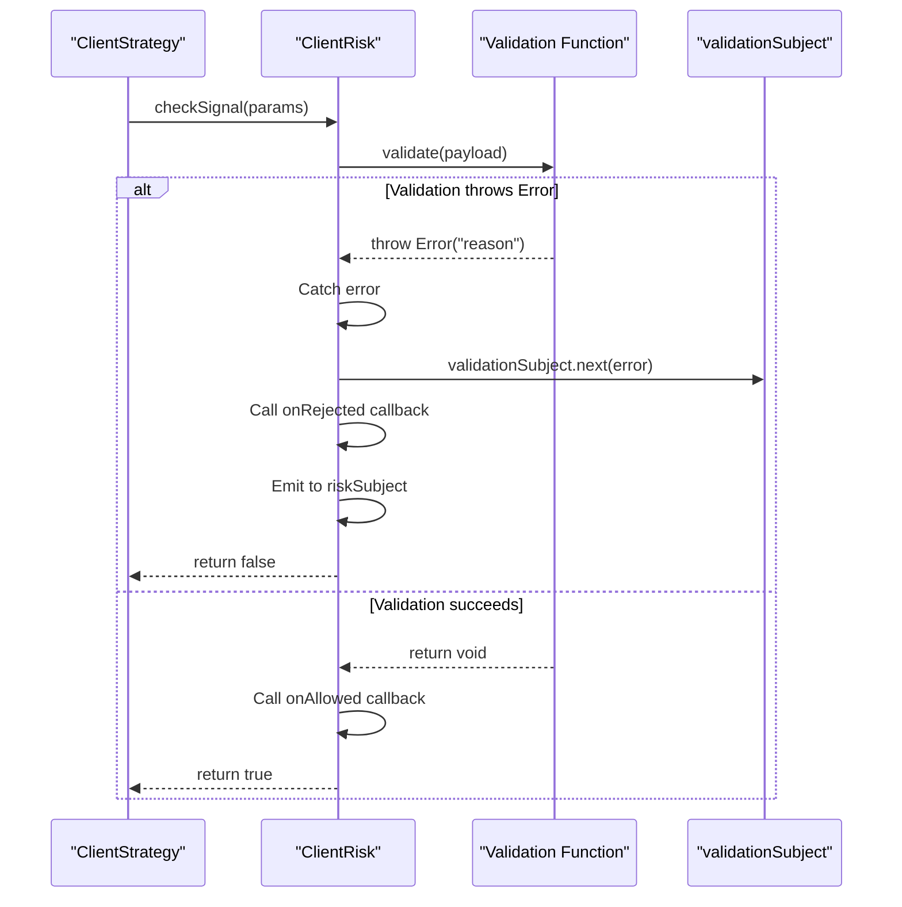

# Risk Management

<details>
<summary>Relevant source files</summary>

The following files were used as context for generating this wiki page:

- [README.md](README.md)
- [src/client/ClientStrategy.ts](src/client/ClientStrategy.ts)
- [src/config/emitters.ts](src/config/emitters.ts)
- [src/function/event.ts](src/function/event.ts)
- [src/index.ts](src/index.ts)
- [src/interfaces/Strategy.interface.ts](src/interfaces/Strategy.interface.ts)
- [test/e2e/defend.test.mjs](test/e2e/defend.test.mjs)
- [test/index.mjs](test/index.mjs)
- [types.d.ts](types.d.ts)

</details>


The risk management system enforces portfolio-level constraints and validation rules that prevent signals from opening when they violate risk parameters. Risk profiles are defined via `addRisk()` and referenced by strategies using `riskName` or `riskList`. The system tracks active positions across all strategies and evaluates custom validation functions before allowing new signals to open.

For signal lifecycle information, see [Signal Lifecycle](#8). For strategy configuration, see [Strategy Schemas](#5.1). For event monitoring, see [Event Listeners](#4.8).

## Risk Profile Configuration

Risk profiles are registered via `addRisk()` and define a set of validation rules that signals must pass before opening. Each risk profile has a unique `riskName` identifier.

### IRiskSchema Interface

```typescript
interface IRiskSchema {
  riskName: string;                              // Unique identifier
  note?: string;                                 // Optional documentation
  callbacks?: Partial<IRiskCallbacks>;           // onRejected, onAllowed
  validations: (IRiskValidation | IRiskValidationFn)[];  // Validation chain
}
```

Strategies reference risk profiles using `riskName` (single profile) or `riskList` (multiple profiles that must all pass).

### Validation Chain Structure

The `validations` array can contain either `IRiskValidation` objects (with `validate` function and optional `note`) or raw validation functions (`IRiskValidationFn`).

```typescript
interface IRiskValidation {
  validate: IRiskValidationFn;  // Function that throws on failure
  note?: string;                // Documentation for this validation
}

type IRiskValidationFn = (payload: IRiskValidationPayload) => void | Promise<void>;
```

Validation functions receive `IRiskValidationPayload` containing complete context about the signal and portfolio state.

**Sources**: [types.d.ts:417-426](), [types.d.ts:402-412](), [types.d.ts:395-397]()

## Risk Validation Payload

The payload passed to validation functions contains both signal details and portfolio state.



### Payload Fields

| Field | Type | Description |
|-------|------|-------------|
| `symbol` | `string` | Trading pair (e.g., "BTCUSDT") |
| `pendingSignal` | `ISignalDto` | Signal attempting to open |
| `strategyName` | `StrategyName` | Strategy requesting signal |
| `exchangeName` | `ExchangeName` | Exchange being used |
| `currentPrice` | `number` | Current VWAP price |
| `timestamp` | `number` | Unix timestamp (ms) |
| `activePositionCount` | `number` | Number of currently active positions |
| `activePositions` | `IRiskActivePosition[]` | Details of all active positions |

Validation functions throw `Error` to reject signals. The error message becomes the rejection reason logged to `riskSubject`.

**Sources**: [types.d.ts:343-356](), [types.d.ts:383-390](), [types.d.ts:360-369]()

## Risk Validation Flow

The risk validation system integrates with the signal lifecycle at two critical points: signal generation and scheduled signal activation.



### Two-Stage Risk Checking

Risk validation occurs **twice** for scheduled signals:

1. **Initial Check**: When `getSignal()` returns signal with `priceOpen` ([src/client/ClientStrategy.ts:376-387]())
2. **Activation Check**: When price reaches `priceOpen` ([src/client/ClientStrategy.ts:712-729]())

This dual-check prevents race conditions where portfolio state changes between signal creation and activation.

**Sources**: [src/client/ClientStrategy.ts:376-387](), [src/client/ClientStrategy.ts:712-729]()

## ClientRisk Implementation

`ClientRisk` implements the `IRisk` interface and manages portfolio-wide position tracking.



### Position Tracking Key Format

Active positions are tracked using composite keys:

```
{symbol}:{strategyName}:{riskName}
```

Example: `"BTCUSDT:my-strategy:demo-risk"`

This allows:
- Multiple strategies on same symbol with different risk profiles
- Same strategy on different symbols
- Multiple risk profiles per strategy (via `riskList`)

### Method Signatures

```typescript
interface IRisk {
  checkSignal(params: IRiskCheckArgs): Promise<boolean>;
  addSignal(symbol: string, context: { strategyName: string; riskName: string }): Promise<void>;
  removeSignal(symbol: string, context: { strategyName: string; riskName: string }): Promise<void>;
}
```

**Sources**: [types.d.ts:453-481](), [src/client/ClientRisk.ts]()

## Persistence and Recovery

Active positions are persisted to disk to survive process crashes in live mode.



### Atomic Persistence Pattern

Position changes are written atomically using `PersistRiskAdapter`:

1. Write to temporary file: `{riskName}.json.tmp`
2. `fsync()` to ensure disk write
3. Atomic rename: `{riskName}.json.tmp` → `{riskName}.json`

This prevents partial writes during crashes.

### Backtest vs Live Mode

- **Backtest**: No persistence (in-memory only for speed)
- **Live**: Full persistence after every `addSignal`/`removeSignal`

**Sources**: [src/classes/Persist.ts](), [types.d.ts:431-448]()

## Event System for Risk Rejections

Risk rejections emit events to `riskSubject` for monitoring and alerting.



### RiskContract Structure

Events emitted to `riskSubject` contain:

| Field | Type | Description |
|-------|------|-------------|
| `symbol` | `string` | Trading pair |
| `pendingSignal` | `ISignalDto` | Rejected signal |
| `strategyName` | `StrategyName` | Strategy that generated signal |
| `exchangeName` | `ExchangeName` | Exchange being used |
| `currentPrice` | `number` | Current VWAP price |
| `activePositionCount` | `number` | Active positions at rejection time |
| `comment` | `string` | Rejection reason (from validation `note` or error message) |
| `timestamp` | `number` | Unix timestamp (ms) |

### Event Listener Functions

```typescript
// Continuous monitoring
const unsubscribe = listenRisk((event) => {
  console.log(`[RISK] ${event.symbol} rejected: ${event.comment}`);
  console.log(`Active positions: ${event.activePositionCount}`);
});

// Wait for first rejection matching filter
listenRiskOnce(
  (event) => event.symbol === "BTCUSDT",
  (event) => console.log("BTCUSDT signal rejected!")
);
```

**Sources**: [src/function/event.ts:924-968](), [src/config/emitters.ts:131](), [src/contract/Risk.contract.ts]()

## Common Risk Validation Patterns

### Maximum Concurrent Positions

Limit total number of active positions across all strategies:

```typescript
addRisk({
  riskName: "max-3-positions",
  validations: [
    ({ activePositionCount }) => {
      if (activePositionCount >= 3) {
        throw new Error("Max 3 concurrent positions exceeded");
      }
    }
  ]
});
```

### Minimum Take Profit Distance

Ensure TP is sufficiently far from entry to cover fees:

```typescript
addRisk({
  riskName: "min-tp-distance",
  validations: [
    ({ pendingSignal, currentPrice }) => {
      const { priceOpen = currentPrice, priceTakeProfit, position } = pendingSignal;
      
      const tpDistance = position === "long"
        ? ((priceTakeProfit - priceOpen) / priceOpen) * 100
        : ((priceOpen - priceTakeProfit) / priceOpen) * 100;
      
      if (tpDistance < 1.0) {
        throw new Error(`TP too close: ${tpDistance.toFixed(2)}%`);
      }
    }
  ]
});
```

### Risk/Reward Ratio

Enforce minimum R/R ratio (e.g., 2:1):

```typescript
addRisk({
  riskName: "min-rr-2to1",
  validations: [
    ({ pendingSignal, currentPrice }) => {
      const { priceOpen = currentPrice, priceTakeProfit, priceStopLoss, position } = pendingSignal;
      
      const reward = position === "long"
        ? priceTakeProfit - priceOpen
        : priceOpen - priceTakeProfit;
      
      const risk = position === "long"
        ? priceOpen - priceStopLoss
        : priceStopLoss - priceOpen;
      
      if (reward / risk < 2.0) {
        throw new Error(`Poor R/R: ${(reward/risk).toFixed(2)}:1`);
      }
    }
  ]
});
```

### Time Window Restrictions

Prevent signals during specific hours (e.g., low liquidity periods):

```typescript
addRisk({
  riskName: "trading-hours",
  validations: [
    ({ timestamp }) => {
      const hour = new Date(timestamp).getUTCHours();
      
      // Block 00:00-02:00 UTC (low liquidity)
      if (hour >= 0 && hour < 2) {
        throw new Error("Trading disabled during low liquidity hours");
      }
    }
  ]
});
```

### Symbol-Specific Limits

Limit positions per symbol:

```typescript
addRisk({
  riskName: "one-per-symbol",
  validations: [
    ({ symbol, activePositions }) => {
      const countOnSymbol = activePositions.filter(
        pos => pos.signal.symbol === symbol
      ).length;
      
      if (countOnSymbol > 0) {
        throw new Error(`Already have position on ${symbol}`);
      }
    }
  ]
});
```

**Sources**: [test/e2e/risk.test.mjs](), [README.md:86-99]()

## Integration with Strategy Lifecycle

Risk validation integrates with multiple strategy lifecycle points.



### Multiple Risk Profiles (riskList)

Strategies can require multiple risk profiles to all pass:

```typescript
addStrategy({
  strategyName: "conservative-btc",
  riskList: ["max-3-positions", "min-rr-2to1", "trading-hours"],
  getSignal: async (symbol, when) => {
    // All three risk profiles must validate
  }
});
```

All risk profiles in `riskList` are checked sequentially. If any validation fails, the signal is rejected.

**Sources**: [types.d.ts:730-750](), [src/client/ClientStrategy.ts:376-387](), [src/client/ClientStrategy.ts:712-729]()

## Global Risk Configuration

Global risk parameters are configured via `setConfig()`:

```typescript
setConfig({
  CC_MIN_TAKEPROFIT_DISTANCE_PERCENT: 0.3,  // Min TP distance (%)
  CC_MIN_STOPLOSS_DISTANCE_PERCENT: 0.1,    // Min SL distance (%)
  CC_MAX_STOPLOSS_DISTANCE_PERCENT: 5.0,    // Max SL distance (%)
  CC_MAX_SIGNAL_LIFETIME_MINUTES: 10080,    // Max 7 days
  CC_SCHEDULE_AWAIT_MINUTES: 120,           // Scheduled signal timeout
});
```

These parameters are enforced by `VALIDATE_SIGNAL_FN` before risk validation:

| Parameter | Default | Purpose |
|-----------|---------|---------|
| `CC_MIN_TAKEPROFIT_DISTANCE_PERCENT` | `0.3` | Minimum TP distance to cover fees |
| `CC_MIN_STOPLOSS_DISTANCE_PERCENT` | `0.1` | Minimum SL distance to avoid instant stops |
| `CC_MAX_STOPLOSS_DISTANCE_PERCENT` | `5.0` | Maximum SL distance to protect capital |
| `CC_MAX_SIGNAL_LIFETIME_MINUTES` | `10080` | Maximum signal duration (7 days) |
| `CC_SCHEDULE_AWAIT_MINUTES` | `120` | Scheduled signal timeout (2 hours) |

**Sources**: [src/config/params.ts](), [src/client/ClientStrategy.ts:45-330]()

## Validation Error Handling

Validation errors are caught and handled gracefully:



### Error Propagation

1. Validation function throws `Error`
2. `ClientRisk` catches error
3. Error emitted to `validationSubject` (for debugging)
4. `onRejected` callback invoked with error message
5. `riskSubject` emits `RiskContract` with rejection details
6. `checkSignal()` returns `false`

**Sources**: [src/function/event.ts:757-760](), [src/config/emitters.ts:112]()

## Performance Considerations

### Validation Execution

- Validations run **sequentially** in array order
- First validation that throws stops execution (short-circuit)
- Async validations are supported (use `await`)
- Validation timing tracked via `performanceEmitter`

### Position Tracking

- `_activePositionsMap` is in-memory Map for O(1) lookups
- Persistence only in live mode (backtest skips I/O)
- Atomic file writes prevent corruption
- Separate files per `riskName` for parallel writes

### Memoization

`ClientRisk` instances are memoized per `riskName` in `RiskConnectionService`, ensuring singleton behavior and preventing duplicate position tracking.

**Sources**: [src/lib/services/connection/RiskConnectionService.ts]()