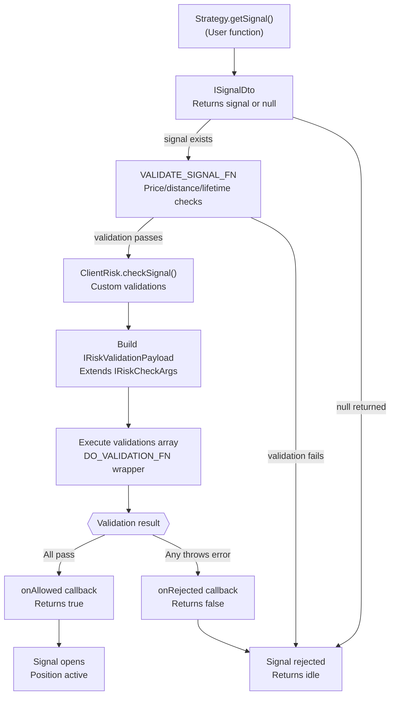
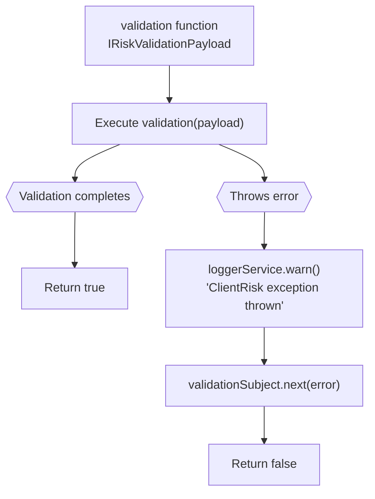
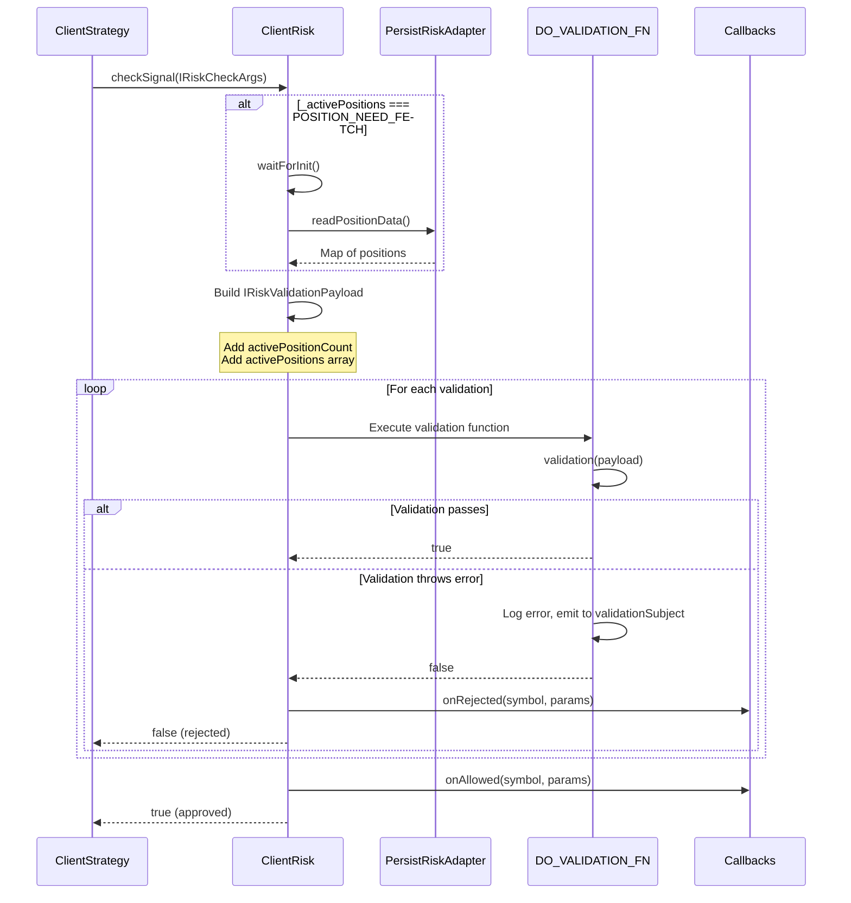
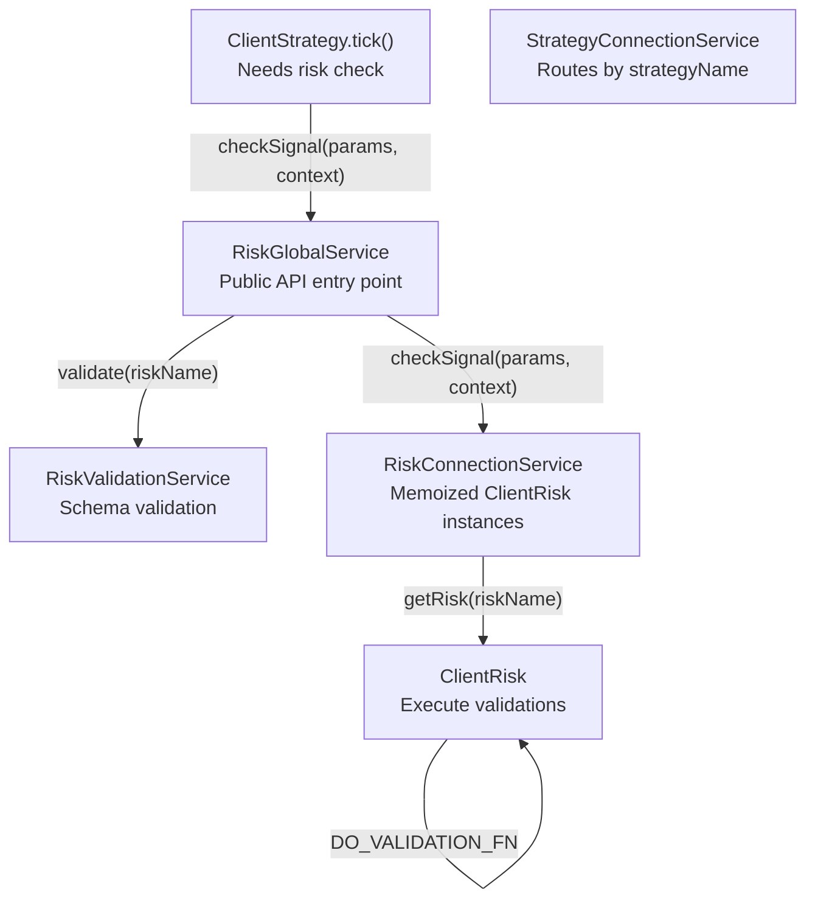
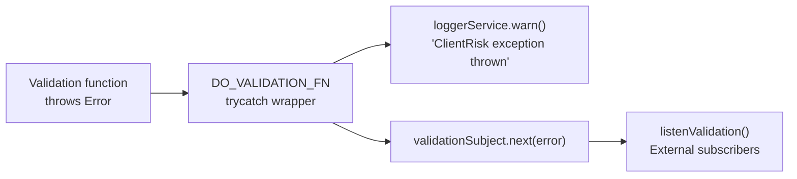

# Risk Validation

This page documents the risk validation flow in `backtest-kit`, specifically how custom validation functions are executed to approve or reject trading signals before they are opened. Risk validation occurs after signal generation but before position opening, providing portfolio-level risk controls.

For information about defining risk profiles and their structure, see [Risk Profiles](#12.1). For details on how active positions are tracked across strategies, see [Position Tracking](#12.3).

---

## Overview

Risk validation is the process by which `ClientRisk` evaluates whether a new signal should be allowed to open based on custom validation logic. When a strategy generates a signal, the following sequence occurs:

1. **Signal Generation**: Strategy's `getSignal()` returns a signal DTO
2. **Signal Validation**: Framework validates price logic, distances, and lifetime
3. **Risk Check**: `ClientRisk.checkSignal()` executes custom validations with portfolio context
4. **Decision**: Signal is either approved (opens position) or rejected (returns to idle)

The risk validation system provides access to:
- Signal parameters (symbol, strategy, exchange, current price, timestamp)
- Portfolio state (active position count, list of all active positions)
- Ability to throw errors to reject signals with descriptive messages

**Sources**: [src/client/ClientRisk.ts:165-217](), [src/interfaces/Risk.interface.ts:1-145]()

---

## Validation Flow



**Sources**: [src/client/ClientRisk.ts:165-217](), [test/spec/risk.test.mjs:41-143]()

---

## Validation Payload Structure

The `IRiskValidationPayload` interface extends `IRiskCheckArgs` with portfolio state information. This is the argument passed to every validation function.

### IRiskCheckArgs (Base Context)

```typescript
interface IRiskCheckArgs {
  symbol: string;           // Trading pair (e.g., "BTCUSDT")
  strategyName: StrategyName;
  exchangeName: ExchangeName;
  currentPrice: number;     // Current VWAP price
  timestamp: number;        // Current timestamp
}
```

These fields are passed directly from `ClientStrategy` context and represent the current signal request parameters.

**Sources**: [src/interfaces/Risk.interface.ts:10-21]()

### IRiskValidationPayload (Full Context)

```typescript
interface IRiskValidationPayload extends IRiskCheckArgs {
  activePositionCount: number;        // Total active positions
  activePositions: IRiskActivePosition[];  // Full position details
}
```

The payload is constructed in `ClientRisk.checkSignal()` by augmenting `IRiskCheckArgs` with portfolio state:

| Field | Type | Description |
|-------|------|-------------|
| `activePositionCount` | `number` | Number of currently open positions across all strategies sharing this risk profile |
| `activePositions` | `IRiskActivePosition[]` | Array of all active position objects with signal details, strategy names, and timestamps |

**Sources**: [src/interfaces/Risk.interface.ts:55-60](), [src/client/ClientRisk.ts:177-181]()

### IRiskActivePosition Structure

```typescript
interface IRiskActivePosition {
  signal: ISignalRow;        // Full signal details
  strategyName: string;      // Strategy owning this position
  exchangeName: string;      // Exchange for this position
  openTimestamp: number;     // When position opened
}
```

This allows validations to inspect individual positions, check per-strategy exposure, or implement complex portfolio logic.

**Sources**: [src/interfaces/Risk.interface.ts:26-35]()

---

## Validation Function Types

Risk validations can be defined in two forms: as standalone functions or as objects with metadata.

### Function Form

```typescript
type IRiskValidationFn = (payload: IRiskValidationPayload) => void | Promise<void>;

// Example
addRisk({
  riskName: "my-risk",
  validations: [
    async ({ activePositionCount }) => {
      if (activePositionCount >= 5) {
        throw new Error("Maximum 5 concurrent positions allowed");
      }
    }
  ]
});
```

**Sources**: [src/interfaces/Risk.interface.ts:66-68](), [test/spec/risk.test.mjs:209-247]()

### Object Form (with note)

```typescript
interface IRiskValidation {
  validate: IRiskValidationFn;
  note?: string;
}

// Example
addRisk({
  riskName: "my-risk",
  validations: [
    {
      validate: async ({ symbol, activePositionCount }) => {
        if (activePositionCount >= 5) {
          throw new Error("Max positions reached");
        }
      },
      note: "Limit concurrent positions to 5"
    }
  ]
});
```

The object form allows documentation of validation logic. The framework normalizes both forms internally.

**Sources**: [src/interfaces/Risk.interface.ts:74-85](), [test/spec/risk.test.mjs:41-93]()

---

## DO_VALIDATION_FN Wrapper

The `DO_VALIDATION_FN` is a `trycatch` wrapper that executes validation functions with error handling and logging.



### Implementation

The wrapper is defined at [src/client/ClientRisk.ts:31-46]():

```typescript
const DO_VALIDATION_FN = trycatch(
  async (validation: IRiskValidationFn, params: IRiskValidationPayload) => {
    await validation(params);
    return true;
  },
  {
    defaultValue: false,
    fallback: (error) => {
      backtest.loggerService.warn("ClientRisk exception thrown", {
        error: errorData(error),
        message: getErrorMessage(error),
      });
      validationSubject.next(error);
    },
  }
);
```

### Behavior

| Validation Result | Return Value | Side Effects |
|-------------------|--------------|--------------|
| No error thrown | `true` | None |
| Error thrown | `false` | Logs warning, emits to `validationSubject` |

This ensures that validation errors never crash the system but are properly logged and observable via `listenValidation()`.

**Sources**: [src/client/ClientRisk.ts:31-46](), [src/config/emitters.ts]()

---

## ClientRisk.checkSignal Implementation

The `checkSignal` method is the core validation orchestration function in `ClientRisk`.

### Method Signature

```typescript
public checkSignal = async (params: IRiskCheckArgs): Promise<boolean>
```

**Sources**: [src/client/ClientRisk.ts:165]()

### Execution Steps



**Sources**: [src/client/ClientRisk.ts:165-217]()

### Code Walkthrough

#### 1. Initialize Active Positions

```typescript
if (this._activePositions === POSITION_NEED_FETCH) {
  await this.waitForInit();
}
```

Lazy initialization loads persisted positions from disk on first use. See [Position Tracking](#12.3) for details.

**Sources**: [src/client/ClientRisk.ts:171-173]()

#### 2. Build Validation Payload

```typescript
const riskMap = <RiskMap>this._activePositions;

const payload: IRiskValidationPayload = {
  ...params,
  activePositionCount: riskMap.size,
  activePositions: Array.from(riskMap.values()),
};
```

The payload combines passthrough arguments from `ClientStrategy` with current portfolio state.

**Sources**: [src/client/ClientRisk.ts:175-181]()

#### 3. Execute Validations

```typescript
let isValid = true;
if (this.params.validations) {
  for (const validation of this.params.validations) {
    if (
      not(
        await DO_VALIDATION_FN(
          typeof validation === "function"
            ? validation
            : validation.validate,
          payload
        )
      )
    ) {
      isValid = false;
      break;
    }
  }
}
```

Validations execute sequentially. The loop breaks immediately on first failure (short-circuit evaluation). Both function and object forms are normalized to extract the validation function.

**Sources**: [src/client/ClientRisk.ts:184-201]()

#### 4. Handle Result

```typescript
if (!isValid) {
  if (this.params.callbacks?.onRejected) {
    this.params.callbacks.onRejected(params.symbol, params);
  }
  return false;
}

// All checks passed
if (this.params.callbacks?.onAllowed) {
  this.params.callbacks.onAllowed(params.symbol, params);
}

return true;
```

Callbacks fire based on validation result. The method returns `true` for approval, `false` for rejection.

**Sources**: [src/client/ClientRisk.ts:203-217]()

---

## Validation Patterns

### Pattern 1: Position Count Limits

```typescript
addRisk({
  riskName: "max-positions",
  validations: [
    ({ activePositionCount }) => {
      if (activePositionCount >= 3) {
        throw new Error("Maximum 3 concurrent positions allowed");
      }
    }
  ]
});
```

Most common pattern. Prevents excessive portfolio exposure by limiting total open positions.

**Sources**: [test/spec/risk.test.mjs:41-93]()

### Pattern 2: Symbol Filtering

```typescript
addRisk({
  riskName: "symbol-filter",
  validations: [
    ({ symbol }) => {
      if (symbol === "DOGEUSDT") {
        throw new Error("DOGE trading not allowed");
      }
    }
  ]
});
```

Reject signals for specific trading pairs based on symbol name.

**Sources**: [test/spec/risk.test.mjs:291-344]()

### Pattern 3: Per-Strategy Position Tracking

```typescript
addRisk({
  riskName: "per-strategy-limit",
  validations: [
    ({ strategyName, activePositions }) => {
      const strategyPositions = activePositions.filter(
        pos => pos.strategyName === strategyName
      );
      
      if (strategyPositions.length >= 2) {
        throw new Error(`Strategy ${strategyName} already has 2 positions`);
      }
    }
  ]
});
```

Limit positions per individual strategy using the `activePositions` array.

**Sources**: [src/interfaces/Risk.interface.ts:55-60]()

### Pattern 4: Time-Based Filtering

```typescript
addRisk({
  riskName: "time-filter",
  validations: [
    ({ timestamp }) => {
      const hour = new Date(timestamp).getHours();
      if (hour < 8 || hour > 16) {
        throw new Error("Trading only allowed during business hours");
      }
    }
  ]
});
```

Use the `timestamp` field to implement time-of-day restrictions.

**Sources**: [src/interfaces/Risk.interface.ts:10-21]()

---

## Service Layer Routing

Risk validation requests flow through multiple service layers before reaching `ClientRisk`.



### Service Responsibilities

| Service | File | Responsibility |
|---------|------|----------------|
| `RiskGlobalService` | [src/lib/services/global/RiskGlobalService.ts:15-114]() | Public API, memoized validation |
| `RiskValidationService` | [src/lib/services/validation/RiskValidationService.ts]() | Schema existence checks |
| `RiskConnectionService` | [src/lib/services/connection/RiskConnectionService.ts:41-135]() | Memoized `ClientRisk` instances |
| `ClientRisk` | [src/client/ClientRisk.ts:73-218]() | Validation execution, position tracking |

**Sources**: [src/lib/services/global/RiskGlobalService.ts:15-114](), [src/lib/services/connection/RiskConnectionService.ts:41-135]()

---

## Callbacks

Risk schemas support two optional callbacks that fire based on validation results.

### onRejected Callback

```typescript
interface IRiskCallbacks {
  onRejected: (symbol: string, params: IRiskCheckArgs) => void;
}
```

Fires when any validation throws an error. Receives:
- `symbol`: Trading pair that was rejected
- `params`: Full `IRiskCheckArgs` with rejection context

**Use case**: Log rejected signals, track rejection reasons, send alerts.

**Sources**: [src/interfaces/Risk.interface.ts:43-46]()

### onAllowed Callback

```typescript
interface IRiskCallbacks {
  onAllowed: (symbol: string, params: IRiskCheckArgs) => void;
}
```

Fires when all validations pass. Receives same parameters as `onRejected`.

**Use case**: Track approved signals, monitor validation pass rate, log portfolio changes.

**Sources**: [src/interfaces/Risk.interface.ts:48]()

### Example Usage

```typescript
addRisk({
  riskName: "monitored-risk",
  validations: [
    ({ activePositionCount }) => {
      if (activePositionCount >= 5) {
        throw new Error("Max positions");
      }
    }
  ],
  callbacks: {
    onRejected: (symbol, params) => {
      console.log(`REJECTED: ${symbol} (${params.strategyName})`);
    },
    onAllowed: (symbol, params) => {
      console.log(`APPROVED: ${symbol} (${params.strategyName})`);
    }
  }
});
```

**Sources**: [test/spec/risk.test.mjs:58-63](), [test/spec/risk.test.mjs:304-308]()

---

## Validation Error Handling

Validation errors are caught and emitted via the event system, allowing external monitoring.

### Error Flow



### Subscribing to Validation Errors

```typescript
import { listenValidation } from 'backtest-kit';

const unsubscribe = listenValidation((error) => {
  console.error('Risk validation error:', error.message);
  
  // Send to monitoring system
  sendAlert({
    type: 'RISK_VALIDATION_ERROR',
    message: error.message,
    timestamp: Date.now()
  });
});
```

The `listenValidation` function subscribes to the `validationSubject` emitter, receiving all validation errors across all risk profiles.

**Sources**: [src/client/ClientRisk.ts:39-44](), [src/config/emitters.ts]()

---

## Testing Validation Logic

Risk validations are deterministic and testable by simulating portfolio state.

### Example Test Pattern

```typescript
test("Risk validation rejects when limit exceeded", async ({ pass, fail }) => {
  let rejectedSymbol = null;
  
  addRisk({
    riskName: "test-risk",
    validations: [
      ({ activePositionCount }) => {
        if (activePositionCount >= 3) {
          throw new Error("Max 3 positions");
        }
      }
    ],
    callbacks: {
      onRejected: (symbol) => {
        rejectedSymbol = symbol;
      }
    }
  });
  
  const { riskGlobalService } = lib;
  
  // Add 3 positions
  await riskGlobalService.addSignal("BTCUSDT", { 
    strategyName: "test-strategy-1", 
    riskName: "test-risk" 
  });
  await riskGlobalService.addSignal("ETHUSDT", { 
    strategyName: "test-strategy-2", 
    riskName: "test-risk" 
  });
  await riskGlobalService.addSignal("BNBUSDT", { 
    strategyName: "test-strategy-3", 
    riskName: "test-risk" 
  });
  
  // 4th signal should fail
  const result = await riskGlobalService.checkSignal(
    {
      symbol: "SOLUSDT",
      strategyName: "test-strategy-4",
      exchangeName: "binance",
      currentPrice: 100,
      timestamp: Date.now()
    },
    { riskName: "test-risk" }
  );
  
  if (!result && rejectedSymbol === "SOLUSDT") {
    pass("Validation correctly rejected 4th position");
  }
});
```

**Sources**: [test/spec/risk.test.mjs:41-93]()

---

## Validation Best Practices

### 1. Throw Descriptive Errors

```typescript
// Good: Clear error message
throw new Error("Maximum 5 concurrent positions exceeded (current: 6)");

// Bad: Generic error
throw new Error("Failed");
```

Error messages appear in logs and validation events, aiding debugging.

### 2. Use Short-Circuit Evaluation

Validations execute sequentially and stop at first failure. Place most restrictive checks first:

```typescript
validations: [
  // Check count first (fast, common rejection)
  ({ activePositionCount }) => {
    if (activePositionCount >= 5) {
      throw new Error("Max positions");
    }
  },
  // Then check complex portfolio logic (slower, rare rejection)
  ({ activePositions, symbol }) => {
    // ... expensive calculation
  }
]
```

### 3. Validate All Required Fields

```typescript
({ symbol, activePositionCount, currentPrice }) => {
  if (!symbol || typeof activePositionCount !== 'number') {
    throw new Error("Invalid risk check payload");
  }
  // ... validation logic
}
```

### 4. Isolate Risk Profiles

Each `riskName` has independent position tracking. Use separate risk profiles for different strategies or portfolio sections:

```typescript
addRisk({ riskName: "conservative", validations: [...] });
addRisk({ riskName: "aggressive", validations: [...] });

addStrategy({ 
  strategyName: "safe-strategy", 
  riskName: "conservative" 
});

addStrategy({ 
  strategyName: "risky-strategy", 
  riskName: "aggressive" 
});
```

**Sources**: [test/spec/risk.test.mjs:374-437]()