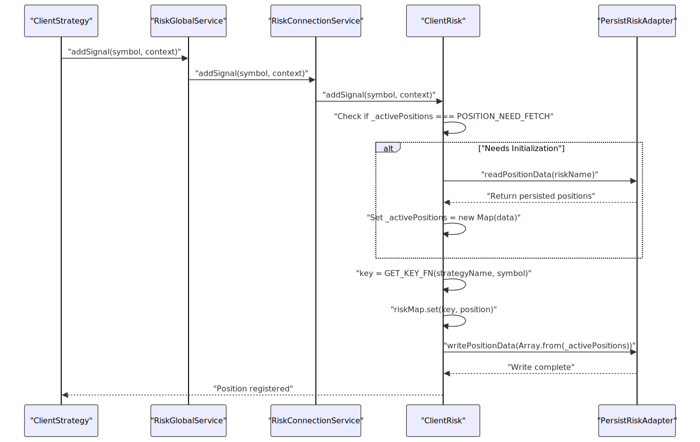

# Position Tracking

## Purpose and Scope

This document explains how the framework tracks active positions for portfolio-level risk management. Position tracking is implemented by `ClientRisk` and maintains a real-time registry of all open positions across strategies sharing the same risk profile.

For information about risk profile configuration, see [Risk Profiles](./66_Risk_Profiles.md). For information about risk validation logic, see [Risk Validation](./67_Risk_Validation.md).

**Sources:** [src/client/ClientRisk.ts:1-221]()

---

## Overview

Position tracking enables cross-strategy risk analysis by maintaining a shared registry of active positions. Multiple `ClientStrategy` instances sharing the same `riskName` contribute to a single position count, allowing portfolio-level limits to be enforced across strategies.

The tracking system provides:
- Real-time position count for validation functions
- Crash-safe persistence for live trading
- Isolated position registries per risk profile
- Efficient lookup via composite keys



**Diagram: Position Sharing Across Strategies**

**Sources:** [src/client/ClientRisk.ts:62-73](), [src/interfaces/Risk.interface.ts:23-35]()

---

## Active Position Map Structure

The `_activePositions` field stores active positions in a `Map<string, IRiskActivePosition>` where keys follow the pattern `${strategyName}:${symbol}`.

### Map Structure

| Component | Type | Purpose |
|-----------|------|---------|
| Key | `string` | Composite identifier: `"strategyName:symbol"` |
| Value | `IRiskActivePosition` | Position metadata including timestamp |

### IRiskActivePosition Structure

```typescript
interface IRiskActivePosition {
  signal: ISignalRow;         // Signal details (stored as null in practice)
  strategyName: string;        // Strategy owning the position
  exchangeName: string;        // Exchange name (empty string in practice)
  openTimestamp: number;       // When position was opened (Date.now())
}
```

### Key Generator Function

The framework uses `GET_KEY_FN` to generate consistent keys:

```typescript
const GET_KEY_FN = (strategyName: string, symbol: string) =>
  `${strategyName}:${symbol}`;
```

This pattern ensures:
- One position per strategy-symbol pair
- Deterministic lookup for `removeSignal` operations
- Collision-free keys across strategies

**Sources:** [src/client/ClientRisk.ts:20-28](), [src/interfaces/Risk.interface.ts:23-35]()

---

## Position Lifecycle

Positions are registered when signals open and removed when signals close. The lifecycle is managed through `addSignal` and `removeSignal` methods.

### Position Registration Flow



**Diagram: Position Registration Sequence**

### addSignal Method

The `addSignal` method registers a new position when a signal opens:

**Key steps:**
1. Check if initialization needed (first call after instantiation)
2. Call `waitForInit()` if `_activePositions === POSITION_NEED_FETCH`
3. Generate composite key using `GET_KEY_FN(strategyName, symbol)`
4. Insert position into map with current timestamp
5. Persist updated positions to disk via `_updatePositions()`

**Method signature:**
```typescript
public async addSignal(
  symbol: string,
  context: { strategyName: string; riskName: string }
)
```

**Sources:** [src/client/ClientRisk.ts:107-128]()

### removeSignal Method

The `removeSignal` method removes a position when a signal closes:

**Key steps:**
1. Check if initialization needed
2. Generate same composite key using `GET_KEY_FN(strategyName, symbol)`
3. Delete entry from map
4. Persist updated positions to disk via `_updatePositions()`

**Method signature:**
```typescript
public async removeSignal(
  symbol: string,
  context: { strategyName: string; riskName: string }
)
```

**Sources:** [src/client/ClientRisk.ts:134-150]()

---

## Lazy Initialization Pattern

Position tracking uses lazy initialization to defer persistence loading until first use. This optimization prevents unnecessary disk I/O during backtest mode or when risk profiles are unused.

### Initialization States



**Diagram: Lazy Initialization State Machine**

### WAIT_FOR_INIT_FN

The initialization function is wrapped with `singleshot` to ensure it executes exactly once:

```typescript
export const WAIT_FOR_INIT_FN = async (self: ClientRisk): Promise<void> => {
  self.params.logger.debug("ClientRisk waitForInit");
  const persistedPositions = await PersistRiskAdapter.readPositionData(
    self.params.riskName
  );
  self._activePositions = new Map(persistedPositions);
};
```

**Key characteristics:**
- Exported for testing purposes
- Reads persisted positions from disk
- Converts array format to Map for efficient lookup
- Wrapped in `singleshot` at line 88 to prevent duplicate initialization

**Sources:** [src/client/ClientRisk.ts:53-59](), [src/client/ClientRisk.ts:88-88]()

---

## Persistence and Recovery

Position data persists to disk after every `addSignal` and `removeSignal` operation. This ensures crash safety in live trading where position state must survive restarts.

### Persistence Flow



**Diagram: Persistence and Recovery Flow**

### _updatePositions Method

The `_updatePositions` method coordinates persistence after state changes:

**Implementation:**
1. Check initialization status
2. Convert Map to array via `Array.from(_activePositions)`
3. Call `PersistRiskAdapter.writePositionData(array, riskName)`
4. Atomic write ensures data integrity

**Sources:** [src/client/ClientRisk.ts:93-101]()

### Data Format

Position data serializes as an array of tuples:

```typescript
type PersistedData = Array<[string, IRiskActivePosition]>;

// Example:
[
  ["strategy1:BTCUSDT", {
    signal: null,
    strategyName: "strategy1",
    exchangeName: "",
    openTimestamp: 1234567890
  }],
  ["strategy2:ETHUSDT", {
    signal: null,
    strategyName: "strategy2",
    exchangeName: "",
    openTimestamp: 1234567900
  }]
]
```

This format:
- Preserves Map structure (key-value pairs)
- Serializes to JSON without data loss
- Reconstructs via `new Map(array)`

**Sources:** [test/spec/risk.test.mjs:540-575]()

---

## Position Access in Validations

Custom validation functions receive position data through the `IRiskValidationPayload` interface. The framework builds this payload before executing validations.

### Payload Construction



**Diagram: Validation Payload Construction**

### checkSignal Implementation

The `checkSignal` method builds the validation payload:

**Implementation details:**
1. Initialize if needed via `waitForInit()`
2. Cast `_activePositions` to `RiskMap` type
3. Build `IRiskValidationPayload` with spread operator
4. Add `activePositionCount: riskMap.size`
5. Add `activePositions: Array.from(riskMap.values())`
6. Execute validations with payload

**Example validation accessing positions:**
```typescript
{
  validate: ({ activePositionCount, activePositions }) => {
    if (activePositionCount >= 5) {
      throw new Error("Maximum 5 concurrent positions");
    }
    
    const btcPositions = activePositions.filter(
      pos => pos.signal.symbol === "BTCUSDT"
    );
    if (btcPositions.length >= 2) {
      throw new Error("Maximum 2 BTC positions");
    }
  }
}
```

**Sources:** [src/client/ClientRisk.ts:165-217](), [src/interfaces/Risk.interface.ts:52-60]()

---

## Isolation by Risk Profile

Each risk profile maintains an isolated position registry. Strategies with different `riskName` values track positions independently, enabling separate risk policies.

### Isolation Mechanism

| Component | Isolation Level | Mechanism |
|-----------|----------------|-----------|
| `ClientRisk` instance | Per `riskName` | Memoized by `RiskConnectionService` |
| `_activePositions` Map | Per instance | Instance field |
| Persistence file | Per `riskName` | `PersistRiskAdapter` namespace |

### Example: Multiple Risk Profiles



**Diagram: Position Isolation by Risk Profile**

### Cross-Profile Independence

Test case demonstrating isolation:

**Scenario:**
1. Add 2 positions to `test-isolation-1`
2. Add 1 position to `test-isolation-2`
3. Verify each profile reports correct count

**Result:**
- Profile 1 reports `activePositionCount: 2`
- Profile 2 reports `activePositionCount: 1`
- No cross-contamination occurs

**Sources:** [test/spec/risk.test.mjs:374-437](), [src/lib/services/connection/RiskConnectionService.ts:56-65]()

---

## Service Layer Integration

Position tracking integrates with the service layer through `RiskGlobalService` and `RiskConnectionService`. These services provide validation and routing to the correct `ClientRisk` instance.

### Service Architecture



**Diagram: Position Tracking Service Integration**

### Method Routing

| Method | Flow | Purpose |
|--------|------|---------|
| `addSignal` | `RiskGlobalService` → `RiskConnectionService` → `ClientRisk` | Register opened position |
| `removeSignal` | `RiskGlobalService` → `RiskConnectionService` → `ClientRisk` | Unregister closed position |
| `checkSignal` | `RiskGlobalService` → `RiskConnectionService` → `ClientRisk` | Validate with current positions |

### Memoization Strategy

`RiskConnectionService.getRisk` uses memoization to cache `ClientRisk` instances:

**Cache key:** `riskName` string

**Benefits:**
- One instance per risk profile
- Shared position state across strategies
- Efficient instance reuse

**Sources:** [src/lib/services/connection/RiskConnectionService.ts:56-65](), [src/lib/services/global/RiskGlobalService.ts:69-97]()

---

## Key Patterns and Constraints

### Composite Key Pattern

**Format:** `${strategyName}:${symbol}`

**Characteristics:**
- Unique per strategy-symbol pair
- Allows same symbol across strategies
- Deterministic for add/remove operations

**Example:**
```
strategy1:BTCUSDT  → Unique position
strategy2:BTCUSDT  → Different position (same symbol, different strategy)
strategy1:ETHUSDT  → Different position (same strategy, different symbol)
```

**Sources:** [src/client/ClientRisk.ts:26-28]()

### Simplified Position Data

The implementation stores minimal metadata in position records:

**Fields stored:**
- `signal: null` (not used for position tracking)
- `strategyName: string` (for identification)
- `exchangeName: ""` (empty string, not used)
- `openTimestamp: number` (for duration tracking)

This simplification:
- Reduces memory footprint
- Avoids circular references
- Focuses on count-based validation

**Sources:** [src/client/ClientRisk.ts:118-125]()

### Synchronous State Updates

Position map updates occur synchronously in memory, followed by asynchronous persistence:

**Pattern:**
```typescript
// Synchronous map update
riskMap.set(key, position);

// Asynchronous persistence (non-blocking)
await this._updatePositions();
```

**Benefits:**
- Immediate availability for subsequent validations
- Non-blocking for other operations
- Crash-safe through atomic writes

**Sources:** [src/client/ClientRisk.ts:120-127](), [src/client/ClientRisk.ts:147-149]()