# Risk Profiles

This page documents the `IRiskSchema` structure and validation function system used to implement portfolio-level risk controls in backtest-kit. Risk profiles enable custom validation logic including maximum concurrent position limits, risk/reward ratio requirements, symbol filtering, and cross-position analysis. Multiple strategies can share a single risk profile by referencing the same `riskName`. For risk validation execution flow, see [Risk Validation](./69_Risk_Validation.md). For position tracking implementation details, see [Position Tracking](./70_Position_Tracking.md). For risk schema registration API, see [Risk Schemas](./28_Risk_Schemas.md).

---

## Purpose and Scope

Risk profiles provide portfolio-level risk management through custom validation functions. A risk profile is identified by a unique `riskName` and contains a `validations` array where each function can reject signals by throwing errors. Common validation patterns include:

- **Maximum concurrent positions**: Enforce portfolio-wide position limits using `activePositionCount`
- **Risk/reward ratio requirements**: Validate minimum reward-to-risk ratios before opening positions
- **Symbol filtering**: Block trading on specific symbols or apply concentration limits
- **Cross-strategy analysis**: Access all active positions across strategies sharing this `riskName`

Risk profiles are **shared constraints** that multiple strategies opt into by specifying `riskName` in their schema. They are **not** per-strategy limits.
</thinking>


---

## Risk Schema Structure

The `IRiskSchema` interface defines a risk profile registered via `addRisk()`:

```typescript
interface IRiskSchema {
  riskName: RiskName;                                    // Unique identifier
  note?: string;                                         // Optional documentation
  callbacks?: Partial<IRiskCallbacks>;                   // onRejected, onAllowed
  validations: (IRiskValidation | IRiskValidationFn)[]; // Custom validation logic
}
```

**Key Components:**

| Field | Type | Purpose |
|-------|------|---------|
| `riskName` | `string` | Unique identifier for this risk profile (e.g., "conservative", "aggressive") |
| `note` | `string` (optional) | Developer documentation explaining risk profile purpose |
| `callbacks` | `Partial<IRiskCallbacks>` (optional) | Event handlers for rejected/allowed signals |
| `validations` | `Array` | Custom validation functions that throw errors to reject signals |

**Validation Array Format:**

Validations can be provided as:
1. **Function**: `(payload: IRiskValidationPayload) => void | Promise<void>`
2. **Object**: `{ validate: Function, note?: string }` for documentation


---

## Risk Profile Isolation

Each `riskName` creates an **isolated risk profile** with its own:
- Active position tracking
- Persistence storage
- ClientRisk instance (memoized)

### Isolation Mechanism


**Diagram: Risk Profile Isolation Architecture**

Multiple strategies sharing `riskName: "conservative"` all contribute to the same `activePositionCount`. Strategies using different risk profiles have independent position tracking.


---

## Custom Validation Functions

Validation functions receive `IRiskValidationPayload` and **throw errors to reject signals**:

```typescript
interface IRiskValidationPayload extends IRiskCheckArgs {
  activePositionCount: number;        // Total positions in this risk profile
  activePositions: IRiskActivePosition[]; // Full position details
  // From IRiskCheckArgs:
  symbol: string;
  strategyName: StrategyName;
  exchangeName: ExchangeName;
  currentPrice: number;
  timestamp: number;
}
```

### Common Validation Patterns

#### Pattern 1: Maximum Concurrent Positions

Enforces portfolio-wide position limits using `activePositionCount` from the validation payload. This is the most common risk control pattern.

```typescript
addRisk({
  riskName: "max-5-positions",
  validations: [
    ({ activePositionCount }) => {
      if (activePositionCount >= 5) {
        throw new Error("Maximum 5 concurrent positions exceeded");
      }
    }
  ]
});
```

**Implementation Details:**
- `activePositionCount` reflects **all positions** across strategies sharing this `riskName`
- Check is performed **before** opening new signals ([src/client/ClientRisk.ts:165-217]())
- Validation failure prevents `addSignal()` from being called


---

#### Pattern 2: Risk/Reward Ratio Requirements

Validates minimum reward-to-risk ratios to ensure favorable trade setups. Commonly requires at least 1:2 risk/reward (risking $1 to make $2).

```typescript
addRisk({
  riskName: "min-2-to-1-rr",
  validations: [
    {
      validate: ({ pendingSignal, currentPrice }) => {
        const { priceOpen = currentPrice, priceTakeProfit, priceStopLoss, position } = pendingSignal;
        
        // Calculate reward (TP distance)
        const reward = position === "long"
          ? priceTakeProfit - priceOpen
          : priceOpen - priceTakeProfit;
        
        // Calculate risk (SL distance)
        const risk = position === "long"
          ? priceOpen - priceStopLoss
          : priceStopLoss - priceOpen;
        
        if (risk <= 0) {
          throw new Error("Invalid SL: risk must be positive");
        }
        
        const rrRatio = reward / risk;
        if (rrRatio < 2) {
          throw new Error(`RR ratio ${rrRatio.toFixed(2)} < 2:1 minimum`);
        }
      },
      note: "Requires minimum 1:2 risk/reward ratio"
    }
  ]
});
```

**Calculation Logic:**
- **Long positions**: `reward = priceTakeProfit - priceOpen`, `risk = priceOpen - priceStopLoss`
- **Short positions**: `reward = priceOpen - priceTakeProfit`, `risk = priceStopLoss - priceOpen`
- **Ratio**: `rrRatio = reward / risk` (must be >= 2 for 1:2 requirement)


---

#### Pattern 3: Symbol-Based Filtering

Blocks trading on specific symbols or enforces per-symbol concentration limits.

```typescript
addRisk({
  riskName: "symbol-controls",
  validations: [
    // Block high-volatility symbols
    ({ symbol }) => {
      const blockedSymbols = ["DOGEUSDT", "SHIBAINU"];
      if (blockedSymbols.includes(symbol)) {
        throw new Error(`${symbol} blocked due to volatility`);
      }
    },
    // Limit positions per symbol
    ({ activePositions, symbol }) => {
      const symbolCount = activePositions.filter(p => p.signal.symbol === symbol).length;
      if (symbolCount >= 2) {
        throw new Error(`Already have ${symbolCount} positions on ${symbol}`);
      }
    }
  ]
});
```


---

#### Pattern 4: Cross-Position Analysis

Analyzes relationships between active positions for advanced portfolio management.

```typescript
addRisk({
  riskName: "diversified",
  validations: [
    ({ activePositions, pendingSignal }) => {
      // Count long vs short positions
      const longCount = activePositions.filter(p => p.signal.position === "long").length;
      const shortCount = activePositions.filter(p => p.signal.position === "short").length;
      
      // Enforce balance
      if (pendingSignal.position === "long" && longCount - shortCount >= 3) {
        throw new Error("Too many long positions relative to shorts");
      }
    }
  ]
});
```


---

#### Pattern 5: Documented Validation

Uses `IRiskValidation` object format to include documentation with validation logic.

```typescript
addRisk({
  riskName: "complex",
  validations: [
    {
      validate: async ({ activePositionCount, currentPrice }) => {
        if (activePositionCount >= 10 && currentPrice > 50000) {
          throw new Error("Too many high-value positions");
        }
      },
      note: "Prevents excessive exposure during high-price periods"
    }
  ]
});
```


---

## Validation Execution Flow


**Diagram: Risk Validation and Position Tracking Flow**

The `DO_VALIDATION_FN` wrapper catches errors and converts them to `false` return values, preventing exceptions from propagating. Validation errors are also emitted to `validationSubject` for observability.


---

## Position Tracking System

### Active Position Map

`ClientRisk` tracks positions using `Map<string, IRiskActivePosition>` with keys generated by `GET_KEY_FN`:

```typescript
const GET_KEY_FN = (strategyName: string, symbol: string) => `${strategyName}:${symbol}`;
```

**Key Structure:** `strategyName:symbol` (e.g., `"momentum-strategy:BTCUSDT"`)

This allows:
- Same symbol across different strategies (tracked separately)
- Different symbols for same strategy (tracked separately)
- Precise removal when signals close

### Position Lifecycle Operations



**Diagram: Position Tracking State Machine**

### Position Data Structure

```typescript
interface IRiskActivePosition {
  signal: ISignalRow;         // Signal details (id, prices, timestamps)
  strategyName: string;       // Owning strategy
  exchangeName: string;       // Exchange name
  openTimestamp: number;      // When position opened (Date.now())
}
```

**Note:** The `signal` field is stored as `null` in the actual implementation ([src/client/ClientRisk.ts:121]()) since detailed signal information isn't needed for risk validation - only counts and keys matter.


---

## Cross-Strategy Risk Management

### Shared Risk Profile Example


**Diagram: Cross-Strategy Position Limit Enforcement**

When `macd-long` attempts to open a new signal, it sees positions from `rsi-long` and `macd-short` because they all share `riskName: "shared-5"`. The validation `activePositionCount >= 5` checks the **combined count** across all strategies.

### Isolation vs Sharing Trade-offs

| Approach | Use Case | Position Count |
|----------|----------|----------------|
| **One riskName per strategy** | Independent limits per strategy | Each strategy has its own `activePositionCount` |
| **Shared riskName** | Portfolio-level limit | All strategies contribute to same `activePositionCount` |
| **Multiple risk profiles** | Different risk tiers (conservative, aggressive) | Separate tracking per risk profile |

**Example:**
```typescript
// Isolated risk per strategy
addStrategy({ strategyName: "strat-1", riskName: "risk-1" }); // max 5 positions
addStrategy({ strategyName: "strat-2", riskName: "risk-2" }); // max 5 positions
// Total possible positions: 10 (5 + 5)

// Shared risk across strategies
addStrategy({ strategyName: "strat-1", riskName: "shared" }); // max 5 positions
addStrategy({ strategyName: "strat-2", riskName: "shared" }); // max 5 positions
// Total possible positions: 5 (shared limit)
```


---

## Persistence and Crash Recovery

### Persistence Adapter

`PersistRiskAdapter` provides crash-safe position tracking for live trading:

```typescript
// Position data format
type RiskData = Array<[string, IRiskActivePosition]>;

// Adapter methods
PersistRiskAdapter.writePositionData(positions, riskName);
PersistRiskAdapter.readPositionData(riskName);
```

**File Location:** `risk-{riskName}.json` (configurable via custom adapter)

**Isolation:** Each `riskName` has its own persistence file, ensuring data isolation between risk profiles.

### Initialization Pattern


**Diagram: Crash Recovery Initialization Flow**

The `singleshot` pattern ensures `waitForInit()` only executes once per `ClientRisk` instance, even if called multiple times concurrently.


---

## Risk Callbacks

Callbacks provide observability into risk decisions:

```typescript
interface IRiskCallbacks {
  onRejected: (symbol: string, params: IRiskCheckArgs) => void;
  onAllowed: (symbol: string, params: IRiskCheckArgs) => void;
}
```

### Usage Example

```typescript
addRisk({
  riskName: "monitored",
  validations: [
    ({ activePositionCount }) => {
      if (activePositionCount >= 3) {
        throw new Error("Max 3 positions");
      }
    }
  ],
  callbacks: {
    onRejected: (symbol, params) => {
      console.log(`Signal rejected for ${symbol}:`, params);
      // Log to monitoring system, send alert, etc.
    },
    onAllowed: (symbol, params) => {
      console.log(`Signal allowed for ${symbol}:`, params);
      // Track allowed signals for analytics
    }
  }
});
```

**Callback Execution Points:**

1. **onRejected**: Called when any validation throws an error ([src/client/ClientRisk.ts:203-206]())
2. **onAllowed**: Called when all validations pass ([src/client/ClientRisk.ts:212-214]())


---

## Complete Risk Profile Example

This example demonstrates a comprehensive risk profile combining max concurrent positions, risk/reward ratio validation, symbol filtering, and observability callbacks.

```typescript
import { addRisk, addStrategy } from "backtest-kit";

// Define shared risk profile
addRisk({
  riskName: "portfolio-conservative",
  note: "Conservative risk with max 5 positions, 1:2 RR, and symbol limits",
  validations: [
    {
      validate: ({ activePositionCount }) => {
        if (activePositionCount >= 5) {
          throw new Error("Maximum 5 concurrent positions");
        }
      },
      note: "Portfolio-level position limit"
    },
    {
      validate: ({ pendingSignal, currentPrice }) => {
        const { priceOpen = currentPrice, priceTakeProfit, priceStopLoss, position } = pendingSignal;
        
        // Calculate risk/reward ratio
        const reward = position === "long"
          ? priceTakeProfit - priceOpen
          : priceOpen - priceTakeProfit;
        const risk = position === "long"
          ? priceOpen - priceStopLoss
          : priceStopLoss - priceOpen;
        
        if (risk <= 0) {
          throw new Error("Invalid SL: risk must be positive");
        }
        
        const rrRatio = reward / risk;
        if (rrRatio < 2) {
          throw new Error(`RR ratio ${rrRatio.toFixed(2)} < 2:1 minimum`);
        }
      },
      note: "Minimum 1:2 risk/reward ratio"
    },
    {
      validate: ({ activePositions, symbol }) => {
        const symbolPositions = activePositions.filter(
          p => p.signal.symbol === symbol
        );
        if (symbolPositions.length >= 2) {
          throw new Error(`Already have ${symbolPositions.length} positions on ${symbol}`);
        }
      },
      note: "Per-symbol concentration limit (max 2)"
    },
    ({ symbol }) => {
      // Block high-volatility symbols
      const volatileSymbols = ["DOGEUSDT", "SHIBAINU"];
      if (volatileSymbols.includes(symbol)) {
        throw new Error(`Symbol ${symbol} blocked due to volatility`);
      }
    }
  ],
  callbacks: {
    onRejected: (symbol, params) => {
      console.warn(`Risk rejected ${symbol} for ${params.strategyName}`);
      // Log to monitoring system, send alerts, etc.
    },
    onAllowed: (symbol, params) => {
      console.log(`Risk allowed ${symbol} for ${params.strategyName}`);
      // Track approved signals for analytics
    }
  }
});

// Multiple strategies share this risk profile
addStrategy({
  strategyName: "momentum-long",
  riskName: "portfolio-conservative",  // Shares all validation rules
  interval: "5m",
  getSignal: async (symbol, when) => {
    // Strategy logic
  }
});

addStrategy({
  strategyName: "mean-reversion-short",
  riskName: "portfolio-conservative",  // Shares all validation rules
  interval: "15m",
  getSignal: async (symbol, when) => {
    // Strategy logic
  }
});
```

**Validation Execution Order:**
1. Max concurrent positions check (fast fail)
2. Risk/reward ratio calculation
3. Per-symbol concentration check
4. Symbol blocklist check

If any validation throws an error, the signal is immediately rejected and `onRejected` callback fires.


---

## Key Takeaways

1. **Risk Profiles Are Shared:** Multiple strategies referencing the same `riskName` share position limits
2. **Validation Controls Access:** Throw errors in validation functions to reject signals
3. **Position Tracking Is Automatic:** Framework manages `addSignal`/`removeSignal` lifecycle
4. **Persistence Enables Recovery:** Live mode restores active positions from disk on restart
5. **Isolation By riskName:** Each risk profile has independent position tracking and persistence
6. **Cross-Strategy Analysis:** Validations see all active positions across strategies using this risk profile

