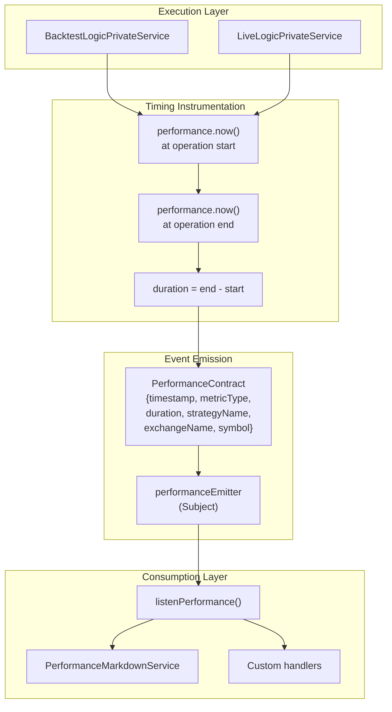
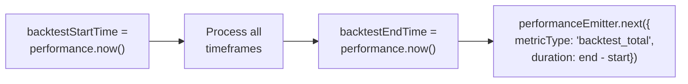
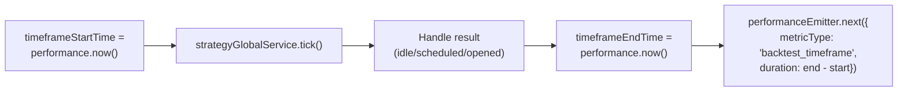
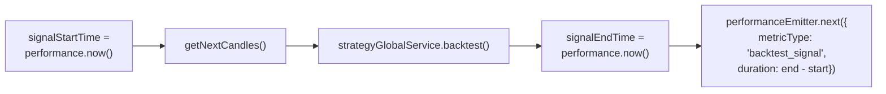
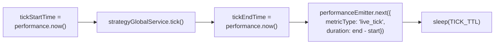
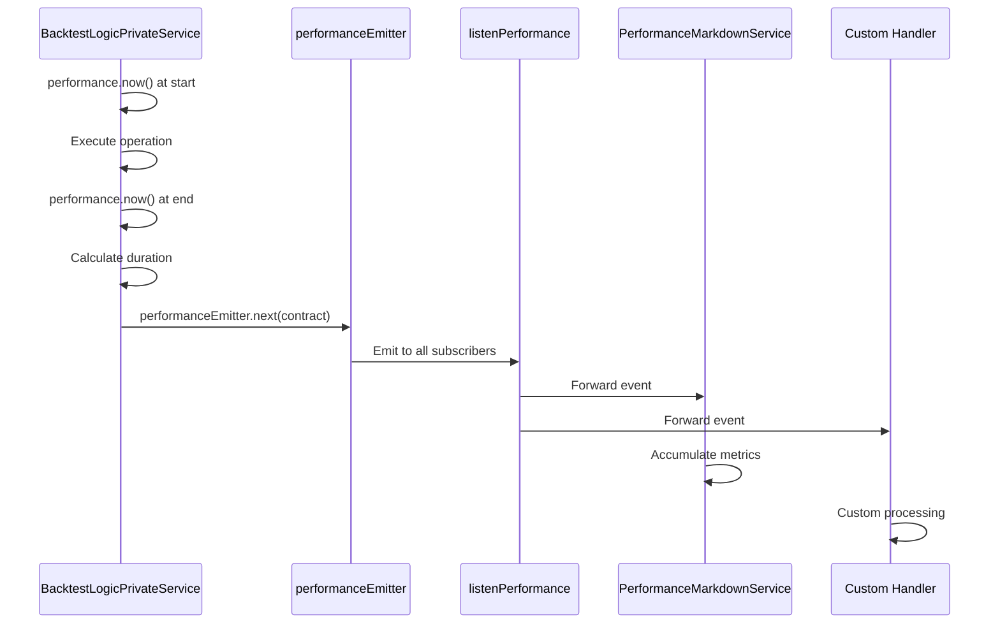

# Performance Metrics

<details>
<summary>Relevant source files</summary>

The following files were used as context for generating this wiki page:

- [src/index.ts](src/index.ts)
- [src/lib/services/logic/private/BacktestLogicPrivateService.ts](src/lib/services/logic/private/BacktestLogicPrivateService.ts)
- [src/lib/services/logic/private/LiveLogicPrivateService.ts](src/lib/services/logic/private/LiveLogicPrivateService.ts)
- [src/lib/services/logic/public/BacktestLogicPublicService.ts](src/lib/services/logic/public/BacktestLogicPublicService.ts)
- [src/lib/services/logic/public/LiveLogicPublicService.ts](src/lib/services/logic/public/LiveLogicPublicService.ts)
- [test/e2e/timing.test.mjs](test/e2e/timing.test.mjs)
- [test/index.mjs](test/index.mjs)
- [types.d.ts](types.d.ts)

</details>


## Purpose

This document describes the performance metrics system in backtest-kit, which tracks execution timing and duration analysis for strategy operations. Performance metrics provide timing data for identifying bottlenecks, analyzing execution patterns, and optimizing strategy performance. These metrics are distinct from trading statistics (see [13.3](#13.3) for PNL calculations and trading performance).

For general reporting capabilities, see [13.1](#13.1). For event system architecture, see [3.4](#3.4).

---

## Performance Metric Types

The framework tracks four types of performance metrics, defined by the `PerformanceMetricType` enum:

| Metric Type | Scope | Description | Execution Mode |
|-------------|-------|-------------|----------------|
| `backtest_total` | Entire backtest | Total duration from start to completion of all timeframes | Backtest only |
| `backtest_timeframe` | Single timeframe | Duration to process one timestamp (tick + potential signal handling) | Backtest only |
| `backtest_signal` | Single signal | Duration to process signal lifecycle (from open to close via backtest method) | Backtest only |
| `live_tick` | Single tick | Duration to execute one tick cycle in live trading | Live only |

Sources: [types.d.ts:95](), [src/index.ts:95]()

---

## Performance Tracking Architecture



**Performance Tracking Flow**

The framework instruments critical operations by recording `performance.now()` timestamps at operation boundaries, calculating duration, and emitting structured events via `performanceEmitter`.

Sources: [src/lib/services/logic/private/BacktestLogicPrivateService.ts:1-303](), [src/lib/services/logic/private/LiveLogicPrivateService.ts:1-117]()

---

## Backtest Performance Tracking

### Total Backtest Duration

Tracks the complete execution time from the first timeframe to the last:



Sources: [src/lib/services/logic/private/BacktestLogicPrivateService.ts:64-65](), [src/lib/services/logic/private/BacktestLogicPrivateService.ts:285-298]()

### Timeframe Processing Duration

Tracks the time to process a single timestamp, including tick execution and potential signal handling:



Sources: [src/lib/services/logic/private/BacktestLogicPrivateService.ts:76](), [src/lib/services/logic/private/BacktestLogicPrivateService.ts:255-269]()

### Signal Processing Duration

Tracks the time to execute the fast-forward backtest simulation for a single signal from open to close:



This metric captures the duration of the optimized backtest path, including candle fetching and TP/SL detection via high/low analysis.

Sources: [src/lib/services/logic/private/BacktestLogicPrivateService.ts:95-172](), [src/lib/services/logic/private/BacktestLogicPrivateService.ts:186-242]()

---

## Live Trading Performance Tracking

### Tick Duration

Tracks the time to execute a complete tick cycle in live trading, including signal generation, risk checks, and TP/SL monitoring:



Sources: [src/lib/services/logic/private/LiveLogicPrivateService.ts:68-91]()

---

## Performance Contract Structure

The `PerformanceContract` interface defines the structure of emitted performance events:

| Field | Type | Description |
|-------|------|-------------|
| `timestamp` | `number` | Unix timestamp (milliseconds) when event was emitted |
| `previousTimestamp` | `number \| null` | Timestamp of previous performance event for calculating gaps |
| `metricType` | `PerformanceMetricType` | Type of metric: `backtest_total`, `backtest_timeframe`, `backtest_signal`, `live_tick` |
| `duration` | `number` | Execution duration in milliseconds |
| `strategyName` | `string` | Strategy name being executed |
| `exchangeName` | `string` | Exchange name being used |
| `symbol` | `string` | Trading pair symbol (e.g., "BTCUSDT") |
| `backtest` | `boolean` | `true` for backtest mode, `false` for live mode |

### Previous Timestamp Tracking

Each service maintains `previousEventTimestamp` to track the time between successive performance events. This enables analysis of execution gaps and idle time:

```typescript
// From BacktestLogicPrivateService
let previousEventTimestamp: number | null = null;

// ... later in code
const currentTimestamp = Date.now();
await performanceEmitter.next({
  timestamp: currentTimestamp,
  previousTimestamp: previousEventTimestamp,
  metricType: "backtest_timeframe",
  duration: timeframeEndTime - timeframeStartTime,
  // ... other fields
});
previousEventTimestamp = currentTimestamp;
```

Sources: [src/lib/services/logic/private/BacktestLogicPrivateService.ts:73](), [src/lib/services/logic/private/BacktestLogicPrivateService.ts:257-269](), [src/lib/services/logic/private/LiveLogicPrivateService.ts:65](), [src/lib/services/logic/private/LiveLogicPrivateService.ts:80-91]()

---

## Subscribing to Performance Events

### Using listenPerformance

The `listenPerformance()` function subscribes to all performance metric events:

```typescript
import { listenPerformance } from "backtest-kit";

listenPerformance((event) => {
  console.log(`[${event.metricType}] ${event.strategyName} - ${event.duration.toFixed(2)}ms`);
  
  if (event.previousTimestamp !== null) {
    const gap = event.timestamp - event.previousTimestamp;
    console.log(`  Time since last event: ${gap.toFixed(2)}ms`);
  }
});
```

### Performance Event Flow



Sources: [src/index.ts:19](), [src/config/emitters.ts]()

---

## Use Cases and Patterns

### Identifying Bottlenecks

Track which operations consume the most time:

```typescript
import { listenPerformance, PerformanceContract } from "backtest-kit";

const durations: Record<string, number[]> = {
  backtest_total: [],
  backtest_timeframe: [],
  backtest_signal: [],
  live_tick: [],
};

listenPerformance((event: PerformanceContract) => {
  durations[event.metricType].push(event.duration);
});

// After execution, analyze
Object.entries(durations).forEach(([type, values]) => {
  const avg = values.reduce((a, b) => a + b, 0) / values.length;
  const max = Math.max(...values);
  console.log(`${type}: avg=${avg.toFixed(2)}ms, max=${max.toFixed(2)}ms`);
});
```

### Detecting Performance Degradation

Monitor execution time increases over the course of a backtest:

```typescript
import { listenPerformance } from "backtest-kit";

const timeframeMetrics: { index: number; duration: number }[] = [];
let frameIndex = 0;

listenPerformance((event) => {
  if (event.metricType === "backtest_timeframe") {
    timeframeMetrics.push({ index: frameIndex++, duration: event.duration });
    
    // Check if last 100 frames are 2x slower than first 100
    if (frameIndex === 200) {
      const first100Avg = timeframeMetrics.slice(0, 100)
        .reduce((sum, m) => sum + m.duration, 0) / 100;
      const last100Avg = timeframeMetrics.slice(100, 200)
        .reduce((sum, m) => sum + m.duration, 0) / 100;
      
      if (last100Avg > first100Avg * 2) {
        console.warn("Performance degradation detected!");
      }
    }
  }
});
```

### Comparing Strategy Performance

Track execution time across multiple strategies in Walker mode:

```typescript
import { listenPerformance, Walker } from "backtest-kit";

const strategyTimings: Record<string, number> = {};

listenPerformance((event) => {
  if (event.metricType === "backtest_total") {
    strategyTimings[event.strategyName] = event.duration;
  }
});

// After walker completion
Object.entries(strategyTimings).forEach(([strategy, duration]) => {
  console.log(`${strategy}: ${(duration / 1000).toFixed(2)} seconds`);
});
```

### Real-time Performance Monitoring

Track live trading tick performance:

```typescript
import { listenPerformance } from "backtest-kit";

const recentTicks: number[] = [];
const WINDOW_SIZE = 100;

listenPerformance((event) => {
  if (event.metricType === "live_tick") {
    recentTicks.push(event.duration);
    
    if (recentTicks.length > WINDOW_SIZE) {
      recentTicks.shift();
    }
    
    const avg = recentTicks.reduce((a, b) => a + b, 0) / recentTicks.length;
    
    // Alert if tick takes too long
    if (event.duration > avg * 3) {
      console.warn(`Slow tick detected: ${event.duration.toFixed(2)}ms (avg: ${avg.toFixed(2)}ms)`);
    }
  }
});
```

Sources: [test/spec/performance.test.mjs]()

---

## Performance Data Accumulation

The `PerformanceMarkdownService` subscribes to performance events and accumulates metrics for later analysis:

```mermaid
graph TB
    subgraph "Event Flow"
        Emitter["performanceEmitter"]
        Init["PerformanceMarkdownService.init()"]
    end
    
    subgraph "Storage"
        Memo["Memoized getStorage(strategyName)"]
        Storage["ReportStorage instance"]
        EventList["_eventList: PerformanceContract[]"]
    end
    
    subgraph "Access Methods"
        GetData["getData(strategyName)"]
        GetReport["getReport(strategyName)"]
        Dump["dump(strategyName, path?)"]
    end
    
    Emitter --> Init
    Init --> Memo
    Memo --> Storage
    Storage --> EventList
    EventList --> GetData
    EventList --> GetReport
    GetReport --> Dump
```

The service maintains a separate storage instance per strategy, allowing isolated performance tracking across multiple concurrent executions.

Sources: [types.d.ts:899-1008](), [src/lib/services/markdown/PerformanceMarkdownService.ts]()

---

## Timing Precision

The framework uses `performance.now()` from Node.js for high-resolution timing:

- **Resolution**: Microsecond precision (typically 0.001ms)
- **Monotonic**: Not affected by system clock adjustments
- **Isolated**: Each measurement is self-contained

### Example Timing Instrumentation

```typescript
// From BacktestLogicPrivateService.ts
const backtestStartTime = performance.now();

// ... execute operations ...

const backtestEndTime = performance.now();
const duration = backtestEndTime - backtestStartTime;

await performanceEmitter.next({
  timestamp: Date.now(),
  previousTimestamp: previousEventTimestamp,
  metricType: "backtest_total",
  duration,
  strategyName: this.methodContextService.context.strategyName,
  exchangeName: this.methodContextService.context.exchangeName,
  symbol,
  backtest: true,
});
```

Sources: [src/lib/services/logic/private/BacktestLogicPrivateService.ts:64-298]()

---

## Integration with Other Systems

Performance metrics integrate with the broader framework architecture:

| System | Integration Point | Purpose |
|--------|------------------|---------|
| Event System | `performanceEmitter` (Subject) | Publish-subscribe for metrics distribution |
| Reporting | `PerformanceMarkdownService` | Accumulate and format performance reports |
| Context Propagation | `MethodContextService` | Inject strategy/exchange names into metrics |
| Execution Modes | `BacktestLogicPrivateService`, `LiveLogicPrivateService` | Instrument operations with timing |

Sources: [src/lib/services/logic/private/BacktestLogicPrivateService.ts:1-303](), [src/lib/services/logic/private/LiveLogicPrivateService.ts:1-117]()