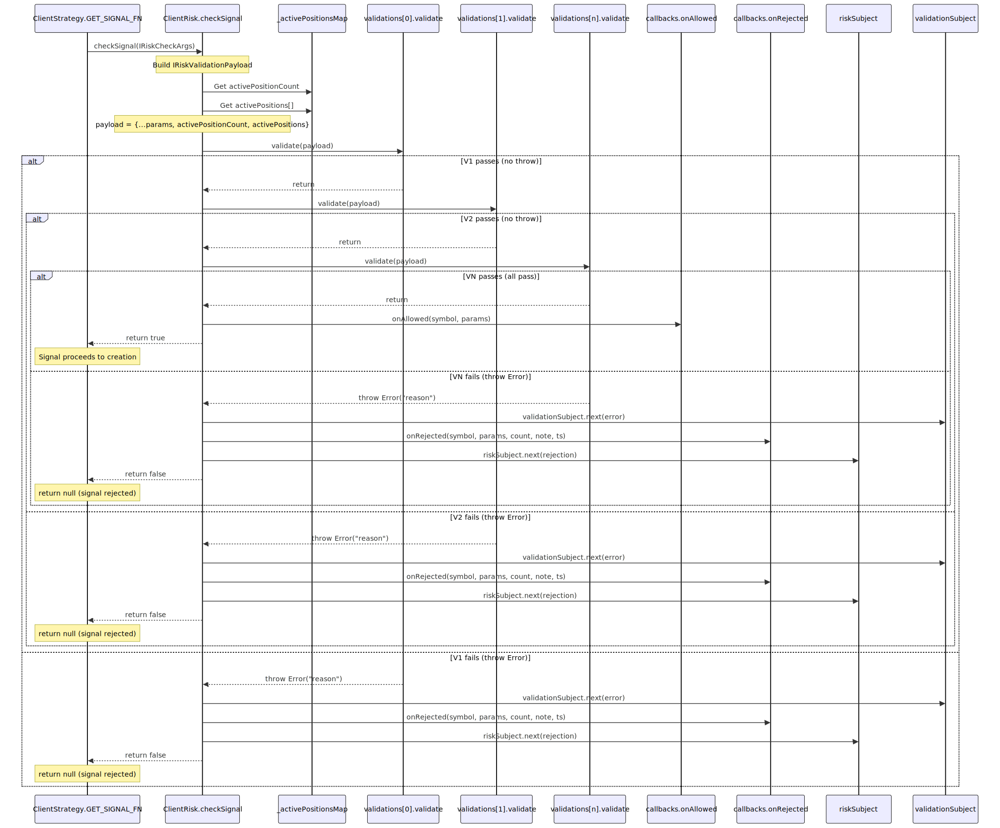
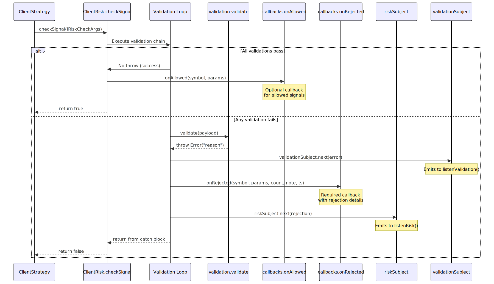

# Risk Validation

This page documents the risk validation system that ensures all signals meet safety and profitability requirements before execution. Risk validation operates as a two-tier system: built-in structural validation and user-defined custom risk rules.

For information about risk profiles and position tracking, see [Risk Profiles](./68_Risk_Profiles.md). For signal lifecycle states, see [Signal Lifecycle Overview](./07_Signal_Lifecycle_Overview.md).

---

## Two-Tier Validation Architecture

The framework employs a two-tier validation system to ensure signal integrity and enforce risk management rules:

1. **Built-in Validation** (`VALIDATE_SIGNAL_FN` in `ClientStrategy`) - Structural validation that prevents logic errors, infinite values, and dangerous price configurations
2. **Custom Risk Validation** (`ClientRisk.checkSignal`) - User-defined business rules via `IRiskValidation[]` chain

### System Architecture




---

## Built-in Signal Validation (VALIDATE_SIGNAL_FN)

The `VALIDATE_SIGNAL_FN` in `ClientStrategy` performs comprehensive structural validation before any signal is created. This validation is **non-negotiable** and cannot be disabled.

### Validation Categories

| Category | Checks | Purpose |
|----------|--------|---------|
| **Required Fields** | `id`, `exchangeName`, `strategyName`, `symbol`, `position`, `_isScheduled` | Ensures signal has all mandatory properties |
| **Type Validation** | `position` must be "long" or "short" | Prevents invalid position types |
| **Finite Number Protection** | `currentPrice`, `priceOpen`, `priceTakeProfit`, `priceStopLoss` must be finite | Guards against NaN/Infinity crashes |
| **Positive Price Validation** | All prices must be > 0 | Prevents negative or zero prices |
| **Price Logic (Long)** | `TP > Open > SL` | Ensures profitable long setup |
| **Price Logic (Short)** | `TP < Open < SL` | Ensures profitable short setup |
| **Immediate Close Protection** | `currentPrice` between TP and SL | Prevents signals that close instantly |
| **Scheduled Signal Protection** | `priceOpen` between TP and SL | Prevents scheduled signals that cancel/close immediately |
| **Minimum TP Distance** | `CC_MIN_TAKEPROFIT_DISTANCE_PERCENT` | Ensures TP covers trading fees |
| **Minimum SL Distance** | `CC_MIN_STOPLOSS_DISTANCE_PERCENT` | Prevents instant stop-out from volatility |
| **Maximum SL Distance** | `CC_MAX_STOPLOSS_DISTANCE_PERCENT` | Limits maximum loss per trade |
| **Time Validation** | `minuteEstimatedTime` must be positive integer | Ensures valid time estimate |
| **Maximum Lifetime** | `CC_MAX_SIGNAL_LIFETIME_MINUTES` | Prevents eternal signals that block strategy |
| **Timestamp Validation** | `scheduledAt`, `pendingAt` must be positive | Ensures valid timestamps |


---

### Price Logic Validation

The validation enforces strict price ordering based on position direction:




---

### Distance Check Implementation

Distance checks ensure signals have adequate profit potential and risk buffers:

```typescript
// Long Position Example (from VALIDATE_SIGNAL_FN)

// MINIMUM TP DISTANCE (must cover fees)
const tpDistancePercent = ((signal.priceTakeProfit - signal.priceOpen) / signal.priceOpen) * 100;
if (tpDistancePercent < GLOBAL_CONFIG.CC_MIN_TAKEPROFIT_DISTANCE_PERCENT) {
  throw new Error(`TakeProfit too close (${tpDistancePercent.toFixed(3)}%)`);
}

// MINIMUM SL DISTANCE (avoid instant stop on volatility)
const slDistancePercent = ((signal.priceOpen - signal.priceStopLoss) / signal.priceOpen) * 100;
if (slDistancePercent < GLOBAL_CONFIG.CC_MIN_STOPLOSS_DISTANCE_PERCENT) {
  throw new Error(`StopLoss too close (${slDistancePercent.toFixed(3)}%)`);
}

// MAXIMUM SL DISTANCE (capital protection)
if (slDistancePercent > GLOBAL_CONFIG.CC_MAX_STOPLOSS_DISTANCE_PERCENT) {
  throw new Error(`StopLoss too far (${slDistancePercent.toFixed(3)}%)`);
}
```

**Default Configuration Values:**

| Parameter | Default | Purpose |
|-----------|---------|---------|
| `CC_MIN_TAKEPROFIT_DISTANCE_PERCENT` | 0.5% | Minimum TP distance to cover trading fees (0.1% entry + 0.1% exit + slippage) |
| `CC_MIN_STOPLOSS_DISTANCE_PERCENT` | 0.2% | Minimum SL buffer to prevent instant stop-out from market noise |
| `CC_MAX_STOPLOSS_DISTANCE_PERCENT` | 10% | Maximum loss limit to protect capital |
| `CC_MAX_SIGNAL_LIFETIME_MINUTES` | 43,200 (30 days) | Prevents eternal signals that block risk limits |


---

### Immediate Close Protection

A critical protection prevents signals that would close immediately after opening:




---

## Custom Risk Validation (ClientRisk.checkSignal)

After passing built-in validation, signals are evaluated against user-defined risk rules via `ClientRisk.checkSignal()` which executes the `IRiskValidation[]` chain.

### Type Definitions and Relationships




---

### Validation Chain Execution

The `ClientRisk.checkSignal()` method executes custom risk validations sequentially in a **fail-fast** pattern. Each validation function receives `IRiskValidationPayload` and throws on rejection.

#### ClientRisk.checkSignal Implementation Flow




---

### IRiskValidationPayload Structure

The validation payload extends `IRiskCheckArgs` with portfolio-level context:

#### Payload Fields

| Field | Type | Source | Description |
|-------|------|--------|-------------|
| `pendingSignal` | `ISignalDto` | From `IRiskCheckArgs` | Signal being validated (may not have `id` yet) |
| `symbol` | `string` | From `IRiskCheckArgs` | Trading pair (e.g., "BTCUSDT") |
| `strategyName` | `string` | From `IRiskCheckArgs` | Strategy identifier |
| `exchangeName` | `string` | From `IRiskCheckArgs` | Exchange identifier |
| `currentPrice` | `number` | From `IRiskCheckArgs` | Current market price (VWAP from `exchange.getAveragePrice`) |
| `timestamp` | `number` | From `IRiskCheckArgs` | Validation timestamp (ms since epoch) |
| `activePositionCount` | `number` | Computed by `ClientRisk` | Number of currently active positions across all strategies |
| `activePositions` | `IRiskActivePosition[]` | From `ClientRisk._activePositionsMap` | Array of all active positions with signal details |

#### IRiskActivePosition Structure

```typescript
interface IRiskActivePosition {
  signal: ISignalRow;          // Full signal data
  strategyName: string;         // Strategy that owns this position
  exchangeName: string;         // Exchange identifier
  openTimestamp: number;        // When position was opened (ms)
}
```

**Payload Construction Location:** [src/client/ClientRisk.ts]()

#### Example: Risk-Reward Ratio Validation

```javascript
// IRiskValidation with note and validate function
{
  validate: ({ pendingSignal, currentPrice }) => {
    const { priceOpen = currentPrice, priceTakeProfit, priceStopLoss, position } = pendingSignal;
    
    // Calculate reward (distance to TP)
    const reward = position === "long"
      ? priceTakeProfit - priceOpen
      : priceOpen - priceTakeProfit;
    
    // Calculate risk (distance to SL)
    const risk = position === "long"
      ? priceOpen - priceStopLoss
      : priceStopLoss - priceOpen;
    
    if (risk <= 0) {
      throw new Error("Invalid SL: risk must be positive");
    }
    
    const rrRatio = reward / risk;
    if (rrRatio < 2) {
      throw new Error(`RR ratio ${rrRatio.toFixed(2)} < 2:1 required`);
    }
  },
  note: "Risk-Reward ratio must be at least 1:2"
}
```

#### Example: Portfolio Position Limit Validation

```javascript
// Using activePositionCount from payload
{
  validate: ({ activePositionCount }) => {
    if (activePositionCount >= 3) {
      throw new Error(`Max 3 concurrent positions (current: ${activePositionCount})`);
    }
  },
  note: "Limit portfolio to 3 concurrent positions"
}
```

#### Example: Position Correlation Check

```javascript
// Using activePositions array from payload
{
  validate: ({ pendingSignal, activePositions, symbol }) => {
    const sameSymbolCount = activePositions.filter(pos => pos.signal.symbol === symbol).length;
    if (sameSymbolCount >= 2) {
      throw new Error(`Max 2 positions per symbol (${symbol} has ${sameSymbolCount})`);
    }
    
    const sameDirectionCount = activePositions.filter(
      pos => pos.signal.position === pendingSignal.position
    ).length;
    if (sameDirectionCount >= 5) {
      throw new Error(`Max 5 ${pendingSignal.position} positions (current: ${sameDirectionCount})`);
    }
  },
  note: "Limit symbol concentration and directional bias"
}
```


---

## Validation Points in Signal Lifecycle

Risk validation occurs at **two critical checkpoints** in the signal lifecycle to ensure safety at generation and activation.

### Checkpoint Locations in ClientStrategy


### Checkpoint 1: Signal Generation

**Location:** [src/client/ClientStrategy.ts:374-387]()

```typescript
// Inside GET_SIGNAL_FN after VALIDATE_SIGNAL_FN passes
if (
  await not(
    self.params.risk.checkSignal({
      pendingSignal: signal,
      symbol: self.params.execution.context.symbol,
      strategyName: self.params.method.context.strategyName,
      exchangeName: self.params.method.context.exchangeName,
      currentPrice,
      timestamp: currentTime,
    })
  )
) {
  return null; // Signal rejected by custom risk rules
}
```

**Purpose:** Validates signal against portfolio risk rules at generation time. If rejected, signal is never created and strategy remains idle.

### Checkpoint 2: Scheduled Signal Activation

**Location:** [src/client/ClientStrategy.ts:711-729]()

```typescript
// Inside ACTIVATE_SCHEDULED_SIGNAL_FN before activating scheduled signal
if (
  await not(
    self.params.risk.checkSignal({
      symbol: self.params.execution.context.symbol,
      pendingSignal: scheduled,
      strategyName: self.params.method.context.strategyName,
      exchangeName: self.params.method.context.exchangeName,
      currentPrice: scheduled.priceOpen,
      timestamp: activationTime,
    })
  )
) {
  self.params.logger.info("ClientStrategy scheduled signal rejected by risk", {
    symbol: self.params.execution.context.symbol,
    signalId: scheduled.id,
  });
  await self.setScheduledSignal(null);
  return null; // Scheduled signal cancelled at activation
}
```

**Purpose:** Re-validates scheduled signals at activation time because market conditions may have changed since generation:

- Portfolio may now be full (reached `activePositionCount` limit)
- New positions may have created unwanted correlation
- Risk parameters may have been updated

**Key Difference:** The `currentPrice` parameter differs between checkpoints:
- **Checkpoint 1:** Uses `currentPrice` from `exchange.getAveragePrice()` at generation time
- **Checkpoint 2:** Uses `scheduled.priceOpen` (the activation price)


---

## Fail-Fast Pattern

The validation system implements a **fail-fast pattern** where rejected signals immediately abort signal creation and emit rejection events for monitoring:



**Rejection Event Structure:**

```typescript
interface IRiskEvent {
  symbol: string;
  strategyName: string;
  exchangeName: string;
  currentPrice: number;
  timestamp: number;
  pendingSignal: ISignalDto | ISignalRow;
  error: Error;
}
```

Rejection events are emitted via `riskEmitter` for observability. Applications can subscribe using `listenRisk()` to track rejected signals for strategy tuning.


---

## Configuration Parameters

Global configuration parameters control validation behavior:

### Distance Parameters

| Parameter | Default | Configurable Via | Impact |
|-----------|---------|------------------|--------|
| `CC_MIN_TAKEPROFIT_DISTANCE_PERCENT` | 0.5% | `setConfig({ CC_MIN_TAKEPROFIT_DISTANCE_PERCENT: 1.0 })` | Ensures TP covers trading fees and slippage |
| `CC_MIN_STOPLOSS_DISTANCE_PERCENT` | 0.2% | `setConfig({ CC_MIN_STOPLOSS_DISTANCE_PERCENT: 0.5 })` | Prevents instant stop-out from market noise |
| `CC_MAX_STOPLOSS_DISTANCE_PERCENT` | 10% | `setConfig({ CC_MAX_STOPLOSS_DISTANCE_PERCENT: 5.0 })` | Limits maximum loss per position |

### Time Parameters

| Parameter | Default | Configurable Via | Impact |
|-----------|---------|------------------|--------|
| `CC_MAX_SIGNAL_LIFETIME_MINUTES` | 43,200 (30 days) | `setConfig({ CC_MAX_SIGNAL_LIFETIME_MINUTES: 10080 })` | Prevents eternal signals that block strategy |
| `CC_SCHEDULE_AWAIT_MINUTES` | 1,440 (24 hours) | `setConfig({ CC_SCHEDULE_AWAIT_MINUTES: 720 })` | Max time to wait for scheduled signal activation |
| `CC_MAX_SIGNAL_GENERATION_SECONDS` | 30 | `setConfig({ CC_MAX_SIGNAL_GENERATION_SECONDS: 60 })` | Timeout for `getSignal()` execution |

### Example Configuration

```typescript
import { setConfig } from "backtest-kit";

setConfig({
  // Tighter validation for scalping strategies
  CC_MIN_TAKEPROFIT_DISTANCE_PERCENT: 0.8,
  CC_MIN_STOPLOSS_DISTANCE_PERCENT: 0.3,
  CC_MAX_STOPLOSS_DISTANCE_PERCENT: 3.0,
  
  // Shorter timeouts for high-frequency trading
  CC_MAX_SIGNAL_LIFETIME_MINUTES: 1440, // 1 day max
  CC_SCHEDULE_AWAIT_MINUTES: 60, // 1 hour max wait
});
```


---

## Common Validation Patterns

### Pattern 1: Risk-Reward Ratio Enforcement

```javascript
{
  validate: ({ pendingSignal, currentPrice }) => {
    const { priceOpen = currentPrice, priceTakeProfit, priceStopLoss, position } = pendingSignal;
    
    const reward = position === "long"
      ? priceTakeProfit - priceOpen
      : priceOpen - priceTakeProfit;
    
    const risk = position === "long"
      ? priceOpen - priceStopLoss
      : priceStopLoss - priceOpen;
    
    const rrRatio = reward / risk;
    if (rrRatio < 2) {
      throw new Error(`RR ratio ${rrRatio.toFixed(2)} < 2:1 required`);
    }
  },
  note: "Minimum 1:2 risk-reward ratio"
}
```

### Pattern 2: Maximum Concurrent Positions

```javascript
{
  validate: async ({ symbol, strategyName }) => {
    const activeCount = await getActiveSignalCount(strategyName);
    if (activeCount >= 3) {
      throw new Error(`Max 3 concurrent positions (current: ${activeCount})`);
    }
  },
  note: "Limit concurrent positions per strategy"
}
```

### Pattern 3: Minimum Take-Profit Percentage

```javascript
{
  validate: ({ pendingSignal, currentPrice }) => {
    const { priceOpen = currentPrice, priceTakeProfit, position } = pendingSignal;
    
    const tpDistance = position === "long"
      ? ((priceTakeProfit - priceOpen) / priceOpen) * 100
      : ((priceOpen - priceTakeProfit) / priceOpen) * 100;
    
    if (tpDistance < 1) {
      throw new Error(`TP distance ${tpDistance.toFixed(2)}% < 1% minimum`);
    }
  },
  note: "TP distance must be at least 1%"
}
```

### Pattern 4: Symbol-Specific Rules

```javascript
{
  validate: ({ symbol, pendingSignal }) => {
    if (symbol === "BTCUSDT" && pendingSignal.minuteEstimatedTime > 1440) {
      throw new Error("BTC signals limited to 24h max");
    }
    if (symbol.includes("USD") && pendingSignal.minuteEstimatedTime < 60) {
      throw new Error("USD pairs require minimum 1h timeframe");
    }
  },
  note: "Symbol-specific time constraints"
}
```


---

## Integration with Signal Lifecycle

Risk validation integrates seamlessly with the signal state machine:




---

## Callback System (onAllowed / onRejected)

The `IRiskCallbacks` interface provides hooks for monitoring validation decisions in real-time.

### IRiskCallbacks Interface Definition

```typescript
interface IRiskCallbacks {
  /** Called when a signal is rejected due to risk limits */
  onRejected: (
    symbol: string,
    params: IRiskCheckArgs,
    activePositionCount: number,
    comment: string,
    timestamp: number
  ) => void;
  
  /** Called when a signal passes risk checks */
  onAllowed: (
    symbol: string,
    params: IRiskCheckArgs
  ) => void;
}
```


### Callback Invocation Flow




### Example: Logging Allowed Signals

```javascript
import { addRisk } from "backtest-kit";

addRisk({
  riskName: "demo-risk",
  validations: [
    // ... validation functions
  ],
  callbacks: {
    onAllowed: (symbol, params) => {
      console.log(`[ALLOWED] ${symbol} signal from ${params.strategyName}`);
      console.log(`  Position: ${params.pendingSignal.position}`);
      console.log(`  Price: ${params.currentPrice}`);
      console.log(`  TP: ${params.pendingSignal.priceTakeProfit}`);
      console.log(`  SL: ${params.pendingSignal.priceStopLoss}`);
    },
    onRejected: (symbol, params, activePositionCount, comment, timestamp) => {
      console.error(`[REJECTED] ${symbol} signal from ${params.strategyName}`);
      console.error(`  Reason: ${comment}`);
      console.error(`  Active positions: ${activePositionCount}`);
      console.error(`  Price: ${params.currentPrice}`);
      console.error(`  Time: ${new Date(timestamp).toISOString()}`);
    },
  },
});
```

### Example: Alerting on Risk Rejections

```javascript
import { addRisk } from "backtest-kit";
import { sendAlert } from "./alerts.js";

addRisk({
  riskName: "monitored-risk",
  validations: [
    // ... validation functions
  ],
  callbacks: {
    onRejected: async (symbol, params, activePositionCount, comment, timestamp) => {
      // Send alert to monitoring system
      await sendAlert({
        level: "warning",
        title: `Risk rejection on ${symbol}`,
        message: `Strategy ${params.strategyName} rejected: ${comment}`,
        metadata: {
          symbol,
          strategy: params.strategyName,
          activePositions: activePositionCount,
          price: params.currentPrice,
          timestamp: new Date(timestamp).toISOString(),
        },
      });
    },
  },
});
```

### Callback vs Event Emitters

The callback system provides three layers of observability:

| Layer | Mechanism | Scope | Use Case |
|-------|-----------|-------|----------|
| **Schema Callbacks** | `IRiskCallbacks.onRejected/onAllowed` | Per-risk profile | Risk-specific logging, custom actions |
| **Event Emitters** | `riskSubject`, `validationSubject` | Global | Cross-strategy monitoring, dashboard updates |
| **Report Generation** | `RiskMarkdownService` | Per-report dump | Post-execution analysis, debugging |

**Event Emitters:**
- `riskSubject` [src/config/emitters.ts:127-131]() - Emits `RiskContract` for risk rejections
- `validationSubject` [src/config/emitters.ts:109-112]() - Emits `Error` for validation failures

**Subscription Example:**

```javascript
import { listenRisk } from "backtest-kit";

listenRisk((event) => {
  console.log(`[RISK EVENT] ${event.symbol} rejected`);
  console.log(`  Strategy: ${event.strategyName}`);
  console.log(`  Reason: ${event.comment}`);
  console.log(`  Active: ${event.activePositionCount}`);
});
```


---

## Summary

The risk validation system provides **defense in depth** through:

1. **Built-in Validation** - Prevents structural errors, NaN/Infinity, dangerous price configurations
2. **Custom Risk Rules** - Enforces business logic (RR ratios, position limits, portfolio rules)
3. **Fail-Fast Pattern** - Rejects invalid signals immediately before position creation
4. **Double Validation** - Re-validates scheduled signals at activation to account for market changes
5. **Comprehensive Observability** - Emits events, logs warnings, generates reports for all rejections

This ensures that **only high-quality, risk-managed signals reach execution**, protecting capital and preventing strategy errors.

