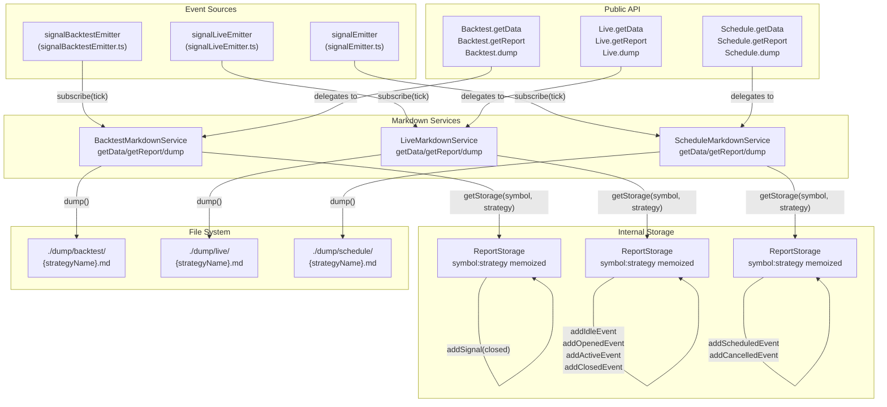
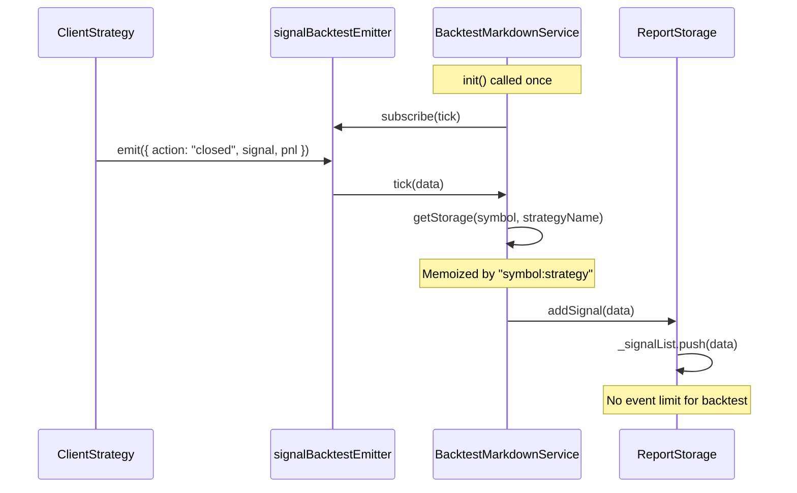
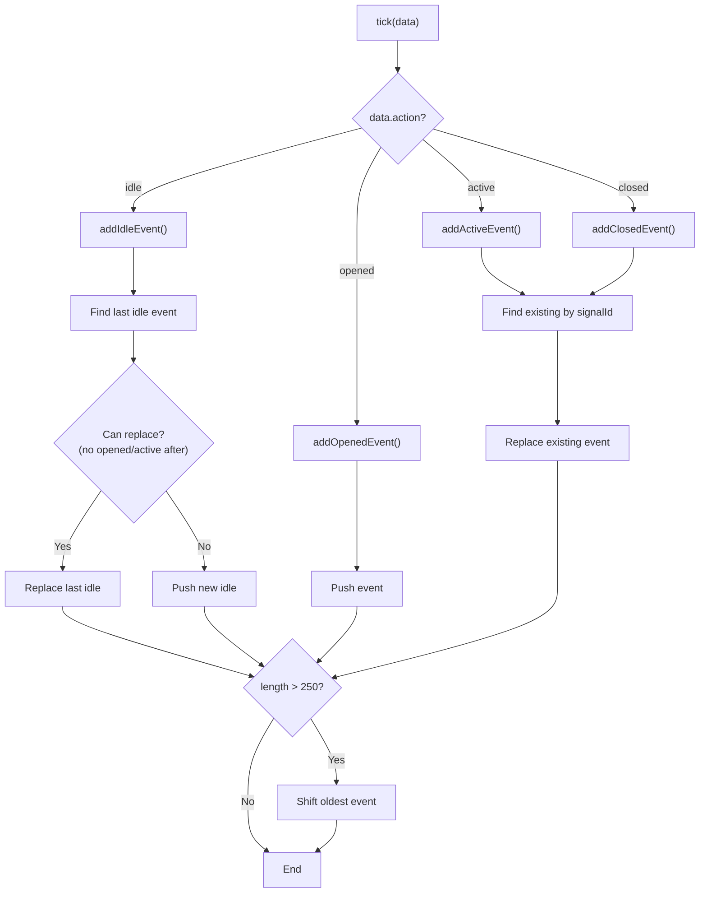
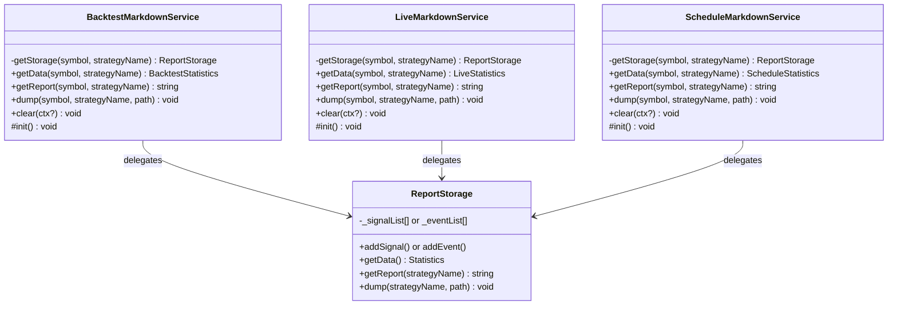
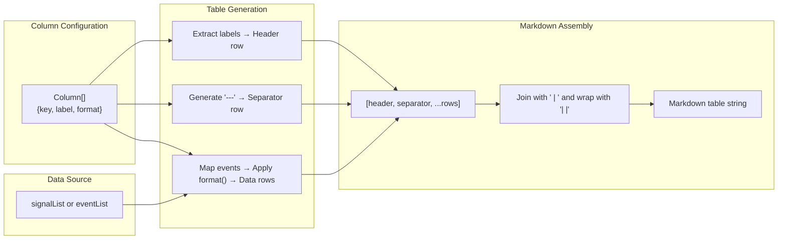
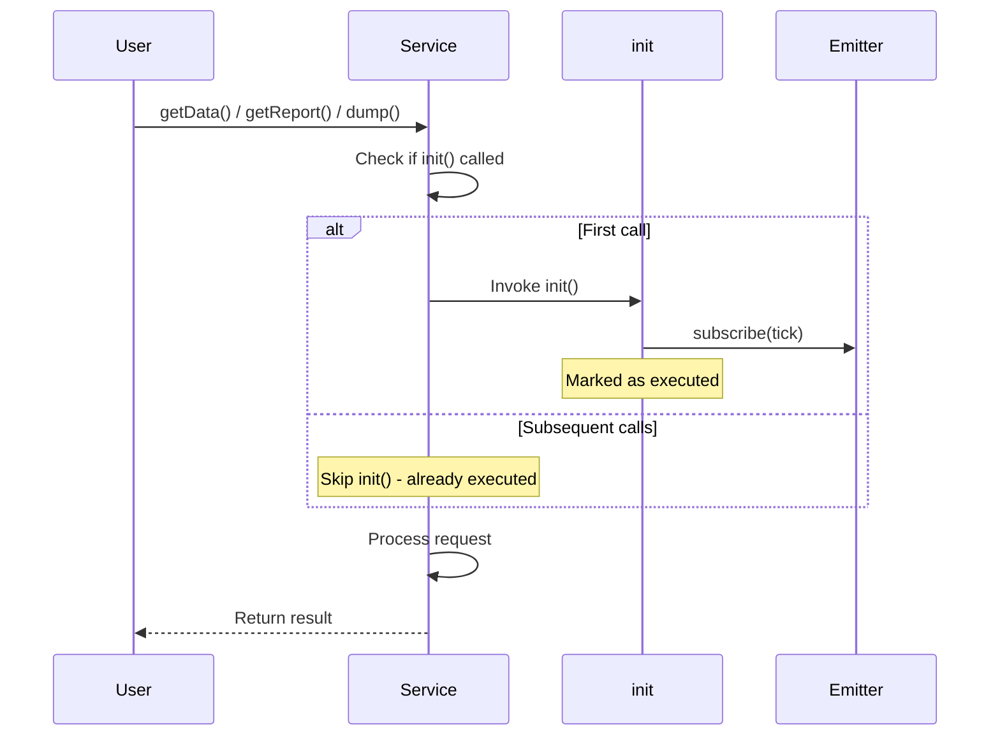

# Markdown Report Generation

<details>
<summary>Relevant source files</summary>

The following files were used as context for generating this wiki page:

- [README.md](README.md)
- [src/lib/services/markdown/BacktestMarkdownService.ts](src/lib/services/markdown/BacktestMarkdownService.ts)
- [src/lib/services/markdown/LiveMarkdownService.ts](src/lib/services/markdown/LiveMarkdownService.ts)
- [src/lib/services/markdown/ScheduleMarkdownService.ts](src/lib/services/markdown/ScheduleMarkdownService.ts)

</details>


This page documents the markdown report generation system that transforms trading execution events into human-readable reports with statistical analysis. The system provides three report types: backtest reports (historical simulation), live trading reports (real-time execution), and schedule reports (limit order tracking).

For statistical metric calculations (Sharpe Ratio, Certainty Ratio, etc.), see [Performance Metrics](#13.2). For partial profit/loss milestone tracking, see [Partial Profit/Loss Tracking](#13.4). For walker strategy comparison reports, see [Walker Reports](#11.3).

---

## Architecture Overview

The markdown generation system consists of three independent service classes that follow identical architectural patterns. Each service subscribes to event emitters, accumulates events in per-strategy storage, and provides three methods for data access (`getData`), report generation (`getReport`), and file persistence (`dump`).



**Sources:** [src/lib/services/markdown/BacktestMarkdownService.ts:1-545](), [src/lib/services/markdown/LiveMarkdownService.ts:1-749](), [src/lib/services/markdown/ScheduleMarkdownService.ts:1-548]()

---

## Event Accumulation System

Each markdown service subscribes to event emitters during initialization using the `singleshot` pattern to ensure single subscription. Events are processed by a private `tick()` method that routes them to per-strategy storage instances.

### Backtest Event Accumulation

`BacktestMarkdownService` only accumulates `closed` events (signals that have reached TP, SL, or timeout). Idle, opened, and active events are ignored since backtest execution skips timeframes once a signal opens.



**Sources:** [src/lib/services/markdown/BacktestMarkdownService.ts:402-413](), [src/lib/services/markdown/BacktestMarkdownService.ts:538-541]()

### Live Event Accumulation

`LiveMarkdownService` accumulates all four event types: `idle`, `opened`, `active`, and `closed`. The service implements special logic to replace consecutive idle events (no signal activity) to prevent unbounded memory growth, while preserving opened/active/closed events.



**Sources:** [src/lib/services/markdown/LiveMarkdownService.ts:239-266](), [src/lib/services/markdown/LiveMarkdownService.ts:299-329](), [src/lib/services/markdown/LiveMarkdownService.ts:337-373]()

The `MAX_EVENTS = 250` constant limits memory usage by removing the oldest event when capacity is exceeded. This circular buffer approach ensures bounded memory consumption for long-running live strategies.

**Sources:** [src/lib/services/markdown/LiveMarkdownService.ts:223]()

### Schedule Event Accumulation

`ScheduleMarkdownService` tracks scheduled signals (limit orders waiting for entry price) and their cancellations. When a scheduled signal is cancelled, the service replaces the original scheduled event with a cancelled event containing cancellation metadata.

**Sources:** [src/lib/services/markdown/ScheduleMarkdownService.ts:176-194](), [src/lib/services/markdown/ScheduleMarkdownService.ts:202-237]()

---

## Report Generation Services

Each markdown service contains an inner `ReportStorage` class that encapsulates event accumulation logic and report generation. The service class itself acts as a facade that manages per-strategy storage instances using memoization.

### BacktestMarkdownService

The backtest service generates reports with closed signal data in a tabular format. Each row represents a completed trade with open/close prices, PNL, duration, and close reason.

| Component | Purpose | Code Reference |
|-----------|---------|----------------|
| `BacktestMarkdownService` | Facade service managing storage instances | [BacktestMarkdownService.ts:370-542]() |
| `ReportStorage` | Inner class storing signal list | [BacktestMarkdownService.ts:183-341]() |
| `BacktestStatistics` | Interface for statistical data | [BacktestMarkdownService.ts:66-102]() |
| `Column[]` | Table column definitions | [BacktestMarkdownService.ts:104-177]() |
| `getStorage()` | Memoized storage retriever | [BacktestMarkdownService.ts:378-381]() |

**Sources:** [src/lib/services/markdown/BacktestMarkdownService.ts:370-542]()

### LiveMarkdownService

The live service generates reports with all event types (idle, opened, active, closed). The report shows strategy activity timeline including periods of inactivity and active position monitoring.

| Component | Purpose | Code Reference |
|-----------|---------|----------------|
| `LiveMarkdownService` | Facade service managing storage instances | [LiveMarkdownService.ts:567-746]() |
| `ReportStorage` | Inner class storing event list | [LiveMarkdownService.ts:229-535]() |
| `LiveStatistics` | Interface for statistical data | [LiveMarkdownService.ts:91-130]() |
| `TickEvent` | Unified event data structure | [LiveMarkdownService.ts:39-66]() |
| `Column[]` | Table column definitions | [LiveMarkdownService.ts:145-220]() |
| `MAX_EVENTS` | Event queue capacity (250) | [LiveMarkdownService.ts:223]() |

**Sources:** [src/lib/services/markdown/LiveMarkdownService.ts:567-746]()

### ScheduleMarkdownService

The schedule service tracks scheduled signals and their cancellation metrics. Reports include cancellation rate and average wait time for cancelled orders.

| Component | Purpose | Code Reference |
|-----------|---------|----------------|
| `ScheduleMarkdownService` | Facade service managing storage instances | [ScheduleMarkdownService.ts:374-545]() |
| `ReportStorage` | Inner class storing scheduled events | [ScheduleMarkdownService.ts:167-351]() |
| `ScheduleStatistics` | Interface for statistical data | [ScheduleMarkdownService.ts:68-86]() |
| `ScheduledEvent` | Scheduled/cancelled event data | [ScheduleMarkdownService.ts:19-44]() |
| `Column[]` | Table column definitions | [ScheduleMarkdownService.ts:101-158]() |

**Sources:** [src/lib/services/markdown/ScheduleMarkdownService.ts:374-545]()

---

## Three-Method Pattern

All markdown services implement a consistent three-method API pattern: `getData()`, `getReport()`, and `dump()`. This separation of concerns enables flexible data access for different use cases.



**Sources:** [src/lib/services/markdown/BacktestMarkdownService.ts:430-495](), [src/lib/services/markdown/LiveMarkdownService.ts:634-699](), [src/lib/services/markdown/ScheduleMarkdownService.ts:430-498]()

### getData() - Statistical Data Access

The `getData()` method returns a statistics object containing raw event data and calculated metrics. This method is used for programmatic access to report data without markdown formatting.

```typescript
// Example: BacktestStatistics interface
interface BacktestStatistics {
  signalList: IStrategyTickResultClosed[];  // Raw event data
  totalSignals: number;
  winCount: number;
  lossCount: number;
  winRate: number | null;        // null if unsafe (NaN/Infinity)
  avgPnl: number | null;
  totalPnl: number | null;
  stdDev: number | null;
  sharpeRatio: number | null;
  annualizedSharpeRatio: number | null;
  certaintyRatio: number | null;
  expectedYearlyReturns: number | null;
}
```

All numeric metrics use the `isUnsafe()` guard function to return `null` instead of `NaN` or `Infinity`. This prevents downstream errors when metrics cannot be calculated (e.g., Sharpe Ratio with zero standard deviation).

**Sources:** [src/lib/services/markdown/BacktestMarkdownService.ts:27-44](), [src/lib/services/markdown/BacktestMarkdownService.ts:202-270]()

### getReport() - Markdown Generation

The `getReport()` method formats statistical data into markdown tables with human-readable formatting. The method delegates to `ReportStorage.getReport()` which constructs the markdown string.

**Markdown Structure:**
1. Title: `# Backtest Report: {strategyName}`
2. Data table with formatted columns
3. Statistics summary with formatted percentages

**Column Formatting:**
- Prices: 8 decimal places with "USD" suffix
- PNL: 2 decimal places with +/- prefix and "%" suffix
- Timestamps: ISO 8601 format
- Duration: Integer minutes

**Sources:** [src/lib/services/markdown/BacktestMarkdownService.ts:278-314](), [src/lib/services/markdown/LiveMarkdownService.ts:472-508]()

### dump() - File Persistence

The `dump()` method writes markdown reports to disk using Node.js file system APIs. The method creates directories recursively if they don't exist and uses UTF-8 encoding.

**Default Paths:**
- Backtest: `./dump/backtest/{strategyName}.md`
- Live: `./dump/live/{strategyName}.md`
- Schedule: `./dump/schedule/{strategyName}.md`

**Sources:** [src/lib/services/markdown/BacktestMarkdownService.ts:322-340](), [src/lib/services/markdown/LiveMarkdownService.ts:516-534](), [src/lib/services/markdown/ScheduleMarkdownService.ts:332-350]()

---

## Markdown Table Generation

Tables are generated using a column configuration system that defines label, key, and formatting function for each column. The system maps event data to table rows using these column definitions.



**Sources:** [src/lib/services/markdown/BacktestMarkdownService.ts:289-296](), [src/lib/services/markdown/LiveMarkdownService.ts:483-490]()

### Backtest Columns

The backtest table includes 12 columns showing complete signal lifecycle data:

| Column | Format | Example |
|--------|--------|---------|
| Signal ID | UUID string | `abc123-def456` |
| Symbol | Trading pair | `BTCUSDT` |
| Position | LONG/SHORT | `LONG` |
| Note | User-provided string | `Breakout entry` |
| Open Price | 8 decimals + USD | `50000.12345678 USD` |
| Close Price | 8 decimals + USD | `51500.00000000 USD` |
| Take Profit | 8 decimals + USD | `52000.00000000 USD` |
| Stop Loss | 8 decimals + USD | `49000.00000000 USD` |
| PNL (net) | +/- 2 decimals + % | `+3.00%` |
| Close Reason | Enum string | `TAKEPROFIT` / `STOPLOSS` / `TIMEOUT` |
| Duration (min) | Integer minutes | `120` |
| Open Time | ISO 8601 | `2024-01-15T10:30:00.000Z` |
| Close Time | ISO 8601 | `2024-01-15T12:30:00.000Z` |

**Sources:** [src/lib/services/markdown/BacktestMarkdownService.ts:104-177]()

### Live Columns

The live table includes 13 columns showing all event types including idle periods:

| Column | Format | Example |
|--------|--------|---------|
| Timestamp | ISO 8601 | `2024-01-15T10:30:00.000Z` |
| Action | IDLE/OPENED/ACTIVE/CLOSED | `CLOSED` |
| Symbol | Trading pair or N/A | `BTCUSDT` |
| Signal ID | UUID or N/A | `abc123-def456` |
| Position | LONG/SHORT or N/A | `LONG` |
| Note | User string or N/A | `Breakout entry` |
| Current Price | 8 decimals + USD | `51500.00000000 USD` |
| Open Price | 8 decimals + USD or N/A | `50000.12345678 USD` |
| Take Profit | 8 decimals + USD or N/A | `52000.00000000 USD` |
| Stop Loss | 8 decimals + USD or N/A | `49000.00000000 USD` |
| PNL (net) | +/- 2 decimals + % or N/A | `+3.00%` |
| Close Reason | Enum or N/A | `TAKEPROFIT` |
| Duration (min) | Integer or N/A | `120` |

**Sources:** [src/lib/services/markdown/LiveMarkdownService.ts:145-220]()

### Schedule Columns

The schedule table includes 11 columns focused on scheduled signal lifecycle:

| Column | Format | Example |
|--------|--------|---------|
| Timestamp | ISO 8601 | `2024-01-15T10:30:00.000Z` |
| Action | SCHEDULED/CANCELLED | `CANCELLED` |
| Symbol | Trading pair | `BTCUSDT` |
| Signal ID | UUID string | `abc123-def456` |
| Position | LONG/SHORT | `LONG` |
| Note | User string or N/A | `Limit order` |
| Current Price | 8 decimals + USD | `50500.00000000 USD` |
| Entry Price | 8 decimals + USD | `50000.00000000 USD` |
| Take Profit | 8 decimals + USD | `52000.00000000 USD` |
| Stop Loss | 8 decimals + USD | `49000.00000000 USD` |
| Wait Time (min) | Integer or N/A | `45` |

**Sources:** [src/lib/services/markdown/ScheduleMarkdownService.ts:101-158]()

---

## Storage Management

Each markdown service uses memoized storage to maintain per-symbol-strategy isolation. This prevents data mixing between different trading pairs and strategies running in parallel.

### Memoization Strategy

Storage instances are memoized using the key pattern `"symbol:strategyName"`. The memoization ensures that repeated calls for the same symbol-strategy pair return the same storage instance, while different pairs get isolated storage.

```typescript
// Memoized storage retrieval pattern (all services)
private getStorage = memoize<(symbol: string, strategyName: string) => ReportStorage>(
  ([symbol, strategyName]) => `${symbol}:${strategyName}`,
  () => new ReportStorage()
);
```

**Sources:** [src/lib/services/markdown/BacktestMarkdownService.ts:378-381](), [src/lib/services/markdown/LiveMarkdownService.ts:575-578](), [src/lib/services/markdown/ScheduleMarkdownService.ts:382-385]()

### Clear Operation

The `clear()` method provides two modes of operation:
1. **Targeted Clear**: Clear specific symbol-strategy pair by providing context
2. **Global Clear**: Clear all storage instances when no context provided

```typescript
// Clear specific pair
await service.clear({ symbol: "BTCUSDT", strategyName: "my-strategy" });

// Clear all pairs
await service.clear();
```

The clear operation directly calls `memoize.clear()` which removes entries from the internal cache, allowing garbage collection of storage instances.

**Sources:** [src/lib/services/markdown/BacktestMarkdownService.ts:515-525](), [src/lib/services/markdown/LiveMarkdownService.ts:719-729](), [src/lib/services/markdown/ScheduleMarkdownService.ts:518-528]()

---

## Event Type Processing

Each service processes different subsets of the event action types emitted by `ClientStrategy`. The action filtering determines which events contribute to the report.

### Backtest Event Types

Backtest only processes `action === "closed"` events. All other actions (`idle`, `opened`, `active`) are ignored because backtest execution uses fast-forward simulation that skips timeframes once a signal opens.

```typescript
private tick = async (data: IStrategyTickResult) => {
  if (data.action !== "closed") {
    return;  // Ignore non-closed events
  }
  
  const storage = this.getStorage(data.symbol, data.strategyName);
  storage.addSignal(data);
};
```

**Sources:** [src/lib/services/markdown/BacktestMarkdownService.ts:402-413]()

### Live Event Types

Live processes all four action types with specialized handling for each:

| Action | Handling Logic | Purpose |
|--------|----------------|---------|
| `idle` | Replace last idle if no opened/active after it | Prevent unbounded idle event accumulation |
| `opened` | Push new event | Track signal opening |
| `active` | Find by signalId and replace | Update position monitoring state |
| `closed` | Find by signalId and replace | Record final PNL and close reason |

**Sources:** [src/lib/services/markdown/LiveMarkdownService.ts:601-617]()

### Schedule Event Types

Schedule processes two action types related to limit orders:

| Action | Handling Logic | Purpose |
|--------|----------------|---------|
| `scheduled` | Push new event | Track limit order creation |
| `cancelled` | Find by signalId and replace | Record cancellation with wait time |

The service subscribes to `signalEmitter` (universal emitter) instead of mode-specific emitters since scheduled signals can occur in both backtest and live modes.

**Sources:** [src/lib/services/markdown/ScheduleMarkdownService.ts:401-413]()

---

## Initialization Pattern

All markdown services use the `singleshot` pattern from `functools-kit` to ensure event subscription happens exactly once. The `init()` method is marked protected and called automatically on first data access.



**Sources:** [src/lib/services/markdown/BacktestMarkdownService.ts:538-541](), [src/lib/services/markdown/LiveMarkdownService.ts:742-745](), [src/lib/services/markdown/ScheduleMarkdownService.ts:541-544]()

The protected visibility (`protected init`) allows subclass testing while preventing external calls. The automatic initialization ensures services are ready without explicit setup calls.