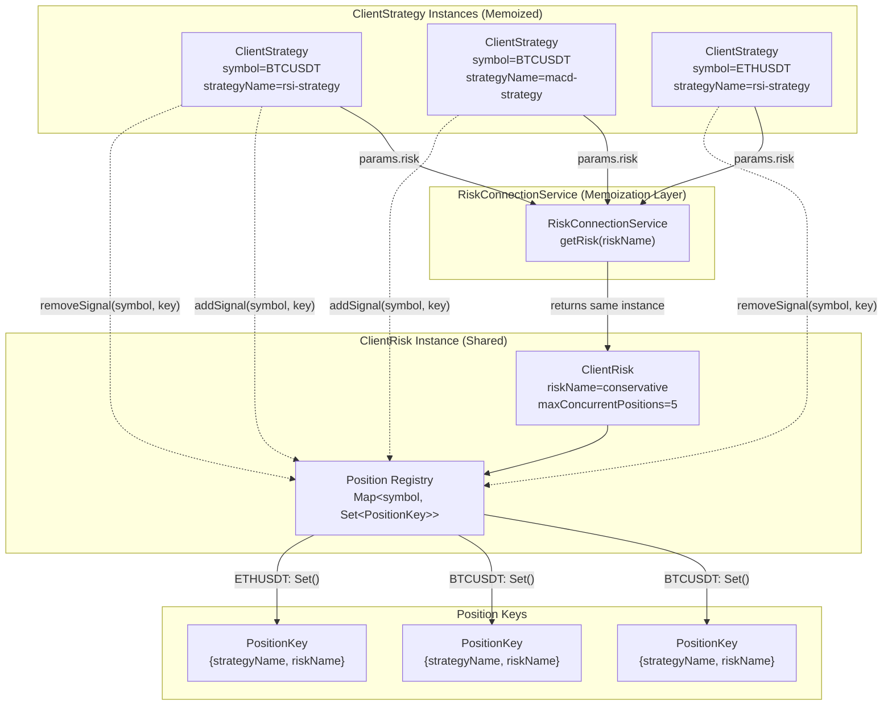
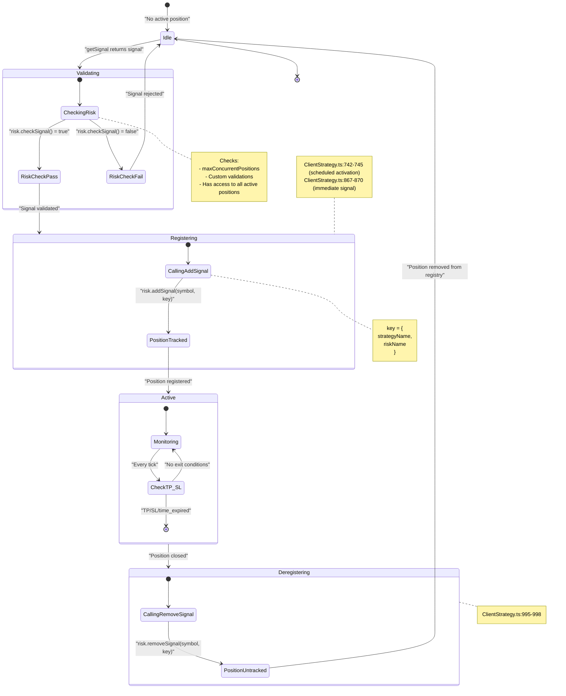
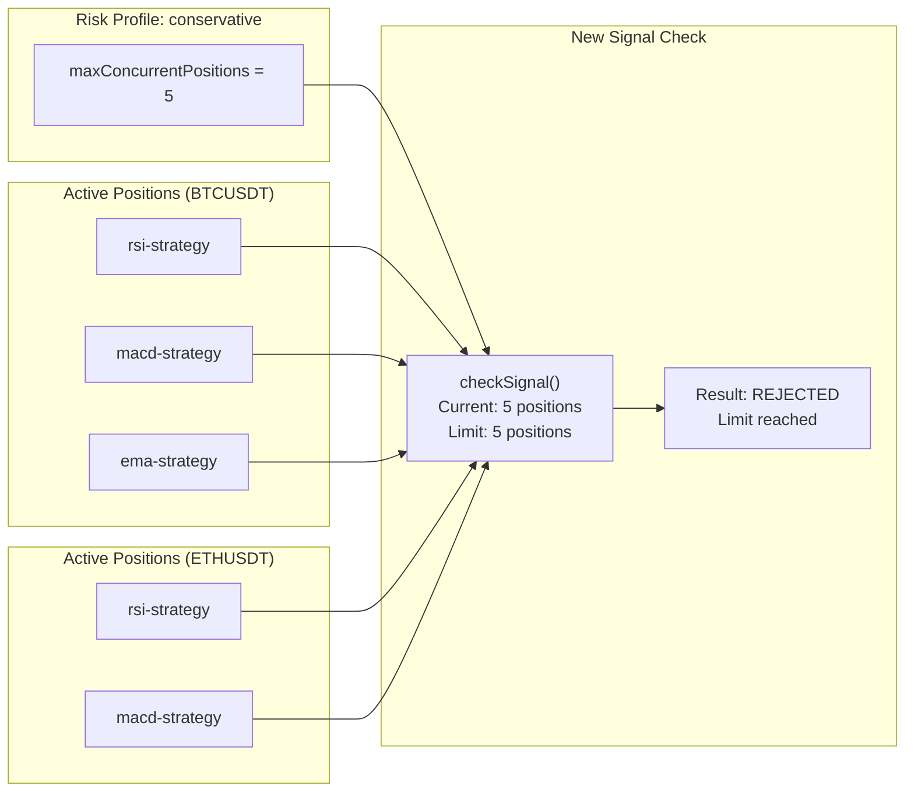
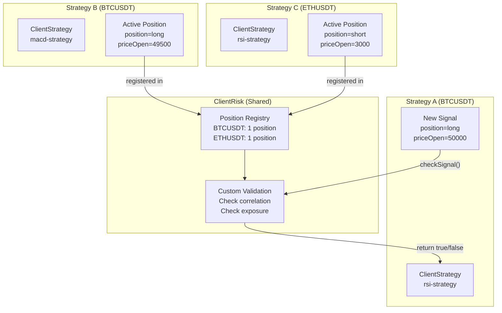
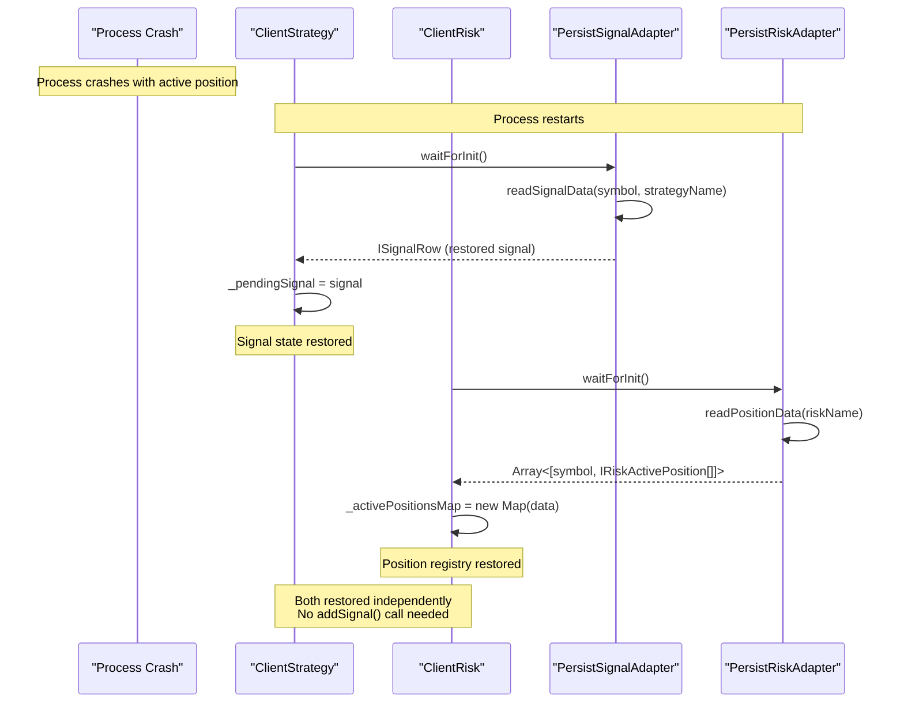
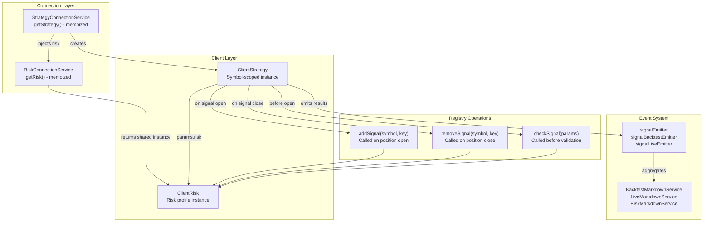

# Position Tracking

<details>
<summary>Relevant source files</summary>

The following files were used as context for generating this wiki page:

- [src/classes/Persist.ts](src/classes/Persist.ts)
- [src/client/ClientPartial.ts](src/client/ClientPartial.ts)
- [src/config/emitters.ts](src/config/emitters.ts)
- [src/contract/PartialLoss.contract.ts](src/contract/PartialLoss.contract.ts)
- [src/contract/PartialProfit.contract.ts](src/contract/PartialProfit.contract.ts)
- [src/function/event.ts](src/function/event.ts)
- [src/index.ts](src/index.ts)
- [src/interfaces/Partial.interface.ts](src/interfaces/Partial.interface.ts)
- [src/lib/services/connection/PartialConnectionService.ts](src/lib/services/connection/PartialConnectionService.ts)
- [src/lib/services/global/PartialGlobalService.ts](src/lib/services/global/PartialGlobalService.ts)
- [types.d.ts](types.d.ts)

</details>


## Purpose and Scope

This document explains how the framework tracks active trading positions across strategies for risk management purposes. Position tracking enables the risk system to enforce concurrent position limits, provide portfolio-level validation, and maintain accurate state for cross-strategy risk analysis.

For information about defining risk profiles, see [Risk Profiles](#12.1). For details on validation logic, see [Risk Validation](#12.2).

---

## Overview

Position tracking is implemented by the `ClientRisk` class, which maintains an internal `_activePositionsMap` registry of active positions across all strategies sharing the same risk profile. When a strategy opens a position, it calls `addSignal()` to register it. When the position closes (via take profit, stop loss, or time expiration), the strategy calls `removeSignal()` to deregister it.

The position registry is used for:
- **Concurrent position limits**: Enforcing `maxConcurrentPositions` across all strategies
- **Cross-strategy validation**: Custom validation functions can access the full list of active positions via `IRiskValidationPayload.activePositions`
- **Portfolio-level risk**: Analyzing exposure across multiple symbols and strategies
- **Position state queries**: Checking how many positions a specific strategy has open
- **Crash recovery**: Persisting position state to disk via `PersistRiskAdapter` (live mode only)

**Key Characteristics:**
- Shared across multiple `ClientStrategy` instances via `RiskConnectionService` memoization
- Symbol-scoped: Each symbol's positions are tracked independently in the Map
- Strategy-identified: Positions stored as `IRiskActivePosition` with `strategyName` and `exchangeName`
- Synchronized with signal lifecycle: Added on `opened`, removed on `closed`
- Persisted to disk in live mode for crash recovery

**Internal Data Structure:**

```typescript
// ClientRisk internal state (conceptual)
class ClientRisk {
  private _activePositionsMap: Map<string, IRiskActivePosition[]>;
  // Map<symbol, IRiskActivePosition[]>
  
  // Each IRiskActivePosition contains:
  // - signal: ISignalRow (complete signal data)
  // - strategyName: string (owning strategy)
  // - exchangeName: string (exchange identifier)
  // - openTimestamp: number (when position opened)
}
```

Sources: [types.d.ts:358-369](), [src/client/ClientStrategy.ts:742-745](), [src/classes/Persist.ts:623-782]()

---

## Position Tracking Architecture



**Figure 1: Position Tracking Architecture** - Multiple `ClientStrategy` instances share a single `ClientRisk` instance through `RiskConnectionService` memoization. Each symbol maintains a `Set` of position keys identifying active strategies.

Sources: [src/client/ClientStrategy.ts:1-96](), [src/lib/services/connection/StrategyConnectionService.ts:60-96](), [src/function/add.ts:270-343]()

---

## Position Lifecycle in Risk Management



**Figure 2: Position Lifecycle with Risk Tracking** - Positions are added to the risk registry immediately after validation and removed when closed. The registry state is synchronized with the signal lifecycle.

Sources: [src/client/ClientStrategy.ts:681-774](), [src/client/ClientStrategy.ts:848-899](), [src/client/ClientStrategy.ts:962-1023]()

---

## Adding Positions to Registry

When a signal opens and passes risk validation, the strategy registers the position with `risk.addSignal()`. This occurs in two scenarios:

### Immediate Signal Opening

For signals that open immediately (market orders or scheduled signals that activate):

```
ClientStrategy.OPEN_NEW_PENDING_SIGNAL_FN()
  ├─ risk.checkSignal() validates the signal
  ├─ risk.addSignal(symbol, { strategyName, riskName })
  ├─ setPendingSignal() persists to disk (live mode)
  └─ callbacks.onOpen() fires
```

**Code Location**: [src/client/ClientStrategy.ts:848-899]()

### Scheduled Signal Activation

For scheduled signals that activate when price reaches `priceOpen`:

```
ClientStrategy.ACTIVATE_SCHEDULED_SIGNAL_FN()
  ├─ risk.checkSignal() validates activation
  ├─ setScheduledSignal(null) clears scheduled state
  ├─ risk.addSignal(symbol, { strategyName, riskName })
  ├─ setPendingSignal() persists activated signal
  └─ callbacks.onOpen() fires
```

**Code Location**: [src/client/ClientStrategy.ts:681-774]()

### Position Data Structure

Positions are stored as `IRiskActivePosition` objects containing:

| Field | Type | Description |
|-------|------|-------------|
| `signal` | `ISignalRow` | Complete signal data (id, position, prices, timestamps) |
| `strategyName` | `string` | Unique strategy identifier that owns this position |
| `exchangeName` | `string` | Exchange name where position is active |
| `openTimestamp` | `number` | Unix timestamp in milliseconds when position opened |

**TypeScript Interface:**

```typescript
interface IRiskActivePosition {
  signal: ISignalRow;
  strategyName: string;
  exchangeName: string;
  openTimestamp: number;
}
```

This structure allows the risk system to:
- Identify which strategy owns each position
- Track position opening times for duration analysis
- Access complete signal details for validation logic
- Correlate positions across multiple symbols and strategies

The `addSignal()` method receives a context object `{ strategyName, riskName }`, but only `strategyName` is stored in the position record. The `riskName` is used for identifying which `ClientRisk` instance to add to, not stored per-position.

Sources: [types.d.ts:358-369](), [src/client/ClientStrategy.ts:742-745](), [src/client/ClientStrategy.ts:867-870]()

---

## Removing Positions from Registry

When a position closes for any reason (take profit, stop loss, or time expiration), the strategy deregisters it with `risk.removeSignal()`:

```
ClientStrategy.CLOSE_PENDING_SIGNAL_FN()
  ├─ toProfitLossDto() calculates PnL
  ├─ callbacks.onClose() fires
  ├─ partial.clear() removes partial tracking
  ├─ risk.removeSignal(symbol, { strategyName, riskName })
  ├─ setPendingSignal(null) clears state
  └─ Returns IStrategyTickResultClosed
```

**Execution Flow:**
1. **PnL Calculation**: Signal is evaluated with fees and slippage
2. **Lifecycle Callback**: `onClose` fires before deregistration
3. **Partial Cleanup**: Partial profit/loss milestones are cleared
4. **Position Deregistration**: `removeSignal()` updates registry
5. **State Cleanup**: Pending signal is cleared from memory/disk
6. **Result Emission**: Closed result is emitted to event system

**Close Reasons:**
- `take_profit`: Price reached `priceTakeProfit`
- `stop_loss`: Price reached `priceStopLoss`
- `time_expired`: `minuteEstimatedTime` elapsed since `pendingAt`

**Code Location**: [src/client/ClientStrategy.ts:962-1023]()

Sources: [src/client/ClientStrategy.ts:995-998](), [src/client/ClientStrategy.ts:901-960]()

---

## Position Query Interface

The `IRisk` interface provides methods for position lifecycle management:

| Method | Purpose | When Called | Parameters |
|--------|---------|-------------|------------|
| `checkSignal()` | Validate if signal can open | Before opening position | `{ pendingSignal, symbol, strategyName, exchangeName, currentPrice, timestamp }` |
| `addSignal()` | Register active position | After validation passes | `symbol`, `{ strategyName, riskName }` |
| `removeSignal()` | Deregister closed position | After position closes | `symbol`, `{ strategyName, riskName }` |

### Validation Payload Structure

When `checkSignal()` is called, custom validation functions receive:

```typescript
{
  pendingSignal: ISignalRow | IScheduledSignalRow,
  symbol: string,
  strategyName: StrategyName,
  exchangeName: ExchangeName,
  currentPrice: number,
  timestamp: number,
  // Note: Active positions are accessed through closure/instance state in ClientRisk
}
```

Custom validations can query the risk instance's internal registry to:
- Count total active positions across all strategies
- Check if specific strategy already has position on symbol
- Analyze position distribution across symbols
- Calculate portfolio-level metrics

Sources: [src/client/ClientStrategy.ts:376-384](), [src/client/ClientStrategy.ts:712-721](), [src/client/ClientStrategy.ts:852-865]()

---

## Concurrent Position Limits

The `maxConcurrentPositions` parameter enforces a hard limit on total open positions across all strategies sharing a risk profile:



**Figure 3: Concurrent Position Limit Enforcement** - The risk system counts all active positions across symbols and strategies. When the limit is reached, new signals are rejected regardless of symbol or strategy.

### Limit Enforcement Logic

1. **Signal Generated**: Strategy calls `getSignal()`, returns signal DTO
2. **Risk Check**: `risk.checkSignal()` is invoked with signal data
3. **Position Count**: Risk instance counts entries in position registry
4. **Comparison**: Current count vs `maxConcurrentPositions`
5. **Decision**: If `count >= limit`, return `false` (reject)
6. **Rejection**: Signal is discarded, strategy returns `null` from `GET_SIGNAL_FN`

**Example Configuration:**

```typescript
addRisk({
  riskName: "conservative",
  maxConcurrentPositions: 5,
  callbacks: {
    onRejected: (symbol, reason, limit, params) => {
      console.log(`Signal rejected: ${reason} (limit: ${limit})`);
    }
  }
});
```

Sources: [src/function/add.ts:270-343](), [src/client/ClientStrategy.ts:374-387]()

---

## Cross-Strategy Position Visibility

The position registry enables cross-strategy risk analysis by providing access to all active positions in custom validation functions:



**Figure 4: Cross-Strategy Validation** - Custom validation functions can analyze the complete portfolio state when evaluating new signals, enabling correlation checks and exposure limits.

### Custom Validation with Position Access

Custom validation functions receive `IRiskValidationPayload`, which extends `IRiskCheckArgs` with position data:

```typescript
interface IRiskValidationPayload extends IRiskCheckArgs {
  pendingSignal: ISignalDto;
  activePositionCount: number;           // Total positions across all symbols
  activePositions: IRiskActivePosition[];  // Array of all active positions
}
```

**Validation Payload Structure:**

| Field | Type | Description |
|-------|------|-------------|
| `symbol` | `string` | Symbol being validated |
| `pendingSignal` | `ISignalDto` | Signal attempting to open |
| `strategyName` | `StrategyName` | Strategy requesting position |
| `exchangeName` | `ExchangeName` | Exchange identifier |
| `currentPrice` | `number` | Current VWAP price |
| `timestamp` | `number` | Current timestamp in milliseconds |
| `activePositionCount` | `number` | Total active positions across all symbols |
| `activePositions` | `IRiskActivePosition[]` | Array of all active positions with full signal data |

**Example: Correlation-Aware Validation**

```typescript
addRisk({
  riskName: "correlation-aware",
  maxConcurrentPositions: 10,
  validations: [
    {
      validate: async (payload: IRiskValidationPayload) => {
        const { symbol, pendingSignal, activePositions } = payload;
        
        // Prevent same-direction positions on correlated pairs
        if (symbol === "BTCUSDT" && pendingSignal.position === "long") {
          const ethLongActive = activePositions.some(
            p => p.signal.symbol === "ETHUSDT" && p.signal.position === "long"
          );
          
          if (ethLongActive) {
            throw new Error("Cannot open BTCUSDT long while ETHUSDT long is active");
          }
        }
      },
      note: "Prevents correlated long positions on BTC/ETH pairs"
    }
  ]
});
```

**Example: Strategy Position Limit**

```typescript
addRisk({
  riskName: "per-strategy-limit",
  maxConcurrentPositions: 20,
  validations: [
    {
      validate: async (payload: IRiskValidationPayload) => {
        const { strategyName, activePositions } = payload;
        
        // Limit positions per strategy (max 5 per strategy)
        const strategyPositionCount = activePositions.filter(
          p => p.strategyName === strategyName
        ).length;
        
        if (strategyPositionCount >= 5) {
          throw new Error(`Strategy ${strategyName} already has 5 positions`);
        }
      },
      note: "Limits each strategy to 5 concurrent positions"
    }
  ]
});
```

**Example: Time-Based Position Analysis**

```typescript
addRisk({
  riskName: "time-aware",
  maxConcurrentPositions: 10,
  validations: [
    {
      validate: async (payload: IRiskValidationPayload) => {
        const { activePositions, timestamp } = payload;
        
        // Count positions opened in last hour
        const oneHourAgo = timestamp - (60 * 60 * 1000);
        const recentPositions = activePositions.filter(
          p => p.openTimestamp >= oneHourAgo
        );
        
        if (recentPositions.length >= 3) {
          throw new Error("Too many positions opened in last hour");
        }
      },
      note: "Limits opening rate to 3 positions per hour"
    }
  ]
});
```

The `activePositions` array provides complete access to all tracked positions, enabling sophisticated cross-strategy and cross-symbol risk logic.

Sources: [types.d.ts:380-391](), [types.d.ts:358-369](), [types.d.ts:393-412](), [src/function/add.ts:296-328]()

---

## Position State Across Execution Modes

Position tracking behavior differs between backtest and live modes:

| Aspect | Backtest Mode | Live Mode |
|--------|---------------|-----------|
| **Persistence** | In-memory only | Persisted to disk via `PersistSignalAdapter` |
| **Registry State** | Cleared between backtests | Restored from disk on crash recovery |
| **Lifecycle** | Fully simulated (deterministic) | Real-time monitoring with async persistence |
| **Registry Cleanup** | Automatic at backtest end | Must survive process restart |
| **Position Queries** | Synchronous registry access | Same registry, async disk writes |

### Backtest Mode Registry

In backtest mode, the position registry exists only in memory:
- **Added**: When signal opens during historical simulation
- **Removed**: When signal closes (TP/SL/time_expired)
- **Cleared**: Implicitly when `ClientStrategy` instance is garbage collected
- **Restored**: Never (each backtest starts fresh)

### Live Mode Registry

In live mode, positions must survive crashes:
- **Added**: On signal open, after `PersistSignalAdapter.writeSignalData()`
- **Removed**: On signal close, after `PersistSignalAdapter.clearSignalData()`
- **Restored**: On startup, `WAIT_FOR_INIT_FN` reads persisted signals
- **Synchronized**: Registry state matches disk state

**Crash Recovery Flow:**

```
ClientStrategy.WAIT_FOR_INIT_FN()
  ├─ PersistSignalAdapter.readSignalData(symbol, strategyName)
  ├─ self._pendingSignal = pendingSignal (restore in-memory state)
  ├─ callbacks.onActive() fires (notify listeners)
  └─ Note: risk.addSignal() NOT called (position was never removed)
```

**Critical Implementation Detail:**

When `ClientStrategy` restores from disk in live mode, it does NOT call `risk.addSignal()` because:
1. The signal was never closed, so `removeSignal()` was never called
2. The position remains in `ClientRisk._activePositionsMap` 
3. `ClientRisk` also restores from disk via `PersistRiskAdapter.readPositionData()`
4. Both `ClientStrategy` and `ClientRisk` restore their state independently
5. The registry state matches the strategy state after both initialize

**Crash Recovery Synchronization:**



**Why No `addSignal()` Call:**

The position tracking state is persisted in TWO places:
1. **Signal state**: `PersistSignalAdapter` → per strategy per symbol
2. **Risk registry**: `PersistRiskAdapter` → per risk profile

Both are restored independently during initialization, so the registry already contains the position. Calling `addSignal()` would create a duplicate entry.

Sources: [src/client/ClientStrategy.ts:491-552](), [src/classes/Persist.ts:514-622](), [src/classes/Persist.ts:623-782]()

---

## Registry Implementation and Persistence

### In-Memory Registry Structure

The `ClientRisk` class maintains positions in `_activePositionsMap`:

```typescript
// ClientRisk internal structure
class ClientRisk {
  private _activePositionsMap: Map<string, IRiskActivePosition[]>;
  // Map<symbol, IRiskActivePosition[]>
  
  async addSignal(symbol: string, context: { strategyName: string; riskName: string }): Promise<void> {
    // 1. Get or create position array for symbol
    let positions = this._activePositionsMap.get(symbol) || [];
    
    // 2. Create IRiskActivePosition record
    const position: IRiskActivePosition = {
      signal: currentSignal, // from strategy state
      strategyName: context.strategyName,
      exchangeName: context.exchangeName,
      openTimestamp: Date.now()
    };
    
    // 3. Add to array
    positions.push(position);
    this._activePositionsMap.set(symbol, positions);
    
    // 4. Persist to disk (live mode only)
    if (!this.params.backtest) {
      await PersistRiskAdapter.writePositionData(
        Array.from(this._activePositionsMap.entries()),
        this.params.riskName
      );
    }
  }
  
  async removeSignal(symbol: string, context: { strategyName: string; riskName: string }): Promise<void> {
    // 1. Get positions for symbol
    let positions = this._activePositionsMap.get(symbol) || [];
    
    // 2. Filter out matching position
    positions = positions.filter(p => p.strategyName !== context.strategyName);
    
    // 3. Update map (or delete if empty)
    if (positions.length > 0) {
      this._activePositionsMap.set(symbol, positions);
    } else {
      this._activePositionsMap.delete(symbol);
    }
    
    // 4. Persist to disk (live mode only)
    if (!this.params.backtest) {
      await PersistRiskAdapter.writePositionData(
        Array.from(this._activePositionsMap.entries()),
        this.params.riskName
      );
    }
  }
  
  async checkSignal(params: IRiskCheckArgs): Promise<boolean> {
    // Count total positions across all symbols
    const activePositionCount = Array.from(this._activePositionsMap.values())
      .reduce((sum, positions) => sum + positions.length, 0);
    
    // Prepare validation payload
    const payload: IRiskValidationPayload = {
      ...params,
      activePositionCount,
      activePositions: Array.from(this._activePositionsMap.values()).flat()
    };
    
    // Run custom validations with access to all positions
    // Return true if allowed, false if rejected
  }
}
```

### Position Identity and Deduplication

Positions are identified by `strategyName` within a symbol:
- **Symbol-scoped**: Each symbol has its own array of positions in the Map
- **Strategy-identified**: Each position has `strategyName` field for uniqueness
- **Duplicate prevention**: `removeSignal()` filters by `strategyName` match
- **Array-based**: Multiple strategies can have positions on same symbol

**Example Registry State:**

```typescript
_activePositionsMap = {
  "BTCUSDT": [
    { 
      signal: { id: "abc123", position: "long", priceOpen: 50000, ... },
      strategyName: "rsi-strategy",
      exchangeName: "binance",
      openTimestamp: 1704067200000
    },
    {
      signal: { id: "def456", position: "short", priceOpen: 50500, ... },
      strategyName: "macd-strategy",
      exchangeName: "binance",
      openTimestamp: 1704067800000
    }
  ],
  "ETHUSDT": [
    {
      signal: { id: "ghi789", position: "long", priceOpen: 3000, ... },
      strategyName: "rsi-strategy",
      exchangeName: "binance",
      openTimestamp: 1704068400000
    }
  ]
}

// Total positions: 3
// Max concurrent: 5
// Next signal: ALLOWED
```

### Persistence via PersistRiskAdapter

In live mode, the `_activePositionsMap` is persisted to disk after each add/remove operation:

```typescript
// Type definition for serialized risk data
type RiskData = Array<[string, IRiskActivePosition[]]>;

// Persistence operations
class PersistRiskUtils {
  // Read positions from disk on initialization
  async readPositionData(riskName: RiskName): Promise<RiskData> {
    // Returns Array<[symbol, IRiskActivePosition[]]>
    // Loaded from ./dump/data/risk/{riskName}.json
  }
  
  // Write positions to disk after state change
  async writePositionData(data: RiskData, riskName: RiskName): Promise<void> {
    // Converts Map.entries() to Array<[symbol, positions[]]>
    // Atomic write to ./dump/data/risk/{riskName}.json
  }
}
```

**File Structure:**
```
./dump/data/risk/
  ├─ conservative.json    # Positions for "conservative" risk profile
  ├─ aggressive.json      # Positions for "aggressive" risk profile
  └─ ...
```

**Persistence Flow:**

1. **On Position Add**: `addSignal()` → update map → `PersistRiskAdapter.writePositionData()`
2. **On Position Remove**: `removeSignal()` → update map → `PersistRiskAdapter.writePositionData()`
3. **On Initialization**: `waitForInit()` → `PersistRiskAdapter.readPositionData()` → restore map
4. **Backtest Mode**: No persistence (in-memory only)

**Atomic Writes:**

The `writeFileAtomic()` function ensures crash-safe persistence:
```
1. Write to temporary file: conservative.json.tmp
2. fsync() to ensure disk write
3. Rename temp file to final: conservative.json
4. OS guarantees rename is atomic
```

This pattern prevents corruption if the process crashes during write.

Sources: [types.d.ts:358-369](), [types.d.ts:623-627](), [src/classes/Persist.ts:623-782](), [src/classes/Persist.ts:11-13](), [src/lib/services/connection/StrategyConnectionService.ts:26-30]()

---

## Position Tracking in Service Architecture



**Figure 5: Position Tracking in Service Architecture** - Position tracking is integrated throughout the service layers, from connection services to markdown reporting.

Sources: [src/lib/services/connection/StrategyConnectionService.ts:52-98](), [src/lib/services/connection/RiskConnectionService.ts:1-100](), [src/lib/index.ts:1-242]()

---

## Summary

Position tracking is a critical component of the risk management system that:

1. **Maintains Registry**: Tracks active positions by symbol and strategy key
2. **Enforces Limits**: Implements `maxConcurrentPositions` across all strategies
3. **Enables Validation**: Provides position data to custom validation functions
4. **Synchronizes Lifecycle**: Adds positions on open, removes on close
5. **Survives Crashes**: Persists state in live mode for crash recovery
6. **Shares State**: Multiple strategies access same `ClientRisk` instance

The registry is synchronized with the signal lifecycle through `addSignal()` and `removeSignal()` calls, ensuring accurate position counts for risk enforcement and portfolio-level analysis.

For implementation of risk profiles, see [Risk Profiles](#12.1). For details on validation logic, see [Risk Validation](#12.2).

Sources: [src/client/ClientStrategy.ts:1-1200](), [src/lib/services/connection/StrategyConnectionService.ts:1-241](), [src/function/add.ts:270-343]()