# Performance Metrics

This page details the mathematical formulas and calculation methods for all performance metrics used in strategy analysis. These metrics quantify trading performance across risk, return, consistency, and frequency dimensions.

For information about the report generation infrastructure that displays these metrics, see [Markdown Report Generation](./70_Markdown_Report_Generation.md). For details about the safe math layer that protects against NaN/Infinity values, see [Statistics Calculation](./72_Statistics_Calculation.md).

## Overview

The framework calculates eight core performance metrics from closed signals:

1. **Win Rate** - Percentage of profitable trades
2. **Average PNL** - Mean profit/loss per trade
3. **Total PNL** - Cumulative profit/loss across all trades
4. **Standard Deviation** - Volatility of returns
5. **Sharpe Ratio** - Risk-adjusted return metric
6. **Annualized Sharpe Ratio** - Sharpe ratio scaled to annual timeframe
7. **Certainty Ratio** - Ratio of average win to average loss
8. **Expected Yearly Returns** - Projected annual returns based on trade frequency

All metrics are calculated identically for both backtest and live modes, with implementations in `ReportStorage.getData()` methods that process arrays of closed signals.


## Metric Calculation Architecture



The calculation pipeline follows a three-stage process: basic statistics compute foundational metrics (counts, sums, averages), risk metrics compute volatility measures (variance, standard deviation, Sharpe ratio), and scaled metrics compute time-adjusted projections (annualized Sharpe, yearly returns).


## Metric Formulas and Implementation

### Win Rate

**Definition:** Percentage of trades that resulted in positive PNL.

**Formula:**
```
Win Rate (%) = (Number of Winning Trades / Total Trades) × 100
```

**Implementation:**
```typescript
// Count winning and losing trades
const winCount = this._signalList.filter((s) => s.pnl.pnlPercentage > 0).length;
const lossCount = this._signalList.filter((s) => s.pnl.pnlPercentage < 0).length;

// Calculate win rate
const winRate = (winCount / totalSignals) * 100;
```

**Interpretation:** Higher is better. Values above 50% indicate more winning trades than losing trades. A strategy with 70% win rate has 7 winning trades for every 3 losing trades.


### Average PNL

**Definition:** Mean profit/loss percentage across all closed trades.

**Formula:**
```
Average PNL (%) = Σ(PNL for each trade) / Total Trades
```

**Implementation:**
```typescript
const avgPnl = totalClosed > 0
  ? closedEvents.reduce((sum, e) => sum + (e.pnl || 0), 0) / totalClosed
  : 0;
```

**Interpretation:** Higher is better. Represents the expected return per trade. A value of +2.5% means each trade gains 2.5% on average.


### Total PNL

**Definition:** Cumulative profit/loss percentage across all closed trades.

**Formula:**
```
Total PNL (%) = Σ(PNL for each trade)
```

**Implementation:**
```typescript
const totalPnl = closedEvents.reduce((sum, e) => sum + (e.pnl || 0), 0);
```

**Interpretation:** Higher is better. Represents the cumulative return if each trade used equal capital. A value of +45.3% means the strategy gained 45.3% total across all trades.


### Standard Deviation

**Definition:** Volatility measure quantifying the dispersion of returns around the mean.

**Formula:**
```
Variance = Σ((Return_i - Average PNL)²) / Total Trades
Standard Deviation = √Variance
```

**Implementation:**
```typescript
// Calculate variance
const returns = this._signalList.map((s) => s.pnl.pnlPercentage);
const variance = returns.reduce((sum, r) => sum + Math.pow(r - avgPnl, 2), 0) / totalSignals;

// Calculate standard deviation
const stdDev = Math.sqrt(variance);
```

**Interpretation:** Lower is better. Represents the typical deviation from average return. A standard deviation of 1.5% means trades typically deviate ±1.5% from the mean.


### Sharpe Ratio

**Definition:** Risk-adjusted return metric measuring excess return per unit of volatility. Assumes risk-free rate of 0.

**Formula:**
```
Sharpe Ratio = Average PNL / Standard Deviation
```

**Implementation:**
```typescript
const sharpeRatio = stdDev > 0 ? avgPnl / stdDev : 0;
```

**Interpretation:** Higher is better. Industry benchmarks:
- **< 1.0** - Poor risk-adjusted performance
- **1.0 - 2.0** - Good performance
- **2.0 - 3.0** - Very good performance
- **> 3.0** - Excellent performance

A Sharpe ratio of 2.0 means the strategy generates 2 units of return for every unit of risk.


### Annualized Sharpe Ratio

**Definition:** Sharpe ratio scaled to annual timeframe using square root of time rule.

**Formula:**
```
Annualized Sharpe Ratio = Sharpe Ratio × √365
```

**Implementation:**
```typescript
const annualizedSharpeRatio = sharpeRatio * Math.sqrt(365);
```

**Interpretation:** Higher is better. Allows comparison with annual return benchmarks. The √365 scaling factor assumes independent daily returns (reasonable for intraday strategies).


### Certainty Ratio

**Definition:** Ratio of average winning trade to average losing trade. Also known as profit factor when considering gross amounts.

**Formula:**
```
Average Win = Σ(Winning Trade PNL) / Number of Wins
Average Loss = Σ(Losing Trade PNL) / Number of Losses
Certainty Ratio = Average Win / |Average Loss|
```

**Implementation:**
```typescript
// Filter wins and losses
const wins = this._signalList.filter((s) => s.pnl.pnlPercentage > 0);
const losses = this._signalList.filter((s) => s.pnl.pnlPercentage < 0);

// Calculate averages
const avgWin = wins.length > 0
  ? wins.reduce((sum, s) => sum + s.pnl.pnlPercentage, 0) / wins.length
  : 0;
const avgLoss = losses.length > 0
  ? losses.reduce((sum, s) => sum + s.pnl.pnlPercentage, 0) / losses.length
  : 0;

// Calculate certainty ratio
const certaintyRatio = avgLoss < 0 ? avgWin / Math.abs(avgLoss) : 0;
```

**Interpretation:** Higher is better. Values > 1.0 indicate winning trades are larger than losing trades. A certainty ratio of 2.5 means the average win is 2.5× the size of the average loss.


### Expected Yearly Returns

**Definition:** Projected annual return based on average trade PNL and frequency.

**Formula:**
```
Average Trade Duration (days) = Σ(Trade Duration in ms) / Total Trades / (1000 × 60 × 60 × 24)
Trades Per Year = 365 / Average Trade Duration
Expected Yearly Returns = Average PNL × Trades Per Year
```

**Implementation:**
```typescript
// Calculate average trade duration
const avgDurationMs = this._signalList.reduce(
  (sum, s) => sum + (s.closeTimestamp - s.signal.pendingAt),
  0
) / totalSignals;
const avgDurationDays = avgDurationMs / (1000 * 60 * 60 * 24);

// Project to annual timeframe
const tradesPerYear = avgDurationDays > 0 ? 365 / avgDurationDays : 0;
const expectedYearlyReturns = avgPnl * tradesPerYear;
```

**Interpretation:** Higher is better. Assumes trade frequency remains constant and returns are repeatable. A value of +120% means the strategy would generate 120% annual returns if it continues at the observed pace.

**Caveats:** This is a simple projection that assumes:
- Constant trade frequency throughout the year
- No compounding effects
- No capital constraints
- Past performance repeats


## Calculation Flow Diagram



The calculation follows a dependency chain where basic metrics must be computed before risk metrics, and risk metrics before scaled metrics. All calculations are protected by `isUnsafe()` checks that set metrics to `null` if they contain NaN or Infinity values.


## Statistics Interface Definitions

### BacktestStatistics Interface

```typescript
export interface BacktestStatistics {
  signalList: IStrategyTickResultClosed[];
  totalSignals: number;
  winCount: number;
  lossCount: number;
  winRate: number | null;
  avgPnl: number | null;
  totalPnl: number | null;
  stdDev: number | null;
  sharpeRatio: number | null;
  annualizedSharpeRatio: number | null;
  certaintyRatio: number | null;
  expectedYearlyReturns: number | null;
}
```

Returned by `BacktestMarkdownService.getData()` for backtest mode execution.


### LiveStatistics Interface

```typescript
export interface LiveStatistics {
  eventList: TickEvent[];
  totalEvents: number;
  totalClosed: number;
  winCount: number;
  lossCount: number;
  winRate: number | null;
  avgPnl: number | null;
  totalPnl: number | null;
  stdDev: number | null;
  sharpeRatio: number | null;
  annualizedSharpeRatio: number | null;
  certaintyRatio: number | null;
  expectedYearlyReturns: number | null;
}
```

Returned by `LiveMarkdownService.getData()` for live mode execution. Includes all events (idle, opened, active, closed), not just closed signals.


## Metrics Summary Table

| Metric | Formula | Interpretation | Range | Goal |
|--------|---------|----------------|-------|------|
| **Win Rate** | `(winCount / total) × 100` | Percentage of winning trades | 0-100% | Higher |
| **Average PNL** | `Σ(pnl) / total` | Mean return per trade | -∞ to +∞ | Higher |
| **Total PNL** | `Σ(pnl)` | Cumulative return | -∞ to +∞ | Higher |
| **Standard Deviation** | `√(Σ(r - avg)² / total)` | Volatility of returns | 0 to +∞ | Lower |
| **Sharpe Ratio** | `avgPnl / stdDev` | Risk-adjusted return | -∞ to +∞ | Higher |
| **Annualized Sharpe** | `sharpe × √365` | Annual risk-adjusted return | -∞ to +∞ | Higher |
| **Certainty Ratio** | `avgWin / \|avgLoss\|` | Win-to-loss size ratio | 0 to +∞ | Higher |
| **Expected Yearly Returns** | `avgPnl × (365 / avgDurationDays)` | Projected annual return | -∞ to +∞ | Higher |


## Safe Math Protection

All metrics are protected against unsafe numeric values using the `isUnsafe()` function:

```typescript
function isUnsafe(value: number | null): boolean {
  if (typeof value !== "number") {
    return true;
  }
  if (isNaN(value)) {
    return true;
  }
  if (!isFinite(value)) {
    return true;
  }
  return false;
}
```

When `isUnsafe()` returns `true`, the metric is set to `null` instead of displaying invalid values. This prevents:
- **Division by zero** errors (e.g., Sharpe ratio when stdDev = 0)
- **NaN propagation** from invalid calculations
- **Infinity values** from extreme outliers

In markdown reports, `null` values are displayed as `"N/A"`.


## Report Generation Integration

Metrics are displayed in markdown reports generated by `getReport()` methods:

```typescript
public async getReport(strategyName: StrategyName): Promise<string> {
  const stats = await this.getData();
  
  return str.newline(
    `# Backtest Report: ${strategyName}`,
    "",
    table,
    "",
    `**Total signals:** ${stats.totalSignals}`,
    `**Win rate:** ${stats.winRate === null ? "N/A" : `${stats.winRate.toFixed(2)}% (higher is better)`}`,
    `**Average PNL:** ${stats.avgPnl === null ? "N/A" : `${stats.avgPnl.toFixed(2)}% (higher is better)`}`,
    `**Sharpe Ratio:** ${stats.sharpeRatio === null ? "N/A" : `${stats.sharpeRatio.toFixed(3)} (higher is better)`}`,
    `**Annualized Sharpe Ratio:** ${stats.annualizedSharpeRatio === null ? "N/A" : `${stats.annualizedSharpeRatio.toFixed(3)} (higher is better)`}`,
    `**Certainty Ratio:** ${stats.certaintyRatio === null ? "N/A" : `${stats.certaintyRatio.toFixed(3)} (higher is better)`}`,
    `**Expected Yearly Returns:** ${stats.expectedYearlyReturns === null ? "N/A" : `${stats.expectedYearlyReturns.toFixed(2)}% (higher is better)`}`,
  );
}
```

Each metric includes an interpretation hint ("higher is better" or "lower is better") to guide users in understanding performance.


## Usage Examples

### Accessing Metrics from Backtest

```typescript
import { Backtest } from "backtest-kit";

// Run backtest
for await (const _ of Backtest.run("BTCUSDT", {
  strategyName: "my-strategy",
  exchangeName: "binance",
  frameName: "2024-backtest"
})) {}

// Get statistical data
const stats = await Backtest.getData("BTCUSDT", "my-strategy");

console.log(`Sharpe Ratio: ${stats.sharpeRatio}`);
console.log(`Win Rate: ${stats.winRate}%`);
console.log(`Expected Yearly Returns: ${stats.expectedYearlyReturns}%`);
```

### Accessing Metrics from Live Trading

```typescript
import { Live } from "backtest-kit";

// After live trading
const stats = await Live.getData("BTCUSDT", "my-strategy");

console.log(`Total PNL: ${stats.totalPnl}%`);
console.log(`Annualized Sharpe: ${stats.annualizedSharpeRatio}`);
console.log(`Certainty Ratio: ${stats.certaintyRatio}`);
```

### Walker Metric Comparison

Walker mode uses these metrics for strategy comparison:

```typescript
import { addWalker, Walker } from "backtest-kit";

addWalker({
  walkerName: "btc-walker",
  strategies: ["strategy-a", "strategy-b", "strategy-c"],
  metric: "sharpeRatio", // Use Sharpe ratio for comparison
  // Available: sharpeRatio, winRate, avgPnl, totalPnl, certaintyRatio
});

const results = await Walker.getData("BTCUSDT", "btc-walker");
console.log(`Best strategy: ${results.bestStrategy}`);
console.log(`Best Sharpe: ${results.bestMetric}`);
```

