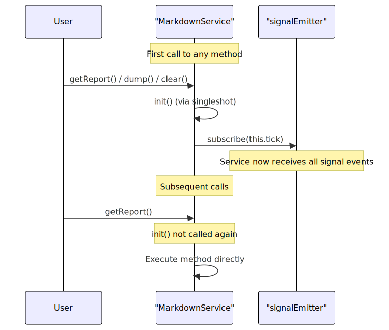

# Reporting and Analytics

This document describes the reporting and analytics capabilities of the backtest-kit framework. The system provides markdown-based reports for both backtest and live trading modes, accumulating signal events and calculating performance statistics.

For information about signal lifecycle and PnL calculations that feed into reports, see [Signal Lifecycle](./48_Signal_Lifecycle.md). For details on the public API methods to retrieve reports, see [Backtest API](./18_Backtest_API.md) and [Live Trading API](./19_Live_Trading_API.md).

## Overview

The reporting system consists of four specialized markdown services that passively observe execution events and accumulate them for analysis:

- **BacktestMarkdownService**: Accumulates only closed signals from backtest execution
- **LiveMarkdownService**: Accumulates all tick events (idle, opened, active, closed) from live trading
- **WalkerMarkdownService**: Accumulates strategy comparison results with best strategy selection
- **ScheduleMarkdownService**: Tracks scheduled and cancelled signals to measure limit order effectiveness

All services operate independently from the main execution flow, subscribing to events via event emitters and maintaining isolated storage per strategy/walker. Reports are generated on-demand and can be exported to markdown files in `./logs/{mode}/` directories.

Additionally, the framework provides performance profiling via `performanceEmitter`, which tracks execution timing metrics for bottleneck analysis.

**Reporting System Architecture Diagram**



**Sources**: [src/lib/services/markdown/BacktestMarkdownService.ts:1-533](), [src/lib/services/markdown/LiveMarkdownService.ts:1-737](), [src/lib/services/markdown/ScheduleMarkdownService.ts:1-535](), [src/config/emitters.ts:1-81](), [src/classes/Backtest.ts:1-208](), [src/classes/Live.ts:1-220](), [src/classes/Walker.ts:1-274](), [src/classes/Schedule.ts:1-135]()

## Service Architecture

### BacktestMarkdownService

The `BacktestMarkdownService` class is designed for post-execution analysis of backtest results. It only processes closed signals, ignoring opened and active states to focus on completed trades.

| Feature | Implementation |
|---------|---------------|
| **Event Source** | `signalBacktestEmitter` |
| **Event Types** | Only `closed` actions |
| **Storage Model** | Accumulates all closed signals chronologically in `_signalList` array |
| **Default Output Path** | `./logs/backtest/{strategyName}.md` |
| **Initialization** | Automatic via `singleshot` decorator on first method call |
| **Memoization Key** | `strategyName` |

The service maintains a memoized `ReportStorage` instance per strategy name via `getStorage = memoize((strategyName) => new ReportStorage())`, ensuring isolated data collection when multiple strategies run concurrently. The storage accumulates `IStrategyTickResultClosed` objects in an internal array.

The `tick()` method filters events:

```typescript
if (data.action !== "closed") {
  return; // Ignore non-closed events
}
const storage = this.getStorage(data.strategyName);
storage.addSignal(data);
```

**Sources**: [src/lib/services/markdown/BacktestMarkdownService.ts:370-533]()

### LiveMarkdownService

The `LiveMarkdownService` class provides operational visibility into live trading activity. Unlike the backtest service, it captures all tick events to provide a complete audit trail.

| Feature | Implementation |
|---------|---------------|
| **Event Source** | `signalLiveEmitter` |
| **Event Types** | `idle`, `opened`, `active`, `closed` |
| **Storage Model** | Updates existing events by `signalId` for active/closed, appends for idle/opened |
| **Max Events** | 250 events (with FIFO eviction via `shift()`) |
| **Default Output Path** | `./logs/live/{strategyName}.md` |
| **Initialization** | Automatic via `singleshot` decorator on first method call |
| **Memoization Key** | `strategyName` |

The service uses a more sophisticated storage mechanism that replaces existing events with the same `signalId` for `active` and `closed` actions, ensuring the report shows the latest state of each signal. This prevents duplicate entries when a signal transitions from `active` to `closed`.

For `idle` events, the service implements smart replacement logic:
- If the last event is `idle` and no `opened`/`active` events follow it, replace it (avoids idle spam)
- Otherwise, append the new idle event

**Sources**: [src/lib/services/markdown/LiveMarkdownService.ts:567-737]()

### WalkerMarkdownService

The `WalkerMarkdownService` class generates comparison reports for multi-strategy backtests executed via `Walker.run()`. It accumulates results from each strategy and ranks them by a configurable metric.

| Feature | Implementation |
|---------|---------------|
| **Event Source** | `walkerEmitter` (progress) and `walkerCompleteSubject` (final results) |
| **Event Types** | Strategy completion events with statistics |
| **Storage Model** | Accumulates per-strategy results in `_strategyResults` map |
| **Default Output Path** | `./logs/walker/{walkerName}-{symbol}.md` |
| **Initialization** | Automatic via `singleshot` decorator on first method call |
| **Memoization Key** | `${walkerName}:${symbol}` |

The service provides `getData()` which returns:
- `bestStrategy`: Strategy name with highest metric value
- `bestMetric`: The metric value of the best strategy
- `strategies`: Array of all strategies with their stats and metric values, sorted descending

Metrics supported for comparison (specified in `IWalkerSchema.metric`):
- `sharpeRatio` (default)
- `winRate`
- `avgPnl`
- `totalPnl`
- `certaintyRatio`

**Sources**: [src/lib/services/global/WalkerGlobalService.ts:1-90](), [src/classes/Walker.ts:1-274]()

### ScheduleMarkdownService

The `ScheduleMarkdownService` class tracks scheduled signals (limit orders) and their outcomes to measure strategy effectiveness with limit orders.

| Feature | Implementation |
|---------|---------------|
| **Event Source** | `signalEmitter` (both live and backtest) |
| **Event Types** | `scheduled`, `cancelled` |
| **Storage Model** | Updates existing events by `signalId` for cancelled, appends for scheduled |
| **Max Events** | 250 events (with FIFO eviction via `shift()`) |
| **Default Output Path** | `./logs/schedule/{strategyName}.md` |
| **Initialization** | Automatic via `singleshot` decorator on first method call |
| **Memoization Key** | `strategyName` |

The service calculates key metrics for limit order effectiveness:
- **Cancellation Rate**: `(totalCancelled / totalScheduled) * 100` - Lower is better
- **Average Wait Time**: Mean duration for cancelled signals in minutes

Scheduled signals are created when `signal.priceOpen` is specified (price must reach entry before activation). They transition to `cancelled` if:
1. Timeout expires (`CC_SCHEDULE_AWAIT_MINUTES` minutes pass without activation)
2. Stop loss price is hit before entry price

**Sources**: [src/lib/services/markdown/ScheduleMarkdownService.ts:1-535](), [src/classes/Schedule.ts:1-135]()

## Report Structure

### Column Configuration

Both services define their reports using a `Column` interface that specifies extraction and formatting logic:


**Sources**: [src/lib/services/markdown/BacktestMarkdownService.ts:18-100](), [src/lib/services/markdown/LiveMarkdownService.ts:53-137]()

### Backtest Report Columns

The backtest report focuses on completed trade analysis with the following columns:

| Column | Format | Source |
|--------|--------|--------|
| Signal ID | Plain text | `data.signal.id` |
| Symbol | Plain text | `data.signal.symbol` |
| Position | Uppercase | `data.signal.position.toUpperCase()` |
| Note | Plain text or "N/A" | `data.signal.note ?? "N/A"` |
| Open Price | Fixed 8 decimals + " USD" | `data.signal.priceOpen.toFixed(8)` |
| Close Price | Fixed 8 decimals + " USD" | `data.currentPrice.toFixed(8)` |
| Take Profit | Fixed 8 decimals + " USD" | `data.signal.priceTakeProfit.toFixed(8)` |
| Stop Loss | Fixed 8 decimals + " USD" | `data.signal.priceStopLoss.toFixed(8)` |
| PNL (net) | Fixed 2 decimals + "%" with sign | `${pnl > 0 ? "+" : ""}${pnl.toFixed(2)}%` |
| Close Reason | Plain text | `data.closeReason` |
| Duration (min) | Integer minutes | `Math.round((closeTimestamp - pendingAt) / 60000)` |
| Open Time | ISO 8601 | `new Date(data.signal.pendingAt).toISOString()` |
| Close Time | ISO 8601 | `new Date(data.closeTimestamp).toISOString()` |

**Sources**: [src/lib/services/markdown/BacktestMarkdownService.ts:104-177]()

### Live Report Columns

The live trading report includes all event types with these columns:

| Column | Format | Nullable |
|--------|--------|----------|
| Timestamp | ISO 8601 | No |
| Action | Uppercase (IDLE, OPENED, ACTIVE, CLOSED) | No |
| Symbol | Plain text or "N/A" | Yes |
| Signal ID | Plain text or "N/A" | Yes |
| Position | Uppercase or "N/A" | Yes |
| Note | Plain text or "N/A" | Yes |
| Current Price | Fixed 8 decimals + " USD" | No |
| Open Price | Fixed 8 decimals + " USD" or "N/A" | Yes |
| Take Profit | Fixed 8 decimals + " USD" or "N/A" | Yes |
| Stop Loss | Fixed 8 decimals + " USD" or "N/A" | Yes |
| PNL (net) | Fixed 2 decimals + "%" with sign or "N/A" | Yes |
| Close Reason | Plain text or "N/A" | Yes |
| Duration (min) | Integer minutes or "N/A" | Yes |

The nullable columns are only populated for relevant event types (e.g., `pnl` only exists for `closed` events, `signalId` does not exist for `idle` events).

**Sources**: [src/lib/services/markdown/LiveMarkdownService.ts:145-220]()

### Schedule Report Columns

The schedule report tracks scheduled and cancelled limit order signals:

| Column | Format | Nullable |
|--------|--------|----------|
| Timestamp | ISO 8601 | No |
| Action | Uppercase (SCHEDULED, CANCELLED) | No |
| Symbol | Plain text | No |
| Signal ID | Plain text | No |
| Position | Uppercase | No |
| Note | Plain text or "N/A" | Yes |
| Current Price | Fixed 8 decimals + " USD" | No |
| Entry Price | Fixed 8 decimals + " USD" | No |
| Take Profit | Fixed 8 decimals + " USD" | No |
| Stop Loss | Fixed 8 decimals + " USD" | No |
| Wait Time (min) | Integer minutes or "N/A" | Yes (only for cancelled) |

The `Wait Time` column shows how long the signal waited before cancellation (timeout or SL hit before entry).

**Sources**: [src/lib/services/markdown/ScheduleMarkdownService.ts:101-158]()

### Walker Report Structure

Walker reports are different from signal-based reports. Instead of a table of individual signals, they display a comparison table of strategies with their aggregate statistics.

**Walker Report Format**

```markdown
# Walker Comparison: my-walker

Symbol: BTCUSDT
Metric: sharpeRatio

| Strategy | Win Rate | Avg PNL | Total PNL | Sharpe Ratio | Metric Value |
|----------|----------|---------|-----------|--------------|--------------|
| strategy-a | 65.2% | +1.85% | +45.3% | 1.92 | 1.92 |
| strategy-b | 58.3% | +1.45% | +38.7% | 1.67 | 1.67 |
| strategy-c | 52.1% | +1.12% | +28.4% | 1.34 | 1.34 |

Best Strategy: strategy-a
Best Metric: 1.92
```

The table is sorted descending by the selected metric, making it easy to identify the best-performing strategy at a glance.

**Sources**: [src/classes/Walker.ts:159-179]()

## Data Storage and Event Processing

### ReportStorage Implementation

Both services use an internal `ReportStorage` class to manage data accumulation:



**Sources**: [src/lib/services/markdown/BacktestMarkdownService.ts:106-179](), [src/lib/services/markdown/LiveMarkdownService.ts:143-331]()

### Backtest Event Processing

The backtest service implements a simple append-only model:

```typescript
// Simplified logic from BacktestMarkdownService.tick()
if (data.action !== "closed") {
  return; // Ignore non-closed events
}

const storage = this.getStorage(data.strategyName);
storage.addSignal(data); // Append to list
```

Each closed signal is appended to the `_signalList` array without modification.

**Sources**: [src/lib/services/markdown/BacktestMarkdownService.ts:240-251]()

### Live Event Processing

The live service implements an update-or-append model to handle signal state transitions:


This design ensures that each signal appears only once in the final report, showing its most recent state.

**Sources**: [src/lib/services/markdown/LiveMarkdownService.ts:186-250](), [src/lib/services/markdown/LiveMarkdownService.ts:397-413]()

## Statistics Calculation

### Common Metrics

Both `BacktestMarkdownService` and `LiveMarkdownService` calculate comprehensive performance statistics using the `getData()` method. All numeric metrics return `null` if the calculation would produce `NaN`, `Infinity`, or non-numeric values (via `isUnsafe()` guard function).

**Safe Math Guard Function**

```typescript
function isUnsafe(value: number | null): boolean {
  if (typeof value !== "number") return true;
  if (isNaN(value)) return true;
  if (!isFinite(value)) return true;
  return false;
}
```

This prevents display of invalid metrics like `NaN%` or `Infinity` in reports, returning `null` instead which renders as "N/A" in markdown.

**Sources**: [src/lib/services/markdown/LiveMarkdownService.ts:22-33](), [src/lib/services/markdown/BacktestMarkdownService.ts:33-44]()

### Statistical Metrics Table

| Metric | Formula | Implementation | Interpretation |
|--------|---------|----------------|----------------|
| **Total Signals/Events** | Count of closed signals | `signalList.length` or `eventList.filter(e => e.action === "closed").length` | Total completed trades |
| **Win Count** | Signals with PNL > 0 | `signals.filter(s => s.pnl.pnlPercentage > 0).length` | Number of profitable trades |
| **Loss Count** | Signals with PNL < 0 | `signals.filter(s => s.pnl.pnlPercentage < 0).length` | Number of losing trades |
| **Win Rate** | `(winCount / totalSignals) * 100` | Percentage (0-100) | Higher is better |
| **Average PNL** | `sum(pnl) / totalSignals` | Mean percentage return per trade | Higher is better |
| **Total PNL** | `sum(pnl)` | Cumulative percentage return | Higher is better |
| **Standard Deviation** | `sqrt(variance)` where `variance = sum((pnl - avgPnl)^2) / totalSignals` | Volatility of returns | Lower is better |
| **Sharpe Ratio** | `avgPnl / stdDev` (risk-free rate = 0) | Risk-adjusted return | Higher is better |
| **Annualized Sharpe Ratio** | `sharpeRatio * sqrt(365)` | Sharpe scaled to yearly basis | Higher is better |
| **Certainty Ratio** | `avgWin / abs(avgLoss)` | Ratio of average win to average loss | Higher is better |
| **Expected Yearly Returns** | `avgPnl * tradesPerYear` where `tradesPerYear = 365 / avgDurationDays` | Projected annual return | Higher is better |

**Sharpe Ratio Calculation Example**

```typescript
const avgPnl = signals.reduce((sum, s) => sum + s.pnl.pnlPercentage, 0) / totalSignals;
const returns = signals.map(s => s.pnl.pnlPercentage);
const variance = returns.reduce((sum, r) => sum + Math.pow(r - avgPnl, 2), 0) / totalSignals;
const stdDev = Math.sqrt(variance);
const sharpeRatio = stdDev > 0 ? avgPnl / stdDev : 0;
const annualizedSharpeRatio = sharpeRatio * Math.sqrt(365);
```

**Certainty Ratio Calculation Example**

```typescript
const wins = signals.filter(s => s.pnl.pnlPercentage > 0);
const losses = signals.filter(s => s.pnl.pnlPercentage < 0);
const avgWin = wins.length > 0 
  ? wins.reduce((sum, s) => sum + s.pnl.pnlPercentage, 0) / wins.length 
  : 0;
const avgLoss = losses.length > 0 
  ? losses.reduce((sum, s) => sum + s.pnl.pnlPercentage, 0) / losses.length 
  : 0;
const certaintyRatio = avgLoss < 0 ? avgWin / Math.abs(avgLoss) : 0;
```

**Expected Yearly Returns Calculation Example**

```typescript
const avgDurationMs = signals.reduce(
  (sum, s) => sum + (s.closeTimestamp - s.signal.pendingAt), 
  0
) / totalSignals;
const avgDurationDays = avgDurationMs / (1000 * 60 * 60 * 24);
const tradesPerYear = avgDurationDays > 0 ? 365 / avgDurationDays : 0;
const expectedYearlyReturns = avgPnl * tradesPerYear;
```

All calculations return `null` if the result is unsafe, which renders as "N/A" in markdown reports.

**Sources**: [src/lib/services/markdown/BacktestMarkdownService.ts:202-270](), [src/lib/services/markdown/LiveMarkdownService.ts:381-464]()

### Backtest Statistics Interface

```typescript
export interface BacktestStatistics {
  signalList: IStrategyTickResultClosed[];
  totalSignals: number;
  winCount: number;
  lossCount: number;
  winRate: number | null;
  avgPnl: number | null;
  totalPnl: number | null;
  stdDev: number | null;
  sharpeRatio: number | null;
  annualizedSharpeRatio: number | null;
  certaintyRatio: number | null;
  expectedYearlyReturns: number | null;
}
```

**Sources**: [src/lib/services/markdown/BacktestMarkdownService.ts:66-102]()

### Live Statistics Interface

```typescript
export interface LiveStatistics {
  eventList: TickEvent[];
  totalEvents: number;
  totalClosed: number;
  winCount: number;
  lossCount: number;
  winRate: number | null;
  avgPnl: number | null;
  totalPnl: number | null;
  stdDev: number | null;
  sharpeRatio: number | null;
  annualizedSharpeRatio: number | null;
  certaintyRatio: number | null;
  expectedYearlyReturns: number | null;
}
```

The only difference from backtest statistics is that `eventList` includes all event types (idle, opened, active, closed), not just closed signals.

**Sources**: [src/lib/services/markdown/LiveMarkdownService.ts:91-131]()

### Schedule Statistics Interface

```typescript
export interface ScheduleStatistics {
  eventList: ScheduledEvent[];
  totalEvents: number;
  totalScheduled: number;
  totalCancelled: number;
  cancellationRate: number | null;
  avgWaitTime: number | null;
}
```

Schedule statistics focus on limit order effectiveness rather than trading performance.

**Sources**: [src/lib/services/markdown/ScheduleMarkdownService.ts:68-86]()

## Performance Profiling

The framework provides built-in performance profiling via the `performanceEmitter` to track execution timing for bottleneck analysis.

### Performance Metrics Event

```typescript
export interface PerformanceContract {
  metricType: string;
  duration: number; // milliseconds
  strategyName?: string;
  symbol?: string;
  timestamp: number;
}
```

### Metric Types

The framework emits the following metric types during execution:

| Metric Type | Description | Source |
|-------------|-------------|--------|
| `backtest_total` | Total backtest execution time | Entire `Backtest.run()` duration |
| `backtest_timeframe` | Time to generate timeframe array | `Frame.getTimeframe()` call |
| `backtest_signal` | Time per signal generation + validation | `Strategy.tick()` call |
| `live_tick` | Time per live tick iteration | Each iteration of `Live.run()` loop |

### Listening to Performance Events

```typescript
import { listenPerformance } from "backtest-kit";

const unsubscribe = listenPerformance((event) => {
  console.log(`${event.metricType}: ${event.duration.toFixed(2)}ms`);
  
  if (event.duration > 100) {
    console.warn("Slow operation detected:", event.metricType);
  }
});

// Later: stop listening
unsubscribe();
```

Events are processed sequentially via `queued()` wrapper to prevent concurrent callback execution, ensuring consistent metric aggregation even with async callbacks.

**Sources**: [src/function/event.ts:501-505](), [src/config/emitters.ts:59-61]()

## Public API Methods

### getData() Methods

All markdown services provide a `getData()` method that returns structured statistics without formatting:

| API Method | Return Type | Description |
|------------|-------------|-------------|
| `Backtest.getData(strategyName)` | `BacktestStatistics` | All closed signals with calculated metrics |
| `Live.getData(strategyName)` | `LiveStatistics` | All events (idle/opened/active/closed) with metrics |
| `Schedule.getData(strategyName)` | `ScheduleStatistics` | Scheduled/cancelled events with cancellation metrics |
| `Walker.getData(symbol, walkerName)` | `IWalkerResults` | Strategy comparison with best strategy selection |

**Usage Example**

```typescript
// Get backtest statistics
const backtestStats = await Backtest.getData("my-strategy");
console.log("Sharpe Ratio:", backtestStats.sharpeRatio);
console.log("Win Rate:", backtestStats.winRate);

// Get live statistics
const liveStats = await Live.getData("my-strategy");
console.log("Total Events:", liveStats.totalEvents);
console.log("Closed Signals:", liveStats.totalClosed);

// Get schedule statistics
const scheduleStats = await Schedule.getData("my-strategy");
console.log("Cancellation Rate:", scheduleStats.cancellationRate);
console.log("Avg Wait Time:", scheduleStats.avgWaitTime);

// Get walker results
const walkerResults = await Walker.getData("BTCUSDT", "my-walker");
console.log("Best Strategy:", walkerResults.bestStrategy);
console.log("Best Metric:", walkerResults.bestMetric);
```

**Sources**: [src/classes/Backtest.ts:136-141](), [src/classes/Live.ts:151-156](), [src/classes/Schedule.ts:47-52](), [src/classes/Walker.ts:159-179]()

### getReport() Methods

All markdown services expose a `getReport()` method that returns a markdown-formatted string:

**Report Generation Flow Diagram**


**Usage Example**

```typescript
// Backtest
const backtestReport = await Backtest.getReport("my-strategy");
console.log(backtestReport);

// Live
const liveReport = await Live.getReport("my-strategy");
console.log(liveReport);

// Schedule
const scheduleReport = await Schedule.getReport("my-strategy");
console.log(scheduleReport);

// Walker
const walkerReport = await Walker.getReport("BTCUSDT", "my-walker");
console.log(walkerReport);
```

**Sources**: [src/lib/services/markdown/BacktestMarkdownService.ts:451-457](), [src/lib/services/markdown/LiveMarkdownService.ts:655-661](), [src/lib/services/markdown/ScheduleMarkdownService.ts:453-459](), [src/classes/Walker.ts:194-214]()

### dump() Methods - Saving Reports to Disk

The `dump()` method writes reports to the file system:

| Method | Default Path | File Name | Behavior |
|--------|--------------|-----------|----------|
| `Backtest.dump(strategyName, path?)` | `./logs/backtest/` | `{strategyName}.md` | Creates directory recursively, overwrites existing file |
| `Live.dump(strategyName, path?)` | `./logs/live/` | `{strategyName}.md` | Creates directory recursively, overwrites existing file |
| `Schedule.dump(strategyName, path?)` | `./logs/schedule/` | `{strategyName}.md` | Creates directory recursively, overwrites existing file |
| `Walker.dump(symbol, walkerName, path?)` | `./logs/walker/` | `{walkerName}-{symbol}.md` | Creates directory recursively, overwrites existing file |

The method uses Node.js `fs/promises` for async file operations:

```typescript
// Internal implementation
const dir = join(process.cwd(), path);
await mkdir(dir, { recursive: true });
await writeFile(filepath, markdown, "utf-8");
console.log(`Report saved: ${filepath}`);
```

Error handling logs failures to console but does not throw exceptions, ensuring that report generation failures don't crash the main application.

**Usage Example**

```typescript
// Save to default paths
await Backtest.dump("my-strategy");
await Live.dump("my-strategy");
await Schedule.dump("my-strategy");
await Walker.dump("BTCUSDT", "my-walker");

// Save to custom paths
await Backtest.dump("my-strategy", "./custom/path");
await Live.dump("my-strategy", "./custom/path");
await Schedule.dump("my-strategy", "./custom/path");
await Walker.dump("BTCUSDT", "my-walker", "./custom/path");
```

**Sources**: [src/lib/services/markdown/BacktestMarkdownService.ts:478-487](), [src/lib/services/markdown/LiveMarkdownService.ts:682-691](), [src/lib/services/markdown/ScheduleMarkdownService.ts:480-489](), [src/classes/Walker.ts:232-255]()

### clear() Methods - Clearing Accumulated Data

The `clear()` method resets accumulated data by removing memoized `ReportStorage` instances:

| Method | Behavior |
|--------|----------|
| `Backtest.clear(strategyName?)` | Clears backtest report data for strategy (or all if omitted) |
| `Live.clear(strategyName?)` | Clears live report data for strategy (or all if omitted) |
| `Schedule.clear(strategyName?)` | Clears schedule report data for strategy (or all if omitted) |
| `Walker.clear(walkerName?)` | Clears walker report data for walker (or all if omitted) |

**Implementation Detail**

The `clear()` method delegates to the memoized `getStorage` function's `clear()` method, which is provided by the `memoize()` utility from `functools-kit`:

```typescript
// Service implementation
private getStorage = memoize<(strategyName: string) => ReportStorage>(
  ([strategyName]) => `${strategyName}`, // Key function
  () => new ReportStorage() // Factory function
);

public clear = async (strategyName?: StrategyName) => {
  this.getStorage.clear(strategyName); // Clear cache entry
};
```

- Clearing with a specific key removes only that cache entry
- Clearing without arguments removes all cached instances

**Usage Example**

```typescript
// Clear specific strategy/walker data
await Backtest.clear("my-strategy");
await Live.clear("my-strategy");
await Schedule.clear("my-strategy");
await Walker.clear("my-walker");

// Clear all accumulated data
await Backtest.clear();
await Live.clear();
await Schedule.clear();
await Walker.clear();
```

**Sources**: [src/lib/services/markdown/BacktestMarkdownService.ts:508-513](), [src/lib/services/markdown/LiveMarkdownService.ts:712-717](), [src/lib/services/markdown/ScheduleMarkdownService.ts:510-515]()

## Initialization and Event Subscription

### Automatic Initialization

Both services use the `singleshot` decorator from `functools-kit` to ensure initialization happens exactly once:



The `init()` method is protected and automatically invoked on first service use. It subscribes the service's `tick()` method to the appropriate signal emitter.

**Sources**: [src/lib/services/markdown/BacktestMarkdownService.ts:342-345](), [src/lib/services/markdown/LiveMarkdownService.ts:504-507]()

### Event Emitter Binding


The emitters are defined in `src/config/emitters.ts` and use the event system to decouple signal generation from report accumulation.

**Sources**: [src/lib/services/markdown/BacktestMarkdownService.ts:12](), [src/lib/services/markdown/LiveMarkdownService.ts:14]()

## Markdown Table Formatting

All markdown services use the `str.newline()` utility from `functools-kit` to generate markdown tables. The table formatting follows GitHub Flavored Markdown syntax:

```
| Column 1 | Column 2 | Column 3 |
|----------|----------|----------|
| Value 1  | Value 2  | Value 3  |
| Value 4  | Value 5  | Value 6  |
```

**Table Generation Process**

1. Define column configuration with `key`, `label`, and `format` function
2. Extract column headers: `columns.map(col => col.label)`
3. Create separator row: `columns.map(() => "---")`
4. Map each signal/event to data row: `signals.map(signal => columns.map(col => col.format(signal)))`
5. Combine into table: `[header, separator, ...rows]`
6. Format each row: `row => \`| ${row.join(" | ")} |\``
7. Join with newlines via `str.newline()`
8. Wrap in markdown document with title and statistics

**Implementation Example**

```typescript
const header = columns.map((col) => col.label);
const separator = columns.map(() => "---");
const rows = signalList.map((signal) =>
  columns.map((col) => col.format(signal))
);

const tableData = [header, separator, ...rows];
const table = str.newline(tableData.map(row => `| ${row.join(" | ")} |`));

return str.newline(
  `# Report Title`,
  "",
  table,
  "",
  `**Statistics here**`
);
```

**Sources**: [src/lib/services/markdown/BacktestMarkdownService.ts:289-313](), [src/lib/services/markdown/LiveMarkdownService.ts:483-507](), [src/lib/services/markdown/ScheduleMarkdownService.ts:304-323]()

## Integration with Execution Flow

The markdown services operate completely independently from the main execution loop:


This architecture ensures that report generation never blocks strategy execution or impacts performance. The event-driven design allows reports to be generated incrementally as signals close, rather than requiring post-processing of execution results.

**Sources**: [src/lib/services/markdown/BacktestMarkdownService.ts:240-251](), [src/lib/services/markdown/LiveMarkdownService.ts:397-413]()