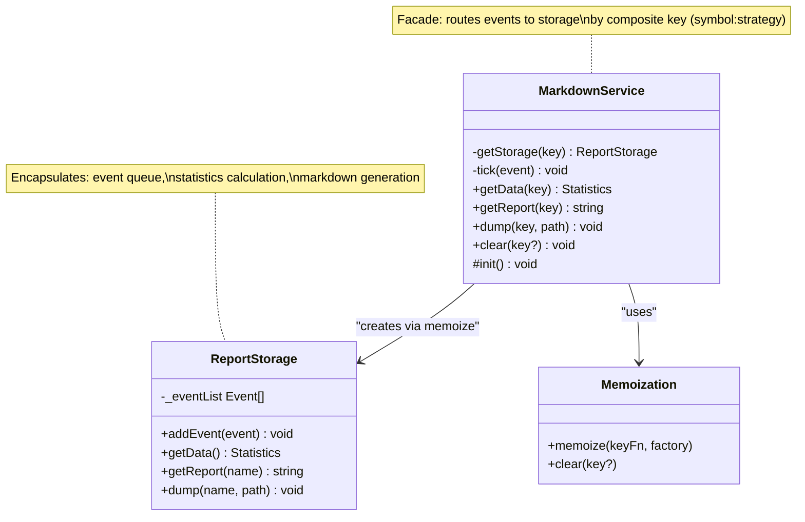
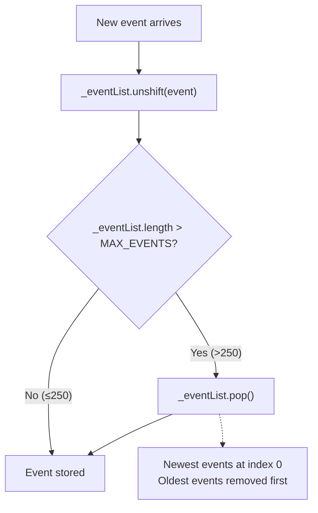
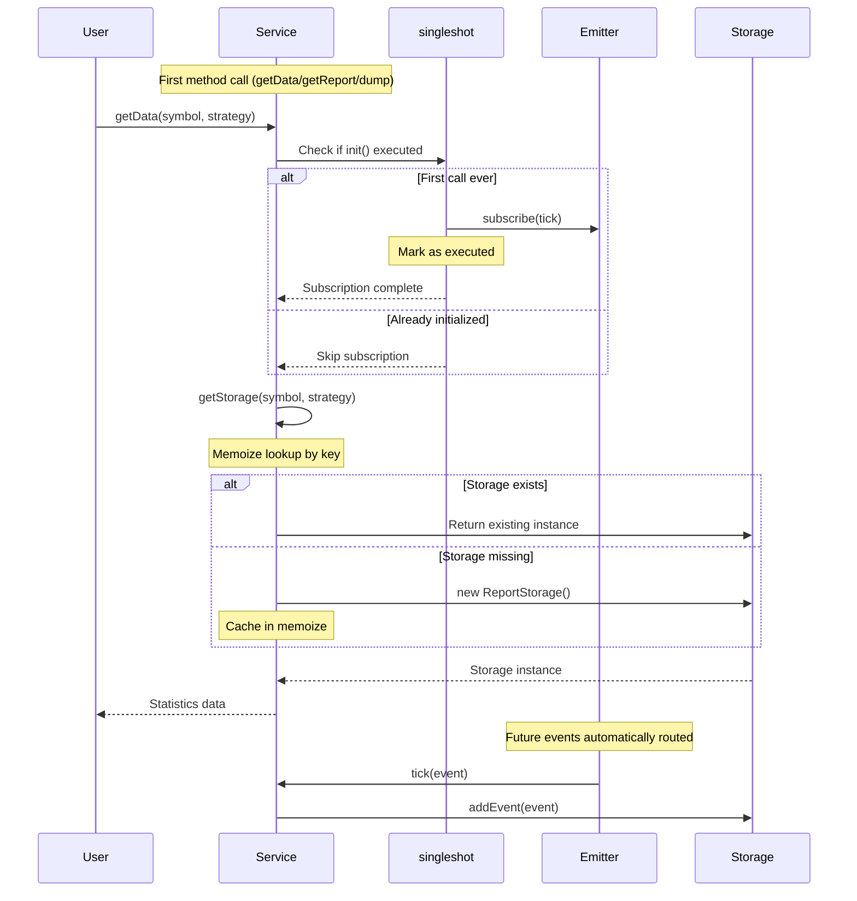
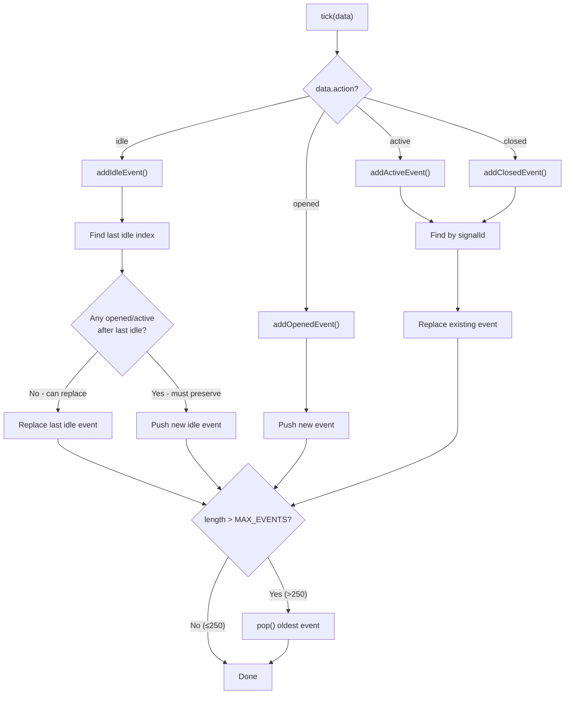
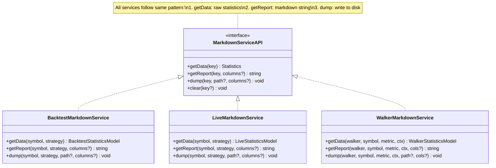
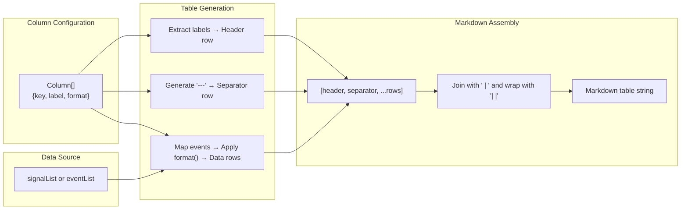
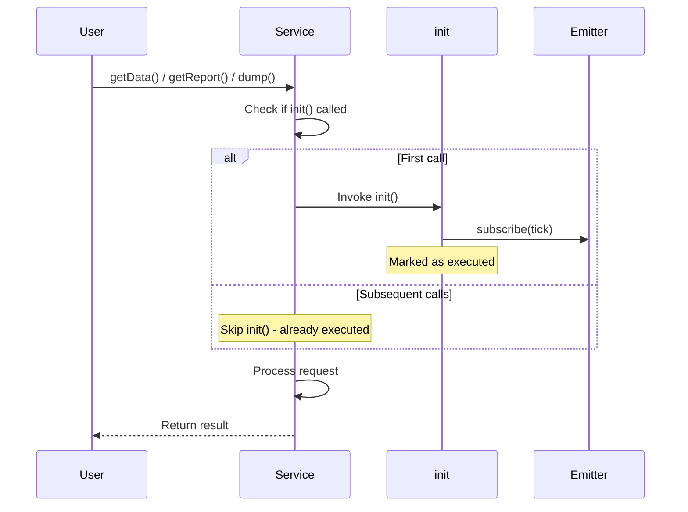

# Markdown Report Generation

<details>
<summary>Relevant source files</summary>

The following files were used as context for generating this wiki page:

- [src/lib/services/markdown/BacktestMarkdownService.ts](src/lib/services/markdown/BacktestMarkdownService.ts)
- [src/lib/services/markdown/HeatMarkdownService.ts](src/lib/services/markdown/HeatMarkdownService.ts)
- [src/lib/services/markdown/LiveMarkdownService.ts](src/lib/services/markdown/LiveMarkdownService.ts)
- [src/lib/services/markdown/PartialMarkdownService.ts](src/lib/services/markdown/PartialMarkdownService.ts)
- [src/lib/services/markdown/PerformanceMarkdownService.ts](src/lib/services/markdown/PerformanceMarkdownService.ts)
- [src/lib/services/markdown/RiskMarkdownService.ts](src/lib/services/markdown/RiskMarkdownService.ts)
- [src/lib/services/markdown/ScheduleMarkdownService.ts](src/lib/services/markdown/ScheduleMarkdownService.ts)
- [src/lib/services/markdown/WalkerMarkdownService.ts](src/lib/services/markdown/WalkerMarkdownService.ts)
- [src/model/Column.model.ts](src/model/Column.model.ts)

</details>


The markdown report generation system transforms trading execution events into human-readable reports with statistical analysis. The system uses a consistent architectural pattern across seven report types, each subscribing to event emitters and accumulating data in bounded queues.

| Report Type | Service | Event Source | Bounded Queue Key | Output Path |
|-------------|---------|--------------|-------------------|-------------|
| Backtest | `BacktestMarkdownService` | `signalBacktestEmitter` | `symbol:strategyName` | `./dump/backtest/{strategyName}.md` |
| Live | `LiveMarkdownService` | `signalLiveEmitter` | `symbol:strategyName` | `./dump/live/{strategyName}.md` |
| Schedule | `ScheduleMarkdownService` | `signalEmitter` | `symbol:strategyName` | `./dump/schedule/{strategyName}.md` |
| Partial | `PartialMarkdownService` | `partialProfitSubject`, `partialLossSubject` | `symbol:strategyName` | `./dump/partial/{symbol}_{strategyName}.md` |
| Walker | `WalkerMarkdownService` | `walkerEmitter` | `walkerName` | `./dump/walker/{walkerName}.md` |
| Heatmap | `HeatMarkdownService` | `signalEmitter` | `strategyName` | `./dump/heatmap/{strategyName}.md` |
| Performance | `PerformanceMarkdownService` | `performanceEmitter` | `symbol:strategyName` | `./dump/performance/{strategyName}.md` |

**Core Architectural Concepts:**
- **ReportStorage Pattern**: Inner storage class per service encapsulates event accumulation and report generation
- **Bounded Queue**: `MAX_EVENTS = 250` constant limits memory usage by dropping oldest events
- **Memoized Isolation**: Each storage instance is memoized by composite key to prevent data mixing
- **Singleshot Initialization**: Event subscriptions occur exactly once using `singleshot` from functools-kit

**Related Pages:**
- Statistical calculations (Sharpe Ratio, Certainty Ratio): See page 13.2
- Walker strategy comparison: See page 11.3  
- Heatmap portfolio analytics: See page 13.5
- Performance timing metrics: See page 13.2

---

## Architecture Overview

The markdown generation system consists of seven independent service classes that follow identical architectural patterns. Each service subscribes to event emitters, accumulates events in memoized storage, and provides three methods for data access (`getData`), report generation (`getReport`), and file persistence (`dump`).

**Markdown Services Architecture**

```mermaid
graph TB
    subgraph "Event Emitters"
        SBE["signalBacktestEmitter"]
        SLE["signalLiveEmitter"]
        SE["signalEmitter"]
        PPE["partialProfitSubject"]
        PLE["partialLossSubject"]
        WE["walkerEmitter"]
        PE["performanceEmitter"]
    end
    
    subgraph "Markdown Services"
        BMS["BacktestMarkdownService"]
        LMS["LiveMarkdownService"]
        SMS["ScheduleMarkdownService"]
        PMS["PartialMarkdownService"]
        WMS["WalkerMarkdownService"]
        HMS["HeatMarkdownService"]
        PERFMS["PerformanceMarkdownService"]
    end
    
    subgraph "Storage Layer (Memoized)"
        BStorage["ReportStorage<br/>symbol:strategy"]
        LStorage["ReportStorage<br/>symbol:strategy"]
        SStorage["ReportStorage<br/>symbol:strategy"]
        PStorage["ReportStorage<br/>symbol:strategy"]
        WStorage["ReportStorage<br/>walkerName"]
        HStorage["HeatmapStorage<br/>strategyName"]
        PerfStorage["PerformanceStorage<br/>symbol:strategy"]
    end
    
    subgraph "File Outputs"
        BFiles["./dump/backtest/*.md"]
        LFiles["./dump/live/*.md"]
        SFiles["./dump/schedule/*.md"]
        PFiles["./dump/partial/*.md"]
        WFiles["./dump/walker/*.md"]
        HFiles["./dump/heatmap/*.md"]
        PerfFiles["./dump/performance/*.md"]
    end
    
    SBE -->|"subscribe(tick)"| BMS
    SLE -->|"subscribe(tick)"| LMS
    SE -->|"subscribe(tick)"| SMS
    SE -->|"subscribe(tick)"| HMS
    PPE -->|"subscribe(tickProfit)"| PMS
    PLE -->|"subscribe(tickLoss)"| PMS
    WE -->|"subscribe(tick)"| WMS
    PE -->|"subscribe(track)"| PERFMS
    
    BMS --> BStorage
    LMS --> LStorage
    SMS --> SStorage
    PMS --> PStorage
    WMS --> WStorage
    HMS --> HStorage
    PERFMS --> PerfStorage
    
    BMS --> BFiles
    LMS --> LFiles
    SMS --> SFiles
    PMS --> PFiles
    WMS --> WFiles
    HMS --> HFiles
    PERFMS --> PerfFiles
```



**Common Service Pattern**

All services implement the same three-method pattern with memoized storage:

```typescript
class XxxMarkdownService {
  private getStorage = memoize<(key) => Storage>(/* ... */);
  
  public getData = async (key) => Promise<Statistics>;
  public getReport = async (key) => Promise<string>;
  public dump = async (key, path?) => Promise<void>;
  public clear = async (key?) => Promise<void>;
  protected init = singleshot(async () => { /* subscribe */ });
}
```

**Sources:** [src/lib/services/markdown/BacktestMarkdownService.ts:282-461](), [src/lib/services/markdown/LiveMarkdownService.ts:423-609](), [src/lib/services/markdown/ScheduleMarkdownService.ts:324-508](), [src/lib/services/markdown/PartialMarkdownService.ts:259-475](), [src/lib/services/markdown/WalkerMarkdownService.ts:406-603](), [src/lib/services/markdown/HeatMarkdownService.ts:434-606](), [src/lib/services/markdown/PerformanceMarkdownService.ts:312-454]()

---

## ReportStorage Pattern

All markdown services implement the same architectural pattern: a public service class acting as a facade, delegating to an inner `ReportStorage` class that encapsulates event accumulation and report generation logic.

**Pattern Structure**



**Key Responsibilities:**
- **Service Class**: Event subscription, storage routing, memoization management
- **Storage Class**: Event accumulation, statistical calculation, markdown formatting

The separation ensures that each symbol-strategy pair gets isolated storage while the service class manages the storage lifecycle.

**Sources:** [src/lib/services/markdown/BacktestMarkdownService.ts:76-253](), [src/lib/services/markdown/BacktestMarkdownService.ts:282-461](), [src/lib/services/markdown/LiveMarkdownService.ts:78-391](), [src/lib/services/markdown/LiveMarkdownService.ts:423-609]()

---

## Bounded Queue System (MAX_EVENTS)

All markdown services implement bounded queues to prevent unbounded memory growth during long-running executions. The `MAX_EVENTS = 250` constant defines the maximum queue capacity across all report types.

**Queue Management**



**Memory Characteristics:**

| Constant | Value | Memory Impact | Retention Strategy |
|----------|-------|---------------|-------------------|
| `MAX_EVENTS` | 250 | ~50-100 KB per storage instance | FIFO (First In, First Out) |
| Queue operations | `unshift()` + `pop()` | O(n) insertion, O(1) removal | Keep newest events |
| Storage per symbol-strategy | 1 instance | Isolated memory pools | Memoized by key |

**Implementation Example (BacktestMarkdownService):**

```typescript
public addSignal(data: IStrategyTickResultClosed) {
  this._signalList.unshift(data);  // Add to front
  
  if (this._signalList.length > MAX_EVENTS) {
    this._signalList.pop();  // Remove oldest
  }
}
```

The bounded queue ensures that even with millions of events over days of live trading, each storage instance uses constant memory. With typical deployments running 10-20 symbol-strategy pairs, total memory usage remains under 5 MB for all markdown services combined.

**Sources:** [src/lib/services/markdown/BacktestMarkdownService.ts:70](), [src/lib/services/markdown/BacktestMarkdownService.ts:85-92](), [src/lib/services/markdown/LiveMarkdownService.ts:72](), [src/lib/services/markdown/LiveMarkdownService.ts:122-140](), [src/lib/services/markdown/ScheduleMarkdownService.ts:53]()

---

## Event Subscription Lifecycle

Each markdown service subscribes to event emitters during initialization using the `singleshot` pattern from functools-kit. This ensures subscriptions occur exactly once, even with multiple concurrent callers.

**Initialization Sequence**



The `singleshot` wrapper ensures thread-safe initialization without locks by leveraging JavaScript's single-threaded event loop. Multiple concurrent calls to `getData()` will queue behind the first call's initialization.

**Sources:** [src/lib/services/markdown/BacktestMarkdownService.ts:457-460](), [src/lib/services/markdown/LiveMarkdownService.ts:605-608](), [src/lib/services/markdown/ScheduleMarkdownService.ts:504-507]()

### Backtest Event Processing

`BacktestMarkdownService` filters events to only accumulate `action === "closed"` signals. This is because backtest execution uses fast-forward simulation that skips intermediate states.

**Event Filtering Logic**

```typescript
private tick = async (data: IStrategyTickResult) => {
  if (data.action !== "closed") {
    return;  // Ignore idle/opened/active events
  }
  
  const storage = this.getStorage(data.symbol, data.strategyName);
  storage.addSignal(data);  // Only closed events stored
};
```

**Sources:** [src/lib/services/markdown/BacktestMarkdownService.ts:314-325](), [src/lib/services/markdown/BacktestMarkdownService.ts:457-460]()

### Live Event Processing

`LiveMarkdownService` accumulates all four event types (`idle`, `opened`, `active`, `closed`) with specialized handling to prevent memory bloat from idle periods.

**Event Routing with Idle Deduplication**



**Idle Event Deduplication Logic:**

The service prevents idle event spam by replacing consecutive idle events when no signal activity has occurred:

```typescript
public addIdleEvent(currentPrice: number) {
  const lastIdleIndex = this._eventList.findLastIndex(
    (event) => event.action === "idle"
  );
  
  // Can replace if no opened/active events exist after last idle
  const canReplace = lastIdleIndex !== -1 &&
    !this._eventList
      .slice(lastIdleIndex + 1)
      .some((e) => e.action === "opened" || e.action === "active");
  
  if (canReplace) {
    this._eventList[lastIdleIndex] = newEvent;  // Replace in-place
  } else {
    this._eventList.unshift(newEvent);  // Push new
  }
  
  // Bounded queue enforcement
  if (this._eventList.length > MAX_EVENTS) {
    this._eventList.pop();
  }
}
```

This optimization prevents a strategy polling every minute with no signals from accumulating 1440 idle events per day. Instead, only the most recent idle event is retained until signal activity resumes.

**Sources:** [src/lib/services/markdown/LiveMarkdownService.ts:88-115](), [src/lib/services/markdown/LiveMarkdownService.ts:147-182](), [src/lib/services/markdown/LiveMarkdownService.ts:189-215](), [src/lib/services/markdown/LiveMarkdownService.ts:72]()

### Schedule Event Processing

`ScheduleMarkdownService` tracks scheduled signals (limit orders) through three states: scheduled, opened (activated), and cancelled.

**Event Types:**

| Event | Trigger | Stored Data |
|-------|---------|-------------|
| `scheduled` | Signal with `priceOpen` specified | Timestamp, signal metadata, entry price |
| `opened` | `priceOpen` reached (only if previously scheduled) | Activation timestamp, wait duration |
| `cancelled` | Timeout or SL hit before activation | Cancellation timestamp, wait duration |

**Scheduled Signal Filtering:**

```typescript
private tick = async (data: IStrategyTickResult) => {
  const storage = this.getStorage(data.symbol, data.strategyName);
  
  if (data.action === "scheduled") {
    storage.addScheduledEvent(data);
  } else if (data.action === "opened") {
    // Only track if this was previously scheduled
    if (data.signal.scheduledAt !== data.signal.pendingAt) {
      storage.addOpenedEvent(data);
    }
  } else if (data.action === "cancelled") {
    storage.addCancelledEvent(data);
  }
};
```

The service subscribes to `signalEmitter` (global) rather than mode-specific emitters because scheduled signals can occur in both backtest and live modes.

**Sources:** [src/lib/services/markdown/ScheduleMarkdownService.ts:68-86](), [src/lib/services/markdown/ScheduleMarkdownService.ts:93-117](), [src/lib/services/markdown/ScheduleMarkdownService.ts:124-149](), [src/lib/services/markdown/ScheduleMarkdownService.ts:351-369]()

---

## Report Generation Services

Each markdown service contains an inner `ReportStorage` class that encapsulates event accumulation logic and report generation. The service class itself acts as a facade that manages per-strategy storage instances using memoization.

### BacktestMarkdownService

The backtest service generates reports with closed signal data in a tabular format. Each row represents a completed trade with open/close prices, PNL, duration, and close reason.

| Component | Purpose | Code Reference |
|-----------|---------|----------------|
| `BacktestMarkdownService` | Facade service managing storage instances | [BacktestMarkdownService.ts:370-542]() |
| `ReportStorage` | Inner class storing signal list | [BacktestMarkdownService.ts:183-341]() |
| `BacktestStatistics` | Interface for statistical data | [BacktestMarkdownService.ts:66-102]() |
| `Column[]` | Table column definitions | [BacktestMarkdownService.ts:104-177]() |
| `getStorage()` | Memoized storage retriever | [BacktestMarkdownService.ts:378-381]() |

**Sources:** [src/lib/services/markdown/BacktestMarkdownService.ts:370-542]()

### LiveMarkdownService

The live service generates reports with all event types (idle, opened, active, closed). The report shows strategy activity timeline including periods of inactivity and active position monitoring.

| Component | Purpose | Code Reference |
|-----------|---------|----------------|
| `LiveMarkdownService` | Facade service managing storage instances | [LiveMarkdownService.ts:567-746]() |
| `ReportStorage` | Inner class storing event list | [LiveMarkdownService.ts:229-535]() |
| `LiveStatistics` | Interface for statistical data | [LiveMarkdownService.ts:91-130]() |
| `TickEvent` | Unified event data structure | [LiveMarkdownService.ts:39-66]() |
| `Column[]` | Table column definitions | [LiveMarkdownService.ts:145-220]() |
| `MAX_EVENTS` | Event queue capacity (250) | [LiveMarkdownService.ts:223]() |

**Sources:** [src/lib/services/markdown/LiveMarkdownService.ts:567-746]()

### ScheduleMarkdownService

The schedule service tracks scheduled signals and their cancellation metrics. Reports include cancellation rate and average wait time for cancelled orders.

| Component | Purpose | Code Reference |
|-----------|---------|----------------|
| `ScheduleMarkdownService` | Facade service managing storage instances | [ScheduleMarkdownService.ts:374-545]() |
| `ReportStorage` | Inner class storing scheduled events | [ScheduleMarkdownService.ts:167-351]() |
| `ScheduleStatistics` | Interface for statistical data | [ScheduleMarkdownService.ts:68-86]() |
| `ScheduledEvent` | Scheduled/cancelled event data | [ScheduleMarkdownService.ts:19-44]() |
| `Column[]` | Table column definitions | [ScheduleMarkdownService.ts:101-158]() |

**Sources:** [src/lib/services/markdown/ScheduleMarkdownService.ts:374-545]()

---

---

## Three-Method Public API

All markdown services expose three public methods for data access, report generation, and file persistence. This consistent API enables predictable usage across all report types.

**API Contract**



**Sources:** [src/lib/services/markdown/BacktestMarkdownService.ts:342-414](), [src/lib/services/markdown/LiveMarkdownService.ts:490-562](), [src/lib/services/markdown/ScheduleMarkdownService.ts:386-461]()

### getData() - Statistical Data Access

The `getData()` method returns a statistics object containing raw event data and calculated metrics. All numeric fields use `null` for invalid values (NaN/Infinity) to prevent downstream errors.

**Statistics Interface Examples:**

```typescript
// BacktestStatisticsModel
interface BacktestStatisticsModel {
  signalList: IStrategyTickResultClosed[];  // Raw closed signals
  totalSignals: number;
  winCount: number;
  lossCount: number;
  winRate: number | null;        // (winCount / total) * 100
  avgPnl: number | null;
  totalPnl: number | null;
  stdDev: number | null;
  sharpeRatio: number | null;    // avgPnl / stdDev
  annualizedSharpeRatio: number | null;  // sharpeRatio * sqrt(365)
  certaintyRatio: number | null;  // avgWin / abs(avgLoss)
  expectedYearlyReturns: number | null;  // avgPnl * (365 / avgDurationDays)
}

// LiveStatisticsModel (includes all event types)
interface LiveStatisticsModel {
  eventList: TickEvent[];  // idle/opened/active/closed events
  totalEvents: number;
  totalClosed: number;
  // ... same metrics as backtest for closed events
}
```

**Safe Math Guard:**

All services use `isUnsafe()` to prevent invalid numeric values:

```typescript
function isUnsafe(value: number | null): boolean {
  if (typeof value !== "number") return true;
  if (isNaN(value)) return true;
  if (!isFinite(value)) return true;
  return false;
}

// Applied to all metrics before returning
winRate: isUnsafe(winRate) ? null : winRate,
sharpeRatio: isUnsafe(sharpeRatio) ? null : sharpeRatio,
```

**Sources:** [src/lib/services/markdown/BacktestMarkdownService.ts:56-67](), [src/lib/services/markdown/BacktestMarkdownService.ts:100-168](), [src/lib/services/markdown/LiveMarkdownService.ts:58-69](), [src/lib/services/markdown/LiveMarkdownService.ts:223-306]()

### getReport() - Markdown Generation

The `getReport()` method transforms statistical data into formatted markdown tables. The method uses `ColumnModel` configuration to define table structure and cell formatting.

**Markdown Report Structure:**

```markdown
# Backtest Report: my-strategy

| Signal ID | Symbol | Position | ... | PNL (net) | Close Reason |
|-----------|--------|----------|-----|-----------|--------------|
| abc-123   | BTCUSDT | LONG    | ... | +3.45%    | TAKEPROFIT   |
| def-456   | ETHUSDT | SHORT   | ... | -1.23%    | STOPLOSS     |

**Total signals:** 250
**Closed signals:** 250
**Win rate:** 65.00% (163W / 87L) (higher is better)
**Average PNL:** +1.25% (higher is better)
**Total PNL:** +312.50% (higher is better)
**Sharpe Ratio:** 1.850 (higher is better)
**Expected Yearly Returns:** +450.00% (higher is better)
```

**Column Configuration System:**

```typescript
interface ColumnModel<T> {
  key: string;                                   // Unique identifier
  label: string;                                 // Table header
  format: (data: T, index: number) => string;    // Cell formatter
  isVisible: () => boolean;                      // Visibility toggle
}

// Example column for PNL formatting
const pnlColumn: ColumnModel<IStrategyTickResultClosed> = {
  key: "pnl",
  label: "PNL (net)",
  format: (signal) => {
    const pnl = signal.pnl.pnlPercentage;
    const sign = pnl >= 0 ? "+" : "";
    return `${sign}${pnl.toFixed(2)}%`;
  },
  isVisible: () => true
};
```

The `isVisible()` function allows dynamic column hiding based on configuration or data availability.

**Sources:** [src/model/Column.model.ts:1-39](), [src/lib/services/markdown/BacktestMarkdownService.ts:177-224](), [src/lib/services/markdown/LiveMarkdownService.ts:315-362]()

### dump() - File Persistence

The `dump()` method writes markdown reports to disk using Node.js file system APIs. The method creates directories recursively if they don't exist and uses UTF-8 encoding.

**Default Paths:**
- Backtest: `./dump/backtest/{strategyName}.md`
- Live: `./dump/live/{strategyName}.md`
- Schedule: `./dump/schedule/{strategyName}.md`

**Sources:** [src/lib/services/markdown/BacktestMarkdownService.ts:322-340](), [src/lib/services/markdown/LiveMarkdownService.ts:516-534](), [src/lib/services/markdown/ScheduleMarkdownService.ts:332-350]()

---

## Markdown Table Generation

Tables are generated using a column configuration system that defines label, key, and formatting function for each column. The system maps event data to table rows using these column definitions.



**Sources:** [src/lib/services/markdown/BacktestMarkdownService.ts:289-296](), [src/lib/services/markdown/LiveMarkdownService.ts:483-490]()

### Backtest Columns

The backtest table includes 12 columns showing complete signal lifecycle data:

| Column | Format | Example |
|--------|--------|---------|
| Signal ID | UUID string | `abc123-def456` |
| Symbol | Trading pair | `BTCUSDT` |
| Position | LONG/SHORT | `LONG` |
| Note | User-provided string | `Breakout entry` |
| Open Price | 8 decimals + USD | `50000.12345678 USD` |
| Close Price | 8 decimals + USD | `51500.00000000 USD` |
| Take Profit | 8 decimals + USD | `52000.00000000 USD` |
| Stop Loss | 8 decimals + USD | `49000.00000000 USD` |
| PNL (net) | +/- 2 decimals + % | `+3.00%` |
| Close Reason | Enum string | `TAKEPROFIT` / `STOPLOSS` / `TIMEOUT` |
| Duration (min) | Integer minutes | `120` |
| Open Time | ISO 8601 | `2024-01-15T10:30:00.000Z` |
| Close Time | ISO 8601 | `2024-01-15T12:30:00.000Z` |

**Sources:** [src/lib/services/markdown/BacktestMarkdownService.ts:104-177]()

### Live Columns

The live table includes 13 columns showing all event types including idle periods:

| Column | Format | Example |
|--------|--------|---------|
| Timestamp | ISO 8601 | `2024-01-15T10:30:00.000Z` |
| Action | IDLE/OPENED/ACTIVE/CLOSED | `CLOSED` |
| Symbol | Trading pair or N/A | `BTCUSDT` |
| Signal ID | UUID or N/A | `abc123-def456` |
| Position | LONG/SHORT or N/A | `LONG` |
| Note | User string or N/A | `Breakout entry` |
| Current Price | 8 decimals + USD | `51500.00000000 USD` |
| Open Price | 8 decimals + USD or N/A | `50000.12345678 USD` |
| Take Profit | 8 decimals + USD or N/A | `52000.00000000 USD` |
| Stop Loss | 8 decimals + USD or N/A | `49000.00000000 USD` |
| PNL (net) | +/- 2 decimals + % or N/A | `+3.00%` |
| Close Reason | Enum or N/A | `TAKEPROFIT` |
| Duration (min) | Integer or N/A | `120` |

**Sources:** [src/lib/services/markdown/LiveMarkdownService.ts:145-220]()

### Schedule Columns

The schedule table includes 11 columns focused on scheduled signal lifecycle:

| Column | Format | Example |
|--------|--------|---------|
| Timestamp | ISO 8601 | `2024-01-15T10:30:00.000Z` |
| Action | SCHEDULED/CANCELLED | `CANCELLED` |
| Symbol | Trading pair | `BTCUSDT` |
| Signal ID | UUID string | `abc123-def456` |
| Position | LONG/SHORT | `LONG` |
| Note | User string or N/A | `Limit order` |
| Current Price | 8 decimals + USD | `50500.00000000 USD` |
| Entry Price | 8 decimals + USD | `50000.00000000 USD` |
| Take Profit | 8 decimals + USD | `52000.00000000 USD` |
| Stop Loss | 8 decimals + USD | `49000.00000000 USD` |
| Wait Time (min) | Integer or N/A | `45` |

**Sources:** [src/lib/services/markdown/ScheduleMarkdownService.ts:101-158]()

---

## Storage Management

Each markdown service uses memoized storage to maintain per-symbol-strategy isolation. This prevents data mixing between different trading pairs and strategies running in parallel.

### Memoization Strategy

Storage instances are memoized using the key pattern `"symbol:strategyName"`. The memoization ensures that repeated calls for the same symbol-strategy pair return the same storage instance, while different pairs get isolated storage.

```typescript
// Memoized storage retrieval pattern (all services)
private getStorage = memoize<(symbol: string, strategyName: string) => ReportStorage>(
  ([symbol, strategyName]) => `${symbol}:${strategyName}`,
  () => new ReportStorage()
);
```

**Sources:** [src/lib/services/markdown/BacktestMarkdownService.ts:290-293](), [src/lib/services/markdown/LiveMarkdownService.ts:431-434](), [src/lib/services/markdown/ScheduleMarkdownService.ts:332-335]()

### Clear Operation

The `clear()` method provides two modes of operation:
1. **Targeted Clear**: Clear specific symbol-strategy pair by providing context
2. **Global Clear**: Clear all storage instances when no context provided

```typescript
// Clear specific pair
await service.clear({ symbol: "BTCUSDT", strategyName: "my-strategy" });

// Clear all pairs
await service.clear();
```

The clear operation calls `memoize.clear()` which removes cached entries, enabling garbage collection of storage instances.

**Sources:** [src/lib/services/markdown/BacktestMarkdownService.ts:434-444](), [src/lib/services/markdown/LiveMarkdownService.ts:582-592](), [src/lib/services/markdown/ScheduleMarkdownService.ts:481-491]()

---

## Event Type Processing

Each service processes different subsets of the event action types emitted by `ClientStrategy`. The action filtering determines which events contribute to the report.

### Backtest Event Types

Backtest only processes `action === "closed"` events. All other actions (`idle`, `opened`, `active`) are ignored because backtest execution uses fast-forward simulation that skips timeframes once a signal opens.

```typescript
private tick = async (data: IStrategyTickResult) => {
  if (data.action !== "closed") {
    return;  // Ignore non-closed events
  }
  
  const storage = this.getStorage(data.symbol, data.strategyName);
  storage.addSignal(data);
};
```

**Sources:** [src/lib/services/markdown/BacktestMarkdownService.ts:314-325]()

### Live Event Types

Live processes all four action types with specialized handling for each:

| Action | Handling Logic | Purpose |
|--------|----------------|---------|
| `idle` | Replace last idle if no opened/active after it | Prevent unbounded idle event accumulation |
| `opened` | Push new event | Track signal opening |
| `active` | Find by signalId and replace | Update position monitoring state |
| `closed` | Find by signalId and replace | Record final PNL and close reason |

**Sources:** [src/lib/services/markdown/LiveMarkdownService.ts:457-473]()

### Schedule Event Types

Schedule processes two action types related to limit orders:

| Action | Handling Logic | Purpose |
|--------|----------------|---------|
| `scheduled` | Push new event | Track limit order creation |
| `cancelled` | Find by signalId and replace | Record cancellation with wait time |

**Sources:** [src/lib/services/markdown/ScheduleMarkdownService.ts:351-369]()

---

## Initialization Pattern

All markdown services use the `singleshot` pattern from `functools-kit` to ensure event subscription happens exactly once. The `init()` method is marked protected and called automatically on first data access.



**Sources:** [src/lib/services/markdown/BacktestMarkdownService.ts:538-541](), [src/lib/services/markdown/LiveMarkdownService.ts:742-745](), [src/lib/services/markdown/ScheduleMarkdownService.ts:541-544]()

The protected visibility (`protected init`) allows subclass testing while preventing external calls. The automatic initialization ensures services are ready without explicit setup calls.