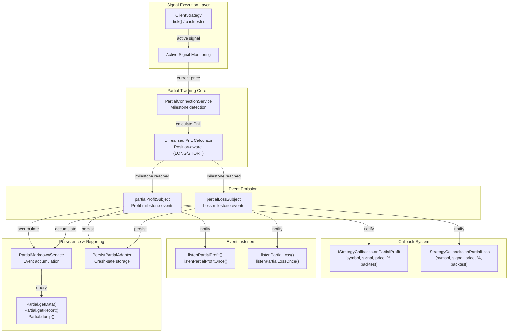
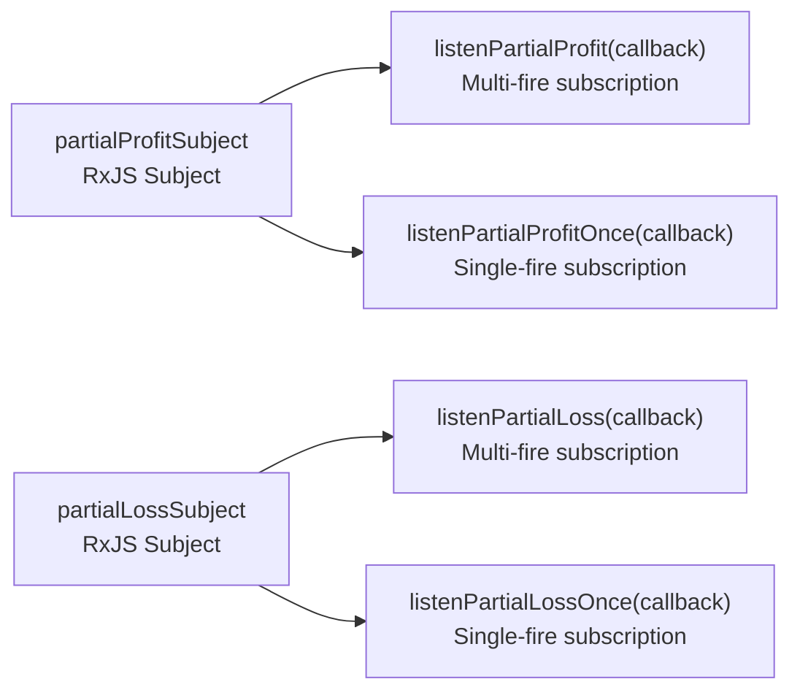
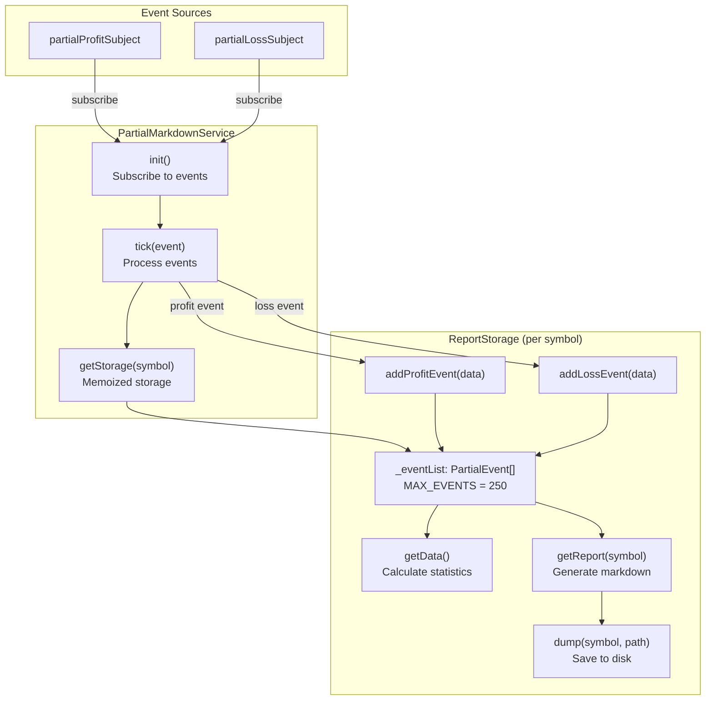
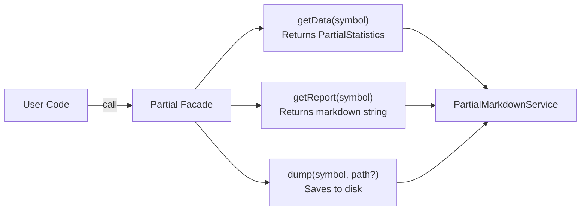
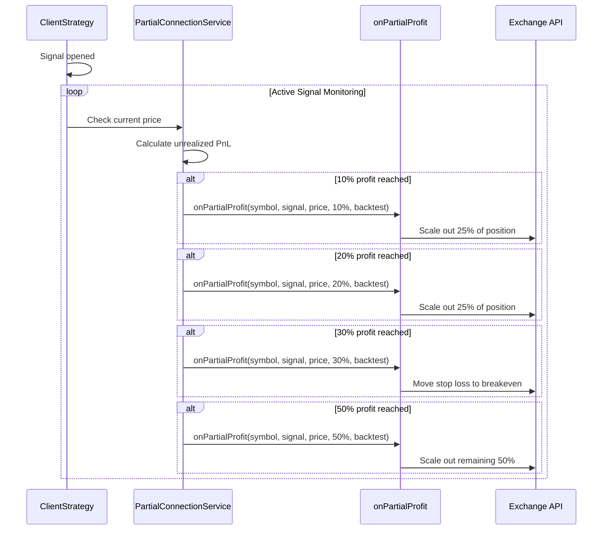
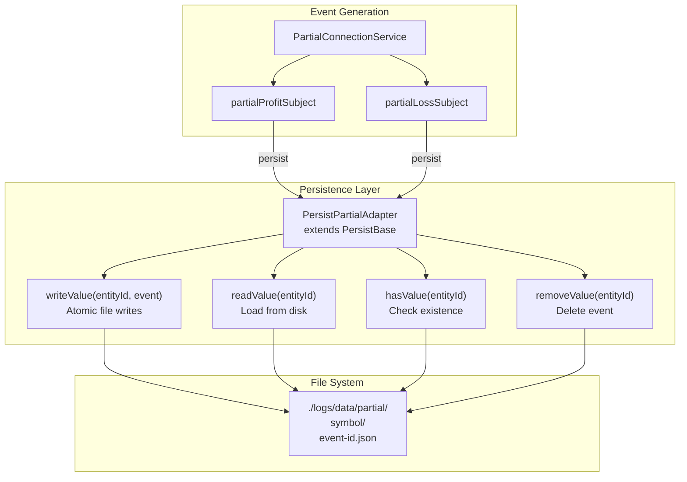
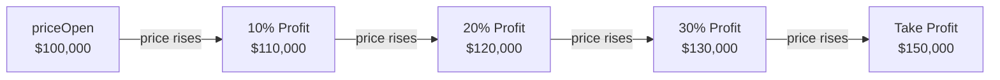
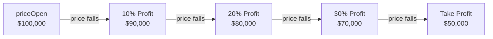
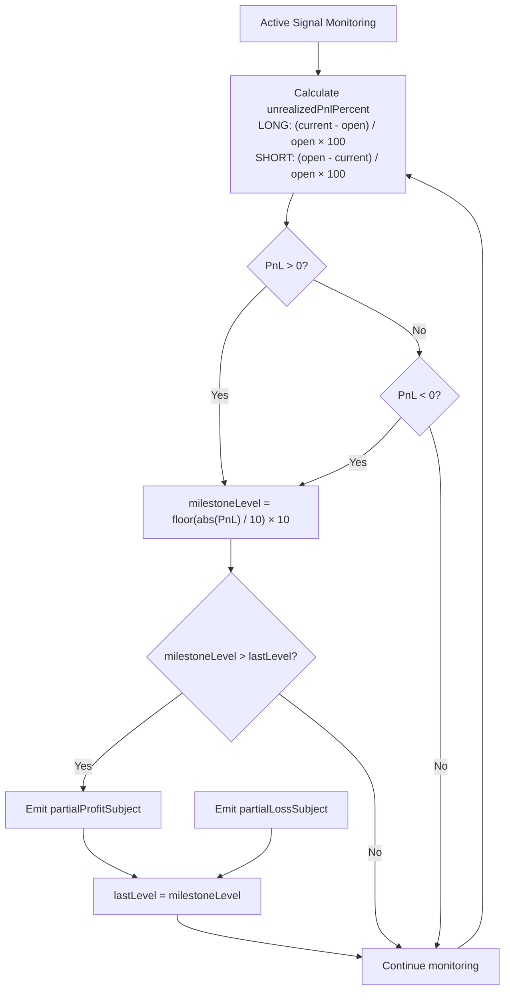

# Partial Profit/Loss Tracking

<details>
<summary>Relevant source files</summary>

The following files were used as context for generating this wiki page:

- [README.md](README.md)
- [src/lib/services/markdown/BacktestMarkdownService.ts](src/lib/services/markdown/BacktestMarkdownService.ts)
- [src/lib/services/markdown/LiveMarkdownService.ts](src/lib/services/markdown/LiveMarkdownService.ts)
- [src/lib/services/markdown/ScheduleMarkdownService.ts](src/lib/services/markdown/ScheduleMarkdownService.ts)
- [test/e2e/defend.test.mjs](test/e2e/defend.test.mjs)
- [test/e2e/partial.test.mjs](test/e2e/partial.test.mjs)
- [test/index.mjs](test/index.mjs)

</details>


## Purpose and Scope

This document explains the **Partial Profit/Loss Tracking** system, which monitors unrealized profit and loss milestones during active signal execution. The system tracks when positions reach fixed percentage levels (10%, 20%, 30%, etc.) and emits events for risk management, position scaling strategies, and performance monitoring.

For general signal lifecycle information, see [Signal Lifecycle Overview](#2.2). For PnL calculation details, see [PnL Calculation](#8.5). For reporting systems, see [Reporting and Analytics](#13).

---

## System Architecture

The Partial system operates as an event-driven subsystem that monitors active signals and emits milestone events when unrealized profit or loss reaches predefined thresholds.



**Sources:** [README.md:1079-1217](), [test/e2e/partial.test.mjs:1-819]()

---

## Milestone Levels

The system tracks unrealized profit/loss at **fixed percentage intervals** from 10% to 100% in 10% increments, plus additional granular levels beyond 100%.

### Standard Milestone Levels

| Level % | Description | Trigger Condition (LONG) | Trigger Condition (SHORT) |
|---------|-------------|--------------------------|---------------------------|
| 10% | First milestone | currentPrice ≥ priceOpen × 1.10 | currentPrice ≤ priceOpen × 0.90 |
| 20% | Second milestone | currentPrice ≥ priceOpen × 1.20 | currentPrice ≤ priceOpen × 0.80 |
| 30% | Third milestone | currentPrice ≥ priceOpen × 1.30 | currentPrice ≤ priceOpen × 0.70 |
| ... | ... | ... | ... |
| 100% | Double position | currentPrice ≥ priceOpen × 2.00 | currentPrice ≤ priceOpen × 0.00 |

### Calculation Logic

For **LONG positions** (profit when price rises):
```
unrealizedPnlPercent = ((currentPrice - priceOpen) / priceOpen) × 100
```

For **SHORT positions** (profit when price falls):
```
unrealizedPnlPercent = ((priceOpen - currentPrice) / priceOpen) × 100
```

**Negative values** indicate losses and trigger `onPartialLoss` callbacks.

**Sources:** [README.md:1082-1120](), [test/e2e/partial.test.mjs:17-151]()

---

## Callback Integration

Partial tracking integrates with the strategy callback system through two optional callbacks in `IStrategyCallbacks`.

### Callback Signatures

```typescript
interface IStrategyCallbacks {
  /**
   * Called when unrealized profit reaches a milestone level.
   * 
   * @param symbol - Trading pair symbol
   * @param signal - Active signal data
   * @param currentPrice - Current market price
   * @param revenuePercent - Unrealized profit percentage (positive)
   * @param backtest - True if backtest mode, false if live
   */
  onPartialProfit?: (
    symbol: string,
    signal: ISignal,
    currentPrice: number,
    revenuePercent: number,
    backtest: boolean
  ) => void;

  /**
   * Called when unrealized loss reaches a milestone level.
   * 
   * @param symbol - Trading pair symbol
   * @param signal - Active signal data
   * @param currentPrice - Current market price
   * @param revenuePercent - Unrealized loss percentage (negative)
   * @param backtest - True if backtest mode, false if live
   */
  onPartialLoss?: (
    symbol: string,
    signal: ISignal,
    currentPrice: number,
    revenuePercent: number,
    backtest: boolean
  ) => void;
}
```

### Usage Example

```typescript
addStrategy({
  strategyName: "scalp-strategy",
  interval: "5m",
  getSignal: async (symbol) => {
    // Signal generation logic
  },
  callbacks: {
    onPartialProfit: (symbol, signal, currentPrice, revenuePercent, backtest) => {
      console.log(`[${backtest ? "BT" : "LIVE"}] Profit: ${revenuePercent.toFixed(2)}%`);
      
      // Scale out position at 50% profit
      if (revenuePercent >= 50) {
        console.log(`Consider taking partial profit at ${currentPrice}`);
      }
    },
    onPartialLoss: (symbol, signal, currentPrice, revenuePercent, backtest) => {
      console.log(`[${backtest ? "BT" : "LIVE"}] Loss: ${revenuePercent.toFixed(2)}%`);
      
      // Tighten stop loss at -30% unrealized loss
      if (revenuePercent <= -30) {
        console.log(`Warning: Approaching stop loss at ${currentPrice}`);
      }
    },
  },
});
```

**Sources:** [test/e2e/partial.test.mjs:88-94](), [test/e2e/partial.test.mjs:227-233]()

---

## Event Listener API

The system provides event listeners for external monitoring without requiring strategy callback registration.

### Listener Functions



### API Reference

| Function | Description | Return Value |
|----------|-------------|--------------|
| `listenPartialProfit(callback)` | Subscribe to all profit milestone events | `() => void` (unsubscribe function) |
| `listenPartialProfitOnce(callback)` | Subscribe to first profit milestone event only | `() => void` (unsubscribe function) |
| `listenPartialLoss(callback)` | Subscribe to all loss milestone events | `() => void` (unsubscribe function) |
| `listenPartialLossOnce(callback)` | Subscribe to first loss milestone event only | `() => void` (unsubscribe function) |

### Event Structure

```typescript
interface PartialEvent {
  /** Event action type */
  action: "partial-profit" | "partial-loss";
  
  /** Trading pair symbol */
  symbol: string;
  
  /** Active signal data */
  signal: ISignal;
  
  /** Current market price */
  currentPrice: number;
  
  /** Milestone percentage level (10, 20, 30, ...) */
  levelPercent: number;
  
  /** Unrealized PnL percentage */
  revenuePercent: number;
  
  /** Timestamp of milestone */
  timestamp: number;
  
  /** Execution mode */
  backtest: boolean;
}
```

### Usage Example

```typescript
import { listenPartialProfit, listenPartialLoss } from "backtest-kit";

// Monitor all profit milestones
const unsubscribeProfit = listenPartialProfit((event) => {
  console.log(`Profit milestone: ${event.levelPercent}% at $${event.currentPrice}`);
  console.log(`Unrealized PnL: ${event.revenuePercent.toFixed(2)}%`);
});

// Monitor all loss milestones
const unsubscribeLoss = listenPartialLoss((event) => {
  console.log(`Loss milestone: ${event.levelPercent}% at $${event.currentPrice}`);
  console.log(`Unrealized PnL: ${event.revenuePercent.toFixed(2)}%`);
});

// Cleanup
unsubscribeProfit();
unsubscribeLoss();
```

**Sources:** [README.md:1087-1123]()

---

## PartialMarkdownService

The `PartialMarkdownService` accumulates partial profit/loss events and generates statistical reports, following the same architecture pattern as `BacktestMarkdownService` and `LiveMarkdownService`.

### Service Architecture



### Storage Behavior

The service maintains a **per-symbol** event queue with a maximum of **250 events** (configurable via `MAX_EVENTS`). When the queue exceeds capacity, the oldest events are removed (FIFO).

**Key characteristics:**
- **Memoization**: Each `symbol` gets its own isolated `ReportStorage` instance
- **Event types**: Both profit and loss events stored in chronological order
- **Queue management**: Automatic trimming when exceeding `MAX_EVENTS`
- **Statistics**: Real-time calculation without blocking event processing

**Sources:** Similar pattern to [src/lib/services/markdown/LiveMarkdownService.ts:223-265](), [src/lib/services/markdown/BacktestMarkdownService.ts:183-195]()

---

## Partial Statistics

The `PartialStatistics` interface provides comprehensive metrics for analyzing unrealized profit/loss behavior.

### Statistics Interface

```typescript
export interface PartialStatistics {
  /** Array of all partial profit/loss events with full details */
  eventList: PartialEvent[];

  /** Total number of all events (profit + loss) */
  totalEvents: number;

  /** Total number of profit milestone events */
  totalProfit: number;

  /** Total number of loss milestone events */
  totalLoss: number;

  /** Profit/loss ratio as percentage (0-100), null if no events */
  profitRatio: number | null;

  /** Average profit milestone level (%), null if no profit events */
  avgProfitLevel: number | null;

  /** Average loss milestone level (%), null if no loss events */
  avgLossLevel: number | null;

  /** Maximum profit level reached (%), null if no profit events */
  maxProfitLevel: number | null;

  /** Maximum loss level reached (%), null if no loss events */
  maxLossLevel: number | null;
}
```

### Calculation Logic

The statistics are calculated using safe math operations that protect against `NaN` and `Infinity` values:

```typescript
function isUnsafe(value: number | null): boolean {
  if (typeof value !== "number") return true;
  if (isNaN(value)) return true;
  if (!isFinite(value)) return true;
  return false;
}
```

**All numeric values return `null` if calculation is unsafe**, ensuring reports never display invalid numbers.

**Sources:** Similar pattern to [src/lib/services/markdown/BacktestMarkdownService.ts:33-44](), [src/lib/services/markdown/LiveMarkdownService.ts:22-33]()

---

## Partial Facade API

The `Partial` facade provides a unified interface for accessing partial profit/loss data and reports, following the same pattern as `Backtest`, `Live`, and `Schedule` facades.

### Facade Methods



### API Reference

#### `Partial.getData(symbol: string): Promise<PartialStatistics>`

Returns statistical data for all partial profit/loss events for the specified symbol.

**Parameters:**
- `symbol` - Trading pair symbol (e.g., "BTCUSDT")

**Returns:** `Promise<PartialStatistics>` with metrics and event list

**Example:**
```typescript
const stats = await Partial.getData("BTCUSDT");

console.log(`Total events: ${stats.totalEvents}`);
console.log(`Profit events: ${stats.totalProfit}`);
console.log(`Loss events: ${stats.totalLoss}`);
console.log(`Max profit level: ${stats.maxProfitLevel}%`);

// Access raw event data
stats.eventList.forEach(event => {
  console.log(`${event.action}: ${event.levelPercent}% at $${event.currentPrice}`);
});
```

#### `Partial.getReport(symbol: string): Promise<string>`

Generates a markdown report with a table of all partial profit/loss events.

**Parameters:**
- `symbol` - Trading pair symbol

**Returns:** `Promise<string>` with formatted markdown report

**Example:**
```typescript
const markdown = await Partial.getReport("BTCUSDT");
console.log(markdown);

// Output:
// # Partial Profit/Loss Report: BTCUSDT
//
// | Timestamp | Action | Symbol | Level % | Current Price | ...
// | --- | --- | --- | --- | --- | ...
// | 2024-01-01T00:05:00Z | PROFIT | BTCUSDT | 10% | 96000.00 USD | ...
```

#### `Partial.dump(symbol: string, path?: string): Promise<void>`

Saves the markdown report to disk. Creates the directory if it doesn't exist.

**Parameters:**
- `symbol` - Trading pair symbol
- `path` - Optional directory path (default: `"./dump/partial"`)

**Example:**
```typescript
// Save to default path: ./dump/partial/BTCUSDT.md
await Partial.dump("BTCUSDT");

// Save to custom path: ./reports/partial/BTCUSDT.md
await Partial.dump("BTCUSDT", "./reports/partial");
```

**Sources:** [test/e2e/partial.test.mjs:564-676](), [test/e2e/partial.test.mjs:679-795]()

---

## Markdown Report Format

The Partial report follows a consistent table format with detailed event information and summary statistics.

### Report Structure

```markdown
# Partial Profit/Loss Report: BTCUSDT

| Timestamp | Action | Symbol | Signal ID | Level % | Current Price | Revenue % | Mode |
| --- | --- | --- | --- | --- | --- | --- | --- |
| 2024-01-01T00:05:00Z | PROFIT | BTCUSDT | sig-001 | 10% | 96000.00 USD | +10.21% | BACKTEST |
| 2024-01-01T00:08:00Z | PROFIT | BTCUSDT | sig-001 | 20% | 97000.00 USD | +20.15% | BACKTEST |
| 2024-01-01T00:12:00Z | PROFIT | BTCUSDT | sig-001 | 30% | 98000.00 USD | +30.42% | BACKTEST |

**Total events:** 3
**Profit events:** 3
**Loss events:** 0
**Profit ratio:** 100.00% (higher is better)
**Average profit level:** 20.00%
**Maximum profit level:** 30.00%
```

### Column Definitions

| Column | Description |
|--------|-------------|
| Timestamp | ISO 8601 timestamp of milestone detection |
| Action | "PROFIT" or "LOSS" |
| Symbol | Trading pair symbol |
| Signal ID | Unique signal identifier |
| Level % | Milestone percentage level (10%, 20%, etc.) |
| Current Price | Market price when milestone reached |
| Revenue % | Unrealized PnL percentage |
| Mode | "BACKTEST" or "LIVE" |

**Sources:** Similar format to [src/lib/services/markdown/ScheduleMarkdownService.ts:293-323]()

---

## Integration with Position Scaling

Partial profit/loss tracking enables dynamic position management strategies based on unrealized performance.

### Position Scaling Flow



### Example: Tiered Exit Strategy

```typescript
addStrategy({
  strategyName: "tiered-exit",
  interval: "15m",
  getSignal: async (symbol) => {
    // Signal generation logic
  },
  callbacks: {
    onPartialProfit: (symbol, signal, currentPrice, revenuePercent, backtest) => {
      if (revenuePercent >= 10 && revenuePercent < 20) {
        // First tier: scale out 25% at +10%
        console.log(`[${symbol}] Scale out 25% at ${revenuePercent.toFixed(2)}%`);
      } else if (revenuePercent >= 20 && revenuePercent < 30) {
        // Second tier: scale out 25% at +20%
        console.log(`[${symbol}] Scale out 25% at ${revenuePercent.toFixed(2)}%`);
      } else if (revenuePercent >= 30 && revenuePercent < 50) {
        // Third tier: move stop loss to breakeven at +30%
        console.log(`[${symbol}] Move SL to breakeven at ${revenuePercent.toFixed(2)}%`);
      } else if (revenuePercent >= 50) {
        // Final tier: exit remaining 50% at +50%
        console.log(`[${symbol}] Exit remaining position at ${revenuePercent.toFixed(2)}%`);
      }
    },
    
    onPartialLoss: (symbol, signal, currentPrice, revenuePercent, backtest) => {
      if (revenuePercent <= -20) {
        // Tighten stop loss if unrealized loss exceeds -20%
        console.log(`[${symbol}] Warning: approaching stop loss at ${revenuePercent.toFixed(2)}%`);
      }
    },
  },
});
```

**Sources:** [README.md:1082-1120]()

---

## Persistence and Crash Recovery

In **live mode**, partial profit/loss events are persisted to disk through `PersistPartialAdapter` to enable crash recovery and historical analysis.

### Persistence Architecture



### Persistence Behavior

**Backtest mode:**
- Events are **not persisted** to disk
- All data kept in memory via `PartialMarkdownService`
- Cleared after backtest completion

**Live mode:**
- Events are **atomically written** to disk on each milestone
- Files stored in `./logs/data/partial/{symbol}/{event-id}.json`
- Enables crash recovery and historical analysis
- Custom adapters supported (Redis, MongoDB, PostgreSQL)

**Sources:** Similar persistence pattern to [README.md:741-876](), [README.md:261]()

---

## Use Cases

The Partial system serves multiple use cases in trading strategy development and risk management.

### 1. Position Scaling Strategies

**Scenario:** Scale out of profitable positions gradually to lock in gains while maintaining upside exposure.

```typescript
callbacks: {
  onPartialProfit: (symbol, signal, currentPrice, revenuePercent, backtest) => {
    if (revenuePercent >= 15) {
      // Exit 33% at +15%
      closePartialPosition(symbol, 0.33);
    }
    if (revenuePercent >= 30) {
      // Exit 33% at +30%
      closePartialPosition(symbol, 0.33);
    }
    if (revenuePercent >= 50) {
      // Exit final 34% at +50%
      closePartialPosition(symbol, 0.34);
    }
  },
}
```

### 2. Dynamic Stop Loss Management

**Scenario:** Tighten stop loss as profit increases to protect gains.

```typescript
callbacks: {
  onPartialProfit: (symbol, signal, currentPrice, revenuePercent, backtest) => {
    if (revenuePercent >= 10) {
      // Move stop loss to breakeven at +10%
      updateStopLoss(symbol, signal.priceOpen);
    }
    if (revenuePercent >= 20) {
      // Move stop loss to +10% at +20% profit
      updateStopLoss(symbol, signal.priceOpen * 1.10);
    }
    if (revenuePercent >= 30) {
      // Move stop loss to +20% at +30% profit
      updateStopLoss(symbol, signal.priceOpen * 1.20);
    }
  },
}
```

### 3. Risk Monitoring and Alerts

**Scenario:** Monitor drawdown and trigger alerts when approaching maximum acceptable loss.

```typescript
callbacks: {
  onPartialLoss: (symbol, signal, currentPrice, revenuePercent, backtest) => {
    if (revenuePercent <= -10) {
      sendAlert(`Warning: ${symbol} at -10% unrealized loss`);
    }
    if (revenuePercent <= -15) {
      sendAlert(`CRITICAL: ${symbol} approaching stop loss at -15%`);
    }
  },
}
```

### 4. Performance Analysis

**Scenario:** Analyze how often positions reach specific profit/loss milestones for strategy optimization.

```typescript
const stats = await Partial.getData("BTCUSDT");

console.log(`Profit rate: ${stats.profitRatio}%`);
console.log(`Average profit milestone: ${stats.avgProfitLevel}%`);
console.log(`Maximum profit reached: ${stats.maxProfitLevel}%`);

// Optimize take profit targets based on historical milestone data
if (stats.avgProfitLevel < 20) {
  console.log("Strategy rarely reaches +20% - consider lowering TP target");
}
```

**Sources:** [README.md:1082-1156](), [test/e2e/partial.test.mjs:17-558]()

---

## LONG vs SHORT Position Behavior

Partial profit/loss tracking behaves differently for LONG and SHORT positions due to inverted profit mechanics.

### LONG Position (Profit on Price Rise)



**Profit triggers:** When `currentPrice > priceOpen`
**Loss triggers:** When `currentPrice < priceOpen`

### SHORT Position (Profit on Price Fall)



**Profit triggers:** When `currentPrice < priceOpen`
**Loss triggers:** When `currentPrice > priceOpen`

### Comparison Table

| Aspect | LONG Position | SHORT Position |
|--------|---------------|----------------|
| **Profit Condition** | Price rises above `priceOpen` | Price falls below `priceOpen` |
| **Loss Condition** | Price falls below `priceOpen` | Price rises above `priceOpen` |
| **10% Profit Price** | `priceOpen × 1.10` | `priceOpen × 0.90` |
| **10% Loss Price** | `priceOpen × 0.90` | `priceOpen × 1.10` |
| **PnL Calculation** | `(current - open) / open × 100` | `(open - current) / open × 100` |

**Sources:** [test/e2e/partial.test.mjs:17-151](), [test/e2e/partial.test.mjs:303-424](), [test/e2e/partial.test.mjs:430-558]()

---

## Milestone Detection Algorithm

The milestone detection algorithm ensures each level is triggered **exactly once** per signal, preventing duplicate callbacks.

### Detection Logic



### Milestone Tracking State

Each active signal maintains a `lastMilestoneLevel` field to prevent duplicate emissions:

```typescript
interface SignalMilestoneState {
  signalId: string;
  lastMilestoneLevel: number; // Last emitted milestone (0, 10, 20, 30, ...)
}
```

**Example progression:**
1. Signal opened at $100,000 → `lastMilestoneLevel = 0`
2. Price reaches $110,000 → Emit 10% profit → `lastMilestoneLevel = 10`
3. Price reaches $115,000 → No emission (still in 10-20% range)
4. Price reaches $120,000 → Emit 20% profit → `lastMilestoneLevel = 20`
5. Price reaches $125,000 → No emission (still in 20-30% range)

**Sources:** [test/e2e/partial.test.mjs:142-147]()

---

## Testing and Validation

The Partial system includes comprehensive test coverage for both LONG and SHORT positions in backtest mode.

### Test Coverage

| Test | File | Lines | Purpose |
|------|------|-------|---------|
| LONG Profit | partial.test.mjs | 17-151 | Validates profit milestones for LONG with gradual price rise |
| LONG Loss | partial.test.mjs | 154-297 | Validates loss milestones for LONG with gradual price fall |
| SHORT Profit | partial.test.mjs | 300-424 | Validates profit milestones for SHORT with gradual price fall |
| SHORT Loss | partial.test.mjs | 427-558 | Validates loss milestones for SHORT with gradual price rise |
| Facade getData | partial.test.mjs | 561-676 | Tests Partial.getData() returns valid statistics |
| Facade getReport | partial.test.mjs | 679-795 | Tests Partial.getReport() generates markdown |
| Empty Symbol | partial.test.mjs | 801-818 | Tests empty statistics for nonexistent symbol |

### Test Validation Criteria

All tests verify:
- **Callback invocation**: `onPartialProfit` / `onPartialLoss` called correctly
- **Event count**: Minimum expected events emitted (≥5 for gradual movements)
- **Sign correctness**: Profit events have positive `revenuePercent`, loss events have negative
- **Monotonicity**: Revenue percentages increase monotonically for profit/loss sequences
- **Backtest flag**: All events have `backtest=true` in backtest mode
- **Mutual exclusivity**: Profit and loss callbacks never both called for same signal

**Sources:** [test/e2e/partial.test.mjs:1-819]()