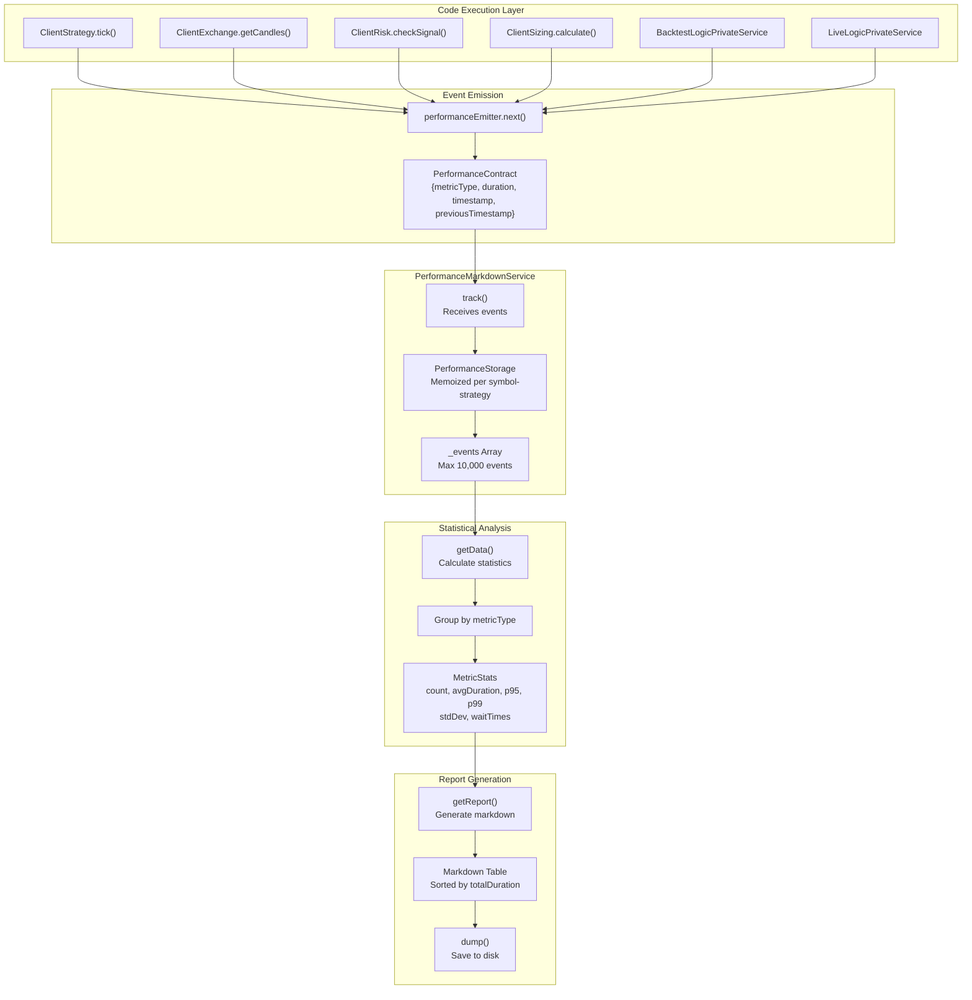
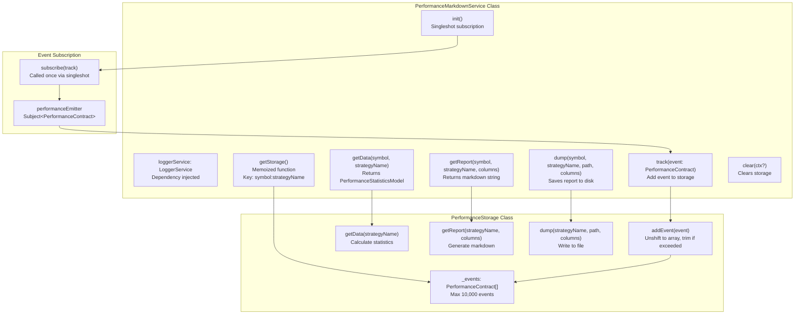
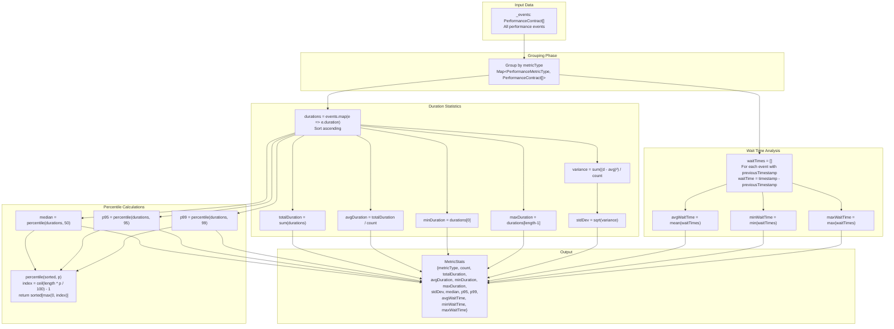
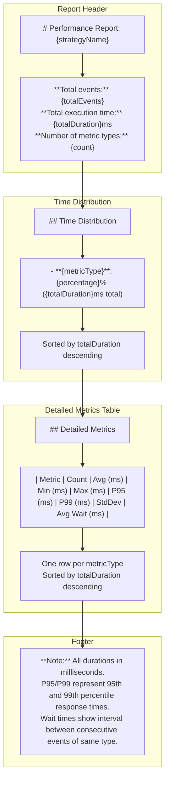

# Performance Metrics

<details>
<summary>Relevant source files</summary>

The following files were used as context for generating this wiki page:

- [src/config/emitters.ts](src/config/emitters.ts)
- [src/function/event.ts](src/function/event.ts)
- [src/index.ts](src/index.ts)
- [src/lib/services/markdown/BacktestMarkdownService.ts](src/lib/services/markdown/BacktestMarkdownService.ts)
- [src/lib/services/markdown/HeatMarkdownService.ts](src/lib/services/markdown/HeatMarkdownService.ts)
- [src/lib/services/markdown/LiveMarkdownService.ts](src/lib/services/markdown/LiveMarkdownService.ts)
- [src/lib/services/markdown/PartialMarkdownService.ts](src/lib/services/markdown/PartialMarkdownService.ts)
- [src/lib/services/markdown/PerformanceMarkdownService.ts](src/lib/services/markdown/PerformanceMarkdownService.ts)
- [src/lib/services/markdown/RiskMarkdownService.ts](src/lib/services/markdown/RiskMarkdownService.ts)
- [src/lib/services/markdown/ScheduleMarkdownService.ts](src/lib/services/markdown/ScheduleMarkdownService.ts)
- [src/lib/services/markdown/WalkerMarkdownService.ts](src/lib/services/markdown/WalkerMarkdownService.ts)
- [src/model/Column.model.ts](src/model/Column.model.ts)
- [types.d.ts](types.d.ts)

</details>


## Purpose and Scope

This page documents the performance tracking system implemented by `PerformanceMarkdownService`, which collects timing metrics, calculates statistical aggregates, and generates bottleneck analysis reports. The system tracks operation durations throughout strategy execution and identifies performance bottlenecks.

For broader markdown report generation architecture and event subscription patterns, see [Markdown Report Generation](#13.1). For trading performance statistics including Sharpe ratio, PNL calculations, and win rate metrics, see [Statistics Calculation](#13.3).

---

## Performance Tracking Architecture

The performance tracking system follows a publish-subscribe pattern where code execution emits timing events that are collected, aggregated, and analyzed by `PerformanceMarkdownService`.



**Flow Description**:

1. **Emission**: Code execution emits `PerformanceContract` events via `performanceEmitter`
2. **Collection**: `PerformanceMarkdownService.track()` receives events and stores them in memoized `PerformanceStorage` instances
3. **Aggregation**: Events are grouped by `metricType` and statistical calculations are performed
4. **Analysis**: Metrics are sorted by total duration to identify bottlenecks
5. **Reporting**: Markdown tables present performance data with percentiles and wait times

**Sources**: [src/lib/services/markdown/PerformanceMarkdownService.ts:1-476]()

---

## PerformanceContract Data Model

The `PerformanceContract` interface defines the structure of performance tracking events emitted during execution.

| Field | Type | Description |
|-------|------|-------------|
| `metricType` | `PerformanceMetricType` | Categorizes the operation being measured |
| `duration` | `number` | Time taken for operation in milliseconds |
| `timestamp` | `number` | Unix timestamp in milliseconds when event occurred |
| `previousTimestamp` | `number \| null` | Timestamp of previous event of same type (for wait time calculation) |
| `symbol` | `string \| undefined` | Trading pair symbol (e.g., "BTCUSDT") |
| `strategyName` | `string \| undefined` | Strategy identifier for the operation |

### PerformanceMetricType

Common metric types used throughout the system:

- **Strategy Operations**: `"strategy.tick"`, `"strategy.getSignal"`, `"strategy.backtest"`
- **Exchange Operations**: `"exchange.getCandles"`, `"exchange.getAveragePrice"`
- **Risk Operations**: `"risk.checkSignal"`, `"risk.addSignal"`, `"risk.removeSignal"`
- **Sizing Operations**: `"sizing.calculate"`
- **Orchestration**: `"backtest.iteration"`, `"live.iteration"`, `"walker.strategy"`

**Sources**: [src/contract/Performance.contract.ts](), [types.d.ts:5-8]()

---

## PerformanceMarkdownService Implementation



### Class Structure

**PerformanceMarkdownService** [src/lib/services/markdown/PerformanceMarkdownService.ts:312-476]():

| Member | Type | Purpose |
|--------|------|---------|
| `loggerService` | `LoggerService` | Debug logging via dependency injection |
| `getStorage` | `Memoized function` | Returns or creates `PerformanceStorage` per symbol-strategy pair |
| `track` | `async (event) => void` | Processes performance events and adds to storage |
| `getData` | `async (symbol, strategyName)` | Returns aggregated statistics |
| `getReport` | `async (symbol, strategyName, columns)` | Generates markdown report |
| `dump` | `async (symbol, strategyName, path, columns)` | Saves report to disk |
| `clear` | `async (ctx?)` | Clears storage (all or specific symbol-strategy) |
| `init` | `singleshot async ()` | Subscribes to `performanceEmitter` once |

**PerformanceStorage** [src/lib/services/markdown/PerformanceMarkdownService.ts:81-283]():

| Member | Type | Purpose |
|--------|------|---------|
| `_events` | `PerformanceContract[]` | Bounded queue (max 10,000 events) |
| `addEvent` | `(event) => void` | Unshifts event, trims queue if exceeded |
| `getData` | `async (strategyName)` | Calculates statistics grouped by metric type |
| `getReport` | `async (strategyName, columns)` | Generates markdown with tables and summaries |
| `dump` | `async (strategyName, path, columns)` | Writes markdown file to disk |

### Storage Boundaries

**Maximum Events Per Storage Instance**: 10,000 (vs 250 for other markdown services)

This higher limit accommodates fine-grained performance tracking where operations occur more frequently than trading signals.

**Memoization Key**: `"${symbol}:${strategyName}"`

Each symbol-strategy combination maintains isolated storage, preventing cross-contamination of performance data.

**Sources**: [src/lib/services/markdown/PerformanceMarkdownService.ts:74-76](), [src/lib/services/markdown/PerformanceMarkdownService.ts:320-323]()

---

## Performance Metrics Collection

### Statistical Calculations



### Metric Definitions

| Statistic | Calculation | Purpose |
|-----------|------------|---------|
| `count` | Number of events | Volume of operations performed |
| `totalDuration` | Sum of all durations | Total time spent in this operation |
| `avgDuration` | `totalDuration / count` | Average time per operation |
| `minDuration` | Minimum duration | Best case performance |
| `maxDuration` | Maximum duration | Worst case performance |
| `stdDev` | Standard deviation | Variability in operation times |
| `median` | 50th percentile | Typical operation time (unaffected by outliers) |
| `p95` | 95th percentile | Upper bound for most operations |
| `p99` | 99th percentile | Upper bound for nearly all operations |
| `avgWaitTime` | Mean time between consecutive events | Operation frequency |
| `minWaitTime` | Shortest wait between events | Maximum throughput observed |
| `maxWaitTime` | Longest wait between events | Minimum throughput observed |

### Percentile Calculation Algorithm

[src/lib/services/markdown/PerformanceMarkdownService.ts:68-72]():

```typescript
function percentile(sortedArray: number[], p: number): number {
  if (sortedArray.length === 0) return 0;
  const index = Math.ceil((sortedArray.length * p) / 100) - 1;
  return sortedArray[Math.max(0, index)];
}
```

**Sources**: [src/lib/services/markdown/PerformanceMarkdownService.ts:104-184](), [src/lib/services/markdown/PerformanceMarkdownService.ts:68-72]()

---

## Report Generation

### Markdown Report Structure



### Bottleneck Analysis

The report automatically identifies bottlenecks by sorting metrics in descending order of `totalDuration`. This places the most time-consuming operations at the top of both the time distribution section and the detailed metrics table.

**Time Distribution Calculation** [src/lib/services/markdown/PerformanceMarkdownService.ts:232-235]():

```typescript
const percentages = sortedMetrics.map((metric) => {
  const pct = (metric.totalDuration / stats.totalDuration) * 100;
  return `- **${metric.metricType}**: ${pct.toFixed(1)}% (${metric.totalDuration.toFixed(2)}ms total)`;
});
```

### Column Configuration

Performance reports use the `ColumnModel<MetricStats>` interface defined in [src/model/Column.model.ts:26-38](). Default columns are specified in `COLUMN_CONFIG.performance_columns`.

**Columns Type Definition** [src/lib/services/markdown/PerformanceMarkdownService.ts:47]():

```typescript
export type Columns = ColumnModel<MetricStats>;
```

The column system allows customization of which statistics appear in reports and how they are formatted.

**Sources**: [src/lib/services/markdown/PerformanceMarkdownService.ts:194-254](), [src/lib/services/markdown/PerformanceMarkdownService.ts:232-235]()

---

## Event Subscription and Listeners

### listenPerformance Function

Users subscribe to performance events using the `listenPerformance` function exported from the public API.

[src/function/event.ts:295-310]():

```typescript
export function listenPerformance(fn: (event: PerformanceContract) => void) {
  backtest.loggerService.log(LISTEN_PERFORMANCE_METHOD_NAME);
  return performanceEmitter.subscribe(queued(async (event) => fn(event)));
}
```

**Key Features**:
- **Queued Processing**: Callbacks are wrapped with `queued()` from functools-kit, ensuring sequential execution even for async handlers
- **Unsubscribe Support**: Returns unsubscribe function to stop listening
- **Logging**: All listener registrations are logged via `loggerService`

### Internal Subscription

`PerformanceMarkdownService` subscribes to the `performanceEmitter` automatically during initialization:

[src/lib/services/markdown/PerformanceMarkdownService.ts:445-450]():

```typescript
protected init = singleshot(async () => {
  this.loggerService.log("performanceMarkdownService init");
  performanceEmitter.subscribe(this.track);
});
```

The `singleshot` wrapper ensures subscription happens only once, even if multiple operations trigger initialization.

**Sources**: [src/function/event.ts:295-310](), [src/lib/services/markdown/PerformanceMarkdownService.ts:445-450]()

---

## Usage Examples

### Basic Performance Tracking

```typescript
import { listenPerformance, Backtest } from "backtest-kit";

// Subscribe to performance events
const unsubscribe = listenPerformance((event) => {
  console.log(`${event.metricType}: ${event.duration.toFixed(2)}ms`);
});

// Run backtest (emits performance events automatically)
await Backtest.run("BTCUSDT", {
  strategyName: "my-strategy",
  exchangeName: "binance",
  frameName: "1d-backtest"
});

// Stop listening
unsubscribe();
```

### Generating Performance Reports

```typescript
import { Performance } from "backtest-kit";

// Get performance statistics
const stats = await Performance.getData("BTCUSDT", "my-strategy");

console.log("Total time:", stats.totalDuration, "ms");
console.log("Events:", stats.totalEvents);

// Identify bottlenecks (sorted by totalDuration descending)
const bottlenecks = Object.values(stats.metricStats)
  .sort((a, b) => b.totalDuration - a.totalDuration)
  .slice(0, 3);

bottlenecks.forEach(metric => {
  console.log(`${metric.metricType}: ${metric.totalDuration}ms (${metric.count} calls)`);
});

// Generate and save report
await Performance.dump("BTCUSDT", "my-strategy");
// Saved to: ./dump/performance/my-strategy.md
```

### Custom Column Configuration

```typescript
import { Performance, ColumnModel, MetricStats } from "backtest-kit";

// Define custom columns
const customColumns: ColumnModel<MetricStats>[] = [
  {
    key: "metric",
    label: "Operation",
    format: (stat) => stat.metricType,
    isVisible: () => true
  },
  {
    key: "count",
    label: "Calls",
    format: (stat) => stat.count.toString(),
    isVisible: () => true
  },
  {
    key: "total",
    label: "Total Time (ms)",
    format: (stat) => stat.totalDuration.toFixed(2),
    isVisible: () => true
  },
  {
    key: "p99",
    label: "P99 (ms)",
    format: (stat) => stat.p99.toFixed(2),
    isVisible: () => true
  }
];

// Generate report with custom columns
const markdown = await Performance.getReport(
  "BTCUSDT",
  "my-strategy",
  customColumns
);
console.log(markdown);
```

### Monitoring Live Trading Performance

```typescript
import { listenPerformance, Live } from "backtest-kit";

const operationCounts = new Map<string, number>();

listenPerformance((event) => {
  const count = operationCounts.get(event.metricType) || 0;
  operationCounts.set(event.metricType, count + 1);
  
  // Alert on slow operations
  if (event.duration > 1000) {
    console.warn(`Slow operation: ${event.metricType} took ${event.duration}ms`);
  }
  
  // Log periodic summary
  if (count % 100 === 0) {
    console.log(`${event.metricType}: ${count} operations completed`);
  }
});

// Start live trading
Live.background("BTCUSDT", {
  strategyName: "my-strategy",
  exchangeName: "binance"
});
```

### Clearing Performance Data

```typescript
import { Performance } from "backtest-kit";

// Clear specific symbol-strategy pair
await Performance.clear({ 
  symbol: "BTCUSDT", 
  strategyName: "my-strategy" 
});

// Clear all performance data
await Performance.clear();
```

**Sources**: [src/lib/services/markdown/PerformanceMarkdownService.ts:295-450](), [src/function/event.ts:295-310](), [src/classes/Performance.ts]()

---

## Integration with Other Systems

### Relationship to Other Markdown Services

`PerformanceMarkdownService` follows the same architectural patterns as other markdown services:

| Service | Purpose | Max Events | Key Metric |
|---------|---------|------------|------------|
| `BacktestMarkdownService` | Trading signal analysis | 250 | Sharpe ratio, win rate |
| `LiveMarkdownService` | Real-time trading events | 250 | PNL, signal lifecycle |
| `WalkerMarkdownService` | Strategy comparison | N/A | Best performer by metric |
| `PerformanceMarkdownService` | Execution profiling | 10,000 | Duration, percentiles |
| `PartialMarkdownService` | Profit/loss milestones | 250 | Partial exits |
| `RiskMarkdownService` | Risk rejections | 250 | Rejection reasons |

The higher event limit (10,000 vs 250) reflects the granularity of performance tracking compared to trading events.

### Performance Event Sources

Performance events can be emitted from any code that executes during strategy lifecycle:

- **ClientStrategy**: Signal generation, tick processing, backtest iterations
- **ClientExchange**: Candle fetching, VWAP calculations
- **ClientRisk**: Risk validation checks
- **ClientSizing**: Position size calculations
- **Logic Services**: Backtest/Live/Walker orchestration

**Sources**: [src/lib/services/markdown/PerformanceMarkdownService.ts:1-476](), [src/lib/services/markdown/BacktestMarkdownService.ts:1-464](), [src/lib/services/markdown/LiveMarkdownService.ts:1-612]()